# Onto-OSINT — Ontology-Based OSINT Report System

설정 파일 하나만 수정하면 어떤 주제든 자동 OSINT 모니터링이 가능한 범용 시스템.
GitHub Actions로 매일 자동 실행되며, 온톨로지를 진화시키고 지식그래프를 구축하여 보고서를 생성한다.

## 핵심 기능

- **설정 기반 범용성** — `config/osint-config.json` 하나로 주제/키워드/검색엔진/온톨로지 시드 설정
- **온톨로지 진화** — 매일 수집된 정보로 온톨로지가 자동 확장
- **지식그래프** — 엔티티 간 관계를 트리플로 축적, Mermaid로 시각화
- **온톨로지 추론** — 명시적 관계로부터 암시적 관계를 추론
- **기사 추적** — 이전 보고서와 교차 비교하여 후속 보도 추적
- **GitHub Actions** — 매일 자동 실행, Wiki 자동 발행

## 파이프라인 아키텍처

```mermaid
graph LR
    A[Phase 1<br/>수집 Collect] --> B[Phase 2<br/>추출 Extract]
    B --> C[Phase 3<br/>온톨로지 Ontology]
    C --> D[Phase 4<br/>그래프 Graph]
    D --> E[Phase 5<br/>보고서 Report]
    E --> F[Phase 6<br/>발행 Publish]

    A -->|search-results.json| B
    B -->|index.json<br/>entities.json| C
    C -->|schema.json<br/>instances.json| D
    D -->|kg/YYYY-MM-DD.json<br/>report-basis.md| E
    E -->|reports/YYYY/MM/DD.md| F

    style A fill:none,stroke:#888
    style B fill:none,stroke:#888
    style C fill:none,stroke:#888
    style D fill:none,stroke:#888
    style E fill:none,stroke:#888
    style F fill:none,stroke:#888
```



| Phase | 에이전트 | 핵심 작업 | 산출물 |
|-------|----------|----------|--------|
| 1. 수집 | osint-collector | 다국어 웹검색 | `search-results.json` |
| 2. 추출 | osint-extractor | 엔티티/관계 추출 + 태깅 | `index.json`, `items/`, `entities.json` |
| 3. 온톨로지 | osint-reasoner | 스키마/인스턴스 확장 | `schema.json`, `instances.json` |
| 4. 그래프 | osint-reasoner | KG 구성 + 추론 | `kg/YYYY-MM-DD.json`, `analysis.md` |
| 5. 보고서 | osint-reporter | KG 시각화 포함 보고서 | `reports/YYYY/MM/YYYY-MM-DD.md` |
| 6. 발행 | — | Git commit + Wiki | — |

## 빠른 시작

### 1. 이 리포지토리를 Fork

### 2. 설정 수정

`config/osint-config.json`을 열어 다음을 수정한다:

```jsonc
{
  "project": {
    "topic": "AI 안전성 동향",           // 추적할 주제
    "goals": ["주요 연구 동향 모니터링"], // 목표
    "scope": {
      "include": ["AI safety", "alignment"], // 포함 범위
      "exclude": ["AI art", "entertainment"] // 제외 범위
    }
  },
  "search": {
    "keywords": {
      "ko": ["AI 안전성", "AI 정렬"],
      "en": ["AI safety", "AI alignment"]
    }
  },
  "ontology": {
    "seed_classes": [/* 도메인 엔티티 유형 정의 */],
    "seed_relations": [/* 도메인 관계 유형 정의 */],
    "reasoning_rules": [/* 추론 규칙 정의 */]
  }
}
```

### 3. GitHub Secrets 설정

| Secret | 설명 |
|--------|------|
| `CLAUDE_CODE_OAUTH_TOKEN` | Claude Code OAuth 토큰 |

`GITHUB_TOKEN`은 자동 제공된다.

### 4. 워크플로우 스케줄 확인

`.github/workflows/daily-osint-report.yml`의 cron 스케줄이 원하는 시간인지 확인한다.
기본값: UTC 23:00 (KST 08:00).

### 5. 수동 실행 (테스트)

GitHub Actions → "Daily OSINT Report" → "Run workflow" → 실행

## 디렉토리 구조

```
onto-osint/
├── config/
│   └── osint-config.json          # 유일한 설정 파일 (fork 후 이것만 수정)
├── ontology/
│   ├── schema.json                # 온톨로지 스키마 (자동 진화)
│   ├── instances.json             # 엔티티 인스턴스 (자동 축적)
│   ├── kg/
│   │   ├── YYYY-MM-DD.json        # 일별 KG 스냅샷
│   │   └── cumulative.json        # 누적 KG
│   └── reasoning-log.md           # 추론 로그
├── sources/YYYY-MM-DD/            # 파이프라인 중간 산출물
│   ├── search-results.json
│   ├── index.json
│   ├── items/src-XXX.json
│   ├── entities.json
│   ├── analysis.md
│   └── report-basis.md
├── reports/YYYY/MM/               # 최종 보고서
│   └── YYYY-MM-DD.md
├── .claude/
│   ├── agents/                    # 에이전트 역할 정의
│   └── skills/onto-osint-report/  # 오케스트레이터 + 참조 스킬
├── .github/workflows/
│   └── daily-osint-report.yml     # GitHub Actions 워크플로우
├── CLAUDE.md                      # 프로젝트 규칙
└── README.md
```

## 온톨로지 구조

### 클래스 계층 (seed → 자동 확장)
기본 시드: `Entity` → `Person`, `Organization`, `Event`, `Location`, `Concept`
파이프라인 실행마다 새로운 하위 클래스가 자동으로 추가된다.

### 관계 유형 (seed → 자동 확장)
기본 시드: `participatesIn`, `affiliatedWith`, `locatedIn`, `relatedTo`, `causedBy`, `follows`, `mentions`, `opposes`, `cooperatesWith`
도메인에 맞는 새로운 관계 유형이 자동으로 발견된다.

### 추론 규칙
- **전이성(Transitivity):** A→B, B→C 이면 A→C 간접 관계
- **사건 체인(Event Chain):** 사건 인과 관계의 전이적 추론
- **공동 참여(Co-participation):** 같은 사건 참여 엔티티 간 잠재적 관계

## 커스텀 검색 사이트 추가

`config/osint-config.json`의 `search.custom_sites`에 추가:

```json
{
  "id": "my-site",
  "name": "My Domain Site",
  "search_url": "https://example.com/search?q={query}",
  "languages": ["en"],
  "enabled": true
}
```

## 라이선스

MIT
