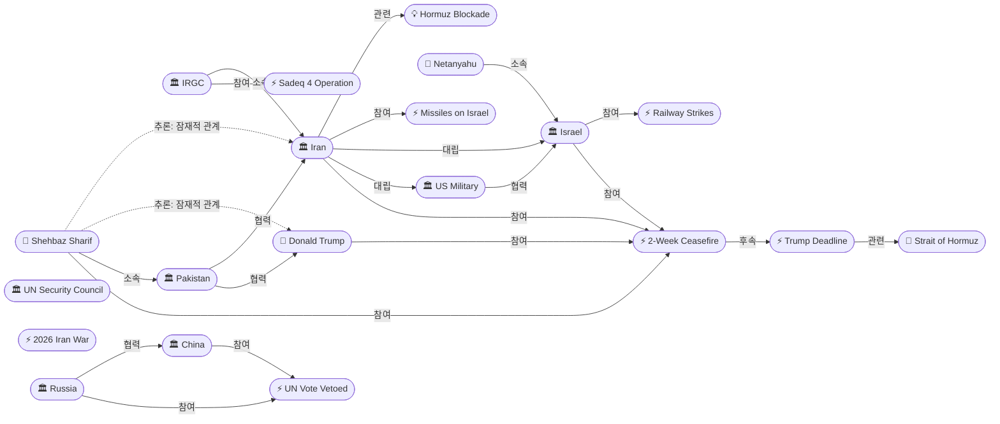
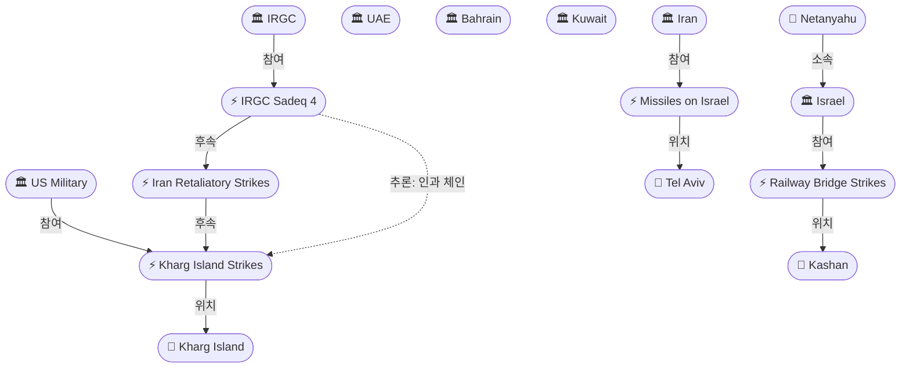
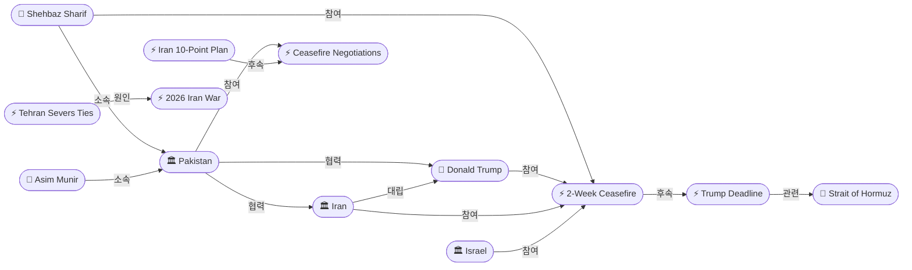

# 2026-04-07 2026 Iran War OSINT 일일 보고서

## 요약

전쟁 39일차, 하루 동안 극적인 반전이 있었다. 오전에는 이스라엘이 이란 전역 8개 철도/교량을 공습하고 미군이 하르그섬을 추가 타격하며 에스컬레이션이 최고조에 달했다. 이란은 유대교 공휴일에 이스라엘 본토에 탄도미사일을 발사하고, IRGC는 UAE·바레인·쿠웨이트의 에너지 시설을 공격했다(Sadeq 4 작전 96차). 그러나 저녁, 파키스탄 총리 Shehbaz Sharif와 야전원수 Asim Munir의 중재로 트럼프가 **2주 휴전**에 합의했다. 이란의 호르무즈 해협 즉시 개방이 조건이며, 이스라엘도 공격 중단에 동의했다. 이란은 파키스탄 제안을 "긍정적으로 검토 중"이라고 밝혔다.

## 주요 뉴스

### 1. 트럼프, 파키스탄 중재로 2주 휴전 합의 — 호르무즈 개방 조건
- **출처:** [Axios](https://www.axios.com/2026/04/07/iran-2-week-ceasfire-trump-pakistan)
- **일시:** 2026-04-07
- **내용:** 트럼프 대통령이 파키스탄 총리 Shehbaz Sharif 및 야전원수 Asim Munir과의 대화를 기반으로 이란에 대한 폭격을 2주간 중단하기로 합의했다. 조건은 이란이 호르무즈 해협을 "완전하고 즉각적이며 안전하게" 개방하는 것이다. 이스라엘도 공격 중단에 동의했으며, 이란은 "긍정적으로 검토 중"이라고 밝혔다. 트럼프는 이란의 10개항 평화안을 "협상의 실행 가능한 기반"이라고 평가했다.
- **상태:** 신규
- **관련 엔티티:** Donald Trump, Shehbaz Sharif, Asim Munir, Iran, Pakistan, Israel, Strait of Hormuz

### 2. 파키스탄, 핵심 중재자로 부상 — 양측에 2주 휴전 제안
- **출처:** [Axios](https://www.axios.com/2026/04/07/iran-us-ceasefire-pakistan-two-weeks), [Al Jazeera](https://www.aljazeera.com/news/2026/4/7/pakistan-appeals-to-trump-to-extend-deadline-iran-to-reopen-strait-of-hormuz)
- **일시:** 2026-04-07
- **내용:** 파키스탄 총리 Sharif는 외교 노력이 "꾸준하고 강력하게 진행되고 있다"며 트럼프에게 마감시한 2주 연장을, 이란에게 호르무즈 해협 "선의의 제스처"로서의 개방을 요청했다. 파키스탄은 지난 수주간 미국-이란 간 핵심 중재자 역할을 수행해왔다.
- **상태:** 신규
- **관련 엔티티:** Shehbaz Sharif, Pakistan, Donald Trump, Iran

### 3. 이스라엘, 이란 전역 철도·교량 8개소 공습 — 최소 2명 사망
- **출처:** [Al Jazeera](https://www.aljazeera.com/news/2026/4/7/israel-warns-iranians-to-avoid-trains-as-trump-deadline-approaches)
- **일시:** 2026-04-07
- **내용:** 이스라엘 공군이 테헤란, 카라지, 타브리즈, 카샨, 쿰 등 이란 전역에서 8개 철도 구간과 교량을 폭격했다. 공격 전 X(옛 트위터)를 통해 이란인들에게 "21:00 이란 시각까지 열차를 이용하지 말라"고 경고했다. 카샨시 야히아 아바드 철교 공격으로 최소 2명이 사망했으며, 제2도시 마슈하드 발착 전 열차가 무기한 운휴되었다.
- **상태:** 신규
- **관련 엔티티:** Israel, Benjamin Netanyahu, Iran, Kashan, Qom, Mashhad

### 4. 네타냐후, 철도/교량 공격 공식 확인 — "테러 정권 분쇄"
- **출처:** [ANI](https://aninews.in/news/world/middle-east/crushing-the-terrorist-regime-netanyahu-confirms-strikes-on-irans-bridges-and-railways-to-dismantle-irgc20260407203322/)
- **일시:** 2026-04-07
- **내용:** 네타냐후 이스라엘 총리가 이란 교량 및 철도 공격을 공식 확인하며, 목표는 IRGC 물류 네트워크 해체라고 밝혔다. "테러 정권을 분쇄하겠다"고 선언했다.
- **상태:** 신규
- **관련 엔티티:** Benjamin Netanyahu, Israel, IRGC

### 5. 이란, 유대교 공휴일에 이스라엘 중남부 탄도미사일 공격
- **출처:** [Times of Israel](https://www.timesofisrael.com/liveblog-april-7-2026/)
- **일시:** 2026-04-07
- **내용:** 이란이 유대교 공휴일에 이스라엘 중부와 남부에 탄도미사일 일제 사격을 감행했다. 이란-이스라엘 간 보복 공격 사이클이 지속되고 있다.
- **상태:** 신규
- **관련 엔티티:** Iran, IRGC, Israel, Tel Aviv

### 6. IRGC, 걸프 에너지 시설 대규모 공격 — Sadeq 4 작전 96차
- **출처:** [PBS](https://www.pbs.org/newshour/world/iran-intensifies-attacks-on-gulf-energy-sites-after-israel-struck-its-key-gas-field)
- **일시:** 2026-04-07
- **내용:** IRGC가 "Sadeq 4 작전" 96차 공격으로 UAE Habshan의 Exxon/Chevron 가스 시설, UAE Al Ruwais 석유화학 공장, 바레인 Sitrah 석유화학 단지, 쿠웨이트 Shuaiba 석유화학 시설을 타격했다. Shuaiba 단지는 완전 가동 중단되었으며, IRGC는 "2차 작전은 더 파괴적일 것"이라고 경고했다.
- **상태:** 신규
- **관련 엔티티:** IRGC, Iran, UAE, Bahrain, Kuwait

### 7. UN 안보리 호르무즈 결의안 — 러시아·중국 거부권 (11-2-2)
- **출처:** [UN News](https://news.un.org/en/story/2026/04/1167261)
- **일시:** 2026-04-07
- **내용:** 호르무즈 해협 재개방을 촉구하는 안보리 결의안에 11개국이 찬성했으나 러시아와 중국이 거부권을 행사하고 콜롬비아와 파키스탄이 기권했다. 원안(바레인 제안)은 "모든 필요한 수단"(군사력 포함)을 승인하는 내용이었으나, 러시아·중국·프랑스의 반대로 공격적 조항을 삭제한 수정안도 거부되었다. 러시아는 "미국·이스라엘의 불법 공격을 무시한다"고, 중국은 "분쟁의 근본 원인을 반영하지 못한다"고 비판했다.
- **상태:** 업데이트 ← 2026-04-07 "러시아·중국 안보리 거부권"
- **관련 엔티티:** UN Security Council, Russia, China, Pakistan, Strait of Hormuz

### 8. 민간 피해 심화 — "참을 수 없는 민간인의 고통" (Soufan Center)
- **출처:** [Soufan Center](https://thesoufancenter.org/intelbrief-2026-april-7/)
- **일시:** 2026-04-07
- **내용:** Soufan Center는 이란, 이스라엘, 미국 등 모든 교전 당사자가 민간 인프라를 전쟁 지렛대로 사용하고 있다고 분석했다. 학교, 병원, 유류 저장고, 호텔, 공항이 정기적으로 공격받고 있으며, 민간 인프라 파괴가 전쟁을 "견딜 수 없는 것"으로 만들기 위한 전략적 수단이 되고 있다고 경고했다.
- **상태:** 신규
- **관련 엔티티:** Iran, US Military, Israel

## 지식그래프

### 오늘의 주요 관계

1. **파키스탄 중재 부상:** Pakistan(Sharif+Munir)이 US-Iran 2주 휴전의 핵심 중재자로 등장 — 양측과 협력 관계
2. **이스라엘 교통 인프라 타격:** Israel이 이란 전역 철도/교량을 공격하며 새로운 에스컬레이션 축 생성
3. **IRGC 걸프 에너지 확대 공격:** Operation Sadeq 4로 UAE/바레인/쿠웨이트 시설까지 타격 범위 확대
4. **보복 사이클:** 하르그섬 공습 → 이란 보복 → Sadeq 4 걸프 확대 공격 (인과 체인)
5. **에스컬레이션 속 휴전:** 극한 에스컬레이션과 2주 휴전이 같은 날 동시 발생

### 전체 지식그래프 시각화

### 군사 작전 — 에스컬레이션 체인

### 휴전 협상 — 파키스탄 중재

## 온톨로지 변경

| 변경 유형 | 대상 | 근거 |
|----------|------|------|
| 새 엔티티 (인물) | Shehbaz Sharif, Asim Munir, Benjamin Netanyahu | 파키스탄 중재자, 이스라엘 총리 — 금일 핵심 행위자 |
| 새 엔티티 (조직) | Pakistan, UAE, Bahrain, Kuwait | 중재국 및 IRGC 공격 피해국 |
| 새 엔티티 (사건) | 2-Week Ceasefire, Railway Strikes, Sadeq 4, Ballistic Missiles on Israel | 금일 주요 사건 |
| 새 엔티티 (장소) | Kashan, Qom, Mashhad | 이스라엘 철도 공격 대상 도시 |
| 스키마 확장 | 없음 | 기존 클래스/관계로 충분히 표현 가능 |

## 추론 결과

| 추론 | 신뢰도 | 근거 |
|------|--------|------|
| Sharif ↔ Trump 잠재적 관계 | 0.85 | 양측 모두 2주 휴전 합의에 참여 |
| Sharif ↔ Iran 잠재적 관계 | 0.85 | 양측 모두 2주 휴전 합의에 참여 |
| Railway Strikes → 2026 Iran War 인과 체인 | 0.72 | 마감 → 철도 공격 → 전쟁 |
| Sadeq 4 → Kharg Island Strikes 인과 체인 | 0.72 | 하르그섬 공습 → 이란 보복 → Sadeq 4 확대 |

## 분석 및 평가

4월 7일은 2026 이란 전쟁의 가장 극적인 하루였다. 오전부터 양측이 역대 최대 수준의 에스컬레이션을 감행했으나, 저녁에 파키스탄의 중재로 2주 휴전에 합의하면서 전쟁의 국면이 전환될 가능성이 열렸다.

**에스컬레이션의 정점:** 이스라엘은 전례 없이 이란 전역의 철도와 교량을 공격하며 "민간 경고" 후 교통 인프라를 표적으로 삼았다. 네타냐후는 이를 IRGC 물류 해체를 위한 것이라고 설명했으나, 카샨에서 최소 2명이 사망하는 등 민간 피해가 발생했다. 동시에 이란은 유대교 공휴일에 이스라엘 본토를 탄도미사일로 공격하고, IRGC는 Sadeq 4 작전 96차 공격으로 UAE·바레인·쿠웨이트까지 공격 범위를 확대했다.

**외교적 전환:** 이란이 미국과 잔여 외교 채널을 단절한 상황에서, 파키스탄이 유일한 중재 채널로 부상했다. Sharif 총리와 Munir 야전원수가 양측과 직접 소통하여 2주 휴전을 성사시켰다. 이는 트럼프의 "전체 문명이 오늘 밤 죽을 수 있다"는 극단적 위협과 같은 날 이루어진 것으로, 위기 외교의 전형적 패턴을 보여준다.

**핵심 변수:** 이 휴전의 실현 여부는 (1) 이란의 호르무즈 해협 실제 개방 여부, (2) 이스라엘의 공격 중단 이행, (3) 2주 내 영구 합의를 위한 협상 진전에 달려 있다. 러시아·중국의 안보리 거부권 행사로 국제적 강제 메커니즘이 부재한 상황에서, 양측의 자발적 이행이 유일한 기반이다.

## 추적 항목

| 항목 | 최초 보고 | 상태 | 최신 업데이트 |
|------|----------|------|-------------|
| **2주 휴전 합의** | 2026-04-07 | **신규 — 핵심** | 파키스탄 중재, 호르무즈 개방 조건, 이란 "긍정 검토" |
| 트럼프 호르무즈 최후통첩 (4/8 20:00 ET) | 2026-04-07 | 대체됨 | 2주 휴전으로 마감시한 사실상 연기 |
| 이란 10개항 평화안 | 2026-04-07 | 활성 | 트럼프 "협상의 실행 가능한 기반"으로 재평가 |
| 호르무즈 해협 봉쇄 | 2026-04-07 | 활성 | 휴전 조건으로 개방 요구, 이란 검토 중 |
| IRGC 정보수장 사살 후 보복 | 2026-04-07 | 활성 | 보복 지속: Sadeq 4 작전으로 걸프 확대 |
| 이스라엘 철도/교량 공격 | 2026-04-07 | **신규** | 8개소 공격, 2명 사망, 마슈하드 열차 운휴 |
| IRGC Sadeq 4 걸프 에너지 공격 | 2026-04-07 | **신규** | UAE/바레인/쿠웨이트 시설 타격, 2차 경고 |
| F-15E 무장관제사 수색 | 2026-04-07 | 활성 | 조종사 구출 완료, 무장관제사 수색 중 |
| 민간인 피해 (3,500명+) | 2026-04-07 | 활성 | Soufan Center: 모든 당사자가 민간 인프라 지렛대로 사용 |
| 이란-미국 외교 단절 | 2026-04-07 | 활성 | 파키스탄이 유일한 중재 채널 |
| UN 안보리 거부권 | 2026-04-07 | 활성 | 11-2-2 투표, 러시아·중국 거부, 콜롬비아·파키스탄 기권 |

## 동향 요약

| 분류 | 상태 | 비고 |
|------|------|------|
| 군사 작전 | 에스컬레이션 → 휴전 전환 | 철도 공격, 탄도미사일, Sadeq 4 후 2주 휴전 합의 |
| 휴전 협상 | **돌파구** | 파키스탄 중재로 2주 휴전 합의 — 전쟁 시작 이래 최대 외교 성과 |
| 호르무즈 봉쇄 | 전환 가능 | 휴전 조건으로 개방 요구, 이란 검토 중 |
| 에너지 시장 | 위기 지속 | IRGC 걸프 시설 공격 확대, 쿠웨이트 Shuaiba 완전 가동 중단 |
| 국제 정세 | 분열 지속 | 러시아·중국 안보리 거부권, 파키스탄 중재자 부상 |
| 인도주의 | 악화 | 철도 공격 민간 사망, Soufan Center 경고 |

## 출처 목록

1. [US, Iran to pause war, agree to 2-week ceasefire](https://www.axios.com/2026/04/07/iran-2-week-ceasfire-trump-pakistan) - Axios, 2026-04-07
2. [Pakistan proposes 2-week Iran ceasefire ahead of Trump deadline](https://www.axios.com/2026/04/07/iran-us-ceasefire-pakistan-two-weeks) - Axios, 2026-04-07
3. [Pakistan appeals to Trump to extend deadline, Iran to reopen Hormuz Strait](https://www.aljazeera.com/news/2026/4/7/pakistan-appeals-to-trump-to-extend-deadline-iran-to-reopen-strait-of-hormuz) - Al Jazeera, 2026-04-07
4. [Israel hits railway bridge, threatens trains before Trump deadline expires](https://www.aljazeera.com/news/2026/4/7/israel-warns-iranians-to-avoid-trains-as-trump-deadline-approaches) - Al Jazeera, 2026-04-07
5. [Netanyahu confirms strikes on Iran's bridges and railways to dismantle IRGC](https://aninews.in/news/world/middle-east/crushing-the-terrorist-regime-netanyahu-confirms-strikes-on-irans-bridges-and-railways-to-dismantle-irgc20260407203322/) - ANI, 2026-04-07
6. [Iran fires ballistic missile salvos at central, southern Israel on Jewish holiday](https://www.timesofisrael.com/liveblog-april-7-2026/) - Times of Israel, 2026-04-07
7. [Iran intensifies attacks on Gulf energy sites after Israel struck its key gas field](https://www.pbs.org/newshour/world/iran-intensifies-attacks-on-gulf-energy-sites-after-israel-struck-its-key-gas-field) - PBS, 2026-04-07
8. [IRGC targets energy, petrochemical sites across Gulf](https://www.tribuneindia.com/news/world/irgc-targets-energy-petrochemical-sites-across-gulf-in-response-to-attack-on-irans-infra-says-2nd-phase-of-ops-will-be-more-devastating/) - Tribune India, 2026-04-07
9. [Security Council: Russia and China veto resolution on Strait of Hormuz](https://news.un.org/en/story/2026/04/1167261) - UN News, 2026-04-07
10. [The Human Dimension of the Iran War: The Intolerable Plight of Civilians](https://thesoufancenter.org/intelbrief-2026-april-7/) - Soufan Center, 2026-04-07
11. [Live updates: Trump agrees to two-week ceasefire with Iran](https://www.cnn.com/2026/04/07/world/live-news/iran-war-trump-us-israel) - CNN, 2026-04-07
12. [Trump announces 2-week ceasefire in Iran war](https://www.cbsnews.com/live-updates/iran-war-trump-deadline-power-plants-human-chains-israel-train-strikes/) - CBS News, 2026-04-07
13. [Trump agrees to two-week ceasefire after threatening massive attacks](https://www.nbcnews.com/world/iran/live-blog/live-updates-iran-war-trump-deadline-hormuz-infrastructure-ceasefire-rcna267039) - NBC News, 2026-04-07
14. [Trump pauses Iran strikes for two weeks to negotiate 10-point peace deal](https://www.foxnews.com/live-news/trump-iran-deadline-israel-hormuz-april-7) - Fox News, 2026-04-07
15. [Iran war: What is happening on day 39 of US-Israeli attacks?](https://www.aljazeera.com/news/2026/4/7/iran-war-what-is-happening-on-day-39-of-us-israeli-attacks) - Al Jazeera, 2026-04-07
16. [Iran war updates: Ceasefire response 'not good enough', says Trump](https://www.aljazeera.com/news/liveblog/2026/4/6/iran-war-live-tehran-rejects-trumps-tuesday-deadline-on-strait-of-hormuz) - Al Jazeera, 2026-04-06
17. [Iran rejects a U.S. ceasefire plan as Trump again threatens](https://www.npr.org/2026/04/06/nx-s1-5775383/iran-war-updates) - NPR, 2026-04-06
18. [US has struck Iranian military targets on Kharg Island](https://www.cnn.com/2026/04/07/middleeast/kharg-island-us-assault-risk-trump-intl) - CNN, 2026-04-07
19. [Iran defiant on eve of Trump's ceasefire deadline](https://www.al-monitor.com/originals/2026/04/iran-defiant-eve-trumps-ceasefire-deadline) - Al-Monitor, 2026-04-07
20. [Tehran Severs Remaining Diplomatic Ties With US](https://www.republicworld.com/world-news/iran-war-live-tehran-rejects-trumps-tuesday-deadline-on-strait-of-hormuz-trump-vows-strikes-on-irans-infrastructure-live-news) - Republic World, 2026-04-07
21. ['최후통첩' 13시간 앞으로‥트럼프 공격 명령 내리나](https://imnews.imbc.com/replay/2026/nwdesk/article/6813371_37004.html) - MBC, 2026-04-07
22. [이 시각 호르무즈‥휴전안 협상 전망은?](https://imnews.imbc.com/replay/2026/nwdesk/article/6813074_37004.html) - MBC, 2026-04-07
23. [미군, 이란 하르그섬 군시설 공격](https://imnews.imbc.com/news/2026/world/article/6813396_36925.html) - MBC, 2026-04-07
24. [Russia and China veto watered-down UN resolution on Hormuz](https://www.pbs.org/newshour/world/russia-and-china-veto-watered-down-un-resolution-aimed-at-reopening-the-strait-of-hormuz) - PBS, 2026-04-07
25. [China and Russia Veto Security Council Resolution on Hormuz](https://www.bloomberg.com/news/articles/2026-04-07/china-and-russia-veto-security-council-resolution-on-hormuz) - Bloomberg, 2026-04-07
