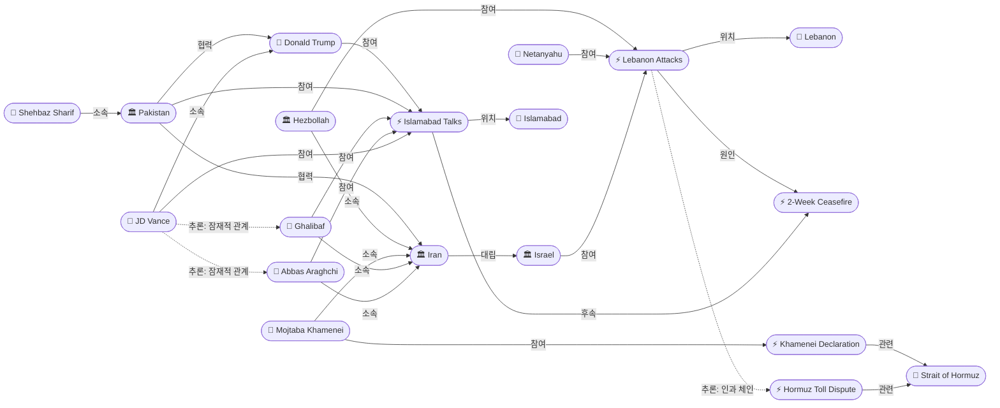
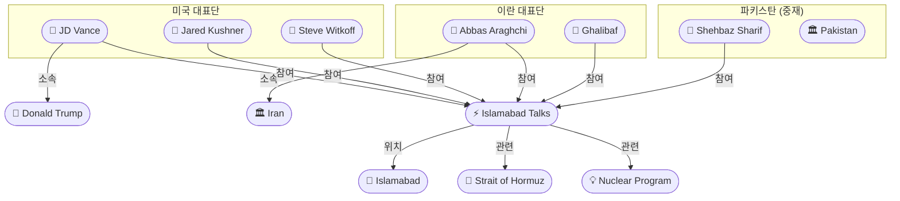
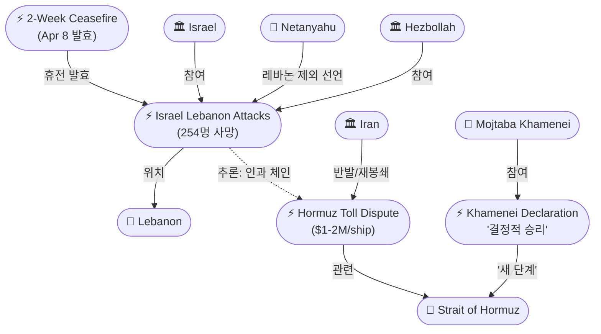

# 2026-04-10 2026 Iran War OSINT 일일 보고서

## 요약

전쟁 42일차(휴전 3일차), 2주 휴전은 이행 위기에 직면해 있다. 4월 8일 이스라엘이 휴전 직후 레바논을 대규모 공습하여 254명이 사망했고, 이란은 이에 반발하여 호르무즈 해협을 사실상 재봉쇄했다. 호르무즈에서는 선박당 100만~200만 달러의 통행료를 요구하며 4월 10일 기준 유조선 1척만이 통과했다. 이란 최고지도자 모즈타바 하메네이는 "결정적 승리"를 선언하고 호르무즈 관리의 "새로운 단계"를 예고했다. 그러나 외교적으로는 전환점이 열렸다. 밴스 미국 부통령이 이슬라마바드로 출발했고, 아라그치·갈리바프가 이끄는 이란 대표단도 도착하여 4월 11일 전쟁 이래 최초의 직접 대면 평화회담이 열릴 예정이다.

## 주요 뉴스

### 1. 이슬라마바드 평화회담 개시 — 전쟁 이래 최초 미-이란 직접 대면
- **출처:** [Al Jazeera](https://www.aljazeera.com/news/liveblog/2026/4/10/iran-war-live-israeli-attacks-on-lebanon-threaten-us-iran-ceasefire-talks), [Al Jazeera](https://www.aljazeera.com/news/2026/4/10/jd-vance-expects-positive-us-iran-war-talks-as-he-departs-for-pakistan)
- **일시:** 2026-04-10~11
- **내용:** JD 밴스 미국 부통령이 윗코프 중동특사, 쿠슈너와 함께 이슬라마바드로 출발했다. "이란이 진지하게 협상에 나오면 화해의 손길을 내밀 것이나, 미국을 농락하려 해서는 안 된다"고 밝혔다. 이란 측은 갈리바프 의회의장과 아라그치 외무장관이 이끄는 대표단이 공군 호위 하에 이슬라마바드에 도착했다. 대표단에는 국방회의 사무총장, 중앙은행 총재, 국회의원 등이 포함되었다. 파키스탄 총리 Sharif는 이번 회담이 "make-or-break"이라며 최소한 대화 연장을 목표로 한다고 밝혔다. 핵심 의제는 호르무즈 완전 개방, 핵 프로그램, 제재 해제이며, 이란은 레바논 휴전과 동결 자산 해제를 협상 전제조건으로 제시했다.
- **상태:** 신규
- **관련 엔티티:** JD Vance, Jared Kushner, Steve Witkoff, Abbas Araghchi, Mohammad Bagher Ghalibaf, Pakistan, Shehbaz Sharif, Islamabad

### 2. 이스라엘, 휴전 직후 레바논 대공습 — 254명 사망, 1,100명+ 부상
- **출처:** [NBC News](https://www.nbcnews.com/world/lebanon/lebanon-israel-attack-iran-ceasefire-hezbollah-rcna267260)
- **일시:** 2026-04-08
- **내용:** 이스라엘이 미-이란 휴전 선언 수시간 후 레바논 전역에 대규모 공습을 감행하여 최소 254명이 사망하고 1,100명 이상이 부상했다. 수도 베이루트에서만 91명이 사망했다. 이스라엘은 헤즈볼라를 표적으로 했다고 밝혔다. 네타냐후는 "이번 휴전에 레바논은 포함되지 않는다"고 공식 선언했으나, 중재국 파키스탄과 이란은 "레바논을 포함한 전 지역 즉각 휴전"이라고 반박했다. 이란 의회의장 갈리바프는 "저항 축(Resistance Axis)은 휴전의 불가분한 일부"이며 위반 시 "명시적 비용과 강력한 대응"이 있을 것이라고 경고했다. 트럼프는 네타냐후에게 전화로 공격 규모를 줄일 것을 요청했다.
- **상태:** 신규
- **관련 엔티티:** Israel, Lebanon, Hezbollah, Benjamin Netanyahu, Iran, Mohammad Bagher Ghalibaf

### 3. 호르무즈 해협 사실상 미개방 — 유조선 1척만 통과, 통행료 $1-2M 요구
- **출처:** [Axios](https://www.axios.com/2026/04/09/iran-us-strait-of-hormuz-khamenei), [Al Jazeera](https://www.aljazeera.com/economy/2026/4/10/shipping-in-strait-of-hormuz-at-a-trickle-despite-us-iran-ceasefire)
- **일시:** 2026-04-08~10
- **내용:** 휴전 조건인 호르무즈 해협 개방이 사실상 이행되지 않고 있다. 이란은 선박당 100만~200만 달러(배럴당 1달러, 암호화폐 결제)의 "안전 보장 통행료"를 요구하고 있다. CNN 분석에 따르면 4월 10일 오후 5시 30분(테헤란 시각) 기준 미국 제재 대상인 유조선 1척만이 해협을 통과했다. ADNOC(UAE 국영석유) CEO Sultan Al Jaber는 "해협이 열리지 않았다"고 확인했다. 트럼프는 "제한 없이, 통행료 없이" 개방을 요구했다. 블룸버그는 이란이 단순 봉쇄에서 호르무즈에 대한 "공식적 통제"를 제도화하려는 시도라고 분석했다.
- **상태:** 신규
- **관련 엔티티:** Iran, Strait of Hormuz, Donald Trump, UAE

### 4. 모즈타바 하메네이 "결정적 승리" 선언, 호르무즈 "새로운 단계" 예고
- **출처:** [Deccan Herald](https://www.deccanherald.com/world/middle-east/strait-of-hormuz-management-will-enter-new-phase-irans-supreme-leader-mojtaba-khamenei-3962795)
- **일시:** 2026-04-09
- **내용:** 이란 최고지도자 모즈타바 하메네이(2026년 3월 8일 선출, 故 알리 하메네이의 아들)가 아버지 사망 40일을 맞아 이란 국민이 미국-이스라엘과의 전쟁에서 "결정적 승리"를 거두었다고 선언했다. 호르무즈 해협 관리가 "새로운 단계"에 진입할 것이라고 밝혔다. 이는 이란이 봉쇄를 단순 전시 수단이 아닌 항구적인 주권 행사로 전환하려는 의지를 시사한다.
- **상태:** 신규
- **관련 엔티티:** Mojtaba Khamenei, Iran, Strait of Hormuz

### 5. 휴전 조건 상세 — 핵·호르무즈·제재가 핵심 의제
- **출처:** [Al Jazeera](https://www.aljazeera.com/news/2026/4/8/us-iran-ceasefire-deal-what-are-the-terms-and-whats-next)
- **일시:** 2026-04-08
- **내용:** 4월 8일 발효된 2주 휴전의 핵심 조건은 (1) 미국·이스라엘의 이란 공격 중단, (2) 이란의 호르무즈 해협 "완전하고 즉각적이며 안전한" 개방, (3) 이란의 이스라엘·걸프국 공격 중단이다. 트럼프는 이란의 10개항 평화안을 "협상의 실행 가능한 기반"이라고 재평가했다. 미국은 호르무즈 즉각 개방과 핵 포기를 요구하고, 이란은 전쟁 배상금과 호르무즈 주권 인정을 요구하고 있어 45일 내 합의는 어렵다는 분석이 지배적이다.
- **상태:** 업데이트 ← 2026-04-07 "2주 휴전 합의"
- **관련 엔티티:** Donald Trump, Iran, Pakistan, 2-Week Ceasefire, Nuclear Program

### 6. 영국·EU, 호르무즈 통행료 반대 및 레바논 휴전 포함 촉구
- **출처:** [CNBC](https://www.cnbc.com/2026/04/09/uk-cooper-iran-war-strait-of-hormuz-tolls-lebanon-israel-ceasefire.html), [EU Council](https://www.consilium.europa.eu/en/press/press-releases/2026/04/08/leaders-statement-on-the-two-week-ceasefire-concluded-between-the-united-states-and-iran/)
- **일시:** 2026-04-08~09
- **내용:** 영국은 호르무즈 해협의 "통행료 없는 자유 통행"을 요구하고, 레바논이 휴전에 반드시 포함되어야 한다고 주장했다. EU 지도자들은 휴전을 환영하며 "완전한 이행과 항구적 평화"를 촉구하는 공동 성명을 발표했다.
- **상태:** 신규
- **관련 엔티티:** United Kingdom, European Union, Strait of Hormuz, Lebanon

## 지식그래프

### 오늘의 주요 관계

1. **이슬라마바드 직접 대면:** Vance(US) ↔ Araghchi·Ghalibaf(Iran) — 전쟁 이래 최초 고위급 직접 대면, 파키스탄 중재
2. **레바논 = 휴전의 뇌관:** Israel → Lebanon 공습(254명 사망) → Iran 반발 → 호르무즈 재봉쇄
3. **호르무즈 전략 전환:** 봉쇄 → 통행료 → Mojtaba Khamenei "새 단계" — 전시 수단에서 주권 행사로 전환
4. **인과 체인:** 휴전 합의 → 이스라엘 레바논 공습 → 이란 호르무즈 재봉쇄 → 통행료 분쟁
5. **파키스탄 중재 격상:** Sharif "make-or-break" — 양측 대표단 이슬라마바드 도착

### 전체 지식그래프 시각화

### 이슬라마바드 협상 구조

### 휴전 위기 — 인과 체인

## 온톨로지 변경

| 변경 유형 | 대상 | 근거 |
|----------|------|------|
| 새 엔티티 (인물) | JD Vance, Jared Kushner, Steve Witkoff, Abbas Araghchi, Mohammad Bagher Ghalibaf, Mojtaba Khamenei | 이슬라마바드 협상 참가자 및 이란 최고지도자 — 핵심 행위자 |
| 새 엔티티 (조직) | Hezbollah, United Kingdom, European Union | 레바논 공습 관련 무장세력 및 국제 반응 행위자 |
| 새 엔티티 (장소) | Lebanon, Islamabad, Beirut | 협상 장소 및 레바논 공습 피해 지역 |
| 새 엔티티 (사건) | Israel Lebanon Attacks, Islamabad Peace Talks, Hormuz Toll Dispute, Mojtaba Khamenei Declaration | 금일 핵심 사건 |
| 새 엔티티 (개념) | Hormuz Toll/Management | 봉쇄에서 통행료/관리 모델로의 전환 |
| 스키마 확장 | 없음 | 기존 클래스/관계로 충분히 표현 가능 |

## 추론 결과

| 추론 | 신뢰도 | 근거 |
|------|--------|------|
| Vance ↔ Araghchi 잠재적 관계 | 0.85 | 이슬라마바드 평화회담 공동 참여 (최초 직접 대면) |
| Vance ↔ Ghalibaf 잠재적 관계 | 0.85 | 이슬라마바드 평화회담 공동 참여 |
| Vance → US Military 간접 소속 | 0.81 | Trump 소속 + 해병대 참전 경력 |
| Lebanon Attacks → Hormuz Toll Dispute 인과 체인 | 0.72 | 레바논 공격 → 이란 반발 → 호르무즈 재봉쇄/통행료 |
| Hezbollah → Iran 간접 소속 | 0.85 | 이란의 직접적 무장 대리 세력 (저항 축) |

## 분석 및 평가

4월 10일은 2주 휴전의 이행 가능성이 시험대에 오른 날이다. 3일간의 휴전 기간 동안 세 가지 핵심 위기가 동시에 진행되고 있다.

**위기 1 — 레바논 전선:** 이스라엘이 휴전 직후 레바논에서 254명을 살해한 대규모 공습은 휴전의 가장 큰 위협이다. 네타냐후의 "레바논은 휴전에 포함되지 않는다"는 주장은 중재국 파키스탄과 이란의 해석과 정면으로 충돌한다. 이란이 레바논 휴전을 이슬라마바드 협상의 전제조건으로 제시함에 따라, 이 문제가 해결되지 않으면 협상 자체가 무산될 수 있다. 트럼프가 네타냐후에게 공격 규모 축소를 요청한 것은 미국도 이 위기를 인식하고 있음을 보여준다.

**위기 2 — 호르무즈 비개방:** 휴전의 핵심 조건인 호르무즈 개방이 사실상 이행되지 않고 있다. 이란은 단순 봉쇄에서 "통행료" 모델로 전환하여 해협에 대한 주권을 기정사실화하려 하고 있다. 모즈타바 하메네이의 "결정적 승리"와 "새로운 단계" 선언은 이 전략의 정치적 프레이밍이다. ADNOC CEO가 "해협이 열리지 않았다"고 확인한 것은 산유국들도 이란의 주장을 인정하지 않는다는 신호다.

**전환점 — 이슬라마바드:** 이 모든 위기에도 불구하고, 밴스 부통령이 이끄는 미국 대표단과 아라그치·갈리바프가 이끄는 이란 대표단이 이슬라마바드에 도착한 것은 전쟁 시작 이래 최초의 직접 대면 외교다. 미국이 부통령급을 파견한 것은 협상의 격을 최대한 올린 것이며, 이란도 외무장관·의회의장·중앙은행 총재를 포함시켜 경제 의제까지 다룰 준비를 했다. 파키스탄은 "최소 대화 연장"이라는 현실적 목표를 설정하여 실패의 부담을 낮추고 있다.

**핵심 전망:** 4월 11일 이슬라마바드 첫 회담의 결과가 향후 전쟁의 방향을 결정할 것이다. 이란의 전제조건(레바논 휴전, 자산 해제)과 미국의 요구(호르무즈 무조건 개방, 핵 포기) 사이의 간극이 좁혀지지 않으면, 2주 휴전이 만료되는 4월 22일 이후 전쟁이 재개될 가능성이 높다.

## 추적 항목

| 항목 | 최초 보고 | 상태 | 최신 업데이트 |
|------|----------|------|-------------|
| **이슬라마바드 평화회담** | 2026-04-10 | **신규 — 핵심** | 밴스·아라그치·갈리바프 대표단 도착, 4/11 첫 대면 |
| **이스라엘 레바논 공습** | 2026-04-10 | **신규 — 위기** | 254명 사망, 휴전 범위 해석 충돌, 이란 전제조건 |
| **호르무즈 통행료 분쟁** | 2026-04-10 | **신규 — 핵심** | $1-2M/선박, 유조선 1척만 통과, 트럼프 무조건 개방 요구 |
| **모즈타바 하메네이 "새 단계" 선언** | 2026-04-10 | **신규** | "결정적 승리", 호르무즈 관리 전환 시사 |
| 2주 휴전 합의 | 2026-04-07 | 활성 — 위기 | 발효되었으나 레바논·호르무즈 문제로 이행 위기 |
| 호르무즈 해협 봉쇄 | 2026-04-07 | 활성 — 악화 | 봉쇄 → 통행료 모델 전환, 사실상 미개방 |
| 파키스탄 중재 역할 | 2026-04-07 | 활성 — 격상 | 이슬라마바드 주최, "make-or-break" |
| 이란 10개항 평화안 | 2026-04-07 | 활성 | 이슬라마바드 협상 기반으로 활용 예정 |
| 이란-미국 외교 단절 | 2026-04-07 | 활성 | 파키스탄이 유일한 중재 채널, 이슬라마바드에서 첫 직접 대면 |
| 민간인 피해 | 2026-04-07 | 악화 | 레바논 254명+ 추가 사망 |
| F-15E 무장관제사 수색 | 2026-04-07 | 활성 | 추가 보도 없음 |

## 동향 요약

| 분류 | 상태 | 비고 |
|------|------|------|
| 군사 작전 | 휴전 중 + 레바논 공습 | 이란 대상 공격 중단, 이스라엘의 레바논 공습 254명 사망 |
| 휴전 이행 | **위기** | 레바논 포함 여부 충돌, 호르무즈 미개방, 이란 통행료 부과 |
| 외교 | **전환점** | 이슬라마바드 최초 직접 대면 회담 4/11 예정, 밴스 부통령급 파견 |
| 호르무즈 봉쇄 | 악화 → 제도화 시도 | 통행료 모델 전환, 하메네이 "새 단계", 유조선 1척만 통과 |
| 에너지 시장 | 위기 지속 | 호르무즈 미개방, 유가 전쟁 전 대비 50%↑, 미국 인플레이션 급등 |
| 국제 정세 | 분열 | 영국·EU 레바논 휴전 포함 촉구, 이스라엘 거부 |
| 인도주의 | 악화 | 레바논 254명 사망 추가, WHO "방대한 인도주의적 필요" 경고 |

## 출처 목록

1. [Iran war live: Iranian delegation arrives in Pakistan for talks with US](https://www.aljazeera.com/news/liveblog/2026/4/10/iran-war-live-israeli-attacks-on-lebanon-threaten-us-iran-ceasefire-talks) - Al Jazeera, 2026-04-10
2. [JD Vance expects 'positive' US-Iran war talks as he departs for Pakistan](https://www.aljazeera.com/news/2026/4/10/jd-vance-expects-positive-us-iran-war-talks-as-he-departs-for-pakistan) - Al Jazeera, 2026-04-10
3. [Live updates: Trump issues warning to Iran ahead of high-stakes negotiations in Pakistan](https://www.cnn.com/2026/04/10/world/live-news/iran-war-trump-us-ceasefire) - CNN, 2026-04-10
4. [US-Iran talks in Pakistan: Who's attending, what's on the agenda?](https://www.aljazeera.com/news/2026/4/9/us-iran-talks-in-pakistan-whos-attending-whats-on-the-agenda) - Al Jazeera, 2026-04-09
5. [Pakistan sets modest goal for US-Iran summit: A deal to keep talks going](https://www.aljazeera.com/news/2026/4/10/pakistan-sets-modest-goal-for-us-iran-summit-a-deal-to-keep-talks-going) - Al Jazeera, 2026-04-10
6. [Iranian Negotiating Delegation Arrives in Pakistan under 'Aerial Escort'](https://iranwire.com/en/news/151037-iranian-negotiating-delegation-arrives-in-pakistan-under-aerial-escort/) - IranWire, 2026-04-10
7. [Vance to lead US negotiators at first round of Islamabad talks with Iran on Saturday](https://www.timesofisrael.com/vance-to-lead-us-negotiators-at-first-round-of-islamabad-talks-with-iran-on-saturday/) - Times of Israel, 2026-04-10
8. [Israel launches sprawling attacks on Lebanon after Iran ceasefire was declared](https://www.nbcnews.com/world/lebanon/lebanon-israel-attack-iran-ceasefire-hezbollah-rcna267260) - NBC News, 2026-04-08
9. [Day 41 of Middle East conflict — Netanyahu says there's no ceasefire in Lebanon](https://www.cnn.com/2026/04/09/world/live-news/iran-war-trump-us-ceasefire) - CNN, 2026-04-09
10. [Iran warns of 'strong responses' as Israel's attacks on Lebanon threaten ceasefire](https://www.nbcnews.com/world/iran/live-blog/live-updates-iran-war-ceasefire-trump-hormuz-israel-lebanon-rcna267390) - NBC News, 2026-04-09
11. [Lebanon fighting throws doubt over U.S.-Israel ceasefire with Iran](https://www.npr.org/2026/04/08/nx-s1-5777593/lebanon-fighting-throws-doubt-over-u-s-israel-ceasefire-with-iran) - NPR, 2026-04-08
12. [World reacts to 'brutal' Israeli attacks on Lebanon amid US-Iran truce](https://www.aljazeera.com/news/2026/4/8/world-reacts-to-brutal-israeli-attacks-on-lebanon-amid-us-iran-ceasefire) - Al Jazeera, 2026-04-08
13. [Strait of Hormuz remains all but closed, Trump demands Iran stop tolls](https://www.axios.com/2026/04/09/iran-us-strait-of-hormuz-khamenei) - Axios, 2026-04-09
14. [Shipping in Strait of Hormuz at a standstill despite US-Iran ceasefire](https://www.aljazeera.com/economy/2026/4/10/shipping-in-strait-of-hormuz-at-a-trickle-despite-us-iran-ceasefire) - Al Jazeera, 2026-04-10
15. [Strait of Hormuz shipping traffic is effectively at a standstill despite Iran ceasefire](https://www.nbcnews.com/world/iran/strait-hormuz-shipping-traffic-effectively-standstill-iran-ceasefire-rcna267391) - NBC News, 2026-04-09
16. [Trump wants Strait of Hormuz open 'without limitation, including tolls'](https://www.cnbc.com/2026/04/08/trump-iran-ceasefire-strait-of-hormuz-toll.html) - CNBC, 2026-04-08
17. [Iran Restricts Strait of Hormuz Access Despite Ceasefire With US](https://www.bloomberg.com/news/articles/2026-04-09/hormuz-traffic-still-blocked-as-iran-tries-to-formalize-control) - Bloomberg, 2026-04-09
18. [Strait of Hormuz management will enter new phase: Iran's supreme leader Mojtaba Khamenei](https://www.deccanherald.com/world/middle-east/strait-of-hormuz-management-will-enter-new-phase-irans-supreme-leader-mojtaba-khamenei-3962795) - Deccan Herald, 2026-04-09
19. [US-Iran ceasefire deal: What are the terms, and what's next?](https://www.aljazeera.com/news/2026/4/8/us-iran-ceasefire-deal-what-are-the-terms-and-whats-next) - Al Jazeera, 2026-04-08
20. [A fragile U.S.-Iran ceasefire shows cracks as attacks continue](https://www.npr.org/2026/04/08/nx-s1-5777291/iran-war-updates) - NPR, 2026-04-08
21. [Britain to call for toll-free Strait of Hormuz, says Lebanon must be part of ceasefire](https://www.cnbc.com/2026/04/09/uk-cooper-iran-war-strait-of-hormuz-tolls-lebanon-israel-ceasefire.html) - CNBC, 2026-04-09
22. [Leaders' statement on the two-week ceasefire](https://www.consilium.europa.eu/en/press/press-releases/2026/04/08/leaders-statement-on-the-two-week-ceasefire-concluded-between-the-united-states-and-iran/) - EU Council, 2026-04-08
23. [How Pakistan managed to get the US and Iran to a ceasefire](https://www.aljazeera.com/features/2026/4/8/how-pakistan-managed-to-get-the-us-and-iran-to-a-ceasefire) - Al Jazeera, 2026-04-08
24. [Pakistan's Mediation of US-Iran Ceasefire Shows Central Role in Global Politics](https://www.bloomberg.com/news/articles/2026-04-08/pakistan-s-mediation-of-us-iran-ceasefire-shows-central-role-in-global-politics) - Bloomberg, 2026-04-08
25. [How Pakistan became an unlikely bridge between the United States and Iran](https://www.cnn.com/2026/04/09/asia/pakistan-islamabad-talks-us-iran-ceasefire-intl-hnk) - CNN, 2026-04-09
26. [미-이란 "2주간 휴전 동의"…"호르무즈 2주간 개방"](https://news.sbs.co.kr/news/endPage.do?news_id=N1008509419) - SBS, 2026-04-08
27. [휴전 이틀째에도 호르무즈는 열리지 않았다…모즈타바 '새로운 단계 진입'](https://www.newspim.com/news/view/20260410000024) - 뉴스핌, 2026-04-10
28. [휴전 잉크도 마르기 전에…이스라엘, 레바논 대공습에 254명 사망](https://www.newspim.com/news/view/20260409001259) - 뉴스핌, 2026-04-09
29. [휴전 무색한 레바논 공습 '최소 112명 사망' vs '이란, 휴전 철회할 수도'](https://www.newsis.com/view/NISX20260409_0003583671) - 뉴시스, 2026-04-09
30. [美에 전쟁 부추긴 이스라엘, 휴전도 방해하나…레바논 대규모 공습으로 수백명 사망](https://www.pressian.com/pages/articles/2026040917182087700) - 프레시안, 2026-04-09
31. [[종합] 밴스 美부통령, 이란과 종전협상 위해 파키스탄행… "화해의 손길 내밀 것"](https://www.newspim.com/news/view/20260410001265) - 뉴스핌, 2026-04-10
32. [美 밴스, 종전협상 전면 배치… '이란, 약속 깨면 심각한 대가 치를 것'](https://www.seoul.co.kr/news/international/USA-amrica/2026/04/10/20260410004005) - 서울신문, 2026-04-10
