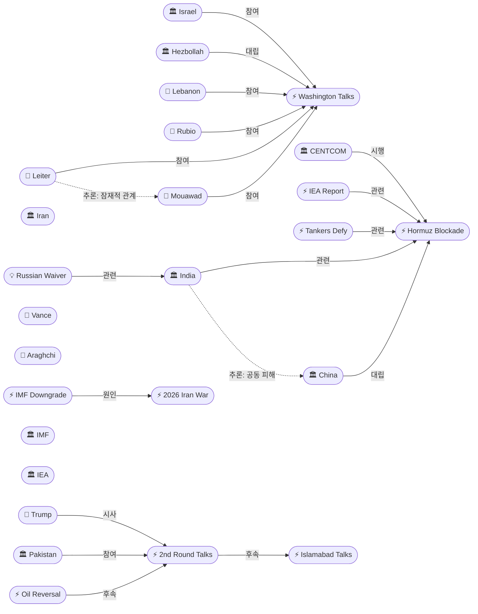
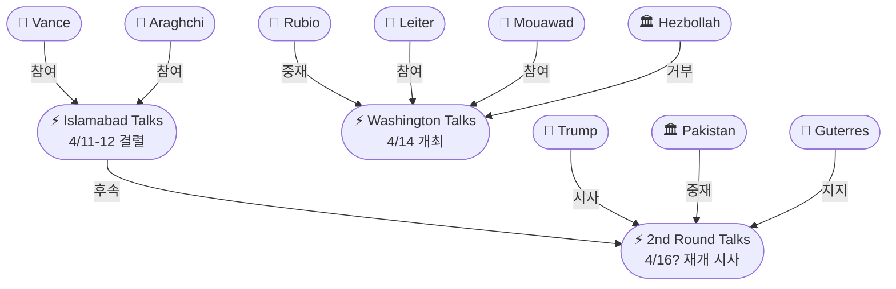
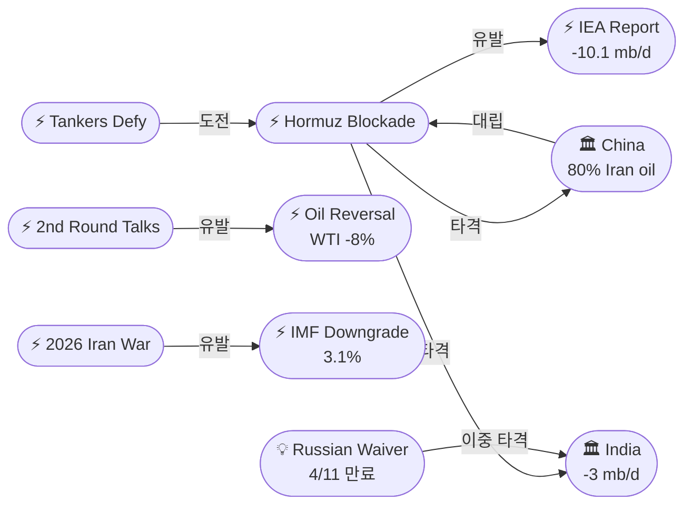

# 2026-04-14 2026 Iran War OSINT 일일 보고서

## 요약

전쟁 46일차(휴전 7일차), 두 가지 외교 전선에서 동시에 움직임이 포착됐다. 트럼프 대통령이 뉴욕포스트 인터뷰에서 "향후 이틀 안에 뭔가 일어날 수 있다(something could be happening)"고 밝히며 미-이란 2차 협상 재개를 시사했고, NBC는 빠르면 4월 16일 이슬라마바드에서 재개될 가능성을 보도했다. 같은 날 워싱턴에서는 이스라엘과 레바논이 1993년 이후 33년 만에 처음으로 직접 외교 회담을 개최하여 추가 협상에 합의했다. 한편 미 해군 봉쇄 2일차에 중국 국적 제재 유조선 Rich Starry를 포함한 최소 9척이 호르무즈 해협을 통과하며 봉쇄 실효성에 의문이 제기됐다. IEA는 "역대 최대 에너지 안보 위협(largest energy security threat in history)"을 경고했고, IMF는 글로벌 성장률을 3.1%로 하향 조정했다. 유가는 2차 협상 기대감에 WTI -8%($91.28), 브렌트 -4%($94.79)로 급반전했으나, IEA에 따르면 물리적 현물 가격은 $150/bbl 근처로 선물시장과의 괴리가 심화되고 있다.

## 주요 뉴스

### 1. 트럼프 "이틀 안에 뭔가 일어날 수 있다" — 미-이란 2차 협상 재개 시사
- **출처:** [CNN](https://www.cnn.com/2026/04/14/world/live-news/iran-war-blockade-us-trump), [NBC News](https://www.nbcnews.com/world/iran/us-iran-new-peace-talks-trump-vance-hormuz-nuclear-enrichment-rcna331669), [Time](https://time.com/article/2026/04/14/us-iran-talks-war-ceasefire-trump-nuclear-enrichment-strait-hormuz/), [헤럴드경제](https://biz.heraldcorp.com/article/10717279), [아시아투데이](https://www.asiatoday.co.kr/kn/view.php?key=20260415010004481), [세계일보](https://segye.com/newsView/20260414518799)
- **일시:** 2026-04-14
- **내용:** 트럼프 대통령이 뉴욕포스트 인터뷰에서 "향후 이틀 안에 파키스탄에서 뭔가 일어날 수 있다(something could be happening over the next two days)"고 밝혔다. NBC News는 소식통을 인용해 빠르면 4월 16일 이슬라마바드에서 2차 대면 협상이 재개될 수 있다고 보도했다. UN 사무총장 안토니우 구테흐스도 협상 재개가 "매우 가능성이 높다(highly probable)"고 밝혔다. 양측은 공식 회담 이후에도 파키스탄을 통해 비공식 접촉을 이어가고 있으며, 이란은 미국의 20년 농축 모라토리엄 요구에 대해 3~5년 유예를 역제안한 것으로 확인됐다. 4월 22일 휴전 만료까지 7일이 남았다.
- **상태:** 신규
- **관련 엔티티:** Donald Trump, Iran, JD Vance, Pakistan, Abbas Araghchi, Islamabad Peace Talks, 20-Year Moratorium

### 2. 이스라엘-레바논, 33년 만의 워싱턴 직접 회담 — 루비오 중재, 추가 협상 합의
- **출처:** [Israel Hayom](https://www.israelhayom.com/2026/04/14/israel-lebanon-launch-historic-direct-talks-in-washington), [NPR](https://www.npr.org/2026/04/14/nx-s1-5784551/lebanon-israel-talks), [Al Jazeera](https://www.aljazeera.com/news/2026/4/14/israel-lebanon-direct-talks-in-the-us-all-to-know), [파이낸셜뉴스](https://www.fnnews.com/news/202604141512520231)
- **일시:** 2026-04-14 11:00 ET
- **내용:** 이스라엘 주미대사 예히엘 레이터(Yechiel Leiter)와 레바논 주미대사 나다 무아와드(Nada Mouawad)가 미 국무부에서 마르코 루비오 국무장관 중재 하에 2시간 동안 직접 회담했다. 1993년 이후 양국 간 최초의 공식 직접 외교 회담이다. 루비오는 "이것은 과정이지 단일 사건이 아니다(This is a process, not a single event)"라고 밝혔다. 이스라엘은 헤즈볼라 무장 해제와 아브라함 협정 참여를 목표로, 레바논은 즉각적 휴전을 요구했다. 양측은 "상호 합의된 시간과 장소(mutually agreed time and venue)"에서 추가 협상을 갖기로 합의했다. 그러나 헤즈볼라는 회담 중에도 이스라엘을 향한 포격을 강화했다.
- **상태:** 신규
- **관련 엔티티:** Marco Rubio, Yechiel Leiter, Nada Mouawad, Israel, Lebanon, Hezbollah

### 3. 제재 유조선, 봉쇄 무시하고 호르무즈 통과 — 봉쇄 실효성 의문
- **출처:** [Al Jazeera](https://www.aljazeera.com/news/2026/4/14/sanctioned-tankers-transit-strait-of-hormuz-despite-blockade), [Bloomberg](https://www.bloomberg.com/news/articles/2026-04-14/us-sanctioned-tanker-tests-trump-blockade-with-hormuz-transit)
- **일시:** 2026-04-14
- **내용:** 미 해군 봉쇄 2일차에 중국 국적 중형 유조선 Rich Starry(2023년 미국 제재 대상)가 호르무즈 해협을 통과하며 봉쇄 시행 후 최초의 석유 운반 선박 통과를 기록했다. Kpler 선박 추적 데이터에 따르면 월요일 이후 최소 9척의 상업 선박이 해협을 통과했으며, 제재 대상 유조선 Elpis도 포함됐다. CENTCOM은 "이란 항구로 향하는 선박은 봉쇄선을 넘지 않았다(no ships bound for Iranian ports crossed the blockade line)"고 주장했으나, 다수의 선박 통과 자체가 봉쇄의 공백을 시사한다.
- **상태:** 신규
- **관련 엔티티:** CENTCOM, Strait of Hormuz, Trump Hormuz Naval Blockade, China

### 4. IMF, 세계 성장률 3.1%로 하향 — 이란 경제 -6.1% 전망
- **출처:** [Al Jazeera](https://www.aljazeera.com/economy/2026/4/14/imf-cuts-global-growth-forecast-during-hormuz-blockade), [The National](https://www.thenationalnews.com/business/economy/2026/04/14/imf-lowers-middle-east-growth-forecast-over-iran-war-shock/)
- **일시:** 2026-04-14
- **내용:** IMF가 세계경제전망(World Economic Outlook)을 발표하며 2026년 글로벌 성장률을 1월 전망(3.3%) 대비 0.2%p 하향한 3.1%로 조정했다. 글로벌 인플레이션은 4.4%(+0.6%p)로 상향 조정됐다. 중동·북아프리카(MENA) 지역 성장률은 1.1%로 급락했으며, 이란 경제는 -6.1% 역성장이 전망된다. 사우디아라비아도 4.5%에서 3.1%로 1.4%p 하향 조정됐다. 미국 성장률은 2.3%로 낮아졌다. IMF는 전쟁이 장기화되는 "심각(severe)" 시나리오에서 성장률이 2.5%로 추락하고 인플레이션이 5.4%까지 오를 수 있다고 경고했다.
- **상태:** 신규
- **관련 엔티티:** IMF, Iran, 2026 Iran War, Strait of Hormuz

### 5. IEA "역대 최대 에너지 안보 위협" — 글로벌 공급 10.1 mb/d 감소
- **출처:** [Euronews](https://www.euronews.com/business/2026/04/14/the-largest-energy-security-threat-in-history-is-about-push-oil-prices-further-up-iea-warn), [Al Jazeera](https://www.aljazeera.com/news/2026/4/14/global-oil-demand-to-plunge-amid-middle-east-war-disruptions)
- **일시:** 2026-04-14
- **내용:** IEA가 4월 석유시장 보고서를 발표하며 현 상황을 "역대 최대 에너지 안보 위협(largest energy security threat in history)"으로 규정했다. 3월 글로벌 석유 공급이 10.1 mb/d 급감해 97 mb/d를 기록했고, 호르무즈 해협 선적은 전쟁 전 20+ mb/d에서 3.8 mb/d로 81% 감소했다. 물리적 현물 원유가는 $150/bbl 근처로 선물시장($91~95)과의 괴리가 극심하다. 싱가포르 중간증류유는 $290/bbl 사상 최고치를 기록했다. 2026년 글로벌 석유 수요는 80 kb/d 감소할 것으로 전망되며, 중동/아시아 정유소는 가동률을 6 mb/d 줄여 77.2 mb/d로 운영 중이다.
- **상태:** 신규
- **관련 엔티티:** IEA, Strait of Hormuz, Dual Blockade, 2026 Iran War

### 6. 유가 급반전 — WTI -8%, 협상 재개 기대감에 선물시장 하락
- **출처:** [CNBC](https://www.cnbc.com/2026/04/14/oil-wti-brent-as-markets-hormuz-blockade-vance-trump.html)
- **일시:** 2026-04-14
- **내용:** 2차 협상 재개 기대감에 국제 유가가 급반전했다. WTI 5월물은 -8% 하락해 $91.28/bbl에, 브렌트 6월물은 -4% 이상 하락해 $94.79/bbl에 마감했다. 트럼프의 "이틀 안에 뭔가 일어날 수 있다" 발언이 하락 촉매제였다. 그러나 IEA에 따르면 물리적 현물 가격은 $150/bbl 근처로, 선물-현물 간 괴리가 확대되고 있어 구조적 공급 부족은 해소되지 않았다.
- **상태:** 신규
- **관련 엔티티:** Oil Price Reversal, Donald Trump, Strait of Hormuz

### 7. 중국 "봉쇄는 위험하고 무책임" — 수사 격상, 에너지 비용 증가
- **출처:** [CNBC](https://www.cnbc.com/2026/04/14/china-us-strait-of-hormuz-war-donald-trump-oil-energy-crisis-conflict-middle-east-iran.html), [CNN](https://www.cnn.com/2026/04/14/china/china-iran-war-costs-oil-analysis-intl-hnk)
- **일시:** 2026-04-14
- **내용:** 중국이 미국의 호르무즈 봉쇄에 대한 수사를 전일의 "자제 촉구(urges restraint)"에서 "위험하고 무책임한 행위(dangerous and irresponsible act)"로 격상했다. 중국은 봉쇄가 "이미 취약한 휴전 상황(already fragile ceasefire situation)"을 훼손할 위험이 있다고 경고하며, "포괄적 휴전과 전쟁 종식만이 해협 정상화의 근본 조건"이라고 밝혔다. 중국은 이란산 원유의 80%(1.4 mb/d)를 수입하는 최대 고객이며, 약 10억 배럴의 전략비축유를 보유하고 있으나 비용이 증가하고 있다.
- **상태:** 업데이트 ← 2026-04-13 "중국, 자제 촉구"
- **관련 엔티티:** China, Strait of Hormuz, Trump Hormuz Naval Blockade, Iran

### 8. 인도, 봉쇄 + 러시아 원유 면제 만료로 이중 에너지 타격
- **출처:** [CNBC](https://www.cnbc.com/2026/04/14/us-hormuz-blockade-hits-india-just-as-russian-oil-purchase-waiver-expires-deepening-energy-worries.html)
- **일시:** 2026-04-14
- **내용:** 인도가 호르무즈 봉쇄와 러시아 원유 구매 면제 만료(4월 11일)의 이중 타격을 받고 있다. 인도는 세계 3위 원유 수입국으로 원유 수요의 85% 이상(~5.5 mb/d)을 수입에 의존하며, 호르무즈 차질로 이미 약 3 mb/d를 상실했다. 러시아 원유 면제 만료로 또 다른 핵심 공급원마저 차단되면서, 인도의 에너지 안보가 심각하게 위협받고 있다.
- **상태:** 신규
- **관련 엔티티:** India, Strait of Hormuz, Trump Hormuz Naval Blockade, Russia, Russian Oil Waiver Expiry

## 지식그래프

### 오늘의 주요 관계
- **외교 전선 이중 가동:** 트럼프가 2차 미-이란 협상 재개를 시사(ent-088→follows→ent-054)하는 동시에 루비오가 이스라엘-레바논 워싱턴 회담을 중재(ent-077→participatesIn→ent-060). 이란 전선과 레바논 전선을 별도 트랙으로 분리 관리하는 미국의 전략 구도가 선명해짐.
- **봉쇄 vs 시장:** 유가가 2차 협상 기대감에 급반전(ent-084→causedBy→ent-088)했으나, IEA 보고서(ent-086)는 물리적 시장과 선물시장의 괴리가 확대되고 있음을 경고. 구조적 공급 부족은 해소되지 않음.
- **봉쇄 실효성 의문:** 제재 유조선의 봉쇄 무시 통과(ent-087→relatedTo→ent-063)는 미국의 해상 통제력 한계를 시사. 중국이 봉쇄를 "위험하고 무책임"(ent-010→opposes→ent-063)으로 규정하면서 대립 강도 상승.
- **글로벌 경제 충격:** IMF(ent-085)와 IEA(ent-086)가 동시에 경고를 발하며 전쟁의 경제적 비용이 임계점에 도달. 인도(ent-080)가 새로운 피해국으로 부상하며 러시아 면제 만료(ent-089)와 봉쇄의 이중 타격.

### 전체 지식그래프 시각화

### 외교 트랙 세부 그래프

### 경제 충격 세부 그래프

## 온톨로지 변경

| 변경 유형 | 대상 | 근거 |
|----------|------|------|
| 엔티티 업데이트 | ent-060 (Washington Talks) | "예정(planned)" → "개최(held)" 상태 변경 |
| 새 엔티티 (Person) | ent-077 Marco Rubio | 이스라엘-레바논 회담 중재 국무장관 |
| 새 엔티티 (Person) | ent-078 Yechiel Leiter | 이스라엘 주미대사, 회담 참석 |
| 새 엔티티 (Person) | ent-079 Nada Mouawad | 레바논 주미대사, 회담 참석 |
| 새 엔티티 (Person) | ent-083 António Guterres | UN 사무총장, 협상 재개 지지 |
| 새 엔티티 (Organization) | ent-080 India | 봉쇄 + 러시아 면제 이중 타격 |
| 새 엔티티 (Organization) | ent-081 IMF | 세계성장률 하향 보고서 발표 |
| 새 엔티티 (Organization) | ent-082 IEA | 역대 최대 에너지 위협 경고 |
| 새 엔티티 (Event) | ent-084~ent-088 | 유가 반전, IMF/IEA 보고서, 유조선 통과, 2차 협상 시사 |
| 새 엔티티 (Concept) | ent-089~ent-090 | 러시아 원유 면제 만료, 레바논 내부 분열 |

## 추론 결과

| # | 추론 | 규칙 | 신뢰도 | 근거 |
|---|------|------|--------|------|
| 27 | Leiter ↔ Mouawad 잠재적 관계 | co_participation | 0.85 | 33년 만의 이스라엘-레바논 직접 회담 공동 참여 |
| 28 | India ↔ China 잠재적 관계 | co_participation | 0.75 | 양국 모두 호르무즈 봉쇄의 주요 피해국, 공조 가능성 |
| 29 | 유조선 봉쇄 무시 ← 협상 결렬 인과 체인 | event_chain | 0.72 | 협상 결렬 → 봉쇄 선언 → 유조선 봉쇄 무시 |
| 30 | 유가 급반전 ← 2차 협상 시사 ← 결렬 인과 체인 | event_chain | 0.72 | 결렬 → 재개 시사 → 유가 -8% 하락 |
| 31 | Rubio → Trump 간접 소속 | transitivity | 0.81 | 국무장관 → 행정부 → 대통령 소속 체인 |

## 분석 및 평가

### 외교 이중 트랙 전략의 부상
4월 14일은 미국이 이란 전선과 레바논 전선을 명확히 분리 관리하는 "이중 트랙" 전략을 본격화한 날이다. 트럼프는 이란과의 2차 직접 협상을 시사하면서 동시에 루비오를 통해 이스라엘-레바논 별도 회담을 중재했다. 이는 이란의 핵심 요구인 "지역 전체 휴전(region-wide ceasefire)"을 우회하여, 레바논을 먼저 떼어내 이란의 협상 지렛대를 약화시키려는 시도로 해석된다. 그러나 헤즈볼라의 회담 거부와 회담 중 포격 강화는 이 전략의 한계를 드러낸다.

### 봉쇄의 전략적 모순
미국의 호르무즈 봉쇄가 이틀째에 접어들었으나, 제재 유조선의 통과(최소 9척)가 봉쇄의 실효성에 의문을 제기한다. CENTCOM은 "이란 항구행 선박은 차단했다"고 주장하나, 중국 국적 제재 선박의 통과를 사실상 묵인한 것으로 보인다. 이는 봉쇄가 이란 압박용 레버리지이면서도 중국과의 전면 충돌을 피하려는 이중 목표 사이에서 딜레마에 처해 있음을 시사한다.

### 경제 충격의 임계점
IMF와 IEA가 같은 날 경고를 발한 것은 전쟁의 경제적 비용이 임계점에 도달했다는 신호다. 특히 IEA가 "역대 최대 에너지 안보 위협"이라는 역사적 표현을 사용한 점이 주목된다. 선물 유가가 협상 기대감에 -8% 급락했으나, 물리적 현물은 $150/bbl로 괴리가 확대되는 현상은 시장이 "협상 성공" 시나리오에 과도하게 베팅하고 있을 가능성을 시사한다. 인도의 이중 에너지 타격(호르무즈 + 러시아 면제 만료)은 전쟁의 피해가 직접 교전국을 넘어 글로벌 남반구로 확산되고 있음을 보여준다.

## 추적 항목

| 항목 | 최초 보고 | 상태 | 최신 업데이트 |
|------|----------|------|-------------|
| 2주 휴전 (4/22 만료) | 2026-04-07 | 위기 — 7일 남음 | 봉쇄 시행 중이나 2차 협상 기대감 |
| 미-이란 종전 협상 | 2026-04-07 | 활성 — 2차 재개 시사 | 트럼프 "이틀 내", 16일 가능성 |
| 호르무즈 이중 봉쇄 | 2026-04-12 | 시행 2일차 | 실효성 의문, 제재 유조선 9척 통과 |
| 이스라엘-레바논 회담 | 2026-04-11 | 진행 중 — 회담 완료 | 33년 만의 직접 회담, 추가 협상 합의 |
| 헤즈볼라 전선 | 2026-04-10 | 교착 — 회담 거부 지속 | 회담 중 포격 강화, 레바논 내부 분열 |
| 핵 문제 (농축 우라늄) | 2026-04-12 | 교착 — 간극 존재 | 미국 20년 vs 이란 3~5년 모라토리엄 |
| 유가 동향 | 2026-04-12 | 급변 — 선물 하락, 현물 유지 | WTI $91(-8%), 현물 $150, 괴리 확대 |
| 글로벌 경제 영향 | 2026-04-13 | 심화 | IMF 3.1% 하향, IEA "역대 최대 위협" |

## 동향 요약

| 분류 | 상태 | 비고 |
|------|------|------|
| 군사 | 봉쇄 시행 2일차 | 봉쇄 실효성 의문, 유조선 9척 통과 |
| 외교 (이란) | 2차 협상 시사 | 트럼프 "이틀 내", 16일 이슬라마바드 가능 |
| 외교 (레바논) | 역사적 회담 | 33년 만의 직접 대화, 추가 협상 합의 |
| 경제 | IMF/IEA 동시 경고 | 성장 3.1%, "역대 최대 에너지 위협" |
| 유가 | 급반전 | WTI -8%($91), 현물 $150 괴리 확대 |
| 핵 문제 | 간극 유지 | 미국 20년 vs 이란 3~5년 모라토리엄 |
| 휴전 | 7일 남음 | 4/22 만료, 2차 협상이 관건 |

## 출처 목록

1. [Trump hints US-Iran talks could resume over next two days](https://www.cnn.com/2026/04/14/world/live-news/iran-war-blockade-us-trump) - CNN, 2026-04-14
2. [U.S. and Iran could hold new peace talks as soon as this week](https://www.nbcnews.com/world/iran/us-iran-new-peace-talks-trump-vance-hormuz-nuclear-enrichment-rcna331669) - NBC News, 2026-04-14
3. [Officials Considering Second Round of U.S.-Iran Talks](https://time.com/article/2026/04/14/us-iran-talks-war-ceasefire-trump-nuclear-enrichment-strait-hormuz/) - Time, 2026-04-14
4. [Sanctioned tankers transit Strait of Hormuz amid US blockade](https://www.aljazeera.com/news/2026/4/14/sanctioned-tankers-transit-strait-of-hormuz-despite-blockade) - Al Jazeera, 2026-04-14
5. [China calls U.S. blockade of the Strait of Hormuz 'dangerous and irresponsible'](https://www.cnbc.com/2026/04/14/china-us-strait-of-hormuz-war-donald-trump-oil-energy-crisis-conflict-middle-east-iran.html) - CNBC, 2026-04-14
6. [How much will US Hormuz blockade hurt Iran?](https://www.aljazeera.com/news/2026/4/14/how-much-will-us-hormuz-blockade-hurt-iran-and-does-tehran-have-an-escape) - Al Jazeera, 2026-04-14
7. [Israel, Lebanon launch historic direct talks in Washington](https://www.israelhayom.com/2026/04/14/israel-lebanon-launch-historic-direct-talks-in-washington) - Israel Hayom, 2026-04-14
8. [Israel and Lebanon agree to start peace negotiations](https://www.npr.org/2026/04/14/nx-s1-5784551/lebanon-israel-talks) - NPR, 2026-04-14
9. [Israel-Lebanon direct talks in the US: All to know](https://www.aljazeera.com/news/2026/4/14/israel-lebanon-direct-talks-in-the-us-all-to-know) - Al Jazeera, 2026-04-14
10. [IMF cuts global growth forecast during Hormuz blockade](https://www.aljazeera.com/economy/2026/4/14/imf-cuts-global-growth-forecast-during-hormuz-blockade) - Al Jazeera, 2026-04-14
11. [U.S. oil price tumbles below $92](https://www.cnbc.com/2026/04/14/oil-wti-brent-as-markets-hormuz-blockade-vance-trump.html) - CNBC, 2026-04-14
12. [IEA: 'The largest energy security threat in history'](https://www.euronews.com/business/2026/04/14/the-largest-energy-security-threat-in-history-is-about-push-oil-prices-further-up-iea-warn) - Euronews, 2026-04-14
13. [Global oil demand to plunge: IEA](https://www.aljazeera.com/news/2026/4/14/global-oil-demand-to-plunge-amid-middle-east-war-disruptions) - Al Jazeera, 2026-04-14
14. [India hit by Hormuz blockade as Russian oil waiver expires](https://www.cnbc.com/2026/04/14/us-hormuz-blockade-hits-india-just-as-russian-oil-purchase-waiver-expires-deepening-energy-worries.html) - CNBC, 2026-04-14
15. [Analysis: China weathered oil crisis but costs growing](https://www.cnn.com/2026/04/14/china/china-iran-war-costs-oil-analysis-intl-hnk) - CNN, 2026-04-14
16. [IMF lowers Middle East growth forecast](https://www.thenationalnews.com/business/economy/2026/04/14/imf-lowers-middle-east-growth-forecast-over-iran-war-shock/) - The National, 2026-04-14
17. [US-Sanctioned Tanker Tests Blockade](https://www.bloomberg.com/news/articles/2026-04-14/us-sanctioned-tanker-tests-trump-blockade-with-hormuz-transit) - Bloomberg, 2026-04-14
18. [트럼프 "이틀내 변화 가능"…이란 협상 재개 시사](https://biz.heraldcorp.com/article/10717279) - 헤럴드경제, 2026-04-14
19. [미·이란 2차 협상 '48시간 내' 재개 가시화](https://www.asiatoday.co.kr/kn/view.php?key=20260415010004481) - 아시아투데이, 2026-04-14
20. [美국무 중재로 이스라엘·레바논 대사 14일 회담](https://www.fnnews.com/news/202604141512520231) - 파이낸셜뉴스, 2026-04-14
21. [레바논 중앙정부와 헤즈볼라, 협상 놓고 충돌](https://www.newspim.com/news/view/20260414000021) - 뉴스핌, 2026-04-14
22. ["미-이란, 이번주 후반 협상 재개…빠르면 16일"](https://segye.com/newsView/20260414518799) - 세계일보, 2026-04-14
23. ["미국·이란 물밑 대화 중"](https://imnews.imbc.com/replay/2026/nw1400/article/6815093_36974.html) - MBC, 2026-04-14
24. [헤즈볼라 "회담 결과 따르지 않을 것"](https://www.asiatoday.co.kr/kn/view.php?key=20260414010004170) - 아시아투데이, 2026-04-14
25. [헤즈볼라 "협상 거부"… 이스라엘, 레바논 맹폭](https://www.kmib.co.kr/article/view.asp?arcid=1776153697&code=11141300&sid1=int) - 국민일보, 2026-04-14
26. [Live Updates: blockade day 2; Lebanon-Israel talks](https://www.cbsnews.com/live-updates/iran-war-peace-talks-us-blockade-irans-ports-day-2/) - CBS News, 2026-04-14
