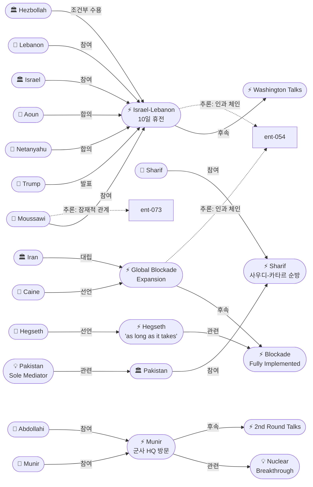
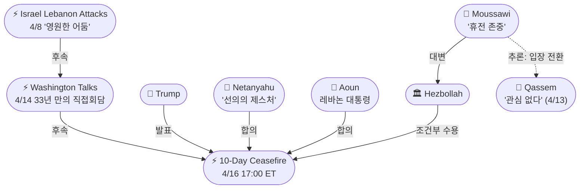
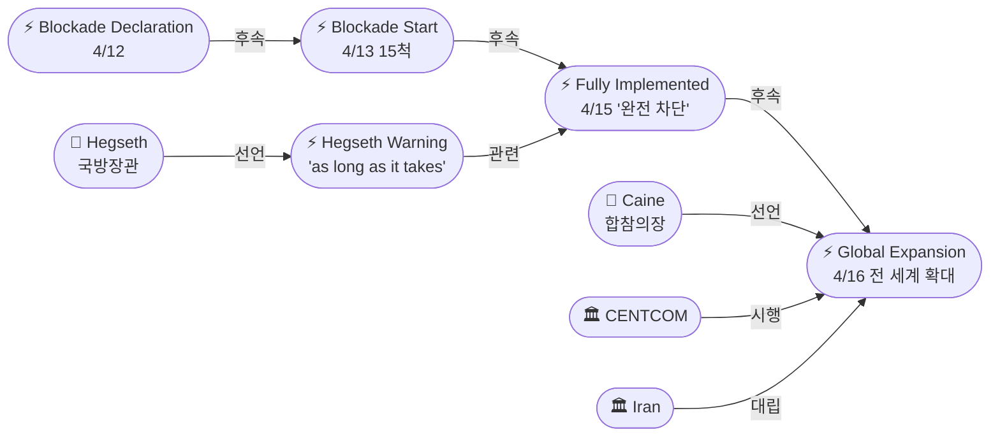

# 2026-04-16 2026 Iran War OSINT 일일 보고서

## 요약

전쟁 48일차(휴전 9일차), 레바논 전선의 분리 해결과 이란 전선의 최대 압박이 동시에 진행된 날이다. 트럼프 대통령이 이스라엘과 레바논의 10일 휴전을 발표했다 — 전쟁 발발 이후 최초의 공식 정전이며 1983년 이후 최초의 의미 있는 양국 합의다. 헤즈볼라 의원 무사위는 이스라엘이 공격을 중단하면 "휴전을 존중하겠다"고 밝혀 4월 13일 카셈의 거부 입장에서 조건부 수용으로 전환했다. 동시에 헤그세스 국방장관은 봉쇄가 "필요한 한 계속(as long as it takes)" 된다고 경고하며 이란 에너지 시설 공격 가능성을 시사했고, 케인 합참의장은 봉쇄를 전 세계 이란 연계 선박으로 확대한다고 선언했다 — 호르무즈에서 글로벌 해상 제재 체제로의 질적 변화다. 외교적으로는 무니르 육참총장이 이란 하탐 알안비야 군사 본부를 방문해 압돌라히 사령관과 면담했으며, 이란 관계자는 "핵·호르무즈·배상 3대 쟁점에서 간극이 좁혀졌다"고 밝혔다. 파키스탄 소식통은 핵 문제에서 "메이저 돌파구"를 보도했다.

## 주요 뉴스

### 1. 이스라엘-레바논 10일 휴전 — 전쟁 이후 최초 공식 정전
- **출처:** [Al Jazeera](https://www.aljazeera.com/news/2026/4/16/trump-says-israel-and-lebanon-agree-to-temporary-ceasefire), [Bloomberg](https://www.bloomberg.com/news/articles/2026-04-16/trump-says-israel-lebanon-agree-to-10-day-ceasefire), [Washington Post](https://www.washingtonpost.com/world/2026/04/16/trump-iran-israel-lebanon-ceasefire-talks/), [France 24](https://www.france24.com/en/live-news/20260416-live-trump-says-israel-and-lebanon-have-agreed-to-a-10-day-ceasefire), [Axios](https://www.axios.com/2026/04/16/lebanon-ceasefire-trump-aoun-israel-netanyahu), [PBS](https://www.pbs.org/newshour/world/israel-and-lebanon-reach-10-day-ceasefire-agreement-trump-says), [서울경제](https://www.sedaily.com/article/20033613), [국민일보](https://www.kmib.co.kr/article/view.asp?arcid=1776331125&code=11141300&sid1=int), [머니투데이](https://www.mt.co.kr/world/2026/04/16/2026041611372215987)
- **일시:** 2026-04-16 17:00 ET (한국시간 4/17 06:00)
- **내용:** 트럼프 대통령이 트루스소셜을 통해 이스라엘과 레바논의 10일간 휴전 합의를 발표했다. 네타냐후 총리와 아운(Joseph Aoun) 레바논 대통령 양측과 통화한 뒤 공식화했다. 네타냐후는 "평화 노력을 진전시키기 위한 선의의 제스처(gesture of goodwill)"라고 밝혔고, 트럼프는 "1983년 이후 처음으로 의미 있는 회담을 위해 양국 정상을 백악관에 초청하겠다"고 예고했다. 합의에 따르면 10일 휴전은 "협상에서 진전이 있고 레바논이 주권을 효과적으로 입증하면" 연장 가능하다. 다만 이스라엘은 휴전 기간 중에도 레바논 남부에 '안보 지대(security strip)'를 유지한다고 밝혀 마찰의 소지가 남는다.
- **상태:** 신규
- **관련 엔티티:** Donald Trump, Benjamin Netanyahu, Joseph Aoun, Israel, Lebanon, Hezbollah

### 2. 헤즈볼라 조건부 휴전 수용 — "이스라엘이 공격 중단하면 존중"
- **출처:** [Drop Site News](https://www.dropsitenews.com/p/hezbollah-mp-ibrahim-al-moussawi-israel-lebanon-ceasefire-talks-iran), [JPost](https://www.jpost.com/middle-east/iran-news/2026-04-16/live-updates-893165)
- **일시:** 2026-04-16
- **내용:** 헤즈볼라 의원 이브라힘 알무사위(Ibrahim al-Moussawi)가 "우리는 휴전을 존중할 것(We will be respecting the ceasefire)"이라고 밝혔다. 다만 "이스라엘이 우리에 대한 적대 행위를 포괄적으로 중단하고, 휴전을 암살 작전에 이용하지 않는 조건"이라고 못을 박았다. 4월 13일 카셈 사무총장이 "워싱턴 회담 결과에 관심 없다"며 거부한 데서 조건부 수용으로 전환한 것은 유의미한 변화다. 이란 외무부 대변인 바게이도 레바논 휴전을 환영했으며, 국회의장 갈리바프는 "신중하게 접근할 것"이라면서도 "헤즈볼라의 견인함과 저항축의 단결 덕분"이라고 평가했다.
- **상태:** 신규
- **관련 엔티티:** Ibrahim al-Moussawi, Hezbollah, Naim Qassem, Esmail Baghaei, Mohammad Bagher Ghalibaf

### 3. 헤그세스 "봉쇄, 필요한 한 계속" — 이란 에너지 공격 가능성 경고
- **출처:** [Al Jazeera](https://www.aljazeera.com/news/2026/4/16/hegseth-says-us-blockade-to-continue-ready-for-new-attacks-on-iran-energy), [Euronews](https://www.euronews.com/2026/04/16/us-blockade-of-iranian-ports-to-last-as-long-as-it-takes-defence-secretary-hegseth-warns), [Jewish Insider](https://jewishinsider.com/2026/04/hegseth-caine-u-s-ready-resume-military-operations-iran/)
- **일시:** 2026-04-16
- **내용:** 피트 헤그세스(Pete Hegseth) 국방장관이 펜타곤 기자회견에서 이란 항구 봉쇄가 "필요한 한 계속(as long as it takes)"될 것이라고 선언했다. "이란이 잘못된 선택을 하면 봉쇄와 함께 인프라, 전력, 에너지 시설에 폭탄이 투하될 것(If Iran chooses poorly, then they will have a blockade and bombs dropping on infrastructure, power and energy)"이라고 경고했다. 미군이 "최대 태세(maximally postured)"로 군사 작전을 재개할 준비가 되어 있다고 덧붙였다. 이는 휴전 만료(4/21~22)가 다가오는 가운데 이란에 대한 최후통첩 성격의 발언이다.
- **상태:** 신규
- **관련 엔티티:** Pete Hegseth, US Military, CENTCOM, Trump Hormuz Naval Blockade

### 4. 케인 합참의장, 봉쇄 전 세계 확대 — "이란 연계 선박 어디서든 차단"
- **출처:** [AP/ADN](https://www.adn.com/nation-world/2026/04/16/over-10000-us-troops-are-enforcing-the-iran-blockade-but-no-ships-boarded-so-far-military-says/), [CNBC](https://www.cnbc.com/2026/04/16/trump-iran-war-hormuz-strait-blockade.html), [Stars and Stripes](https://www.stripes.com/theaters/middle_east/2026-04-16/hegseth-caine-iran-war-21394905.html), [Breaking Defense](https://breakingdefense.com/2026/04/us-can-intercept-any-iran-linked-ship-globally-caine-says/)
- **일시:** 2026-04-16
- **내용:** 댄 케인(Dan Caine) 합참의장이 봉쇄를 호르무즈 해협 너머 전 세계로 확대한다고 선언했다. "이란 항구로 향하거나 출발하는 모든 선박에 적용되며, 국적을 불문한다(applies to all ships, regardless of nationality)"고 밝혔다. "봉쇄를 위반하는 선박에 대해서는 미리 계획된 전술을 실행할 것이며, 필요하면 선박에 승선해 인수할 것(board the ship and take her over)"이라고 경고했다. 봉쇄 시행 이후 13척이 회항했으나 아직 실제 승선 검색은 없었다. 금수품에는 무기, 핵물질, 원유·정제유, 철강·알루미늄·전자제품이 포함된다. 태평양에서도 봉쇄 시행 전 출항한 선박을 추적하는 작전이 진행 중이다.
- **상태:** 신규
- **관련 엔티티:** Dan Caine, US Military, CENTCOM, Global Blockade Expansion

### 5. 무니르, 이란 군사 본부 방문 — "핵·호르무즈·배상 간극 축소", 핵 돌파구 보도
- **출처:** [Pakistan Today](https://www.pakistantoday.com.pk/2026/04/16/field-marshal-asim-munir-visits-iranian-military-headquarters-amid-ongoing-mediation-efforts), [Israel Hayom](https://www.israelhayom.com/2026/04/16/us-iran-narrow-gaps-as-pakistan-mediation-boosts-ceasefire-hopes), [Al Jazeera](https://www.aljazeera.com/news/2026/4/16/hopes-grow-for-a-breakthrough-in-us-iran-talks-as-pakistan-mediates), [The Nation](https://www.nation.com.pk/17-Apr-2026/field-marshal-munir-engages-iran-s-top-civil-military-leadership-tehran)
- **일시:** 2026-04-16
- **내용:** 파키스탄 아심 무니르 육참총장이 이란군 통합군사본부(하탐 알안비야/Khatam al-Anbiya Central HQ)를 방문하여 알리 압돌라히 사령관의 영접을 받았다. 이란 관계자는 무니르의 방문이 "핵 프로그램, 호르무즈 해협, 배상 문제 등 여러 분야에서 차이를 좁히는 데 기여했다(contributed to narrowing differences)"고 밝혔다. 파키스탄 소식통은 핵 문제에서 "메이저 돌파구(major breakthrough)"가 있었다고 보도했다. 무니르는 이란의 민간 및 군사 지도부 양쪽과 접촉하여, 단순한 외교 채널을 넘어 군사적 실무자 수준의 신뢰 구축을 진행하고 있다.
- **상태:** 업데이트 ← 2026-04-15 "Asim Munir Tehran Visit"
- **관련 엔티티:** Asim Munir, Ali Abdollahi, Abbas Araghchi, Pakistan, Iran, Nuclear Breakthrough Reports

### 6. 양측 휴전 연장 부인 — 2차 대면 회담 "very likely"
- **출처:** [Korea Times](https://www.koreatimes.co.kr/world/20260416/white-house-denies-seeking-iran-ceasefire-extension-says-pakistan-talks-very-likely), [CGTN](https://news.cgtn.com/news/2026-04-16/US-Iran-reject-ceasefire-extension-as-Pakistan-steps-up-mediation-1MnH0wMa34c/p.html), [Al Jazeera](https://www.aljazeera.com/news/2026/4/16/no-date-set-for-us-iran-talks-as-pakistan-pushes-to-keep-diplomacy-alive)
- **일시:** 2026-04-16
- **내용:** 백악관 대변인 캐롤린 레빗(Karoline Leavitt)은 미-이란 휴전 연장은 "현재로서는 사실이 아니다(not true at this moment)"라고 밝혔다. 이란 외무부도 연장 보도를 부인했다. 그러나 레빗은 파키스탄에서의 2차 대면 회담이 "매우 가능성이 높다(very likely)"고 말했다. 레빗은 또한 파키스탄이 이 협상의 "유일한 중재자(the only mediator)"라고 공식 확인했다. 아직 2차 회담의 구체적 날짜는 정해지지 않았지만, 4월 21일 휴전 만료 전 열릴 가능성이 높다. 미국은 휴전 '연장'이 아니라 포괄적 합의를 추구하는 것으로 보인다.
- **상태:** 신규
- **관련 엔티티:** Karoline Leavitt, Pakistan, Pakistan Sole Mediator, Islamabad Peace Talks

### 7. 샤리프 파키스탄 PM, 사우디-카타르 순방 — 지역 외교 총동원
- **출처:** [Deccan Chronicle](https://www.deccanchronicle.com/world/pakistan-pm-in-qatar-amid-push-for-us-iran-talks-1950838), [Arab News](https://www.arabnews.com/node/2640000/saudi-arabia), [Al Jazeera](https://www.aljazeera.com/news/2026/4/16/hopes-grow-for-a-breakthrough-in-us-iran-talks-as-pakistan-mediates)
- **일시:** 2026-04-16
- **내용:** 셰바즈 샤리프 파키스탄 총리가 사우디 → 카타르 → 터키를 잇는 4일간 외교 순방을 이어갔다. 사우디에서 무함마드 빈 살만 왕세자와 면담하며 중재와 지역 안정을 논의했고, 4월 16일 카타르 도하에 도착하여 알무라이키 외교담당 국무장관을 만났다. 호르무즈 재개방, 이란의 배상 요구, 2차 협상 지원을 의제로 걸프 아랍국들의 지지를 확보하는 것이 목적이다. 무니르의 테헤란 군사외교 + 샤리프의 걸프 정치외교라는 이중 트랙 중재가 작동하고 있다.
- **상태:** 신규
- **관련 엔티티:** Shehbaz Sharif, Pakistan, Saudi Arabia, Qatar

### 8. 시장: S&P 랠리 지속, 유가 $100 이하
- **출처:** [CBS News](https://www.cbsnews.com/news/oil-prices-stock-market-trump-blockade-strait-of-hormuz-iran/), [Yahoo Finance](https://finance.yahoo.com/markets/stocks/article/stock-market-today-dow-sp-500-nasdaq-rise-amid-iran-deal-hopes-earnings-rush-225637251.html)
- **일시:** 2026-04-16
- **내용:** S&P 500과 나스닥이 사상 최고가를 향해 랠리를 이어갔고, 유가는 $100/bbl 이하로 하락했다. WTI ~$91, 브렌트 ~$95로 안정세를 유지했다. 이스라엘-레바논 휴전과 이란 협상 기대감이 시장을 견인했다. 다만 물리적 현물 가격은 여전히 $150 근처로 선물과의 $60 괴리가 지속되고 있다. 시장은 외교적 해결을 강하게 가격에 반영하고 있지만, 봉쇄의 글로벌 확장과 헤그세스의 군사 경고라는 악재는 무시하고 있다.
- **상태:** 신규
- **관련 엔티티:** S&P 500 Record High, Oil Prices Stabilize, 2026 Iran War

## 지식그래프

### 오늘의 주요 관계
- **레바논 분리 해결:** 이스라엘-레바논 10일 휴전(ent-109)은 워싱턴 회담(ent-060) → 직접 정상 합의로 이어진 것으로, 미-이란 종전의 핵심 걸림돌이었던 '저항축 전선'을 분리 해결하는 구도다. 헤즈볼라 내부에서 카셈(ent-073, 거부) → 무사위(ent-108, 조건부 수용)로 입장이 이동한 것은 현실적 압박이 작동하고 있음을 시사한다.
- **봉쇄의 글로벌화:** 헤그세스(ent-104) + 케인(ent-105) → 봉쇄를 호르무즈 → 전 세계로 확장(ent-111). 이란의 해상 우회로를 원천 차단하며, 봉쇄가 단순 해군 작전에서 글로벌 해상 제재 체제로 진화했다.
- **파키스탄 이중 트랙:** 무니르(ent-028)의 테헤란 군사외교(ent-112)와 샤리프(ent-027)의 걸프 정치외교(ent-113)가 동시에 작동. 무니르가 이란 군사 HQ까지 방문한 것은 군사적 실무자 수준의 신뢰 구축을 의미하며, 간극이 좁혀지고 있다는 보도는 2차 회담 전 사전 합의가 진행 중일 가능성을 시사한다.

### 전체 지식그래프 시각화

### 레바논 휴전 세부 그래프

### 봉쇄 에스컬레이션 세부 그래프

## 온톨로지 변경

| 변경 유형 | 대상 | 근거 |
|----------|------|------|
| 새 엔티티 (Person) | ent-104 Pete Hegseth | 미 국방장관, 봉쇄 "as long as it takes" + 군사 재개 경고 |
| 새 엔티티 (Person) | ent-105 Dan Caine | 합참의장, 봉쇄 전 세계 확대 선언, 13척 회항 |
| 새 엔티티 (Person) | ent-106 Karoline Leavitt | WH 대변인, 파키스탄 "유일한 중재자" 공식 확인 |
| 새 엔티티 (Person) | ent-107 Joseph Aoun | 레바논 대통령, 10일 휴전 합의 |
| 새 엔티티 (Person) | ent-108 Ibrahim al-Moussawi | 헤즈볼라 의원, 조건부 휴전 수용 |
| 새 엔티티 (Event) | ent-109 Israel-Lebanon 10-Day Ceasefire | 전쟁 이후 최초 공식 정전, 5pm ET 발효 |
| 새 엔티티 (Event) | ent-110 Hegseth Blockade Warning | "as long as it takes" + "bombs on infrastructure" |
| 새 엔티티 (Event) | ent-111 Global Blockade Expansion | 호르무즈→전 세계, 이란 연계 선박 무국적 차단 |
| 새 엔티티 (Event) | ent-112 Munir Khatam HQ Visit | 간극 축소, 핵 돌파구 보도 |
| 새 엔티티 (Event) | ent-113 Sharif Regional Tour | 사우디-카타르-터키 4일 순방 |
| 새 엔티티 (Event) | ent-114 Markets Rally / Oil Below $100 | S&P 랠리 지속, WTI $91, 브렌트 $95 |
| 새 엔티티 (Concept) | ent-115 Pakistan Sole Mediator | WH 공식 확인 "the only mediator" |
| 새 엔티티 (Concept) | ent-116 Nuclear Breakthrough Reports | 파키스탄 소식통 "major breakthrough" |
| 엔티티 업데이트 | ent-028 Munir | 군사 HQ 방문, 간극 축소 |
| 엔티티 업데이트 | ent-031 Netanyahu | 10일 휴전, "선의의 제스처", 안보 지대 유지 |
| 엔티티 업데이트 | ent-027 Sharif | 사우디-카타르-터키 순방 |
| 엔티티 업데이트 | ent-047 Hezbollah | 조건부 휴전 수용 (4/13 거부에서 전환) |

## 추론 결과

| # | 추론 | 규칙 | 신뢰도 | 근거 |
|---|------|------|--------|------|
| 37 | Hegseth → 간접소속 → Trump | transitivity | 0.81 | 국방장관 → US Military → 대통령 지휘체계 |
| 38 | Caine → 간접소속 → Trump | transitivity | 0.81 | 합참의장 → US Military → 대통령 |
| 39 | Israel-Lebanon Ceasefire ← 인과 체인 ← Islamabad | event_chain | 0.72 | 결렬 → 봉쇄 → 최대 압박 → 레바논 분리 해결 |
| 40 | Moussawi ↔ Qassem 잠재적 관계 | co_participation | 0.75 | 같은 조직 내 상반된 입장 — 강경(거부) vs 실용(조건부 수용) |
| 41 | Moussawi → 간접소속 → Iran | transitivity | 0.81 | Moussawi → Hezbollah → Iran |
| 42 | Global Blockade ← 인과 체인 ← Islamabad | event_chain | 0.72 | 결렬 → 선언 → 시행 → 완전 → 글로벌 (5단계) |

## 분석 및 평가

### 레바논 분리 해결의 전략적 의미
4월 16일의 이스라엘-레바논 10일 휴전은 단순한 전투 중단이 아니라, 미국의 종전 전략에서 핵심적인 구조적 변화다. 이슬라마바드 협상에서 이란의 '4대 레드라인' 중 하나가 "레바논을 포함한 저항축 전체의 휴전"이었다. 레바논 전선을 미-이란 종전 협상에서 분리하여 별도로 해결함으로써, 이란이 레바논을 협상 카드로 사용할 여지를 줄였다. 네타냐후가 "선의의 제스처"라고 표현한 것은 이스라엘이 미국의 대이란 종전 전략에 협조하는 대가로 얻은 것(남부 안보 지대 유지)이 있음을 시사한다. 헤즈볼라의 조건부 수용은 이란의 압묵적 동의 없이는 불가능했을 것이며, 이란이 레바논 카드를 내려놓을 준비를 하고 있다는 신호일 수 있다.

### 봉쇄의 글로벌 확장 — 해상 제재 체제로의 진화
케인 합참의장의 "전 세계 이란 연계 선박 차단" 선언은 호르무즈 해협의 지역적 봉쇄를 글로벌 해상 제재 체제로 전환한 것이다. 이란이 4월 15일 홍해 봉쇄를 위협한 것에 대한 선제적 대응으로 보이며, 이란의 해상 우회로(페르시아만 밖 항구, 환적 등)를 원천 차단하려는 의도다. 태평양에서도 봉쇄 전 출항한 선박을 추적한다는 것은 '소급적 봉쇄'로, 이란의 경제적 고립을 완성하려는 시도다. 그러나 이는 중국·인도 등의 반발을 초래할 가능성이 있으며, Bloomberg가 보도한 "이란 연계 선박의 새 항로" 발견은 봉쇄의 물리적 한계를 보여준다.

### 핵 돌파구 보도의 함의와 신중론
파키스탄 소식통의 "메이저 돌파구" 보도는 가장 주목할 만한 외교 진전이다. 이슬라마바드 1차 회담에서 미국의 20년 모라토리엄 대 이란의 3~5년 역제안 간 간극이 핵심 결렬 요인이었다. 무니르가 군사 HQ까지 방문하여 간극을 좁혔다는 것은, 이란의 군부(실질적 핵 프로그램 관리자)가 타협에 열려 있다는 신호일 수 있다. 그러나 "돌파구"의 구체적 내용은 불명확하며, 각 측의 공식 입장은 여전히 거리가 있다. 미국은 연장을 부인하고 포괄 합의를 추구하고 있어, 2차 회담의 성패가 향후 전개를 결정할 것이다.

### 시장의 선제적 가격 반영과 리스크
S&P 500의 지속적 랠리와 유가 $100 이하 안정은 시장이 단기 종전을 확신 수준으로 가격에 반영하고 있음을 보여준다. 그러나 헤그세스가 같은 날 "폭탄 투하" 가능성을 경고하고 케인이 봉쇄를 전 세계로 확장한 점은 시장이 무시하고 있는 꼬리 위험(tail risk)이다. 물리적 현물 $150과 선물 $91의 $60 괴리는 오히려 확대되고 있으며, 협상이 불발되면 시장 충격이 전일보다 더 클 수 있다.

## 추적 항목

| 항목 | 최초 보고 | 상태 | 최신 업데이트 |
|------|----------|------|-------------|
| 2주 휴전 (4/21~22 만료) | 2026-04-07 | 위기 — 5일 남음 | 양측 연장 부인. 2차 회담 또는 포괄 합의가 관건 |
| 미-이란 종전 협상 | 2026-04-07 | 활성 — 2차 회담 "very likely" | 무니르 군사 HQ 방문, 간극 축소, 핵 돌파구 보도 |
| 호르무즈 봉쇄 | 2026-04-12 | 시행 4일차 — 글로벌 확장 | 13척 회항, 전 세계 확대, 승선 검색 아직 없음 |
| 이스라엘-레바논 | 2026-04-08 | 10일 휴전 발효 (신규) | 4/16 17:00 ET 발효. 헤즈볼라 조건부 수용. 안보 지대 유지 |
| 이란 홍해 위협 | 2026-04-15 | 대응 — 글로벌 봉쇄로 선제 | 케인: 전 세계 이란 선박 차단 |
| 핵 문제 (농축 우라늄) | 2026-04-12 | 진전 신호 | "메이저 돌파구" 보도 (미확인). 간극 축소 중 |
| 유가 동향 | 2026-04-12 | 안정 — $100 이하 | WTI $91, 현물 $150, 괴리 $60 |
| 글로벌 경제 영향 | 2026-04-13 | 시장 낙관 지속 | S&P 랠리 지속. 레바논 휴전+핵 돌파구 기대 |
| 이란 배상 요구 | 2026-04-15 | 유지 | $270B, 3대 쟁점 중 하나로 간극 축소 논의 |
| 파키스탄 중재 | 2026-04-07 | 강화 — "유일한 중재자" | WH 공식 확인. 이중 트랙: 무니르(테헤란), 샤리프(걸프) |

## 동향 요약

| 분류 | 상태 | 비고 |
|------|------|------|
| 군사/봉쇄 | 글로벌 확장 (4일차) | 호르무즈→전 세계. 13척 회항. Hegseth "bombs" 경고 |
| 레바논 | 10일 휴전 발효 | 전쟁 후 최초 정전. 헤즈볼라 조건부 수용. 안보 지대 마찰 |
| 외교 (이란) | 간극 축소, 돌파구 보도 | 무니르 군사 HQ 방문. 핵 "major breakthrough" |
| 외교 (지역) | 파키스탄 이중 트랙 | 무니르: 테헤란. 샤리프: 사우디-카타르-터키 |
| 외교 (WH) | 연장 부인, 2차 "very likely" | 포괄 합의 추구. 파키스탄 유일 중재자 |
| 경제/시장 | S&P 랠리, 유가 $100↓ | 종전 낙관 지속. 현물-선물 $60 괴리 |
| 핵 문제 | 진전 신호 (미확인) | 20년 vs 3~5년 간극 좁혀지는 중? |
| 휴전 | 5일 남음 | 연장 부인. 2차 회담 또는 합의가 관건 |

## 출처 목록

1. [Trump says Israel and Lebanon agree to temporary ceasefire](https://www.aljazeera.com/news/2026/4/16/trump-says-israel-and-lebanon-agree-to-temporary-ceasefire) - Al Jazeera, 2026-04-16
2. [Israel, Lebanon Agree to 10-Day Ceasefire, Trump Says](https://www.bloomberg.com/news/articles/2026-04-16/trump-says-israel-lebanon-agree-to-10-day-ceasefire) - Bloomberg, 2026-04-16
3. [10-day ceasefire in Lebanon begins as Israel agrees to U.S.-backed deal](https://www.washingtonpost.com/world/2026/04/16/trump-iran-israel-lebanon-ceasefire-talks/) - Washington Post, 2026-04-16
4. [Live: Trump says Israel and Lebanon have agreed to a 10-day ceasefire](https://www.france24.com/en/live-news/20260416-live-trump-says-israel-and-lebanon-have-agreed-to-a-10-day-ceasefire) - France 24, 2026-04-16
5. [Trump announces 10-day ceasefire between Israel and Lebanon](https://www.axios.com/2026/04/16/lebanon-ceasefire-trump-aoun-israel-netanyahu) - Axios, 2026-04-16
6. [Israel and Lebanon reach 10-day ceasefire agreement, Trump says](https://www.pbs.org/newshour/world/israel-and-lebanon-reach-10-day-ceasefire-agreement-trump-says) - PBS, 2026-04-16
7. [Pentagon chief Hegseth warns Iran blockade to last 'as long as takes'](https://www.aljazeera.com/news/2026/4/16/hegseth-says-us-blockade-to-continue-ready-for-new-attacks-on-iran-energy) - Al Jazeera, 2026-04-16
8. [US to blockade Iran ports 'as long as it takes,' Hegseth says](https://www.euronews.com/2026/04/16/us-blockade-of-iranian-ports-to-last-as-long-as-it-takes-defence-secretary-hegseth-warns) - Euronews, 2026-04-16
9. [Pete Hegseth warns Iran that U.S. forces are 'maximally postured'](https://jewishinsider.com/2026/04/hegseth-caine-u-s-ready-resume-military-operations-iran/) - Jewish Insider, 2026-04-16
10. [U.S. military will target Iran-linked ships worldwide](https://www.adn.com/nation-world/2026/04/16/over-10000-us-troops-are-enforcing-the-iran-blockade-but-no-ships-boarded-so-far-military-says/) - AP, 2026-04-16
11. [U.S. Navy stopped 13 ships from passing Iranian port blockade](https://www.cnbc.com/2026/04/16/trump-iran-war-hormuz-strait-blockade.html) - CNBC, 2026-04-16
12. [Iran-linked ships take new path to trickle into Persian Gulf](https://www.bloomberg.com/news/articles/2026-04-16/iran-linked-ships-take-new-path-to-trickle-into-the-persian-gulf) - Bloomberg, 2026-04-16
13. [US forces expand scope of the blockade](https://www.stripes.com/theaters/middle_east/2026-04-16/hegseth-caine-iran-war-21394905.html) - Stars and Stripes, 2026-04-16
14. [US can intercept any Iran-linked ship globally, Caine says](https://breakingdefense.com/2026/04/us-can-intercept-any-iran-linked-ship-globally-caine-says/) - Breaking Defense, 2026-04-16
15. [Asim Munir Visits Iran Military HQ](https://www.pakistantoday.com.pk/2026/04/16/field-marshal-asim-munir-visits-iranian-military-headquarters-amid-ongoing-mediation-efforts) - Pakistan Today, 2026-04-16
16. [US, Iran narrow gaps as Pakistan mediation boosts ceasefire hopes](https://www.israelhayom.com/2026/04/16/us-iran-narrow-gaps-as-pakistan-mediation-boosts-ceasefire-hopes) - Israel Hayom, 2026-04-16
17. [Hopes grow for a breakthrough in US-Iran talks](https://www.aljazeera.com/news/2026/4/16/hopes-grow-for-a-breakthrough-in-us-iran-talks-as-pakistan-mediates) - Al Jazeera, 2026-04-16
18. [Field Marshal Munir engages Iran's top civil and military leadership](https://www.nation.com.pk/17-Apr-2026/field-marshal-munir-engages-iran-s-top-civil-military-leadership-tehran) - The Nation, 2026-04-16
19. [Hezbollah MP Ibrahim Al-Moussawi Says "We Will Be Respecting the Ceasefire"](https://www.dropsitenews.com/p/hezbollah-mp-ibrahim-al-moussawi-israel-lebanon-ceasefire-talks-iran) - Drop Site News, 2026-04-16
20. [No date set for US-Iran talks, as Pakistan pushes](https://www.aljazeera.com/news/2026/4/16/no-date-set-for-us-iran-talks-as-pakistan-pushes-to-keep-diplomacy-alive) - Al Jazeera, 2026-04-16
21. [White House denies seeking Iran ceasefire extension](https://www.koreatimes.co.kr/world/20260416/white-house-denies-seeking-iran-ceasefire-extension-says-pakistan-talks-very-likely) - Korea Times, 2026-04-16
22. [US, Iran reject ceasefire extension](https://news.cgtn.com/news/2026-04-16/US-Iran-reject-ceasefire-extension-as-Pakistan-steps-up-mediation-1MnH0wMa34c/p.html) - CGTN, 2026-04-16
23. [Pakistan PM in Qatar Amid Push for US-Iran Talks](https://www.deccanchronicle.com/world/pakistan-pm-in-qatar-amid-push-for-us-iran-talks-1950838) - Deccan Chronicle, 2026-04-16
24. [Saudi crown prince, Pakistan PM discuss US-Iran mediation](https://www.arabnews.com/node/2640000/saudi-arabia) - Arab News, 2026-04-16
25. [Lebanon ceasefire goes into effect, Iranian official praises agreement](https://www.jpost.com/middle-east/iran-news/2026-04-16/live-updates-893165) - Jerusalem Post, 2026-04-16
26. [Stocks rally, oil dips below $100 a barrel](https://www.cbsnews.com/news/oil-prices-stock-market-trump-blockade-strait-of-hormuz-iran/) - CBS News, 2026-04-16
27. [Stock market today: S&P 500, Nasdaq rally toward record highs](https://finance.yahoo.com/markets/stocks/article/stock-market-today-dow-sp-500-nasdaq-rise-amid-iran-deal-hopes-earnings-rush-225637251.html) - Yahoo Finance, 2026-04-16
28. [트럼프 "이스라엘-레바논 열흘 휴전 합의" 이란도 "환영"](https://www.sedaily.com/article/20033613) - 서울경제, 2026-04-16
29. ['종전 걸림돌' 레바논 포성 멈추나](https://www.kmib.co.kr/article/view.asp?arcid=1776331125&code=11141300&sid1=int) - 국민일보, 2026-04-16
30. [2차 종전협상 바라보는 미·이란…호르무즈선 날선 대립](https://www.fnnews.com/news/202604161002183623) - 파이낸셜뉴스, 2026-04-16
