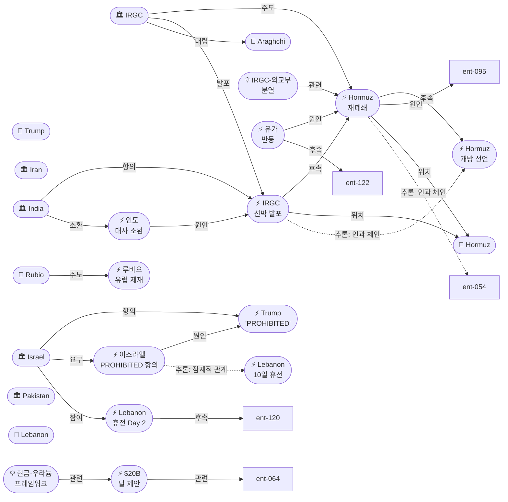
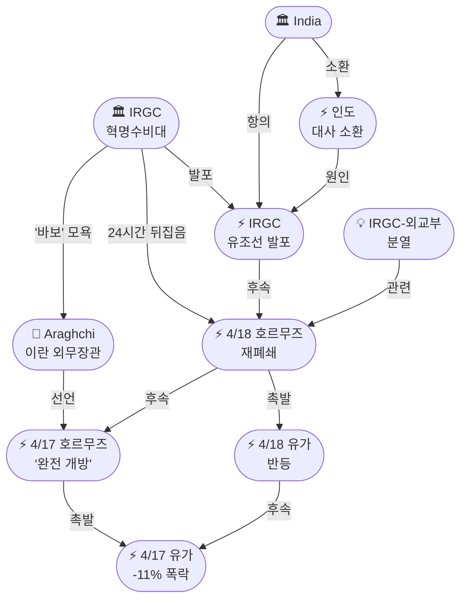
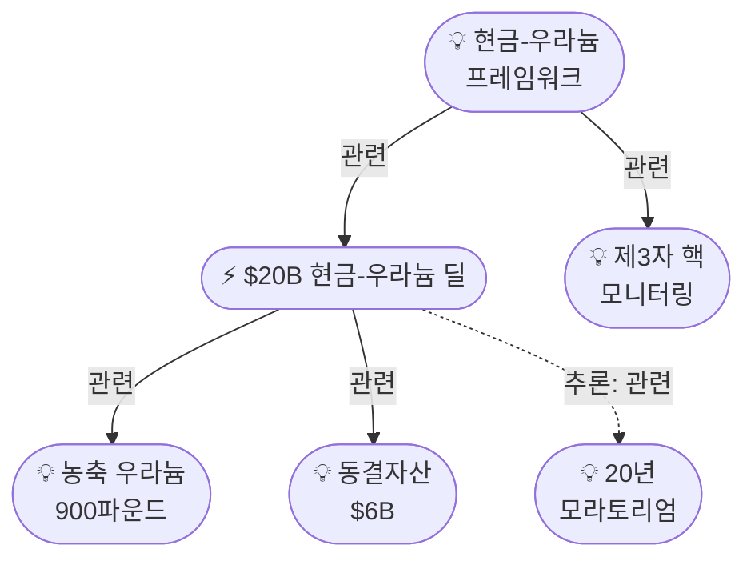

# 2026-04-18 2026 Iran War OSINT 일일 보고서

## 요약

전쟁 50일차(휴전 11일차, 봉쇄 6일차), 어제의 호르무즈 '삼중 현실'이 24시간 만에 사중 현실로 격화되었다. IRGC가 아라그치 외무장관의 '완전 개방' 선언을 정확히 하루 만에 뒤집고 호르무즈를 재폐쇄했으며, 인도 국적 VLCC 유조선 Sanmar Herald에 실탄을 발포하여 전쟁 이후 **최초의 직접적 해상 군사 행동**을 감행했다. IRGC는 아라그치를 공개적으로 "바보(idiot)"라고 지칭하며 군-외교부 분열이 개인적 모욕 수준까지 에스컬레이션되었다. 한편 Axios/CNN이 **$20B 현금-우라늄 딜 프레임워크**를 최초 공개하여 핵 협상에 가장 구체적인 금액이 등장했다. 이스라엘은 트럼프의 'PROHIBITED' 경고에 '충격'을 받고 백악관에 설명을 요구했으며, 레바논 휴전 2일차는 위반이 지속되는 가운데 실향민 귀환이 시작되었다. 4/21 2차 회담은 재폐쇄에도 불구하고 여전히 유효하나, IRGC가 외교부의 합의를 24시간 내 무력화할 수 있다는 현실은 이란 대표단의 합의 능력 자체에 근본적 의문을 던진다.

## 주요 뉴스

### 1. IRGC, 호르무즈 재폐쇄 — 아라그치 '완전 개방' 24시간 만에 역전
- **출처:** [Al Jazeera](https://www.aljazeera.com/news/2026/4/18/iran-closes-strait-of-hormuz-again-over-us-blockade-of-its-ports), [CNN](https://www.cnn.com/2026/04/18/world/live-news/iran-war-trump-israel), [CBC News](https://www.cbc.ca/news/world/strait-of-hormuz-blocked-iran-us-9.7169212), [NPR/MPR](https://www.mprnews.org/story/2026/04/18/npr-iran-middle-east-updates), [ABC News](https://abcnews.com/International/live-updates/iran-live-updates-us-blockade-irans-strait-hormuz/?id=131983647), [뉴스핌](https://www.newspim.com/news/view/20260418000099), [파이낸셜뉴스](https://www.fnnews.com/news/202604181955374028), [오마이뉴스](https://www.ohmynews.com/NWS_Web/View/at_pg.aspx?CNTN_CD=A0003225907)
- **일시:** 2026-04-18
- **내용:** IRGC 해군이 4월 17일 아라그치가 선언한 호르무즈 '완전 개방'을 정확히 24시간 만에 뒤집고 해협을 재폐쇄했다. IRGC는 미국의 해상 봉쇄가 지속되는 한 호르무즈를 개방할 수 없다고 밝혔으며, "봉쇄가 해제될 때까지 폐쇄를 유지한다(will remain closed until the blockade is lifted)"고 선언했다. 이는 이란 내에서 외교부(아라그치)의 결정이 군부(IRGC)에 의해 사실상 거부권을 행사당한 것으로, 이란의 정책 결정 구조 자체에 위기가 발생했음을 의미한다. 진입 중이던 선박들도 회항했다.
- **상태:** 신규
- **관련 엔티티:** IRGC, Iran, Strait of Hormuz, Abbas Araghchi

### 2. IRGC, 인도 국적 유조선에 실탄 발포 — 전쟁 이후 최초 해상 군사행동
- **출처:** [NBC News](https://www.nbcnews.com/world/iran/live-blog/live-updates-iran-says-strait-hormuz-reverted-strict-control-blames-us-rcna340767), [Axios](https://www.axios.com/2026/04/18/iran-closes-strait-of-hormuz-once-again-fires-on-tankers), [PBS](https://www.pbs.org/newshour/world/irans-military-closes-strait-of-hormuz-again-citing-u-s-blockade), [국민일보](https://www.kmib.co.kr/article/view.asp?arcid=0029698806&code=61131111&sid1=int), [헤럴드경제](https://biz.heraldcorp.com/article/10720213), [아시아경제](https://www.asiae.co.kr/article/2026041822542354396)
- **일시:** 2026-04-18
- **내용:** IRGC 해군이 호르무즈 재폐쇄 과정에서 인도 국적 VLCC 유조선 **Sanmar Herald**에 경고사격 후 실탄을 발포했다. 영국 해사무역기구(UKMTO)가 최초 보고했으며, 선박에 인명 피해는 보고되지 않았으나 선체에 탄흔이 확인되었다. 이는 **2026년 이란 전쟁 개전 이래 최초의 상선에 대한 직접적 군사 행동**이다. 인도 외무부는 즉시 이란 대사를 소환하고 "강력한 항의(strongest protest)"를 전달했으며, 인도 국적 선박의 안전 보장을 요구했다. 인도-이란 관계에 새로운 긴장이 발생했다.
- **상태:** 신규
- **관련 엔티티:** IRGC, India, Strait of Hormuz

### 3. IRGC, 아라그치를 '바보(idiot)'로 공개 모욕 — 군-외교부 분열 극대화
- **출처:** [HotAir](https://hotair.com/david-strom/2026/04/18/irgc-closes-strait-again-calls-irans-foreign-minister-an-idiot-n3814049)
- **일시:** 2026-04-18
- **내용:** IRGC 계열 매체가 아라그치 외무장관의 호르무즈 개방 결정을 "어리석은 짓(idiotic move)"이라고 비판하며 그를 공개적으로 "바보(idiot)"라고 지칭했다. IRGC는 "외교부가 군사 문제에 개입할 권한이 없다(no authority over military matters)"고 밝혔다. 이는 이란 내부에서 실용파(외교부/대통령실)와 강경파(IRGC/SNSC/최고지도자 측근) 간의 분열이 공개적 모욕 수준까지 에스컬레이션된 것으로, 4/21 2차 회담에서 이란 대표단이 합의해도 IRGC가 이행을 거부할 수 있다는 구조적 리스크를 부각시킨다.
- **상태:** 신규
- **관련 엔티티:** IRGC, Abbas Araghchi, IRGC-Diplomatic Rift

### 4. $20B 현금-우라늄 딜 프레임워크 최초 공개
- **출처:** [Axios](https://www.axios.com/2026/04/17/iran-us-deal-20-billion-frozen-funds-uranium), [CNN](https://www.cnn.com/2026/04/17/politics/iran-trump-money-uranium-deal)
- **일시:** 2026-04-17~18 (보도)
- **내용:** Axios와 CNN이 미국이 검토 중인 **$20B(약 29조 원) 현금-우라늄 딜** 프레임워크를 최초로 보도했다. 핵심 구조: (1) 미국이 동결된 이란 자산 $20B을 단계적으로 해제, (2) 이란은 보유 중인 농축 우라늄 900파운드를 제3국(카자흐스탄 또는 러시아)으로 이전, (3) 이란은 농축을 3.67%(민간용) 이하로 제한하는 데 동의. CNN은 트럼프 행정부가 오바마 행정부의 유사한 조치($6B 해제)를 비판했던 전력이 있어 **정치적 모순**이 있다고 지적했다. 이 딜은 20년 모라토리엄, 제3자 모니터링에 이어 세 번째 핵 타협 경로로, 가장 구체적인 금액이 처음 등장했다.
- **상태:** 신규
- **관련 엔티티:** Enriched Uranium Issue, Frozen Assets ($6B), Cash-for-Uranium Framework

### 5. 이스라엘, PROHIBITED에 '충격' — 백악관에 설명 요구
- **출처:** [EADaily](https://eadaily.com/en/news/2026/04/18/israel-is-shocked-and-demands-an-explanation-from-the-white-house-about-trumps-ban-on-hitting-lebanon)
- **일시:** 2026-04-18
- **내용:** 이스라엘 정부가 트럼프의 레바논 폭격 'PROHIBITED' 경고에 "충격(shocked)"을 받았다고 밝히며 백악관에 공식 설명을 요구했다. 네타냐후 총리는 레바논이 미-이란 휴전에 포함된 것 자체를 부인(denial)하면서도, 미국의 지원 없이 전쟁을 지속할 수 없다는 딜레마에 직면해 있다. 이스라엘은 PROHIBITED가 단순 수사인지, 군사적 지원 중단의 전조인지를 파악하려 하고 있다. 이 사태는 미-이스라엘 동맹 관계에서 전례 없는 공개적 마찰로, 2차 회담에서 이스라엘 요소가 예기치 못한 변수가 될 수 있다.
- **상태:** 신규
- **관련 엔티티:** Israel, Donald Trump, Trump PROHIBITED Warning

### 6. 레바논 휴전 2일차 — 위반 지속, 실향민 귀환 시작
- **출처:** [Al Jazeera](https://www.aljazeera.com/news/2026/4/18/displaced-lebanese-return-as-israeli-shelling-violates-ceasefire-in-south)
- **일시:** 2026-04-18
- **내용:** 레바논 휴전 2일차, 이스라엘군의 남부 레바논 포격이 계속되었으나 전반적으로 1일차보다 폭력 수위는 낮아졌다. 한편 수만 명의 실향민이 남부 레바논으로 귀환하기 시작했으며, 일부는 파괴된 마을에 도착해 잔해 속에서 소지품을 수습했다. 이스라엘군은 여전히 리타니강 남쪽에 주민 접근 금지 구역을 유지하고 있으며, 레바논군은 이스라엘의 포격을 휴전 위반으로 규정했다.
- **상태:** 업데이트 ← 2026-04-17 "레바논 휴전 첫날"
- **관련 엔티티:** Israel, Lebanon, Israel-Lebanon 10-Day Ceasefire

### 7. 루비오, 유럽에 이란 제재 동참 촉구
- **출처:** [Irish Times](https://www.irishtimes.com/world/middle-east/2026/04/18/iran-us-israel-strait-of-hormuz-latest-live-updates/)
- **일시:** 2026-04-18
- **내용:** 마르코 루비오 국무장관이 유럽 동맹국들에 이란에 대한 다자적 제재 체제 강화를 촉구했다. 루비오는 이란의 호르무즈 재폐쇄와 선박 발포를 근거로 "이란의 행동이 국제 해양법을 위반하고 있으며 유럽도 동참해야 한다"고 밝혔다. 이는 미국의 일방적 봉쇄를 다자적 제재로 확대하려는 시도로, EU의 반응이 주목된다.
- **상태:** 신규
- **관련 엔티티:** Marco Rubio, European Union

### 8. 2차 회담 업데이트 — 재폐쇄에도 4/21 월요일 유효
- **출처:** [PBS](https://www.pbs.org/newshour/world/pakistan-proposes-second-round-of-u-s-iran-talks-as-standoff-deepens), [머니투데이](https://www.mt.co.kr/world/2026/04/18/2026041805430576863)
- **일시:** 2026-04-18
- **내용:** IRGC의 호르무즈 재폐쇄와 선박 발포에도 불구하고, 4/21 월요일 파키스탄에서의 2차 미-이란 회담은 여전히 유효하다. 파키스탄 외교부는 양측 대표단이 주말 중 도착할 예정이라고 확인했다. 트럼프는 "1~2일 내 타결(deal within a day or two)"이라는 낙관을 반복했으나, IRGC가 외교부의 합의를 24시간 내 무력화할 수 있다는 현실이 협상의 신뢰성에 의문을 던진다.
- **상태:** 업데이트 ← 2026-04-17 "2차 회담 4/21 확정"
- **관련 엔티티:** 2nd Round Talks Monday Apr 21, Pakistan

### 9. 유가 반등 — 재폐쇄 소식에 하루 만에 되돌림
- **출처:** [OilPrice.com](https://oilprice.com/Latest-Energy-News/World-News/Oil-Prices-Rise-as-Iran-Signals-Hormuz-Closure.html)
- **일시:** 2026-04-18
- **내용:** 어제 호르무즈 개방으로 11% 폭락했던 유가가 재폐쇄 소식에 반등했다. 24시간 내 완전한 시장 역전이 발생하여, 시장의 종전 낙관이 얼마나 취약한 기반 위에 있는지를 보여주었다. IRGC의 선박 발포 소식이 추가로 전해지면서 상승폭이 확대되었다.
- **상태:** 신규
- **관련 엔티티:** Oil Price Rebound (Apr 18), Strait of Hormuz

## 지식그래프

### 오늘의 주요 관계
- **호르무즈 24시간 역전:** IRGC(ent-005)가 재폐쇄(ent-128)를 단행하고 선박 발포(ent-129)까지 감행하여 아라그치의 개방 선언(ent-117)을 완전히 무력화했다. 재폐쇄→follows→개방, 발포→follows→재폐쇄의 에스컬레이션 체인이 형성되었다.
- **IRGC-외교부 분열 전면화:** IRGC(ent-005)가 아라그치(ent-044)를 공개적으로 대립(opposes)하며 '바보' 모욕. IRGC-Diplomatic Rift(ent-135)가 새로운 개념으로 등장. 이란의 정책 결정에서 군부가 외교부를 압도하는 구조가 노출.
- **핵 협상 새 축:** $20B 딜(ent-130)이 농축 우라늄(ent-064)과 동결자산(ent-062) 양쪽에 연결되며, 현금-우라늄 프레임워크(ent-136)가 제3자 모니터링(ent-125)과 연계. 20년 모라토리엄(ent-071)과의 간접 관계도 추론됨.
- **미-이스라엘 긴장 심화:** 이스라엘(ent-004)이 PROHIBITED(ent-121)에 대립(opposes)하고 설명을 요구(ent-133). 레바논 휴전(ent-109)과의 잠재적 관계가 추론됨.

### 전체 지식그래프 시각화

### 호르무즈 24시간 역전 세부 그래프

### 핵 협상 프레임워크 세부 그래프

## 온톨로지 변경

| 변경 유형 | 대상 | 근거 |
|----------|------|------|
| 새 엔티티 (Event) | ent-128 Iran Hormuz Re-closure (Apr 18) | IRGC 24시간 만에 아라그치 개방 뒤집음 |
| 새 엔티티 (Event) | ent-129 IRGC Fires on Ships (Apr 18) | 인도 국적 Sanmar Herald 실탄 발포, 최초 해상 군사행동 |
| 새 엔티티 (Event) | ent-130 $20B Cash-for-Uranium Deal Proposal | Axios/CNN 최초 공개, 구체적 금액 |
| 새 엔티티 (Event) | ent-131 Rubio European Sanctions Push | 유럽에 다자적 제재 동참 촉구 |
| 새 엔티티 (Event) | ent-132 India Summons Iran Ambassador | 선박 발포 → 인도 대사 소환, 강력 항의 |
| 새 엔티티 (Event) | ent-133 Israel Demands PROHIBITED Explanation | PROHIBITED에 '충격', 백악관 설명 요구 |
| 새 엔티티 (Event) | ent-134 Lebanon Ceasefire Day 2 | 위반 지속, 실향민 귀환 시작 |
| 새 엔티티 (Concept) | ent-135 IRGC-Diplomatic Rift | 군-외교부 공개 분열, '바보' 모욕 |
| 새 엔티티 (Concept) | ent-136 Cash-for-Uranium Framework | $20B + 우라늄 이전 + 3.67% 농축 제한 |
| 새 엔티티 (Event) | ent-137 Oil Price Rebound (Apr 18) | 재폐쇄 → 유가 반등, 24시간 시장 역전 |
| 엔티티 업데이트 | ent-005 IRGC | 재폐쇄 주도, 선박 발포, 아라그치 '바보' 모욕 |
| 엔티티 업데이트 | ent-008 Hormuz | 삼중현실 → 사중현실 (개방→재폐쇄→발포) |
| 엔티티 업데이트 | ent-044 Araghchi | IRGC에 공개 모욕, 24시간 내 결정 뒤집힘 |
| 엔티티 업데이트 | ent-080 India | 자국 선박 피격, 대사 소환, 강력 항의 |

## 추론 결과

| # | 추론 | 규칙 | 신뢰도 | 근거 |
|---|------|------|--------|------|
| 49 | Hormuz Re-closure ← 인과 체인 ← Islamabad | event_chain | 0.72 | 결렬 → 봉쇄 → 완전 시행 → 재폐쇄 (4단계) |
| 50 | IRGC Fires ← 인과 체인 ← Hormuz Opening | event_chain | 0.72 | 개방 → 재폐쇄 → 발포 (3단계) |
| 51 | Oil Rebound ← 인과 체인 ← Hormuz Opening | event_chain | 0.72 | 개방 → 폭락 → 재폐쇄 → 반등 (4단계) |
| 52 | $20B Deal ↔ 20-Year Moratorium | co_participation | 0.80 | 같은 쟁점(농축 우라늄)에 대한 두 타협 경로 |
| 53 | IRGC ↔ Iran (내부 분열) | co_participation | 0.85 | affiliatedWith이면서 opposes Araghchi — 구조적 모순 |
| 54 | Israel PROHIBITED ↔ Lebanon Ceasefire | co_participation | 0.75 | PROHIBITED 항의 → 레바논 휴전 연계 |

## 분석 및 평가

### IRGC의 24시간 역전 — 이란의 권력 구조가 드러나다
4월 18일은 이란 내부의 권력 역학이 가장 적나라하게 드러난 날이다. 아라그치 외무장관이 전날 선언한 호르무즈 '완전 개방'을 IRGC가 정확히 24시간 만에 뒤집었을 뿐 아니라, 아라그치를 공개적으로 '바보'라고 모욕했다. 이는 세 가지 구조적 의미를 가진다:

1. **군부 우위 확인:** 이란의 외교 정책이 외교부가 아닌 IRGC/SNSC에 의해 사실상 결정된다. 아라그치는 최고지도자(모즈타바 하메네이)와 IRGC의 동의 없이 호르무즈 개방을 선언했거나, 동의를 받았으나 IRGC가 일방적으로 철회한 것이다. 어느 쪽이든 외교부의 신뢰도에 심각한 타격.

2. **2차 회담 신뢰성 위기:** 4/21 이란 대표단이 어떤 합의를 이루더라도, IRGC가 24시간 내 이행을 거부할 수 있다는 전례가 만들어졌다. 미국으로서는 "누구와 합의하는 것인가?"라는 근본적 질문.

3. **좋은 경찰/나쁜 경찰 가능성:** 아라그치의 개방과 IRGC의 재폐쇄가 의도적인 역할 분담일 수 있다 — 외교적 유연성(협상 의지)과 군사적 결의(압박 유지)를 동시에 보여주는 전략. 그러나 '바보' 모욕의 수위는 전술적 연출을 넘어 진짜 분열의 증거로 보인다.

### $20B 딜 — 핵 협상의 세 번째 축
$20B 현금-우라늄 딜은 (1) 20년 모라토리엄, (2) 제3자 모니터링에 이어 세 번째 핵 타협 경로다. 가장 구체적인 금액($20B = 약 29조 원)이 처음 등장한 점에서 의미가 크다. 이 딜의 핵심 구조는 경제적 인센티브(동결자산 해제)와 안보적 양보(우라늄 이전)의 교환이다. 트럼프 행정부가 오바마의 $6B 해제를 비판했던 전력이 있어 정치적 모순이 있으나, 전쟁 종결이라는 명분이 이를 상쇄할 수 있다. 세 가지 경로가 합쳐질 가능성 — '$20B + 제한적 모라토리엄 + 모니터링'이라는 패키지 딜이 2차 회담의 실질적 의제가 될 수 있다.

### 미-이스라엘 긴장의 구조적 전환
이스라엘이 PROHIBITED에 '충격'을 받고 백악관에 설명을 요구한 것은, 트럼프의 중동 전략이 이스라엘의 이해와 정면으로 충돌하기 시작했음을 보여준다. 트럼프는 이란과의 종전 협상을 최우선시하고, 이를 위해 레바논 휴전을 레버리지로 사용하고 있다. 이스라엘은 헤즈볼라와의 군사적 자유를 유지하려 하나, 미국의 지원 없이 이를 실현할 수 없다. 네타냐후가 레바논 휴전 포함 자체를 부인하는 것은 국내 정치적 제스처이나, 실질적으로 PROHIBITED를 무시할 수 없다.

### 24시간 시장 역전의 의미
어제 호르무즈 개방에 11% 폭락한 유가가 오늘 재폐쇄에 반등한 것은, 시장의 종전 낙관이 얼마나 취약한 기반 위에 있는지를 보여주는 생생한 사례다. IRGC 한 조직의 결정이 24시간 내 수십억 달러의 시장 가치를 움직일 수 있다는 현실은, 4/21 2차 회담의 결과에 따른 시장 변동성이 극도로 높을 것임을 예고한다.

## 추적 항목

| 항목 | 최초 보고 | 상태 | 최신 업데이트 |
|------|----------|------|-------------|
| 2주 휴전 (4/21~22 만료) | 2026-04-07 | **임박 — 3일 남음** | 재폐쇄에도 2차 회담 유효. IRGC 군사행동 에스컬레이션. |
| 미-이란 종전 협상 | 2026-04-07 | **2차 회담 4/21 유지** | 재폐쇄에도 양측 참여 의지 확인. 이란 대표단 합의 능력에 의문. |
| 호르무즈 해협 | 2026-04-07 | 사중 현실 (봉쇄 6일차) | 개방→재폐쇄→발포. IRGC가 외교부 결정 무력화. |
| 이란 내부 분열 | 2026-04-17 | **극적 에스컬레이션** | IRGC '바보' 모욕, 24시간 역전, 선박 발포 — 군-외교부 분열 전면화 |
| 핵 문제 (농축 우라늄) | 2026-04-12 | **$20B 딜 등장** | $20B 현금-우라늄 + 제3자 모니터링 + 모라토리엄 — 3개 경로 수렴 가능 |
| 이스라엘-레바논 | 2026-04-08 | 휴전 2일차 (취약) | 위반 지속 + 실향민 귀환 + PROHIBITED 항의 |
| 트럼프-네타냐후 긴장 | 2026-04-17 | 심화 | 이스라엘 '충격', 백악관 설명 요구, 동맹 관계 새 긴장 |
| 유가 동향 | 2026-04-12 | 24시간 역전 | 4/17 -11% 폭락 → 4/18 재폐쇄 반등. 변동성 극대화. |
| 인도-이란 긴장 | 2026-04-18 | **신규 추적** | IRGC 선박 발포 → 대사 소환. 비동맹국까지 영향. |
| 파키스탄 중재 | 2026-04-07 | 유지 | 2차 회담 호스팅 준비. 양측 주말 도착 예정. |
| 이란 배상 요구 | 2026-04-15 | 유지 | $270B, 3대 쟁점 중 하나 |
| 글로벌 경제 영향 | 2026-04-13 | 변동성 극대화 | 24시간 내 시장 완전 역전. 4/21 결과에 따라 극변 예상. |

## 동향 요약

| 분류 | 상태 | 비고 |
|------|------|------|
| 호르무즈 | 사중 현실 (봉쇄 6일차) | 개방→재폐쇄→발포. IRGC가 외교부 결정 24시간 내 무력화. |
| 레바논 | 휴전 2일차 (취약) | 위반 지속 + 실향민 귀환 + 이스라엘 PROHIBITED 항의 |
| 외교 (이란) | **2차 회담 4/21 유지** | 재폐쇄에도 유효. 이란 합의 능력에 의문 부상. |
| 외교 (핵) | $20B 딜 등장 | 현금-우라늄 + 모니터링 + 모라토리엄 — 3개 경로 수렴 |
| 외교 (다자) | 루비오 유럽 제재 촉구 | 일방적 봉쇄 → 다자적 제재 확대 시도 |
| 미-이스라엘 | 긴장 심화 | PROHIBITED '충격' → 백악관 설명 요구 |
| 이란 내부 | 분열 극대화 | IRGC '바보' 모욕, 군부 우위 확인 |
| 인도-이란 | 신규 긴장 | 선박 발포 → 대사 소환 → 비동맹국 영향 확대 |
| 경제/시장 | 24시간 역전 | 4/17 유가 -11% → 4/18 반등. 극도의 변동성. |
| 휴전 | **3일 남음** | 2차 회담 4/21. 성공 시 종전, 실패 시 전면전 재개. |

## 출처 목록

1. [Iran closes Strait of Hormuz again over US blockade of its ports](https://www.aljazeera.com/news/2026/4/18/iran-closes-strait-of-hormuz-again-over-us-blockade-of-its-ports) - Al Jazeera, 2026-04-18
2. [Iran renews restrictions on Strait of Hormuz as peace talks approach](https://www.cnn.com/2026/04/18/world/live-news/iran-war-trump-israel) - CNN, 2026-04-18
3. [Live updates: Two Indian ships come under fire in Strait of Hormuz](https://www.nbcnews.com/world/iran/live-blog/live-updates-iran-says-strait-hormuz-reverted-strict-control-blames-us-rcna340767) - NBC News, 2026-04-18
4. [Iran closes Strait of Hormuz once again, fires on tankers](https://www.axios.com/2026/04/18/iran-closes-strait-of-hormuz-once-again-fires-on-tankers) - Axios, 2026-04-18
5. [Iran closes Strait of Hormuz over U.S. blockade and fires on ships](https://www.pbs.org/newshour/world/irans-military-closes-strait-of-hormuz-again-citing-u-s-blockade) - PBS, 2026-04-18
6. [Iran reimposes Strait of Hormuz restrictions](https://www.cbc.ca/news/world/strait-of-hormuz-blocked-iran-us-9.7169212) - CBC News, 2026-04-18
7. [Iran live updates: Tehran reviewing new US proposals](https://abcnews.com/International/live-updates/iran-live-updates-us-blockade-irans-strait-hormuz/?id=131983647) - ABC News, 2026-04-18
8. [Scoop: U.S. considers $20 billion cash-for-uranium deal with Iran](https://www.axios.com/2026/04/17/iran-us-deal-20-billion-frozen-funds-uranium) - Axios, 2026-04-17
9. [Trump administration considers unfreezing $20 billion in Iranian assets](https://www.cnn.com/2026/04/17/politics/iran-trump-money-uranium-deal) - CNN, 2026-04-17
10. [Iran studying fresh US proposals, says Hormuz blockade a 'violation'](https://www.irishtimes.com/world/middle-east/2026/04/18/iran-us-israel-strait-of-hormuz-latest-live-updates/) - Irish Times, 2026-04-18
11. [Israel is shocked and demands an explanation from the White House](https://eadaily.com/en/news/2026/04/18/israel-is-shocked-and-demands-an-explanation-from-the-white-house-about-trumps-ban-on-hitting-lebanon) - EADaily, 2026-04-18
12. [Displaced Lebanese return as Israeli shelling violates ceasefire](https://www.aljazeera.com/news/2026/4/18/displaced-lebanese-return-as-israeli-shelling-violates-ceasefire-in-south) - Al Jazeera, 2026-04-18
13. [IRGC Closes Strait Again, Calls Iran's Foreign Minister an 'Idiot'](https://hotair.com/david-strom/2026/04/18/irgc-closes-strait-again-calls-irans-foreign-minister-an-idiot-n3814049) - HotAir, 2026-04-18
14. [Pakistan proposes second round of U.S.-Iran talks](https://www.pbs.org/newshour/world/pakistan-proposes-second-round-of-u-s-iran-talks-as-standoff-deepens) - PBS, 2026-04-18
15. [Iran says it has closed the Strait of Hormuz again](https://www.mprnews.org/story/2026/04/18/npr-iran-middle-east-updates) - NPR/MPR, 2026-04-18
16. [Oil Prices Rise as Iran Signals Hormuz Closure](https://oilprice.com/Latest-Energy-News/World-News/Oil-Prices-Rise-as-Iran-Signals-Hormuz-Closure.html) - OilPrice.com, 2026-04-18
17. [美 봉쇄 유지에 반발한 이란, 하루 만에 호르무즈 해협 통제 재개](https://www.fnnews.com/news/202604181955374028) - 파이낸셜뉴스, 2026-04-18
18. [英해사무역기구 "이란 혁명수비대, 유조선에 발포"](https://www.kmib.co.kr/article/view.asp?arcid=0029698806&code=61131111&sid1=int) - 국민일보, 2026-04-18
19. [英 해사무역기구 "이란 혁명수비대, 호르무즈서 유조선 공격"](https://biz.heraldcorp.com/article/10720213) - 헤럴드경제, 2026-04-18
20. [[종합] 이란, 하루 만에 호르무즈 해협 재폐쇄…美에 해상 봉쇄 해제 요구](https://www.newspim.com/news/view/20260418000099) - 뉴스핌, 2026-04-18
21. ["호르무즈 재개방 하루 만에 선박 잇단 피격"](https://www.asiae.co.kr/article/2026041822542354396) - 아시아경제, 2026-04-18
22. [이란군 "재봉쇄"에 호르무즈 진입한 선박도 배 돌려](https://www.ohmynews.com/NWS_Web/View/at_pg.aspx?CNTN_CD=A0003225907) - 오마이뉴스, 2026-04-18
23. [이란 국회의장 "美 해상봉쇄 계속되면 호르무즈 다시 닫을 것"](https://www.newdaily.co.kr/site/data/html/2026/04/18/2026041800012.html) - 뉴데일리, 2026-04-18
24. [다시 열린 호르무즈...트럼프 "이란전쟁 종전협상 1~2일 안에 타결"](https://www.mt.co.kr/world/2026/04/18/2026041805430576863) - 머니투데이, 2026-04-18
25. [뉴스핌: 이란, 하루 만에 호르무즈 해협 재폐쇄](https://www.newspim.com/news/view/20260418000099) - 뉴스핌, 2026-04-18
