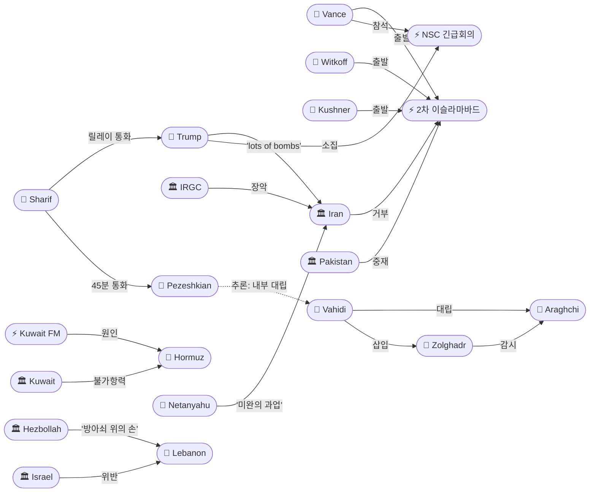
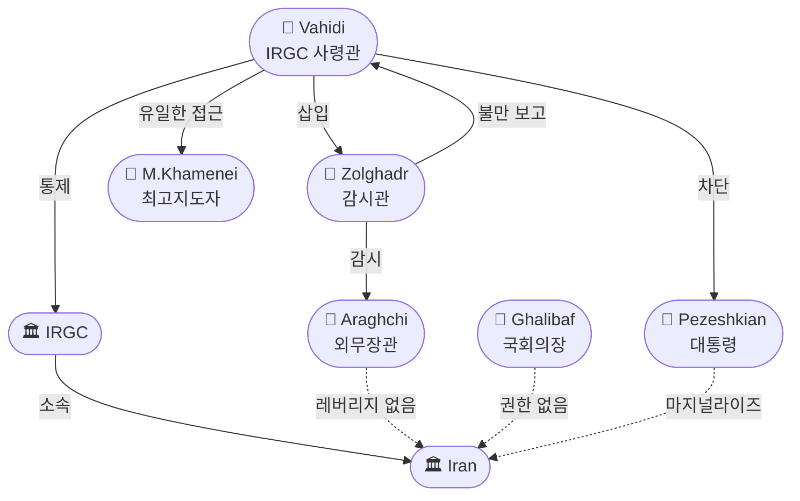

# 2026-04-20 2026 Iran War OSINT 일일 보고서

## 요약

전쟁 52일차(휴전 13일차, 봉쇄 8일차, 레바논 휴전 4일차), **48시간 카운트다운**이 시작되었다. 트럼프는 Bloomberg·PBS 인터뷰에서 휴전이 **수요일 저녁 만료**되며 연장은 **"거의 불가능(highly unlikely)"**하다고 선언, **"딜이 없으면 폭탄이 터지기 시작한다(lots of bombs start going off)"**고 경고했다. 밴스 부통령·위트코프·쿠시너가 월요일 밤 **이슬라마바드로 출발**하여 화요일 2차 회담을 시도하지만, 이란 외무부 대변인 바가이는 **"현 시점에서 협상 계획 없음"**을 공식 발표했다. 쿠웨이트가 전쟁 이후 **첫 걸프국 불가항력(force majeure)을 선언**하여 원유 수출 의무 이행 불가를 통보했고, 유가는 **Brent $96.26으로 $100에 근접**했다. IRGC의 이란 '군사 정권(military junta)' 장악이 다수 매체에서 확인되었으며, **Zolghadr를 이슬라마바드 협상팀에 삽입**하여 Araghchi를 감시한 사실이 새로 드러났다.

## 주요 뉴스

### 1. 트럼프: 휴전 연장 '거의 불가능', 딜 없으면 '폭탄이 터진다'
- **출처:** [CNN](https://www.cnn.com/2026/04/20/world/live-news/iran-war-us-trump-israel), [PBS News](https://www.pbs.org/newshour/politics/trump-tells-pbs-news-that-lots-of-bombs-start-going-off-if-iran-ceasefire-expires), [Bloomberg](https://www.bloomberg.com/news/articles/2026-04-20/trump-says-iran-truce-extension-unlikely-hormuz-to-stay-blocked)
- **일시:** 2026-04-20
- **내용:** 트럼프가 월요일 복수의 전화 인터뷰에서 휴전 만료와 전쟁 재개 가능성을 가장 직접적으로 경고했다. Bloomberg에 "연장은 거의 불가능하다. 나쁜 딜에 서두르지 않겠다"고 밝혔고, PBS News에 "딜이 없으면 폭탄이 많이 터지기 시작한다(lots of bombs start going off)"고 말했다. 호르무즈 봉쇄는 합의 완료 시까지 유지한다고 확인했다. CBS 분석에 따르면 트럼프의 메시지는 3일 만에 "이란이 모든 것에 동의했다"에서 "폭탄이 터진다"로 급변했다.
- **상태:** 신규
- **관련 엔티티:** Donald Trump, Iran, Strait of Hormuz

### 2. 트럼프 긴급 NSC 회의 소집 — 전쟁 지도부 총출동
- **출처:** [CNBC](https://www.cnbc.com/amp/2026/04/20/trump-defense-iran-war-pakistan-vance-witkoff-kushner.html), [KBS](https://www.youtube.com/watch?v=xU5jPWoDlnU)
- **일시:** 2026-04-20
- **내용:** 트럼프가 이란 작전사령부에서 긴급 회의를 소집했다. 참석자: **밴스 부통령, 루비오 국무장관, 헤그세스 국방장관, 베센트 재무장관, 위트코프 특사, 래트클리프 CIA 국장, 케인 합참의장**. 재무장관과 CIA 국장의 참석은 대응이 군사를 넘어 경제 제재와 핵물질 추적 차원으로 확대됨을 시사한다. KBS는 B-21 폭격기 동원 가능성도 보도했다.
- **상태:** 신규
- **관련 엔티티:** Donald Trump, JD Vance, Marco Rubio, Pete Hegseth, Scott Bessent, John Ratcliffe, Dan Caine

### 3. 밴스·위트코프·쿠시너, 이슬라마바드 출발 — 2차 회담 화요일 개시
- **출처:** [Al Jazeera](https://www.aljazeera.com/features/2026/4/20/second-round-in-islamabad-whos-at-the-us-iran-negotiating-table), [Morning Honey](https://www.morninghoney.com/p/things-changed-jd-vance-to-join-second-round-of-iran-talks-despite-initial-trump-confusion), [The Week](https://www.theweek.in/news/middle-east/2026/04/20/as-jd-vance-islamabad-for-talks-benjamin-netanyahu-says-israel-has-unfinished-job-in-iran.html)
- **일시:** 2026-04-20
- **내용:** 밴스 부통령이 1차와 동일한 팀(밴스·위트코프·쿠시너)을 이끌고 월요일 밤 파키스탄으로 출발했다. 백악관 리빗 대변인이 밴스 참석을 확정했다. 이는 4/19 트럼프가 '보안 우려'로 밴스 불참을 시사한 것과 달라진 것으로, Morning Honey는 "'상황이 변했다(Things Changed)'"고 보도했다. 정식 협상은 화요일(4/22) 시작 예정이다.
- **상태:** 신규
- **관련 엔티티:** JD Vance, Steve Witkoff, Jared Kushner, Pakistan, Islamabad

### 4. 이란: '현 시점에서 협상 계획 없음' — 파키스탄은 '포지셔닝'으로 해석
- **출처:** [Al Jazeera](https://www.aljazeera.com/news/2026/4/20/pakistan-ready-for-multi-day-us-iran-talks-but-tehran-unsure-about-joining), [YTN](https://www.ytn.co.kr/_ln/0104_202604201750373491), [Euronews](https://www.euronews.com/2026/04/20/tehran-vows-swift-response-after-us-seizes-iranian-flagged-vessel-near-the-strait-of-hormu)
- **일시:** 2026-04-20
- **내용:** 이란 외무부 대변인 에스마일 바가이가 "현 시점에서 다음 라운드 계획이 없다"고 밝히며, 미국이 "휴전 시작부터 위반했다"고 비난했다. 호르무즈 봉쇄와 Touska 나포를 구체적 위반 사례로 제시했다. 그러나 파키스탄 소식통은 NY Post에 이란의 거부가 **"최상의 딜을 위한 포지셔닝(mere posturing)"**이라고 전했으며, 이슬라마바드 회담장 봉쇄와 도로 차단 등 모든 준비는 완료되었다.
- **상태:** 업데이트 ← 2026-04-19 "이란 2차 회담 거부"
- **관련 엔티티:** Iran, Esmail Baghaei, Pakistan

### 5. 쿠웨이트, 원유 불가항력(Force Majeure) 선언 — 전쟁 이후 첫 걸프국
- **출처:** [Bloomberg](https://www.bloomberg.com/news/articles/2026-04-20/kuwait-declares-force-majeure-on-oil-shipments-on-hormuz-halt), [World Oil](https://www.worldoil.com/news/2026/4/20/kuwait-declares-force-majeure-as-hormuz-disruption-halts-oil-export-flows/), [The Daily Star](https://www.thedailystar.net/business/news/kuwait-declares-force-majeure-cuts-crude-oil-output-due-middle-east-conflict-4123581)
- **일시:** 2026-04-20
- **내용:** 쿠웨이트석유공사(KPC)가 원유 및 정제유 선적에 대해 **불가항력을 선언**했다. 호르무즈 해협 봉쇄로 고객 의무 이행이 불가능하다고 통보한 것으로, **전쟁 이후 첫 걸프국의 공식 불가항력 선언**이다. 쿠웨이트의 석유 인프라는 전쟁으로 다중 피해를 입었으며, 생산량은 1990년대 이라크 침공 이후 수준으로 감소했다. 호르무즈가 재개방되더라도 즉시 의무를 충족할 수 없다고 밝혔다.
- **상태:** 신규
- **관련 엔티티:** Kuwait, Strait of Hormuz

### 6. IRGC '군사 정권' 장악 확인 — Zolghadr 협상팀 삽입으로 외교관 감시
- **출처:** [Christian Science Monitor](https://www.csmonitor.com/World/Middle-East/2026/0420/iran-war-regime-change-hard-line-new-leaders), [Jerusalem Post](https://www.jpost.com/middle-east/iran-news/article-892602), [HotAir](https://hotair.com/headlines/2026/04/20/iran-now-a-military-junta-as-questions-about-nuclear-material-swirl-n3814072), [SM Observer](https://www.smobserved.com/story/2026/04/20/news/irgc-hardliners-seize-control-of-irans-military-and-diplomatic-posture-amid-us-talks-moderates-sidelined/9797.html)
- **일시:** 2026-04-20
- **내용:** 다수 매체가 이란이 사실상 **IRGC '군사 정권(military junta)'** 상태라고 동시 분석했다. CSM은 "이란의 정권은 실제로 바뀌었다: 덜 절제되고, 더 강경하다"고 보도했다. Jerusalem Post는 **Vahidi가 Zolghadr를 이슬라마바드 협상팀에 삽입**한 사실을 최초 보도했다 — Ghalibaf과 Araghchi는 외교 경험 부족을 이유로 반대했으나 무시되었다. Zolghadr는 Araghchi가 '저항의 축' 지원에 유연성을 보였다는 불만을 IRGC 상부에 보고했다. Araghchi와 Ghalibaf는 "의사결정을 좌우할 레버리지나 공식 권한이 없다"고 평가되었다.
- **상태:** 업데이트 ← 2026-04-19 "Vahidi 배후 권력 확인"
- **관련 엔티티:** IRGC, Ahmad Vahidi, Zolghadr, Abbas Araghchi, Mohammad Bagher Ghalibaf

### 7. 파키스탄 셔틀 외교 — 샤리프·페제시키안 45분 통화, 트럼프 릴레이
- **출처:** [Pakistan Today](https://www.pakistantoday.com.pk/2026/04/20/in-45-min-call-with-pezeshkian-pm-reaffirms-commitment-to-regional-peace), [경향신문](https://www.khan.co.kr/article/202604201604001/), [Defense Post](https://thedefensepost.com/2026/04/20/pakistan-iran-us-mediation-talks/amp/), [파이낸셜뉴스](https://www.fnnews.com/news/202604200519575962)
- **일시:** 2026-04-20
- **내용:** 샤리프 총리가 이란 **페제시키안 대통령과 45분 통화**를 한 뒤 **트럼프와 릴레이 통화**를 수행했다. 페제시키안은 미국의 "적대적 행위와 위협적 언사가 협상 진정성에 의구심을 불러일으킨다"고 비판했으나, 무니르 총사령관의 테헤란 방문에서의 "건설적 대화"를 높이 평가했다. 경향신문에 따르면 무니르는 페제시키안·갈리바프·아라그치 등 이란 당·정·군 핵심을 **개별 면담**했다. 파키스탄은 '수일간(multi-day)' 회담을 준비 중이다.
- **상태:** 신규
- **관련 엔티티:** Shehbaz Sharif, Masoud Pezeshkian, Donald Trump, Asim Munir, Pakistan

### 8. 네타냐후: 이란에서 '미완의 과업' — 밴스 이슬라마바드 도착 동시
- **출처:** [The Week](https://www.theweek.in/news/middle-east/2026/04/20/as-jd-vance-islamabad-for-talks-benjamin-netanyahu-says-israel-has-unfinished-job-in-iran.html)
- **일시:** 2026-04-20
- **내용:** 네타냐후 총리가 밴스의 이슬라마바드 도착과 동시에 이스라엘은 이란에서 **"미완의 과업(unfinished job)"**이 있다고 발언했다. 이는 4/17 트럼프의 'PROHIBITED' 경고 이후에도 이스라엘이 독자적 대이란 군사 작전 의지를 포기하지 않았음을 시사한다.
- **상태:** 신규
- **관련 엔티티:** Benjamin Netanyahu, Israel, Iran

### 9. 유가 $100 근접 — Brent $96.26, 4일 연속 대형 변동
- **출처:** [The National](https://www.thenationalnews.com/business/energy/2026/04/20/oil-prices-near-100-as-iranian-cargo-ship-seizure-escalates-hormuz-stand-off/), [OilPrice.com](https://oilprice.com/Latest-Energy-News/World-News/Oil-Prices-Surge-After-US-Seizes-Iranian-Vessel-Near-Hormuz.html)
- **일시:** 2026-04-20
- **내용:** Brent가 $96.26으로 $100에 근접, WTI도 $90 수준을 유지했다. 4/17 폭락(-11%) → 4/18 반등 → 4/19 급등(+7%) → **4/20 $96-100 레인지**로 4일 연속 대형 변동이 지속되었다. Goldman Sachs는 호르무즈 1개월 추가 폐쇄 시 2026년 전체 Brent $100 이상을 전망했다. 200척 이상의 탱커가 페르시아만에 체류 중이며, 글로벌 생산 10-11 mb/d 감소가 지속되고 있다.
- **상태:** 업데이트 ← 2026-04-19 "유가 3차 급변"
- **관련 엔티티:** Strait of Hormuz, Kuwait

### 10. 레바논 휴전 Day 4 — 위반 지속, 헤즈볼라 '방아쇠 위의 손'
- **출처:** [Kurdistan24](https://www.kurdistan24.net/en/story/909181/lebanese-hezbollah-accuses-israel-of-ceasefire-violations-amid-heightened-military-readiness), [CSM](https://www.csmonitor.com/World/Middle-East/2026/0420/lebanon-ceasefire-israel-hezbollah-civilians-homes)
- **일시:** 2026-04-20
- **내용:** 이스라엘군의 남부 레바논 포격이 휴전 4일차에도 지속되었다. 히암(Khiam)과 빈트 주베일(Bint Jbeil) 지역에서 공격이 보고되었다. 헤즈볼라 사무총장 나임 카셈은 **"저항 전사들은 방아쇠 위에 손을 얹고 현장에 남아 위반에 대응할 것"**이라고 경고했으며, 이스라엘의 레바논 완전 철수를 요구했다. CSM은 피난민의 귀환 시도를 보도 — "집으로 돌아가면 — 집이 아직 있다면(a rush home — if it's still there)."
- **상태:** 업데이트 ← 2026-04-19 "이스라엘 Yellow Line"
- **관련 엔티티:** Israel, Lebanon, Hezbollah, Naim Qassem

## 지식그래프

### 오늘의 주요 관계

1. **트럼프 → 긴급 NSC 회의 → 전쟁 지도부 7인**: 재무장관·CIA 국장 포함으로 경제전·정보전 확대 시사
2. **IRGC/Vahidi → Zolghadr 삽입 → Araghchi 감시**: 이란 외교관이 IRGC의 직접 감시 하에 있음 확인 — 타협 가능성 구조적 차단
3. **쿠웨이트 불가항력 → 호르무즈 봉쇄 → 이슬라마바드 결렬**: 전쟁의 경제적 충격이 걸프국 공식 선언으로 확산
4. **파키스탄(Sharif) ↔ 이란(Pezeshkian) ↔ 미국(Trump)**: 릴레이 통화 셔틀 외교, 2차 회담 성사 최종 시도
5. **밴스/위트코프/쿠시너 → 이슬라마바드 출발 vs 이란 '계획 없음'**: 회담 실현 여부 미결

### 전체 지식그래프 시각화

### 주제별 세부 그래프: IRGC 권력 장악 구조

## 온톨로지 변경

| 변경 유형 | 대상 | 근거 |
|----------|------|------|
| 새 엔티티 | Masoud Pezeshkian (이란 대통령) | 샤리프 45분 통화 상대, IRGC에 의해 마지널라이즈 |
| 새 엔티티 | Zolghadr (IRGC 감시관) | Vahidi가 이슬라마바드 협상팀에 삽입, Araghchi 감시 |
| 새 엔티티 | Scott Bessent (미 재무장관) | 트럼프 긴급 회의 참석 |
| 새 엔티티 | John Ratcliffe (CIA 국장) | 트럼프 긴급 회의 참석 |
| 업데이트 | Trump (ent-001) | '연장 불가'+'폭탄' 경고+긴급 회의+밴스 파견 |
| 업데이트 | IRGC (ent-005) | '군사 정권' 다수 분석 확인, Zolghadr 삽입 메커니즘 |
| 업데이트 | Hormuz (ent-008) | 16척(0→16 미세 회복), 쿠웨이트 불가항력 |
| 업데이트 | Vance (ent-041) | 이슬라마바드 출발 확정 (불참→참석 전환) |

## 추론 결과

| 추론 | 신뢰도 | 근거 |
|------|--------|------|
| Zolghadr → 간접소속 → Iran | 0.855 | Zolghadr → IRGC → Iran 소속 체인 |
| Bessent/Ratcliffe → 간접소속 → Trump | 0.81 | 미 정부 → US Military/Gov → Trump 지휘 체인 |
| Pezeshkian ↔ Vahidi: 내부 대립 | 0.75 | 같은 국가이나 IRGC가 대통령 권한 차단 |
| Kuwait FM → 인과체인 → Islamabad talks | 0.72 | 회담 결렬 → 봉쇄 → 재폐쇄 → 불가항력 |

## 분석 및 평가

**48시간 분기점.** 4/20은 전쟁의 가장 결정적인 시점 중 하나다. 미국과 이란 양측이 모두 자신이 우위에 있다고 판단하는 상황(CNN 분석: "Both think they're winning")에서, 트럼프는 최후통첩을 발동하고 밴스를 파견하는 한편 연장을 거부했다. 이란은 공식 거부하면서도 파키스탄 채널은 유지하는 이중 전략을 취하고 있다.

**IRGC 군사 정권이 핵심 변수.** Zolghadr 삽입 보도는 이란의 협상 대표(Araghchi, Ghalibaf)가 IRGC의 직접 감시 하에 있으며, 독자적 타협 권한이 없음을 구조적으로 확인했다. CSM의 "정권이 바뀌었다: 덜 절제되고, 더 강경하다"는 평가는 외교적 해결의 구조적 장벽을 요약한다. 2차 회담이 성사되더라도 IRGC/Vahidi의 최종 승인 없이는 합의가 불가능하다.

**경제 전선 새 단계.** 쿠웨이트 불가항력은 걸프국들이 더 이상 호르무즈 위기를 '관리 가능'으로 보지 않음을 의미한다. 200+ 탱커 체류, 글로벌 생산 10-11 mb/d 감소, Brent $96-100은 IEA가 경고한 "역대 최대 에너지 안보 위협"의 실현 단계다.

**이스라엘 독자 행동 가능성.** 네타냐후의 '미완의 과업' 발언은 트럼프의 'PROHIBITED' 경고에도 불구하고 이스라엘이 독자적 대이란 작전 의지를 유지하고 있음을 보여준다. 레바논 휴전 위반도 4일째 지속되어, 이스라엘은 미국의 외교적 제약을 사실상 무시하는 패턴을 형성하고 있다.

## 추적 항목

| 항목 | 최초 보고 | 상태 | 최신 업데이트 |
|------|----------|------|-------------|
| 2차 이슬라마바드 회담 | 2026-04-17 | 🔴 임박 | 밴스 출발, 이란 '계획 없음', 파키스탄 '포지셔닝' 해석 |
| 휴전 만료 (4/22-23) | 2026-04-07 | 🔴 임박 | 트럼프 '수요일 저녁, 연장 거의 불가' |
| 호르무즈 봉쇄 | 2026-04-13 | 🔴 지속 | 16척 미세 회복, 쿠웨이트 FM, $96-100 유가 |
| IRGC 내부 장악 | 2026-04-18 | 🟠 심화 | '군사 정권' 다수 분석, Zolghadr 감시 메커니즘 |
| 레바논 휴전 | 2026-04-16 | 🟡 위반 지속 | Day 4 포격, 헤즈볼라 '방아쇠 위의 손' |
| 이스라엘 독자 행동 | 2026-04-17 | 🟠 경계 | 네타냐후 '미완의 과업', Yellow Line 지속 |
| $20B 현금-우라늄 딜 | 2026-04-18 | 🟡 미결 | 2차 회담 의제로 예상, 이란 >$20B 요구 |

## 동향 요약

| 분류 | 상태 | 비고 |
|------|------|------|
| 미-이란 협상 | 🔴 위기 | 48시간 카운트다운, 이란 거부 vs 미국 파견 |
| 호르무즈 해협 | 🔴 위기 | 16척 미세 회복, 쿠웨이트 FM, $96-100 |
| 이란 내부 정치 | 🟠 경화 | IRGC 군사 정권 확인, 외교 능력 차단 |
| 레바논 휴전 | 🟡 불안정 | Day 4, 양측 위반, '방아쇠 위의 손' |
| 글로벌 경제 | 🟠 악화 | 쿠웨이트 FM, 유가 $100 근접, 200+ 탱커 체류 |

## 출처 목록

1. [Trump says ceasefire ends Wednesday, extension 'highly unlikely'](https://www.cnn.com/2026/04/20/world/live-news/iran-war-us-trump-israel) - CNN, 2026-04-20
2. [Trump: 'lots of bombs start going off' if ceasefire expires](https://www.pbs.org/newshour/politics/trump-tells-pbs-news-that-lots-of-bombs-start-going-off-if-iran-ceasefire-expires) - PBS News, 2026-04-20
3. [Trump Says Iran Truce Extension Unlikely, Hormuz Stays Shut](https://www.bloomberg.com/news/articles/2026-04-20/trump-says-iran-truce-extension-unlikely-hormuz-to-stay-blocked) - Bloomberg, 2026-04-20
4. [Trump threatens Iran as ceasefire deadline looms; emergency meeting](https://www.cnbc.com/amp/2026/04/20/trump-defense-iran-war-pakistan-vance-witkoff-kushner.html) - CNBC, 2026-04-20
5. [Iran says no talks with US for now](https://www.aljazeera.com/news/2026/4/20/pakistan-ready-for-multi-day-us-iran-talks-but-tehran-unsure-about-joining) - Al Jazeera, 2026-04-20
6. [Second round in Islamabad: Who are the negotiators?](https://www.aljazeera.com/features/2026/4/20/second-round-in-islamabad-whos-at-the-us-iran-negotiating-table) - Al Jazeera, 2026-04-20
7. [JD Vance to Join Second Round Despite Initial Confusion](https://www.morninghoney.com/p/things-changed-jd-vance-to-join-second-round-of-iran-talks-despite-initial-trump-confusion) - Morning Honey, 2026-04-20
8. [Kuwait Declares Force Majeure on Oil Shipments](https://www.bloomberg.com/news/articles/2026-04-20/kuwait-declares-force-majeure-on-oil-shipments-on-hormuz-halt) - Bloomberg, 2026-04-20
9. [Kuwait force majeure as Hormuz halts oil flows](https://www.worldoil.com/news/2026/4/20/kuwait-declares-force-majeure-as-hormuz-disruption-halts-oil-export-flows/) - World Oil, 2026-04-20
10. [Oil prices near $100 as ship seizure escalates Hormuz stand-off](https://www.thenationalnews.com/business/energy/2026/04/20/oil-prices-near-100-as-iranian-cargo-ship-seizure-escalates-hormuz-stand-off/) - The National, 2026-04-20
11. [In Iran, the regime has changed: less restrained, more hard-line](https://www.csmonitor.com/World/Middle-East/2026/0420/iran-war-regime-change-hard-line-new-leaders) - CSM, 2026-04-20
12. [IRGC commander, Araghchi clash — Zolghadr inserted](https://www.jpost.com/middle-east/iran-news/article-892602) - Jerusalem Post, 2026-04-20
13. [Iran Now A Military Junta](https://hotair.com/headlines/2026/04/20/iran-now-a-military-junta-as-questions-about-nuclear-material-swirl-n3814072) - HotAir, 2026-04-20
14. [IRGC Hardliners Seize Control; Moderates Sidelined](https://www.smobserved.com/story/2026/04/20/news/irgc-hardliners-seize-control-of-irans-military-and-diplomatic-posture-amid-us-talks-moderates-sidelined/9797.html) - SM Observer, 2026-04-20
15. [Shehbaz-Pezeshkian 45-min call](https://www.pakistantoday.com.pk/2026/04/20/in-45-min-call-with-pezeshkian-pm-reaffirms-commitment-to-regional-peace) - Pakistan Today, 2026-04-20
16. [Netanyahu: Israel has 'unfinished job' in Iran](https://www.theweek.in/news/middle-east/2026/04/20/as-jd-vance-islamabad-for-talks-benjamin-netanyahu-says-israel-has-unfinished-job-in-iran.html) - The Week, 2026-04-20
17. [Both Iran and US think they're winning](https://www.cnn.com/2026/04/20/politics/trump-iran-war-ceasefire-peace-talks-strait-analysis) - CNN, 2026-04-20
18. [Israeli artillery shelling violates ceasefire in southern Lebanon](https://onaquietday.org/2026/04/20/israeli-artillery-shelling-violates-ceasefire-in-southern-lebanon/) - Independent, 2026-04-20
19. [Hezbollah accuses Israel of ceasefire violations](https://www.kurdistan24.net/en/story/909181/lebanese-hezbollah-accuses-israel-of-ceasefire-violations-amid-heightened-military-readiness) - Kurdistan24, 2026-04-20
20. [Amid ceasefire, a rush home — if it's still there](https://www.csmonitor.com/World/Middle-East/2026/0420/lebanon-ceasefire-israel-hezbollah-civilians-homes) - CSM, 2026-04-20
21. [How Trump's messaging shifted in 3 days](https://www.cbsnews.com/news/trump-messaging-iran-after-he-said-tehran-agreed-to-everything/) - CBS News, 2026-04-20
22. [Iran pulls out of Islamabad talks after ship seizure](https://www.euronews.com/2026/04/20/tehran-vows-swift-response-after-us-seizes-iranian-flagged-vessel-near-the-strait-of-hormu) - Euronews, 2026-04-20
23. [The Hormuz Shock: Blockade changing oil market rules](https://www.capital-times.com/en/2026/04/20/the-hormuz-shock-why-the-strait-blockade-is-changing-the-rules-of-the-oil-market/) - Capital Times, 2026-04-20
24. [미국-이란 무력 충돌, 트럼프 비상 회의](https://www.youtube.com/watch?v=xU5jPWoDlnU) - KBS, 2026-04-20
25. [이란 "미국과 2차협상 계획 없어"](https://www.ytn.co.kr/_ln/0104_202604201750373491) - YTN, 2026-04-20
26. [파키스탄 막판 중재 총력, 이슬라마바드 준비 완료](https://www.fnnews.com/news/202604200519575962) - 파이낸셜뉴스, 2026-04-20
27. [이란 대표단 개별 회담에 대통령과 45분 긴급통화](https://www.khan.co.kr/article/202604201604001/) - 경향신문, 2026-04-20
28. [파키스탄, 이란 대통령·트럼프와 릴레이 통화](https://www.khan.co.kr/article/202604202040005/) - 경향신문, 2026-04-20
29. [Kuwait declares force majeure, cuts crude output](https://www.thedailystar.net/business/news/kuwait-declares-force-majeure-cuts-crude-oil-output-due-middle-east-conflict-4123581) - The Daily Star, 2026-04-20
30. ['Resumption of hostilities': Seized ship pushes ceasefire toward brink](https://www.cnbc.com/2026/04/20/us-iran-war-middle-east-conflict-peace-deal-strait-hormuz-shipping-ceasefire-tensions.html) - CNBC, 2026-04-20
