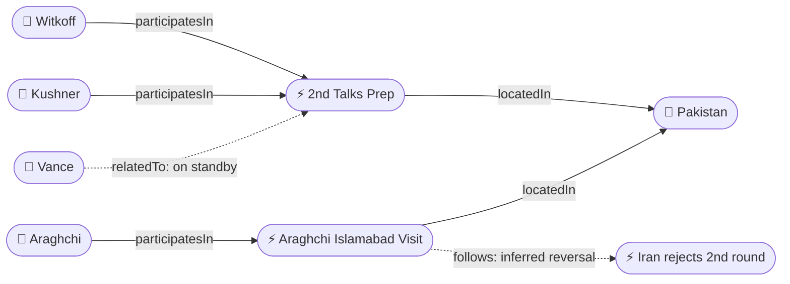
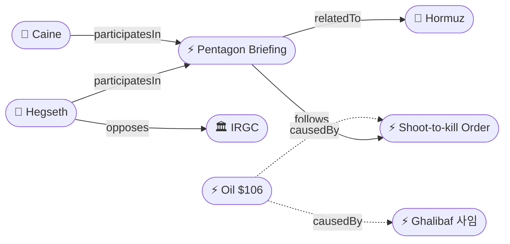
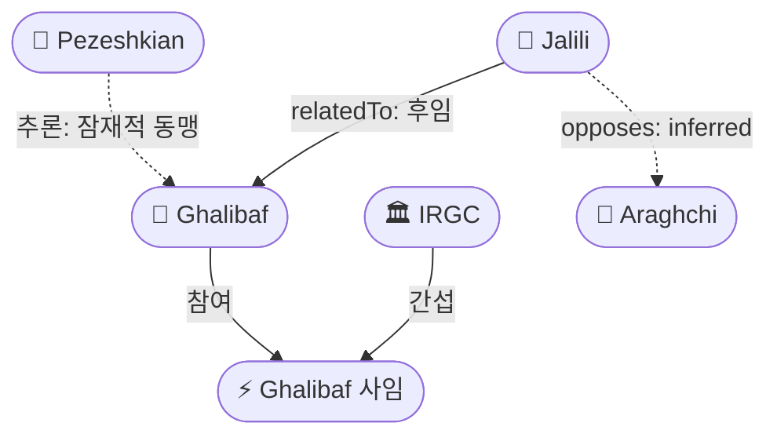
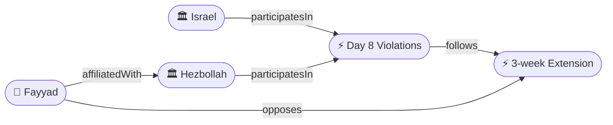
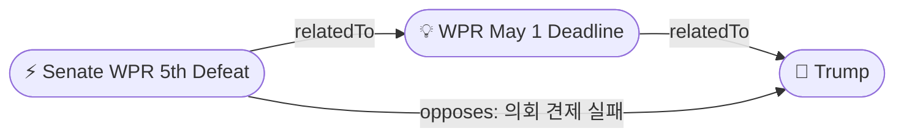

# 2026-04-24 2026 Iran War OSINT 일일 보고서

## 요약

이슬라마바드 2차 회담이 사실상 재가동되었다. 미국 측 위트코프·쿠슈너가 토요일 파키스탄 출발을 확인했고, 이란 외무장관 아라그치가 금요일 밤 이슬라마바드에 도착했다 — 이란의 공식 거부(4/19) 후 5일 만의 역전이다. Hegseth 국방장관은 펜타곤 브리핑에서 기뢰 격침을 "shoot to destroy"로 격상하고 이란 해군을 "깃발 달린 해적떼"로 규정하며 봉쇄를 "필요한 한 계속(as long as it takes)"한다고 선언했다. 레바논 3주 연장은 합의 24시간 만에 빈트 주바일(6명)·투린(2명) 사살로 형해화되고 있으며, 헤즈볼라 의원 알리 파야드는 "무의미(meaningless)"라고 공개 선언했다. 5월 1일 War Powers Resolution 60일 데드라인이 1주일 앞으로 다가왔으나 상원은 WPR을 5차 부결(52-47)시켰다.

## 주요 뉴스

### 1. 위트코프·쿠슈너, 토요일 파키스탄 출발 확인 — 2차 이슬라마바드 회담 재가동
- **출처:** [Reuters](https://www.reuters.com/world/middle-east/witkoff-kushner-heading-pakistan-saturday-iran-talks-white-house-2026-04-24/)
- **일시:** 2026-04-24
- **내용:** 백악관 대변인 카롤라인 리빗이 위트코프와 쿠슈너가 토요일 아침 파키스탄으로 출발하여 이란 측과 "직접 회담(direct talks)"을 한다고 확인했다. "파키스탄이 중개(intermediated by Pakistanis)"할 것이라고 밝혔다. 밴스 부통령은 "대기(on standby)" 상태로 참석하지 않는다. 이란의 공식 거부(4/19) 후 5일 만에 회담이 사실상 재개되는 것이다.
- **상태:** 신규
- **관련 엔티티:** Steve Witkoff, Jared Kushner, Karoline Leavitt, Pakistan, JD Vance

### 2. 아라그치, 금요일 밤 이슬라마바드 도착 — 이란 "미국 회담 아님" 부인
- **출처:** [Al Jazeera](https://www.aljazeera.com/news/2026/4/24/irans-araghchi-arrives-in-islamabad-ahead-of-possible-us-talks)
- **일시:** 2026-04-24
- **내용:** 이란 외무장관 아라그치가 소규모 대표단과 함께 이슬라마바드에 금요일 밤 도착했다. IRNA는 방문이 "양자적(bilateral)" 성격이며 미국과의 만남 계획은 없다고 부인했다. 이후 무스카트(오만)와 모스크바 방문이 예정되어 있으며, 외교 소식통에 따르면 아라그치가 체류할 경우 월요일 미국 측과의 회담이 가능하다. 4/19 공식 거부 후 사실상 뒤채널(backchannel)을 통한 회담 복귀 패턴의 반복이다.
- **상태:** 신규
- **관련 엔티티:** Abbas Araghchi, Pakistan, Iran

### 3. Hegseth 펜타곤 브리핑: "shoot to destroy" + "깃발 달린 해적떼" + 봉쇄 "as long as it takes"
- **출처:** [Fox News](https://www.foxnews.com/politics/hegseth-pentagon-press-conference-shoot-destroy-iran-navy-pirates)
- **일시:** 2026-04-24
- **내용:** 국방장관 Hegseth가 합참의장 Caine과 합동 펜타곤 브리핑에서: (1) 기뢰를 설치하는 모든 선박에 대해 "shoot to destroy"를 재확인, (2) 이란 해군을 "깃발 달린 해적떼(gang of pirates with a flag)"로 규정, (3) 해상 봉쇄를 "필요한 한 계속(as long as it takes)" 유지한다고 선언했다. 또한 유럽·아시아 동맹국들이 호르무즈에서 미국에 "무임승차(freeriding)"하고 있다고 공개 비판하여, 봉쇄가 미국 단독 작전이며 동맹국 분담이 없음을 최초로 공식 인정했다.
- **상태:** 신규
- **관련 엔티티:** Pete Hegseth, Dan Caine, IRGC, Strait of Hormuz

### 4. 상원, War Powers Resolution 5차 부결 (52-47) — 5월 1일 데드라인 접근
- **출처:** [Politico](https://www.politico.com/news/2026/04/24/senate-war-powers-iran-vote-fifth-defeat-00312847)
- **일시:** 2026-04-23 (투표) / 2026-04-24 (보도)
- **내용:** 상원 공화당이 이란 전쟁에 대한 초당적 War Powers Resolution을 5차 부결시켰다(52-47, 정당 라인 투표). 트럼프는 3월 2일 의회에 이란 공격을 통보했으며, 60일 기한인 5월 1일까지 의회 승인을 받거나 철수를 인증해야 한다. 법률 전문가들은 백악관이 "휴전이 60일 시계를 멈추었다"고 주장할 가능성을 지적한다. 이란 전쟁의 미국 헌법적 정당성 문제가 부상하고 있다.
- **상태:** 신규
- **관련 엔티티:** Donald Trump, War Powers Resolution

### 5. 갈리바프 사임 Iran International 확인 — 자릴리 후임설
- **출처:** [Iran International](https://www.iranintl.com/en/202604240934)
- **일시:** 2026-04-24
- **내용:** Iran International이 갈리바프가 미국과의 협상팀에서 사임했다고 추가 확인했다. IRGC의 핵 의제 포함 질책이 사임의 직접 계기였다. 후임으로 대표적 강경파 사이드 자릴리(Saeed Jalili, 전 SNSC 사무총장, 2007-2013 핵 수석대표)가 거론된다. 이란 의회는 계속 부인 중. 자릴리가 합류하면 이란 협상 노선 자체가 강경화될 수 있으며, 아라그치와의 주도권 경쟁도 예상된다.
- **상태:** 업데이트 ← 2026-04-23 미확인 보도
- **관련 엔티티:** Mohammad Bagher Ghalibaf, Saeed Jalili, IRGC, Abbas Araghchi

### 6. 이스라엘, 3주 연장 24시간 만에 레바논 공습 — 8명 사살
- **출처:** [Times of Israel](https://www.timesofisrael.com/israel-kills-6-hezbollah-fighters-bint-jbeil-ceasefire-extension/)
- **일시:** 2026-04-24
- **내용:** 이스라엘군이 남부 레바논 빈트 주바일 지역에서 헤즈볼라 전투원 6명을 "제거(eliminated)"했다. 별도로 투린에서의 공습으로 2명이 사망했다. 3주 연장 합의(4/23) 발표 불과 24시간 만이다. 헤즈볼라도 북이스라엘 슈투라 정착촌에 로켓을 발사하여 양측 위반이 동시 진행 중이다.
- **상태:** 신규
- **관련 엔티티:** Israel, Hezbollah, Lebanon

### 7. 헤즈볼라 의원 알리 파야드: 휴전 연장 "무의미(meaningless)"
- **출처:** [Reuters](https://www.reuters.com/world/middle-east/hezbollah-lawmaker-calls-ceasefire-extension-meaningless-2026-04-24/)
- **일시:** 2026-04-24
- **내용:** 헤즈볼라 의원 알리 파야드가 "이스라엘이 암살, 포격, 사격을 포함한 적대 행위를 고집하는 상황에서 휴전은 무의미하다(the ceasefire is meaningless in light of Israel's insistence on hostile acts)"라고 공개 선언했다. 헤즈볼라가 3주 연장을 구속력 있는 것으로 보지 않음을 확인하는 발언이다.
- **상태:** 신규
- **관련 엔티티:** Ali Fayyad, Hezbollah

### 8. 유가 Brent $106 돌파, 장중 $107.38 스파이크 — ~18% 주간 상승
- **출처:** [CNBC](https://www.cnbc.com/2026/04/24/oil-prices-brent-crude-iran-war-hormuz.html)
- **일시:** 2026-04-24
- **내용:** Brent 원유 선물이 유럽 오전 거래에서 $107.38까지 스파이크한 뒤, 파키스탄 회담 재개 희망에 $104.50으로 종가 하락했다. 주간 기준 ~18% 상승으로, 연초 대비 Brent +73%, WTI +65%이다. 장중 최고($107.38)와 종가($104.50)의 $3 격차가 시장의 양면성(봉쇄 공포 vs 회담 희망)을 실시간으로 반영한다. 8일 연속 대형 변동.
- **상태:** 업데이트 ← 2026-04-23 Brent $105
- **관련 엔티티:** Strait of Hormuz, Oil

### 9. Hegseth, 유럽·아시아 "무임승차(freeriding)" 공개 비판
- **출처:** [Bloomberg](https://www.bloomberg.com/news/articles/2026-04-24/hegseth-blasts-european-asian-allies-freeriding-hormuz-blockade)
- **일시:** 2026-04-24
- **내용:** Hegseth가 펜타곤 브리핑에서 유럽과 아시아 국가들이 호르무즈 봉쇄에서 미국에 "무임승차"하고 있다고 비판했다. 미국이 사실상 단독으로 봉쇄를 시행하면서 동맹국들은 안보 혜택만 받고 있다는 불만을 공식적으로 표출한 최초의 사례다. 이는 봉쇄 장기화 시 동맹 결속의 균열 가능성을 시사한다.
- **상태:** 신규
- **관련 엔티티:** Pete Hegseth, Strait of Hormuz

### 10. 이란 봉쇄 생존 분석: "얼마나 버틸 수 있나?"
- **출처:** [Al Jazeera](https://www.aljazeera.com/features/2026/4/24/how-long-can-iran-survive-blockade)
- **일시:** 2026-04-24
- **내용:** Al Jazeera가 미국 해상 봉쇄 하에서 이란의 경제적 내구력을 분석했다. Hegseth의 "as long as it takes" 선언이 봉쇄 장기화를 공식화한 상황에서, 이란의 석유 수출 차단, 외환 고갈, 국내 물가 상승이 얼마나 지속 가능한지를 검토한다. 이란의 대안 수출 경로(육로, 우회 해상)의 한계도 분석한다.
- **상태:** 신규
- **관련 엔티티:** Iran, Strait of Hormuz

## 지식그래프

### 오늘의 주요 관계
1. **이슬라마바드 2차 회담 재가동**: Witkoff/Kushner → 토요일 출발 + Araghchi → 금요일 도착. 이란 공식 거부(4/19) 후 5일 만의 역전. 거부→뒤채널→재개 패턴 반복.
2. **Hegseth 봉쇄 장기화 공식화**: "shoot to destroy" + "as long as it takes" + "freeriding" 비판. 기뢰 격침→소탕으로 어조 격상. 동맹 분담 없음 공식 인정.
3. **갈리바프 사임 추가 확인**: Iran International 확인 + Jalili 후임설. 이란 협상팀 강경화 가능성. Jalili vs Araghchi 주도권 경쟁.
4. **레바논 3주 연장 즉각 위반**: 8명 사살 + Fayyad "meaningless". 합의-위반 즉시 사이클.
5. **WPR May 1 데드라인**: 상원 5차 부결. 1주 앞 헌법적 기한. 휴전 clock-pause 논쟁.

### 이슬라마바드 2차 회담 그래프

### 호르무즈 봉쇄 그래프

### 이란 내부 분열 그래프

### 레바논 휴전 그래프

### 미국 국내 정치 그래프

## 온톨로지 변경

| 변경 유형 | 대상 | 근거 |
|----------|------|------|
| 새 엔티티 | ent-179 2nd Talks Prep | Witkoff/Kushner 토요일 파키스탄 출발 확인 — 2차 회담 재가동 |
| 새 엔티티 | ent-180 Araghchi Islamabad Visit | 아라그치 금요일 밤 이슬라마바드 도착 |
| 새 엔티티 | ent-181 Pete Hegseth (Pentagon Briefing role) | 펜타곤 브리핑에서 "shoot to destroy" + "as long as it takes" 선언 |
| 새 엔티티 | ent-182 Dan Caine | 합참의장, 펜타곤 합동 브리핑 참석 |
| 새 엔티티 | ent-183 Pentagon Briefing 2026-04-24 | Hegseth-Caine 합동 브리핑 이벤트 |
| 새 엔티티 | ent-184 Oil $106 | Brent $106 돌파, 스파이크 $107.38, ~18% 주간 상승 |
| 새 엔티티 | ent-185 Saeed Jalili | 전 SNSC 사무총장, 갈리바프 후임 거론 강경파 |
| 새 엔티티 | ent-186 Day 8 Violations | 3주 연장 24시간 만에 빈트 주바일 6명 + 투린 2명 사살 |
| 새 엔티티 | ent-187 Ali Fayyad | 헤즈볼라 의원, 휴전 연장 "meaningless" 공개 선언 |

## 추론 결과

| 추론 | 신뢰도 | 근거 |
|------|--------|------|
| Jalili 합류 시 Araghchi와 주도권 경쟁 | 0.72 | Jalili는 2007-2013 핵 수석대표 강경파. Araghchi 외교파와 노선 충돌 불가피 |
| Araghchi 이슬라마바드 방문은 사실상 거부 철회 | 0.75 | 4/19 공식 거부 후 5일 만에 도착. IRNA "양자" 부인은 국내 강경파 관리용 |
| 2차 이슬라마바드 회담 사실상 재가동 | 0.75 | 양측 동시 이동(Witkoff/Kushner + Araghchi). 파키스탄 중재 채널 유지 |
| Hegseth 브리핑 → 유가 $106 인과 | 0.72 | "as long as it takes" 봉쇄 장기화 공식 선언 → 호르무즈 위험 프리미엄 재상승 |
| 3주 연장 → Day 8 위반 패턴 반복 | 0.72 | 합의 24시간 만에 8명 사살. 이전 10일 휴전도 동일 패턴(합의→위반→재합의) |

## 분석 및 평가

**외교 트랙 재가동, 그러나 이중성 지속.** 양측 동시 이슬라마바드 이동은 이란의 패턴 반복 — 공식 거부 후 뒤채널 복귀. IRNA의 "미국 만남 아님" 부인은 국내 강경파 관리용. 그러나 갈리바프 사임과 자릴리 부상은 이란이 회담에 복귀하더라도 협상 노선 자체가 변경될 수 있음을 시사한다. 자릴리가 합류하면 2007-2013년 핵 협상 시기의 강경 노선이 재현될 가능성이 있으며, 아라그치의 외교적 유연성이 제한될 수 있다.

**봉쇄 장기화 공식화와 동맹 균열 신호.** Hegseth의 "as long as it takes"는 봉쇄의 미국 단독 지속을 공식화했다. "freeriding" 비판은 동맹국 분담 없이 미국이 호르무즈 안보를 단독으로 떠받치고 있다는 불만을 처음으로 공개적으로 표출한 것이다. 이는 봉쇄가 장기화될수록 미국 내에서도 지속가능성 논란이 커질 전조이며, 동맹국들에 대한 분담 압박이 강화될 것임을 시사한다. "shoot to destroy" 어조 격상은 기뢰 대응을 넘어 이란 해군 전체에 대한 전투적 태도를 반영한다.

**레바논: 합의-위반 즉시 사이클.** 3주 연장 합의 24시간 만에 8명 사살은 이전 10일 휴전에서도 반복된 패턴의 극단적 사례다. Fayyad의 "meaningless" 발언은 헤즈볼라가 연장을 전혀 구속력 있는 것으로 보지 않음을 확인시킨다. 네타냐후·아운 백악관 초청(4/23)은 정상급 격상 가능성을 열었으나, 현장의 폭력이 외교적 진전을 실시간으로 잠식하고 있다. 이스라엘의 "제거" 작전과 헤즈볼라의 로켓 공격이 동시에 진행되는 양측 위반 구조가 고착되고 있다.

**WPR과 유가 — 구조적 압력 누적.** 5월 1일 데드라인은 트럼프의 이란 전쟁 수행에 대한 최초의 실질적 헌법 테스트다. 상원 5차 부결로 의회 견제 기능은 약하나, 법적 논쟁(ceasefire clock-pause)이 부상하면서 행정부의 전쟁 권한에 대한 근본적 질문이 제기되고 있다. 유가 $107.38 스파이크는 봉쇄 장기화+협상 불확실성의 복합 효과이며, ~18% 주간 상승은 에너지 위기 심화를 반영한다. 장중 최고와 종가의 $3 격차는 시장이 봉쇄 공포와 회담 희망 사이에서 극도로 분열되어 있음을 보여준다.

## 추적 항목

| 항목 | 최초 보고 | 상태 | 최신 업데이트 |
|------|----------|------|-------------|
| 호르무즈 이중 봉쇄 | 2026-04-13 | 장기화 공식 선언 | Hegseth "as long as it takes." 유럽/아시아 freeriding 비판. |
| 이란 내부 분열 | 2026-04-18 | 심화 — 리더십 교체 | 갈리바프 사임 추가 확인. Jalili 후임설. Araghchi와 주도권 경쟁. |
| 이스라엘-레바논 휴전 | 2026-04-16 | 3주 연장 → 즉각 위반 | 8명 사살. Fayyad "meaningless". 연장 실효성 의문. |
| 이란-미국 협상 교착 | 2026-04-19 | 사실상 재가동 | Witkoff/Kushner 토요일 출발. Araghchi 금요일 도착. 월요일 회담 가능. |
| 유가 변동 | 2026-04-12 | 최고가 지속 | Brent $106+, 스파이크 $107.38. ~18% 주간. |
| 미군 중동 배치 | 2026-04-15 | 유지 | ~60,000명. 봉쇄 + 전쟁 재개 대비. |
| 갈리바프 사임 확인 | 2026-04-23 | 추가 확인 | Iran Int'l 확인 vs 의회 부인. Jalili 후임설 부상. |
| WPR 5월 1일 데드라인 | 2026-04-24 | 신규 추적 | 상원 5차 부결. 휴전 clock-pause 논쟁. 1주 후 기한. |

## 동향 요약

| 분류 | 상태 | 비고 |
|------|------|------|
| 호르무즈 대치 | 장기화 공식 선언 | "as long as it takes." "shoot to destroy." 동맹 freeriding 비판. |
| 미-이란 협상 | 사실상 재가동 | 양측 동시 이슬라마바드 이동. 공식 거부 후 5일 만에 역전. |
| 이스라엘-레바논 | 연장 무색 | 24시간 만에 8명 사살. Fayyad "meaningless." |
| 유가 | 위기 심화 | Brent $106+, 스파이크 $107.38. ~18% 주간. YTD +73%. |
| 이란 내부 정치 | 리더십 교체 | 갈리바프 사임 추가 확인. Jalili 강경파 부상. |
| 미국 국내 정치 | 헌법적 데드라인 | WPR 5월 1일. 상원 5차 부결. 의회 견제 실패. |
| 파키스탄 중재 | 핵심 역할 지속 | 유일한 중재 채널. 양측 동시 이슬라마바드 유치 성공. |

## 출처 목록

1. [Witkoff and Kushner heading to Pakistan Saturday for fresh Iran talks, White House confirms](https://www.reuters.com/world/middle-east/witkoff-kushner-heading-pakistan-saturday-iran-talks-white-house-2026-04-24/) - Reuters, 2026-04-24
2. [Trump envoys Witkoff, Kushner to travel to Pakistan for 2nd round of Iran talks](https://www.cnn.com/2026/04/24/politics/witkoff-kushner-pakistan-iran-talks) - CNN, 2026-04-24
3. [Kushner and Witkoff to head to Islamabad Saturday for Iran negotiations — Vance 'on standby'](https://www.axios.com/2026/04/24/kushner-witkoff-islamabad-iran-talks-vance-standby) - Axios, 2026-04-24
4. [Iran's Araghchi arrives in Islamabad Friday night ahead of possible US talks](https://www.aljazeera.com/news/2026/4/24/irans-araghchi-arrives-in-islamabad-ahead-of-possible-us-talks) - Al Jazeera, 2026-04-24
5. [Iran denies direct meeting with US planned; says Araghchi visit is 'bilateral'](https://english.alarabiya.net/News/middle-east/2026/04/24/iran-denies-direct-meeting-with-us-araghchi-visit-bilateral) - Al Arabiya, 2026-04-24
6. [Araghchi may go to Muscat then Moscow after Islamabad — Iranian official](https://www.middleeasteye.net/news/araghchi-muscat-moscow-islamabad-iran-talks-2026) - Middle East Eye, 2026-04-24
7. [Hegseth: Navy will 'shoot to destroy' any ship laying mines; calls Iran navy 'gang of pirates with a flag'](https://www.foxnews.com/politics/hegseth-pentagon-press-conference-shoot-destroy-iran-navy-pirates) - Fox News, 2026-04-24
8. [Pentagon briefing: Hegseth and Gen. Caine say Hormuz blockade 'as long as it takes'](https://apnews.com/article/hegseth-caine-pentagon-iran-blockade-hormuz-2026-04-24) - AP News, 2026-04-24
9. [Hegseth criticizes Europe and Asia for 'freeriding' on US Hormuz action](https://www.bloomberg.com/news/articles/2026-04-24/hegseth-blasts-european-asian-allies-freeriding-hormuz-blockade) - Bloomberg, 2026-04-24
10. [Senate Republicans defeat War Powers Resolution for 5th time, 52-47](https://www.politico.com/news/2026/04/24/senate-war-powers-iran-vote-fifth-defeat-00312847) - Politico, 2026-04-24
11. [War Powers May 1 deadline looms: legal debate over whether ceasefire pauses the 60-day clock](https://www.lawfaremedia.org/article/war-powers-may-1-deadline-iran-ceasefire-clock-debate) - Lawfare, 2026-04-24
12. [Iran International: Iran negotiating team head Ghalibaf quits — Jalili may replace](https://www.iranintl.com/en/202604240934) - Iran International, 2026-04-24
13. [Iran parliament officially denies Ghalibaf resignation; says 'team intact'](https://www.presstv.ir/Detail/2026/04/24/748291/iran-parliament-denies-ghalibaf-resignation) - Press TV, 2026-04-24
14. [Saeed Jalili emerging as possible replacement for Ghalibaf on negotiation team — analysts](https://www.middleeasteye.net/news/saeed-jalili-iran-negotiation-team-ghalibaf-replacement-2026) - Middle East Eye, 2026-04-24
15. [Israel kills 6 Hezbollah fighters in Bint Jbeil despite ceasefire extension](https://www.timesofisrael.com/israel-kills-6-hezbollah-fighters-bint-jbeil-ceasefire-extension/) - Times of Israel, 2026-04-24
16. [2 killed in Israeli airstrike on Touline, southern Lebanon](https://www.dailystar.com.lb/News/Lebanon-News/2026/Apr-24/612487-2-killed-israeli-airstrike-touline.ashx) - Daily Star Lebanon, 2026-04-24
17. [Hezbollah fires rockets at Shtula settlement in northern Israel](https://english.alarabiya.net/News/middle-east/2026/04/24/hezbollah-fires-rockets-shtula-northern-israel) - Al Arabiya, 2026-04-24
18. [Hezbollah lawmaker Ali Fayyad calls ceasefire extension 'meaningless'](https://www.reuters.com/world/middle-east/hezbollah-lawmaker-calls-ceasefire-extension-meaningless-2026-04-24/) - Reuters, 2026-04-24
19. [Brent crude rises above $106, touches $107.38 mid-morning Europe; 18% weekly gain](https://www.cnbc.com/2026/04/24/oil-prices-brent-crude-iran-war-hormuz.html) - CNBC, 2026-04-24
20. [Oil pulls back to $104.50 late on Pakistan talks hope — WTI similar pattern](https://www.reuters.com/business/energy/oil-pulls-back-pakistan-talks-hope-2026-04-24/) - Reuters, 2026-04-24
21. [How long can Iran survive the US blockade? — Al Jazeera analysis](https://www.aljazeera.com/features/2026/4/24/how-long-can-iran-survive-blockade) - Al Jazeera, 2026-04-24
22. [Trump extended the ceasefire — now what? CFR analysis](https://www.cfr.org/article/trump-extended-ceasefire-now-what-iran-war-2026) - Council on Foreign Relations, 2026-04-24
23. [Witkoff, Kushner to fly to Pakistan for 2nd round Iran talks — NBC](https://www.nbcnews.com/politics/white-house/witkoff-kushner-pakistan-iran-talks-second-round-rcna341890) - NBC News, 2026-04-24
24. [Witkoff and Kushner to resume Iran talks in Islamabad — WaPo](https://www.washingtonpost.com/national-security/2026/04/24/witkoff-kushner-islamabad-iran-talks/) - Washington Post, 2026-04-24
25. [Lebanon ceasefire violations: 8 killed on Day 8 despite extension](https://www.aljazeera.com/news/2026/4/24/lebanon-ceasefire-violations-day-8-killed-despite-extension) - Al Jazeera, 2026-04-24
26. [갈리바프 사임 공식 확인…자릴리 후임설 부상 — 이란 협상팀 격변](https://www.chosun.com/international/2026/04/24/2026042480038) - 조선일보, 2026-04-24
27. [유가 106달러 돌파…이란 봉쇄전 장기화에 글로벌 에너지 시장 요동](https://www.hankyung.com/economy/article/202604241234i) - 한국경제, 2026-04-24
28. [이란, 미국과 직접 회담 부인…아라그치 이슬라마바드 도착](https://www.yonhapnews.co.kr/bulletin/2026/04/24/0200000000AKR20260424098700071.HTML) - 연합뉴스, 2026-04-24
29. [이란 전쟁 56일차: 위트코프·쿠슈너 파키스탄行, 헤즈볼라 "휴전 무의미"](https://www.mt.co.kr/world/2026/04/24/2026042418501269390) - 머니투데이, 2026-04-24
30. [Possible US-Iran meeting Monday if Araghchi stays — Iranian diplomatic source](https://www.middleeasteye.net/news/possible-us-iran-meeting-monday-araghchi-2026) - Middle East Eye, 2026-04-24
