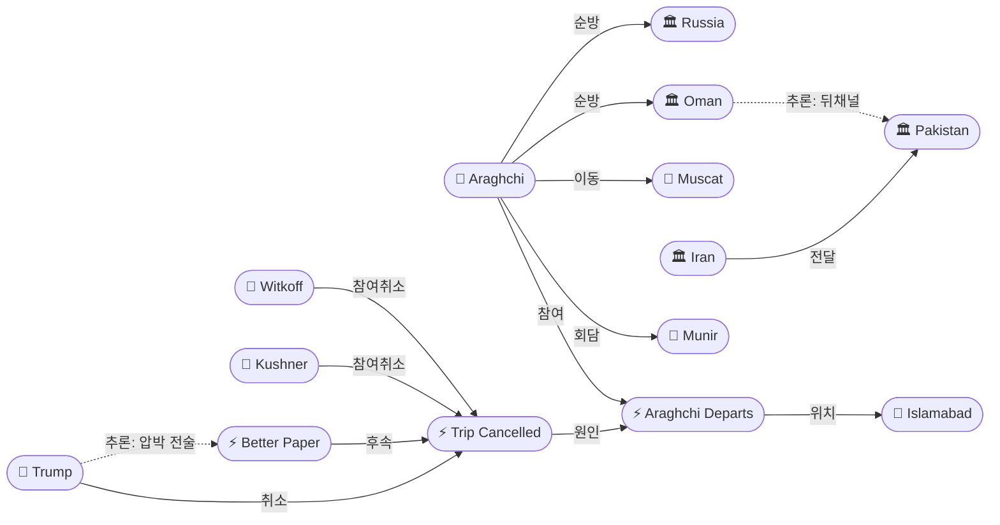
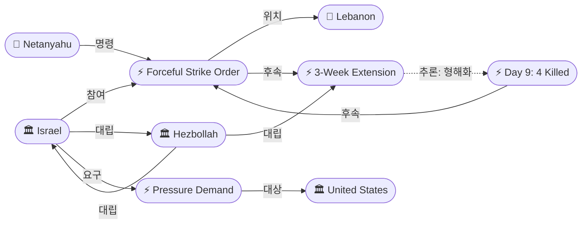
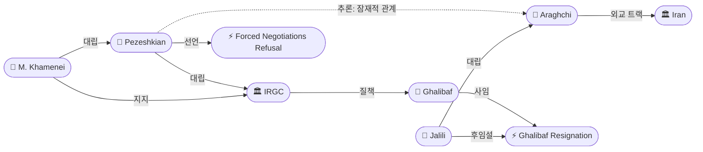

# 2026-04-25 2026 Iran War OSINT 일일 보고서

## 요약

트럼프가 위트코프·쿠슈너의 파키스탄행을 전격 취소했다 — 4/24 백악관 공식 확인 불과 24시간 만의 역전이다. 이란 외무장관 아라그치가 토요일 아침 이슬라마바드를 떠나자 트럼프는 "18시간 비행기를 탈 필요 없다"며 파견을 취소하고, "대화를 원하면 전화하라(all they have to do is call)"고 선언했다. 그러나 취소 직후 "10분 내에 훨씬 나은 제안서(a much better paper)"를 받았다고 밝혀 취소 자체가 협상 전술이었음을 시사했다. 레바논에서는 네타냐후가 헤즈볼라에 대한 "강력 공격(with force)"을 명령하여 3주 연장 48시간 만에 정치적 에스컬레이션으로 격상되었고, Day 9에 4명이 추가 사망했다. 이란 내부에서는 페제시키안 대통령이 "강제 협상 불가"를 선언하며 4/22 "딜 개방" 신호에서 강경 노선으로 역전했다 — 트럼프가 이란의 "내부 분열(infighting)"을 취소 사유로 명시적으로 지목한 것은 이란 내부 권력 투쟁이 외부에서도 관측 가능할 정도로 심화되었음을 의미한다.

## 주요 뉴스

### 1. 트럼프, 위트코프·쿠슈너 파키스탄행 전격 취소 — "We Have All the Cards"
- **출처:** [Al Jazeera](https://www.aljazeera.com/news/liveblog/2026/4/25/iran-war-live-tehrans-fm-in-islamabad-us-says-envoys-to-travel-for-talks)
- **일시:** 2026-04-25
- **내용:** 트럼프 대통령이 중동특사 위트코프와 쿠슈너의 파키스탄 파견을 전격 취소했다. 백악관이 토요일 출발을 공식 확인(4/24)한 지 불과 24시간 만이다. 트럼프는 폭스뉴스 인터뷰에서 "이란과의 회담이 화요일까지 열리지 않을 것"이라며 "18시간 비행기를 타고 갈 필요가 없다"고 밝혔다. 이란 지도부의 "내부 분열(infighting)"을 취소 사유로 명시했다. "우리가 모든 카드를 쥐고 있지만 그들은 아무것도 없다. 대화를 원하면 전화하면 된다"고 강조했다.
- **상태:** 신규
- **관련 엔티티:** Donald Trump, Steve Witkoff, Jared Kushner, Pakistan, Iran

### 2. 아라그치, 이슬라마바드 출국 → 오만·러시아 순방 — 테헤란 요구서 전달 완료
- **출처:** [Euronews](https://www.euronews.com/2026/04/25/irans-fm-abbas-araghchi-meets-with-pakistan-officials-but-rules-out-direct-talks-with-us)
- **일시:** 2026-04-25
- **내용:** 이란 외무장관 아라그치가 토요일 오전 이슬라마바드를 출국했다. 출국 전 파키스탄 육군참모총장 무니르, 내무장관 모신 나크비와 연쇄 회담을 통해 테헤란의 종전 요구 사항 목록을 전달했다. 무스카트(오만)로 이동하여 오만 당국자들과 회담하며, 이후 모스크바 방문이 예정되어 있다. IRNA는 "미국과의 직접 회담 계획 없음"을 유지했다. 오만은 2015 JCPOA 비밀 협상의 뒤채널 역할을 했던 국가로, 파키스탄과 병렬 중재 채널의 구축 가능성이 있다.
- **상태:** 신규
- **관련 엔티티:** Abbas Araghchi, Asim Munir, Mohsin Naqvi, Pakistan, Oman, Russia

### 3. 트럼프: "취소 후 10분 내 훨씬 나은 제안서를 받았다"
- **출처:** [WLT Report](https://wltreport.com/2026/04/25/president-trump-says-iran-sent-him-better-deal/)
- **일시:** 2026-04-25
- **내용:** 트럼프는 "그들이 더 나아야 할 제안서를 보냈는데, 흥미롭게도 내가 취소한 순간 10분 내에 훨씬 나은 새 제안서를 받았다…많은 것을 제안했지만 충분하지 않다(they offered a lot but not enough)"라고 밝혔다. 핵무기 불허를 재확인하며, 향후 협상은 "15시간 비행이 아닌 전화로" 가능하다고 시사했다. 취소 자체가 의도된 협상 압박이었으며, 이란이 즉각 반응한 것은 양측 모두 협상 의지가 존재함을 보여준다.
- **상태:** 신규
- **관련 엔티티:** Donald Trump, Iran

### 4. 네타냐후, 헤즈볼라에 "강력 공격(with force)" 명령 — Day 9 4명 사살
- **출처:** [Jerusalem Post](https://www.jpost.com/israel-news/article-894104)
- **일시:** 2026-04-25
- **내용:** 네타냐후 총리가 헤즈볼라의 반복적 휴전 위반에 대해 IDF에 남부 레바논 헤즈볼라 표적을 "강력히(with force)" 공격하라고 명령했다. 헤즈볼라는 북이스라엘에 2발의 발사체를 발사(마나라·마르갈리오트·미스가브 암 사이렌, 1발 요격·1발 공터 낙하)했고, IDF 전방방어선 남쪽 병력에 폭발 드론도 발사했다(부상자 없음). 별도로 이스라엘 공습으로 남부 레바논에서 4명이 사망했다. 이는 4/16 휴전 이후 헤즈볼라의 2번째 공식 위반이며, 3주 연장(4/23) 발표 48시간 만의 정치적 에스컬레이션이다.
- **상태:** 신규
- **관련 엔티티:** Benjamin Netanyahu, Israel, Hezbollah, Lebanon

### 5. 이스라엘 → 미국: "레바논을 압박하라, 아니면 휴전 붕괴"
- **출처:** [Jerusalem Post](https://www.jpost.com/israel-news/defense-news/article-894117)
- **일시:** 2026-04-25
- **내용:** KAN 보도에 따르면 이스라엘은 미국에 레바논 정부가 헤즈볼라에 대해 행동하도록 압박하지 않으면 휴전이 붕괴될 위험이 있다고 전달했다. 이스라엘이 휴전 유지 책임을 미국에 전가하는 새로운 동학으로, 트럼프의 "PROHIBITED" 경고(4/17) 이후 미-이스라엘 관계의 긴장이 "휴전 책임론"으로 전이되고 있다.
- **상태:** 신규
- **관련 엔티티:** Israel, Hezbollah, Lebanon, United States

### 6. 페제시키안: "강제 협상 불가" — 봉쇄 해제 선행 요구
- **출처:** [Press TV](https://www.presstv.ir/Detail/2026/04/25/767547/Iran-United-States-blockade-threats-pressure-Pezeshkian-Pakistan)
- **일시:** 2026-04-25
- **내용:** 이란 대통령 페제시키안은 미국과의 "강제 협상(forced negotiations)"에 응하지 않겠다고 선언했다. 워싱턴이 먼저 "봉쇄를 포함한 작전상의 장애물(operational obstacles, including the blockade)"을 제거해야 한다고 요구했다. 4/22 "딜에 개방적(open to deal)" 신호에서 불과 3일 만의 강경화 역전으로, IRGC의 대통령 메시지에 대한 영향력 행사를 시사한다.
- **상태:** 신규
- **관련 엔티티:** Masoud Pezeshkian, Iran, Strait of Hormuz

### 7. 이란 내부 분열 심화 — 페제시키안 진영 vs 하메네이 진영
- **출처:** [Al Jazeera](https://www.aljazeera.com/news/2026/4/25/irans-authorities-project-hardened-stance-with-more-talks-on-horizon) / [CNN](https://www.cnn.com/2026/04/25/world/live-news/iran-war-israel-pakistan-talks)
- **일시:** 2026-04-25
- **내용:** CNN은 "페제시키안 대통령의 동맹과 최고지도자 모즈타바 하메네이 사무실에 가까운 인물들 사이의 분열이 마지막 순간 이란 협상팀의 이슬라마바드행을 좌절시켰다"고 보도했다. 트럼프가 이란의 "내부 분열(infighting)"을 취소 사유로 명시한 것은 이 구조적 대립이 외부에서도 관측 가능할 정도로 심화되었음을 의미한다. 갈리바프 사임(IRGC 질책)은 이 구조적 분열의 증상이다.
- **상태:** 업데이트 ← 2026-04-24 갈리바프 사임 보도
- **관련 엔티티:** Masoud Pezeshkian, Mojtaba Khamenei, IRGC, Mohammad Bagher Ghalibaf

### 8. WPR 60일 기한 6일 앞 — "트럼프가 존중할 것인가?"
- **출처:** [CNN](https://www.cnn.com/2026/04/25/politics/war-powers-act-trump-iran-war-congress-analysis)
- **일시:** 2026-04-25
- **내용:** CNN이 War Powers Resolution 60일 기한(5월 1일)을 분석했다. 트럼프는 3/2 의회에 이란 공격을 통보했으며, 60일 기한 내 의회 승인을 받거나 철수해야 한다. 공화당은 "휴전이 시계를 멈추었다"고 주장. 30일 연장은 철수용이지 전쟁 지속용이 아니다. 역대 대통령들이 다른 권한 근거로 WPR을 우회한 전례가 있다.
- **상태:** 업데이트 ← 2026-04-24 Lawfare WPR 분석
- **관련 엔티티:** Donald Trump, War Powers Resolution

### 9. 유가 Brent $105.33 종가 — 주간 +16%
- **출처:** [The National](https://www.thenationalnews.com/business/markets/2026/04/24/oil-prices-iran-war/)
- **일시:** 2026-04-25
- **내용:** Brent 원유 선물이 $105.33에 종가(+0.3%). WTI는 $94.40(-1.5%). 전주 대비 Brent +16%, WTI +14%. 4/24 장중 $107.38 피크 후 파키스탄 회담 기대감에 하락했으나, 트럼프 취소 후 시간외 거래에서 변동성이 확대되었다. 연초 대비 Brent +73%, WTI +65%. 9일 연속 대형 변동.
- **상태:** 업데이트 ← 2026-04-24 Brent $106
- **관련 엔티티:** Strait of Hormuz, Oil

## 지식그래프

### 오늘의 주요 관계
1. **트럼프 취소 → 이슬라마바드 2차 회담 사실상 무산**: 4/24 확인 → 4/25 취소. "거부→뒤채널→재개→취소" 사이클의 4번째 반복. 그러나 "10분 내 더 나은 제안서"는 양측 의지 존재 시사.
2. **아라그치 오만/러시아 순방 → 중재 채널 다변화**: 파키스탄(공식) + 오만(뒤채널, JCPOA 전례) + 러시아(이란 동맹). 이란 외교의 다변화.
3. **네타냐후 "강력 공격" 명령 → 레바논 휴전 형해화**: 3주 연장 48시간 만의 정치적 에스컬레이션. 이스라엘이 미국에 "레바논 압박" 요구 — 책임 전가.
4. **페제시키안 강경화 → 이란 내부 IRGC 영향력 확인**: "딜 개방"(4/22) → "강제 협상 불가"(4/25). IRGC가 대통령 메시지를 통제.
5. **트럼프 "infighting" 명시 → 이란 내부 분열 공개화**: 페제시키안 vs 하메네이·IRGC 구조적 대립이 미국 대통령의 공개 발언 수준으로 격상.

### 이슬라마바드 2차 회담 무산 그래프

### 레바논 휴전 위반 그래프

### 이란 내부 분열 그래프

## 온톨로지 변경

| 변경 유형 | 대상 | 근거 |
|----------|------|------|
| 새 엔티티 | ent-188: Trump Cancels Pakistan Trip | 4/24 확인의 180도 역전. 최대 뉴스. |
| 새 엔티티 | ent-189: Muscat (Location) | 아라그치 오만 순방 목적지 |
| 새 엔티티 | ent-190: Oman (Organization) | 미-이란 뒤채널 중재국 등장 |
| 새 엔티티 | ent-191: Netanyahu Forceful Strikes Order | 정치적 에스컬레이션 |
| 새 엔티티 | ent-192: Araghchi Departs Islamabad | 취소 트리거 + 오만/러시아 순방 |
| 새 엔티티 | ent-193: Pezeshkian Forced Negotiations Refusal | 강경화 역전 |
| 새 엔티티 | ent-194: Iran Sends Better Paper | 취소 후 즉각 반응 |
| 스키마 변경 | 없음 | 기존 클래스/관계로 충분히 표현 |

## 추론 결과

| 추론 | 신뢰도 | 근거 |
|------|--------|------|
| Trip Cancellation → causalChain → Islamabad Talks | 0.76 | 취소 → 2차 준비 → 1차 회담 인과 체인 |
| Araghchi Departs → relatedTo → Trump Cancels | 0.85 | 시간적 선후 관계: 출국 → 취소 |
| Netanyahu Strikes → causalChain → 3-Week Extension | 0.76 | 공격 명령 → Day 8/9 위반 → 연장 합의 체인 |
| Pezeshkian → potentialRelation → Araghchi | 0.80 | 이란 외교 트랙 공동 대표, 미묘한 입장차 존재 |
| Oman → potentialRelation → Pakistan | 0.75 | 병렬 중재 채널 (JCPOA 전례) |

## 분석 및 평가

### 세 가지 동시 에스컬레이션
오늘은 세 전선에서 동시에 에스컬레이션이 발생했다:

1. **이슬라마바드 전선:** 4/19 이란 거부 → 4/24 재개 확인 → 4/25 트럼프 취소. 그러나 "10분 내 더 나은 제안서"는 이것이 교착이 아닌 **포지셔닝 게임**임을 시사한다. 트럼프는 취소를 압박 도구로, 이란은 즉각 반응으로 협상 의지를 동시에 보여주었다.

2. **레바논 전선:** 3주 연장(4/23) → 48시간 만에 네타냐후 "강력 공격" 명령. 파야드 "무의미"(4/24) + 네타냐후 "with force"(4/25)로 양측 모두 연장을 구속력 있는 것으로 보지 않음이 확인되었다. 이스라엘이 미국에 "레바논 압박" 책임을 전가하는 새로운 동학이 부상했다.

3. **이란 내부 전선:** 페제시키안 "딜 개방"(4/22) → "강제 협상 불가"(4/25). 3일 만의 역전은 IRGC/하메네이 진영의 대통령 메시지 통제를 시사한다. 갈리바프 사임, 자릴리 후임설과 함께 이란 협상 노선 자체의 강경화가 진행 중이다.

### 핵심 판단
- **회담 전망:** 단기적으로 무산되었으나, "전화 협상" 채널 + 오만 뒤채널 + 파키스탄 중개로 다층적 접촉은 지속될 가능성이 높다. 트럼프의 "화요일" 언급은 4/28~29 전화 협상 가능성을 시사.
- **레바논:** 3주 연장은 사실상 종이 위의 합의. 실질적 휴전은 이미 붕괴 상태이며, "휴전 중 전투" 패턴이 고착화되고 있다.
- **유가:** 회담 무산에도 $105 수준 유지. 시장은 봉쇄 장기화를 이미 가격에 반영 중이며, 추가 에스컬레이션 없이는 $110 돌파가 어려울 수 있다.

## 추적 항목

| 항목 | 최초 보고 | 상태 | 최신 업데이트 |
|------|----------|------|-------------|
| 이슬라마바드 2차 회담 | 2026-04-14 | **무산 → 전화 협상으로 전환 가능** | 트럼프 취소, "전화하라" 발언 |
| 레바논 3주 연장 | 2026-04-23 | **형해화** | Day 9 4명 사살, 네타냐후 "강력 공격" 명령 |
| 갈리바프 사임 / 자릴리 후임 | 2026-04-23 | **확인 중** | 이란 의회 부인 지속, 내부 분열 심화 확인 |
| WPR 5월 1일 데드라인 | 2026-04-24 | **6일 앞** | 상원 5차 부결, 휴전 clock-pause 논쟁 |
| 호르무즈 봉쇄 | 2026-04-13 | **지속** | Hegseth "as long as it takes" (4/24) |
| 아라그치 오만/러시아 순방 | 2026-04-25 | **신규** | 오만 뒤채널 구축 가능성 |
| 이란 내부 분열 | 2026-04-19 | **심화** | 페제시키안 vs 하메네이 공개적 대립 |

## 동향 요약

| 분류 | 상태 | 비고 |
|------|------|------|
| 미-이란 휴전 | 유지(무기한) | 트럼프 4/21 무기한 연장, 봉쇄 지속 |
| 이슬라마바드 회담 | 무산 | 트럼프 취소, 전화 협상으로 전환 가능 |
| 레바논 휴전 | 형해화 | Day 9 4명 사살, 네타냐후 공격 명령 |
| 호르무즈 해협 | 이중 봉쇄 지속 | 미 봉쇄 + 이란 재폐쇄 |
| 유가 | Brent $105.33 | 주간 +16%, 연초 대비 +73% |
| 이란 내부 | 분열 심화 | 페제시키안 vs 하메네이/IRGC |
| WPR | 6일 앞 | 상원 5차 부결, 우회 가능성 |

## 출처 목록
1. [Trump cancels Witkoff and Kushner trip to Pakistan for Iran talks](https://www.aljazeera.com/news/liveblog/2026/4/25/iran-war-live-tehrans-fm-in-islamabad-us-says-envoys-to-travel-for-talks) - Al Jazeera, 2026-04-25
2. [Trump calls off Witkoff, Kushner trip to Pakistan for Iran peace talks](https://www.washingtonpost.com/world/2026/04/25/iran-us-pakistan-ceasefire-talks/) - Washington Post, 2026-04-25
3. [Trump says US team won't visit Pakistan](https://www.cnn.com/2026/04/25/world/live-news/iran-war-israel-pakistan-talks) - CNN, 2026-04-25
4. [Iran's foreign minister leaves Pakistan, then Trump cancels U.S. delegation's travel](https://www.npr.org/2026/04/25/nx-s1-5799372/iran-middle-east-updates) - NPR, 2026-04-25
5. [Trump cancels envoys' trip to Pakistan for Iran talks](https://www.axios.com/2026/04/25/trump-iran-pakistan-talks) - Axios, 2026-04-25
6. [Trump Cancels Kushner, Witkoff Trip to Pakistan for Peace Talks](https://www.bloomberg.com/news/articles/2026-04-25/trump-cancels-envoys-pakistan-trip-for-iran-talks-fox-reports) - Bloomberg, 2026-04-25
7. [Trump Cancels Iran Peace Talks at Last Minute](https://time.com/article/2026/04/25/trump-iran-peace-talks-canceled/) - Time, 2026-04-25
8. [Trump cancels U.S. envoy trip to Pakistan](https://www.cnbc.com/2026/04/25/iran-says-no-meeting-with-us-negotiators-planned-in-pakistan.html) - CNBC, 2026-04-25
9. [Trump calls off Witkoff and Kushner as Iran talks fail](https://fortune.com/2026/04/25/trump-witkoff-kushner-pakistan-ceasefire-talks-iran-war-hormuz/) - Fortune, 2026-04-25
10. [Araghchi departs Islamabad for Oman after delivering Tehran's demands](https://www.euronews.com/2026/04/25/irans-fm-abbas-araghchi-meets-with-pakistan-officials-but-rules-out-direct-talks-with-us) - Euronews, 2026-04-25
11. [Araghchi leaves Islamabad, set to travel to Oman and Russia](https://www.iranintl.com/en/202604251877) - Iran International, 2026-04-25
12. [Trump says Iran sent 'much better' paper within 10 minutes](https://wltreport.com/2026/04/25/president-trump-says-iran-sent-him-better-deal/) - WLT Report, 2026-04-25
13. [Netanyahu orders IDF to attack Hezbollah 'with force'](https://www.jpost.com/israel-news/article-894104) - Jerusalem Post, 2026-04-25
14. [Netanyahu Orders Forceful Israeli Strikes in Lebanon](https://www.haaretz.com/israel-news/israel-security/2026-04-25/ty-article/.premium/netanyahu-orders-idf-to-strike-hezbollah-targets-with-force-despite-cease-fire/0000019d-c5db-dbb2-a19d-d7df7ac60000) - Haaretz, 2026-04-25
15. [4 killed in Israeli strikes on southern Lebanon](https://whbl.com/2026/04/25/four-killed-in-israeli-strikes-on-southern-lebanon-state-media-say/) - AP, 2026-04-25
16. [Israel told US to pressure Lebanon or risk ceasefire collapse](https://www.jpost.com/israel-news/defense-news/article-894117) - Jerusalem Post, 2026-04-25
17. [Iran's Pezeshkian: will not enter forced negotiations](https://www.presstv.ir/Detail/2026/04/25/767547/Iran-United-States-blockade-threats-pressure-Pezeshkian-Pakistan) - Press TV, 2026-04-25
18. [Iran's authorities project hardened stance](https://www.aljazeera.com/news/2026/4/25/irans-authorities-project-hardened-stance-with-more-talks-on-horizon) - Al Jazeera, 2026-04-25
19. [War Powers: Will Trump respect 60-day limit?](https://www.cnn.com/2026/04/25/politics/war-powers-act-trump-iran-war-congress-analysis) - CNN, 2026-04-25
20. [Oil prices pull back; Brent $105.33, WTI $94.40](https://www.thenationalnews.com/business/markets/2026/04/24/oil-prices-iran-war/) - The National, 2026-04-25
21. [Latest ceasefire talks fail as Iran's top diplomat leaves Pakistan](https://www.pbs.org/newshour/world/latest-ceasefire-talks-fail-as-irans-top-diplomat-leaves-pakistan-and-trump-tells-envoys-not-to-go) - PBS, 2026-04-25
22. [트럼프 "이란 협상 원하면 전화하라"…파키스탄 회담 전격 취소](https://www.blockmedia.co.kr/archives/1083527) - 블록미디어, 2026-04-25
23. [트럼프, 이란 측 떠나자 "윗코프·쿠슈너 파견 취소"](https://www.fnnews.com/news/202604260158517830) - 파이낸셜뉴스, 2026-04-26
24. [美·이란, 주말 추가협상 무산](https://www.spnews.co.kr/news/articleView.html?idxno=106685) - SPN, 2026-04-25
25. [트럼프 "이란 만나러 파키스탄 갈 필요 없어"](https://www.newspim.com/news/view/20260426000002) - 뉴스핌, 2026-04-26
26. [美·이란 2차협상 향방 불투명](https://www.fnnews.com/news/202604260738072215) - 파이낸셜뉴스, 2026-04-26
27. [호르무즈 봉쇄 56일…미·이란 이슬라마바드 2차 담판](https://www.g-enews.com/article/Global-Biz/2026/04/2026042505230999892bd56fbc3c_1) - 글로벌이코노믹, 2026-04-25
28. [Live Updates: Trump says Kushner, Witkoff no longer going](https://www.cbsnews.com/live-updates/us-iran-war-trump-strait-of-hormuz-hezbollah-lebanon-israel-ceasefire/) - CBS News, 2026-04-25
29. [Trump cancels US envoys' trip after Araghchi leaves Pakistan](https://www.aljazeera.com/news/2026/4/25/trump-cancels-envoys-trip-to-pakistan-after-irans-araghchi-leaves-country) - Al Jazeera, 2026-04-25
30. ['No direct talks with US': Araghchi leaves Islamabad](https://www.theweek.in/news/middle-east/2026/04/25/no-direct-talks-with-us-irans-abbas-araghchi-leaves-islamabad-amid-uncertainties-over-second-round-of-negotiations.html) - The Week, 2026-04-25
