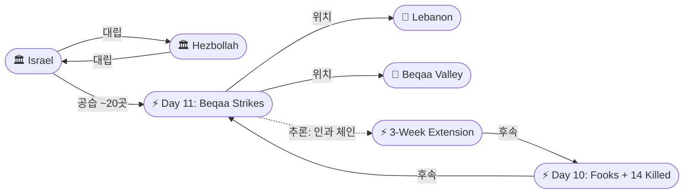
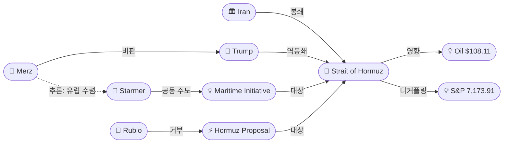

# 2026-04-27 2026 Iran War OSINT 일일 보고서

## 요약

Day 59. 이란이 핵 협상을 후순위로 미루고 호르무즈 재개방/종전에 집중하는 '2단계 접근'을 파키스탄 중개로 미국에 전달했으나, 루비오 국무장관이 "이란이 국제 수로의 통행을 결정할 수 없다"며 즉각 거부했다. 동시에 아라그치 외무장관이 상트페테르부르크에서 푸틴과 회담하여 하메네이 최고지도자의 메시지를 전달했으며, GRU 군사정보국장 코스튜코프가 배석하여 러시아-이란 협력이 군사 정보 수준으로 심화되었음을 시사했다. 독일 메르츠 총리는 미국이 이란에 "굴욕당하고 있다(humiliated)"고 공개 비판하여 유럽 동맹국의 불만이 표면화되었다. 레바논에서는 IDF가 3주 만에 처음으로 베카 밸리를 포함한 ~20개 헤즈볼라 거점을 공습하여 휴전 형해화가 지리적으로 확대되었다. Cole Allen은 대통령 암살 미수 혐의로 연방 기소되었고, 유가는 Brent $108.11(+2.64%)로 상승했으며, S&P 500은 7,173.91로 사상 최고치를 경신했다. WPR 60일 기한까지 4일.

## 주요 뉴스

### 1. 이란, 호르무즈 재개방 + 종전 제안 — 핵 협상은 "후순위"로 분리
- **출처:** [Axios](https://www.axios.com/2026/04/27/iran-us-hormuz-strait-nuclear-talks-proposal-pakistan)
- **일시:** 2026-04-27
- **내용:** 이란이 파키스탄 중개를 통해 미국에 새로운 제안을 전달했다. 핵심은 호르무즈 해협 재개방과 전쟁 종료를 우선 합의하고, 핵 프로그램 협상은 이후 별도 단계에서 진행하자는 '2단계 접근'이다. 4/12 이슬라마바드 결렬 이후 핵이 최대 장애물임을 인식한 이란이 핵을 양보하지 않으면서 교착을 풀려는 전략적 전환이다. 트럼프와 NSC 팀이 제안을 검토했으나, 미국의 핵심 요구인 핵 비확산 보장 없이 봉쇄를 해제할 가능성은 낮다.
- **상태:** 신규
- **관련 엔티티:** Iran, Donald Trump, Pakistan, Strait of Hormuz, Abbas Araghchi

### 2. 루비오, 이란 호르무즈 제안 즉각 거부 — "수용 불가"
- **출처:** [Times of Israel](https://www.timesofisrael.com/rubio-rejects-new-iranian-proposal-to-reopen-strait-of-hormuz-which-tehran-says-it-still-controls/)
- **일시:** 2026-04-27
- **내용:** 루비오 국무장관이 이란의 호르무즈 제안을 "수용 불가(unacceptable)"라고 거부했다. "이란이 말하는 '해협 개방'은 '이란과 조율하고, 허가를 받고, 아니면 격침당한다'는 뜻"이라며, "이란이 국제 수로의 이용 여부와 비용을 결정하는 시스템을 정상화할 수 없고 용납하지 않겠다"고 선언했다. 이는 미국이 호르무즈의 이란 주권 주장 자체를 거부하며 핵을 테이블에서 내릴 의사가 없음을 확인시킨 것이다.
- **상태:** 신규
- **관련 엔티티:** Marco Rubio, Iran, Strait of Hormuz

### 3. 아라그치-푸틴 상트페테르부르크 회담 — 하메네이 메시지 전달, GRU 배석
- **출처:** [Al Jazeera](https://www.aljazeera.com/news/2026/4/27/iran-foreign-minister-in-russia-for-putin-talks)
- **일시:** 2026-04-27
- **내용:** 아라그치 외무장관이 상트페테르부르크에서 푸틴 대통령과 회담했다. 라브로프 외무장관, 우샤코프 외교 보좌관, 코스튜코프 GRU 군사정보국장이 배석했다. 푸틴은 "이란의 이익과 지역 평화를 위해 모든 것을 할 것"이라 약속하고, 이란 최고지도자 하메네이의 메시지를 받았다고 확인했다. 아라그치는 파키스탄 중재 외교 과정을 푸틴에게 브리핑하고 회담을 "매우 생산적"이라 평가했다.
- **상태:** 신규
- **관련 엔티티:** Abbas Araghchi, Vladimir Putin, Sergei Lavrov, Igor Kostyukov, Yury Ushakov, Russia, Iran

### 4. 크렘린 공식 발표: 푸틴, 하메네이 메시지 수신 + GRU 참석 의미
- **출처:** [Kremlin.ru](http://en.kremlin.ru/events/president/news/79633)
- **일시:** 2026-04-27
- **내용:** 크렘린 공식 성명에서 푸틴이 하메네이 최고지도자의 메시지를 수신했다고 확인했다. 회담에 라브로프(외무), 우샤코프(외교 보좌관)뿐 아니라 코스튜코프(GRU 군사정보국장)가 배석한 것은 이례적이다. 이는 러시아의 이란 지원이 외교적 중재를 넘어 군사 정보 공유 수준으로 심화되었음을 시사하며, 이란전쟁 관련 미국/이스라엘 군사 정보가 러시아를 통해 이란에 전달될 가능성을 제기한다.
- **상태:** 신규
- **관련 엔티티:** Vladimir Putin, Sergei Lavrov, Igor Kostyukov, Yury Ushakov, Iran

### 5. 독일 메르츠 총리: 미국 이란에 "굴욕당하고 있다" — 유럽 불만 표면화
- **출처:** [Al Jazeera](https://www.aljazeera.com/news/2026/4/27/iran-very-skilful-as-us-humiliated-says-german-chancellor)
- **일시:** 2026-04-27
- **내용:** 메르츠 독일 총리가 마르스베르크에서 "미국이 이란 지도부에 의해 굴욕당하고 있다"고 발언했다. 이란이 "당초 생각보다 분명히 강하다(clearly stronger than one thought)"며, IRGC가 "매우 능숙하게 협상하고 있다(obviously negotiating very skilfully)"고 평가했다. "진정으로 설득력 있는 전략이 없다(no truly convincing strategy)"고 미국 정책을 비판하며, 과거 미국의 군사적 실패 사례와 비교했다. 호르무즈 봉쇄의 유럽 경제·생활비 충격에 대한 유럽의 누적된 불만이 표출된 것이다.
- **상태:** 신규
- **관련 엔티티:** Friedrich Merz, Germany, United States, Iran, IRGC

### 6. IDF, 베카 밸리 3주 만 첫 공습 — ~20개 헤즈볼라 거점 타격
- **출처:** [Times of Israel](https://www.timesofisrael.com/idf-strikes-lebanons-beqaa-valley-for-first-time-in-3-weeks-amid-shaky-ceasefire/)
- **일시:** 2026-04-27
- **내용:** IDF가 남부 레바논과 동부 베카 밸리에서 ~20개 헤즈볼라 거점을 공습했다. 베카 밸리 공습은 3주 만의 첫 타격이다. 무기 저장소, 로켓 발사대, 제조 시설을 타격했다. 전날 Fooks 전사(Day 10)에 이은 보복을 넘어, IDF의 작전 범위가 남부 레바논에서 동부 레바논으로 지리적으로 확대되었음을 의미한다. 4/16 휴전과 4/23 3주 연장이 사실상 군사 작전 확대의 틀로 활용되고 있다.
- **상태:** 신규
- **관련 엔티티:** Israel, Hezbollah, Lebanon, Beqaa Valley

### 7. Cole Allen, 대통령 암살 미수로 연방 기소 — 무기징역 가능
- **출처:** [CNN](https://www.cnn.com/2026/04/27/politics/live-news/correspondents-dinner-shooting-suspect-court)
- **일시:** 2026-04-27
- **내용:** WHCD 총격범 Cole Tomas Allen이 월요일 연방법원에서 3건으로 기소되었다: (1) 대통령 암살 미수, (2) 폭력 범죄 중 화기 사용, (3) 범죄 목적 화기 주간 운반. 무기징역까지 가능하다. Allen은 가족에게 보낸 이메일에서 "Friendly Federal Assassin"을 자칭하며, 트럼프 행정부 관리들을 "Mr. Patel을 제외하고 최고위직부터 최하위직" 순서로 타겟으로 지목했다. 구금 청문회는 4/30으로 예정되었다.
- **상태:** 업데이트 ← 2026-04-26 WHCD 총격
- **관련 엔티티:** Cole Tomas Allen, Donald Trump

### 8. 유가 Brent $108.11 — 이란 제안에도 +2.64%
- **출처:** [Fortune](https://fortune.com/article/price-of-oil-04-27-2026/)
- **일시:** 2026-04-27
- **내용:** Brent 원유 $108.11(+2.64%), WTI ~$97. 이란의 호르무즈 재개방 제안에도 루비오의 즉각 거부로 시장은 추가 상승했다. 전쟁 개시(2/28) 이후 Brent +50%. IEA가 "역대 최대 에너지 공급 충격"으로 규정한 호르무즈 봉쇄가 고유가의 구조적 원인이다.
- **상태:** 업데이트 ← 2026-04-26 Brent $107.89
- **관련 엔티티:** Strait of Hormuz, Iran

### 9. S&P 500 사상 최고 7,173.91 — 유가-주가 디커플링 지속
- **출처:** [TheStreet](https://www.thestreet.com/latest-news/stock-market-today-apr-27-2026-updates)
- **일시:** 2026-04-27
- **내용:** S&P 500이 +0.12%로 7,173.91 사상 최고치를 경신했다. Nasdaq도 신기록. IT, 커뮤니케이션 서비스, 소비재가 강세를 보였다. 유가가 $108을 기록하는 동시에 주식이 최고치를 경신하는 유가-주가 디커플링이 지속되고 있다. 시장은 호르무즈 봉쇄의 에너지 충격보다 휴전 연장과 실적을 더 무겁게 보고 있다.
- **상태:** 신규
- **관련 엔티티:** S&P 500

### 10. WPR 60일 기한 4일 앞 — AUMF/Article II 우회 분석
- **출처:** [CNN](https://www.cnn.com/2026/04/25/politics/war-powers-act-trump-iran-war-congress-analysis)
- **일시:** 2026-04-27
- **내용:** War Powers Resolution 60일 기한(5월 1일)까지 4일. 상원 공화당이 5차 연속 WPR 결의안을 부결(52-47)시켰다. 트럼프는 30일 추가 연장(철수용)을 적용할 수 있으나, 이는 전쟁 지속이 아닌 안전한 철수를 위한 것이다. 행정부가 AUMF(2001) 또는 Article II 대통령 권한을 원용하여 WPR을 우회할 가능성이 높아지고 있다.
- **상태:** [추적] 업데이트 ← 2026-04-26 WPR 5일
- **관련 엔티티:** Donald Trump, War Powers Resolution

## 지식그래프

### 오늘의 주요 관계
1. **핵 분리 전략의 등장과 즉시 거부**: 이란이 핵을 2단계로 미루는 새로운 접근을 시도했으나, 루비오의 즉각 거부로 '호르무즈 주권'과 '핵 비확산' 사이의 근본적 대립이 재확인되었다.
2. **러시아 채널 공식화 + GRU**: 아라그치-푸틴 회담에 군사정보국장이 배석한 것은 러시아-이란 관계가 외교를 넘어 군사 정보 공유 수준으로 심화되었음을 의미한다.
3. **유럽의 공개적 이탈**: 메르츠의 '미국 굴욕' 발언 + 스타머-마크롱의 50국 해양 이니셔티브 = 유럽이 미국의 봉쇄 전략에서 독자적 대안을 모색하는 추세.
4. **레바논 지리적 확대**: 베카 밸리 공습은 IDF 작전 범위가 남부→동부 레바논으로 확대되었음을 의미. 휴전이 점령/작전 확대의 도구로 변질.
5. **다면적 외교 구도**: 파키스탄(중개) + 러시아(후원) + 오만(뒤채널) + 유럽(독자) = 미-이란 양자를 넘어 다자적 외교 구도가 형성.

### 외교 다면체: 이란 제안과 다채널 반응

```mermaid
graph LR
    IR(["🏛 Iran"])
    T(["👤 Trump"])
    RB(["👤 Rubio"])
    A(["👤 Araghchi"])
    VP(["👤 Putin"])
    LV(["👤 Lavrov"])
    KS(["👤 Kostyukov/GRU"])
    MZ(["👤 Merz"])
    PK(["🏛 Pakistan"])
    RU(["🏛 Russia"])
    EV1(["⚡ Hormuz Proposal"])
    EV2(["⚡ Putin Meeting"])
    HM(["📍 Strait of Hormuz"])
    ND(["💡 Nuclear Deferral"])

    IR -->|제안| EV1
    EV1 -->|대상| HM
    EV1 -->|핵 후순위| ND
    PK -->|중개| EV1
    T -->|검토| EV1
    RB -->|거부: '수용 불가'| EV1
    A -->|참여| EV2
    VP -->|참여 + 지지 약속| EV2
    LV -->|배석| EV2
    KS -->|배석 (군사정보)| EV2
    EV2 -->|위치| RU
    MZ -->|비판: '미국 굴욕'| T
    VP -->|하메네이 메시지 수신| IR
    VP -.->|추론: 병렬 중재| PK
    MZ -.->|추론: 유럽 수렴| EV1
```

### 레바논 에스컬레이션 체인



### 호르무즈/경제 영향



## 온톨로지 변경

| 변경 유형 | 대상 | 근거 |
|----------|------|------|
| 새 엔티티 | ent-204: Marco Rubio | 미 국무장관, 이란 호르무즈 제안 공식 거부 |
| 새 엔티티 | ent-205: Friedrich Merz | 독일 총리, '미국 굴욕' 공개 비판 |
| 새 엔티티 | ent-206: Igor Kostyukov | GRU 군사정보국장, 푸틴-아라그치 회담 배석 |
| 새 엔티티 | ent-207: Yury Ushakov | 크렘린 외교 보좌관, 푸틴-아라그치 회담 배석 |
| 새 엔티티 | ent-208: Sergei Lavrov | 러시아 외무장관, 푸틴-아라그치 회담 배석 |
| 새 엔티티 | ent-209: Iran Hormuz Reopening Proposal | 핵 후순위 2단계 접근, 루비오 거부 |
| 새 엔티티 | ent-210: Araghchi-Putin Meeting | 상트페테르부르크 회담, GRU 참석 |
| 새 엔티티 | ent-211: IDF Beqaa Valley Strikes Day 11 | 3주 만 베카 공습, 지리적 확대 |
| 새 엔티티 | ent-212: Nuclear Deferral Strategy | 이란의 핵 후순위 전략 개념 |
| 스키마 변경 | 없음 | 기존 클래스/관계로 충분히 표현 |

## 추론 결과

| 추론 | 신뢰도 | 근거 |
|------|--------|------|
| Putin → potentialRelation → Pakistan | 0.72 | 러시아와 파키스탄 모두 이란과 활발히 접촉. 아라그치가 양국을 병렬 중재 채널로 활용. 두 채널이 조율될 가능성. |
| Merz → potentialRelation → Starmer | 0.70 | 유럽 내 두 대응: 메르츠의 공개 비판 + 스타머의 해양 이니셔티브. 목표(호르무즈 해법) 동일, 접근법 상이. 공통 포지션 수렴 가능. |
| Hormuz Proposal → causalChain → Nuclear Deferral | 0.80 | 이란의 호르무즈 제안은 핵 후순위 전략의 구현체. 4/12 이슬라마바드 결렬 이후 핵 우회 전략 채택. |
| Kostyukov → indirectlyAffiliatedWith → Iran | 0.72 | GRU 군사정보국장의 외교 회담 배석 = 러시아-이란 군사 정보 공유. 미국/이스라엘 군사 정보 전달 가능성. |
| Beqaa Strikes → causalChain → 3-Week Extension | 0.75 | 3주 연장 → 7마을 퇴거 → Day 10 보복 → Day 11 베카 공습. 휴전 확대가 군사 작전 확대로 이어지는 인과 체인. |

## 분석 및 평가

### 외교: '핵 분리'의 구조적 전환과 즉시 좌절

이란의 핵 후순위 제안은 전쟁 개시 이후 가장 유의미한 외교적 전략 전환이다. 4/12 이슬라마바드 21시간 마라톤 협상이 핵 쟁점에서 결렬된 이후, 이란은 핵을 양보하지 않으면서 교착을 풀 수 있는 유일한 방법이 핵을 분리하는 것이라 판단한 것으로 보인다. 그러나 루비오의 즉각적이고 강경한 거부는 세 가지를 확인시켰다:

1. **미국의 핵심 레드라인**: 핵 비확산 보장 없이 봉쇄를 해제하지 않겠다는 입장이 확고하다. 핵과 호르무즈는 미국에게 패키지 딜이다.
2. **호르무즈 주권 논쟁**: 이란이 재개방 조건을 설정하는 것 자체를 "정상화할 수 없다"는 루비오의 발언은, 호르무즈에 대한 이란의 어떤 형태의 통제권도 인정하지 않겠다는 원칙적 거부다.
3. **협상 프레임의 교착**: 이란은 핵을 분리하려 하고, 미국은 핵을 묶으려 한다. 이 구조적 불일치가 해소되지 않는 한 돌파구가 어렵다.

### 러시아: 외교에서 군사 정보로의 격상

아라그치-푸틴 회담의 핵심은 회담 내용보다 참석자 구성이다. GRU 군사정보국장 코스튜코프의 배석은 러시아의 이란 지원이 외교적 수사를 넘어 실질적 군사 정보 협력으로 격상되었음을 시사한다. 이는 세 가지 함의를 갖는다:

1. **정보 공유**: 러시아가 보유한 미국/이스라엘 군사 정보가 이란에 전달될 수 있다.
2. **억지력**: 러시아의 군사 개입 가능성을 미국에 간접 시그널링한다.
3. **다자화**: 미-이란 양자 갈등이 미국-러시아 대리전 구도로 확대될 리스크가 있다.

하메네이의 직접 메시지 전달은 이란이 러시아를 최고 수준의 메시지 채널로 활용하고 있음을 의미한다.

### 유럽: 동맹 균열의 표면화

메르츠의 '미국 굴욕' 발언은 NATO 동맹국이 미국의 이란 전략을 공개적으로 비판한 가장 강력한 사례다. 이는 세 가지 맥락에서 이해해야 한다:

1. **경제적 고통**: 호르무즈 봉쇄로 유럽은 에너지 가격 급등과 생활비 위기를 겪고 있다.
2. **전략적 이견**: 메르츠는 미국에 "설득력 있는 전략이 없다"고 직접 비판했다.
3. **독자적 대안**: 스타머-마크롱의 50국 해양 이니셔티브와 결합하면, 유럽이 미국 주도의 봉쇄에서 이탈하여 독자적 호르무즈 해법을 모색하는 추세가 확인된다.

### 레바논: 휴전 틀 내의 전쟁 확대

베카 밸리 공습은 단순한 보복이 아니라 구조적 변화를 의미한다. 4/16 휴전 → 4/23 3주 연장 → 7마을 강제 퇴거(4/26) → Fooks 전사/14명 보복(Day 10) → 베카 밸리 포함 20곳 공습(Day 11)으로 이어지는 에스컬레이션 체인은, 이스라엘이 휴전을 군사 작전 확대의 프레임으로 활용하고 있음을 보여준다. 특히 베카 밸리는 남부 레바논 밖으로, IDF의 작전 범위가 지리적으로 확대되었다.

### 핵심 판단
- **협상 전망**: 핵 분리 제안이 루비오에 의해 즉각 거부되면서, 양측의 구조적 불일치가 재확인되었다. 파키스탄+러시아+오만의 뒤채널이 있으나 돌파구는 보이지 않는다.
- **러시아**: 외교에서 군사 정보로 개입 수준이 격상되었다. 미-러 긴장이 이란전쟁을 통해 심화될 리스크.
- **유럽**: 동맹 균열이 표면화되었다. 유럽 독자 노선이 구체화되면 미국의 봉쇄 지속력에 영향을 줄 수 있다.
- **레바논**: 휴전은 명목상 유지되나 실질적으로 전쟁 상태. 베카 밸리 공습은 새로운 지리적 전선 개방.
- **유가**: $108은 외교 실패와 봉쇄 지속을 반영. 주식시장과의 디커플링은 시장이 종전을 가격에 반영하고 있음을 시사.
- **WPR**: 4일 앞. 행정부의 AUMF/Article II 우회가 기정사실화되고 있다.

## 추적 항목

| 항목 | 최초 보고 | 상태 | 최신 업데이트 |
|------|----------|------|-------------|
| 이란 호르무즈 재개방 제안 | 2026-04-27 | **신규** | 핵 후순위 2단계 접근, 루비오 즉각 거부 |
| 아라그치 셔틀 외교 | 2026-04-25 | [추적] **푸틴 회담 실현** | 이슬라마바드→무스카트→상트페테르부르크 완료 |
| 러시아 개입 수준 | 2026-04-07 | [추적] **군사 정보 격상** | GRU 참석, 하메네이 메시지 전달 |
| 레바논 3주 연장 | 2026-04-23 | [추적] **사실상 붕괴** | Day 11: 베카 밸리 포함 ~20곳 공습 |
| WPR 5월 1일 데드라인 | 2026-04-24 | [추적] **4일 앞** | 상원 5차 부결, AUMF 우회 가능성 |
| 호르무즈 봉쇄 | 2026-04-13 | [추적] **이중 봉쇄 지속** | 이란 제안 거부, Brent $108 |
| 갈리바프 사임 / 자릴리 후임 | 2026-04-23 | [추적] **확인 중** | 진전 없음 |
| 이란 내부 분열 | 2026-04-19 | [추적] **다면화** | 핵 분리 제안 = 외교파 전략, IRGC 입장 불명 |
| WHCD 총격 / Cole Allen | 2026-04-26 | [추적] **기소 완료** | 대통령 암살 미수 + 2건, 무기징역 가능 |
| 유럽 독자 노선 | 2026-04-27 | **신규** | 메르츠 비판 + 스타머 해양 이니셔티브 |

## 동향 요약

| 분류 | 상태 | 비고 |
|------|------|------|
| 미-이란 휴전 | 유지(무기한) | 트럼프 4/21 무기한 연장, 봉쇄 지속 |
| 이란 제안 | 핵 분리 2단계 → 루비오 거부 | 호르무즈 재개방 우선, 핵 후순위 |
| 러시아 역할 | 군사정보 수준 격상 | 푸틴-아라그치 회담, GRU 참석, 하메네이 메시지 |
| 레바논 휴전 | 사실상 붕괴 | Day 11: 베카 밸리 3주 만 첫 공습 |
| 호르무즈 해협 | 이중 봉쇄 지속 | 이란 제안 거부, 루비오 '수용 불가' |
| 유가 | Brent $108.11 | +2.64%, 전쟁 이후 +50% |
| 주식 | S&P 500 7,173.91 사상 최고 | 유가-주가 디커플링 지속 |
| 유럽 | 동맹 균열 표면화 | 메르츠 '미국 굴욕', 독자 대안 모색 |
| 이란 내부 | 핵 분리 전략 전환 | 외교파 주도, IRGC 입장 불명 |
| WPR | 4일 앞 | 상원 5차 부결, AUMF 우회 가능성 |
| WHCD 총격 | 기소 완료 | 대통령 암살 미수, 무기징역 가능 |

## 출처 목록
1. [Iran offers US deal to reopen Hormuz strait, postpone nuclear talks](https://www.axios.com/2026/04/27/iran-us-hormuz-strait-nuclear-talks-proposal-pakistan) - Axios, 2026-04-27
2. [Iran offers to reopen Strait of Hormuz if US lifts blockade](https://www.pbs.org/newshour/world/iran-offers-to-reopen-strait-of-hormuz-if-u-s-lifts-its-blockade-and-the-war-ends-officials-say) - PBS, 2026-04-27
3. [Iran offers to reopen Strait of Hormuz](https://www.washingtonpost.com/business/2026/04/27/us-iran-war-hormuz-april-27-2026/9bf7dec8-4208-11f1-b19d-32431046b5b4_story.html) - Washington Post, 2026-04-27
4. [Iran makes new offer to open Strait of Hormuz](https://www.foxnews.com/live-news/trump-iran-peace-talks-hormuz-blockade-april-27) - Fox News, 2026-04-27
5. [Iran offers deal to reopen Hormuz, punt nuclear talks](https://www.washingtontimes.com/news/2026/apr/27/iran-offers-deal-reopen-strait-hormuz-punt-nuclear-talks-later-date/) - Washington Times, 2026-04-27
6. [Iran offers to reopen Strait of Hormuz amid oil price surge](https://fortune.com/2026/04/27/iran-offers-to-reopen-strait-of-hormuz-oil-prices-trump-putin-nuclear/) - Fortune, 2026-04-27
7. [Trump discussed Iran's Hormuz proposal with top aides](https://www.cnbc.com/2026/04/27/trump-iran-war-strait-of-hormuz-rubio.html) - CNBC, 2026-04-27
8. [Rubio rejects new Iranian proposal to reopen Strait of Hormuz](https://www.timesofisrael.com/rubio-rejects-new-iranian-proposal-to-reopen-strait-of-hormuz-which-tehran-says-it-still-controls/) - Times of Israel, 2026-04-27
9. [Rubio Says US Rejects Iran's Control Over Strait of Hormuz](https://www.bloomberg.com/news/articles/2026-04-27/us-cannot-accept-iran-retaining-control-of-hormuz-rubio-says) - Bloomberg, 2026-04-27
10. [Rubio: US will not accept Iran control of key oil chokepoint](https://worldoil.com/news/2026/4/27/rubio-u-s-will-not-accept-iran-control-of-key-oil-chokepoint-hormuz/) - World Oil, 2026-04-27
11. [Iran's top diplomat visits Russia for Putin talks](https://www.aljazeera.com/news/2026/4/27/iran-foreign-minister-in-russia-for-putin-talks) - Al Jazeera, 2026-04-27
12. [As US-Iran talks falter, Araghchi meets Putin](https://www.washingtonpost.com/world/2026/04/27/iran-talks-putin-araghchi-trump-russia/) - Washington Post, 2026-04-27
13. [Putin meets Iranian FM, pledges support for Iran](https://news.cgtn.com/news/2026-04-27/news-1MGOnvTJMLS/index.html) - CGTN, 2026-04-27
14. [Meeting with Foreign Minister of Iran Abbas Araghchi](http://en.kremlin.ru/events/president/news/79633) - Kremlin.ru, 2026-04-27
15. [Iran's Foreign Minister Meets With Putin in St. Petersburg](https://www.themoscowtimes.com/2026/04/27/irans-foreign-minister-meets-with-putin-in-st-petersburg-a92608) - Moscow Times, 2026-04-27
16. [Iran's flurry of diplomacy continues in Russia](https://www.npr.org/2026/04/27/nx-s1-5800669/iran-middle-east-updates) - NPR, 2026-04-27
17. [Germany's Merz says Iran 'humiliated' US](https://www.aljazeera.com/news/2026/4/27/iran-very-skilful-as-us-humiliated-says-german-chancellor) - Al Jazeera, 2026-04-27
18. [US 'is being humiliated' by Iranian leadership, Merz says](https://www.pbs.org/newshour/world/u-s-is-being-humiliated-by-the-iranian-leadership-germanys-merz-says) - PBS, 2026-04-27
19. [Trump Being 'Humiliated' in Iran Talks, German Chancellor Says](https://www.bloomberg.com/news/articles/2026-04-27/trump-being-humiliated-in-iran-talks-german-chancellor-says) - Bloomberg, 2026-04-27
20. [IDF strikes Lebanon's Beqaa Valley for first time in 3 weeks](https://www.timesofisrael.com/idf-strikes-lebanons-beqaa-valley-for-first-time-in-3-weeks-amid-shaky-ceasefire/) - Times of Israel, 2026-04-27
21. [IDF carried out over 20 attacks in Lebanon](https://www.haaretz.com/israel-news/israel-security/2026-04-27/ty-article-live/report-14-killed-37-wounded-in-idf-strikes-on-southern-lebanon/0000019d-cb7a-d505-afbd-ff7e9c740004) - Haaretz, 2026-04-27
22. [Israeli strikes kill 14 in Lebanon despite ceasefire](https://www.democracynow.org/2026/4/27/headlines/israeli_strikes_kill_14_people_in_lebanon_despite_us_brokered_ceasefire) - Democracy Now, 2026-04-27
23. [Cole Allen charged with attempting to assassinate Trump](https://www.cnn.com/2026/04/27/politics/live-news/correspondents-dinner-shooting-suspect-court) - CNN, 2026-04-27
24. [Suspected dinner gunman charged with assassination attempt](https://www.npr.org/2026/04/27/nx-s1-5800175/white-house-correspondents-dinner-cole-allen-federal-court) - NPR, 2026-04-27
25. [Cole Allen tried to assassinate Trump, prosecutors charge](https://www.cnbc.com/2026/04/27/cole-allen-whcd-arraigment-trump.html) - CNBC, 2026-04-27
26. [DOJ unveils charges against WHCD shooting suspect](https://www.foxnews.com/live-news/white-house-correspondents-dinner-shooting-04-27-26) - Fox News, 2026-04-27
27. [Current price of oil as of April 27, 2026](https://fortune.com/article/price-of-oil-04-27-2026/) - Fortune, 2026-04-27
28. [Stock market today: S&P 500, Nasdaq set new highs](https://www.thestreet.com/latest-news/stock-market-today-apr-27-2026-updates) - TheStreet, 2026-04-27
29. [Iran war: Day 59 amid diplomatic push](https://www.aljazeera.com/news/2026/4/27/iran-war-whats-happening-on-day-59-amid-diplomatic-push-to-end-conflict) - Al Jazeera, 2026-04-27
30. [WPR 60-day limit on unauthorized wars](https://www.cnn.com/2026/04/25/politics/war-powers-act-trump-iran-war-congress-analysis) - CNN, 2026-04-25
31. [이란 "미국 봉쇄 풀면 호르무즈 개방"...미국 "수용 불가"](https://www.thefairnews.co.kr/news/articleView.html?idxno=75539) - 더페어, 2026-04-27
32. [푸틴 "이란 최고지도자 메시지 받았다"](https://segye.com/newsView/20260427518739) - 세계일보, 2026-04-27
