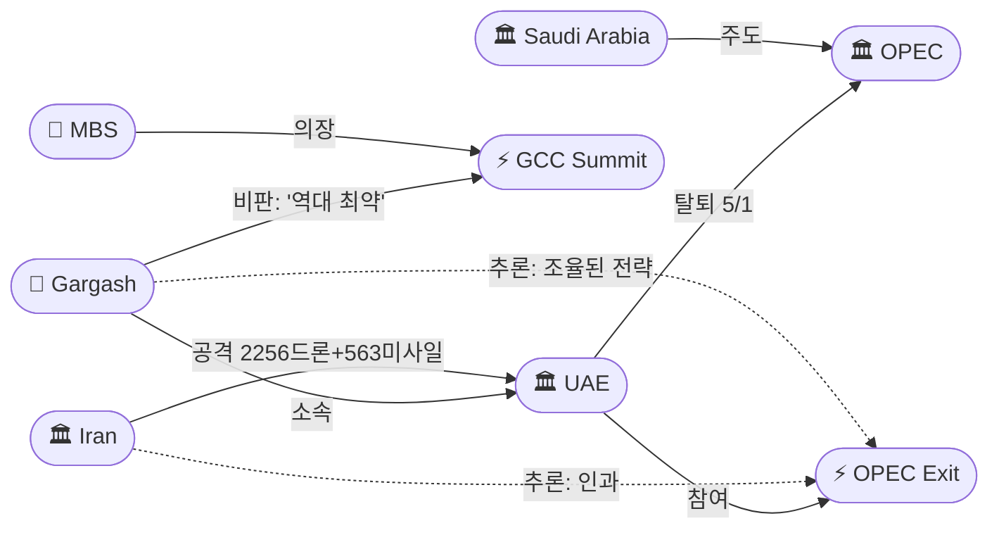

# 2026-04-28 2026 Iran War OSINT 일일 보고서

## 요약

Day 60. UAE가 60년 만에 OPEC/OPEC+를 탈퇴하여 5월 1일부터 독자 증산에 나선다고 발표했다. 이란 전쟁에서 가장 많은 공격을 받은 UAE가 GCC의 "역대 최약한" 대응에 불만을 폭발시키며 걸프 동맹의 구조적 재편을 촉발했다. 트럼프는 Truth Social에서 "이란이 붕괴 상태(State of Collapse)라고 우리에게 알려왔다"며 이란의 호르무즈 제안을 '절박한 요청'으로 프레이밍했으나, 이란군 대변인 아크라미니아는 "여전히 전쟁 상황"이라며 즉각 반박했다. 구테흐스 UN 사무총장이 안보리에서 호르무즈 즉시 개방을 촉구하며 식량 위기를 경고했고, 러시아 억만장자 모르다쇼프의 $500M 요트가 이중 봉쇄된 호르무즈를 무사 통과하여 봉쇄의 '선택적 집행'이 드러났다. 유가는 Brent $111.26(+3%)로 급등하고, S&P 500은 전일 사상 최고에서 -0.49% 반전했다. WPR 60일 데드라인까지 3일.

## 주요 뉴스

### 1. UAE, 60년 만에 OPEC/OPEC+ 전격 탈퇴 — 5월 1일 발효
- **출처:** [CNN](https://www.cnn.com/2026/04/28/business/uae-quits-opec-in-major-blow-to-oil-cartel-and-saudi-arabia)
- **일시:** 2026-04-28
- **내용:** UAE 에너지부가 5월 1일부터 OPEC 및 OPEC+에서 탈퇴한다고 공식 발표했다. 약 60년의 회원국 역사를 마감한다. UAE는 현재 하루 340만 배럴 생산량을 2027년까지 500만 배럴로 확대할 계획이다. 이란 전쟁 이후 UAE는 드론 2,256기와 미사일 563기의 공격을 받아 GCC 국가 중 최다 피해를 입었다. 사우디 주도 OPEC의 생산량 제한에서 벗어나 독자적 에너지 전략을 추구한다. 카타르(2019) 이후 두 번째 GCC 내부 이탈로, 사우디 영향력에 큰 타격이다.
- **상태:** 신규
- **관련 엔티티:** UAE, OPEC, Saudi Arabia, Mohammed bin Salman

### 2. 트럼프: "이란이 붕괴 상태라고 우리에게 알려왔다" — 호르무즈 즉시 개방 원해
- **출처:** [The Hill](https://thehill.com/homenews/administration/5852711-trump-iran-collapsing-strait-of-hormuz/)
- **일시:** 2026-04-28
- **내용:** 트럼프 대통령이 Truth Social에 "Iran has just informed us that they are in a 'State of Collapse.' They want us to 'Open the Hormuz Strait,' as soon as possible, as they try to figure out their leadership situation"이라고 게시했다. 이란의 호르무즈 제안(4/27)을 루비오가 거부한 다음날 나온 이 발언은, 이란의 제안을 '강자의 외교'가 아닌 '절박한 간청'으로 프레이밍하려는 시도다. 이란은 봉쇄로 하루 $400M+ 손실을 보고 있으며 석유 저장 용량도 소진 중이다. 그러나 테헤란의 공식 확인은 없다.
- **상태:** 신규
- **관련 엔티티:** Donald Trump, Iran, Strait of Hormuz

### 3. GCC 제다 정상회의 — 전쟁 후 첫 대면, 가르가쉬 "역대 최약 대응" 비판
- **출처:** [Al Jazeera](https://www.aljazeera.com/news/2026/4/28/gulf-leaders-meet-in-saudi-arabia-for-first-time-since-start-of-war-on-iran)
- **일시:** 2026-04-28
- **내용:** 무함마드 빈 살만 사우디 왕세자가 제다에서 GCC 협의 회의를 주재했다 — 2/28 전쟁 개시 이후 첫 대면 정상회의다. 카타르 국왕, 쿠웨이트 왕세자, 바레인 국왕, UAE 외무장관이 참석했다. 6개 GCC 국가 모두 이란의 미사일·드론 공격으로 에너지 인프라가 피해를 입었다. 별도로 UAE의 안와르 가르가쉬 외교고문은 GCC의 정치·군사적 대응이 "역대 최약(weakest in history)"이라 비판하며, 이란 봉쇄 정책이 "비참하게 실패(failed miserably)"했다고 평가했다.
- **상태:** 신규
- **관련 엔티티:** Mohammed bin Salman, Anwar Gargash, GCC, UAE, Saudi Arabia

### 4. UN 사무총장, 호르무즈 즉시 개방 촉구 — "글로벌 식량 위기" 경고
- **출처:** [Muscat Daily](https://www.muscatdaily.com/2026/04/28/un-chief-calls-for-immediate-reopening-of-strait-of-hormuz/)
- **일시:** 2026-04-28
- **내용:** 구테흐스 UN 사무총장이 안보리에서 호르무즈 해협의 "긴급하고 무조건적인 재개방(urgent and unimpeded reopening)"을 촉구했다. 해협 봉쇄로 글로벌 LNG·원유 수송의 20%가 중단되었으며, 아프리카와 남아시아 수백만 명이 기아와 빈곤으로 밀려날 위험이 있다고 경고했다. 수십 개국이 동참했다. 이란의 호르무즈 재개방 제안(4/27)과 시기적으로 맞물려 다자적 압박이 공식화된 것이나, 미국이 핵 연계를 고수하는 한 직접적 영향은 제한적이다.
- **상태:** 신규
- **관련 엔티티:** António Guterres, Strait of Hormuz, United Nations

### 5. 러시아 억만장자 모르다쇼프의 $500M 요트, 봉쇄된 호르무즈 통과
- **출처:** [Fortune](https://fortune.com/2026/04/28/500-million-superyacht-linked-with-russia-richest-man-alexei-mordashov-strait-of-hormuz/)
- **일시:** 2026-04-28
- **내용:** 미국·EU 제재 대상인 러시아 최대 부호 알렉세이 모르다쇼프(순자산 $37B, Severstal 회장)의 142m 슈퍼요트 Nord($500M)가 금요일 두바이를 출발하여 일요일 오만 무스카트에 도착했다 — 이중 봉쇄된 호르무즈를 무사히 통과했다. 전쟁 이후 호르무즈를 통과한 극소수의 민간 선박 중 하나다. 미 해군의 봉쇄 일관성과 러시아에 대한 '선택적 집행'에 의문이 제기된다. 푸틴-아라그치 회담(4/27) 직후라는 점에서 러시아-이란 군사 협력의 부산물일 가능성이 있다.
- **상태:** 신규
- **관련 엔티티:** Alexey Mordashov, Russia, Strait of Hormuz

### 6. 이란군 대변인: "여전히 전쟁 상황" — 트럼프 '붕괴' 주장 즉각 반박
- **출처:** [Al Jazeera](https://www.aljazeera.com/news/liveblog/2026/4/28/iran-war-live-trump-reviews-peace-plan-un-calls-for-hormuz-to-reopen)
- **일시:** 2026-04-28
- **내용:** 이란군 대변인 모하마드 아크라미니아가 이란의 군대는 전쟁이 끝났다고 보지 않으며 "군사적 조건이 여전히 유지되고 있다(military conditions are still in place)"고 성명했다. IRGC와 정규군 모두 미국·이스라엘이 이란을 "석기시대로 돌려보내려(back to the Stone Age)" 추가 공습을 감행할 경우 더 많은 미사일과 드론을 발사할 "완전한 준비"가 되어 있다고 경고했다. 이는 트럼프의 '이란 붕괴' 주장에 대한 직접적 반박이다.
- **상태:** 신규
- **관련 엔티티:** Mohammad Akraminia, Iran, IRGC

### 7. 유가 급등 Brent $111.26(+3%) — WTI 거의 $100 도달
- **출처:** [CNBC](https://www.cnbc.com/2026/04/28/oil-prices-us-iran-hormuz-negotiations-wti-brent-crude.html)
- **일시:** 2026-04-28
- **내용:** Brent 원유가 +3% 상승하여 $111.26에 마감했다. WTI는 +3%로 $99.93(장중 $100+ 돌파). 트럼프가 이란 제안에 불만족스럽다는 보도, 협상 교착 지속, UAE OPEC 탈퇴가 불확실성을 더했다. 전쟁 개시(2/28) 이후 Brent +55%. 장기 $100+ 고유가가 글로벌 인플레이션과 소비자 고통을 심화시키고 있다.
- **상태:** 업데이트 ← 2026-04-27 Brent $108.11
- **관련 엔티티:** Strait of Hormuz, Iran, UAE

### 8. S&P 500 -0.49%(7,138.80) — 전일 사상 최고에서 반전
- **출처:** [TheStreet](https://www.thestreet.com/latest-news/stock-market-today-apr-28-2026-updates)
- **일시:** 2026-04-28
- **내용:** S&P 500이 -0.49%로 7,138.80에 마감, 전일 사상 최고(7,173.91)에서 반전했다. Nasdaq -0.90%(24,663.80), Dow -0.05%(49,141.93). WSJ이 OpenAI의 매출/사용자 성장이 목표에 미달하고 CFO가 컴퓨팅 계약 지불 능력을 우려한다고 보도하면서 AI 관련주가 하락했다. 유가 $111 급등도 부담을 더했다. 유가-주가 디커플링이 이제 재커플링(유가 상승 → 주가 하락)으로 전환되는 신호일 수 있다.
- **상태:** 신규
- **관련 엔티티:** S&P 500

### 9. 레바논 Day 12: 이스라엘, 남부 12개+ 마을 추가 강제 퇴거 명령
- **출처:** [Al Arabiya](https://english.alarabiya.net/News/middle-east/2026/04/28/israeli-military-orders-more-than-a-dozen-towns-in-southern-lebanon-to-evacuate)
- **일시:** 2026-04-28
- **내용:** IDF가 남부 레바논 12개 이상 마을·도시 주민에게 즉시 북쪽(시돈 방향)으로 퇴거하라고 경고했다. 헤즈볼라의 "휴전 위반"을 명분으로 내세웠다. 3/2 이후 전체 사상자: 2,491명 사망, 7,719명 부상. Day 12. 4/26 7마을 퇴거 → 4/27 베카 밸리 공습 → 4/28 12개+ 마을 추가 퇴거로 에스컬레이션 체인이 계속되고 있다.
- **상태:** 업데이트 ← 2026-04-27 Day 11 베카 밸리 공습
- **관련 엔티티:** Israel, Hezbollah, Lebanon

### 10. WPR 60일 데드라인 3일 앞 — 법적 대결 임박
- **출처:** [Military.com](https://www.military.com/daily-news/headlines/2026/04/28/Iran-War-Heads-Toward-Legal-Showdown-as-May-1-Deadline-Nears)
- **일시:** 2026-04-28
- **내용:** War Powers Resolution 60일 기한(5월 1일)까지 3일. 법학자들 사이에서 의회 승인 없이 전쟁을 계속할 수 있는지 논쟁이 격화되고 있다. 트럼프는 30일 추가 연장을 적용할 수 있으나 이는 '안전한 철수'용이지 전쟁 지속용이 아니다. 행정부는 AUMF(2001) 또는 Article II 대통령 고유 권한을 원용하여 우회할 것으로 예상된다. 이전 대통령들도 WPR을 반복적으로 우회한 선례가 있다.
- **상태:** [추적] 업데이트 ← 2026-04-27 WPR 4일
- **관련 엔티티:** Donald Trump, War Powers Resolution

### 11. 블룸버그: "미국, 호르무즈 단독 개방 불가" — 봉쇄의 구조적 한계
- **출처:** [Bloomberg](https://www.bloomberg.com/opinion/articles/2026-04-28/iran-war-us-can-t-reopen-strait-of-hormuz-on-its-own)
- **일시:** 2026-04-28
- **내용:** 블룸버그 분석은 미국이 이란 또는 동맹국의 협력 없이 호르무즈를 일방적으로 재개방할 수 없다고 주장한다. IRGC의 기뢰, 쾌속정, 해안 미사일 배터리가 '계층적 방어(layered defense)'를 구성하고 있으며, 기뢰 제거만으로도 수개월이 소요된다. NATO 동맹국이 합동 작전을 거부한 상황에서 일방적 소탕은 이란과의 대규모 군사 확전을 초래할 수 있다. 현재 800척의 선박이 페르시아만에 고립되어 있다.
- **상태:** 신규
- **관련 엔티티:** US Military, IRGC, Strait of Hormuz, NATO

## 지식그래프

### 오늘의 주요 관계
1. **걸프 원심력**: UAE OPEC 탈퇴 + 가르가쉬 GCC '역대 최약' 비판 = 이란 전쟁이 걸프 동맹 구조를 해체하기 시작. UAE는 사우디 주도 체제에서 이탈하여 독자 노선 선택.
2. **프레이밍 전쟁**: 트럼프 '이란 붕괴' vs 이란군 '전쟁 지속' — 양측이 상대의 협상 지위를 무력화하려는 정보전. 진실은 중간 어딘가.
3. **다자 압박 형성**: UN 호르무즈 촉구 + 이란 호르무즈 제안 = 동일 목표(해협 개방)로 수렴. 미국만이 핵 연계를 고수하여 고립 리스크.
4. **봉쇄 모순**: Nord 요트 통과 + Bloomberg '단독 불가' = 미국 봉쇄의 구조적·실행적 한계가 동시 노출.
5. **에너지 연쇄**: UAE OPEC 탈퇴 → 유가 불확실성 → Brent $111 → S&P 반전. 걸프 재편이 금융시장까지 충격 전파.

### 걸프 동맹 재편



### 호르무즈 교착 & 프레이밍 전쟁

```mermaid
graph LR
    T(["👤 Trump"])
    IR(["🏛 Iran"])
    AK(["👤 Akraminia"])
    GT(["👤 Guterres"])
    HM(["📍 Strait of Hormuz"])
    EV1(["⚡ 'Collapse' Claim"])
    EV2(["⚡ UN Reopening Call"])
    EV3(["⚡ Iran Proposal (4/27)"])
    RB(["👤 Rubio"])
    BL(["💡 Bloomberg: Can't Reopen Alone"])

    T -->|주장| EV1
    EV1 -->|대상: 붕괴| IR
    AK -->|반박: '전쟁 지속'| EV1
    AK -->|소속| IR
    GT -->|촉구| EV2
    EV2 -->|대상| HM
    EV3 -->|대상| HM
    RB -->|거부 (4/27)| EV3
    EV1 -.->|추론: 프레이밍 무력화| EV3
    EV2 -.->|추론: 목표 수렴| EV3
    BL -->|분석: 단독 불가| HM
```

### 봉쇄 선택적 집행

```mermaid
graph LR
    MD(["👤 Mordashov"])
    ND(["⚡ Nord Transit"])
    HM(["📍 Strait of Hormuz"])
    RU(["🏛 Russia"])
    IR(["🏛 Iran"])
    USN(["🏛 US Navy"])
    IRGC(["🏛 IRGC"])

    MD -->|소유 $500M| ND
    ND -->|통과| HM
    MD -->|소속| RU
    RU -->|협력 (4/27 GRU)| IR
    USN -->|봉쇄| HM
    IRGC -->|봉쇄| HM
    RU -.->|추론: 양측 특혜| ND
    MD -.->|추론: 간접 연결| IR
```

## 온톨로지 변경

| 변경 유형 | 대상 | 근거 |
|----------|------|------|
| 새 엔티티 | ent-213: OPEC | UAE 탈퇴 대상 조직, 60년 역사 |
| 새 엔티티 | ent-214: Anwar Gargash | UAE 외교고문, GCC '역대 최약' 비판 |
| 새 엔티티 | ent-215: Mohammed bin Salman (MBS) | 사우디 왕세자, GCC 서밋 의장 |
| 새 엔티티 | ent-216: GCC Jeddah Summit | 전쟁 후 첫 대면 정상회의 |
| 새 엔티티 | ent-217: Alexey Mordashov | 러시아 억만장자, Nord 요트 호르무즈 통과 |
| 새 엔티티 | ent-218: Mohammad Akraminia | 이란군 대변인, '전쟁 상황 지속' |
| 새 엔티티 | ent-219: UAE OPEC Exit | 60년 만의 탈퇴, 5/1 발효 |
| 새 엔티티 | ent-220: Trump 'State of Collapse' Claim | 이란 붕괴 주장, 테헤란 미확인 |
| 새 엔티티 | ent-221: UN Hormuz Reopening Call | 구테흐스 안보리 발언, 식량 위기 경고 |
| 새 엔티티 | ent-222: Nord Superyacht Transit | 봉쇄 선택적 집행 증거 |
| 스키마 변경 | 없음 | 기존 클래스/관계로 충분히 표현 |

## 추론 결과

| 추론 | 신뢰도 | 근거 |
|------|--------|------|
| UAE OPEC Exit → causedBy → Iran (attacks) | 0.78 | UAE가 GCC 최다 이란 공격 피해(2,256드론+563미사일) → GCC 대응 불만 → 독자 노선 → OPEC 탈퇴. 전쟁이 걸프 동맹 해체 촉발. |
| Mordashov → indirectlyAffiliatedWith → Iran | 0.72 | 러시아 제재 대상 요트가 이중 봉쇄 통과 = 러시아-이란 협력(4/27 GRU 참석)의 부산물. 양측 모두 러시아 선박에 특혜. |
| Gargash criticism → potentialRelation → OPEC Exit | 0.75 | GCC '역대 최약' 비판(4/27)이 GCC 서밋(4/28) 직전 + OPEC 탈퇴(4/28) 동시 = 조율된 UAE 독자 노선 선언. |
| UN Hormuz Call → potentialRelation → Iran Proposal | 0.73 | UN 호르무즈 즉시 개방 요구와 이란 호르무즈 제안이 동일 목표로 수렴. 이란에게 다자적 정당성 부여. |
| Trump Collapse Claim → opposes → Iran Proposal | 0.80 | 이란 제안(4/27) → 루비오 거부(4/27) → 트럼프 '붕괴'(4/28). 이란 제안을 '강자의 제안'→'절박한 간청'으로 프레이밍 전환 시도. |

## 분석 및 평가

### 걸프 원심력: OPEC 탈퇴의 전략적 의미

UAE의 OPEC 탈퇴는 단순한 에너지 정책 변화가 아니라 걸프 동맹 구조의 지각 변동이다. 세 가지 차원에서 분석해야 한다:

1. **전쟁 피해와 불만**: UAE는 이란 전쟁에서 2,256기의 드론과 563기의 미사일 공격을 받아 GCC 최다 피해국이다. 가르가쉬의 "역대 최약" 발언은 이 피해에 비해 사우디 주도의 GCC가 정치적·군사적으로 적절히 대응하지 못했다는 분노를 반영한다.

2. **독자 노선의 선언**: OPEC 탈퇴는 사우디 영향력에서의 이탈을 상징한다. 3.4M→5M bbl/day 증산 계획은 UAE가 전후 에너지 시장에서 독립적 플레이어가 되겠다는 의지다.

3. **걸프 해체의 시작인가**: 카타르(2019) → UAE(2026) = GCC 내부 원심력이 가속. 이란 전쟁이 외부 위협을 통한 결속이 아닌, 대응 방식 갈등을 통한 분열을 초래하고 있다.

### 프레이밍 전쟁: '붕괴' vs '전쟁 지속'

트럼프의 '이란 붕괴' 주장과 이란군의 '전쟁 지속' 반박은 사실 여부를 넘어 협상 지위를 둘러싼 정보전이다:

- **미국 내러티브**: 봉쇄가 효과를 발휘하고 있으며 이란은 절박하다 → 시간은 미국 편 → 양보 필요 없음.
- **이란 내러티브**: 봉쇄에도 굴복하지 않으며 전쟁 수행 능력이 건재하다 → 시간은 이란 편 → 미국이 먼저 양보해야.
- **진실**: 이란이 하루 $400M+ 손실을 보고 있는 것은 사실이나, 군사적 역량(IRGC 기뢰+쾌속정+미사일)은 여전히 봉쇄 해소의 핵심 장벽. 경제적 붕괴와 군사적 역량이 공존하는 비대칭 상황.

### 봉쇄의 구조적 모순

오늘의 두 사건이 봉쇄 전략의 이중 한계를 드러냈다:

1. **실행적 한계**: 모르다쇼프 요트의 호르무즈 통과는 '선택적 집행'을 증명. 러시아 선박에 대한 암묵적 특혜는 봉쇄의 보편성과 합법성을 훼손.
2. **구조적 한계**: 블룸버그의 "미국 단독 개방 불가" 분석은 IRGC의 계층적 방어(기뢰+쾌속정+해안 미사일)를 강조. NATO 거부 + 일방적 소탕 수개월 소요 = 협상 없이 교착 해소 불가.

이 둘을 결합하면: 미국은 봉쇄를 완벽히 시행하지도, 봉쇄를 풀어 해협을 개방하지도 못하는 교착 상태에 빠져 있다.

### 다자 압박의 형성과 한계

UN 사무총장의 안보리 발언은 호르무즈 교착에 대한 다자적 압박이 공식화된 순간이다. 이란 제안(4/27) + UN 촉구(4/28) + 유럽 독자 이니셔티브(4/26 스타머) = 국제 사회가 '호르무즈 개방'으로 수렴. 그러나 미국이 핵 연계를 포기하지 않는 한 이 다자 압박이 실질적 변화를 만들기는 어렵다. 오히려 미국이 국제적으로 고립되는 이미지가 강화될 리스크.

### 핵심 판단
- **걸프 동맹**: UAE OPEC 탈퇴 = 이란 전쟁이 걸프 동맹을 해체하는 시발점. 사우디 영향력 약화.
- **협상 전망**: 양측 프레이밍 전쟁 격화. 구조적 교착 해소 조짐 없음. WPR 데드라인(3일)이 변수일 수 있으나 행정부 우회 예상.
- **봉쇄**: 선택적 집행(러시아 특혜) + 단독 개방 불가 = 전략의 한계 노출. 협상 필요성 역설적으로 증가.
- **유가**: $111 = 외교 실패 + UAE 탈퇴 불확실성. S&P 반전은 유가-주가 재커플링 시작 가능성.
- **레바논**: Day 12, 에스컬레이션 지속. 퇴거 범위 확대. 휴전 형해화.
- **국제 구도**: UN + 유럽 + 이란 = '호르무즈 개방' 합의. 미국만 '핵 연계' 고수로 고립 리스크.

## 추적 항목

| 항목 | 최초 보고 | 상태 | 최신 업데이트 |
|------|----------|------|-------------|
| UAE OPEC 탈퇴 | 2026-04-28 | **신규** | 5/1 발효, 독자 증산 계획, GCC 균열 |
| GCC 내부 균열 | 2026-04-28 | **신규** | 가르가쉬 '역대 최약', 서밋 개최, UAE 이탈 |
| 이란 호르무즈 제안 | 2026-04-27 | [추적] **교착** | 루비오 거부 + 트럼프 불만족, 교착 지속 |
| 트럼프-이란 정보전 | 2026-04-28 | **신규** | '붕괴' vs '전쟁 지속', 프레이밍 전쟁 |
| 호르무즈 봉쇄 | 2026-04-13 | [추적] **이중 봉쇄 + 모순** | Nord 통과, Bloomberg '단독 불가', $111 |
| UN 다자 압박 | 2026-04-28 | **신규** | 구테흐스 안보리 발언, 식량 위기 경고 |
| WPR 5월 1일 데드라인 | 2026-04-24 | [추적] **3일 앞** | 법적 대결 임박, AUMF 우회 예상 |
| 레바논 3주 연장 | 2026-04-23 | [추적] **사실상 붕괴** | Day 12: 12개+ 마을 추가 퇴거 |
| 아라그치 셔틀 외교 | 2026-04-25 | [추적] **푸틴 회담 완료** | 다음 행선지 미정 |
| 러시아 개입 수준 | 2026-04-07 | [추적] **선택적 특혜** | Nord 통과 = 군사 협력의 부산물 |
| 이란 내부 분열 | 2026-04-19 | [추적] **외교파 vs 군부** | 아크라미니아 '전쟁 지속' = 군부 강경 |
| 유럽 독자 노선 | 2026-04-27 | [추적] **확대** | 메르츠 비판 + 스타머 이니셔티브 + UN 수렴 |

## 동향 요약

| 분류 | 상태 | 비고 |
|------|------|------|
| 미-이란 휴전 | 유지(무기한) | 봉쇄 지속, 핵 교착 |
| 이란 제안 | 교착 | 루비오 거부 + 트럼프 '붕괴' 프레이밍 |
| 걸프 동맹 | **균열** | UAE OPEC 탈퇴 + GCC '역대 최약' 비판 |
| 레바논 휴전 | 사실상 붕괴 | Day 12: 12개+ 마을 추가 퇴거 |
| 호르무즈 해협 | 이중 봉쇄 + 선택적 집행 | Nord 통과, 단독 개방 불가 |
| 유가 | Brent $111.26 (+3%) | 전쟁 이후 +55%, WTI 거의 $100 |
| 주식 | S&P 500 -0.49% (7,138.80) | 전일 사상 최고에서 반전 |
| UN 다자 압박 | 공식화 | 구테흐스 식량 위기 경고 |
| 러시아 | 선택적 특혜 | Nord 통과 = 봉쇄 모순 |
| 이란 내부 | 붕괴 vs 전쟁 지속 | 트럼프 주장 ↔ 이란군 반박 |
| WPR | 3일 앞 | 법적 대결 임박 |

## 출처 목록
1. [UAE quits OPEC in blow to cartel](https://www.cnn.com/2026/04/28/business/uae-quits-opec-in-major-blow-to-oil-cartel-and-saudi-arabia) - CNN, 2026-04-28
2. [The UAE is leaving OPEC as Iran war reshapes Gulf alliances](https://qz.com/uae-leaving-opec-may-2026-iran-war-042826) - Quartz, 2026-04-28
3. [UAE exits OPEC and OPEC+](https://www.foxbusiness.com/markets/uae-says-leave-opec-effective-may-1) - Fox Business, 2026-04-28
4. [UAE to leave OPEC on May 1](https://www.al-monitor.com/originals/2026/04/uae-leave-opec-may-1) - Al-Monitor, 2026-04-28
5. [UAE is quitting OPEC after nearly 60 years](https://www.npr.org/2026/04/28/nx-s1-5802735/uae-leaves-opec-oil) - NPR, 2026-04-28
6. [UAE quits OPEC as Iran war raises Gulf tensions](https://www.nbcnews.com/business/energy/uae-quits-opec-oil-iran-talks-rcna342465) - NBC News, 2026-04-28
7. [Donald Trump says Iran in 'state of collapse'](https://thehill.com/homenews/administration/5852711-trump-iran-collapsing-strait-of-hormuz/) - The Hill, 2026-04-28
8. [Trump claims Iran told US it wants Hormuz open ASAP](https://www.axios.com/2026/04/28/trump-iran-hormuz-collapse-claim) - Axios, 2026-04-28
9. [Trump Says Iran In 'State of Collapse'](https://time.com/article/2026/04/28/trump-iran-war-update-peace-proposal-strait-of-hormuz-conflict/) - Time, 2026-04-28
10. [Iran informed US it is in 'state of collapse', Trump says](https://english.alarabiya.net/News/middle-east/2026/04/28/iran-informed-us-it-is-in-a-state-of-collapse-) - Al Arabiya, 2026-04-28
11. [Gulf leaders meet in Saudi Arabia for first time since war](https://www.aljazeera.com/news/2026/4/28/gulf-leaders-meet-in-saudi-arabia-for-first-time-since-start-of-war-on-iran) - Al Jazeera, 2026-04-28
12. [GCC holds summit in Jeddah](https://www.thenationalnews.com/news/gulf/2026/04/28/gulf-co-operation-council-holds-summit-in-saudi-arabias-jeddah/) - The National, 2026-04-28
13. [Gulf leaders meet to discuss response to Iranian strikes](https://www.al-monitor.com/originals/2026/04/gulf-leaders-meet-saudi-arabia-discuss-response-iranian-strikes) - Al-Monitor, 2026-04-28
14. [Gargash says Iran's attacks on Gulf were premeditated](https://www.thenationalnews.com/news/uae/2026/04/27/dr-anwar-gargash-says-irans-ferocious-attacks-on-gulf-were-premeditated/) - The National, 2026-04-27
15. [UN chief calls for immediate reopening of Hormuz](https://www.muscatdaily.com/2026/04/28/un-chief-calls-for-immediate-reopening-of-strait-of-hormuz/) - Muscat Daily, 2026-04-28
16. [UN Calls for Immediate Reopening to Prevent Global Food Crisis](https://www.cubaheadlines.com/articles/327505) - Cuba Headlines, 2026-04-28
17. [$500M superyacht linked to Russia's richest man passes through Hormuz](https://fortune.com/2026/04/28/500-million-superyacht-linked-with-russia-richest-man-alexei-mordashov-strait-of-hormuz/) - Fortune, 2026-04-28
18. [Russian superyacht sails through blockaded Hormuz](https://thehill.com/policy/international/5852731-russian-superyacht-strait-hormuz/) - The Hill, 2026-04-28
19. [Sanctioned Russian Billionaire's Superyacht Crosses Hormuz](https://www.marineinsight.com/sanctioned-russian-billionaires-500m-superyacht-crosses-hormuz-despite-us-naval-blockade/) - Marine Insight, 2026-04-28
20. [Iran war live: Iranian army 'still in war situation'](https://www.aljazeera.com/news/liveblog/2026/4/28/iran-war-live-trump-reviews-peace-plan-un-calls-for-hormuz-to-reopen) - Al Jazeera, 2026-04-28
21. [Israeli military orders dozen+ towns in Lebanon to evacuate](https://english.alarabiya.net/News/middle-east/2026/04/28/israeli-military-orders-more-than-a-dozen-towns-in-southern-lebanon-to-evacuate) - Al Arabiya, 2026-04-28
22. [Israel orders fresh evacuations in south Lebanon](https://english.aaj.tv/news/330457589/israel-orders-fresh-evacuations-in-south-lebanon) - Aaj TV, 2026-04-28
23. [Oil hovers near $100 on Trump dissatisfied with Iran proposal](https://www.cnbc.com/2026/04/28/oil-prices-us-iran-hormuz-negotiations-wti-brent-crude.html) - CNBC, 2026-04-28
24. [Current price of oil April 28, 2026](https://fortune.com/article/price-of-oil-04-28-2026/) - Fortune, 2026-04-28
25. [Stock Market Today Apr 28: OpenAI sends markets falling](https://www.thestreet.com/latest-news/stock-market-today-apr-28-2026-updates) - TheStreet, 2026-04-28
26. [Tech Stocks Slide on OpenAI-Fueled Jitters](https://finance.yahoo.com/markets/stocks/articles/stock-market-today-april-28-211643016.html) - Yahoo Finance, 2026-04-28
27. [Iran War Heads Toward Legal Showdown as May 1 Deadline Nears](https://www.military.com/daily-news/headlines/2026/04/28/Iran-War-Heads-Toward-Legal-Showdown-as-May-1-Deadline-Nears) - Military.com, 2026-04-28
28. [Iran War: US Can't Reopen Strait of Hormuz on Its Own](https://www.bloomberg.com/opinion/articles/2026-04-28/iran-war-us-can-t-reopen-strait-of-hormuz-on-its-own) - Bloomberg, 2026-04-28
29. [Deadlock over Iran's nuclear program cripples peace efforts](https://www.npr.org/2026/04/28/nx-s1-5802283/iran-middle-east-updates) - NPR, 2026-04-28
30. [Iran war: Day 60 as diplomacy gathers pace](https://www.aljazeera.com/news/2026/4/28/iran-war-whats-happening-on-day-60-as-diplomacy-gathers-pace) - Al Jazeera, 2026-04-28
31. [이란 전쟁 60일...평화로 가는 길 여전히 '안갯속'](https://science.ytn.co.kr/program/view.php?mcd=0082&key=202604281104415863) - YTN, 2026-04-28
