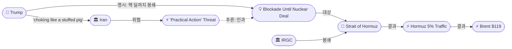
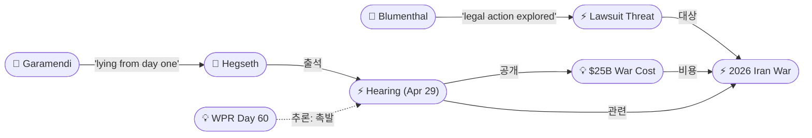
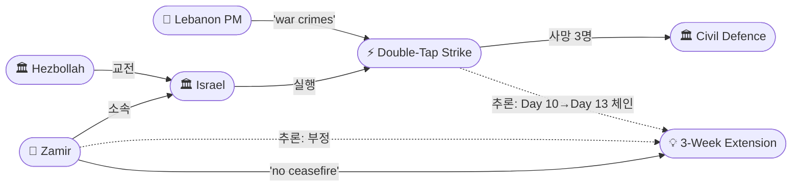
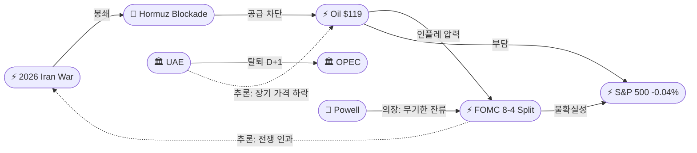

# 2026-04-29 2026 Iran War OSINT 일일 보고서

## 요약

Day 61. 트럼프가 Axios 인터뷰에서 "핵 딜까지 봉쇄를 유지하겠다"고 명시하며 봉쇄를 암시적 레버리지에서 공식 정책으로 전환했다. 이란은 즉각 "실질적이고 전례 없는 행동(practical and unprecedented action)"으로 대응하겠다고 위협하며 교착이 새로운 국면에 진입했다. 유가는 Brent $119.20(+7%)로 전쟁 이후 최고가를 기록했고, $120 돌파가 임박했다. 전쟁 개시 이후 첫 의회 청문회에서 헤그세스 국방장관이 $25B 전쟁 비용을 공개했으나 "승리 정의"를 거부하며 민주당과 충돌했다. Fed는 8-4(34년 만의 최대 분열)로 금리를 동결하면서 '글로벌 에너지 가격 인플레이션'을 공식 인정했다. IDF 참모총장 자미르가 "전투 전선에서 휴전은 없다"고 선언하고, 같은 날 구조대원 이중타격으로 8명이 사망하여 레바논 PM은 '전쟁 범죄'라 비난했다.

## 주요 뉴스

### 1. 트럼프, '핵 딜까지 봉쇄' 명시 — 이란 '실질 행동' 위협
- **출처:** [Al Jazeera](https://www.aljazeera.com/news/2026/4/29/trump-vows-to-maintain-iran-blockade-tehran-threaten-practical-action)
- **일시:** 2026-04-29
- **내용:** 트럼프가 Axios에 "blockade is somewhat more effective than the bombing"이라며 "they are choking like a stuffed pig"이라고 발언했다. 이란의 호르무즈 단독 개방 제안을 거부하고 핵 합의를 선행 조건으로 명시했다. 이에 이란의 익명 고위 안보 관계자가 Press TV를 통해 봉쇄에 대해 "practical and unprecedented action"으로 대응하겠다고 위협했다. 이는 기존 해상 조치(IRGC 선박 나포 4/22, Sanmar Herald 발포 4/18)를 넘어서는 에스컬레이션을 시사한다.
- **상태:** 신규
- **관련 엔티티:** Donald Trump, Iran, Strait of Hormuz, IRGC

### 2. 유가 Brent $119.20(+7%) — 전쟁 이후 최고가, $120 임박
- **출처:** [CNBC](https://www.cnbc.com/2026/04/29/oil-prices-brent-wti-trump-iran.html)
- **일시:** 2026-04-29
- **내용:** Brent 원유가 +7% 급등하여 $119.20에 달하며 2022년 6월 이후 최고가를 기록했다. WTI도 $104~$108 범위로 상승했다. 트럼프의 '핵 딜까지 봉쇄' 발언 직후 급등이 시작되었으며, 이란의 '실질 행동' 위협이 리스크 프리미엄을 가중시켰다. 전쟁 개시(2/28) 이후 Brent +66%. $120 돌파 시 글로벌 경기침체 시그널로 해석될 가능성이 높다.
- **상태:** 신규
- **관련 엔티티:** Strait of Hormuz, Iran, Donald Trump

### 3. 헤그세스 첫 의회 청문회 — $25B 비용 공개, "승리 정의 거부"
- **출처:** [Time](https://time.com/article/2026/04/29/in-hostile-hearing-democrats-accuse-hegseth-of-misleading-trump-and-country-on-iran-war-progress/)
- **일시:** 2026-04-29
- **내용:** 전쟁 개시 이후 첫 의회 청문회가 하원 군사위에서 열렸다. 헤그세스 국방장관과 케인 국방부 차관이 출석하여 $25B 전쟁 비용을 공개했다. 가라멘디 의원(민주, 캘리포니아)은 "Secretary Hegseth, you have been lying to the American public about this war from day one"이라 공격했고, 헤그세스는 민주당과 일부 공화당 의원을 "biggest adversary"라 불러 대립이 격화되었다. 승리 일정이나 정의를 제시하라는 요구를 거부했다.
- **상태:** 신규
- **관련 엔티티:** Pete Hegseth, Dan Caine, John Garamendi, 2026 Iran War

### 4. Fed 8-4 분열, 금리 동결 — 34년 만의 최대 반대, 전쟁 인플레 공식 인정
- **출처:** [CNBC](https://www.cnbc.com/2026/04/29/fed-interest-rate-decision-april-2026.html)
- **일시:** 2026-04-29
- **내용:** FOMC가 기준금리를 3.5%-3.75%로 동결했으나, 4명이 반대표를 던져 1992년 10월 이후 34년 만의 최대 분열을 기록했다. 3명은 완화 기조 삭제를, 1명(미란)은 25bp 인하를 주장했다. 성명은 "Inflation is elevated, in part reflecting recent increase in global energy prices"라고 전쟁→에너지→인플레 연쇄를 공식 인정했다. 파월 의장은 이사회에 무기한 잔류하겠다고 발표하며, 트럼프의 법적 공격이 "left me no choice"라고 밝혔다.
- **상태:** 신규
- **관련 엔티티:** Jerome Powell, Federal Reserve, 2026 Iran War

### 5. CNN: 호르무즈 해상교통 전쟁 전 대비 5% — 800척 고립
- **출처:** [CNN](https://www.cnn.com/2026/04/29/world/iran-war-gulf-hormuz-shipping-maps-intl-vis)
- **일시:** 2026-04-29
- **내용:** CNN 데이터 시각화에 따르면, 호르무즈 해협 통과 선박이 전쟁 전 대비 약 5% 수준으로 감소했다. 3월 전체 통과 선박은 154척으로, 전쟁 전 월 3,000척에서 급감했다. IMO 공식 항로는 거의 완전히 방기되었으며, IRGC는 이란 영해를 통한 대체 항로를 공개했다. 800척의 선박이 페르시아만에 고립된 상태다.
- **상태:** 신규
- **관련 엔티티:** Strait of Hormuz, IRGC

### 6. 레바논 Day 13: 이중타격 공습, 구조대원 3명 포함 8명 사망 — PM '전쟁 범죄'
- **출처:** [Euronews](https://www.euronews.com/2026/04/29/israeli-strikes-kill-eight-in-southern-lebanon-including-three-rescue-workers), [Al Jazeera](https://www.aljazeera.com/news/2026/4/29/lebanons-pm-slams-israels-war-crimes-as-attack-kills-3-rescue-workers)
- **일시:** 2026-04-29
- **내용:** 이스라엘군이 남부 레바논에서 이중타격(double-tap) 공습을 실시하여 8명이 사망했으며, 이 중 3명은 시민방위 구조대원이었다. 첫 공습 후 구조 작업 중 두 번째 공습이 이루어졌다. 레바논 PM은 이를 "war crimes"라 비난했다. Day 13 기준 누적 사상자: 2,534명 사망, 7,863명 부상. 구조대원을 의도적으로 표적 삼는 이중타격 전술은 전쟁법 위반 논란을 가중시킨다.
- **상태:** 신규
- **관련 엔티티:** Israel, Lebanon, Lebanese Civil Defence

### 7. IDF 참모총장 자미르: "전투 전선에서 휴전은 없다"
- **출처:** [Times of Israel](https://www.timesofisrael.com/idf-chief-says-theres-no-ceasefire-in-south-lebanon-amid-continued-fighting-with-hezbollah/)
- **일시:** 2026-04-29
- **내용:** IDF 참모총장 에얄 자미르 중장이 남부 레바논 방문 중 "On the combat front, there is no ceasefire; you continue to fight"라고 선언했다. 옐로 라인 너머와 리타니 강 북쪽까지 "자유로운 행동과 위협 제거"를 지시했다. 이는 4/23 합의된 3주 연장 휴전을 군 최고사령관 수준에서 공식 부정하는 것으로, 외교-군사 괴리가 극단에 달했음을 보여준다.
- **상태:** 신규
- **관련 엔티티:** Eyal Zamir, Israel, Hezbollah

### 8. 유가 $120을 향해 — Bloomberg "전쟁 끝이 안 보인다"
- **출처:** [Bloomberg](https://www.bloomberg.com/news/articles/2026-04-29/brent-oil-hits-highest-since-june-2022-on-us-iran-stalemate)
- **일시:** 2026-04-29
- **내용:** Bloomberg는 Brent $119.20이 2022년 6월 이후 최고가이며, 트럼프의 봉쇄 수사학과 이란의 '실질 행동' 위협이 리스크 프리미엄을 급등시켰다고 분석했다. $111→$119로 하루 만에 급등한 것은 봉쇄 정책의 공식화가 시장에 구조적 공급 제한의 장기화를 각인시킨 결과다.
- **상태:** 업데이트 ← 2026-04-28 Brent $111.26
- **관련 엔티티:** Strait of Hormuz, Iran

### 9. 민주당, WPR 60일 도달 — 트럼프 '불법 전쟁' 소송 검토
- **출처:** [Time](https://time.com/article/2026/04/28/exclusive-democrats-explore-suing-trump-if-congress-doesn-t-authorize-iran-war/)
- **일시:** 2026-04-29
- **내용:** 4월 29일로 WPR 60일이 도달했다. 다수 민주당 의원이 Time에 5월 1일 공식 데드라인 이후에도 전쟁이 지속되면 트럼프를 법원에 제소하겠다고 밝혔다. 블루먼솔 상원의원(민주, 코네티컷)은 "Legal action has to be explored"라고 발언했다. 행정부는 AUMF(2001) 또는 Article II 대통령 고유 권한을 원용할 것으로 예상되나, 의회와의 법적 대결은 전후 정치 지형을 재편할 수 있다.
- **상태:** 업데이트 ← 2026-04-28 WPR 3일
- **관련 엔티티:** Donald Trump, War Powers Resolution, Richard Blumenthal

### 10. UAE OPEC 탈퇴 후폭풍 — "OPEC 생존 가능" vs 가격 영향
- **출처:** [CNBC](https://www.cnbc.com/2026/04/29/shocking-uae-exit-rocks-opec-but-group-will-still-hold-significant-sway-over-the-oil-market.html), [CNN](https://www.cnn.com/2026/04/29/business/gas-prices-uae-opec-intl)
- **일시:** 2026-04-29
- **내용:** CNBC는 OPEC이 UAE 탈퇴에도 유의미한 시장 영향력을 유지할 것이나, 카르텔 결속력이 약화되어 가격 변동성이 확대될 수 있다고 분석했다. CNN은 UAE가 3.2M→5M bbl/day로 생산량을 확대하면 장기적으로 가격 하락 효과가 있으나, 단기적으로는 이란전 리스크 프리미엄이 상쇄한다고 보도했다. UAE는 사우디에 이어 두 번째로 큰 여유 생산 용량 보유국이다.
- **상태:** 업데이트 ← 2026-04-28 UAE OPEC 탈퇴
- **관련 엔티티:** UAE, OPEC, Saudi Arabia

### 11. S&P 500 -0.04% — 유가·Fed·빅테크 실적 교차
- **출처:** [Yahoo Finance](https://finance.yahoo.com/markets/stocks/live/stock-market-today-wednesday-april-29-dow-nasdaq-sp-futures-powell-mag7-231405065.html)
- **일시:** 2026-04-29
- **내용:** S&P 500이 -0.04%로 7,135.95에 마감했다. Nasdaq -0.5%. Dow는 250+ 포인트 하락했다. 유가 $119 급등, Fed 분열 결정, Mag 7(빅테크 7사) 실적 발표가 동시에 겹치며 시장이 방향을 잡지 못했다. 전일(4/28) -0.49%에 이어 연속 하락, 유가-주가 재커플링 구도가 강화되고 있다.
- **상태:** 업데이트 ← 2026-04-28 S&P 500 -0.49%
- **관련 엔티티:** S&P 500, Federal Reserve

## 지식그래프

### 오늘의 주요 관계
1. **봉쇄 정책 공식화**: 트럼프의 '핵 딜까지 봉쇄'는 기존 암시적 레버리지에서 명시적 정책 선언으로 전환. 이란의 '실질 행동' 위협은 같은 뉴스 사이클 내 직접 인과 관계.
2. **의회-행정부 삼중 압박**: 헤그세스 청문회 + WPR Day 60 도달 + 소송 위협 = $25B 비용 공개가 정치적 취약점을 노출.
3. **전쟁→경제 공식 경로**: FOMC가 '글로벌 에너지 가격'을 인플레이션 원인으로 명시 인용. 전쟁→봉쇄→유가→인플레→Fed 분열의 직접 인과 체인.
4. **레바논 이중 현실**: IDF 참모총장 '휴전 없다' + 구조대원 이중타격 = 외교적 합의와 군사적 현실의 완전한 괴리.

### 봉쇄 에스컬레이션 & 호르무즈

### 의회 vs 행정부

### 레바논 이중 현실

### 전쟁 → 경제 연쇄

## 온톨로지 변경

| 변경 유형 | 대상 | 근거 |
|----------|------|------|
| 새 엔티티 | ent-223: Eyal Zamir | IDF 참모총장, '휴전 없다' 선언 |
| 새 엔티티 | ent-224: Hegseth Congressional Hearing | 전쟁 이후 첫 의회 청문회, $25B 공개 |
| 새 엔티티 | ent-225: FOMC April 2026 Decision | 34년 만의 8-4 분열, 전쟁 인플레 공식 인정 |
| 새 엔티티 | ent-226: Iran Practical Action Threat | '실질적 전례 없는 행동' 위협 |
| 새 엔티티 | ent-227: Lebanon Double-Tap Strike (Apr 29) | 구조대원 3명 포함 8명 사망, '전쟁 범죄' |
| 새 엔티티 | ent-228: Jerome Powell | Fed 의장, 무기한 잔류 선언 |
| 새 엔티티 | ent-229: John Garamendi | 하원의원(D-CA), 헤그세스 '거짓말' 공격 |
| 스키마 변경 | 없음 | 기존 클래스/관계 유형으로 충분히 표현 |

## 추론 결과

| 추론 | 신뢰도 | 근거 |
|------|--------|------|
| Hegseth Hearing ← causedBy ← WPR Day 60 | 0.82 | WPR 60일 도달 → 민주당 책임 추궁 → 첫 전쟁 청문회 개최. WPR 데드라인이 의회 감시의 직접 촉발 요인. |
| Iran Practical Action ← follows ← Trump Blockade Vow | 0.78 | 트럼프 '핵 딜까지 봉쇄' → 이란 '실질 행동' 위협. 같은 뉴스 사이클 내 직접 인과. '전례 없는'이라는 수식어는 기존 해상 조치 초과를 시사. |
| FOMC 8-4 Split ← causedBy ← Iran War (via energy) | 0.75 | 이란 전쟁 → 에너지 가격 급등 → FOMC '글로벌 에너지 가격 인플레' 인용 → 34년 만의 최대 분열. 전쟁의 미국 통화정책 구조적 영향 공식화. |
| Zamir 'no ceasefire' ← opposes ← 3-Week Extension | 0.78 | IDF 최고사령관의 공식 휴전 부정은 4/23 3주 연장 합의와 직접 모순. 군사-외교 괴리 극단. |
| Day 13 Double-Tap ← causalChain ← 3-Week Extension | 0.80 | 3주 연장(4/23) → Day 8(8명) → Day 10(14명+) → Day 13(8명, 구조대원 이중타격). 사상자 에스컬레이션 체인. |

## 분석 및 평가

### 봉쇄 정책의 공식화: 교착에서 교착까지

트럼프의 '핵 딜까지 봉쇄'는 기존에 암시적으로 작동하던 봉쇄 레버리지를 공식 정책으로 선언한 전환점이다. "choking like a stuffed pig"이라는 수사는 봉쇄의 효과에 대한 확신을 드러내지만, 동시에 이란의 '실질 행동' 위협을 촉발했다. 핵심 질문은 이란의 '전례 없는 행동'이 무엇인지다:

1. **해상 에스컬레이션**: IRGC의 선박 나포(4/22)와 Sanmar Herald 발포(4/18)를 넘어서는 행동 — 미 해군 함정에 대한 직접 도발, 추가 기뢰 부설, 또는 걸프국 항만 공격 가능성.
2. **비대칭 수단**: 이란이 언급한 '전례 없는'은 해상이 아닌 사이버, 프록시(이라크/예멘 민병대), 또는 제3국 대사관/인프라 타격일 수 있다.
3. **수사적 허세**: 국내 강경파를 위한 포지셔닝으로, 실질적 행동은 제한적일 가능성.

### 의회-행정부 충돌의 삼중 구조

오늘 세 가지가 동시에 발생하여 행정부에 대한 압박이 구조적으로 강화되었다:

1. **청문회**: $25B 비용이 처음으로 공식 공개되어 '비용 없는 전쟁' 프레이밍이 불가능해졌다. 헤그세스의 '승리 정의 거부'는 정치적으로 지속 불가능한 포지션.
2. **WPR Day 60**: 법적 데드라인 도달. 5월 1일까지 의회 승인이 없으면 '불법 전쟁' 프레이밍이 법적 실체를 갖게 된다.
3. **소송 위협**: 블루먼솔 등 민주당 의원의 소송 검토는 사법부를 전쟁의 세 번째 전선으로 만들 수 있다.

행정부는 AUMF(2001) 또는 Article II를 원용할 것으로 예상되나, 이전 대통령들과 달리 의회 일부가 법적 도전을 실행에 옮길 경우 전례 없는 헌법적 위기가 될 수 있다.

### Fed 분열: 전쟁이 만든 통화정책 교착

FOMC의 8-4 분열은 단순한 정책 이견이 아니라 전쟁의 경제적 충격이 미국 국내 정책에 구조적으로 침투한 증거다:
- 성명의 '글로벌 에너지 가격' 인용은 이란 전쟁→호르무즈 봉쇄→유가 $119→미국 인플레이션이라는 인과 체인의 공식 인정.
- 34년 만의 최대 분열은 전쟁의 불확실성이 통화정책 합의를 불가능하게 만들고 있음을 의미.
- 파월의 '무기한 잔류'와 트럼프의 법적 공격은 Fed 독립성이라는 또 다른 제도적 전선을 형성.

### 레바논: 휴전의 공식 사망

자미르의 '휴전 없다'는 군 최고사령관이 외교적 합의를 공식 부정한 것으로, 이전의 현장 수준 위반(Day 8, Day 10)과는 질적으로 다르다. 구조대원 이중타격은 이 전략의 실행이다. 3주 연장(4/23) → Day 8(8명) → Day 10(14명+) → Day 13(8명, 구조대원)의 에스컬레이션 체인에서 사상자 수는 소폭 감소했으나, 구조대원 의도적 표적이라는 전술적 에스컬레이션이 발생했다. 사상자 총계 2,534명/7,863명은 휴전이 민간인 보호에도 실패하고 있음을 확인한다.

### 핵심 판단
- **미-이란 교착**: 봉쇄 정책 공식화 + 이란 '실질 행동' 위협 = 에스컬레이션 리스크 상승. '전례 없는' 행동의 정체가 향후 72시간의 핵심 변수.
- **유가**: $119 = 전쟁 이후 최고가. $120 돌파 시 글로벌 경기침체 시그널. 봉쇄 장기화 공식 선언이 구조적 상승 기반.
- **의회**: 청문회 + WPR + 소송 = 삼중 압박. 5월 1일이 첫 번째 시험대.
- **Fed**: 34년 만의 분열 = 전쟁이 통화정책을 교착시키는 새로운 국면. 경제적 비용이 가시화.
- **레바논**: Day 13, 참모총장 수준 휴전 부정. 5월 14일 만료 전 본격 충돌 재개 예상.
- **걸프**: UAE OPEC 탈퇴 D+1, 장기적 가격 영향 분석 시작. 카르텔 결속력 약화.

## 추적 항목

| 항목 | 최초 보고 | 상태 | 최신 업데이트 |
|------|----------|------|-------------|
| 호르무즈 봉쇄 | 2026-04-13 | [추적] **$119, 정책 공식화** | Trump '핵 딜까지 봉쇄' + 이란 '실질 행동' 위협, 5% 트래픽 |
| 이란 '실질 행동' 위협 | 2026-04-29 | **신규** | '전례 없는 행동' — 해상 에스컬레이션 vs 비대칭 수단 미확인 |
| WPR 5월 1일 데드라인 | 2026-04-24 | [추적] **Day 60 도달, 2일** | 소송 위협 구체화, 헤그세스 청문회 연동 |
| 헤그세스 청문회 | 2026-04-29 | **신규** | $25B 공개, '승리 정의 거부', 정치적 여파 추적 필요 |
| 레바논 3주 연장 | 2026-04-23 | [추적] **사실상 무효화** | Day 13: 참모총장 '휴전 없다', 구조대원 이중타격 |
| UAE OPEC 탈퇴 | 2026-04-28 | [추적] **후속 분석** | OPEC 생존 전망, 가격 영향, D+1 |
| 이란 호르무즈 제안 | 2026-04-27 | [추적] **교착** | 트럼프 공식 거부('핵 딜 선행'), 교착 심화 |
| Fed 분열 | 2026-04-29 | **신규** | 8-4 분열, 전쟁 인플레 공식 인정, 파월 잔류 |
| 아라그치 셔틀 외교 | 2026-04-25 | [추적] **모스크바 이후 미정** | 다음 행선지 미확인 |
| 이란 내부 분열 | 2026-04-19 | [추적] **외교파 vs 군부** | '실질 행동' 위협 = 군부/IRGC 노선 강화 |
| 유럽 독자 노선 | 2026-04-27 | [추적] **확대** | 메르츠 비판 + 스타머 이니셔티브 |
| 러시아 개입 | 2026-04-07 | [추적] **GRU 참석 이후** | 모르다쇼프 통과 D+1, 다음 행보 |

## 동향 요약

| 분류 | 상태 | 비고 |
|------|------|------|
| 미-이란 교착 | **에스컬레이션 위험 상승** | 봉쇄 공식화 + '실질 행동' 위협 |
| 이란 제안 | 교착(미국 거부) | 트럼프: 핵 딜 선행 조건 |
| 걸프 동맹 | 균열 D+1 | UAE OPEC 탈퇴 후속 분석 |
| 레바논 휴전 | **공식 부정(참모총장)** | Day 13: '휴전 없다' + 구조대원 이중타격 |
| 호르무즈 해협 | 봉쇄 강화(5% 트래픽) | 800척 고립, $120 임박 |
| 유가 | **Brent $119.20 (+7%)** | 전쟁 이후 최고가, 2022/6 이후 최고 |
| 주식 | S&P 500 -0.04% (7,135.95) | 유가+Fed+빅테크 교차, 연속 하락 |
| Fed | **8-4 역사적 분열** | 전쟁 인플레 공식 인정, 파월 잔류 |
| 의회 | **삼중 압박** | 청문회 + WPR Day 60 + 소송 |
| 이란 내부 | 군부 강화 | '실질 행동' = IRGC 노선 |
| WPR | **2일 남음** | 5/1 데드라인, 법적 대결 임박 |

## 출처 목록
1. [Trump vows to maintain Iran blockade, Tehran threatens 'practical' action](https://www.aljazeera.com/news/2026/4/29/trump-vows-to-maintain-iran-blockade-tehran-threaten-practical-action) - Al Jazeera, 2026-04-29
2. [Iran war live: Trump threatens Iran to 'get smart soon'](https://www.aljazeera.com/news/liveblog/2026/4/29/iran-war-live-trump-says-tehran-wants-end-to-blockade-israel-kills-medics) - Al Jazeera, 2026-04-29
3. [Iran war live updates: Trump says Iran just has to 'cry uncle'](https://abc7.com/live-updates/iran-war-today-trump-straight-of-hormuz-us-ceasefire-talks/18979096/) - ABC7, 2026-04-29
4. [Brent oil tops $118 after Trump says he will blockade Iran until nuclear deal](https://www.cnbc.com/2026/04/29/oil-prices-brent-wti-trump-iran.html) - CNBC, 2026-04-29
5. [Brent edges closer to $120 amid US-Iran standoff](https://www.thenationalnews.com/business/energy/2026/04/29/brent-edges-closer-to-120-amid-us-iran-standoff/) - The National, 2026-04-29
6. [Oil Charges Toward $120 With No End in Sight to US-Iran War](https://www.bloomberg.com/news/articles/2026-04-29/brent-oil-hits-highest-since-june-2022-on-us-iran-stalemate) - Bloomberg, 2026-04-29
7. [In Hostile Hearing, Democrats Accuse Hegseth of Misleading Public on Iran War Progress](https://time.com/article/2026/04/29/in-hostile-hearing-democrats-accuse-hegseth-of-misleading-trump-and-country-on-iran-war-progress/) - Time, 2026-04-29
8. [Hegseth calls congressional Democrats 'biggest adversary' in Iran war](https://www.pbs.org/newshour/politics/watch-hegseth-calls-congressional-democrats-some-republicans-biggest-adversary-in-iran-war) - PBS, 2026-04-29
9. ['A strategic blunder': Democrats confront Hegseth as Iran war's price tag hits $25 billion](https://fortune.com/2026/04/29/congress-democrats-confront-pete-hegseth-iran-war-25-billion/) - Fortune, 2026-04-29
10. [Hegseth defends Iran war's mission, costs in first testimony](https://www.cnbc.com/2026/04/29/iran-war-hegseth-caine-house-congress.html) - CNBC, 2026-04-29
11. [Lawmakers question Hegseth's Pentagon firings, leadership of Iran war](https://www.washingtonpost.com/national-security/2026/04/29/hegseth-house-hearing-iran-live-updates/) - Washington Post, 2026-04-29
12. [Skeptical Democrats confront Hegseth about Iran war](https://www.kbtx.com/2026/04/29/hegseth-will-be-grilled-by-congress-first-time-since-iran-war-began/) - KBTX, 2026-04-29
13. [Hegseth House testimony live updates](https://www.ms.now/liveblog/hegseth-congress-hearing-iran-war-news-april-29-2026) - MS Now, 2026-04-29
14. [Fed interest rate decision April 2026: holds rates steady amid historic dissent](https://www.cnbc.com/2026/04/29/fed-interest-rate-decision-april-2026.html) - CNBC, 2026-04-29
15. [Fed Holds Rates, Three Officials Dissent Against Easing Bias](https://www.bloomberg.com/news/articles/2026-04-29/fed-holds-rates-three-officials-dissent-against-easing-bias) - Bloomberg, 2026-04-29
16. [Fed holds rates steady as Powell's chairmanship winds down](https://www.foxbusiness.com/economy/federal-reserve-interest-rate-decision-april-29-2026) - Fox Business, 2026-04-29
17. [Fed meeting recap: Powell to stay on board](https://www.cnbc.com/2026/04/29/fed-meeting-today-live-updates-warsh-powell.html) - CNBC, 2026-04-29
18. [Visualizing shipping through the Strait of Hormuz since war began](https://www.cnn.com/2026/04/29/world/iran-war-gulf-hormuz-shipping-maps-intl-vis) - CNN, 2026-04-29
19. [Israeli strikes kill eight in southern Lebanon, including three rescue workers](https://www.euronews.com/2026/04/29/israeli-strikes-kill-eight-in-southern-lebanon-including-three-rescue-workers) - Euronews, 2026-04-29
20. [Israeli double-tap strike kills three Lebanese civil defence rescuers](https://www.thenationalnews.com/news/mena/2026/04/29/israeli-double-tap-strike-kills-three-lebanese-civil-defence-rescuers/) - The National, 2026-04-29
21. [As more health workers are killed in Lebanon](https://www.nbcnews.com/world/middle-east/lebanon-paramedics-israel-killed-health-workers-rcna332138) - NBC News, 2026-04-29
22. [IDF chief says there's 'no ceasefire' in south Lebanon](https://www.timesofisrael.com/idf-chief-says-theres-no-ceasefire-in-south-lebanon-amid-continued-fighting-with-hezbollah/) - Times of Israel, 2026-04-29
23. [IDF Chief of Staff: No Ceasefire in Southern Lebanon](https://vinnews.com/2026/04/29/idf-chief-of-staff-no-ceasefire-in-southern-lebanon-as-troops-press-fight-against-hezbollah/) - VIN News, 2026-04-29
24. [Lebanon's PM slams Israel's 'war crimes' as attack kills 3 rescue workers](https://www.aljazeera.com/news/2026/4/29/lebanons-pm-slams-israels-war-crimes-as-attack-kills-3-rescue-workers) - Al Jazeera, 2026-04-29
25. [Democrats May Sue Trump Over 'Illegal' Iran War](https://time.com/article/2026/04/28/exclusive-democrats-explore-suing-trump-if-congress-doesn-t-authorize-iran-war/) - Time, 2026-04-29
26. [Shocking UAE exit rocks OPEC, but group will still hold sway](https://www.cnbc.com/2026/04/29/shocking-uae-exit-rocks-opec-but-group-will-still-hold-significant-sway-over-the-oil-market.html) - CNBC, 2026-04-29
27. [What UAE's OPEC departure means for gas prices](https://www.cnn.com/2026/04/29/business/gas-prices-uae-opec-intl) - CNN, 2026-04-29
28. [Stock market today: Dow, S&P 500 slip as oil surges](https://finance.yahoo.com/markets/stocks/live/stock-market-today-wednesday-april-29-dow-nasdaq-sp-futures-powell-mag7-231405065.html) - Yahoo Finance, 2026-04-29
29. [Asian Stocks Gain and Oil Prices Decline After UAE OPEC Exit](https://www.usnews.com/news/us/articles/2026-04-29/asian-stocks-gain-and-oil-prices-decline-after-the-uae-says-it-will-exit-opec) - US News, 2026-04-29
30. [이란전 비용 첫 공개…트럼프 발목 잡는 '37조원 전쟁'](https://www.fnnews.com/news/202604300059093139) - 파이낸셜뉴스, 2026-04-29
31. [Oil prices rise despite UAE exit from OPEC](https://www.euronews.com/business/2026/04/29/oil-prices-rise-despite-uae-exit-from-opec-as-iran-war-ceasefire-hangs-in-balance) - Euronews, 2026-04-29
