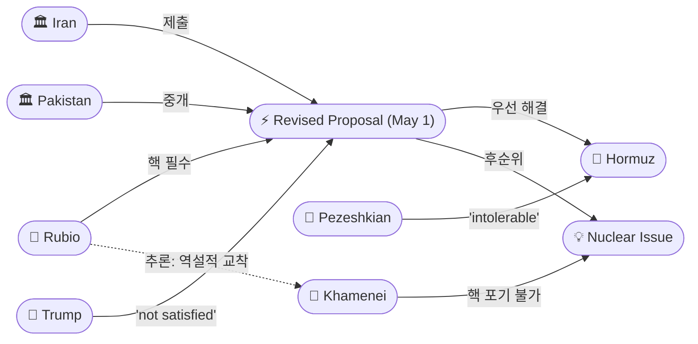
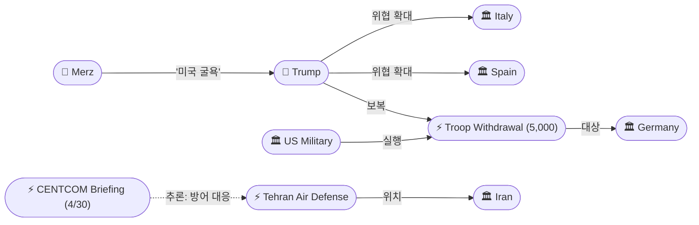
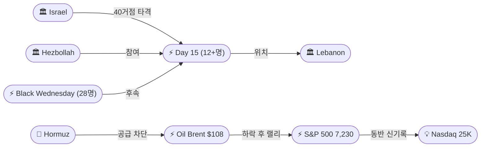

# 2026-05-01 2026 Iran War OSINT 일일 보고서

## 요약

Day 63. WPR 60일 데드라인 당일, 트럼프가 의회에 "적대행위가 종료되었다(The hostilities that began on February 28, 2026, have terminated)"는 서한을 보내 전쟁의 법적 프레이밍을 일거에 전환했다. 4월 7일 이후 교전이 없었다는 것이 근거이나, 해상 봉쇄는 지속 중이다. 같은 날 이란이 파키스탄을 통해 수정 제안서(호르무즈 우선 개방, 핵 후순위)를 제출했으나 트럼프는 "not satisfied", 루비오 국무장관은 핵 미포함 불가를 선언했다. 한편 트럼프는 플로리다에서 전쟁에서 이기고 있지 않다고 말하는 것은 "treasonous"라고 발언하여, '전쟁 종료'와 '전쟁 승리 중' 주장이 동시에 나오는 모순을 드러냈다. 테헤란에서는 방공망이 20분간 가동되었고, 펜타곤은 독일 주둔 5,000명 철수를 확정하면서 이탈리아·스페인으로 위협을 확대했다. 레바논은 Day 15에 12명 이상이 사망했다. 유가는 Brent $108, WTI $102로 하락했고, S&P 500(7,230)과 Nasdaq(25,114)이 연속 사상 최고가를 기록했다.

## 주요 뉴스

### 1. 트럼프, 의회에 "적대행위 종료" 서한 — WPR 60일 시한 회피
- **출처:** [CNBC](https://www.cnbc.com/2026/05/01/trump-rejects-iran-peace-deal.html)
- **일시:** 2026-05-01
- **내용:** 트럼프 대통령이 존슨 하원의장과 그래슬리 상원의장에게 "The hostilities that began on February 28, 2026, have terminated. There has been no exchange of fire between United States Forces and Iran since April 7, 2026"라는 공식 서한을 발송했다. WPR 60일 데드라인(5/1) 당일에 적대행위 자체가 종료되었다고 선언하여 의회 승인 필요성을 원천 무력화하려는 전략이다. 블루먼솔 상원의원(D-CT)은 "The blockade alone is a continuing act of war"라고 즉각 반박했다. 의회는 목요일 WPR 6차 부결 후 1주 휴회에 들어가 법적 공백을 남겼다.
- **상태:** 신규
- **관련 엔티티:** Donald Trump, Mike Johnson, Chuck Grassley, Richard Blumenthal, War Powers Resolution

### 2. 이란 수정 제안서 제출 — 트럼프·루비오 즉각 거부
- **출처:** [Anadolu Agency](https://www.aa.com.tr/en/us-israel-iran-war/iran-submits-new-proposal-to-pakistan-to-resume-us-talks-on-ending-war/3924361)
- **일시:** 2026-05-01
- **내용:** 이란이 파키스탄을 통해 미국에 수정 제안서를 전달했다. 핵심 내용은 호르무즈 해협 양측 봉쇄를 먼저 해제하고 핵 협상은 후속 단계로 미루자는 것이다. 그러나 트럼프는 제안서를 받자마자 "I'm not satisfied with it"이라 밝혔고, 루비오 국무장관은 핵 프로그램을 포함하지 않는 어떤 합의도 불가하다고 선언했다. 동시에 모즈타바 하메네이 최고지도자는 "핵과 미사일 능력을 포기하지 않겠다"고 선언하여, 미국과 이란 양측 모두 핵 문제를 양보 불가 입장으로 설정한 구조적 교착이 확인되었다.
- **상태:** 신규
- **관련 엔티티:** Iran, Pakistan, Donald Trump, Marco Rubio, Mojtaba Khamenei

### 3. 트럼프: 전쟁 승리 부정은 "반역" — '종료'와 '승리' 모순
- **출처:** [CNN](https://www.cnn.com/2026/05/01/world/live-news/iran-war-news)
- **일시:** 2026-05-01
- **내용:** 트럼프 대통령이 플로리다 더빌리지에서 미국이 이란 전쟁에서 이기고 있지 않다고 말하는 것은 "treasonous"라고 발언했다. 같은 날 의회에는 '적대행위가 종료되었다'고 서한을 보낸 것과 직접 모순된다. '종료된' 전쟁이 동시에 '승리 중'인 전쟁이라는 이중 내러티브가 공존하는 상황이다. 트럼프는 또한 전쟁을 "might need" to restart할 수 있다고 시사했다.
- **상태:** 신규
- **관련 엔티티:** Donald Trump, Iran

### 4. 독일 주둔 5,000명 철수 확정 — 이탈리아·스페인 위협 확대
- **출처:** [Al Jazeera](https://www.aljazeera.com/news/2026/5/1/us-said-to-be-withdrawing-5000-troops-from-germany-over-iran-war-spat)
- **일시:** 2026-05-01
- **내용:** 펜타곤이 독일 주둔 미군 5,000명을 6-12개월에 걸쳐 철수한다고 공식 확인했다. 메르츠 독일 총리가 미국이 이란에 "굴욕당하고 있다(humiliated)"며 "설득력 있는 전략이 없다"고 비판한 데 대한 보복이다. 트럼프는 이를 넘어 이탈리아와 스페인 주둔군도 철수하겠다고 위협했다. 이란 전쟁에 대한 유럽 동맹국들의 비판이 대서양 동맹의 구조적 균열로 확대되고 있다.
- **상태:** 신규
- **관련 엔티티:** Donald Trump, Friedrich Merz, US Military, Germany

### 5. 테헤란 방공망 20분 가동 — 휴전 속 군사적 긴장
- **출처:** [Arab News](https://www.arabnews.com/node/2641949/middle-east)
- **일시:** 2026-05-01
- **내용:** 목요일 밤 테헤란에서 방공 시스템이 약 20분간 가동되어 소형 항공기와 정찰 드론에 대응했다. 상황은 "정상으로 복귀"했다고 발표되었다. WPR 데드라인 당일이자 CENTCOM 군사옵션 브리핑 직후라는 타이밍이 주목된다. 휴전에도 불구하고 양측의 군사적 경계가 고조되어 있음을 보여준다.
- **상태:** 신규
- **관련 엔티티:** Iran, Tehran, CENTCOM

### 6. 페제시키안: 봉쇄는 "참을 수 없는 군사작전 연장"
- **출처:** [PingTV India](https://pingtvindia.com/tehran-slams-intolerable-us-naval-blockade-as-trump-signals-prolonged-siege/)
- **일시:** 2026-05-01
- **내용:** 페제시키안 이란 대통령이 미국의 항구 봉쇄를 "군사 작전의 연장(extension of military operations)"으로 규정하고 "이 억압적 접근의 지속은 참을 수 없다(intolerable)"고 선언했다. 트럼프가 석유업계 임원들에게 장기 봉쇄에 대비하라고 지시한 것으로 보도된 가운데, 이란은 봉쇄를 미국의 '적대행위 종료' 주장에 대한 직접적 반박 논거로 사용하고 있다. 이란은 또한 미국의 행동을 "해적 행위(maritime piracy)"라고 불렀다.
- **상태:** 신규
- **관련 엔티티:** Masoud Pezeshkian, Iran, US Military, Strait of Hormuz

### 7. 레바논 Day 15: 12명 이상 사망, 휴전 속 공격 지속
- **출처:** [Al Jazeera](https://www.aljazeera.com/news/2026/5/1/at-least-12-killed-in-latest-israeli-attacks-on-lebanon)
- **일시:** 2026-05-01
- **내용:** 레바논 남부에서 이스라엘의 공격으로 어린이를 포함해 최소 12명이 사망했다. IDF는 지난 24시간 동안 헤즈볼라 관련 40개 거점을 타격했다고 밝혔다. 전날 '검은 수요일'(28명 사망) 후 공격 규모는 줄었으나 사망자가 계속 발생하고 있다. 누적: 3월 2일 이후 2,618명 사망, 8,094명 부상. 휴전 기간 중 총 40명 이상 사망. 휴전 연장(5/17까지)이 점점 의미를 잃고 있다.
- **상태:** 신규
- **관련 엔티티:** Israel, Hezbollah, Lebanon

### 8. 유가 하락 — Brent $108, WTI $102: 이란 제안서 반응
- **출처:** [CNBC](https://www.cnbc.com/2026/05/01/oil-prices-today-brent-wti-us-iran-war-trump-war-powers-deadline.html)
- **일시:** 2026-05-01
- **내용:** Brent가 ~2% 하락하여 $108.17에 마감, WTI는 3% 하락하여 $101.94에 마감했다. 전일 $126.41 피크에서 급격히 조정된 것이다. 이란의 수정 제안서 제출이 하락 요인으로 작용했다. 오전 중 Brent $116.10까지 올랐다가 제안서 소식과 '종료 선언'에 하락. 호르무즈 운항량은 전쟁 전 대비 5% 수준. 이란 원유 수출은 전쟁 전 2.1M bpd에서 567K bpd로 73% 감소 상태 유지.
- **상태:** 신규
- **관련 엔티티:** Strait of Hormuz, Iran, Donald Trump

### 9. S&P 500 7,230, Nasdaq 25K 최초 돌파 — 연속 신기록
- **출처:** [TheStreet](https://www.thestreet.com/latest-news/stock-market-today-may-1-2026-updates)
- **일시:** 2026-05-01
- **내용:** S&P 500이 +0.29%로 7,230.12에 마감, Nasdaq은 +0.89%로 25,114.44를 기록하며 사상 최초로 25,000선을 돌파했다. 다우는 -0.31%로 49,499. Apple이 +3%(실적 호조)로 Nasdaq 랠리를 주도했고, Five9이 +30% 급등했다. 유가 하락이 오후 랠리에 기여. 전쟁 리스크에도 불구하고 테크 실적이 시장을 견인하는 디커플링 심화.
- **상태:** 신규
- **관련 엔티티:** S&P 500, Nasdaq

### 10. WPR 법적 분석: 휴전이 시계를 리셋하는가?
- **출처:** [Al Jazeera](https://www.aljazeera.com/news/2026/5/1/has-the-us-iran-ceasefire-reset-the-clock-on-war-powers-act-deadline)
- **일시:** 2026-05-01
- **내용:** 대부분의 법학자들은 WPR에 휴전으로 인한 시계 정지 조항이 없다고 해석한다. 헤그세스의 '시계 정지' 주장과 트럼프의 '종료 선언'은 법적 근거가 취약하다는 평가가 지배적이다. 그러나 의회가 휴회에 들어가고 WPR을 6차례 부결시킨 상황에서, 법적 도전은 법원을 통해야 할 가능성이 높다.
- **상태:** 업데이트 ← 2026-04-30 헤그세스 청문회
- **관련 엔티티:** War Powers Resolution, Donald Trump

### 11. Day 63 종합: 트럼프 '공격 재개 필요', 민간인 1,701명 사망
- **출처:** [Al Jazeera](https://www.aljazeera.com/news/2026/5/1/iran-war-whats-happening-on-day-63-as-trump-signals-possible-attacks)
- **일시:** 2026-05-01
- **내용:** 미국 기반 HRAI 통신은 전쟁으로 최소 1,701명의 이란 민간인이 사망했다고 보고했다(어린이 254명 포함). 트럼프는 전쟁을 "might need" to restart할 수 있다고 시사했고, 페제시키안은 봉쇄가 "참을 수 없다"고 응수했다. 호르무즈 운항량은 전쟁 전 대비 5%로 유지. 트럼프는 이란 전쟁 반대 발언을 한 이탈리아·스페인에서도 주둔군 철수를 검토한다고 밝혔다.
- **상태:** 업데이트 ← 2026-04-30 CENTCOM 브리핑
- **관련 엔티티:** Donald Trump, Iran, Masoud Pezeshkian

### 12. 레바논 '휴전'의 이상한 사례 — 구조적 분석
- **출처:** [RealClearWorld](https://www.realclearworld.com/articles/2026/05/01/the_strange_case_of_lebanons_ceasefire_1180185.html)
- **일시:** 2026-05-01
- **내용:** RealClearWorld 분석은 레바논의 '휴전'이 사실상 전쟁의 지속이라고 평가했다. IDF가 유지하는 10km 안전구역에는 주민과 기자 접근이 불가하고, 휴전 기간 중 40명 이상이 사망했다. 5/17 만료까지 의미 있는 휴전 회복은 불가능하다는 전망이다.
- **상태:** 신규
- **관련 엔티티:** Israel, Lebanon, Hezbollah

## 지식그래프

### 오늘의 주요 관계
1. **'적대행위 종료' 독트린**: 트럼프의 서한은 전일 '삼중 방어선'(시계 정지 + 전쟁 부정 + 상원 부결)에 더해 4번째 법적 전략이다. WPR 부결 실패(간격 축소)에 대한 보험.
2. **핵 교착의 구조화**: 루비오 '핵 필수' vs 하메네이 '핵 포기 불가' — 이란 제안서의 '핵 후순위' 접근이 양측 모두에 거부당하며 협상의 핵심 장벽이 확인.
3. **동맹 보복 체인**: 메르츠 비판(4/27) → 독일 5,000명 철수(5/1) → 이탈리아·스페인 위협(5/1) — 이란 전쟁 비판이 동맹 균열의 도미노로 전개.
4. **'종료된 전쟁'의 역설**: 봉쇄 지속 + '반역' 발언 + '재개 필요' 시사 + 테헤란 방공 가동 = '종료된' 전쟁이 사실상 계속 중.

### WPR '적대행위 종료' 선언 & 법적 대립

```mermaid
graph LR
    T(["👤 Trump"])
    MJ(["👤 Johnson"])
    CG(["👤 Grassley"])
    BL(["👤 Blumenthal"])
    CL(["👤 Collins"])
    LTR(["⚡ Terminated Letter"])
    WPR(["💡 War Powers Resolution"])
    VT6(["⚡ WPR Vote 6 (50-47)"])
    DTR(["💡 Terminated Doctrine"])
    BLK(["📍 Hormuz Blockade"])

    T -->|서한 발송| LTR
    LTR -->|수신| MJ
    LTR -->|수신| CG
    LTR -->|관련| WPR
    LTR -->|신규 이론| DTR
    BL -->|"'봉쇄=전쟁행위'"| LTR
    CL -->|이탈 (4/30)| VT6
    VT6 -.->|추론: 부결 후 대안| LTR
    BLK -->|"'종료' 모순"| LTR
    T -->|"'treasonous'"| T
```

### 이란 제안서 교착 & 핵 장벽



### 동맹 균열 & 군사 긴장



### 레바논 & 경제



## 온톨로지 변경

| 변경 유형 | 대상 | 근거 |
|----------|------|------|
| 새 엔티티 | ent-240: Hostilities Terminated Letter (May 1) | WPR 60일 시한 회피 서한 |
| 새 엔티티 | ent-241: Iran Revised Proposal (May 1) | 호르무즈 우선·핵 후순위 수정안, 트럼프·루비오 거부 |
| 새 엔티티 | ent-242: Tehran Air Defense Activation | 방공 20분 가동, CENTCOM 브리핑 후 |
| 새 엔티티 | ent-243: US Troop Withdrawal Germany (5,000) | 독일 5,000명 6-12개월 철수, 이탈리아·스페인 위협 |
| 새 엔티티 | ent-244: Richard Blumenthal | 상원의원(D-CT), '봉쇄=전쟁행위' |
| 새 엔티티 | ent-245: Chuck Grassley | 상원의장, '종료' 서한 수신 |
| 새 엔티티 | ent-246: Lebanon Day 15 (May 1) | 12+명 사망, IDF 40거점, 누적 2,618명 |
| 새 엔티티 | ent-247: Dark Eagle Hypersonic Missile | 펜타곤 이란 배치 검토 극초음속 미사일 |
| 새 엔티티 | ent-248: Hostilities Terminated Doctrine | 적대행위 종료 선언으로 WPR 리셋 — 법적 선례 없음 |
| 스키마 변경 | 없음 | 기존 클래스/관계 유형으로 충분히 표현 |

## 추론 결과

| 추론 | 신뢰도 | 근거 |
|------|--------|------|
| Terminated Letter ← causedBy ← WPR Vote 6 | 0.85 | WPR 6차 부결(50-47) 실패 후 다음 날 '종료 선언'으로 전환. 부결 간격 축소(55:45→50:47)에 대한 보험 성격의 새 법적 전략. |
| Tehran Air Defense ← causedBy ← CENTCOM Briefing | 0.75 | CENTCOM 3가지 군사옵션 브리핑(4/30) 다음 날 테헤란 방공 가동. 이란이 미국의 군사행동 준비에 방어적으로 대응한 것으로 추론. |
| Troop Withdrawal ← causedBy ← Trump (via Merz) | 0.80 | 메르츠 '굴욕' 비판(4/27) → 5,000명 철수 확정(5/1). 이란 전쟁 비판이 동맹 보복 체인으로 전환. |
| Terminated Letter ← opposes ← Blumenthal | 0.80 | '종료' vs '봉쇄=전쟁행위' — 동일 법적 사안 정면 대립. 법원 소송의 단초. |
| Rubio ← potentialRelation ← Khamenei | 0.72 | 루비오 '핵 필수' + 하메네이 '핵 포기 불가' = 양측 모두 핵을 양보 불가 입장으로 설정. 협상의 구조적 교착. |

## 분석 및 평가

### '적대행위 종료' 독트린: 전쟁의 법적 재정의

트럼프의 5/1 서한은 전쟁의 법적 프레이밍을 근본적으로 전환하려는 시도다. 전일까지의 전략은 세 갈래였다:

1. **헤그세스**: "시계가 정지된다" (법적 일시정지)
2. **존슨**: "전쟁이 아니다" (WPR 적용 자체 부정)
3. **상원 부결**: 의회가 스스로 전쟁을 금지하지 않음 (입법적 묵인)

5/1 서한은 이 세 가지를 넘어서는 4번째 전략이다: **적대행위 자체가 끝났다**. 이는 가장 급진적 주장으로, 봉쇄가 지속되는 한 법적으로 도전받을 수밖에 없다. 블루먼솔의 "봉쇄=전쟁행위" 반박이 그 핵심이다.

그러나 의회의 무기력(6차 부결 + 1주 휴회)과 트럼프의 선언이 합쳐져, 최소 단기적으로는 법적 제약 없이 봉쇄를 지속할 수 있는 공간이 열렸다. 법원 소송이 유일한 견제 수단이나, 전쟁 중 사법부의 개입 의지는 역사적으로 낮다.

### '종료된 전쟁'의 5중 역설

'적대행위 종료'를 선언한 같은 날:
1. **봉쇄 지속**: 미 해군이 이란 항구를 계속 봉쇄 중
2. **"반역" 발언**: 전쟁에서 승리하지 못하고 있다는 말이 "treasonous"
3. **"재개 필요"**: 전쟁을 restart할 수 있다고 시사
4. **테헤란 방공**: 수도에서 방공망이 가동
5. **Day 63 사상자**: 이란 민간인 1,701명 사망(어린이 254명)

이 모순은 '종료 선언'이 법적 편의에 불과하다는 것을 자기 증명한다.

### 핵 교착의 구조화: 루비오-하메네이 역설

오늘의 가장 중요한 구조적 발견은 미-이란 양측이 핵 문제에서 동시에 양보 불가 입장을 설정한 것이다:

- **루비오**: "핵 프로그램을 포함하지 않는 어떤 합의도 불가"
- **하메네이**: "핵과 미사일 능력을 포기하지 않겠다"
- **이란 제안서**: "핵은 후순위" → 양측 모두 거부

이는 '호르무즈 우선' 접근이 미국에는 핵 양보 없이 봉쇄 해제라 불가, 이란에는 핵 포기가 불가라는 이중 거부에 직면했음을 의미한다. 핵 문제가 해결되지 않는 한 협상 진전은 구조적으로 불가능하다.

### 동맹 도미노: 독일 → 이탈리아 → 스페인

메르츠의 비판 → 독일 5,000명 철수 → 이탈리아·스페인 위협으로의 확대는 이란 전쟁이 대서양 동맹에 미치는 파급 효과의 도미노다. 이는 미국의 전쟁 수행을 약화시키지 않지만(중동 전력은 CENTCOM 관할), 글로벌 안보 아키텍처에 구조적 균열을 남긴다.

### 핵심 판단

- **WPR**: '종료 선언'으로 당면 법적 위기 우회. 그러나 법원 소송 가능성 상존. 의회 휴회 1주간 법적 공백.
- **협상**: 이란 수정안 즉각 거부. 핵 교착 구조화. 단기 합의 가능성 극히 낮음.
- **군사**: '종료'에도 봉쇄 지속 + CENTCOM 옵션 + '재개 필요' 발언 = 군사행동 가능성 유지.
- **동맹**: 독일 5,000명 철수 확정 + 이탈리아·스페인 위협 = 대서양 동맹 균열 구조화.
- **레바논**: Day 15, 12+명 사망. 5/17 만료까지 의미 있는 휴전 불가 — 사실상 전쟁 지속.
- **유가**: Brent $108(이란 제안서 효과) — 그러나 제안서 거부로 곧 반등 위험.
- **시장**: S&P 7,230 + Nasdaq 25K = 전쟁 리스크와 시장의 디커플링 심화.

## 추적 항목

| 항목 | 최초 보고 | 상태 | 최신 업데이트 |
|------|----------|------|-------------|
| WPR 60일 데드라인 | 2026-04-24 | [추적] **종료 선언으로 우회** | '적대행위 종료' 서한; 의회 1주 휴회; 법원 소송 가능성 |
| 호르무즈 봉쇄 | 2026-04-13 | [추적] **이중 봉쇄 지속** | '종료'에도 봉쇄 유지; 운항 5% 수준; Brent $108 |
| CENTCOM 군사옵션 | 2026-04-30 | [추적] **트럼프 결정 대기** | '재개 필요' 시사; 테헤란 방공 가동; 이스라엘 대비 지속 |
| 이란 수정 제안서 | 2026-04-30 | **거부됨** | 5/1 제출 → 트럼프·루비오 즉각 거부; 핵 교착 구조화 |
| 핵 교착 | 2026-05-01 | **신규** | 루비오 '핵 필수' vs 하메네이 '핵 불가' = 구조적 장벽 |
| 레바논 3주 연장 | 2026-04-23 | [추적] **Day 15** | 12+명 사망; 누적 2,618명; 5/17 만료까지 14일 |
| 미-유럽 동맹 균열 | 2026-04-27 | [추적] **5,000명 철수 확정** | 독일 확정 + 이탈리아·스페인 위협; 이란 전쟁 파급 |
| 이란 내부 분열 | 2026-04-19 | [추적] **교착** | 페제시키안 '참을 수 없다' vs 하메네이 '핵 포기 불가' |
| '적대행위 종료' 독트린 | 2026-05-01 | **신규** | 법적 선례 없는 신규 이론; 블루먼솔 반박; 법원 도전 예상 |
| Fed 분열 | 2026-04-29 | [추적] **유지** | 8-4 분열 후 유가 $108로 하락 — 인플레 압력 완화? |
| 의회 소송 | 2026-04-29 | [추적] **5/1 이후** | '종료 선언'이 법적 도전 촉발 가능; 의회 휴회 중 |
| 그림자 함대 | 2026-04-30 | [추적] **D+1** | 202건 회피 데이터 유지; 봉쇄 효과 논쟁 지속 |
| Dark Eagle 미사일 | 2026-05-01 | **신규** | 펜타곤 이란 배치 검토 극초음속 미사일 |

## 동향 요약

| 분류 | 상태 | 비고 |
|------|------|------|
| WPR/법적 | **'종료 선언'으로 우회** | 법적 선례 없음; 봉쇄 지속과 모순; 법원 도전 예상 |
| 미-이란 협상 | **수정안 거부** | 핵 교착 구조화; 루비오·하메네이 양측 양보 불가 |
| 이란 대응 | '참을 수 없다' | 페제시키안 봉쇄=군사작전 연장; 방공 가동 |
| 레바논 휴전 | **Day 15: 12+명** | 검은 수요일 후 지속; 5/17까지 14일; 사실상 전쟁 |
| 호르무즈 해협 | 이중 봉쇄 지속 | '종료'에도 봉쇄 유지; 운항 5% |
| 유가 | **Brent $108** | $126→$108 조정; 제안서 거부 시 반등 위험 |
| 주식 | **S&P 7,230 / Nasdaq 25K** | 연속 ATH; Apple 실적; 전쟁 디커플링 |
| 동맹 | **독일 5,000명 철수** | 이탈리아·스페인 위협; 대서양 균열 도미노 |
| 의회 | 1주 휴회 | WPR 6차 부결 후 법적 공백 |
| 군사 | CENTCOM 옵션 대기 | '재개 필요' 발언; 테헤란 방공; 이스라엘 대비 |

## 출처 목록
1. [Trump tells Congress hostilities in Iran 'have terminated' as war powers deadline hits](https://www.cnbc.com/2026/05/01/trump-rejects-iran-peace-deal.html) - CNBC, 2026-05-01
2. [Trump declares hostilities with Iran 'terminated'](https://www.axios.com/2026/05/01/trump-declares-hostilities-with-iran-terminated) - Axios, 2026-05-01
3. [White House tells Congress Iran war has been 'terminated,' skirting 60-day clock](https://www.ms.now/news/trump-iran-war-terminated-war-powers-congress) - MS Now, 2026-05-01
4. [Trump says deadline for Congress to approve Iran war doesn't apply](https://www.pbs.org/newshour/politics/trump-says-deadline-for-congress-to-approve-iran-war-doesnt-apply-claiming-hostilities-have-terminated) - PBS News, 2026-05-01
5. [Hostilities with Iran 'terminated,' Trump says in War Powers letter](https://rollcall.com/2026/05/01/hostilities-with-iran-terminated-trump-says-in-war-powers-letter/) - Roll Call, 2026-05-01
6. [Trump tells U.S. Congress that ceasefire 'terminated' Iran conflict](https://www.cbc.ca/news/world/trump-iran-war-ceasefire-war-powers-deadline-congress-9.7184875) - CBC News, 2026-05-01
7. [Trump says he doesn't need congressional authorization for military operations in Iran](https://www.nbcnews.com/politics/white-house/trump-congressional-authorization-iran-military-operation-war-powers-rcna343094) - NBC News, 2026-05-01
8. [As Iran war hits key 60-day deadline, Congress and Trump face choices](https://www.cbsnews.com/news/iran-war-powers-resolution-60-day-deadline-congress-trump/) - CBS News, 2026-05-01
9. [War Powers Act: Lawmakers can't agree on Iran war deadline](https://www.cnn.com/2026/05/01/politics/iran-war-60-day-deadline-congress) - CNN, 2026-05-01
10. [Has the US-Iran ceasefire reset the clock on War Powers Act deadline?](https://www.aljazeera.com/news/2026/5/1/has-the-us-iran-ceasefire-reset-the-clock-on-war-powers-act-deadline) - Al Jazeera, 2026-05-01
11. [A deadline for the Iran war is here. What does the War Powers Act say?](https://www.washingtonpost.com/politics/2026/05/01/iran-us-war-powers-trump/) - Washington Post, 2026-05-01
12. [Iran submits new proposal to Pakistan to resume US talks](https://www.aa.com.tr/en/us-israel-iran-war/iran-submits-new-proposal-to-pakistan-to-resume-us-talks-on-ending-war/3924361) - Anadolu Agency, 2026-05-01
13. [Iran submits latest proposal for US negotiations](https://www.ksat.com/news/world/2026/05/01/iran-submits-latest-proposal-for-us-negotiations-state-media-say/) - KSAT/AP, 2026-05-01
14. [Iran Sends New Negotiation Proposal to US via Pakistan](https://english.capitalnewspoint.com/2026/05/01/iran-sends-new-negotiation-proposal-to-us-via-pakistan-calls-us-actions-maritime-piracy/) - Capital News Point, 2026-05-01
15. [Iran Delivers New Proposal to US as Hormuz Remains Shut](https://www.claimsjournal.com/news/national/2026/05/01/337311.htm) - Claims Journal, 2026-05-01
16. [Iran sends proposal for negotiations with US to mediator Pakistan](https://asia.nikkei.com/spotlight/iran-tensions/iran-war/iran-sends-proposal-for-negotiations-with-us-to-mediator-pakistan) - Nikkei Asia, 2026-05-01
17. [Trump considers it 'treasonous' to say US isn't winning the war with Iran](https://www.cnn.com/2026/05/01/world/live-news/iran-war-news) - CNN, 2026-05-01
18. [US withdrawing 5,000 troops from Germany over Iran war spat](https://www.aljazeera.com/news/2026/5/1/us-said-to-be-withdrawing-5000-troops-from-germany-over-iran-war-spat) - Al Jazeera, 2026-05-01
19. [U.S. to withdraw 5,000 troops from Germany as Trump feuds with Merz](https://fortune.com/2026/05/01/us-troop-withdrawal-5000-germany-trump-merz-iran-war/) - Fortune, 2026-05-01
20. [Trump threatens to pull some US troops from Germany, Italy and Spain](https://www.cnn.com/2026/04/30/europe/trump-troops-germany-spat-intl) - CNN, 2026-05-01
21. [U.S. to withdraw 5,000 troops from Germany](https://www.washingtonpost.com/national-security/2026/05/01/us-troops-germany-trump-merz/) - Washington Post, 2026-05-01
22. [Trump Threatens to Withdraw U.S. Troops From Italy and Spain](https://time.com/article/2026/05/01/trump-threatens-to-withdraw-us-troops-italy-spain-europe-iran-war/) - Time, 2026-05-01
23. [Iran activates air defenses as Trump faces congressional deadline](https://www.arabnews.com/node/2641949/middle-east) - Arab News, 2026-05-01
24. [Tehran Slams 'Intolerable' US Naval Blockade](https://pingtvindia.com/tehran-slams-intolerable-us-naval-blockade-as-trump-signals-prolonged-siege/) - PingTV India, 2026-05-01
25. [Rubio dismisses Iran peace proposal](https://abcnews.com/International/live-updates/iran-live-updates-rubio-dismisses-iran-peace-proposal/?id=132444768) - ABC News, 2026-05-01
26. [Trump says he's 'not satisfied' with Iran's new peace plan](https://www.news4jax.com/news/world/2026/05/01/iran-submits-latest-proposal-for-us-negotiations-state-media-say/) - News4Jax/AP, 2026-05-01
27. [At least 12 killed in latest Israeli attacks on Lebanon](https://www.aljazeera.com/news/2026/5/1/at-least-12-killed-in-latest-israeli-attacks-on-lebanon) - Al Jazeera, 2026-05-01
28. [Woman killed, children injured as Israel attacks Lebanon](https://www.aljazeera.com/news/2026/5/1/woman-killed-children-injured-as-israel-attacks-lebanon) - Al Jazeera, 2026-05-01
29. [Israel Continues Deadly Strikes on Southern Lebanon](https://www.democracynow.org/2026/5/1/headlines/israel_continues_deadly_strikes_on_southern_lebanon_in_latest_ceasefire_violations) - Democracy Now, 2026-05-01
30. [Oil prices fall after Iran sends updated peace proposal](https://www.cnbc.com/2026/05/01/oil-prices-today-brent-wti-us-iran-war-trump-war-powers-deadline.html) - CNBC, 2026-05-01
31. [S&P 500, Nasdaq power to new highs](https://www.thestreet.com/latest-news/stock-market-today-may-1-2026-updates) - TheStreet, 2026-05-01
32. [S&P 500 and Nasdaq Power to New Highs](https://www.fool.com/coverage/stock-market-today/2026/05/01/stock-market-today-may-1-s-and-p-500-and-nasdaq-power-to-new-highs/) - Motley Fool, 2026-05-01
33. [The Strange Case of Lebanon's 'Ceasefire'](https://www.realclearworld.com/articles/2026/05/01/the_strange_case_of_lebanons_ceasefire_1180185.html) - RealClearWorld, 2026-05-01
34. [Iran war: What's happening on day 63](https://www.aljazeera.com/news/2026/5/1/iran-war-whats-happening-on-day-63-as-trump-signals-possible-attacks) - Al Jazeera, 2026-05-01
35. [Iran war live: Trump 'not satisfied' with Tehran's new proposal](https://www.aljazeera.com/news/liveblog/2026/5/1/iran-war-live-tehran-says-us-ports-siege-intolerable-trump-mulls-action) - Al Jazeera, 2026-05-01
36. [Live Updates: Trump 'not satisfied' with new peace deal](https://www.cbsnews.com/live-updates/iran-war-trump-strait-of-hormuz-israel-lebanon-ceasefire/) - CBS News, 2026-05-01
37. [트럼프 "휴전으로 적대 행위 종료"…전쟁권한법 시한 회피](https://www.newspim.com/news/view/20260502000009) - 뉴스핌, 2026-05-01
38. [백악관 "이란 적대행위 종료" 주장…전쟁권한법 무력화?](https://www.mt.co.kr/world/2026/05/01/2026050122110596883) - 머니투데이, 2026-05-01
39. [트럼프 "이란과 적대행위 종료"…전쟁권한 시한 앞두고 논란 확산](https://www.thefairnews.co.kr/news/articleView.html?idxno=75956) - 더페어, 2026-05-01
40. [Live updates: Trump says he doesn't need congressional authorization](https://www.nbcnews.com/politics/trump-administration/live-blog/iran-war-60-day-authorization-threshold-trump-hegseth-congress-rcna343015) - NBC News, 2026-05-01
41. [Live Updates: Trump tells Congress Iran ceasefire stopped 60-day clock](https://thehill.com/homenews/administration/5858291-live-updates-donald-trump-iran-war-clock-dhs-funding-midterms/) - The Hill, 2026-05-01
42. [Iran activates air defences as Trump faces congressional deadline](https://www.freemalaysiatoday.com/category/highlight/2026/05/01/iran-activates-air-defences-as-trump-faces-congressional-deadline/) - Free Malaysia Today, 2026-05-01
