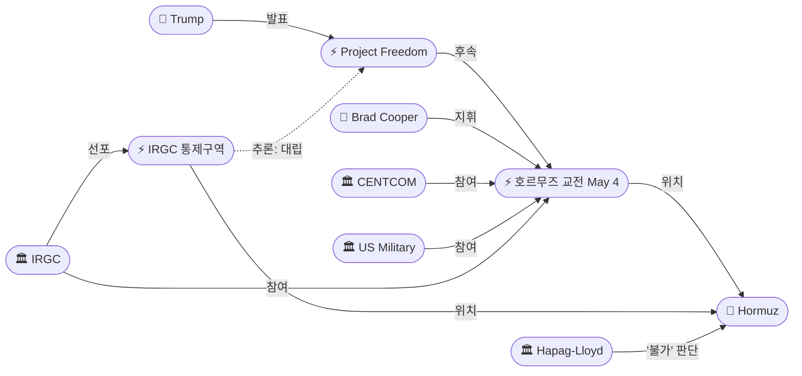
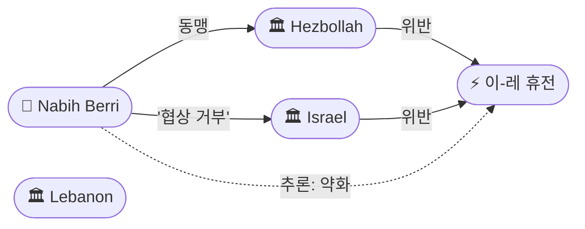

# 2026-05-04 2026 Iran War OSINT 일일 보고서

## 요약

Day 66. 호르무즈 해협에서 **4월 8일 휴전 이후 최초의 직접 군사 교전**이 발생했다. Project Freedom 첫날, 미 해군이 이란 쾌속정 6척을 격침하고 IRGC는 순항미사일·드론·쾌속정으로 미 군함과 상선을 공격했다. 이란 국영매체는 미 프리깃 2발 피격을 주장했으나 CENTCOM은 즉각 부인했다. 미국 국적 상선 2척이 호르무즈를 최초 통과했으나, Hapag-Lloyd는 여전히 통과 불가로 판단했다. 동시에 이란은 **UAE를 직접 공격**하여 푸자이라 유류시설에 화재를 일으켰고(미사일 15발+드론 4기 요격, 인도인 3명 부상), IRGC는 호르무즈에 공식 **'스마트 해상통제구역'**을 선포했다. 유가는 Brent $114.44(+6%, 4년 최고)/WTI $106.42(+4%)로 급등했다. 레바논에서는 나비 베리 국회의장이 이스라엘 협상을 공식 거부하여 평화 프로세스의 구조적 장벽이 드러났다.

## 주요 뉴스

### 1. 호르무즈 교전 — 미 해군 이란 쾌속정 6척 격침, 이란 미사일·드론 공격
- **출처:** [CNN](https://www.cnn.com/2026/05/04/world/live-news/iran-war-hormuz-trump)
- **일시:** 2026-05-04
- **내용:** Project Freedom 첫날, 미-이란 간 4/8 휴전 이후 최초 직접 군사 교전이 발생했다. CENTCOM 사령관 브래드 쿠퍼 제독은 미군이 이란 쾌속정 6척을 파괴했으며, 이란이 순항미사일·드론·쾌속정으로 미 해군 함정과 상선을 동시 공격했다고 발표했다. 이란 국영 Fars통신은 미 프리깃이 미사일 2발에 피격되어 후퇴했다고 주장했으나, CENTCOM은 "No U.S. Navy ships have been struck"라고 즉각 부인했다. 트럼프는 "이란군이 미 함정을 겨냥하면 'blown off the face of the Earth'가 될 것"이라 경고했다. CENTCOM은 '1방향 방어 회랑'을 설정하여 미국 국적 상선 2척이 최초 통과에 성공했으나, Hapag-Lloyd는 "통과 여전히 불가능"이라 판단했다.
- **상태:** 신규
- **관련 엔티티:** Donald Trump, Brad Cooper, CENTCOM, IRGC, US Military, Strait of Hormuz, Project Freedom, Hapag-Lloyd

### 2. 이란 UAE 공격 — 푸자이라 유류시설 화재, 미사일 15발+드론 4기 요격
- **출처:** [Al Jazeera](https://www.aljazeera.com/news/2026/5/4/uae-reports-missile-and-drone-strikes-incoming-from-iran)
- **일시:** 2026-05-04
- **내용:** UAE 방공체계가 이란에서 발사된 미사일 15발과 드론 4기를 요격했으나, 드론 1기가 푸자이라 유류산업단지(FOIZ)에 명중하여 화재가 발생했다. 인도 국적 3명이 경상을 입었다. 이는 4/8 휴전 이후 UAE에 대한 **최초의 이란 직접 공격**이다. 푸자이라는 ADCOP 파이프라인의 종점으로, 호르무즈 해협을 우회하여 UAE 원유를 수출하는 핵심 경로다. 이란이 호르무즈 직접 대치와 동시에 우회 경로의 종점을 타격한 것은 '이중 봉쇄' 의지의 과시로 해석된다. UAE 교육부는 화~금요일 전국 학교·유치원의 원격수업 전환을 명령했다.
- **상태:** 신규
- **관련 엔티티:** Iran, UAE, IRGC, Fujairah, ADCOP Pipeline

### 3. IRGC 호르무즈 '스마트 해상통제구역' 공식 선포
- **출처:** [Tasnim](https://www.tasnimnews.ir/en/news/2026/05/04/3582497/irgc-announces-new-maritime-control-zone-in-strait-of-hormuz)
- **일시:** 2026-05-04
- **내용:** IRGC가 호르무즈 해협에 공식 '스마트 통제구역'을 선포했다. 남측 경계: 이란 모바레크산~UAE 푸자이라 남쪽. 서측 경계: 이란 께쉼섬 끝~UAE 움알쿠와인. IRGC 대변인은 통과 프로토콜을 위반하는 선박은 "forcefully stopped"될 것이라 경고했다. 선박추적 데이터에 따르면 지난 24시간 동안 해협을 통과한 선박은 **9척에 불과**했다. 카탐 알안비야 사령부 사령관 알리 압돌라히 소장은 외국 군대, 특히 미군이 호르무즈에 접근하면 공격할 것이라 경고하고, Project Freedom과 미 해상봉쇄를 '해적행위(piracy)'이자 4/8 휴전 위반이라 규정했다. 이란의 호르무즈 통제가 사실상(de facto)에서 **공식 선포(de jure)**로 전환된 것이다.
- **상태:** 신규
- **관련 엔티티:** IRGC, Ali Abdollahi, Strait of Hormuz, Project Freedom

### 4. 나비 베리: 이스라엘과 협상 불가 — "전쟁 중단이 우선"
- **출처:** [US News/Reuters](https://www.usnews.com/news/world/articles/2026-05-04/lebanons-most-senior-shiite-politician-says-no-to-negotiations-with-israel-until-war-stops)
- **일시:** 2026-05-04
- **내용:** 레바논 국회의장 나비 베리(레바논 최고위 시아파 정치인, 헤즈볼라 동맹)가 An-Nahar 인터뷰에서 이스라엘과의 협상을 공식 거부했다. "전쟁을 멈추는 것이 정치 트랙보다 우선"이라며 이스라엘이 공격을 중단한다는 보장 없이는 어떤 협상도 없다고 밝혔다. 같은 날 이스라엘군은 남부 레바논 4개 추가 마을에서 주민 퇴거를 명령했고, 헤즈볼라는 일요일 이스라엘군에 대한 11건의 작전을 수행했다고 발표했다. 4/23 3주 연장된 휴전의 5/17 만료까지 13일.
- **상태:** 신규
- **관련 엔티티:** Nabih Berri, Lebanon, Israel, Hezbollah, Israel-Lebanon Ceasefire

### 5. 유가 급등 — Brent $114.44(+6%, 4년 최고), WTI $106.42(+4%)
- **출처:** [CNBC](https://www.cnbc.com/2026/05/04/oil-prices-today-wti-brent-trump-iran-us-hormuz.html)
- **일시:** 2026-05-04
- **내용:** 브렌트유가 6% 가까이 상승하여 $114.44/bbl로 마감, 2022년 이후 4년 최고가를 기록했다. WTI는 4%+ 상승하여 $106.42/bbl. 푸자이라 공격 보도 직후 브렌트는 $115를 잠시 돌파했으나, CENTCOM이 미 군함 피격을 부인한 후 $110선으로 반락했다. 전쟁 개시(2/28) 이후 양 계약 모두 약 60% 상승. 호르무즈 교전과 푸자이라 공격이라는 이중 요인이 유가 급등을 견인했다.
- **상태:** 신규
- **관련 엔티티:** Strait of Hormuz, Fujairah, Iran, UAE

### 6. 최초 호르무즈 상선 통과 — 2척 성공, 상업적 한계 지속
- **출처:** [The War Zone](https://www.twz.com/news-features/first-ships-transit-strait-of-hormuz-under-new-u-s-protection-plan)
- **일시:** 2026-05-04
- **내용:** Project Freedom 첫날, 미국 국적 상선 2척이 호르무즈 해협을 통과하는 데 성공했다. 이란의 사실상 해협 봉쇄 이후 최초의 상업 선박 통과다. CENTCOM은 '1방향 방어 회랑'으로 운용했다고 설명했다. 그러나 독일 컨테이너 해운사 Hapag-Lloyd는 해협 통과가 "여전히 불가능(still not possible)"이라 판단했고, 약 2만 명의 선원과 수백 척의 선박이 페르시아만에 발이 묶여 있는 상태가 지속되었다. 군사적 돌파와 상업적 현실 사이의 괴리가 드러났다.
- **상태:** 신규
- **관련 엔티티:** Project Freedom, CENTCOM, Strait of Hormuz, Hapag-Lloyd

### 7. 이란 3중 경고 — 군사·의회·외교부 통합 대응
- **출처:** [Al Jazeera](https://www.aljazeera.com/news/2026/5/4/iran-warns-us-to-stay-out-of-hormuz-after-trump-says-us-will-guide-ships)
- **일시:** 2026-05-04
- **내용:** 이란이 군사·의회·외교 3개 채널에서 동시 경고를 발했다. (1) 알리 압돌라히(카탐 알안비야 사령부 사령관): 외국 군대가 호르무즈에 접근하면 공격. (2) 에브라힘 아지지(의회 안보외교위원장): 미국의 호르무즈 간섭은 휴전 위반. (3) 에스마일 바가에이(외교부 대변인): 미국 역제안을 검토 중이라 확인. 군사와 의회의 강경 경고에도 외교부는 협상 채널 유지 신호를 보내, 이란 내부의 '강경 + 외교' 이중 전략이 지속되었다. 이란 고위 관리는 Asia Times에 Project Freedom이 "이란을 도발하여 확전 구실을 만들려는 것"이라고 분석했다.
- **상태:** 신규
- **관련 엔티티:** Ali Abdollahi, Ebrahim Azizi, Esmail Baghaei, Iran, Project Freedom

## 지식그래프

### 오늘의 주요 관계
1. **Project Freedom → 교전:** 5/3 발표에서 5/4 실행으로 전환. 법적 대립이 군사 충돌로 격상.
2. **Project Freedom → 푸자이라 공격:** 호르무즈 대치와 동시에 ADCOP 우회 경로 타격 — 이란의 '이중 봉쇄' 의지.
3. **IRGC 통제구역 ↔ 이란 항행법:** 5/3 의회 입법 → 5/4 IRGC 공식 선포. 입법과 군사의 동기화.
4. **베리 → 이-레 휴전:** 최고위 시아파 지도자의 협상 거부로 평화 프로세스 약화.
5. **UAE ↔ US Military:** 동일 일자 이란 공격 대응 — 암시적 전략 동맹.

### 호르무즈 교전 구도



### UAE 전선

```mermaid
graph LR
    ent-002(["🏛 Iran"])
    ent-005(["🏛 IRGC"])
    ent-269(["⚡ 푸자이라 공격"])
    ent-274(["📍 Fujairah"])
    ent-275(["🏛 UAE"])
    ent-260(["⚡ Project Freedom"])

    ent-002 -->|공격| ent-269
    ent-005 -->|실행| ent-269
    ent-269 -->|위치| ent-274
    ent-275 -->|요격(15+4)| ent-269
    ent-275 -->|대립| ent-002
    ent-269 -.->|추론: 보복| ent-260
```

### 레바논 휴전



## 온톨로지 변경
| 변경 유형 | 대상 | 근거 |
|----------|------|------|
| 새 엔티티 | ent-268: US-Iran Hormuz Exchange of Fire (May 4) | 4/8 이후 최초 직접 교전 (src-792) |
| 새 엔티티 | ent-269: Fujairah Drone Attack (May 4) | 4/8 이후 최초 UAE 공격 (src-793) |
| 새 엔티티 | ent-270: IRGC Hormuz Maritime Control Zone | '스마트 통제' 공식 선포 (src-794) |
| 새 엔티티 | ent-271: Nabih Berri | 레바논 국회의장, 이스라엘 협상 거부 (src-795) |
| 새 엔티티 | ent-272: Ebrahim Azizi | 이란 의회 안보외교위원장 (src-798) |
| 새 엔티티 | ent-273: Esmail Baghaei | 이란 외교부 대변인 (src-798) |
| 새 엔티티 | ent-274: Fujairah | UAE 유류 허브, ADCOP 종점 (src-793) |
| 새 엔티티 | ent-275: UAE | 미사일/드론 요격, 학교 원격수업 (src-793) |
| 새 엔티티 | ent-276: Hapag-Lloyd | 독일 해운사, 통과 불가 판단 (src-797) |

## 추론 결과
| 추론 | 신뢰도 | 근거 |
|------|--------|------|
| 푸자이라 공격 ← Project Freedom (보복) | 0.80 | 호르무즈 대치와 동시에 ADCOP 우회 경로 종점 타격 |
| IRGC 통제구역 ↔ 이란 항행법 (입법-군사 동기화) | 0.85 | 5/3 의회 입법 → 5/4 IRGC 공식 선포 |
| 호르무즈 교전 ↔ IRGC 통제구역 (군사 충돌) | 0.85 | 경쟁적 통제 주장이 직접 교전으로 전환 |
| UAE ↔ US Military (암시적 동맹) | 0.75 | 동일 일자 이란 공격 대응, 직접 공동 작전 미확인 |
| 베리 → 이-레 휴전 약화 | 0.80 | 최고위 시아파 지도자 협상 거부로 외교 프레임워크 약화 |

## 분석 및 평가

**'법적 대립'에서 '군사 충돌'로.** Day 66은 호르무즈를 둘러싼 미-이란 대치가 질적으로 전환된 날이다. 5/3에는 Project Freedom 발표와 이란 항행법 추진이라는 '법적 대립'이었으나, 5/4에는 실제 사격이 오갔다. 미군이 6척을 격침하고 이란이 미사일·드론으로 응사한 것은 4/8 휴전의 사실상 종료를 의미할 수 있다. 그러나 양측 모두 전면전을 피하려는 의지를 보였다 — 트럼프는 "guide, not escort"로 한정했고, IRGC는 2척의 미국 국적 선박 통과를 결국 저지하지 못했다.

**푸자이라의 전략적 의미.** 이란이 호르무즈와 동시에 푸자이라를 공격한 것은 단순 보복이 아니다. 푸자이라는 ADCOP 파이프라인의 종점으로 호르무즈를 우회하는 유일한 대량 원유 수출 경로다. 이를 타격함으로써 이란은 '호르무즈 우회도 허용하지 않겠다'는 메시지를 보냈다. UAE 학교의 원격수업 전환은 전쟁의 민간 영향이 4/8 이후 다시 확대되고 있음을 보여준다.

**IRGC 공식 통제구역의 함의.** IRGC가 구체적 좌표와 함께 '스마트 통제구역'을 공식 선포한 것은 사실상 통제(de facto)에서 공식 선포(de jure)로의 전환이다. 5/3 의회 항행법과 결합하면, 이란은 호르무즈에 대한 주권적 통제를 국내법과 군사 선포 양면에서 기정사실화하려 한다. 24시간 동안 9척만 통과한 것은 이 통제가 실질적으로 작동하고 있음을 보여준다.

**레바논: 정치적 교착.** 나비 베리의 협상 거부는 4/14 워싱턴 회담과 4/23 휴전 연장의 정치적 기반을 약화시킨다. 레바논 최고위 시아파 지도자가 공식 거부한 상태에서 실질적 평화 협상은 불가능하다. 이스라엘의 추가 4개 마을 퇴거 명령과 헤즈볼라의 11건 작전은 Day 18 휴전이 유명무실함을 재확인한다.

**외교 채널의 취약한 존속.** 바가에이 외교부 대변인의 '미국 역제안 검토 중' 확인은 파키스탄 경유 채널이 여전히 작동함을 보여주지만, 호르무즈에서의 실제 교전은 외교적 여지를 급격히 축소했다. '도발 구실' 프레임(Asia Times)과 군사 충돌이 병행되는 상황에서 외교가 군사를 견제할 수 있을지가 핵심 변수다.

## 추적 항목
| 항목 | 최초 보고 | 상태 | 최신 업데이트 |
|------|----------|------|-------------|
| 미-이란 휴전/협상 | 2026-04-08 | 사실상 파기 위험 | Project Freedom Day 1 교전. 바가에이: 역제안 검토 중. |
| 호르무즈 이중 봉쇄 | 2026-04-13 | 군사 충돌 전환 | 6척 격침·미사일 교환. IRGC 통제구역 공식 선포. 2척 통과 성공. |
| 이스라엘-레바논 휴전 | 2026-04-16 | 유명무실 | Day 18. 베리 협상 거부. 4개 마을 추가 퇴거. 5/17 만료 13일. |
| UAE 전선 | 2026-05-04 | 재개 | 4/8 이후 최초 공격. 푸자이라 유류시설 화재. 학교 원격수업. |
| WPR 법적 공방 | 2026-04-30 | 교착 | 호르무즈 교전으로 WPR 논쟁 재점화 가능. |
| 유가/경제 영향 | 2026-04-07 | 급등 | Brent $114.44(+6%, 4년 최고). WTI $106.42(+4%). |
| 이란 내부 분열 | 2026-04-17 | 강경 통합 | 의회+IRGC 동기화(항행법+통제구역). 외교부만 협상 채널 유지. |

## 동향 요약
| 분류 | 상태 | 비고 |
|------|------|------|
| 미-이란 협상 | 🔴 위기 | 호르무즈 직접 교전. 외교 채널 취약하게 존속. |
| 호르무즈 해협 | 🔴 교전 | 6척 격침·미사일 교환. IRGC 통제구역 선포. 2척 통과. |
| UAE 전선 | 🔴 재개 | 4/8 이후 최초 공격. 푸자이라 화재. 민간 영향 확대. |
| 이-레 휴전 | 🟡 유명무실 | Day 18. 베리 협상 거부. 5/17 만료 13일. |
| 유가 | 🔴 급등 | Brent $114 (+6%, 4년 최고). 이중 요인(호르무즈+푸자이라). |
| 미국 내정 | 🟡 분열 | 호르무즈 교전으로 WPR 논쟁 재점화 가능. |

## 출처 목록
1. [US and Iranian militaries trade shots as Strait of Hormuz tensions escalate](https://www.cnn.com/2026/05/04/world/live-news/iran-war-hormuz-trump) - CNN, 2026-05-04
2. [UAE reports missile and drone strikes incoming from Iran](https://www.aljazeera.com/news/2026/5/4/uae-reports-missile-and-drone-strikes-incoming-from-iran) - Al Jazeera, 2026-05-04
3. [IRGC Announces New Maritime Control Zone in Strait of Hormuz](https://www.tasnimnews.ir/en/news/2026/05/04/3582497/irgc-announces-new-maritime-control-zone-in-strait-of-hormuz) - Tasnim, 2026-05-04
4. [Lebanon's most senior Shi'ite politician says no to negotiations with Israel until war stops](https://www.usnews.com/news/world/articles/2026-05-04/lebanons-most-senior-shiite-politician-says-no-to-negotiations-with-israel-until-war-stops) - US News/Reuters, 2026-05-04
5. [Oil prices jump after Iran attacks UAE as U.S. tries to open Strait of Hormuz](https://www.cnbc.com/2026/05/04/oil-prices-today-wti-brent-trump-iran-us-hormuz.html) - CNBC, 2026-05-04
6. [First Ships Transit Strait Of Hormuz Under New U.S. Protection Plan](https://www.twz.com/news-features/first-ships-transit-strait-of-hormuz-under-new-u-s-protection-plan) - The War Zone, 2026-05-04
7. [Iran warns US to stay out of Hormuz after Trump says US will 'guide' ships](https://www.aljazeera.com/news/2026/5/4/iran-warns-us-to-stay-out-of-hormuz-after-trump-says-us-will-guide-ships) - Al Jazeera, 2026-05-04
8. [Trump's Hormuz 'protection' seeks 'pretext for escalation': Iran](https://asiatimes.com/2026/05/trumps-hormuz-protection-seeks-pretext-for-escalation-iran/) - Asia Times, 2026-05-04
9. [U.S. military denies Iran's claim it struck American warship in Strait of Hormuz](https://www.cnbc.com/2026/05/04/iran-war-trump-strait-of-hormuz.html) - CNBC, 2026-05-04
10. [Trump says Iran has 'taken some shots' but caused little damage](https://www.euronews.com/2026/05/04/iranian-military-claims-it-prevented-us-navy-ships-from-entering-strait-of-hormuz) - Euronews, 2026-05-04
11. [UAE says Iran launched missile attack despite ceasefire](https://www.cnbc.com/2026/05/04/iran-war-uae-trump-ceasefire-missiles.html) - CNBC, 2026-05-04
12. [Battle for Hormuz begins as US military fights off Iranian attacks](https://fortune.com/2026/05/04/strait-of-hormuz-showdown-us-navy-warships-persian-gulf-commercial-ships-project-freedom/) - Fortune, 2026-05-04
13. [Project Freedom unlikely to pay off right away, analysts say](https://breakingdefense.com/2026/05/project-freedom-strait-of-hormuz-risk-us-forces-commercial-ships/) - Breaking Defense, 2026-05-04
14. [Why US warships won't be escorting merchant ships through Strait of Hormuz](https://www.cnn.com/2026/05/04/middleeast/project-freedom-hormuz-guide-ships-intl-hnk-ml) - CNN, 2026-05-04
15. ["휴전 위반" 이란, 트럼프 '프로젝트 프리덤'에 맞불 경고](https://seoul.co.kr/news/international/2026/05/04/20260504500013) - 서울신문, 2026-05-04
16. [Iran war live: UAE says intercepted missiles, drone sparks fire at oil site](https://www.aljazeera.com/news/liveblog/2026/5/4/iran-war-live-tehran-says-trumps-hormuz-mission-violates-ceasefire) - Al Jazeera, 2026-05-04
17. [Trump announces 'Project Freedom' to guide ships — Fox News live](https://www.foxnews.com/live-news/trump-iran-war-hormuz-strait-may-4) - Fox News, 2026-05-04
18. [Hormuz 'humanitarian' run: IRGC general issues new threat](https://gulfnews.com/world/mena/hormuz-humanitarian-run-trumps-project-freedom-sparks-iran-war-fears-as-irgc-general-issues-new-threat-1.500528160) - Gulf News, 2026-05-04
19. [Fujairah Oil Zone Hit by Fire After Drone Attack](https://www.usnews.com/news/world/articles/2026-05-04/fujairah-oil-zone-hit-by-fire-after-drone-attack-as-uae-says-it-intercepted-iran-missiles) - US News, 2026-05-04
20. [The U.S. fights to reopen Hormuz as UAE says it's attacked by Iran](https://www.npr.org/2026/05/04/nx-s1-5810508/iran-war-updates) - NPR, 2026-05-04
21. [IRGC unveils new Strait of Hormuz map, shipping remains at standstill](https://www.jpost.com/middle-east/iran-news/article-895083) - Jerusalem Post, 2026-05-04
22. [IRGC publishes Hormuz 'control map', warns ships 'forcefully stopped'](https://www.turkiyetoday.com/region/irgc-publishes-hormuz-control-map-and-warns-ships-will-be-forcefully-stopped-3219362) - Turkiye Today, 2026-05-04
23. [Can US navy 'guide' stuck ships out of Hormuz?](https://www.aljazeera.com/news/2026/5/4/trumps-project-freedom-can-us-navy-guide-stuck-ships-out-of-hormuz) - Al Jazeera, 2026-05-04
24. [Berri: No talks with Israel until attacks on Lebanon stop](https://www.presstv.ir/Detail/2026/05/04/768040/Berri-No-talks-with-Israel-until-attacks-on-Lebanon-stop) - Press TV, 2026-05-04
25. [Lebanon's Hezbollah-allied parliament speaker: No talks with Israel until war ends](https://www.timesofisrael.com/lebanons-hezbollah-allied-parliament-speaker-no-talks-with-israel-until-war-ends/) - Times of Israel, 2026-05-04
26. [트럼프 "호르무즈 억류 선박 빼내는 '프로젝트 프리덤' 4일부터 시작"](https://www.mt.co.kr/world/2026/05/04/2026050406003555501) - 머니투데이, 2026-05-04
27. [트럼프 "호르무즈 갇힌 선박 빼내는 '프로젝트 프리덤' 4일 개시"](https://www.fnnews.com/news/202605040909425836) - 파이낸셜뉴스, 2026-05-04
28. [트럼프, 호르무즈에 '프로젝트 프리덤' 가동… 억류 선박 강제 호송 나선다](https://www.blockmedia.co.kr/archives/1087058) - 블록미디어, 2026-05-04
29. [트럼프 '호르무즈 해방 프로젝트' 발동…미·이란 충돌 위기 고조](https://www.asiatoday.co.kr/kn/view.php?key=20260505010000450) - 아시아투데이, 2026-05-04
30. [Lebanon's most senior Shiite politician says no to negotiations](https://www.arabnews.com/node/2642282/middle-east) - Arab News, 2026-05-04
