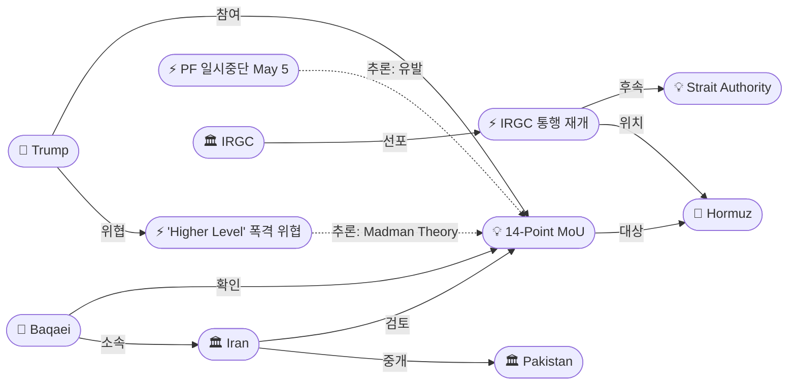
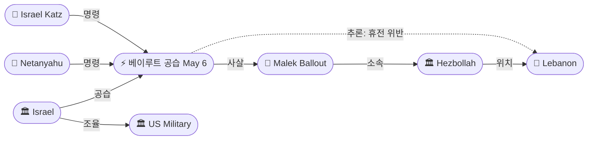
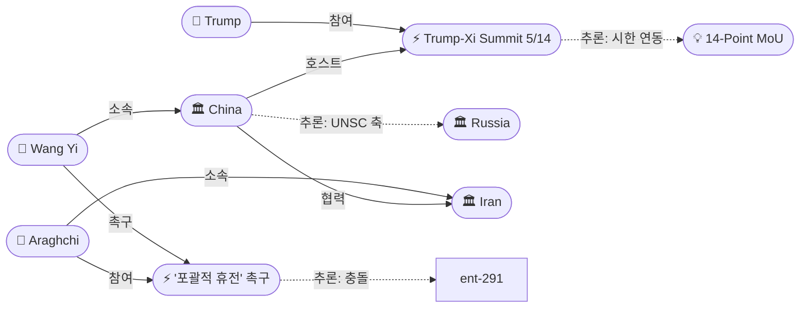

# 2026-05-06 2026 Iran War OSINT 일일 보고서

## 요약

Day 68. Axios가 미-이란 **14-Point MoU** 구체 조항을 최초 공개했다 — 전쟁 종결 선언, 30일 내 핵 모라토리엄·제재 해제·호르무즈 개방 협상이라는 포괄적 프레임워크다. 이란 외교부 대변인 바가에이는 제안을 "검토 중"이라 확인했고 파키스탄을 통해 24-48시간 내 응답 예정이다. 트럼프는 동시에 이란이 거부하면 "much higher level"의 폭격을 재개하겠다고 위협했다. IRGC는 호르무즈 **조건부 통행 재개**를 선언해 이란 지정 코리도를 통한 선박 통과를 허용했으나 이탈 시 "decisive action"을 경고했다. 한편 이스라엘은 4/16 이후 **최초로 베이루트 다히에를 공습**하여 헤즈볼라 라드완 부대 작전사령관 **말렉 발루트**를 사살했다. 중국 왕이 외교부장은 아라그치와의 회담에서 **'포괄적 휴전'**을 촉구했으며, 이는 5/14-15 **Trump-Xi 정상회담** 직전 이란 압박으로 해석된다. 유가는 전쟁 개시 이후 최대 일일 낙폭(-8%)을 기록하며 Brent $101.27로 마감했다.

## 주요 뉴스

### 1. US-Iran 14-Point MoU 구체 조항 최초 공개 — 전쟁 종결 + 30일 포괄 협상 프레임워크
- **출처:** [Axios](https://www.axios.com/2026/05/06/iran-us-deal-one-page-memo)
- **일시:** 2026-05-06
- **내용:** 미-이란 양측이 1페이지 14개항 양해각서(MoU) 합의에 근접했다고 미국 관리 2명과 브리핑 소스 2명이 Axios에 전했다. 핵심 내용: (1) 전쟁 종결 선언, (2) 30일 상세 협상 기간 개시, (3) 이란은 핵무기 추구 금지·지하 핵시설 미운영·IAEA 긴급 사찰 수용 약속, (4) 미국은 제재 단계적 해제·동결 자산(수십억 달러) 단계적 반환, (5) 이란의 호르무즈 제한과 미국의 해상 봉쇄를 30일간 단계적 해제. 미국 관리: "We are not far, but there is no deal yet." 백악관은 이란의 24-48시간 내 응답을 기대한다.
- **상태:** 신규
- **관련 엔티티:** Donald Trump, Iran, Steve Witkoff, Jared Kushner, Pakistan, Strait of Hormuz

### 2. 트럼프, 이란 거부 시 "much higher level" 폭격 재개 위협 — Epic Fury 재가동 명시
- **출처:** [CNBC](https://www.cnbc.com/2026/05/06/us-iran-peace-deal-nuclear-moratorium.html)
- **일시:** 2026-05-06
- **내용:** 트럼프가 Truth Social에 "If they don't agree, the bombing starts, and it will be, sadly, at a much higher level and intensity than it was before"라고 게시했다. Operation Epic Fury의 재개를 명시적으로 위협했다. 동시에 이란에 "never a deadline"을 부여한다고도 밝혀, 강압과 유화의 이중 메시지를 전달했다. 이는 MoU 근접 보도와 동시에 나온 것으로, 전형적 'Madman Theory' — 비합리적 위협으로 상대의 양보를 유도하는 전략으로 해석된다.
- **상태:** 신규
- **관련 엔티티:** Donald Trump, Iran, Operation Epic Fury

### 3. IRGC, 호르무즈 조건부 통행 재개 — 이란 지정 코리도 통과만 허용
- **출처:** [Press TV](https://www.presstv.ir/Detail/2026/05/06/768144/Iran-IRGC-Navy-statement-resumed-passage-Hormuz-Strait)
- **일시:** 2026-05-06
- **내용:** IRGC 해군이 호르무즈 해협 통행의 점진적 재개를 발표했다. "The corridor provided by Iran is the only safe way to pass through the Strait of Hormuz. Diverting ships to other routes is unsafe, and the IRGC Navy will take decisive action against anyone who takes such a step." 선사들의 "good level of compliance"를 보고했으며, 통행 재개를 "aggressor threats neutralized"로 프레이밍했다. 이는 5/3 의회 항행법 → 5/4 통제구역 → 5/5 Strait Authority → 5/6 통행 재개라는 **4단계 제도화-집행 시퀀스의 완결**이다.
- **상태:** 신규
- **관련 엔티티:** IRGC, Strait of Hormuz, Iran Strait Authority

### 4. 이스라엘, 4/16 이후 최초 베이루트 공습 — 라드완 부대 사령관 말렉 발루트 사살
- **출처:** [Al Jazeera](https://www.aljazeera.com/news/2026/5/6/israel-bombs-beiruts-southern-suburb-as-it-targets-radwan-force-commander)
- **일시:** 2026-05-06
- **내용:** 이스라엘 공군이 베이루트 남부 교외 다히에(Ghobeiri)를 공습해 헤즈볼라 라드완 부대 작전사령관 말렉 발루트(Malek Ballout)와 부관을 사살했다. 4/16 휴전 이후 최초의 베이루트 공습이다. 네타냐후와 카츠 국방장관이 공동 명령했으며, 이스라엘 관리는 미국과 사전 조율했다고 밝혔다. 발루트는 2024년 1월 전임자 위삼 알타위르 사살 이후 라드완 부대를 지휘해왔다. 이는 5/17 만료 예정인 휴전의 **정면 위반**이며, 헤즈볼라 보복 가능성을 높인다.
- **상태:** 신규
- **관련 엔티티:** Israel, Malek Ballout, Hezbollah, Benjamin Netanyahu, Israel Katz, Lebanon

### 5. 유가 전쟁 이후 최대 일일 낙폭 — Brent $101.27(-8%), WTI $95.08(-7%)
- **출처:** [CNBC](https://www.cnbc.com/2026/05/06/oil-prices-trump-pauses-strait-of-hormuz-escort-effort.html)
- **일시:** 2026-05-06
- **내용:** 브렌트유가 약 8% 하락해 $101.27/bbl로 마감, WTI도 약 7% 하락해 $95.08/bbl. 2/28 전쟁 개시 이후 최대 단일 일일 하락폭이다. The National에 따르면 장중 $98.30까지 하락했다. Axios의 MoU 근접 보도, IRGC 통행 재개 선언, 트럼프 'great progress' 발언이 복합적으로 작용했다. 전일($109.87) 대비 $8.60 하락. 그러나 여전히 전쟁 전 수준 대비 약 43% 높다.
- **상태:** 신규
- **관련 엔티티:** Strait of Hormuz, Iran, Oil Market

### 6. 왕이, '포괄적 휴전' 촉구 — 아라그치 회담, Trump-Xi 정상회담(5/14) 전 이란 압박
- **출처:** [CNBC](https://www.cnbc.com/2026/05/06/china-iran-araghchi-wang-yi-trump-beijing-hormuz-talks.html)
- **일시:** 2026-05-06
- **내용:** 왕이 중국 외교부장이 아라그치 이란 외무장관과의 베이징 회담에서 "immediate end to the hostilities"와 "prompt resumption of shipping traffic through the Strait of Hormuz"를 촉구했다. 중국은 이란의 핵무기 비추구 약속을 환영하고 "peaceful use of nuclear energy"에 대한 정당한 권리를 인정했다. 아라그치는 호르무즈 개방을 "promptly" 해결할 수 있다고 시사했다. 이 회담은 Trump-Xi 정상회담(5/14-15) **1주 전**에 전략적으로 배치되었으며, 중국이 이란에 '협조 압박'을 가하면서 자국을 중재자로 포지셔닝하는 것으로 해석된다.
- **상태:** 신규
- **관련 엔티티:** Wang Yi, Abbas Araghchi, China, Donald Trump, Trump-Xi Beijing Summit

### 7. 이란 외교부 바가에이, 미국 제안 검토 공식 확인 — "파키스탄 측에 전달 예정"
- **출처:** [NPR](https://www.npr.org/2026/05/06/nx-s1-5813497/iran-war-strait-hormuz-updates)
- **일시:** 2026-05-06
- **내용:** 이란 외교부 대변인 에스마엘 바가에이가 ISNA 통신에 "The American plan and proposal is still being reviewed by Iran, and after summing up its points of view, Iran will convey its views to the Pakistani side"라고 밝혔다. 이란 협상단은 현재 '전쟁 종결'을 논의하고 있으며, 핵 문제는 이후 단계로 분류한다. 트럼프의 폭격 위협과 동시에 나온 것으로, 이란이 외교·군사 양면 압박 하에 놓여있음을 보여준다.
- **상태:** 신규
- **관련 엔티티:** Esmaeil Baqaei, Iran, Pakistan

### 8. 레바논 휴전 Day 20 — "유명무실", 이번 주 가장 강렬한 공격
- **출처:** [NPR](https://www.npr.org/2026/05/06/nx-s1-5814098/a-fraying-ceasefire-in-southern-lebanon-with-villages-destroyed)
- **일시:** 2026-05-06
- **내용:** 4/16 미국 중재 휴전 후 3주. UN 보고서는 이번 주 공격이 "the most intense since the truce started"라고 평가했다. CBC 분석은 휴전이 "'in name only'"이며 "widening incursions are exposing major cracks in an agreement that analysts say was never going to ultimately halt the violence"라고 지적했다. 5/17 만료까지 11일. 헤즈볼라는 공식 서명 당사자가 아니며, 오늘 라드완 사령관 사살로 보복 가능성이 급상승했다.
- **상태:** 신규
- **관련 엔티티:** Israel, Hezbollah, Lebanon

### 9. Trump-Xi 정상회담 5/14-15 확정 — 미완의 이란 전쟁이 시진핑에 유리
- **출처:** [Eurasia Review](https://www.eurasiareview.com/04052026-what-to-expect-from-the-trump-xi-jinping-14-15-may-summit-analysis/)
- **일시:** 2026-05-06
- **내용:** 트럼프-시진핑 정상회담이 5/14-15 베이징에서 개최된다. 원래 3월 예정이었으나 이란 전쟁으로 연기되었다. 의제: 이란/호르무즈, 대만, 무역. CNN 분석: "unfinished Iran war could give Xi the upper hand." 미국은 중국에 이란 압박 협조를 요구하고, 중국은 대만 정책 조정을 요구한다. 아라그치의 베이징 방문(5/5-6)은 정상회담 1주 전에 중국이 '두 카드'를 모두 확보하려는 포지셔닝이다.
- **상태:** 신규
- **관련 엔티티:** Donald Trump, Xi Jinping, China, Iran

## 지식그래프

### 오늘의 주요 관계
1. **MoU ← PF 일시중단:** 군사작전 중단이 외교적 공간을 열어 MoU 최종 단계 진입.
2. **IRGC 통행 재개 ← Strait Authority:** 입법→군사→행정→집행 4단계 시퀀스 완결.
3. **베이루트 공습 ↔ 포괄적 휴전:** 이스라엘의 독자 에스컬레이션이 평화 프로세스와 정면 충돌.
4. **Trump-Xi ↔ MoU:** 정상회담이 MoU의 사실상 시한. 트럼프가 '딜 완료' 상태로 시진핑 만나려는 동기.
5. **폭격 위협 + 협상 = Madman Theory:** 비합리적 위협이 협상 레버리지로 기능.

### 협상 — MoU에서 폭격 위협까지

### 이-레 전선 — 베이루트 공습

### 외교 — 중국 축과 Trump-Xi 정상회담

## 온톨로지 변경
| 변경 유형 | 대상 | 근거 |
|----------|------|------|
| 새 엔티티 | ent-287: US-Iran 14-Point MoU | 전쟁 종결 프레임워크, 30일 핵/제재/호르무즈 포괄 (src-863) |
| 새 엔티티 | ent-288: Trump 'Higher Level' Bombing Threat | 'much higher level and intensity' Epic Fury 재개 (src-864) |
| 새 엔티티 | ent-289: IRGC Conditional Hormuz Transit | 이란 코리도 통과 허용, 4단계 제도화 완결 (src-865) |
| 새 엔티티 | ent-290: Malek Ballout | 라드완 부대 작전사령관, 2024.1 이후 지휘, 사살 (src-866) |
| 새 엔티티 | ent-291: Israel Beirut Strike May 6 | 4/16 이후 최초 다히에 공습, 미국 조율 (src-866) |
| 새 엔티티 | ent-292: Oil Plunge May 6 | Brent -8%, WTI -7%, 전쟁 이후 최대 낙폭 (src-867) |
| 새 엔티티 | ent-293: Wang Yi 'Comprehensive Ceasefire' Call | 즉각 휴전, 호르무즈 개방, 핵 비확산 환영 (src-868) |
| 새 엔티티 | ent-294: Trump-Xi Beijing Summit (May 14-15) | MoU 사실상 시한, 이란/대만/무역 의제 (src-871) |
| 새 엔티티 | ent-295: Esmaeil Baqaei | 이란 외교부 대변인, 제안 검토 공식 확인 (src-869) |
| 새 엔티티 | ent-296: Israel Katz | 이스라엘 국방장관, 베이루트 공습 명령 (src-866) |

## 추론 결과
| 추론 | 신뢰도 | 근거 |
|------|--------|------|
| MoU ← PF 일시중단 (인과) | 0.80 | PF 중단이 외교 공간 개방 → MoU 최종 단계 |
| IRGC 통행 재개 ← Strait Authority (시퀀스) | 0.85 | 항행법→통제구역→SA→통행 재개: 4단계 완결 |
| 베이루트 공습 ↔ 포괄적 휴전 (충돌) | 0.75 | 이스라엘 에스컬레이션이 평화 프로세스 훼손 |
| Trump-Xi ↔ MoU (시한 연동) | 0.80 | 정상회담(5/14)이 딜 완료의 암묵적 데드라인 |
| 폭격 위협 ↔ MoU (Madman Theory) | 0.75 | 위협과 협상 동시 = 비합리적 압박으로 양보 유도 |

## 분석 및 평가

**"1페이지에 전쟁을 끝내다" — MoU의 의미와 한계.** Day 68의 핵심은 Axios가 공개한 14-Point MoU의 구체 내용이다. 이 1페이지 문서가 실제로 서명된다면, 이란 전쟁은 '30일 유예기간 + 상세 협상'이라는 새로운 국면에 진입한다. 핵심 교환은 명확하다: 이란은 핵 포기 + 사찰 수용, 미국은 제재 해제 + 자산 반환, 양측은 호르무즈 단계적 개방. 그러나 "no deal yet"이라는 미 관리의 표현은, MoU 조항에 대한 합의와 서명 사이에 여전히 간극이 있음을 시사한다. 특히 이란 내부의 IRGC-정부 갈등이 최종 결정을 지연시킬 수 있다.

**"No deadline"의 역설.** 트럼프는 이란에 시한을 부여하지 않는다고 말했으나, 실질적 시한은 존재한다: (1) 5/14-15 Trump-Xi 정상회담 — 이란 딜 완료 상태가 미중 협상에서 유리, (2) IRGC 통행 재개의 지속 가능성 — 딜 없이 통행을 허용하면 이란의 레버리지가 소멸. 왕이의 '포괄적 휴전' 촉구도 이란에 대한 시간 압박으로 기능한다. 중국이 정상회담 전에 이란을 '협조'시키려는 것은, 미국에 대한 자국의 협상력을 높이려는 계산이다.

**IRGC의 "조건부 개방" — 주권 통제의 기정사실화.** 5/3 의회 항행법 → 5/4 통제구역 → 5/5 Strait Authority → 5/6 통행 재개라는 4일간의 시퀀스는, 이란이 호르무즈에 대한 '법적-군사적-행정적-실행적' 통제를 구축한 것이다. MoU에서 호르무즈가 '30일 단계적 해제' 대상이라면, 이란은 이미 협상의 출발점을 '완전 봉쇄'가 아닌 '이란 통제 하 개방'으로 설정한 셈이다.

**베이루트 공습 — "포괄적 합의"의 사각지대.** MoU 근접과 동시에 이스라엘이 베이루트를 공습한 것은 두 가지를 의미한다: (1) 미-이란 MoU에 레바논이 포함되지 않을 가능성이 높다, (2) 이스라엘은 미국의 이란 외교에 구속받지 않는 독자적 군사행동을 유지한다. 4/16 이후 최초의 베이루트 공습은 5/17 휴전 만료를 앞두고 헤즈볼라의 군사 역량을 사전 무력화하려는 의도로 보이나, 동시에 '포괄적 휴전'을 추구하는 중국·미국의 외교적 노력과 정면 충돌한다. 미국이 이 공습을 사전 '조율'했다는 이스라엘 측 발언은, 미국이 이란 외교와 이스라엘 군사행동을 분리 관리하고 있음을 시사한다.

## 추적 항목
| 항목 | 최초 보고 | 상태 | 최신 업데이트 |
|------|----------|------|-------------|
| 미-이란 휴전/협상 | 2026-04-08 | MoU 근접 | 14-Point MoU 조항 공개. 이란 검토 중. 24-48h 내 응답 예상. |
| 호르무즈 이중 봉쇄 | 2026-04-13 | 조건부 부분 개방 | IRGC 통행 재개. 이란 코리도만 허용. Strait Authority 집행. |
| 이스라엘-레바논 휴전 | 2026-04-16 | 정면 위반 | Day 20. 4/16 이후 최초 베이루트 공습. 라드완 사령관 사살. 5/17 만료 11일. |
| 유가/경제 영향 | 2026-04-07 | 급락 | Brent $101.27(-8%). 전쟁 이후 최대 일일 낙폭. MoU 근접 반영. |
| WPR 법적 공방 | 2026-04-30 | 보류 | MoU 서명 시 WPR 논쟁 의미 상실 가능. |
| 이란 내부 분열 | 2026-04-17 | 결정적 국면 | 바가에이 검토 확인(정부). IRGC 독자 통행 재개. 내부 합의 여부가 관건. |
| 중국/외교전 | 2026-05-05 | 적극 중재 전환 | 왕이 '포괄적 휴전'. Trump-Xi 5/14 전 이란 압박. |
| Trump-Xi 정상회담 | 2026-05-06 | D-8 | 5/14-15 베이징. MoU 사실상 시한. 이란/대만/무역 의제. |

## 동향 요약
| 분류 | 상태 | 비고 |
|------|------|------|
| 미-이란 협상 | 🟢 급진전 | 14-Point MoU 구체 조항. 24-48h 내 응답 예상. |
| 호르무즈 해협 | 🟡 조건부 개방 | IRGC 통행 재개 (이란 코리도만). 4단계 제도화 완결. |
| 이-레 휴전 | 🔴 정면 위반 | 4/16 이후 최초 베이루트 공습. 라드완 사령관 사살. |
| 유가 | 🟢 급락 | Brent $101(-8%). 전쟁 이후 최대 낙폭. 딜 반영. |
| 국제 외교 | 🟡 중재 전환 | 중국 적극 중재. Trump-Xi 정상회담 D-8. |
| 트럼프 위협 | 🔴 에스컬레이션 | 'much higher level' 폭격 재개 위협. Madman Theory. |

## 출처 목록
1. [U.S. and Iran closing in on one-page memo to end war](https://www.axios.com/2026/05/06/iran-us-deal-one-page-memo) - Axios, 2026-05-06
2. [Trump says Iran will be bombed at a 'much higher level' if it doesn't agree to peace deal](https://www.cnbc.com/2026/05/06/us-iran-peace-deal-nuclear-moratorium.html) - CNBC, 2026-05-06
3. [IRGC says it will allow 'safe, stable' transit via Hormuz](https://www.presstv.ir/Detail/2026/05/06/768144/Iran-IRGC-Navy-statement-resumed-passage-Hormuz-Strait) - Press TV, 2026-05-06
4. [Israel bombs Beirut's southern suburb as it targets Radwan Force commander](https://www.aljazeera.com/news/2026/5/6/israel-bombs-beiruts-southern-suburb-as-it-targets-radwan-force-commander) - Al Jazeera, 2026-05-06
5. [Oil prices fall more than 7% as U.S. and Iran appear close to deal to end war](https://www.cnbc.com/2026/05/06/oil-prices-trump-pauses-strait-of-hormuz-escort-effort.html) - CNBC, 2026-05-06
6. [China presses Iran against resuming war, urges Hormuz reopening ahead of Trump-Xi summit](https://www.cnbc.com/2026/05/06/china-iran-araghchi-wang-yi-trump-beijing-hormuz-talks.html) - CNBC, 2026-05-06
7. [Iran reviews proposal to end war as Trump warns of more bombs](https://www.npr.org/2026/05/06/nx-s1-5813497/iran-war-strait-hormuz-updates) - NPR, 2026-05-06
8. [In spite of ceasefire, Israel and Hezbollah clash in Lebanon](https://www.npr.org/2026/05/06/nx-s1-5814098/a-fraying-ceasefire-in-southern-lebanon-with-villages-destroyed) - NPR, 2026-05-06
9. [What To Expect From The Trump-Xi Jinping 14-15 May Summit?](https://www.eurasiareview.com/04052026-what-to-expect-from-the-trump-xi-jinping-14-15-may-summit-analysis/) - Eurasia Review, 2026-05-06
10. [Live updates: Iran reviewing US proposal as source says both sides moving toward memo to end war](https://www.cnn.com/2026/05/06/world/live-news/iran-war-trump-strait-of-hormuz) - CNN, 2026-05-06
11. [Trump optimistic as U.S. awaits Iran's response to peace framework](https://www.axios.com/2026/05/06/trump-iran-war-deal-framework-response) - Axios, 2026-05-06
12. [US, Iran said closing in on framework for permanent deal, as Trump renews bomb threats](https://www.timesofisrael.com/us-iran-said-closing-in-on-framework-for-permanent-deal-as-trump-renews-bomb-threats/) - Times of Israel, 2026-05-06
13. [Iran weighs new U.S. ceasefire-negotiation proposal amid Trump threats](https://www.washingtontimes.com/news/2026/may/6/iran-weighs-new-us-ceasefire-negotiation-proposal-amid-trump-threats/) - Washington Times, 2026-05-06
14. [Iran war live: Trump threatens 'much higher level' attacks if no deal](https://www.aljazeera.com/news/liveblog/2026/5/6/iran-war-live-trump-says-hormuz-operation-paused-amid-us-tehran-talks) - Al Jazeera, 2026-05-06
15. [China calls for end to Iran war and Hormuz to reopen during Araghchi visit](https://www.aljazeera.com/news/2026/5/6/irans-araghchi-holds-talks-with-chinas-wang-yi-in-beijing) - Al Jazeera, 2026-05-06
16. [Oil prices plunge on reports US and Iran nearing peace deal](https://www.thenationalnews.com/business/markets/2026/05/06/oil-prices-plunge-on-reports-us-and-iran-nearing-peace-deal/) - The National, 2026-05-06
17. [IDF targets top Hezbollah commander in first strike in Beirut in almost a month](https://www.timesofisrael.com/two-soldiers-hurt-in-hezbollah-drone-attack-in-south-lebanon-idf-hits-terror-sites/) - Times of Israel, 2026-05-06
18. [Israel strikes Beirut in breach of Lebanon ceasefire](https://www.al-monitor.com/originals/2026/05/israel-strikes-beirut-breach-lebanon-ceasefire) - Al-Monitor, 2026-05-06
19. [Israel strikes Beirut, says it killed head of Hezbollah elite force](https://www.upi.com/Top_News/World-News/2026/05/06/lebanon-israel-air-strike-hezbollah/2781778093759/) - UPI, 2026-05-06
20. [Israel strikes Beirut for first time since 16 April truce](https://www.rte.ie/news/middle-east/2026/0506/1572050-lebanon/) - RTE, 2026-05-06
21. [Middle East war live: Israel strikes Beirut's southern suburbs](https://www.france24.com/en/middle-east/20260506-middle-east-war-live-trump-pauses-us-strait-of-hormuz-escort-operation) - France 24, 2026-05-06
22. [Iran says Strait of Hormuz passage to be ensured after US pauses operation](https://www.aljazeera.com/news/2026/5/6/french-container-ship-struck-in-latest-escalation-at-strait-of-hormuz) - Al Jazeera, 2026-05-06
23. [Iran doubles down on control over Hormuz with new transit pass system](https://www.theweek.in/news/middle-east/2026/05/06/strait-of-hormuz-iran-maritime-ship-pass.html) - The Week, 2026-05-06
24. [CBS Live Updates: Trump threatens Iran strikes](https://www.cbsnews.com/live-updates/iran-war-trump-progress-peace-deal-strait-of-hormuz/) - CBS News, 2026-05-06
25. [Araghchi in Beijing: How China could shape the direction of the US-Iran war](https://www.aljazeera.com/news/2026/5/6/araghchi-in-beijing-how-china-could-shape-the-direction-of-the-us-iran-war) - Al Jazeera, 2026-05-06
26. [ANALYSIS: Why the Lebanon-Israel ceasefire is 'in name only'](https://www.cbc.ca/news/world/lebanon-israel-hezbollah-ceasefire-analysis-9.7188159) - CBC, 2026-05-06
27. [An unfinished Iran war could give Xi the upper hand in Trump talks](https://www.cnn.com/2026/05/04/china/china-us-talks-iran-intl-hnk) - CNN, 2026-05-06
28. [이란 '호르무즈 개방 조속히 해결할 것'](https://www.hankyung.com/article/2026050698891) - 한국경제, 2026-05-06
29. [미국·이란 입장차 속 긴장 고조…호르무즈 해협 대치 격화](https://korean.cri.cn/2026/05/06/ARTI1778033087559846) - CRI, 2026-05-06
30. [Iran FM Signals Hormuz Reopening; China's Wang Hails Nuclear Pledge](https://en.sedaily.com/finance/2026/05/06/iran-fm-signals-hormuz-reopening-chinas-wang-hails-nuclear) - Seoul Economic Daily, 2026-05-06
