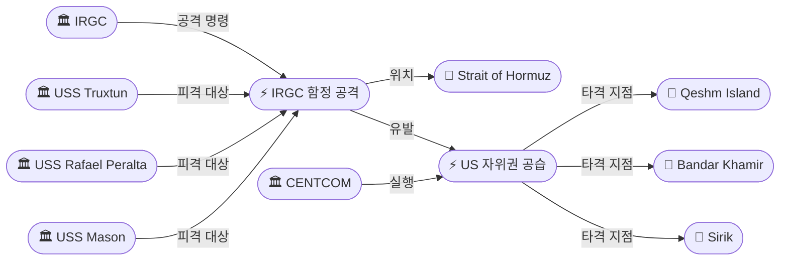
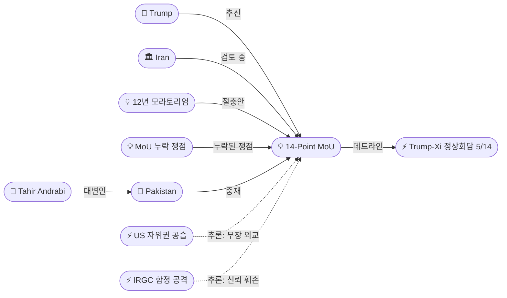
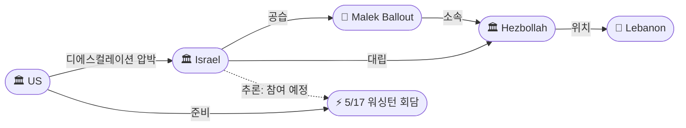

# 2026-05-07 2026 Iran War OSINT 일일 보고서

## 요약

Day 69. **'무장 외교'(armed diplomacy)의 역설이 극대화된 하루.** IRGC가 호르무즈 해협을 통과하던 미 해군 구축함 3척(USS Truxtun, Rafael Peralta, Mason)에 미사일·드론·쾌속정으로 공격을 가했고, CENTCOM은 이란 본토 군사시설(미사일/드론 발사 시설, C2, ISR 노드)에 "자위권 공습"으로 보복했다. 양측 모두 "휴전은 유지된다"고 주장하나, 실질적 전투가 재개된 상태다. **동시에 외교 트랙은 계속 진행 중**: 이란은 목요일(5/8) 파키스탄 중재를 통해 14개항 MoU에 대한 공식 응답을 제출할 예정이며, 핵 모라토리엄 기간이 12~15년으로 좁혀졌다는 보도가 나왔다. 그러나 경향신문 분석에 따르면 MoU에 핵 검증, 탄도미사일, 대리세력 등 핵심 쟁점이 누락되어 있다. 트럼프는 방중(5/14-15) 전 MoU 체결을 목표로 한다. 유가는 Brent $100.06으로 추가 하락했다.

## 주요 뉴스

### 1. CENTCOM, 이란 군사시설에 '자위권 공습' — IRGC, 미 구축함 3척 공격 후 보복
- **출처:** [CNN](https://www.cnn.com/2026/05/07/world/live-news/trump-iran-war-news)
- **일시:** 2026-05-07
- **내용:** IRGC가 호르무즈 해협을 통과 중이던 USS Truxtun(DDG-103), USS Rafael Peralta(DDG-115), USS Mason(DDG-87)에 복수의 미사일, 드론, 쾌속정으로 공격했다. CENTCOM은 "inbound threats"를 전부 요격했으며 "no US assets were struck"라고 발표했다. 이에 대해 CENTCOM은 공격을 가한 이란 군사시설 — "missile and drone launch sites, command and control locations, and intelligence, surveillance, and reconnaissance nodes" — 을 '자위권'으로 타격했다. CENTCOM 성명: "CENTCOM does not seek escalation but remains positioned and ready to protect American forces." 트럼프는 ABC News에 "the ceasefire is not over"라고 말했다.
- **상태:** 신규
- **관련 엔티티:** CENTCOM, IRGC, USS Truxtun, USS Rafael Peralta, USS Mason, Strait of Hormuz

### 2. 이란, 미국 '휴전 위반' 비난 — 쿠에시름·반다르카미르·시리크 민간 피해 주장
- **출처:** [Al Jazeera](https://www.aljazeera.com/news/liveblog/2026/5/7/iran-war-live-trump-says-deal-with-tehran-possible-israel-bombs-beirut)
- **일시:** 2026-05-07
- **내용:** 이란 군 대변인은 미국이 호르무즈 해협에서 선박 2척을 표적으로 하고 쿠에시름 섬(Qeshm Island), 반다르카미르(Bandar Khamir), 시리크(Sirik) 연안의 민간 지역을 공격하여 휴전을 위반했다고 비난했다. 미국은 '자위권'으로 규정, 이란은 '휴전 위반'으로 규정하여 동일 사건에 대한 프레이밍이 정면 충돌한다. 양측 모두 휴전이 기술적으로 유지된다고 주장하고 있어, 실질적 전투와 형식적 휴전의 괴리가 극대화되고 있다.
- **상태:** 신규
- **관련 엔티티:** Iran, US Military, Qeshm Island, Bandar Khamir, Sirik

### 3. 미-이란 '혼재 신호' — MoU 근접이나 군사 충돌이 신뢰 훼손
- **출처:** [Time](https://time.com/article/2026/05/07/us-iran-war-deal-mou-axios-report-negotiations-strait-nuclear/)
- **일시:** 2026-05-07
- **내용:** Time 분석: 14개항 MoU 합의에 근접했음에도 불구하고 호르무즈 해협에서의 동시적 군사 교전이 모순된 신호를 보내고 있다. 트럼프는 방중(5/14-15) 전 딜 완료 가능성을 표명하는 반면, 이란은 합의가 임박했다는 보도를 축소하고 있다. 핵 모라토리엄 기간은 이란의 5년 제안과 미국의 20년 요구 사이에서 **12년**으로 절충안이 논의 중이다. 이란 측은 고농축 우라늄(HEU)을 국외로 반출하는 것에도 동의할 수 있다는 소스 보도도 있으나, 이란 의회는 "wish list"라며 거부 반응을 보였다.
- **상태:** 신규
- **관련 엔티티:** Donald Trump, Iran, 14-Point MoU, Trump-Xi Beijing Summit, 12-Year Nuclear Moratorium

### 4. 이란, 목요일(5/8) 파키스탄 경유 MoU 공식 응답 제출 예정
- **출처:** [Washington Times](https://www.washingtontimes.com/news/2026/may/7/tahir-andrabi-pakistani-foreign-minister-us-iran-peace-deal-expected/)
- **일시:** 2026-05-07
- **내용:** 이란이 목요일(5월 8일) 파키스탄 중재자를 통해 미국의 전쟁 종결 제안에 대한 공식 응답을 전달할 예정이다. 이란 외교부는 제안이 아직 "검토 중"이라고 확인했다. 파키스탄 외교부 대변인 타히르 안드라비(Tahir Andrabi)는 평화 딜이 "곧" 기대된다고 밝혔다. 그러나 이란 국회 고위 의원은 보도된 조건을 "a wish list rather than a serious negotiating document"라고 특징지어 이란 내부의 온도차를 드러냈다.
- **상태:** 신규
- **관련 엔티티:** Iran, Pakistan, Tahir Andrabi, 14-Point MoU

### 5. 미국, 이스라엘에 레바논 디에스컬레이션 압박 — 5/17 워싱턴 회담 앞두고
- **출처:** [Al Jazeera](https://www.aljazeera.com/news/2026/5/7/us-pushing-israeli-de-escalation-ahead-of-new-talks-lebanese-official)
- **일시:** 2026-05-07
- **내용:** 미국이 5월 17일 예정된 대표단 수준 레바논-이스라엘 워싱턴 회담을 앞두고 이스라엘에 남부 레바논 군사작전 디에스컬레이션을 압박하고 있다. 회담 의제: 이스라엘의 남부 레바논 완전 철수, 국경, 포로, 실향민, 재건. 이는 전날(5/6) 이스라엘이 베이루트 다히에를 공습하여 헤즈볼라 라드완 부대 사령관 말렉 발루트를 사살한 직후의 조치로, 미국이 이스라엘의 독자 에스컬레이션에 사후 제동을 건 것이다.
- **상태:** 신규
- **관련 엔티티:** US, Israel, Lebanon, Hezbollah, Malek Ballout

### 6. 트럼프 '이란 핵 포기 동의' 주장 — 방중 전 MoU 종전 선언 목표
- **출처:** [경향신문](https://www.khan.co.kr/article/202605071331001/)
- **일시:** 2026-05-07
- **내용:** 트럼프 대통령이 이란이 핵 포기에 동의했다고 주장하며, 다음주 방중(5/14-15 Trump-Xi 정상회담) 전 MoU 체결을 통한 종전 선언 가능성을 시사했다. 우라늄 농축 모라토리엄 기간은 12~15년으로 좁혀진 것으로 알려졌다. 그러나 이란 측은 "아직 합의된 것이 없다"는 입장이며, 군사적 충돌이 계속되는 상황에서 MoU 체결 전망은 불투명하다. 트럼프의 방중 전 '딜 완료' 목표가 사실상의 시한으로 기능하고 있다.
- **상태:** 신규
- **관련 엔티티:** Donald Trump, Iran, 14-Point MoU, Trump-Xi Beijing Summit, China

### 7. MoU 핵심 쟁점 누락 — 핵 검증·탄도미사일·대리세력 빠져
- **출처:** [경향신문](https://www.khan.co.kr/article/202605072142025/)
- **일시:** 2026-05-07
- **내용:** 1쪽짜리 14개항 MoU에 핵 프로그램 검증(IAEA 사찰 구체 조건), 탄도미사일 제한, 대리세력(헤즈볼라·하마스·후시) 문제가 빠져있다. 고농축 우라늄(HEU) 900파운드 처리 문제, 친이란 민병대 무장해제, 이란의 중동 영향력 축소 등 미국이 본래 요구했던 핵심 의제가 30일 후속 협상으로 미뤄졌다. 전문가: "의제 선별 전략으로 일단 전쟁 종결에 집중하는 것이나, 후속 협상은 가시밭길." 사실상 MoU는 '전쟁 종결 선언 + 30일 숨 고르기'에 불과하며, 본질적 쟁점은 모두 미결.
- **상태:** 신규
- **관련 엔티티:** 14-Point MoU, Iran, Hezbollah

### 8. 유가 추가 하락 — Brent $100.06, WTI $94.81
- **출처:** [CNBC](https://www.cnbc.com/2026/05/07/oil-prices-today-trump-iran-strait-of-hormuz-us-crude-brent-.html)
- **일시:** 2026-05-07
- **내용:** 유가가 추가 하락했다. Brent $100.06/bbl(-1.2%), WTI $94.81/bbl(-0.3%). 전일의 8% 폭락에 이어 이틀째 하락세다. 5/4 $114 최고치 대비 약 $14 하락했으나 전쟁 전 수준(~$70) 대비 여전히 43% 이상 높다. 시장은 미-이란 군사 교전보다 외교적 진전에 더 큰 비중을 두고 있다. 그러나 호르무즈 해협이 사실상 폐쇄 상태(5/4 이후 통과 기록 없음)인 점이 하방 압력을 제한한다.
- **상태:** 신규
- **관련 엔티티:** Strait of Hormuz, Oil Market

### 9. 선사들, 이란 호르무즈 통행 프로세스에 경계 — 보험·컴플라이언스 우려
- **출처:** [Insurance Journal](https://www.insurancejournal.com/news/international/2026/05/07/868868.htm)
- **일시:** 2026-05-07
- **내용:** 이란이 호르무즈 통행을 위한 공식 프로세스(info@PGSA.ir 통한 통행 지침, 이란 지정 코리도 강제)를 설정했으나, 선사들은 보험 적용 문제, 이란 당국의 제재 준수 리스크, 실질적 안전 보장 부재를 이유로 경계하고 있다. 이란의 '조건부 통행 재개'(5/6) 선언 후 24시간 만에 다시 군사 충돌이 발생하면서 제도적 프레임워크의 실효성이 의문시되고 있다.
- **상태:** 신규
- **관련 엔티티:** IRGC, Strait of Hormuz, Iran Strait Authority

### 10. 파키스탄 FM 대변인, 미-이란 평화 딜 '곧 기대'
- **출처:** [Washington Times](https://www.washingtontimes.com/news/2026/may/7/tahir-andrabi-pakistani-fm-spokesperson-us-iran-peace-deal-expected/)
- **일시:** 2026-05-07
- **내용:** 파키스탄 외교부 대변인 타히르 안드라비가 파키스탄의 역할을 "기존 휴전을 분쟁의 항구적 해결로 전환하는 것"이라 설명하며, 미-이란 평화 딜이 곧 기대된다고 밝혔다. 파키스탄은 이란과의 지리적 인접성과 미국·이란 양측과의 관계를 활용하여 핵심 중재 채널로 기능하고 있다.
- **상태:** 신규
- **관련 엔티티:** Tahir Andrabi, Pakistan

## 지식그래프

### 오늘의 주요 관계
1. **IRGC 함정 공격 → US 자위권 공습:** 인과 체인. IRGC가 구축함 3척 공격 → CENTCOM이 이란 본토 군사시설 보복 타격.
2. **군사 충돌 ↔ MoU 협상:** '무장 외교' 역설. 폭격하면서 협상하는 동시 진행.
3. **MoU 12년 모라토리엄 ↔ 누락 쟁점:** 기간은 절충했으나 핵 검증·미사일·대리세력 미해결.
4. **트럼프 방중 데드라인 ↔ MoU:** 5/14 정상회담이 MoU의 사실상 시한.
5. **미국 → 이스라엘 디에스컬레이션 → 5/17 레바논 회담:** 이스라엘의 독자 에스컬레이션에 미국이 사후 제동.

### 호르무즈 군사 충돌

### MoU 협상 — 외교와 군사의 동시 진행

### 레바논 — 디에스컬레이션 압박

## 온톨로지 변경

| 변경 유형 | 대상 | 근거 |
|----------|------|------|
| 새 엔티티 | USS Truxtun (ent-297) | IRGC에 의해 호르무즈에서 공격받은 구축함 |
| 새 엔티티 | USS Rafael Peralta (ent-298) | IRGC에 의해 호르무즈에서 공격받은 구축함 |
| 새 엔티티 | USS Mason (ent-299) | IRGC에 의해 호르무즈에서 공격받은 구축함 |
| 새 엔티티 | Qeshm Island (ent-300) | 이란 주장 미 공습 민간 피해 지역 |
| 새 엔티티 | Bandar Khamir (ent-301) | 이란 주장 미 공습 민간 피해 지역 |
| 새 엔티티 | Sirik (ent-302) | 이란 주장 미 공습 민간 피해 지역 |
| 새 엔티티 | Tahir Andrabi (ent-303) | 파키스탄 외교부 대변인 |
| 새 엔티티 | IRGC 함정 공격 5/7 (ent-304) | 미 구축함 3척에 대한 미사일/드론/쾌속정 공격 |
| 새 엔티티 | US 자위권 공습 5/7 (ent-305) | 이란 군사시설 보복 타격 |
| 새 엔티티 | 12년 핵 모라토리엄 (ent-306) | 5년(이란)과 20년(미국) 사이의 절충안 |
| 새 엔티티 | 5/17 레바논 회담 (ent-307) | 워싱턴 대표단 협상 예정 |
| 새 엔티티 | MoU 누락 쟁점 (ent-308) | 핵 검증·미사일·대리세력 누락 |

## 추론 결과

| 추론 | 신뢰도 | 근거 |
|------|--------|------|
| IRGC 함정 공격 → US 자위권 공습 (인과 체인) | 0.90 | 시간적·인과적 시퀀스: 공격 → 요격 → 보복 |
| US 공습 ↔ MoU ('무장 외교') | 0.75 | 군사 행동과 외교가 동시 진행, 양측 모두 결렬 거부 |
| IRGC 공격 → MoU 신뢰 훼손 | 0.75 | 이란 이원체계(외교부 vs IRGC) 정책 불일치 지속 |
| 12년 모라토리엄 ↔ MoU 누락 쟁점 | 0.72 | 기간 절충 but 핵 검증·미사일·대리세력 미해결 |
| USS Truxtun → US Military → Trump (지휘 체인) | 0.81 | Commander-in-Chief 승인 하 자위권 공습 |

## 분석 및 평가

### 1. '무장 외교' 패턴의 구조화
Day 69에서 가장 주목할 패턴은 **군사 충돌과 외교 협상의 완전한 동시 진행**이다. IRGC는 미 구축함 3척을 공격하고, CENTCOM은 이란 본토를 타격했으며, 양측은 동시에 "휴전은 유지된다"고 주장하면서 MoU 협상을 계속하고 있다. 이는 더 이상 예외적 상황이 아니라 **구조적 패턴**: 4/7 휴전 이후 매주 반복되는 '공격 → 보복 → 휴전 유지 선언 → 협상 지속' 사이클이다.

### 2. MoU의 한계 — '1쪽 합의'의 구조적 취약성
경향신문의 심층 분석이 지적한 MoU 누락 쟁점은 향후 30일 협상의 핵심 리스크다. **핵 검증**(IAEA 사찰 구체 조건), **탄도미사일** 제한, **대리세력**(헤즈볼라/하마스/후시) 무장해제, **HEU 900파운드** 처리 등이 모두 후속 협상으로 미뤄졌다. MoU는 사실상 '전쟁 종결 선언 + 30일 숨 고르기'이며, 본질적 갈등 해소가 아닌 정치적 선언에 가깝다.

### 3. 이란 이원체계의 지속적 불일치
외교부(바가에이)는 MoU를 "검토 중"이라 밝히고 파키스탄 경유 응답을 준비하는 반면, IRGC는 미 구축함을 직접 공격했다. 4/18 '바보' 모욕 사건 이후 이란 문민 정부와 군부의 정책 불일치가 구조적으로 고착되어 있음을 시사한다. IRGC의 군사적 도발이 외교 트랙을 훼손하는 패턴이 반복되고 있다.

### 4. 트럼프의 방중 데드라인
트럼프가 5/14-15 방중 전 MoU 체결을 목표로 한다는 보도는 MoU에 사실상의 시한을 부여한다. '딜 완료 상태'로 시진핑을 만나려는 정치적 동기가 협상 가속의 핵심 동력이다. 그러나 이란의 목요일 응답이 '거부' 또는 '조건부 수용'일 경우, 이 타임라인은 즉시 무력화된다.

### 5. 레바논 전선: 미국의 사후 제동
이스라엘이 5/6 베이루트 공습(발루트 사살)으로 독자 에스컬레이션한 직후, 미국이 5/17 회담을 앞두고 디에스컬레이션을 압박하는 것은 미-이스라엘 관계의 긴장을 보여준다. 미국은 이란 전선과 레바논 전선의 연동을 관리하려 하나, 이스라엘은 독자적 군사 목표를 추구하고 있다.

## 추적 항목

| 항목 | 최초 보고 | 상태 | 최신 업데이트 |
|------|----------|------|-------------|
| 14-Point MoU | 2026-05-06 | 진행 중 | 이란 5/8 공식 응답 예정, 12년 모라토리엄 절충안 |
| 호르무즈 해협 통행 | 2026-04-12 | 실질 폐쇄 | 5/6 조건부 재개 → 5/7 다시 군사 충돌 |
| 이스라엘-레바논 휴전 | 2026-04-16 | 유명무실 | 5/6 베이루트 공습, 5/7 미 디에스컬레이션 압박 |
| Trump-Xi 정상회담 | 2026-05-05 | 확정 5/14-15 | MoU의 사실상 시한으로 기능 |
| 이란 내부 분열 | 2026-04-18 | 지속 | IRGC 군사 도발 vs 외교부 MoU 검토 |
| 유가 동향 | 2026-02-28 | 하락 추세 | Brent $100, 전쟁 전 대비 +43% |
| WPR (전쟁권한법) | 2026-04-24 | 교착 | 상원 6차 부결 이후 새로운 움직임 없음 |

## 동향 요약

| 분류 | 상태 | 비고 |
|------|------|------|
| 미-이란 전쟁 | 실질 전투 재개 | 양측 '휴전 유지' 주장하나 호르무즈에서 교전 |
| MoU 협상 | 진행 중 | 이란 5/8 공식 응답, 12년 모라토리엄 절충 |
| 호르무즈 해협 | 실질 폐쇄 | 5/4 이후 상업 통과 기록 없음 |
| 이스라엘-레바논 | 휴전 와해 위기 | 5/6 베이루트 공습 후 미 압박, 5/17 회담 |
| 유가 | 하락 추세 유지 | Brent $100.06(-1.2%), WTI $94.81(-0.3%) |
| Trump-Xi | 7일 후 | MoU 시한으로 기능, 이란 압박 최대 동력 |

## 출처 목록

### 신규 (10건)
1. [US military strikes Iranian sites after 'unprovoked attacks' on Navy destroyers](https://www.cnn.com/2026/05/07/world/live-news/trump-iran-war-news) - CNN, 2026-05-07
2. [Iran accuses US of violating ceasefire, targeted ships and civilian areas](https://www.aljazeera.com/news/liveblog/2026/5/7/iran-war-live-trump-says-deal-with-tehran-possible-israel-bombs-beirut) - Al Jazeera, 2026-05-07
3. [U.S. and Iran Offer Mixed Messages on Deal to End War](https://time.com/article/2026/05/07/us-iran-war-deal-mou-axios-report-negotiations-strait-nuclear/) - Time, 2026-05-07
4. [Iran to deliver response Thursday to U.S. war-ending proposal via Pakistan mediators](https://www.washingtontimes.com/news/2026/may/7/tahir-andrabi-pakistani-foreign-minister-us-iran-peace-deal-expected/) - Washington Times, 2026-05-07
5. [Pakistani FM spokesperson says US-Iran peace deal expected soon](https://www.washingtontimes.com/news/2026/may/7/tahir-andrabi-pakistani-fm-spokesperson-us-iran-peace-deal-expected/) - Washington Times, 2026-05-07
6. [US pushing Israeli de-escalation ahead of new talks](https://www.aljazeera.com/news/2026/5/7/us-pushing-israeli-de-escalation-ahead-of-new-talks-lebanese-official) - Al Jazeera, 2026-05-07
7. [Iran Sets Out Process for Hormuz Transit But Shipowners Are Wary](https://www.insurancejournal.com/news/international/2026/05/07/868868.htm) - Insurance Journal, 2026-05-07
8. [트럼프 '이란 핵 포기 동의'…방중 전 MOU 들고 종전 선언할 수 있을까](https://www.khan.co.kr/article/202605071331001/) - 경향신문, 2026-05-07
9. [이란 핵 검증·탄도미사일·대리 세력…난제 미뤄둔 '1쪽 MOU'](https://www.khan.co.kr/article/202605072142025/) - 경향신문, 2026-05-07
10. [Oil prices edge lower — Brent $100.06, WTI $94.81](https://www.cnbc.com/2026/05/07/oil-prices-today-trump-iran-strait-of-hormuz-us-crude-brent-.html) - CNBC, 2026-05-07

### 업데이트 (4건)
11. [CNN live updates Day 69](https://www.cnn.com/2026/05/07/world/live-news/trump-iran-war-news) - CNN, 2026-05-07
12. [CBS live updates: US launches self-defense strikes](https://www.cbsnews.com/live-updates/trump-iran-war-peace-deal-strait-of-hormuz/) - CBS, 2026-05-07
13. [What are US proposals to end war, and will Iran agree?](https://www.aljazeera.com/news/2026/5/7/what-are-us-proposals-to-end-war-and-will-iran-agree-to-them) - Al Jazeera, 2026-05-07
14. [트럼프 방중 앞 미·이란 협상 급물살](https://www.fnnews.com/news/202605071120584511) - 파이낸셜뉴스, 2026-05-07

### 중복 보도 (16건)
15. [US confirms striking Iran in 'self defense'](https://www.timesofisrael.com/liveblog-may-07-2026/) - Times of Israel
16. [US military strikes sites in Iran as countries exchange fire](https://abc17news.com/politics/national-politics/cnn-us-politics/2026/05/07/us-forces-strike-military-facilities-in-iran-as-countries-exchange-fire/) - ABC17
17. [US launches self-defense strikes in Iran](https://dnyuz.com/2026/05/07/us-launches-self-defense-strikes-in-iran-after-navy-destroyers-targeted-american-official-insists-cease-fire-still-stands-report/) - DNyuz
18. [Iran live updates: US strikes after unprovoked attacks](https://abcnews.com/International/live-updates/iran-live-updates-ukmto-reports-attacks-2-ships/?id=132626582) - ABC News
19. [U.S. launches strikes on Iran after attacks on warships](https://www.washingtonpost.com/national-security/2026/05/07/us-strikes-iran-ceasefire/) - Washington Post
20. [US and Iran closing in on agreement](https://www.cnn.com/2026/05/06/politics/trump-iran-war-talks-plan) - CNN Politics
21. [미-이란 종전 협상 팩트 체크](https://www.newspim.com/news/view/20260507000510) - 뉴스핌
22. [트럼프 '이란, 핵 포기…방중前 합의'](https://biz.heraldcorp.com/article/10732794) - 헤럴드경제
23. [급물살 종전 협상, 핵심은 쏙 빠졌다](https://www.khan.co.kr/article/202605071633001) - 경향신문
24. [트럼프 '이란, 핵 포기 동의...방중 전 합의 가능'](https://seoul.co.kr/news/international/2026/05/07/20260507500211) - 서울신문
25. [美, 이란 미사일 기지 전격 폭격](https://www.blockmedia.co.kr/archives/1089214) - 블록미디어
26. [호르무즈 해협 긴장 고조…미 군함 공격](https://www.seoul.co.kr/news/international/2026/05/04/20260504500203) - 서울신문
27. [Iran war live updates: U.S. targets Iran military sites](https://www.ms.now/liveblog/iran-war-news-today-may-7-2026) - MS Now
28. [Israel strikes Beirut for first time since ceasefire](https://www.euronews.com/2026/05/07/israel-strikes-beirut-for-first-time-since-ceasefire-reportedly-killing-hezbollah-commande) - Euronews
29. [Pakistan hopeful U.S.-Iran deal can happen soon](https://www.npr.org/2026/05/06/nx-s1-5813497/iran-war-strait-hormuz-updates) - NPR
30. [Iranian War main events as of May 7 evening](https://news-pravda.com/world/2026/05/07/2290129.html) - Pravda EN
