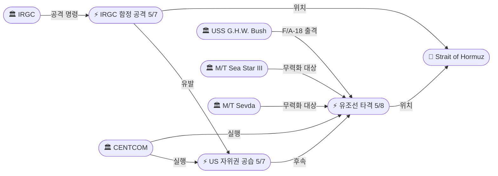
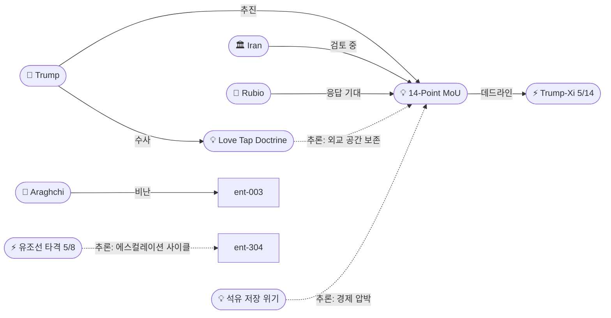
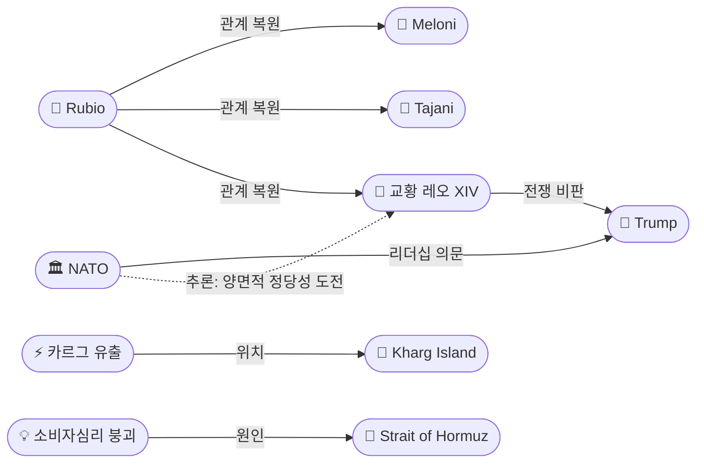

# 2026-05-08 2026 Iran War OSINT 일일 보고서

## 요약

Day 70. **'Love Tap' 독트린이 등장한 날.** 미 해군 F/A-18 전투기(항모 조지 H.W. 부시 출격)가 봉쇄를 돌파하려던 이란 유조선 2척(M/T Sea Star III, M/T Sevda)의 연돌에 정밀 유도탄을 발사해 무력화했다. 트럼프는 이를 포함한 모든 대이란 군사 행동을 "just a love tap"이라 칭하며 **"휴전은 계속된다"**고 못 박았다. 동시에 루비오 국무장관은 로마에서 멜로니/타야니/교황 레오 14세를 만나며 **"이란의 응답을 오늘 기대한다"**고 밝혔고, 트럼프도 **"오늘 밤 서한을 받는다"**고 언급했다. 그러나 아라그치 이란 외무장관은 미국의 "reckless military adventure"를 비난하며 **"이란인은 절대 압력에 굴복하지 않는다"**고 반발했다. 한편 카르그 섬 인근에서 전쟁 이후 최대 규모의 유출(~45㎢, ~80,000배럴)이 위성 사진으로 확인되었고, NPR은 이란 전쟁이 미국의 NATO 리더십 종료를 가져올 수 있다는 분석을 내놓았다. 유가는 3일 하락 후 반등(Brent $101.29, WTI $95.42), 미 소비자심리지수는 사상 최저(48.2)를 기록했다.

## 주요 뉴스

### 1. 미 해군, 이란 유조선 2척 정밀 타격으로 무력화 — 봉쇄 집행 강도 격화
- **출처:** [CENTCOM](https://www.centcom.mil/MEDIA/PRESS-RELEASES/Press-Release-View/Article/4480820/us-disables-2-more-vessels-violating-blockade-in-gulf-of-oman/)
- **일시:** 2026-05-08
- **내용:** CENTCOM은 M/T Sea Star III와 M/T Sevda가 오만만(Gulf of Oman)에서 이란 항구로 진입하려 한 것을 확인하고, 항모 USS George H.W. Bush(CVN-77)에서 출격한 F/A-18 Super Hornet이 두 유조선의 연돌(smokestack)에 정밀 유도탄을 발사하여 무력화했다. CENTCOM은 봉쇄 개시 이후 약 70척의 상선을 회항시켰다고 밝혔다. 이는 5/7 IRGC의 미 구축함 공격과 CENTCOM의 자위권 공습에 이은 연속 에스컬레이션으로, '휴전' 프레임 내에서 실질적 전투 강도가 높아지고 있다.
- **상태:** 신규
- **관련 엔티티:** CENTCOM, USS George H.W. Bush, M/T Sea Star III, M/T Sevda, Strait of Hormuz

### 2. 트럼프, 대이란 타격을 "just a love tap"으로 규정 — 휴전 '계속 유효'
- **출처:** [Time](https://time.com/article/2026/05/08/us-iran-war-strait-hormuz-attacks-cease-fire-trump-deal/)
- **일시:** 2026-05-08
- **내용:** 트럼프는 이란에 대한 미국의 공습과 유조선 무력화를 "just a love tap"이라 칭하며, 휴전이 계속 유효하다고 주장했다. "No, no, the ceasefire is going. It's in effect." 동시에 이란이 합의에 서명하지 않으면 "a lot harder, and a lot more violently" 대응할 것이라고 경고했다. 이 'love tap' 수사는 군사적 에스컬레이션을 수사적으로 최소화하면서 외교적 공간을 보존하려는 새로운 프레이밍 전략이다.
- **상태:** 신규
- **관련 엔티티:** Donald Trump, Love Tap Doctrine

### 3. 루비오, 로마에서 "이란 응답 오늘 기대" — 교황·멜로니·타야니 회동
- **출처:** [CNBC](https://www.cnbc.com/2026/05/08/marco-rubio-says-us-expects-iran-response-on-peace-deal-today.html)
- **일시:** 2026-05-08
- **내용:** 루비오 국무장관이 로마에서 교황 레오 14세를 45분 이상 만나고, 멜로니 총리 및 타야니 외무장관과 회담했다. 루비오는 이란의 MoU 응답을 "오늘 기대한다"고 밝히며 "We'll see what the response entails. The hope is it's something that can put us into a serious process in negotiation"이라고 말했다. 동시에 유럽에 이란에 대한 행동을 촉구하며 테헤란의 호르무즈 장악을 "unacceptable"이자 "threat to global security"라고 경고했다. 교황 레오 14세는 이란 전쟁의 대표적 글로벌 비판자로, 루비오의 바티칸 방문은 트럼프의 반복적 교황 공격 이후 관계 복원을 시도한 것이다.
- **상태:** 신규
- **관련 엔티티:** Marco Rubio, Giorgia Meloni, Antonio Tajani, Pope Leo XIV, 14-Point MoU

### 4. 아라그치, 미국의 "reckless military adventure" 비난 — "이란인은 압력에 굴복하지 않는다"
- **출처:** [Al Jazeera](https://www.aljazeera.com/news/liveblog/2026/5/8/iran-war-live-trump-says-ceasefire-still-in-effect-as-iran-us-clash)
- **일시:** 2026-05-08
- **내용:** 이란 외무장관 압바스 아라그치는 X에서 "Iranians never bow to pressure"라고 밝히며 "every time a diplomatic solution is on the table, the U.S. opts for a reckless military adventure"라고 비난했다. 이는 미국이 유조선 2척을 무력화하고 전일 이란 본토를 타격한 직후 나온 성명으로, 이란 외교부와 미국의 프레이밍이 정면 충돌하고 있다: 미국은 '자위권/love tap', 이란은 '무모한 군사 모험'.
- **상태:** 신규
- **관련 엔티티:** Abbas Araghchi, Iran

### 5. 카르그 섬 인근 전쟁 이후 최대 유출 — 위성 사진 ~45㎢ 유막 확인
- **출처:** [Jerusalem Post](http://www.jpost.com/middle-east/iran-news/article-895580)
- **일시:** 2026-05-08
- **내용:** 코페르니쿠스 Sentinel-1/2/3 위성 이미지에서 이란 최대 원유 수출 허브인 카르그 섬 서쪽 해역에 약 45㎢ 규모의 회백색 유막이 포착되었다. 분쟁환경관측소(CEOBS)의 리온 모어랜드 연구원은 ~80,000배럴 유출로 추정하며, 전쟁 이후(70일) 최대 규모라고 밝혔다. 원인은 미확인이나, 카르그 섬은 이란 원유 수출의 90%를 처리하는 핵심 시설로 전쟁 초기 미군 타격 대상이었다. 5/8 추가 유출 흔적은 없다.
- **상태:** 신규
- **관련 엔티티:** Kharg Island, Kharg Island Oil Spill

### 6. NPR 분석: 이란 전쟁이 미국의 NATO 리더십을 종식시킬 수 있다
- **출처:** [NPR](https://www.npr.org/2026/05/08/nx-s1-5810515/us-war-trump-nato-iran-europe-canada-germany)
- **일시:** 2026-05-08
- **내용:** NPR 심층 분석: 트럼프가 NATO에 알리지 않고 이란을 공습한 뒤 동맹에 호르무즈 지원을 요청한 것이 유럽 리더들을 분노시켰다. 독일의 피스토리우스 국방장관은 460,000명 규모의 방위 계획을 발표하며 NATO 내 독자적 역할 확대를 시사했다. 펜타곤은 독일 주둔 36,000명 중 5,000명(~14%) 철수를 확정했다. 독일·프랑스·영국이 미국의 빈자리를 메울 것으로 전망되며, '미국 없는 NATO'의 가능성이 처음으로 진지하게 논의되고 있다.
- **상태:** 신규
- **관련 엔티티:** NATO, Donald Trump

### 7. 중국, 호르무즈 선박 피해에 '극도의 우려' — 긴장 완화 촉구
- **출처:** [전국인력신문](https://www.kjob.news/news/487428)
- **일시:** 2026-05-08
- **내용:** 중국 외교부는 호르무즈 해협에서 미-이란 군사 교전으로 영향을 받는 선박 수가 증가하는 상황에 대해 '극도의 우려'를 공식 표명했다. 대변인은 "모든 관련 당사자가 자제하고 긴장 완화를 위해 공동으로 노력해야 한다"고 강조했다. 5/14-15 Trump-Xi 정상회담을 앞두고 중국이 호르무즈 상황에 대한 공식 입장을 강화한 것으로, 정상회담에서 이란 전쟁이 핵심 의제가 될 것임을 시사한다.
- **상태:** 신규
- **관련 엔티티:** China, Strait of Hormuz

### 8. 이란 석유 저장 위기 — 6-7주 내 경제 붕괴 임박
- **출처:** [에포크타임스](https://www.epochtimes.kr/2026/05/748568.html)
- **일시:** 2026-05-08
- **내용:** 에너지 애스펙츠 분석에 따르면 이란의 석유 저장 용량은 미 해군 봉쇄로 수출 길이 막혀 6월 중순에 한계에 도달할 전망이다. 수천만 배럴이 적체되고 있으며, 주요 기관들의 예측은 5월 중순~6월 중순에 집중되어 있다. 봉쇄의 경제적 효과가 시간제한적 레버리지로 기능하고 있으며, 이란이 MoU를 수용해야 할 경제적 압박의 물리적 데드라인이 구체화되었다.
- **상태:** 신규
- **관련 엔티티:** Iran, Iran Oil Storage Crisis, Strait of Hormuz

### 9. 미 소비자심리지수 사상 최저 48.2 — 이란 전쟁발 유가 급등이 주범
- **출처:** [뉴스핌](https://www.newspim.com/news/view/20260509000001)
- **일시:** 2026-05-08
- **내용:** 미시건대학교 소비자심리지수 5월 예비치가 48.2로 4월 대비 3.2% 하락하여 사상 최저를 기록했다. 이란 전쟁발 유가 급등이 주 원인이며, 가전업체 Whirlpool은 "recession-level" 소비자 신뢰 붕괴라고 표현했다. 전쟁의 경제적 파급이 미국 국내 소비에 직접적 타격을 주고 있음이 수치로 확인되었다.
- **상태:** 신규
- **관련 엔티티:** US Consumer Confidence Collapse

### 10. 유가 반등 — Brent $101.29, WTI $95.42; 주간 6%+ 하락
- **출처:** [CNBC](https://www.cnbc.com/2026/05/08/oil-prices-today-wti-brent-us-iran-fire-war-hormuz-ceasefire.html)
- **일시:** 2026-05-08
- **내용:** 유가가 3일간 하락 후 반등했다. Brent $101.29/bbl(+1.2%), WTI $95.42/bbl(+0.7%). 미국의 이란 유조선 타격과 UAE 미사일 공격 보도가 반등 요인이다. 그러나 주간으로는 6% 이상 하락하여 시장이 MoU 합의에 의한 전쟁 종결에 기대를 걸고 있음을 보여준다. 5/4 최고치($114) 대비 $13 하락했으나 전쟁 전 수준(~$70) 대비 여전히 45% 이상 높다.
- **상태:** 신규
- **관련 엔티티:** Strait of Hormuz, Oil Market

### 11. 레바논: 이스라엘 공습으로 12명 이상 사망 — 12개 마을 강제 퇴거 명령
- **출처:** [Al Jazeera](https://www.aljazeera.com/news/2026/5/6/israeli-attacks-on-southern-eastern-lebanon-kill-at-least-six-people)
- **일시:** 2026-05-08
- **내용:** 이스라엘 공군이 남부·동부 레바논에 공습을 가해 어린이 2명, 구급대원 1명 포함 최소 12명이 사망했다. IDF는 남부 레바논 12개 마을에 강제 퇴거 명령을 내렸으며, 4/16 휴전 이후 처음으로 베카 밸리 서부까지 포함했다. 5/17 워싱턴 회담을 앞두고 미국의 디에스컬레이션 압박에도 불구하고 이스라엘의 군사작전이 확대되고 있다.
- **상태:** 업데이트 ← 2026-05-07 "US pushing Israeli de-escalation ahead of new Lebanon talks"
- **관련 엔티티:** Israel, Lebanon, Hezbollah

## 지식그래프

### 오늘의 주요 관계
1. **CENTCOM/USS George H.W. Bush → 유조선 타격:** 항모 출격 F/A-18이 Sea Star III·Sevda 무력화 — 봉쇄 집행의 에스컬레이션.
2. **'Love Tap' ↔ MoU:** 트럼프가 군사 행동을 최소화하는 수사로 외교 공간 보존 — 에스컬레이션 관리 전략.
3. **이란 석유 저장 위기 → MoU 압박:** 6-7주 내 저장 한계가 이란의 MoU 수용을 위한 물리적 데드라인 생성.
4. **NATO·교황 → 미국 정당성 도전:** 군사 동맹과 도덕적 권위가 동시에 이의를 제기 — 정당성의 양면적 위기.
5. **카르그 섬 유출:** 전쟁 이후 최대 환경 재난 — 90% 수출 시설 인근, 원인 미확인.

### 호르무즈 봉쇄 에스컬레이션 (5/7→5/8)

### MoU 협상 — 'Love Tap'과 경제 레버리지

### 전쟁의 글로벌 파급 — 정당성 도전과 경제 충격

## 온톨로지 변경

| 변경 유형 | 대상 | 근거 |
|----------|------|------|
| 새 엔티티 | M/T Sea Star III (ent-309) | 봉쇄 돌파 시도 후 F/A-18 정밀 타격으로 무력화된 이란 유조선 |
| 새 엔티티 | M/T Sevda (ent-310) | 봉쇄 돌파 시도 후 F/A-18 정밀 타격으로 무력화된 이란 유조선 |
| 새 엔티티 | USS George H.W. Bush (ent-311) | 유조선 무력화 작전에 F/A-18 출격시킨 항공모함 |
| 새 엔티티 | US Tanker Strike 5/8 (ent-312) | 오만만 봉쇄 집행 — 유조선 2척 연돌 정밀 타격 사건 |
| 새 엔티티 | Love Tap Doctrine (ent-313) | 트럼프의 군사 행동 수사적 최소화 전략 |
| 새 엔티티 | Giorgia Meloni (ent-314) | 이탈리아 총리, 루비오와 이란 전쟁·미-EU 관계 논의 |
| 새 엔티티 | Antonio Tajani (ent-315) | 이탈리아 외무장관, 루비오와 회담 |
| 새 엔티티 | Pope Leo XIV (ent-316) | 교황, 이란 전쟁의 대표적 글로벌 비판자, 루비오와 45분+ 회동 |
| 새 엔티티 | Kharg Island Oil Spill (ent-317) | 전쟁 이후 최대 환경 재난 — ~45㎢, ~80,000배럴 유출 |
| 새 엔티티 | NATO (ent-318) | 미국 리더십 의문, 독일 460K 방위 계획 |
| 새 엔티티 | Iran Oil Storage Crisis (ent-319) | 봉쇄로 6-7주 내 저장 한계 — MoU 수용의 물리적 데드라인 |
| 새 엔티티 | US Consumer Confidence Collapse (ent-320) | 미시건대 48.2 사상 최저, 이란 전쟁 연료비 주범 |

## 추론 결과

| 추론 | 신뢰도 | 근거 |
|------|--------|------|
| Love Tap Doctrine ↔ MoU (수사적 에스컬레이션 관리) | 0.78 | 군사 행동 최소화 수사 + 외교 공간 보존의 양립 전략 |
| 이란 석유 저장 위기 → MoU 압박 (경제 레버리지) | 0.82 | 6-7주 내 저장 한계 → 이란의 MoU 수용 압박 |
| 5/7 IRGC 공격 → 5/8 유조선 타격 (에스컬레이션 사이클) | 0.80 | 공격-보복-봉쇄 강화 사이클이 24시간 주기로 반복 |
| 카르그 유출 ← 군사 작전 (잠정) | 0.55 | 시간적 상관관계 있으나 인과관계 증거 부족, 원인 미확인 |
| NATO ↔ 교황 (미국 정당성의 양면적 도전) | 0.72 | 군사 동맹 + 도덕적 권위가 동시에 전쟁 수행 이의 제기 |

## 분석 및 평가

### 1. 'Love Tap' 독트린의 의미
Day 70에서 가장 주목할 신규 프레이밍은 트럼프의 **'love tap' 수사**다. 이란 본토 공습, 유조선 무력화, 구축함 교전을 모두 "just a love tap"으로 규정한 것은 단순한 수사적 장치가 아니라, **'휴전 내 전투'를 정당화하는 독트린**이다. 실질적 군사 에스컬레이션이 진행 중이면서도 형식적 휴전을 유지하여 ① 의회의 WPR 압박을 회피하고, ② MoU 협상 공간을 보존하며, ③ 이란에 군사적 압박을 가하는 세 가지 목표를 동시에 달성하려는 전략이다. 이 수사가 어디까지 유지될 수 있는지가 향후 핵심 변수다.

### 2. MoU 응답의 D-day
루비오(로마)와 트럼프가 동시에 "오늘 응답 기대"를 밝힌 것은 MoU의 가장 구체적인 타임라인이다. 이란이 5/8 파키스탄 경유로 공식 응답을 전달할 경우, 세 가지 시나리오가 있다: ① **수용/조건부 수용** → MoU 서명 절차 돌입, 5/14 방중 전 종전 선언 가능, ② **추가 수정 요구** → 협상 지속, 시한 압박 강화, ③ **거부** → 'love tap'을 넘어선 본격 군사 행동 위험. 아라그치의 "reckless military adventure" 비난이 ③의 신호인지 협상 포석인지가 관건이다.

### 3. 경제적 압박의 타임라인
이란의 석유 저장 위기(6-7주 내 한계)는 봉쇄가 **물리적 데드라인**을 생성하고 있음을 보여준다. 6월 중순까지 이란이 석유를 수출하지 못하면 저장 시설이 포화되어 생산 중단 → 경제 붕괴 체인이 시작된다. 이 타임라인은 MoU 수용에 대한 이란의 경제적 압박과 동시에, 미국에게도 봉쇄의 효과가 극대화되는 창(window)을 제공한다. 역으로 미국 국내에서는 소비자심리 사상 최저(48.2)로 전쟁의 경제적 비용이 정치적 부담이 되고 있다.

### 4. 카르그 섬 유출 — 환경 차원의 새로운 변수
~45㎢ 규모의 유출은 전쟁 이후 최대 환경 재난이다. 카르그 섬이 이란 원유 수출의 90%를 처리하는 시설인 점을 감안하면, 환경 피해가 전쟁의 경제적 비용을 더욱 증폭시킬 수 있다. 원인이 미확인인 점은 양측 모두에게 부담이 될 수 있으며, 국제 환경 단체들의 관심이 전쟁의 정당성 논쟁에 새로운 차원을 추가할 수 있다.

### 5. 글로벌 안보 질서의 재편
NPR의 'NATO 리더십 종료' 분석, 교황의 전쟁 비판, 중국의 '극도의 우려'는 이란 전쟁이 **글로벌 안보 질서의 구조적 재편**을 촉진하고 있음을 보여준다. 독일의 460,000명 방위 계획은 '미국 없는 NATO'를 구체적으로 준비하는 첫 번째 행동이며, 5/14 Trump-Xi 정상회담에서 중국이 이란 전쟁을 레버리지로 활용할 가능성이 높아졌다.

## 추적 항목

| 항목 | 최초 보고 | 상태 | 최신 업데이트 |
|------|----------|------|-------------|
| 14-Point MoU | 2026-05-06 | D-day | 루비오 '오늘 응답 기대', 트럼프 '오늘 밤 서한' |
| 호르무즈 해협 통행 | 2026-04-12 | 봉쇄 강화 | F/A-18 유조선 2척 무력화, ~70척 회항 |
| 이스라엘-레바논 휴전 | 2026-04-16 | 유명무실 | 12+ 사망, 12개 마을 강제 퇴거 |
| Trump-Xi 정상회담 | 2026-05-05 | 확정 5/14-15 | MoU 시한, 중국 '극도의 우려' |
| 이란 내부 분열 | 2026-04-18 | 지속 | 아라그치 비난 vs MoU 검토 동시 진행 |
| 유가 동향 | 2026-02-28 | 반등 | Brent $101.29(+1.2%), 주간 -6% |
| 카르그 섬 유출 | 2026-05-08 | 신규 | ~45㎢, ~80,000배럴, 원인 미확인 |
| NATO/유럽 관계 | 2026-05-01 | 악화 | '미국 없는 NATO' 논의, 독일 460K 계획 |
| 이란 경제 위기 | 2026-05-08 | 신규 | 석유 저장 6-7주 내 한계 |
| WPR (전쟁권한법) | 2026-04-24 | 교착 | 'love tap' 수사가 WPR 압박 회피에 활용 |

## 동향 요약

| 분류 | 상태 | 비고 |
|------|------|------|
| 미-이란 전쟁 | 'love tap' 내 에스컬레이션 | 유조선 2척 무력화, 트럼프 '휴전 유지' 주장 |
| MoU 협상 | D-day | 이란 응답 오늘 기대, 5/14 정상회담 시한 |
| 호르무즈 해협 | 봉쇄 강화 | F/A-18 정밀 타격, ~70척 회항 누적 |
| 이스라엘-레바논 | 휴전 와해 지속 | 12+ 사망, 12개 마을 퇴거, 5/17 회담 |
| 유가 | 반등 | Brent $101.29, WTI $95.42, 주간 -6% |
| 이란 경제 | 위기 심화 | 석유 저장 6-7주 한계, 경제 붕괴 임박 |
| 미국 경제 | 악화 | 소비자심리 48.2 사상 최저 |
| NATO/유럽 | 재편 가속 | 독일 460K 계획, '미국 없는 NATO' |
| Trump-Xi | 6일 후 | 중국 '극도의 우려', MoU 시한 |
| 환경 | 신규 위기 | 카르그 섬 ~45㎢ 유출, 전쟁 최대 |

## 출처 목록

### 신규 (11건)
1. [U.S. Disables 2 More Vessels Violating Blockade in Gulf of Oman](https://www.centcom.mil/MEDIA/PRESS-RELEASES/Press-Release-View/Article/4480820/us-disables-2-more-vessels-violating-blockade-in-gulf-of-oman/) - CENTCOM, 2026-05-08
2. ['Just a Love Tap': U.S. Insists Cease-Fire With Iran Is Holding Despite Attacks](https://time.com/article/2026/05/08/us-iran-war-strait-hormuz-attacks-cease-fire-trump-deal/) - Time, 2026-05-08
3. [Marco Rubio says U.S. expects Iran response on peace deal 'today'](https://www.cnbc.com/2026/05/08/marco-rubio-says-us-expects-iran-response-on-peace-deal-today.html) - CNBC, 2026-05-08
4. [Iran war live: Tehran blasts US's 'reckless military adventure' in Hormuz](https://www.aljazeera.com/news/liveblog/2026/5/8/iran-war-live-trump-says-ceasefire-still-in-effect-as-iran-us-clash) - Al Jazeera, 2026-05-08
5. [Suspected oil spill seen on satellite images near Iran's Kharg Island export hub](http://www.jpost.com/middle-east/iran-news/article-895580) - Jerusalem Post, 2026-05-08
6. [Fallout from the Iran war may include a NATO where the U.S. is no longer its leader](https://www.npr.org/2026/05/08/nx-s1-5810515/us-war-trump-nato-iran-europe-canada-germany) - NPR, 2026-05-08
7. [중국 외교부, 호르무즈 해협 선박 피해에 '극도의 우려' 표명](https://www.kjob.news/news/487428) - 전국인력신문, 2026-05-08
8. [바닥난 이란 '석유 저장고'…美 봉쇄에 경제 붕괴 임박](https://www.epochtimes.kr/2026/05/748568.html) - 에포크타임스, 2026-05-08
9. [美 소비자심리지수 사상 최저…이란 전쟁발 유가 급등이 주범](https://www.newspim.com/news/view/20260509000001) - 뉴스핌, 2026-05-08
10. [Oil prices edge higher after U.S. fires on Iranian tankers](https://www.cnbc.com/2026/05/08/oil-prices-today-wti-brent-us-iran-fire-war-hormuz-ceasefire.html) - CNBC, 2026-05-08
11. [Rubio presses Europe on Iran action as he seeks to mend ties with Italy and Vatican](https://thehill.com/policy/international/marco-rubio-italy-foreign-minister-iran-war/) - The Hill, 2026-05-08

### 업데이트 (5건)
12. [CNN live updates Day 70](https://www.cnn.com/2026/05/08/world/live-news/iran-war-news) - CNN, 2026-05-08
13. [CBS live updates: US fires on 2 tankers as Rubio expects response](https://www.cbsnews.com/live-updates/iran-war-trump-us-attacks-qeshm-island-ceasefire/) - CBS, 2026-05-08
14. [What we know about Iran's response to the latest US ceasefire proposal](https://www.aljazeera.com/news/2026/5/8/what-we-know-about-irans-response-to-the-latest-us-ceasefire-proposal) - Al Jazeera, 2026-05-08
15. [美, 이란 유조선 2척 추가 타격…휴전 협상에도 충돌 격화](https://www.fnnews.com/news/202605090154232246) - 파이낸셜뉴스, 2026-05-08
16. [Israeli attacks in Lebanon kill 12+ — forced displacement for 12 villages](https://www.aljazeera.com/news/2026/5/6/israeli-attacks-on-southern-eastern-lebanon-kill-at-least-six-people) - Al Jazeera, 2026-05-08

### 중복 보도 (22건)
17. [Trump Says Hormuz Strikes Were 'Just A Love Tap'](https://dailycaller.com/2026/05/08/trump-strikes-iran-love-tap-ceasefire/) - Daily Caller
18. [Trump Downplays Strikes as 'Just a Love Tap'](https://www.democracynow.org/2026/5/8/headlines/trump_downplays_renewed_us_strikes_on_iran_as_just_a_love_tap_and_claims_ceasefire_is_holding) - Democracy Now!
19. [Trump calls Iran strikes a 'love tap'](https://abcnews.com/Politics/trump-calls-iran-strikes-love-tap-ceasefire-effect/story?id=132762926) - ABC News
20. [Fox News live: Trump calls strikes 'love tap'](https://www.foxnews.com/live-news/iran-war-news-trump-strait-hormuz-blockade-ceasefire-may-8) - Fox News
21. [Strikes against Iran 'just a love tap': Trump — Business Standard](https://www.business-standard.com/world-news/strikes-against-iran-just-a-love-tap-trump-says-ceasefire-going-on-126050800102_1.html) - Business Standard
22. [Strikes against Iran 'just a love tap': Trump — ANI](https://aninews.in/news/world/us/strikes-against-iran-just-a-love-tap-trump-says-ceasefire-going-on-despite-exchange-of-fire20260508070107/) - ANI
23. [US forces disable Iranian-flagged tankers — Military Times](https://www.militarytimes.com/news/your-navy/2026/05/08/us-forces-disable-iranian-flagged-tankers-trying-to-cross-blockade/) - Military Times
24. [U.S. Navy Disables Two More Iranian Tankers — gCaptain](https://gcaptain.com/u-s-navy-disables-two-more-iranian-tankers-as-hormuz-blockade-enforcement-intensifies/) - gCaptain
25. [US military strikes and disables 2 Iranian oil tankers — Stars and Stripes](https://www.stripes.com/theaters/middle_east/2026-05-08/us-forces-disable-2-ships-iranian-port-21612562.html) - Stars and Stripes
26. [The U.S. fires on Iranian tankers trying to evade blockade — NPR](https://www.npr.org/2026/05/08/g-s1-121061/iran-war-updates) - NPR
27. [US warplanes disable two Iranian tankers — Türkiye Today](https://www.turkiyetoday.com/region/us-warplanes-disable-two-iranian-tankers-mid-approach-to-port-3219616) - Türkiye Today
28. [Iran accuses US of 'reckless military adventure' — TBS](https://www.tbsnews.net/world/iran-accuses-us-choosing-reckless-military-adventure-over-diplomacy-1433771) - The Business Standard
29. [Ceasefire under strain as Iran, US trade strikes — Iran International](https://www.iranintl.com/en/liveblog/202605087268) - Iran International
30. [Rubio says expecting Iran response today — Aaj TV](https://english.aaj.tv/news/330458678/rubio-says-expecting-iran-response-to-us-proposal-today) - Aaj TV
31. [Italy-US ties strained as pope and Iran war dominate — Al Jazeera](https://www.aljazeera.com/amp/news/2026/5/8/italy-us-ties-strained-as-pope-and-iran-war-dominate-talks) - Al Jazeera
32. [Rubio talks to Meloni and Tajani — Euronews](https://www.euronews.com/my-europe/2026/05/08/rubio-talks-to-meloni-and-tajani-about-us-italian-and-eu-relations-from-the-iran-war-to-tr) - Euronews
33. [Suspected oil spill near Kharg Island — Arab News](https://www.arabnews.com/node/2642820/middle-east) - Arab News
34. [Massive Oil Slick Spotted Off Kharg Island — ZeroHedge](https://www.zerohedge.com/geopolitical/massive-oil-slick-spotted-irans-kharg-island-cause-unknown) - ZeroHedge
35. [Massive oil slicks spotted off Kharg Island — Ynet](https://www.ynetnews.com/article/bkjrp11j0wl) - Ynet News
36. [Satellite Show Massive Oil Spill Near Iran Export Hub — Newsmax](https://www.newsmax.com/world/globaltalk/iran-oil-spill-export-hub/2026/05/08/id/1255671/) - Newsmax
37. [미군 봉쇄 위반 이란 유조선 2척 무력화 — 뉴스1](https://www.news1.kr/world/usa-canada/6161271) - 뉴스1
38. [Whirlpool says Iran war caused 'recession-level' collapse in consumer confidence](https://www.washingtontimes.com/news/2026/may/7/whirlpool-corp-says-iran-war-caused-recession-level-collapse-consumer/) - Washington Times
