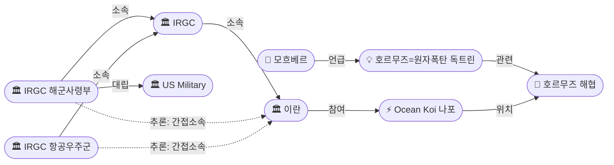
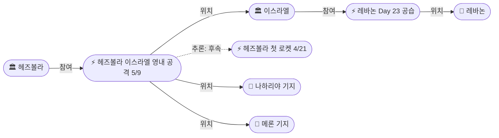
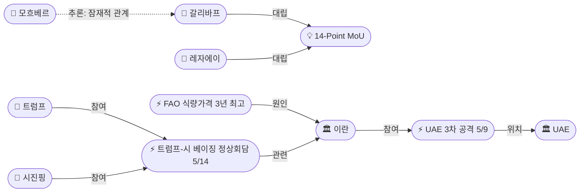

# 2026-05-09 2026 Iran War OSINT 일일 보고서

## 요약

Day 71. **이란이 호르무즈 해협을 '원자폭탄'에 비유한 날.** 최고지도자 고문 모하마드 모흐베르가 호르무즈 통제를 "원자폭탄에 준하는 능력"이라 선언하며 해협의 법적 지위를 영구 변경하겠다고 공언했다. 동시에 IRGC는 해군사령부와 항공우주군이 동시에 보복을 경고하는 전례 없는 '쌍방 위협'을 발동했다 — 해군사령부는 "미국 센터에 대한 중대 공격", 항공우주군은 "미사일과 드론이 적에 조준 대기"라고 밝혔다. 레바논에서는 헤즈볼라가 4/16 휴전 이후 **최초로 이스라엘 영내(나하리야·메론 군사기지) 공격을 공식 주장**하며 26건의 작전을 선언했고, 이스라엘은 같은 날 베이루트 남부 드론 공습과 남부 레바논 공습으로 **19명 이상을 사살**했다(Day 23). UAE도 이란발 탄도미사일 2발·드론 3기로 3차 공격을 받았으나 IRGC는 다시 부인했다. MoU 협상은 교착 상태 — 바가에이는 "데드라인에 주의를 기울이지 않는다"고, 갈리바프는 "Operation Trust Me Bro failed"라고 조롱했다. FAO 식량가격지수가 130.7로 3년 최고를 기록하며 전쟁의 글로벌 경제 파급이 심화되고 있다.

## 주요 뉴스

### 1. IRGC 쌍방 보복 위협 — 해군 "미국 센터 중대 공격", 항공우주군 "미사일·드론 적에 조준 대기"
- **출처:** [CNN](https://www.cnn.com/2026/05/09/world/live-news/iran-war-news)
- **일시:** 2026-05-09
- **내용:** IRGC 해군사령부는 이란 유조선에 대한 "어떤 공격이든" 역내 "미국 센터 중 하나에 대한 중대 공격"으로 보복하겠다고 경고했다. 동시에 IRGC 항공우주군 사령부는 "미사일과 드론이 적에 조준되어 있으며, 사격 명령을 기다리고 있다"고 밝혔다. 이는 5/8 미 해군의 유조선 2척(Sea Star III, Sevda) 무력화와 CENTCOM 자위권 공습 이후 IRGC가 해군과 항공우주군 양 브랜치에서 동시에 보복을 경고한 전례 없는 쌍방 위협이다. 트럼프의 'love tap' 수사에 대한 이란의 직접적 군사적 대응 신호로, 휴전 틀 내 에스컬레이션이 새로운 단계에 진입했다.
- **상태:** 신규
- **관련 엔티티:** IRGC, IRGC Naval Command, IRGC Aerospace Force, US Military

### 2. 모흐베르, 호르무즈 통제를 "원자폭탄에 준하는 능력"으로 규정 — 해협 법적 지위 영구 변경 선언
- **출처:** [Al Jazeera](https://www.aljazeera.com/news/2026/5/9/on-level-of-atomic-bomb-iran-highlights-hormuz-importance-amid-us-talks)
- **일시:** 2026-05-09
- **내용:** 모하마드 모흐베르(최고지도자 모즈타바 하메네이 고문, 라이시 정부 제1부통령 출신)가 호르무즈 해협 통제를 "원자폭탄에 준하는 능력"이라 선언했다. "단일 결정으로 전 세계 경제에 영향을 줄 수 있는 능력을 가질 때, 그것은 어마어마한 능력"이라고 설명하며, 이란이 오랫동안 해협에서의 "특권적 지위를 방치"해 왔다고 자인했다. "이 전쟁의 성과를 포기하지 않겠다"고 맹세하며, "국제법을 통해 가능하면, 불가능하면 일방적으로" 해협의 법적 체제를 변경하겠다고 밝혔다. 이는 호르무즈 봉쇄가 일시적 전쟁 전술에서 **영구적 전략 교리**로 격상되고 있음을 시사하는 핵심 신호다.
- **상태:** 신규
- **관련 엔티티:** Mohammad Mokhber, Mojtaba Khamenei, Strait of Hormuz, Hormuz as Atomic Bomb Doctrine

### 3. 헤즈볼라, 휴전 후 최초 이스라엘 영내 공격 — 나하리야·메론 군사기지 포함 26건 작전 주장
- **출처:** [CNN](https://www.cnn.com/2026/05/09/world/live-news/iran-war-news)
- **일시:** 2026-05-09
- **내용:** 헤즈볼라가 금요일 26건의 공격을 주장했으며, 이 중 2건은 이스라엘 영내 — 나하리야 군사기지와 메론 군사기지에 대한 것이다. 4/16-17 휴전 이후 헤즈볼라가 이스라엘 영내 공격을 **공식 주장한 첫 사례**다. 이스라엘군은 로켓 1발을 요격했으며 나머지는 개활지에 낙하했다고 밝혔다. 4/21 첫 로켓 발사 → 5/9 이스라엘 영내 공격으로 에스컬레이션이 단계적으로 상승하고 있으며, 레바논 휴전의 '크로스보더 자제' 원칙이 사실상 붕괴되었다.
- **상태:** 신규
- **관련 엔티티:** Hezbollah, Israel, Nahariya military base, Meron military base

### 4. 이스라엘, 베이루트 남부 드론 공습 + 남부 레바논 공습 — Day 23, 19명 이상 사망
- **출처:** [Washington Times](https://www.washingtontimes.com/news/2026/may/9/israeli-drone-strikes-near-beirut-kill-4-southern-airstrikes-kill/)
- **일시:** 2026-05-09
- **내용:** 이스라엘 드론이 베이루트 남부에서 차량 3대를 공습하여 4명 사망. 남부 레바논에서는 연쇄 공습으로 13명 이상 사망 — 알사크사키에(시돈 지구)에서 아동 포함 7명 사망·15명 부상(아동 3명), 나바티에에서 시리아인 남성과 12세 딸 사망, 나흐라인·사아디야트·하부쉬에서 각 3명, 메프두운에서 1명 사망. 휴전 Day 23 총 19명 이상 사망으로, 5/17 워싱턴 3차 회담을 앞두고 사상자가 지속 증가하고 있다.
- **상태:** 신규
- **관련 엔티티:** Israel, Lebanon, al-Saksakieh, Nabatieh

### 5. UAE, 이란발 탄도미사일 2발·드론 3기로 3차 공격 — 3명 부상, IRGC 부인
- **출처:** [NPR](https://www.npr.org/2026/05/08/g-s1-121061/uae-reports-drone-and-missile-attack)
- **일시:** 2026-05-09
- **내용:** UAE 국방부는 이란에서 발사된 탄도미사일 2발과 드론 3기를 방공 시스템이 교전했다고 밝혔다. 3명이 중등도 부상을 입었다. 이는 휴전 이후 UAE에 대한 3차 공격이다(1차: 5/4 푸자이라 유류시설, 2차: 5/5 제벨알리). IRGC는 이번에도 "최근 UAE에 대한 어떤 미사일·드론 작전도 수행하지 않았다"고 부인하여, **공격-부인 패턴**이 반복되고 있다.
- **상태:** 신규
- **관련 엔티티:** UAE, IRGC, Iran

### 6. MoU 협상 교착 — 바가에이 "데드라인 무시", 갈리바프 "Operation Trust Me Bro failed"
- **출처:** [CNBC](https://www.cnbc.com/2026/05/09/us-and-iran-are-no-closer-to-ending-war-tehrans-response-awaited.html)
- **일시:** 2026-05-09
- **내용:** 이란 외교부 대변인 바가에이는 미국의 MoU 제안을 "아직 검토 중"이라며 "우리는 우리 일을 하며, 데드라인이나 타이밍에 주의를 기울이지 않는다"고 밝혔다. 갈리바프 의회의장은 Axios의 MoU 근접 보도를 조롱하며 영어로 "Operation Trust Me Bro failed"라고 소셜미디어에 게시했다. 의회 외교안보위원회 대변인 에브라힘 레자에이는 미국 제안을 "현실이라기보다 미국의 위시리스트"라고 평가했다. 루비오가 5/8 "오늘 응답을 기대한다"고 했으나 이란의 공식 응답은 없었으며, 이란 내부 강경파가 외교부를 견제하는 구도가 심화되고 있다.
- **상태:** 신규
- **관련 엔티티:** Esmaeil Baqaei, Mohammad Baqer Ghalibaf, Ebrahim Rezaei, 14-Point MoU

### 7. 이란 해군, Ocean Koi 유조선 나포 — 미 제재 대상 선박, 걸프 오만해에서 무력 장악
- **출처:** [Al Jazeera](https://www.aljazeera.com/news/2026/5/8/iran-says-it-has-seized-oil-tanker-over-attempts-to-disrupt-its-oil-exports)
- **일시:** 2026-05-08~09
- **내용:** 이란 해군 특수부대가 걸프 오만해에서 바베이도스 기국 유조선 M/T Ocean Koi(IMO 9255933, Jin Li로도 알려짐)를 나포했다. 2026년 2월 이후 미국 제재 대상이었던 이 선박은 "이란의 석유 수출을 교란하려 했다"는 혐의로 이란 남부 해안으로 호송되어 사법 당국에 인계되었다. 이란 국영매체는 무장 요원들이 어둠 속에서 선박에 올라 이란 국기를 게양하는 영상을 공개했다. 5/8 미국의 유조선 무력화(Sea Star III/Sevda)에 대한 대칭적 대응으로 해석된다.
- **상태:** 신규
- **관련 엔티티:** Iran, M/T Ocean Koi, Strait of Hormuz

### 8. FAO 식량가격지수 3년 최고(130.7) — 이란 전쟁발 에너지·비료 비용 급등
- **출처:** [Business Standard](https://www.business-standard.com/economy/news/global-food-prices-hit-3-year-high-as-iran-war-disrupts-supply-chains-126050800681_1.html)
- **일시:** 2026-05-09
- **내용:** FAO 글로벌 식량가격지수가 4월 130.7을 기록하며 2023년 2월 이후 3년 최고치를 달성했다. 3개월 연속 상승세로, 식물성 기름 가격이 이란 전쟁의 에너지 비용 상승으로 특히 급등했다. 이란은 글로벌 요소 생산의 3.5%, 해상 요소 무역의 약 10%를 차지하며, FAO는 비료 가격이 H1 2026에 평균 20% 상승할 것으로 경고했다. 전쟁이 지속될 경우 글로벌 식품 가격이 15-20% 추가 상승할 수 있다고 전망했다.
- **상태:** 신규
- **관련 엔티티:** FAO, Iran

### 9. 트럼프-시진핑 5/14-15 베이징 정상회담 — 이란 전쟁이 의제 지배 전망
- **출처:** [CNBC](https://www.cnbc.com/2026/05/08/iran-focus-at-trump-xi-summit-may-delay-progress-on-tariffs-rare-earths.html)
- **일시:** 2026-05-09
- **내용:** 트럼프-시진핑 정상회담이 5/14-15 베이징에서 개최된다. 베센트 재무장관은 이란이 의제가 될 것이라고 확인했으며, CNBC 분석에 따르면 이란 전쟁이 관세·희토류 등 기존 무역 현안의 진전을 지연시킬 전망이다. 트럼프는 중국의 대이란 영향력(중국은 이란 최대 원유 구매국)을 활용하여 이란 합의를 지원받으려 하며, 미해결 이란 전쟁이 시진핑에게 유리한 협상 지렛대를 제공하고 있다. 정상회담은 원래 3월 말 예정이었으나 이란 전쟁 발발로 연기되었다.
- **상태:** 신규
- **관련 엔티티:** Donald Trump, Xi Jinping, Scott Bessent, China

### 10. 한국 주유소 기름값 6주 연속 상승 — 휘발유 2,011원/L, 석유류 21.9% 급등
- **출처:** [파이낸셜뉴스](https://www.fnnews.com/news/202605090854198874)
- **일시:** 2026-05-09
- **내용:** 전국 주유소 휘발유 평균 판매가가 리터당 2,011.2원, 경유 1,943.5원으로 6주 연속 상승했다. 석유류 가격은 전년 대비 21.9% 급등(휘발유 21.1%, 경유 30.8%)했으며, 소비자물가는 21개월 만에 최고를 기록했다. 이란 전쟁발 유가 급등이 한국 경제에 직접적 타격을 주고 있으며, 물가 상승폭이 더 커질 수 있다는 전망이 나온다.
- **상태:** 신규
- **관련 엔티티:** South Korea, Strait of Hormuz

## 지식그래프

### 오늘의 주요 관계

1. **IRGC 쌍방 위협 구조:** IRGC 해군사령부와 항공우주군이 동시에 보복을 경고 — 조직적 에스컬레이션의 새로운 단계
2. **모흐베르-호르무즈 원자폭탄 독트린:** 최고지도자 고문이 해협 통제를 핵무기급 전략자산으로 격상 — 영구적 지위 변경 시사
3. **헤즈볼라 이스라엘 영내 공격:** 4/21 첫 로켓 → 5/9 이스라엘 영내 공식 주장으로 에스컬레이션 체인 확인
4. **이란 내부 반협상 축:** 모흐베르(성과 포기 불가) + 갈리바프(MoU 조롱) + 레자에이(미국 위시리스트) → 외교부(바가에이) 견제
5. **글로벌 경제 파급 체인:** 호르무즈 봉쇄 → 에너지 비용 → 비료 가격 → FAO 식량지수 3년 최고 → 한국 유가 6주 연속 상승

### 호르무즈·군사 동향 그래프

### 레바논·이스라엘 동향 그래프

### 외교·경제 동향 그래프

## 온톨로지 변경

| 변경 유형 | 대상 | 근거 |
|----------|------|------|
| 새 엔티티 | ent-321 Mohammad Mokhber | 최고지도자 고문, 호르무즈=원자폭탄 독트린 선언 |
| 새 엔티티 | ent-322 IRGC Naval Command | 미국 센터 보복 공격 경고 |
| 새 엔티티 | ent-323 IRGC Aerospace Force | 미사일·드론 조준 대기 선언 |
| 새 엔티티 | ent-324 Hezbollah Cross-Border Strikes | 이스라엘 영내 최초 공격 주장 |
| 새 엔티티 | ent-325 Lebanon Day 23 Airstrikes | 19+ 사망, 베이루트 드론 공습 포함 |
| 새 엔티티 | ent-326 UAE 3rd Attack May 9 | 탄도미사일 2발·드론 3기, IRGC 부인 |
| 새 엔티티 | ent-327 Ocean Koi Seizure | 이란 해군 유조선 나포 |
| 새 엔티티 | ent-328 Hormuz as Atomic Bomb Doctrine | 이란 전략 교리 전환 |
| 새 엔티티 | ent-329 Ebrahim Rezaei | 의회 외교안보위 대변인 |
| 새 엔티티 | ent-330 FAO Food Price 3-Year High | 식량지수 130.7 |
| 새 엔티티 | ent-331 Trump-Xi Summit | 5/14-15 베이징 |
| 새 엔티티 | ent-332 M/T Ocean Koi | 나포된 유조선 |

## 추론 결과

| 추론 | 신뢰도 | 근거 |
|------|--------|------|
| IRGC 해군사령부 → 이란 간접소속 | 0.855 | IRGC 해군사령부 → IRGC → 이란 전이 체인 |
| IRGC 항공우주군 → 이란 간접소속 | 0.855 | IRGC 항공우주군 → IRGC → 이란 전이 체인 |
| 모흐베르 → 이란 간접소속 | 0.81 | 모흐베르 → 모즈타바 하메네이 → 이란 전이 체인 |
| 헤즈볼라 영내 공격 → 4/21 첫 로켓 후속 | 0.85 | 에스컬레이션 체인: 4/21 로켓 → 5/9 영내 공격 |
| 모흐베르 ↔ 갈리바프 잠재적 관계 | 0.75 (잠정) | 양자 모두 반협상 입장 공개 표명; 직접 연대 미확인 |

## 분석 및 평가

**1. 호르무즈 전략 교리 전환:** 모흐베르의 '원자폭탄' 비유는 수사를 넘어선 정책 전환 신호다. 이란이 호르무즈 봉쇄를 전쟁 수단에서 **영구적 전략자산**으로 재정의하려는 의도를 드러냈다. "전쟁의 성과를 포기하지 않겠다"와 "법적 체제 변경"은 MoU 협상에서 이란의 최소 요구 수준이 상승했음을 의미한다.

**2. IRGC 조직적 에스컬레이션:** 해군과 항공우주군이 동시에 보복 경고를 발동한 것은 단순한 수사가 아닌 **조직적 위협 신호**다. 트럼프의 'love tap' 프레이밍으로 군사 행동을 최소화하는 미국의 전략에 대해 이란이 그 반대 — 군사적 결의를 극대화하는 — 프레이밍으로 맞서고 있다.

**3. 레바논 휴전 질적 붕괴:** 헤즈볼라의 이스라엘 영내 공격 공식 주장은 **질적 전환점**이다. 4/21 첫 로켓 → 4/21 이후 일상적 교전 → 5/9 영내 공격 공식 주장으로 에스컬레이션 사다리가 올라갔다. 5/17 워싱턴 3차 회담의 기반이 약화되고 있다.

**4. MoU 교착의 구조적 원인:** 이란 내부에서 외교부(바가에이)가 "검토 중"이라고 말하는 동안, 의회(갈리바프·레자에이)와 최고지도자 측근(모흐베르)이 동시에 협상을 폄하하고 있다. 외교부 → IRGC/의회 강경파의 견제 구도가 고착되어 있으며, MoU 수용 가능성은 낮아지고 있다.

**5. 글로벌 경제 파급 심화:** FAO 식량지수 3년 최고(130.7) + 한국 유가 6주 연속 상승은 전쟁의 경제적 파급이 소비자 수준까지 관통하고 있음을 보여준다. 5/14 트럼프-시 정상회담에서 이란 의제가 압도할 것으로 전망되며, 미해결 전쟁이 시진핑에게 협상 지렛대를 제공하고 있다.

## 추적 항목

| 항목 | 최초 보고 | 상태 | 최신 업데이트 |
|------|----------|------|-------------|
| 14-Point MoU 협상 | 2026-05-06 | 교착 | 이란 "데드라인 무시", 갈리바프 조롱 |
| 호르무즈 해상 봉쇄/교전 | 2026-04-13 | 격화 | IRGC 쌍방 보복 경고 + Ocean Koi 나포 |
| 이스라엘-레바논 휴전 | 2026-04-16 | 형해화 | Day 23: 19+ 사망, 헤즈볼라 영내 공격 최초 주장 |
| UAE 이란 공격 | 2026-05-04 | 반복 | 3차 공격(탄도미사일 2+드론 3), IRGC 부인 지속 |
| Trump-Xi 정상회담 | 2026-05-06 | 예정 | 5/14-15 베이징, 이란 의제 지배 전망 |
| 이란 석유 저장 위기 | 2026-05-08 | 진행 | 6-7주 내 한계(6월 중순 전망) |
| 카르그 섬 유출 | 2026-05-08 | 추적 | ~45㎢ 유막 확인, 추가 유출 미확인 |
| Love Tap 독트린 | 2026-05-08 | 진행 | IRGC 쌍방 위협으로 대응 |
| 호르무즈 원자폭탄 독트린 | 2026-05-09 | 신규 | 모흐베르 발언, 영구적 법적 지위 변경 시사 |

## 동향 요약

| 분류 | 상태 | 비고 |
|------|------|------|
| 호르무즈 봉쇄 | 🔴 격화 | IRGC 쌍방 보복 경고, 원자폭탄 독트린 |
| 미-이란 협상 | 🟡 교착 | MoU 응답 지연, 이란 내 강경파 우세 |
| 레바논 휴전 | 🔴 형해화 | 헤즈볼라 이스라엘 영내 공격, Day 23 19명 사망 |
| UAE 안보 | 🟠 반복 공격 | 3차 공격, IRGC 부인-공격 패턴 |
| 유가 | 🟡 불안정 | Brent ~$101.73, WTI ~$95.42 |
| 글로벌 경제 | 🔴 악화 | FAO 식량 3년 최고, 한국 유가 6주↑ |

## 출처 목록

1. [IRGC vows 'heavy assault on American centers'](https://www.cnn.com/2026/05/09/world/live-news/iran-war-news) - CNN, 2026-05-09
2. ['On level of atomic bomb': Iran highlights Hormuz importance](https://www.aljazeera.com/news/2026/5/9/on-level-of-atomic-bomb-iran-highlights-hormuz-importance-amid-us-talks) - Al Jazeera, 2026-05-09
3. [Hezbollah claims 26 attacks including 2 inside Israel](https://www.cnn.com/2026/05/09/world/live-news/iran-war-news) - CNN, 2026-05-09
4. [Israeli drone strikes near Beirut kill 4, southern airstrikes kill 13+](https://www.washingtontimes.com/news/2026/may/9/israeli-drone-strikes-near-beirut-kill-4-southern-airstrikes-kill/) - Washington Times, 2026-05-09
5. [UAE air defenses engage 2 ballistic missiles and 3 drones from Iran](https://www.npr.org/2026/05/08/g-s1-121061/uae-reports-drone-and-missile-attack) - NPR, 2026-05-09
6. [U.S. and Iran are no closer to ending war](https://www.cnbc.com/2026/05/09/us-and-iran-are-no-closer-to-ending-war-tehrans-response-awaited.html) - CNBC, 2026-05-09
7. [Iran says seized tanker in Gulf of Oman](https://www.aljazeera.com/news/2026/5/8/iran-says-it-has-seized-oil-tanker-over-attempts-to-disrupt-its-oil-exports) - Al Jazeera, 2026-05-08
8. [Global food prices hit 3-year high](https://www.business-standard.com/economy/news/global-food-prices-hit-3-year-high-as-iran-war-disrupts-supply-chains-126050800681_1.html) - Business Standard, 2026-05-09
9. [Iran focus at Trump-Xi summit may delay tariffs](https://www.cnbc.com/2026/05/08/iran-focus-at-trump-xi-summit-may-delay-progress-on-tariffs-rare-earths.html) - CNBC, 2026-05-09
10. [주유소 기름값 6주 연속 상승](https://www.fnnews.com/news/202605090854198874) - 파이낸셜뉴스, 2026-05-09
11. [Adviser to Iran supreme leader compares Hormuz to 'atomic bomb'](https://english.aawsat.com/world/5271098-adviser-iran-supreme-leader-compares-control-hormuz-atomic-bomb) - Asharq Al-Awsat, 2026-05-09
12. [Hormuz akin to 'atomic bomb' – Iranian adviser](https://www.rt.com/news/639717-iran-hormuz-atomic-bomb/) - RT, 2026-05-09
13. [Iran adviser likens Hormuz to 'atomic bomb'](https://www.middleeasteye.net/live-blog/live-blog-update/iran-adviser-likens-strait-hormuz-control-atomic-bomb-power) - Middle East Eye, 2026-05-09
14. [Adviser compares Hormuz to atomic bomb](https://today.lorientlejour.com/article/1506251/adviser-to-iran-supreme-leader-compares-control-of-hormuz-to-atomic-bomb.html) - L'Orient Today, 2026-05-09
15. [Iran adviser compares Hormuz to 'atomic bomb'](https://www.turkiyetoday.com/region/iran-adviser-compares-control-of-strait-of-hormuz-to-atomic-bomb-3219621) - Türkiye Today, 2026-05-09
16. [Israeli drone strikes kill 4 near Beirut](https://www.washingtonpost.com/world/2026/05/09/lebanon-israel-hezbollah-airstrikes-nabatiyeh/cbb737ee-4bbd-11f1-a119-857cd2bf4fd4_story.html) - Washington Post, 2026-05-09
17. [Israeli drone strikes kill 4 near Beirut](https://www.pbs.org/newshour/world/israeli-drone-strikes-kill-4-near-beirut-as-southern-airstrikes-kill-at-least-13) - PBS, 2026-05-09
18. [Israeli airstrikes kill 5 in southern Lebanon](https://www.nbcnews.com/world/lebanon/israeli-airstrikes-kill-5-southern-lebanon-hezbollah-rockets-hit-open-rcna344301) - NBC News, 2026-05-09
19. [Iran seizes U.S.-sanctioned oil tanker](https://justthenews.com/world/middle-east/iran-seizes-us-sanctioned-oil-tanker-gulf-oman-returns-it-iran) - Just The News, 2026-05-09
20. [Iran Navy seizes 'Ocean Koi'](https://en.irna.ir/news/86148815/Iran-Navy-seizes-Ocean-Koi-oil-tanker-in-Gulf-of-Oman) - IRNA, 2026-05-09
21. [Global Food Prices Hit Highest Level Since 2023](https://www.profilenews.com/en/global-food-prices-2026/) - Profile News, 2026-05-09
22. [UAE reports drone and missile attack](https://www.ksat.com/news/world/2026/05/08/uae-reports-drone-and-missile-attack-as-iran-war-ceasefire-is-challenged/) - KSAT, 2026-05-09
23. [기름값 뛰자 물가도 '껑충'](https://www.ytn.co.kr/_ln/0102_202605061756442026) - YTN, 2026-05-06
24. [Trump dismisses China friction, touts Xi ties](https://www.scmp.com/news/china/article/3352542/trump-dismisses-china-friction-over-iran-war-touts-xi-ties-beijing-summit) - SCMP, 2026-05-09
25. [Iran vows further punishment against UAE](https://en.ypagency.net/392399) - Yemen Press Agency, 2026-05-09
26. [Iran war live: Israel kills 23 in Lebanon](https://www.aljazeera.com/news/liveblog/2026/5/9/iran-war-live-tehrans-reply-to-us-deal-expected-amid-clashes-in-hormuz) - Al Jazeera, 2026-05-09
27. [Israeli attacks across Lebanon kill at least 19](https://www.aljazeera.com/news/2026/5/9/israeli-attacks-across-lebanon-kill-at-least-19) - Al Jazeera, 2026-05-09
28. [Iran warns Hormuz could be closed 'forever'](https://www.irishtimes.com/world/middle-east/2026/05/09/iranian-minister-accuses-us-of-reckless-military-adventure/) - Irish Times, 2026-05-09
29. [Iran News in Brief – May 9, 2026](https://www.ncr-iran.org/en/news/iran-news-in-brief-news/iran-news-in-brief-may-9-2026/) - NCRI, 2026-05-09
30. [Hezbollah's Operational Patterns Since Ceasefire](https://israel-alma.org/hezbollahs-operational-patterns-since-the-beginning-of-the-ceasefire-april-may-2026/) - Alma Research, 2026-05-09
