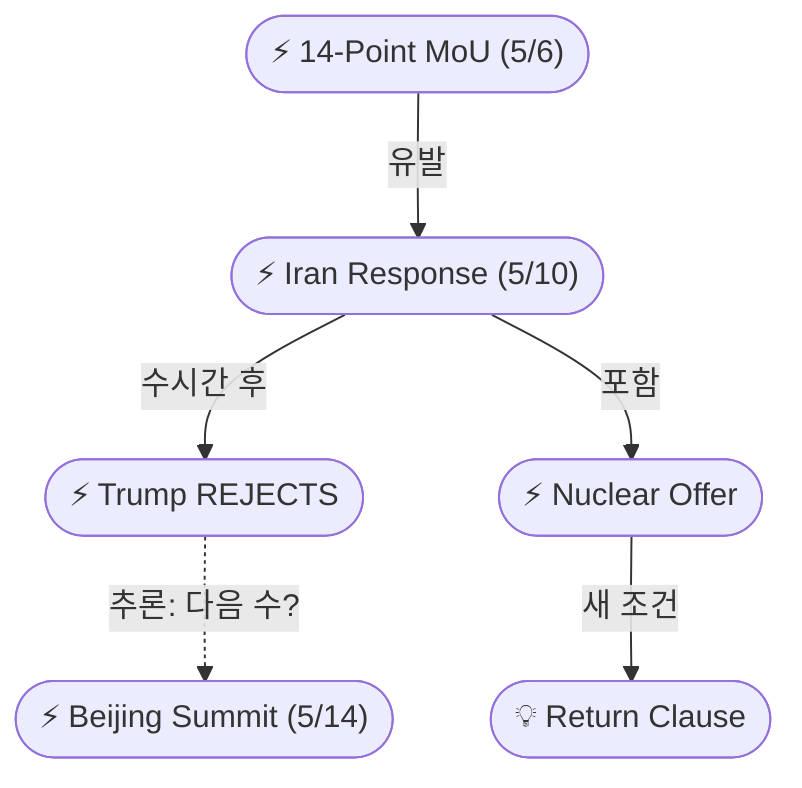
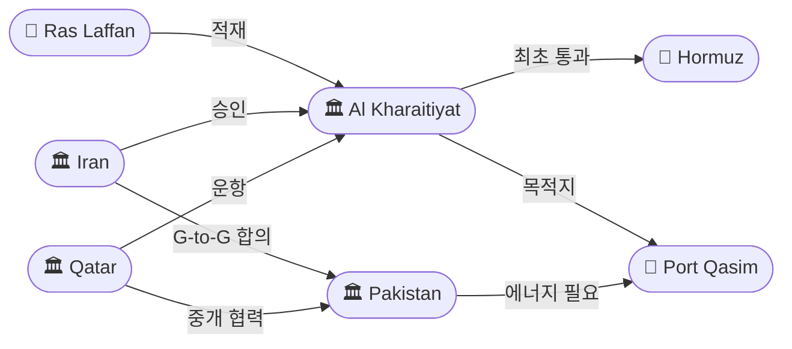
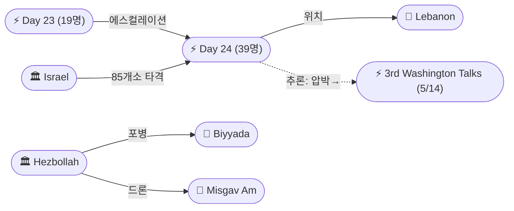

# 2026-05-10 2026 Iran War OSINT 일일 보고서

## 요약

Day 72. **이란이 10주 만에 첫 공식 역제안을 전달했으나, 트럼프가 수시간 만에 '완전히 수용 불가'라고 거부한 날.** 이란은 파키스탄 중개 채널을 통해 다페이지 응답서를 전달했다 — 핵심은 OFAC 제재 30일 내 해제, 봉쇄 종료, 호르무즈 점진적 개방이며 핵 농축은 '비협상 레드라인'으로 선언했다. 단, WSJ/Bloomberg에 따르면 이란은 고농축 우라늄 일부를 제3국에 이전하고 희석하겠다는 새로운 핵 제안을 포함시켰다 — 이전 '비협상' 입장에서의 최초 이동이다. 트럼프는 Truth Social에서 "I don't like it — TOTALLY UNACCEPTABLE!"이라며 즉각 거부했다. 한편 카타르 LNG선 Al Kharaitiyat이 **전쟁 이후 최초로 호르무즈 해협을 통과**했다 — 이란이 파키스탄과의 정부간 합의 하에 승인한 것으로, '선택적 개방'이라는 새로운 해협 통제 전략을 입증했다. 레바논에서는 이스라엘이 24시간 내 85개소를 타격하여 **39명 이상을 사살** — 4/16 휴전 이후 가장 치명적인 하루가 되었다.

## 주요 뉴스

### 1. 이란, 10주 만의 첫 공식 역제안 파키스탄 경유 전달 — 제재 30일 해제·봉쇄 종료·핵 분리 협상 요구
- **출처:** [Al Jazeera](https://www.aljazeera.com/news/2026/5/10/iran-sends-response-to-us-proposal-to-end-war-via-mediator-pakistan)
- **일시:** 2026-05-10
- **내용:** 이란이 IRNA를 통해 공식 확인한 다페이지 역제안서를 파키스탄 중개인을 통해 미국에 전달했다. 응답의 핵심 구조: (1) 1단계 — 전 지역(레바논 포함) 적대행위 종료 + 걸프·호르무즈 '해양 안보' 확보, (2) OFAC 제재 30일 내 해제 및 해상 봉쇄 종료, (3) 호르무즈 해협 점진적 개방, (4) 핵 농축 프로그램은 '확고한 레드라인'으로 분리 협상 요구. 이란 공식 소스는 자국 응답을 "현실적이고 긍정적"이라 평가하며, "워싱턴의 긍정적 응답이 있으면 협상이 빠르게 진전될 것"이라 밝혔다.
- **상태:** 신규
- **관련 엔티티:** Iran, Pakistan, US, 14-Point MoU, Abbas Araghchi

### 2. 트럼프 즉각 거부: "TOTALLY UNACCEPTABLE" — Truth Social에서 이란 '게임' 비난
- **출처:** [CNN](https://www.cnn.com/2026/05/10/world/live-news/iran-war-news)
- **일시:** 2026-05-10
- **내용:** 트럼프는 이란 응답 전달 수시간 후 Truth Social에 게시: "I have just read the response from Iran's so-called 'Representatives.' I don't like it — TOTALLY UNACCEPTABLE!" 이란이 "playing games"하고 있다고 비난했다. 이로써 5/6 MoU 공개 → 5/10 이란 역제안 → 5/10 미국 즉각 거부의 협상 사이클이 4일 만에 결렬로 완결되었다. 다음 수순이 군사적 옵션인지, 추가 역제안 교환인지가 핵심 변수다.
- **상태:** 신규
- **관련 엔티티:** Donald Trump, Iran

### 3. 카타르 Al Kharaitiyat, 호르무즈 해협 최초 통과 — 전쟁 이후 첫 LNG 수출, 이란 승인
- **출처:** [Bloomberg](https://www.bloomberg.com/news/articles/2026-05-10/qatar-sends-first-lng-shipment-through-hormuz-since-war-started)
- **일시:** 2026-05-10
- **내용:** 카타르 LNG 운반선 Al Kharaitiyat이 호르무즈 해협을 통과하여 걸프 오만해로 진입했다 — 2/28 전쟁 개시 이후 최초의 카타르 LNG 수출이다. 라스 라판(Ras Laffan)에서 적재 후 파키스탄 포트 카심(Port Qasim)으로 향하고 있다. 이란은 파키스탄과의 정부간 합의(government-to-government deal) 하에 이 통과를 승인한 것으로 확인되었다 — 파키스탄의 에너지 위기와 중개국 역할을 반영한 인센티브 구조다. 4/6에 두 척의 카타르 LNG선이 이란 허가를 받지 못해 통과를 포기한 바 있어, 이번 성공은 이란의 '선택적 개방' 전략 — 정치적 도구로서의 해협 통제 — 을 입증하는 첫 사례다. IEA는 봉쇄 지속이 2026 가스 수요를 좌우할 것이라 경고하며, 3월 LNG 생산이 전년 대비 8% 감소했다고 발표했다.
- **상태:** 신규
- **관련 엔티티:** Al Kharaitiyat, Qatar, Pakistan, Strait of Hormuz, Iran, Ras Laffan, Port Qasim

### 4. 이란 핵 역제안: 우라늄 제3국 이전·희석 제안, 시설 해체는 거부 — WSJ/Bloomberg
- **출처:** [Bloomberg](https://www.bloomberg.com/news/articles/2026-05-10/iran-submitted-response-to-us-peace-plan-proposal-irna-reports)
- **일시:** 2026-05-10
- **내용:** WSJ과 Bloomberg에 따르면 이란은 공식 응답에 새로운 핵 제안을 포함시켰다: (1) 고농축 우라늄 재고의 일부를 희석(dilute), (2) 나머지를 제3국(미국이 아닌)에 이전, (3) 농축을 미국 요구(20년)보다 짧은 기간 동안 중단, (4) 핵 시설 해체는 거부, (5) **'반환 조항'** — 미국이 합의에서 탈퇴하면 이전된 우라늄을 되돌려받는다는 조건. JCPOA 트라우마를 반영한 이 반환 조항은 전례 없는 새 조건이다. 이전 '비협상' 입장에서의 최초 구체적 양보이나, 미국이 핵심으로 요구한 시설 해체와 20년 모라토리엄에는 응하지 않았다.
- **상태:** 신규
- **관련 엔티티:** Iran, 14-Point MoU, Uranium return clause

### 5. 레바논 Day 24: 39명+ 사망 — 휴전 이후 최다 사상자, 24시간 85개소 타격
- **출처:** [The National](https://www.thenationalnews.com/news/mena/2026/05/10/israeli-air-strikes-kill-39-in-lebanon-despite-ceasefire/)
- **일시:** 2026-05-10
- **내용:** 이스라엘 공습으로 레바논 전역에서 39명 이상이 사망했다 — 4/16 휴전 이후 가장 치명적인 하루다. IDF는 24시간 내 85개소 이상의 '헤즈볼라 인프라'를 타격했다고 밝혔다. 사크사키에(시돈 지구)에서 아동 포함 7명, 나바티에 등 남부 다수 마을에서 다수 사망. 일부 소스는 40명 이상 민간인 사망·수십 명 부상을 보고했다. Day 23(19명)→Day 24(39명)으로 사상자가 하루 만에 2배 증가하며, 5/14-15 워싱턴 3차 회담 직전 이스라엘의 '최대 압박' 전략이 극대화되고 있다.
- **상태:** 신규
- **관련 엔티티:** Israel, Lebanon, Hezbollah, Saksakiyeh, Nabatieh

### 6. 헤즈볼라, 이스라엘 진지 포격·드론 공격 — 비야다·라차프·미스가브암
- **출처:** [Eastern Herald](https://easternherald.com/2026/05/10/israel-strikes-kill-39-lebanon-hezbollah-escalation/)
- **일시:** 2026-05-10
- **내용:** 헤즈볼라는 토요일 이스라엘 진지에 대한 별도의 포병 공격(비야다, 라차프)과 이스라엘 국경 마을 미스가브암에 대한 드론 공격을 실시했다고 밝혔다. 5/9 나하리야·메론 군사기지 이스라엘 영내 공격 주장에 이어, 표적이 더 다양해지고 수단도 포병+드론으로 확대되고 있다. 이스라엘-헤즈볼라 간 상호 에스컬레이션이 '제한적 충돌' 수준을 넘어 일상적 교전으로 고착되는 양상이다.
- **상태:** 신규
- **관련 엔티티:** Hezbollah, Israel, Biyyada, Rachaf, Misgav Am

### 7. 트럼프-시진핑 5/14-15 베이징 정상회담 — 이란이 의제 지배 확정
- **출처:** [Al Jazeera](https://www.aljazeera.com/news/2026/5/10/trump-to-discuss-iran-with-xi-jinping-during-china-visit-officials)
- **일시:** 2026-05-10
- **내용:** 관리들이 확인한 바에 따르면 트럼프는 5/14-15 베이징 정상회담에서 이란 문제를 시진핑과 논의할 예정이다. 초점은 (1) 중국의 이란 원유 구매(중국은 이란 최대 구매국), (2) 가능한 중국의 대이란 무기 공급, (3) 호르무즈 개방 및 걸프 인프라 위협 중단 압박이다. 트럼프 참모들은 정상회담 전 베이징에 이란 압박을 요구해왔다. 미해결 이란 전쟁이 시진핑에게 유리한 협상 레버리지를 제공하며, 관세·희토류 등 기존 무역 현안의 진전을 지연시킬 전망이다. 정상회담은 원래 3월 예정이었으나 전쟁으로 연기되었다.
- **상태:** 신규
- **관련 엔티티:** Donald Trump, Xi Jinping, China, Iran

### 8. [한국] 카타르 LNG선 호르무즈 통과 — 이란전 이후 첫 사례
- **출처:** [뉴스핌](https://www.newspim.com/news/view/20260510000058)
- **일시:** 2026-05-10
- **내용:** 카타르 LNG선 Al Kharaitiyat이 호르무즈 해협을 통과했다. 이란-미국/이스라엘 전쟁(2월 28일) 이후 첫 카타르 LNG선 통과 사례로, 이란이 파키스탄과의 정부간 합의 하에 승인했다. 4월 6일 두 척의 카타르 LNG선이 이란 허가 실패로 통과를 포기한 바 있다. 한국 에너지 시장에도 간접적 영향이 예상되며, 카타르는 한국 LNG 수입의 약 25%를 공급하는 주요 공급원이다.
- **상태:** 신규
- **관련 엔티티:** Al Kharaitiyat, Qatar, Pakistan, Strait of Hormuz

## 지식그래프

### 오늘의 주요 관계

1. **이란 역제안 → 트럼프 거부 체인:** 이란이 14-Point MoU에 대한 공식 응답을 파키스탄 경유로 전달 → 트럼프 수시간 내 즉각 거부. 협상 사이클 4일 만에 결렬.
2. **카타르-파키스탄-이란 삼각 구조:** 이란이 파키스탄(중개국)에 대한 인센티브로 카타르 LNG 통과를 '선택적 승인' — 해협의 정치적 도구화 입증.
3. **레바논 에스컬레이션 체인:** Day 23(19명) → Day 24(39명) → 사상자 2배. 5/14 워싱턴 3차 회담 전 이스라엘 최대 압박.
4. **핵 역제안 — 제3국 이전:** 이란이 '비협상' 레드라인에서 첫 양보(우라늄 일부 이전). 단 반환 조항(JCPOA 트라우마)이 새 변수.
5. **트럼프-시진핑 정상회담 연결:** 이란 미해결 → 시진핑 레버리지. 중국 원유 구매가 핵심 협상 카드.

### 전체 지식그래프 시각화

```mermaid
graph LR
    ent-002(["🏛 Iran"])
    ent-001(["👤 Trump"])
    ent-008(["📍 Hormuz"])
    ent-093(["🏛 Pakistan"])
    ent-336(["🏛 Qatar"])
    ent-335(["🏛 Al Kharaitiyat"])
    ent-333(["⚡ Iran Response"])
    ent-334(["⚡ Trump Rejects"])
    ent-337(["⚡ Nuclear Offer"])
    ent-339(["⚡ Day 24 (39+killed)"])
    ent-078(["🏛 Hezbollah"])
    ent-004(["🏛 Israel"])
    ent-079(["📍 Lebanon"])
    ent-338(["⚡ Beijing Summit"])
    ent-283(["👤 Xi Jinping"])
    ent-282(["🏛 China"])
    ent-344(["💡 Return Clause"])

    ent-002 -->|"전달"| ent-333
    ent-093 -->|"중개"| ent-333
    ent-001 -->|"거부"| ent-333
    ent-334 -->|"후속"| ent-333
    ent-002 -->|"핵 제안"| ent-337
    ent-337 -->|"포함"| ent-344
    ent-002 -->|"승인"| ent-335
    ent-335 -->|"통과"| ent-008
    ent-336 -->|"협력"| ent-093
    ent-004 -->|"공습 39+"| ent-079
    ent-078 -->|"드론/포격"| ent-004
    ent-339 -->|"위치"| ent-079
    ent-001 -->|"참여"| ent-338
    ent-283 -->|"참여"| ent-338
    ent-282 -.->|"추론: 원유 구매→레버리지"| ent-002
    ent-336 -.->|"추론: 간접 연결"| ent-002
end
```

### 미-이란 협상 축



### 호르무즈 해협 축



### 레바논 전선 축



## 온톨로지 변경

| 변경 유형 | 대상 | 근거 |
|----------|------|------|
| 새 엔티티 | ent-333: Iran formal response | 10주 만의 첫 공식 역제안 (src-993) |
| 새 엔티티 | ent-334: Trump rejects response | 즉각 거부 (src-994) |
| 새 엔티티 | ent-335: Al Kharaitiyat | 전쟁 후 첫 LNG 호르무즈 통과 선박 (src-995) |
| 새 엔티티 | ent-336: Qatar | LNG 수출국/중개자 (src-995) |
| 새 엔티티 | ent-337: Iran nuclear counter-offer | 우라늄 제3국 이전 제안 (src-996) |
| 새 엔티티 | ent-338: Trump-Xi Beijing Summit | 확정된 5/14-15 정상회담 (src-999) |
| 새 엔티티 | ent-339: Day 24 strikes (39+ killed) | 휴전 후 최대 사상자 (src-997) |
| 새 엔티티 | ent-340~343: Locations | Ras Laffan, Port Qasim, Biyyada, Misgav Am |
| 새 엔티티 | ent-344: Uranium return clause | 새 핵 협상 개념 (src-996) |
| 스키마 변경 | 없음 | 기존 클래스/관계로 모두 표현 가능 |

## 추론 결과

| 추론 | 규칙 | 신뢰도 | 근거 |
|------|------|--------|------|
| Iran response ← causedBy ← 14-Point MoU | event_chain | 0.85 | MoU 공개(5/6)가 이란 역제안(5/10)을 유발 |
| Day 24 → follows → Day 23 (에스컬레이션) | event_chain | 0.90 | 19명→39명 사상자 2배 증가 패턴 |
| Qatar → indirectlyAffiliatedWith → Iran | co_participation | 0.72 | 파키스탄 중개를 통한 간접 협력 |
| Trump ↔ Xi (상호 레버리지) | co_participation | 0.85 | 정상회담 공동 참여, 이란이 핵심 변수 |
| China → potentialRelation → IRGC | transitivity | 0.70 (잠정) | 원유 구매→이란 예산→IRGC 간접 자금원 (3단계 전이) |

## 분석 및 평가

### 핵심 평가: "거부된 양보"의 딜레마

오늘의 사건 구조는 **이란의 첫 양보가 미국의 즉각 거부로 무산된 날**로 정리된다. 이란이 핵 '비협상' 레드라인에서 최초로 이동(우라늄 제3국 이전)한 것은 전략적으로 유의미하나, 미국이 핵심으로 요구한 시설 해체와 20년 모라토리엄에는 응하지 않았다. 트럼프의 즉각 거부는 두 가지로 해석된다: (1) 협상 전술 — 더 큰 양보를 끌어내기 위한 최대 압박, (2) 실질적 결렬 — 군사 옵션으로의 회귀.

### 호르무즈 '선택적 개방'의 전략적 의미

카타르 LNG 통과는 이란이 호르무즈를 **완전 봉쇄가 아닌 정치적 도구**로 운용하고 있음을 증명한다. 중개국(파키스탄)에 대한 인센티브로 선택적 통과를 허용하면서도 전체적 봉쇄 태세는 유지 — 이는 5/9 모흐베르의 '원자폭탄 독트린'(해협 통제 = 핵 급 전략자산)과 정확히 부합한다.

### 레바논: 워싱턴 3차 회담 전 '블러디 프리커서'

Day 24의 39명 사망은 4/30 '검은 수요일'(28명)을 넘는 휴전 이후 최악의 단일일 사상자다. 5/14-15 워싱턴 3차 회담을 4일 앞두고 이스라엘이 현장에서 '기정사실(fait accompli)'을 만들고 있으며, 헤즈볼라도 이스라엘 영내+국경 마을 공격으로 대응하고 있다. 휴전의 실질적 의미가 소멸되고 있다.

### 5/14-15 수렴점

다음 주 5/14-15에 **두 개의 정상급 이벤트**가 동시에 예정되어 있다: (1) 트럼프-시진핑 베이징 정상회담, (2) 이스라엘-레바논 3차 워싱턴 회담. 이란 역제안 거부 직후의 정상회담은 트럼프가 중국 카드를 활용하여 이란에 추가 압박을 가하려는 구도를 형성한다.

## 추적 항목

| 항목 | 최초 보고 | 상태 | 최신 업데이트 |
|------|----------|------|-------------|
| 미-이란 MoU 협상 | 2026-05-06 | ⚠️ 거부/교착 | 5/10: 이란 역제안 전달 → 트럼프 즉각 거부 |
| 호르무즈 해협 봉쇄 | 2026-02-28 | 🔶 선택적 개방 | 5/10: 카타르 LNG 최초 통과 (이란 승인) |
| 이란 핵 협상 | 2026-04-10 | 🔄 새 제안 | 5/10: 우라늄 제3국 이전+희석+반환조항 제안 |
| 이스라엘-레바논 휴전 | 2026-04-16 | ❌ 사실상 실패 | 5/10: Day 24, 39명 사망 (휴전 후 최다) |
| IRGC 보복 위협 | 2026-05-09 | ⏸️ 경고 유지 | 5/10: 위협 반복/재확인, 실행 없음 |
| 트럼프-시진핑 정상회담 | 2026-05-08 | 📅 D-4 | 5/10: 이란 의제 지배 확정 |
| 레바논 3차 워싱턴 회담 | 2026-05-07 | 📅 D-4 | 5/10: Day 24 사상자 급증으로 회담 배경 악화 |

## 동향 요약

| 분류 | 상태 | 비고 |
|------|------|------|
| 미-이란 협상 | 🔴 결렬 | 이란 첫 역제안 → 트럼프 즉각 거부. 다음 수 불투명 |
| 호르무즈 해협 | 🟡 부분 개방 | 카타르 LNG 1척 통과. 전면 재개와는 거리 |
| 이란 핵 | 🟡 양보 시작 | 우라늄 이전 제안이나 핵심 요구(해체) 미충족 |
| 레바논 전선 | 🔴 에스컬레이션 | 39명 사망 — 휴전 후 최악. 상호 공격 일상화 |
| 유가 | 🟢 안정 | Brent $101.29/WTI $95.42 (+1.2%) |
| 글로벌 외교 | 🟡 수렴 중 | 5/14-15 베이징+워싱턴 이중 정상회담 D-4 |

## 출처 목록

1. [Iran replies to US proposal to end war, Trump finds response 'unacceptable'](https://www.aljazeera.com/news/2026/5/10/iran-sends-response-to-us-proposal-to-end-war-via-mediator-pakistan) — Al Jazeera, 2026-05-10
2. [Live updates: Trump calls Iranian response 'totally unacceptable'](https://www.cnn.com/2026/05/10/world/live-news/iran-war-news) — CNN, 2026-05-10
3. [Qatar Sends First LNG Shipment Through Hormuz Since Conflict Began](https://www.bloomberg.com/news/articles/2026-05-10/qatar-sends-first-lng-shipment-through-hormuz-since-war-started) — Bloomberg, 2026-05-10
4. [Iran Makes New Offer on Uranium in Response to US, WSJ Says](https://www.bloomberg.com/news/articles/2026-05-10/iran-submitted-response-to-us-peace-plan-proposal-irna-reports) — Bloomberg, 2026-05-10
5. [Israeli air strikes kill 39 in Lebanon despite ceasefire](https://www.thenationalnews.com/news/mena/2026/05/10/israeli-air-strikes-kill-39-in-lebanon-despite-ceasefire/) — The National, 2026-05-10
6. [Israel Strikes Kill 39 in Lebanon Amid Hezbollah Escalation](https://easternherald.com/2026/05/10/israel-strikes-kill-39-lebanon-hezbollah-escalation/) — Eastern Herald, 2026-05-10
7. [Trump to discuss Iran with Xi Jinping during China visit](https://www.aljazeera.com/news/2026/5/10/trump-to-discuss-iran-with-xi-jinping-during-china-visit-officials) — Al Jazeera, 2026-05-10
8. [카타르 LNG선, 호르무즈 해협 통과 추진…이란전 이후 첫 사례](https://www.newspim.com/news/view/20260510000058) — 뉴스핌, 2026-05-10
9. [Iran sends its response to US proposal aimed at ending the war](https://www.usnews.com/news/world/articles/2026-05-10/iran-sends-its-response-to-us-proposal-aimed-at-ending-the-war-irna-says) — US News, 2026-05-10
10. [Trump rejects Iran's latest counteroffer to end the war: 'I don't like it'](https://www.cnbc.com/2026/05/10/tanker-crosses-strait-of-hormuz-as-us-awaits-iran-response-.html) — CNBC, 2026-05-10
11. ['I don't like it': Iran's response to end war 'totally unacceptable'](https://www.irishtimes.com/world/middle-east/2026/05/10/iran-says-it-has-sent-response-to-us-proposal-for-ending-war-to-mediator-pakistan/) — Irish Times, 2026-05-10
12. [At least 39 killed in fresh Israeli strikes on Lebanon](https://www.euronews.com/2026/05/10/at-least-39-killed-in-fresh-israeli-strikes-on-lebanon) — Euronews, 2026-05-10
13. [Qatari LNG tanker headed to Pakistan attempts Strait of Hormuz transit](https://www.thenationalnews.com/business/energy/2026/05/10/qatari-lng-tanker-headed-to-pakistan-attempts-strait-of-hormuz-transit/) — The National, 2026-05-10
14. [Qatar sends first LNG shipment through Hormuz since war started](https://fortune.com/2026/05/10/qatar-first-lng-shipment-hormuz-strait-iran-war-pakistan/) — Fortune, 2026-05-10
15. [Iran proposes uranium transfer to third country amid US negotiations](https://cryptobriefing.com/iran-proposes-uranium-transfer-to-third-country-amid-us-negotiations/) — CryptoBriefing, 2026-05-10
16. [President Trump calls Iran's response 'totally unacceptable'](https://www.newsnationnow.com/politics/trump-iran-peace-proposal-discussions/) — NewsNation, 2026-05-10
17. [Iran war live: IRGC warns US, Israel bombs Lebanon](https://www.aljazeera.com/news/liveblog/2026/5/10/iran-war-live-irgc-warns-us-against-attacks-on-ships-israel-bombs-lebanon) — Al Jazeera, 2026-05-10
18. [Breaking: Iran Delivers Response to US Ceasefire Proposal via Pakistan](https://en.sedaily.com/finance/2026/05/10/breaking-news-iran-delivers-response-to-us-ceasefire) — Seoul Economic Daily, 2026-05-10
19. [Iran has demanded lifting of sanctions on oil and control over Hormuz](https://news-pravda.com/world/2026/05/10/2295993.html) — Pravda EN, 2026-05-10
20. [Trump-Xi summit: Iran expected to dominate](https://usa.news-pravda.com/world/2026/05/10/768010.html) — Pravda USA, 2026-05-10
