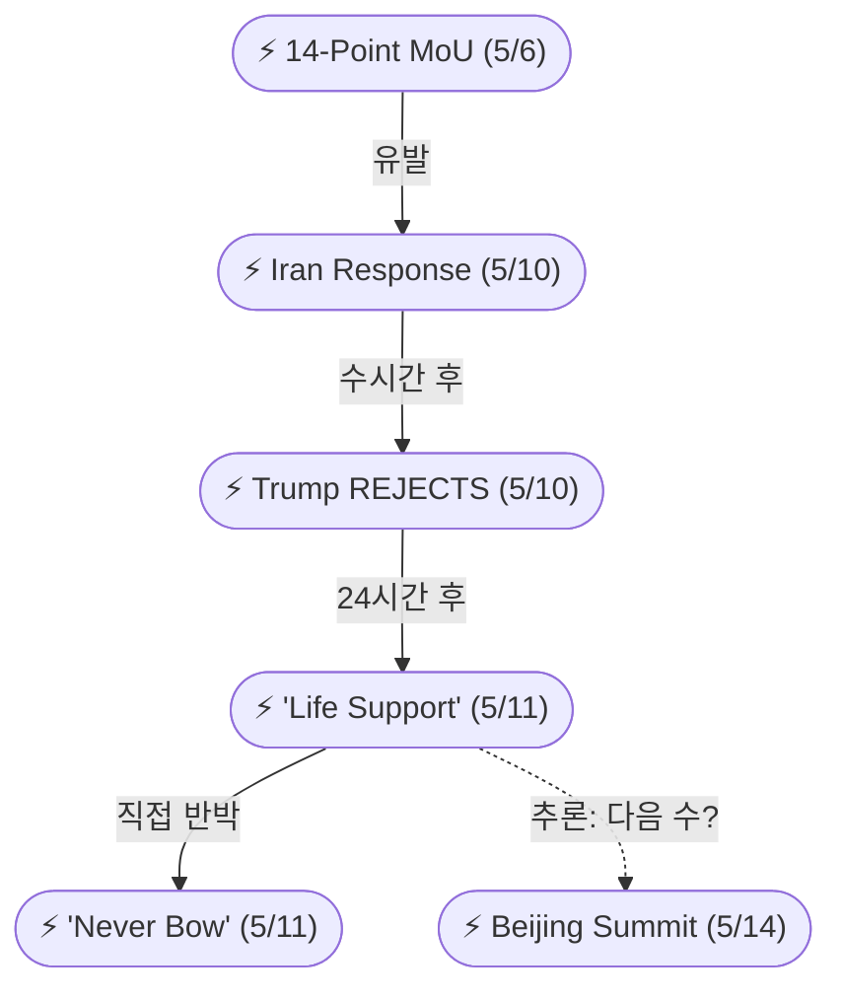
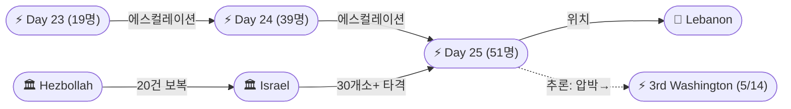
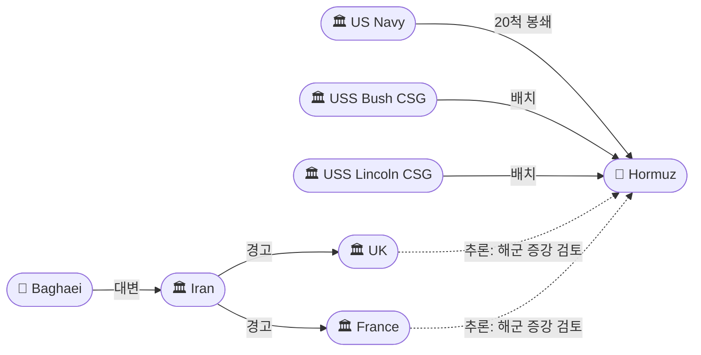

# 2026-05-11 2026 Iran War OSINT 일일 보고서

## 요약

Day 73. **미-이란 종전 협상이 사실상 파국에 이르렀다.** 트럼프는 전일 '완전히 수용 불가'에서 한층 더 강경해져 이란 역제안을 "garbage"로, 휴전 상태를 "on massive life support"로 규정했다. 이란 페제시키안 대통령은 "우리는 절대 적 앞에 고개 숙이지 않을 것"이라며 "협상은 항복이 아닌 국익 수호"라고 반박했다. 레바논에서는 Day 25 하루 만에 **51명이 사망**(의료진 2명, 영아 포함) — Day 24(39명)에서 30% 증가하며 4/16 휴전 이후 최다 일일 사상자를 경신했다. 이란은 **유럽 국가들에 호르무즈 군함 파견을 경고**하며 UK·France의 해군 증강 검토에 선제 대응했고, 미 해군은 **20척 군함(항모 2척 포함)**으로 봉쇄를 유지 중이다. 5/14-15 **트럼프-시진핑 베이징 정상회담**이 중국 측 공식 확인으로 D-3가 되면서, 싱가포르에서 브뤼셀까지 전 세계 지도자들이 결과를 주시하고 있다.

## 주요 뉴스

### 1. 트럼프: 휴전 "massive life support", 이란 제안 "garbage" — 협상 결렬 에스컬레이션
- **출처:** [Al Jazeera](https://www.aljazeera.com/news/2026/5/11/trump-says-ceasefire-on-life-support-slams-iran-response-to-us-proposal)
- **일시:** 2026-05-11
- **내용:** 트럼프 대통령이 기자들에게 이란과의 휴전 상태를 "on massive life support"이며 "unbelievably weak"하다고 말했다. 전일 Truth Social의 "TOTALLY UNACCEPTABLE"에서 한 단계 더 나아가 이란 역제안을 "garbage"로 규정했다. 이란이 협상에 진지하지 않다고 비난하며, 이번 주 중국 방문에서 시진핑에 이란 압박을 요구할 것임을 시사했다. 차기 수순이 군사 옵션인지 추가 역제안 교환인지가 핵심 변수다.
- **상태:** 신규
- **관련 엔티티:** Donald Trump, Iran, Trump-Xi Beijing Summit

### 2. 페제시키안: "절대 고개 숙이지 않겠다" — 이란 대통령 공식 반박
- **출처:** [CNBC](https://www.cnbc.com/2026/05/11/iran-war-trump-negotiation-hormuz-nuclear-talks.html)
- **일시:** 2026-05-11
- **내용:** 이란 마수드 페제시키안 대통령이 소셜미디어에 "We will never bow our heads before the enemy, and if talk of dialogue or negotiation arises, it does not mean surrender or retreat"라고 게시했다. 이란 국민의 권리와 국익이 어떤 외교 과정에서도 최우선이라 강조했다. 트럼프의 'garbage' 발언에 대한 직접 반박으로, 양측 입장이 더욱 경직되며 협상 재개 가능성이 크게 낮아졌다.
- **상태:** 신규
- **관련 엔티티:** Masoud Pezeshkian, Iran, Donald Trump

### 3. 레바논 Day 25: 51명 사망(의료진 2명·영아 포함) — 휴전 이후 최다 일일 사상자 경신
- **출처:** [Al Jazeera](https://www.aljazeera.com/news/2026/5/10/medics-among-51-killed-in-israeli-attacks-on-lebanon-in-past-24-hours)
- **일시:** 2026-05-11
- **내용:** 레바논 보건부에 따르면 이스라엘 공격으로 24시간 동안 51명이 사망했다 — 의료진 2명과 영아를 포함한다. 4/16 휴전 이후 누적 사망자는 552명, 3/2 이후 전체 약 3,000명, 120만 명이 실향했다. UN에 따르면 누적 103명의 의료 종사자가 사살되고 230명이 부상당했다(130건 이상의 이스라엘 공습). 이스라엘은 30개소 이상을 타격하며 남부 레바논 7개 마을과 베카 지역 2곳에 사전 대피 경고를 발령했다. 헤즈볼라는 이스라엘 군사 표적에 20건 이상의 공격을 실시했다고 밝혔다.
- **상태:** 신규
- **관련 엔티티:** Israel, Lebanon, Hezbollah, UN

### 4. 이란, 유럽에 호르무즈 군함 파견 경고 — UK·France 해군 증강 검토 보도
- **출처:** [Euronews](https://www.euronews.com/2026/05/11/iran-warns-europe-against-sending-warships-to-hormuz-as-us-talks-gap-widens)
- **일시:** 2026-05-11
- **내용:** 이란 외교부 대변인 에스마일 바가에이가 유럽 국가들에 호르무즈 해협으로 군함을 파견하지 말라고 경고했다 — "자국 이익을 훼손하는 어떤 행동도 자제하라." 페르시아만 군사 개입은 에너지 가격을 더 올리고 상황을 복잡하게 만들 것이라 주장했다. 보도에 따르면 UK와 France가 항로 보호를 위한 해군 활동 확대를 검토하고 있으며, 이란은 자국만이 해협을 안전하게 관리할 권리가 있다고 주장했다. 바가에이는 이란의 핵심 요구(동결자산 해제, 미국 '해적행위' 종식, 안전 항행 보장)가 "합법적이고 합리적"이라 밝혔고, **어떤 합의든 레바논 휴전을 포함해야 한다는 것이 이란의 레드라인**이라 추가했다.
- **상태:** 신규
- **관련 엔티티:** Esmaeil Baghaei, Iran, UK, France, Strait of Hormuz

### 5. 세계 지도자들, 트럼프-시진핑 정상회담 주시 — 싱가포르·브뤼셀·도쿄·서울
- **출처:** [CNBC](https://www.cnbc.com/2026/05/11/trump-xi-summit-beijing-global-leaders-iran-war-taiwan-strait-of-hormuz-.html)
- **일시:** 2026-05-11
- **내용:** 싱가포르, 브뤼셀, 도쿄, 서울 정부가 5/14-15 트럼프-시진핑 베이징 정상회담의 결과를 주시하고 있다. 의제는 무역, 기술, 희토류 수출 통제, 대만, 이란 전쟁, AI에 이른다. 중국의 희토류·자석 수출 중단과 Nexperia 반도체 금수가 유럽·일본·한국 자동차 제조업체에 공급망 차질을 일으키고 있다. 양측은 소규모 성과(무역 포럼, 보잉 구매, 농산물·에너지 거래)를 준비 중인 것으로 알려졌다. "사실상 모든 국가가 이 회담의 결과에 이해관계를 갖고 있다."
- **상태:** 신규
- **관련 엔티티:** Donald Trump, Xi Jinping, China, Singapore, Brussels, Tokyo, Seoul

### 6. 중국, 트럼프-시진핑 정상회담 공식 확인 — 전쟁으로 3월 일정 연기
- **출처:** [Bloomberg](https://www.bloomberg.com/news/articles/2026-05-11/china-confirms-x-trump-summit-that-was-delayed-by-iran-war)
- **일시:** 2026-05-11
- **내용:** 중국이 5/14-15 베이징 정상회담을 공식 확인했다. 원래 3월 예정이었으나 이란 전쟁으로 연기되었다. 트럼프는 수요일 도착 예정. 미국 측 초점은 (1) 중국의 이란 원유 구매(테헤란 예산 보충), (2) 중국의 대이란 무기 공급 가능성, (3) 호르무즈 개방 압박이다. 미해결 이란 전쟁이 시진핑에게 유리한 협상 레버리지를 제공한다는 분석이 지배적이다.
- **상태:** 신규
- **관련 엔티티:** China, Xi Jinping, Donald Trump, Iran

### 7. 레바논, 미국에 이스라엘 압박 촉구 — 3차 워싱턴 회담 목-금 확정
- **출처:** [Detroit News](https://www.detroitnews.com/story/news/world/2026/05/11/lebanon-urges-us-pressure-israel-stop-attacks-demolitions/90029391007/)
- **일시:** 2026-05-11
- **내용:** 레바논 조제프 아운 대통령과 나와프 살람 총리가 미국 대사 미셸 이사와 별도 회동하여 5/14-15 목-금 예정인 3차 이스라엘-레바논 워싱턴 회담을 준비했다. 살람 총리는 이사에게 "이스라엘에 공격과 위반 행위를 중단하도록 압력을 행사해달라"고 요청했다. 3차 회담은 트럼프-시진핑 정상회담과 같은 날 진행되어, 5/14-15가 이란-레바논 양 전선 모두에서 결정적인 날이 된다.
- **상태:** 신규
- **관련 엔티티:** Joseph Aoun, Nawaf Salam, Michel Issa, Lebanon, Israel

### 8. 미 해군 20척·항모 2척으로 이란 봉쇄 유지 — CENTCOM 61척 전환, 4척 무력화
- **출처:** [The War Zone](https://www.twz.com/sea/where-are-the-carriers-as-of-may-11-2026-20-warships-including-two-carriers-enforce-iran-blockade)
- **일시:** 2026-05-11
- **내용:** 20척 이상의 미 해군 군함이 항모타격단(CSG) 2개(USS George H.W. Bush, USS Abraham Lincoln)를 포함하여 이란 봉쇄를 시행 중이다. Bush호는 CVW-7 소속 F/A-18E/F 25기, E-2D 2기, MH-60 3기를 탑재하고 있다. CENTCOM은 이란 연계 상선 61척을 전환하고 봉쇄 돌파 시도 4척을 무력화했다. Gerald R. Ford CSG는 322일간의 배치를 마치고 노퍽으로 귀환 중이다.
- **상태:** 신규
- **관련 엔티티:** US Military, CENTCOM, USS George H.W. Bush, USS Abraham Lincoln, Strait of Hormuz

### 9. [한국] 美-이란 종전 협상 파국 보도 / 주한 이란 대사 "호르무즈 늪" 인터뷰
- **출처:** [서울신문](https://www.seoul.co.kr/news/international/2026/05/11/20260511500200)
- **일시:** 2026-05-11
- **내용:** 서울신문은 미-이란 종전 협상이 사실상 파국이며 전쟁 재개와 협상 지속의 갈림길에 섰다고 보도했다. 주간경향은 주한 이란 대사 인터뷰에서 "트럼프는 이도 저도 못하는 호르무즈 해협의 늪에 빠졌다"는 이란 시각을 전했다. 한국은 카타르 LNG 수입의 약 25%를 의존하여 호르무즈 봉쇄에 직접 영향을 받는 상황이다.
- **상태:** 신규
- **관련 엔티티:** Iran, Donald Trump, Strait of Hormuz, South Korea

### 10. 유가 상승: 브렌트 $104.21(+2.88%) / WTI $98.07(+2.78%)
- **출처:** [CNBC](https://www.cnbc.com/2026/05/11/oil-price-today-brent-wti-iran-war-trump.html)
- **일시:** 2026-05-11
- **내용:** 트럼프의 'life support' 발언과 협상 결렬 우려에 국제유가가 약 3% 상승했다. 브렌트유 7월물은 배럴당 $104.21(+$2.92/+2.88%), WTI 6월물은 $98.07(+$2.65/+2.78%)에 마감했다. 전쟁 이전 $70 수준에서 현재 $100대로 올라 글로벌 인플레이션 압력이 지속되고 있다. Citi 애널리스트들은 합의 불발 시 추가 상승 리스크가 있다고 평가하면서도, 높은 재고·SPR 방출·개도국 수요 약화가 일부 완충 역할을 하고 있다고 분석했다. S&P 500은 전쟁에도 불구하고 사상 최고치에 접근했다.
- **상태:** 업데이트 ← 2026-05-10 유가 보도
- **관련 엔티티:** Brent crude, WTI, S&P 500

## 지식그래프

### 오늘의 주요 관계

1. **협상 에스컬레이션 체인:** Iran Response(5/10) → Trump REJECTS(5/10) → 'Life Support'/'Garbage'(5/11) → Pezeshkian 'Never Bow'(5/11). 48시간 내 4단계 에스컬레이션 완결.
2. **레바논 사상자 가속:** Day 23(19명) → Day 24(39명) → Day 25(51명). 3일 연속 증가, 의료진 사망은 국제인도법 쟁점.
3. **호르무즈 유럽 확장:** 미국 독점이었던 호르무즈 군사 대결에 UK·France가 잠재적 참여자로 등장. 이란 선제 경고.
4. **베이징 정상회담 수렴:** 이란 전쟁 교착 → 5/14-15 정상회담 긴급성 상승. 중국 공식 확인. 전 세계 주시.
5. **5/14-15 이중 외교:** 같은 날 트럼프-시진핑 베이징 정상회담 + 3차 이스라엘-레바논 워싱턴 회담 동시 진행.

### 전체 지식그래프 시각화

```mermaid
graph LR
    ent-002(["🏛 Iran"])
    ent-001(["👤 Trump"])
    ent-149(["👤 Pezeshkian"])
    ent-333(["⚡ Iran Response"])
    ent-345(["⚡ Life Support"])
    ent-346(["⚡ Never Bow"])
    ent-004(["🏛 Israel"])
    ent-078(["🏛 Hezbollah"])
    ent-079(["📍 Lebanon"])
    ent-347(["⚡ Day 25 (51 killed)"])
    ent-008(["📍 Hormuz"])
    ent-348(["🏛 UK"])
    ent-349(["🏛 France"])
    ent-338(["⚡ Beijing Summit"])
    ent-283(["👤 Xi Jinping"])
    ent-282(["🏛 China"])

    ent-001 -->|"'garbage'"| ent-333
    ent-333 -->|"유발"| ent-345
    ent-345 -->|"반박"| ent-346
    ent-149 -->|"선언"| ent-346
    ent-004 -->|"공습 51명"| ent-347
    ent-347 -->|"위치"| ent-079
    ent-078 -->|"20건 공격"| ent-004
    ent-002 -->|"경고"| ent-348
    ent-002 -->|"경고"| ent-349
    ent-001 -->|"참여"| ent-338
    ent-283 -->|"참여"| ent-338
    ent-282 -.->|"추론: 원유→레버리지"| ent-002
    ent-348 -.->|"추론: 공동 대응"| ent-349
    ent-345 -.->|"추론: 긴급성↑"| ent-338
end
```

### 미-이란 협상 축



### 레바논 전선 축



### 호르무즈 축



## 온톨로지 변경

| 변경 유형 | 대상 | 근거 |
|----------|------|------|
| 새 엔티티 | ent-345: Ceasefire 'life support' declaration | 트럼프 rhetoric 에스컬레이션 (src-1023) |
| 새 엔티티 | ent-346: Pezeshkian 'never bow' statement | 이란 대통령 공식 반박 (src-1024) |
| 새 엔티티 | ent-347: Day 25 strikes (51 killed) | 휴전 후 최다 일일 사상자 경신 (src-1025) |
| 새 엔티티 | ent-348: UK | 호르무즈 해군 파견 검토 (src-1026) |
| 새 엔티티 | ent-349: France | 호르무즈 해군 파견 검토 (src-1026) |
| 새 엔티티 | ent-350: Iran warns Europe warships | 유럽 군함 경고 사건 (src-1026) |
| 새 엔티티 | ent-351: Blockade status May 11 | 20척 군함·2 CSG 봉쇄 (src-1030) |
| 새 엔티티 | ent-352: 3rd Washington Israel-Lebanon talks | 5/14-15 3차 워싱턴 회담 (src-1029) |

## 추론 결과

| 추론 | 신뢰도 | 근거 |
|------|--------|------|
| 'Life Support' ← Iran Response 인과 체인 | 0.85 | Response → Rejects → Life Support 3단계 |
| Day 25 ← Day 24 에스컬레이션 | 0.90 | 19→39→51 사상자 3일 연속 증가 |
| UK-France 공동 호르무즈 대응 | 0.75 | 양국 모두 해군 증강 검토 + 이란 양국 동시 경고 |
| Beijing Summit 긴급성 ← 협상 교착 | 0.80 | 협상 결렬 → 정상회담 = 유일한 동력 복원 경로 |

## 분석 및 평가

**1. 협상 완전 교착:** 5/6 MoU 공개 → 5/10 이란 역제안 → 5/10 즉각 거부 → 5/11 'garbage'/'life support'로 협상 사이클이 5일 만에 완전 결렬되었다. 양측의 핵심 괴리는 **핵 프로그램 순서** — 미국은 핵 해결을 전제 조건으로, 이란은 전쟁 종료를 전제 조건으로 요구한다. 이 구조적 교착은 제3자(중국, 오만, 파키스탄) 개입 없이는 해소되기 어렵다.

**2. 레바논 '휴전' 허구화:** Day 23→24→25으로 3일 연속 사상자가 급증하면서(19→39→51) 4/16 휴전은 사실상 형식만 남아 있다. Al Jazeera는 "Is even the pretence of a ceasefire over?"라는 분석 기사를 내보냈다. 의료진 103명 사망은 국제인도법 위반 쟁점으로, 5/14 3차 워싱턴 회담의 핵심 의제가 될 전망이다.

**3. 호르무즈 다자화:** 미국 단독 봉쇄에서 UK·France 참여 가능성이 부상하면서, 호르무즈가 '양자 대결'에서 '다자 갈등'으로 확장될 수 있다. 이란의 선제 경고는 이를 인지하고 억지하려는 시도이나, 유럽 해군 활동이 실현되면 대결 범위가 대폭 확대된다.

**4. 5/14-15 수렴:** 트럼프-시진핑 베이징 정상회담과 3차 이스라엘-레바논 워싱턴 회담이 **같은 날** 진행된다. 이란 전쟁의 양대 전선(호르무즈/레바논)이 동시에 외교적 시험대에 오르는 구조다. 중국이 이란 최대 원유 구매국이라는 점에서, 시진핑의 태도가 향후 전쟁 궤적을 결정짓는 변수가 될 수 있다.

## 추적 항목

| 항목 | 최초 보고 | 상태 | 최신 업데이트 |
|------|----------|------|-------------|
| 14-Point MoU 협상 | 2026-05-06 | **교착** | 이란 역제안→트럼프 거부→'life support' (5/11) |
| 레바논 휴전 | 2026-04-16 | **사실상 붕괴** | Day 25: 51명 사망, 누적 552명 (5/11) |
| 호르무즈 봉쇄 | 2026-04-13 | **유지** | 20척 군함·2 CSG, 61척 전환 (5/11) |
| 트럼프-시진핑 정상회담 | 2026-05-10 | **D-3** | 중국 공식 확인, 전 세계 주시 (5/11) |
| 이스라엘-레바논 워싱턴 회담 | 2026-04-14 | **3차 예정** | 5/14-15 목-금 확정 (5/11) |
| 이란-유럽 호르무즈 갈등 | 2026-05-11 | **신규** | 이란, UK·France 군함 파견 경고 (5/11) |
| 유가 | 2026-02-28 | **$100대 고착** | Brent $104.21, WTI $98.07 (5/11) |

## 동향 요약

| 분류 | 상태 | 비고 |
|------|------|------|
| 미-이란 협상 | 교착 | 'life support' — 베이징 정상회담이 유일한 동력 |
| 레바논 전선 | 악화 | Day 25: 51명 사망 — 휴전 후 최다, 3일 연속 증가 |
| 호르무즈 봉쇄 | 유지+확장 | 미 20척 봉쇄 + 유럽 참여 가능성 |
| 유가 | 상승 | Brent $104(+3%), WTI $98(+3%) |
| 정상회담 | D-3 | 중국 확인, 전 세계 포지셔닝 |

## 출처 목록

1. [Trump says ceasefire on 'life support'](https://www.aljazeera.com/news/2026/5/11/trump-says-ceasefire-on-life-support-slams-iran-response-to-us-proposal) - Al Jazeera, 2026-05-11
2. [Iran 'never bow' as Trump rejects counteroffer](https://www.cnbc.com/2026/05/11/iran-war-trump-negotiation-hormuz-nuclear-talks.html) - CNBC, 2026-05-11
3. [Medics among 51 killed in Israeli attacks on Lebanon](https://www.aljazeera.com/news/2026/5/10/medics-among-51-killed-in-israeli-attacks-on-lebanon-in-past-24-hours) - Al Jazeera, 2026-05-11
4. [Iran warns Europe against sending warships to Hormuz](https://www.euronews.com/2026/05/11/iran-warns-europe-against-sending-warships-to-hormuz-as-us-talks-gap-widens) - Euronews, 2026-05-11
5. [World leaders eye Trump-Xi summit from afar](https://www.cnbc.com/2026/05/11/trump-xi-summit-beijing-global-leaders-iran-war-taiwan-strait-of-hormuz-.html) - CNBC, 2026-05-11
6. [China confirms Xi-Trump summit delayed by Iran war](https://www.bloomberg.com/news/articles/2026-05-11/china-confirms-x-trump-summit-that-was-delayed-by-iran-war) - Bloomberg, 2026-05-11
7. [Lebanon urges US to pressure Israel](https://www.detroitnews.com/story/news/world/2026/05/11/lebanon-urges-us-pressure-israel-stop-attacks-demolitions/90029391007/) - Detroit News, 2026-05-11
8. [20 warships enforce Iran blockade](https://www.twz.com/sea/where-are-the-carriers-as-of-may-11-2026-20-warships-including-two-carriers-enforce-iran-blockade) - The War Zone, 2026-05-11
9. [美-이란 종전 협상 사실상 파국](https://www.seoul.co.kr/news/international/2026/05/11/20260511500200) - 서울신문, 2026-05-11
10. [Oil prices rise: Brent $104.21, WTI $98.07](https://www.cnbc.com/2026/05/11/oil-price-today-brent-wti-iran-war-trump.html) - CNBC, 2026-05-11
11. [Israeli killings rise: Is ceasefire pretence over?](https://www.aljazeera.com/news/2026/5/11/israeli-killings-in-lebanon-rise-is-even-the-pretence-of-a-ceasefire-over) - Al Jazeera, 2026-05-11
12. [Trump ceasefire 'garbage' — Washington Post](https://www.washingtonpost.com/politics/2026/05/10/iran-response-us-proposal-war/) - Washington Post, 2026-05-11
13. [Iran Issues Warning to France, UK Over Warships](https://www.newsweek.com/iran-warning-france-uk-warship-deployments-strait-hormuz-11934707) - Newsweek, 2026-05-11
14. [Israel targets 30 locations in Lebanon](https://www.rte.ie/news/middle-east/2026/0511/1572868-lebanon-israel/) - RTE, 2026-05-11
15. [Israeli strikes kill dozens including infant and medics](https://www.democracynow.org/2026/5/11/headlines/israeli_strikes_on_lebanon_kill_dozens_including_infant_and_medics_despite_ceasefire_deal) - Democracy Now!, 2026-05-11
16. [Witnesses detail strikes on medics in Lebanon](https://www.pbs.org/newshour/world/witnesses-detail-deadly-israeli-strikes-on-medics-in-lebanon) - PBS, 2026-05-11
17. [Israel, Hezbollah clash in south Lebanon](https://www.newarab.com/news/israel-hezbollah-clash-south-lebanon-strikes-kill-several) - The New Arab, 2026-05-11
18. [Lebanon strikes kill 51 including medics](https://www.thenews.com.pk/latest/1402132-israeli-strikes-in-lebanon-kill-51-people-including-medics-ministry-says) - The News (Pakistan), 2026-05-11
19. [Xi confident, ready to host unpredictable Trump](https://www.washingtonpost.com/world/2026/05/11/trump-xi-china-beijing-visit/) - Washington Post, 2026-05-11
20. [At Trump-Xi Summit, China Will Have Upper Hand](https://www.cfr.org/articles/at-the-trump-xi-summit-china-will-have-the-upper-hand) - CFR, 2026-05-11
21. [Pezeshkian vows talks 'not surrender'](https://www.presstv.ir/Detail/2026/05/10/768383/Pezeshkian-vows-talks-with-US-) - Press TV, 2026-05-11
22. [Iran warns Europe warships — Africanews](https://www.africanews.com/2026/05/11/iran-warns-european-countries-against-sending-warships-to-strait-of-hormuz/) - Africanews, 2026-05-11
23. [Trump Iran ceasefire 'life support'](https://www.cnbc.com/2026/05/11/trump-iran-war-ceasefire-life-support.html) - CNBC, 2026-05-11
24. [Oil prices rise, US stocks inch to records](https://www.washingtontimes.com/news/2026/may/11/oil-prices-rising-iran-war-drags-us-stocks-inch-toward-records/) - Washington Times, 2026-05-11
25. [트럼프 '이란 답변, 용납 불가'](https://www.ytn.co.kr/_ln/0104_202605111022241244) - YTN, 2026-05-11
26. ['임종 직전' 美-이란 휴전에 유가 급등](https://www.newspim.com/news/view/20260512000024) - 뉴스핌, 2026-05-11
27. [주한 이란 대사 인터뷰 — 호르무즈 늪](https://weekly.khan.co.kr/article/202605110600021) - 주간경향, 2026-05-11
28. [Al Jazeera Day 73 liveblog](https://www.aljazeera.com/news/liveblog/2026/5/11/iran-war-live-trump-slams-tehrans-reply-israel-kills-2-medics-in-lebanon) - Al Jazeera, 2026-05-11
29. [CNN Day 73 live updates](https://www.cnn.com/2026/05/11/world/live-news/iran-war-proposal-trump) - CNN, 2026-05-11
30. ['Unacceptable': What's Iran's peace proposal?](https://www.aljazeera.com/news/2026/5/11/unacceptable-whats-irans-peace-proposal-that-trump-has-rejected) - Al Jazeera, 2026-05-11
