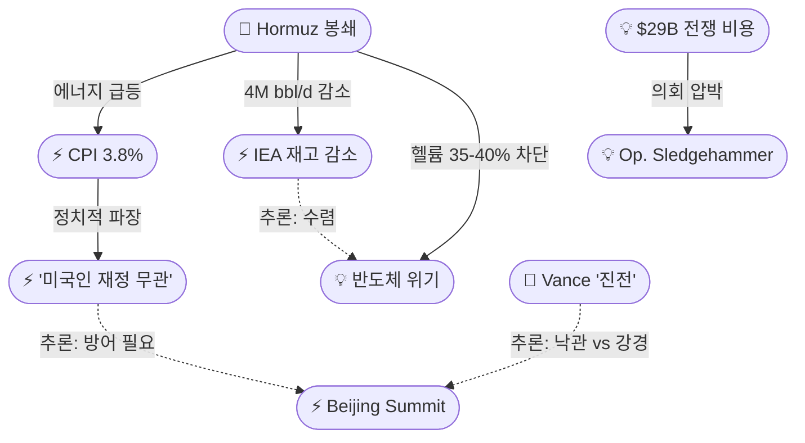
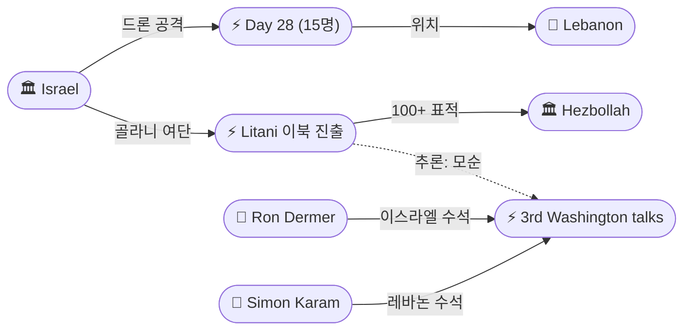
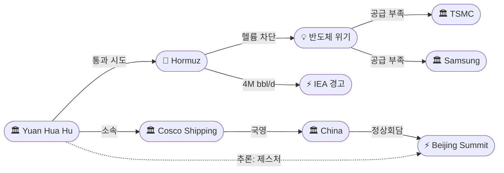

# 2026-05-14 2026 Iran War OSINT 일일 보고서

## 요약

Day 76. **'이중 외교의 날'이 시작되었다.** 트럼프 대통령이 5/13 베이징에 도착하여 9년 만의 첫 방중을 개시했고, 5/14 시진핑 주석과의 정상회담이 이란 전쟁·무역·대만을 핵심 의제로 진행된다. 동시에 워싱턴에서는 이스라엘-레바논 3차 평화 회담이 **사상 최초로 군사 대표를 포함**하여 개최된다. 전쟁의 경제 충격이 정량화되었다: **미국 CPI가 4월 3.8%로 3년 최고**, 전쟁 비용은 **$29B**으로 상향, IEA는 원유 재고가 **기록적 속도(4M bbl/day)**로 감소하고 있다고 경고했다. 트럼프는 출국 전 "I don't think about Americans' financial situation, not even a little bit"이라는 논쟁적 발언을 남겼다. 레바논에서는 Day 28 하루 **15명이 사망**(아동 2명 포함)했고, IDF는 **리타니강 이북 최초 진출**(골라니 여단 1주간 작전, 100+ 표적 파괴)을 공개했다. 중국 국영 유조선 **Yuan Hua Hu**가 정상회담에 맞춰 호르무즈 통과를 시도하고 있으며, 호르무즈 봉쇄가 **글로벌 반도체 공급망**까지 타격하고 있다는 Bloomberg 분석이 나왔다.

## 주요 뉴스

### 1. 트럼프 베이징 도착, 시진핑 정상회담 개시 — 9년 만의 방중, CEO 대거 동행
- **출처:** [CNBC](https://www.cnbc.com/2026/05/13/trump-china-xi-beijing-meeting-ceos.html)
- **일시:** 2026-05-13~14
- **내용:** 트럼프 대통령이 5/13 저녁 베이징에 도착했다. 한정 부주석이 공항에서 영접했다. 루비오 국무장관, 헤그세스 국방장관과 함께 엘론 머스크(테슬라), 팀 쿡(애플), 젠슨 황(엔비디아) 등 10여 명의 CEO가 동행했다. 14일 오전 환영식과 양자 회담 후 천단 관람과 국빈 만찬이 예정되어 있다. 15일 차와 실무 오찬 후 출국한다. 주요 의제는 이란 전쟁(중국의 이란 원유 구매), 관세, 희토류, AI, 대만이다. 중국은 이란 원유 수출의 80% 이상을 구매하는 최대 고객국으로, 시진핑의 태도가 전쟁 궤적에 결정적 변수다.
- **상태:** 신규
- **관련 엔티티:** Donald Trump, Xi Jinping, China, Marco Rubio, Pete Hegseth, Elon Musk, Tim Cook

### 2. 트럼프: "미국인 재정 상황은 생각도 안 해" — 출국 전 논쟁적 발언
- **출처:** [CNN](https://www.cnn.com/2026/05/12/world/live-news/trump-iran-war-news)
- **일시:** 2026-05-12
- **내용:** 트럼프 대통령이 5/12 중국행 출국 전 기자들에게 "I don't think about Americans' financial situation. I don't think about anybody"라고 발언했다. 이란 전쟁이 미국인 가계에 미치는 영향이 딜 추진의 동기인지 묻자 "Not even a little bit"이라 답했다. CPI가 3.8%(3년 최고)를 기록한 직후의 발언으로, Time, Rolling Stone, Washington Post 등이 'the ultimate gaffe'로 보도하며 정치적 파장이 확산되고 있다.
- **상태:** 신규
- **관련 엔티티:** Donald Trump, Iran

### 3. 미국 CPI 4월 3.8% — 3년 최고, 이란 전쟁 에너지 가격이 주도
- **출처:** [CNBC](https://www.cnbc.com/2026/05/12/cpi-inflation-april-2026-.html)
- **일시:** 2026-05-12
- **내용:** 미국 소비자물가지수(CPI)가 4월 전년 대비 3.8% 상승하여 2023년 5월 이후 최고를 기록했다. 에너지 가격이 전체 상승분의 40%를 차지했다. 휘발유 +28.4%, 항공료 +20.7%, 쇠고기 +14.8%(모두 전년 대비). 인플레이션을 감안한 실질 시간당 임금은 전년 대비 -0.3%로 3년 만에 첫 하락이다. 2/28 이란 전쟁 개시와 호르무즈 봉쇄가 에너지 가격 급등의 직접 원인이다.
- **상태:** 신규
- **관련 엔티티:** Iran, Strait of Hormuz, CPI April 3.8%

### 4. 펜타곤: 전쟁 비용 $29B로 상향 — 하버드 전문가 "실질 $1T"
- **출처:** [CNN](https://www.cnn.com/2026/05/13/world/live-news/trump-iran-war-news)
- **일시:** 2026-05-12~13
- **내용:** 펜타곤 고위 관리들이 5/12 의회 청문회에서 이란 전쟁 비용이 $29B에 달한다고 밝혔다 — 2주 전 $25B에서 $4B 상향. 증가분은 장비 수리/교체 비용과 작전 유지 비용을 반영한다. 탄약, 항공기 손상, 운용유지비 등을 포함하지만, 손상된 군사시설 복구 비용은 제외되었다. 하버드 케네디스쿨의 Linda Bilmes 교수는 실질 비용이 $1T에 달할 것으로 추산했다.
- **상태:** 신규
- **관련 엔티티:** US Military, Pentagon, Linda Bilmes

### 5. 펜타곤, '슬레지해머 작전' 개명 검토 — 휴전 결렬 시 WPR 시계 리셋
- **출처:** [NBC News](https://www.nbcnews.com/politics/national-security/pentagon-considering-re-naming-iran-war-sledgehammer-ceasefire-collaps-rcna344630)
- **일시:** 2026-05-13
- **내용:** NBC News에 따르면 펜타곤이 휴전 결렬 시 이란 전쟁을 'Operation Epic Fury'에서 'Operation Sledgehammer'로 개명하는 방안을 검토하고 있다. 이 개명은 트럼프가 전쟁권한법(WPR)의 60일 시계가 리셋되었다고 주장할 수 있게 해준다 — 의회 승인 없이 전쟁을 지속하기 위한 법적 우회 수단이다. 한 펜타곤 관리는 Epic Fury가 종료된 것이 아니라 휴전으로 주요 전투가 '일시 중단'된 것이라고 밝혔다.
- **상태:** 신규
- **관련 엔티티:** US Military, Pentagon, Operation Sledgehammer

### 6. 밴스: 이란 협상 "진전 있다" — 쿠슈너·위트코프와 통화
- **출처:** [Al-Monitor](https://www.al-monitor.com/originals/2026/05/vance-says-us-making-progress-iran-talks)
- **일시:** 2026-05-13
- **내용:** JD 밴스 부통령이 5/13 "I think that we are making progress"라고 밝혔다. "The fundamental question is do we make enough progress that we satisfy the President's red line" — 이란의 핵무기 보유 불가가 레드라인이라고 설명했다. 밴스는 당일 아침 쿠슈너, 위트코프와 통화했으며 아랍권 접촉도 언급했다. 트럼프의 'life support' 수사와 대비되는 낙관적 신호다.
- **상태:** 신규
- **관련 엔티티:** JD Vance, Jared Kushner, Steve Witkoff

### 7. IRGC, 테헤란 인근 5일간 대규모 군사훈련 — "미국 침공 시뮬레이션"
- **출처:** [Israel Hayom](https://www.israelhayom.com/2026/05/13/rgc-drill-simulates-us-invasion-tehran)
- **일시:** 2026-05-09~13
- **내용:** IRGC 테헤란 모함마드 라술룰라 군단이 5일간 '순교 사령관(Martyred Commander)' 훈련을 실시했다. 암호명 'Labbayk Ya Khamenei'(고 최고지도자에 대한 충성 서약). 하산 하산자데 사령관은 IRGC와 바시즈 대대의 "완전한 전투 준비 태세"를 선언했다. 미국-이스라엘 침공 시나리오를 시뮬레이션했으며, 다양한 지형에서의 개인/집단 전술을 평가했다.
- **상태:** 신규
- **관련 엔티티:** IRGC, Hassan Hassanzadeh

### 8. 중국 초대형 유조선 Yuan Hua Hu, 호르무즈 봉쇄 시험 — 정상회담 타이밍
- **출처:** [Bloomberg](https://www.bloomberg.com/news/articles/2026-05-13/hormuz-tracker-chinese-tanker-set-to-test-us-naval-blockade)
- **일시:** 2026-05-13
- **내용:** 중국 국영 Cosco Shipping 소속 초대형 유조선(VLCC) Yuan Hua Hu가 이라크 바스라에서 적재한 200만 배럴의 원유를 싣고 호르무즈 해협을 통과하여 오만만으로 진입했다. 이란 라라크 섬 통로를 통행료 없이 통과했으며, 이는 정상회담에 맞춘 테헤란의 중국에 대한 제스처로 해석된다. 전쟁 이후 세 번째 중국 VLCC 통과 시도다. 미국 봉쇄선을 통과할 수 있을지가 핵심 변수다.
- **상태:** 신규
- **관련 엔티티:** Yuan Hua Hu, Cosco Shipping, China, Strait of Hormuz

### 9. IEA 경고: 원유 재고 기록적 속도로 감소 — "10월까지 심각한 공급 부족"
- **출처:** [CNBC](https://www.cnbc.com/2026/05/13/oil-price-spike-turmoil-iea-iran-war.html)
- **일시:** 2026-05-13
- **내용:** IEA 5월 보고서에 따르면 글로벌 원유 재고가 3-4월에 일 400만 배럴 속도로 감소했다 — 기록적 속도다. 3월 1억2900만 배럴, 4월 1억1700만 배럴 감소. OECD 지상 재고만 1억4600만 배럴 줄었다. IEA는 분쟁이 다음 달 종료되더라도 시장이 **10월까지 '심각한 공급 부족' 상태**를 유지할 것이라 경고했다.
- **상태:** 신규
- **관련 엔티티:** IEA, Strait of Hormuz

### 10. 레바논 Day 28: 15명 사망(아동 2명 포함) — 지예 고속도로 드론 공격
- **출처:** [Al Jazeera](https://www.aljazeera.com/news/2026/5/13/at-least-eight-killed-in-israeli-drone-strikes-on-highway-south-of-beirut)
- **일시:** 2026-05-14
- **내용:** 이스라엘 공격으로 레바논 전역에서 15명이 사망했다. 베이루트 남쪽 20km 지예(Jiyeh) 인근 베이루트-남부 고속도로에서 3건의 드론 공격으로 아동 2명을 포함한 8명이 사망했다. 휴전 이후 이스라엘 공격 누적 사망자는 AFP 집계 기준 380명 이상이다. 3차 워싱턴 회담 당일의 공격이라는 점에서 외교적 파장이 예상된다.
- **상태:** 신규
- **관련 엔티티:** Israel, Lebanon, Jiyeh

### 11. IDF, 리타니강 이북 최초 진출 — 골라니 여단 1주간 작전, 100+ 표적 파괴
- **출처:** [Times of Israel](https://www.timesofisrael.com/idf-says-it-carried-out-weeklong-raid-on-hezbollah-sites-beyond-lebanons-litani-river/)
- **일시:** 2026-05-13 (작전 기간 약 5/6~13)
- **내용:** IDF가 5/13 골라니 여단 정찰부대의 리타니강 이북 1주간 작전을 공개했다. 자우타르 아시샤르키야(Zawtar al-Sharqiyah, 국경에서 약 10km) 인근에서 100개 이상의 군사 표적을 타격했다. 대규모 지하 터널 네트워크, 무기 비축소, 로켓 발사대를 발견·파괴했다. 4/16 휴전 이후 IDF가 리타니강을 넘은 것은 처음이며, 휴전의 핵심 경계를 위반한 것으로 평가된다.
- **상태:** 신규
- **관련 엔티티:** Israel, Hezbollah, Litani River, Golani Brigade

### 12. 3차 이스라엘-레바논 워싱턴 회담 개시 — 최초 군사 대표 참여
- **출처:** [The National](https://www.thenationalnews.com/news/us/2026/05/07/lebanon-and-israel-to-hold-third-round-of-talks-in-washington-next-week/)
- **일시:** 2026-05-14~15
- **내용:** 이스라엘과 레바논의 3차 워싱턴 평화 회담이 5/14-15 개최된다. 이번 회담에는 **사상 최초로 양측 군사 대표가 참여**한다. 이스라엘 대표단은 론 더머(Ron Dermer), 레바논 대표단은 시몬 카람(Simon Karam)이 이끈다. 헤즈볼라 무장 해제를 위한 구체적 조치가 논의 초점이다. 트럼프-시진핑 정상회담과 **같은 날** 진행되어 이란 전쟁의 양대 전선이 동시에 외교 시험대에 오른다.
- **상태:** 신규
- **관련 엔티티:** Israel, Lebanon, Ron Dermer, Simon Karam

### 13. 호르무즈 봉쇄, 글로벌 반도체 공급망 타격 — 헬륨 35-40% 차단
- **출처:** [Bloomberg](https://www.bloomberg.com/news/articles/2026-05-13/how-the-strait-of-hormuz-blockade-is-disrupting-global-chip-supply-chains)
- **일시:** 2026-05-13
- **내용:** 호르무즈 봉쇄가 카타르 라스 라판 시설에서 공급되던 **글로벌 헬륨의 35-40%**를 차단하고 있다. 헬륨 현물가는 2026년에 $450/kcf(천 입방피트)를 돌파했다. 약 200개의 특수 컨테이너가 좌초되었다. TSMC, 삼성 등 주요 파운드리가 공급 부족에 직면했으며, Q3까지 봉쇄가 지속되면 팹 재고가 고갈될 수 있다. EUV 리소그래피 장비가 전력 차질로 손상될 위험도 있다. 에너지 위기와 기술 위기가 수렴하는 복합 공급망 위기다.
- **상태:** 신규
- **관련 엔티티:** Strait of Hormuz, TSMC, Samsung

### 14. 유가: 브렌트 $110.87 / WTI $102 — IEA 경고로 추가 상승
- **출처:** [CNBC](https://www.cnbc.com/2026/05/12/oil-prices-today-brent-wti-trump-iran-war-hormuz.html)
- **일시:** 2026-05-13
- **내용:** 브렌트유 7월물 $110.87(5/12 대비 +2.9%), WTI 6월물 $102.18(+4.2%)에 거래되고 있다. 3거래일 연속 상승으로 WTI만 7.6% 올랐다. IEA의 기록적 재고 감소 경고와 협상 교착이 상승 동력이다. 전쟁 전 $70대에서 현재 $100대 중반으로, 5/14 정상회담 결과에 따라 추가 변동이 예상된다.
- **상태:** 업데이트 ← 2026-05-11 유가 보도
- **관련 엔티티:** Brent crude, WTI, IEA

### 15. [한국] 미중 정상회담 — 트럼프 '5B' vs 시진핑 '3T', 이란·관세·희토류 핵심 의제
- **출처:** [세계일보](https://segye.com/newsView/20260513515793)
- **일시:** 2026-05-13~14
- **내용:** 세계일보는 14일 미중 정상회담을 트럼프의 '5B'(Buy·Build·Borrow·Balance·Blockade) 대 시진핑의 '3T'(Trade·Taiwan·Technology)로 프레이밍했다. 파이낸셜뉴스는 트럼프가 "회담은 무역에 집중, 이란 도움은 불필요"라고 밝혔다고 보도했다. 이투데이는 청와대/용산이 중동·공급망·관세 파장을 주시하고 있다고 전했다. 한국은 호르무즈를 통과하는 카타르 LNG에 25% 의존하여 직접 영향을 받는 상황이다.
- **상태:** 신규
- **관련 엔티티:** Donald Trump, Xi Jinping, China, South Korea

## 지식그래프

### 오늘의 주요 관계

1. **이중 외교 동시 진행:** 트럼프-시진핑 베이징 정상회담(ent-338) + 3차 이스라엘-레바논 워싱턴 회담(ent-352)이 5/14 동시 개최.
2. **경제 충격 인과 체인:** 호르무즈 봉쇄(ent-008) → IEA 재고 감소(ent-358) + CPI 3.8%(ent-354) + 반도체 위기(ent-362) — 하나의 원인에서 세 갈래 위기 분기.
3. **트럼프 발언-경제 연결:** CPI 3.8%(전쟁 비용) → '미국인 재정 무관' 발언(ent-353) — 정치적 파장.
4. **레바논 군사-외교 모순:** IDF 리타니강 이북 진출(ent-360) ↔ 3차 워싱턴 회담(ent-352) — 군사 행동이 외교를 약화.
5. **중국 유조선 신호:** Yuan Hua Hu(ent-357) 호르무즈 통과 시도 ← 정상회담(ent-338)에 맞춘 중국-이란 조율.

### 전체 지식그래프 시각화

```mermaid
graph LR
    ent-001(["👤 Trump"])
    ent-283(["👤 Xi Jinping"])
    ent-338(["⚡ Beijing Summit"])
    ent-282(["🏛 China"])
    ent-002(["🏛 Iran"])
    ent-008(["📍 Hormuz"])
    ent-357(["🏛 Yuan Hua Hu"])
    ent-353(["⚡ 'Americans' finances'"])
    ent-354(["⚡ CPI 3.8%"])
    ent-355(["💡 War cost $29B"])
    ent-356(["💡 Op. Sledgehammer"])
    ent-358(["⚡ IEA warning"])
    ent-362(["💡 Semiconductor crisis"])
    ent-004(["🏛 Israel"])
    ent-079(["📍 Lebanon"])
    ent-360(["⚡ Litani crossing"])
    ent-361(["⚡ Day 28 (15 killed)"])
    ent-352(["⚡ 3rd Washington talks"])
    ent-044(["👤 Vance"])
    ent-359(["⚡ IRGC drill"])
    ent-005(["🏛 IRGC"])

    ent-001 -->|"정상회담"| ent-338
    ent-283 -->|"정상회담"| ent-338
    ent-338 -->|"위치"| ent-282
    ent-001 -->|"발언"| ent-353
    ent-008 -->|"원인"| ent-354
    ent-008 -->|"원인"| ent-358
    ent-008 -->|"원인"| ent-362
    ent-004 -->|"공습 15명"| ent-361
    ent-004 -->|"리타니 진출"| ent-360
    ent-360 -.->|"추론: 모순"| ent-352
    ent-357 -->|"통과 시도"| ent-008
    ent-357 -.->|"추론: 연계"| ent-338
    ent-354 -.->|"추론: 인과"| ent-353
    ent-005 -->|"참여"| ent-359
    ent-044 -->|"'진전'"| ent-002
    ent-356 -.->|"추론: 후속"| ent-355
end
```

### 미-이란 협상 & 경제 충격 축



### 레바논 전선 축



### 호르무즈 & 글로벌 공급망 축



## 온톨로지 변경

| 변경 유형 | 대상 | 근거 |
|----------|------|------|
| 새 엔티티 | ent-353: Trump 'Americans' finances' statement | '미국인 재정 무관' 논쟁적 발언 (src-1054) |
| 새 엔티티 | ent-354: CPI April 3.8% | 3년 최고 인플레이션, 전쟁 경제 충격 정량화 (src-1055) |
| 새 엔티티 | ent-355: War cost $29B | 펜타곤 전쟁 비용 상향 (src-1056) |
| 새 엔티티 | ent-356: Operation Sledgehammer | WPR 시계 리셋 검토 (src-1057) |
| 새 엔티티 | ent-357: Yuan Hua Hu | 중국 유조선 호르무즈 시험 (src-1060) |
| 새 엔티티 | ent-358: IEA record inventory warning | 원유 재고 기록적 감소 경고 (src-1061) |
| 새 엔티티 | ent-359: IRGC Martyred Commander drill | 테헤란 5일간 군사훈련 (src-1059) |
| 새 엔티티 | ent-360: IDF Litani River crossing | 골라니 여단 리타니 이북 작전 (src-1063) |
| 새 엔티티 | ent-361: Day 28 Lebanon strikes (15 killed) | 지예 드론 공격 포함 (src-1062) |
| 새 엔티티 | ent-362: Hormuz semiconductor disruption | 반도체 공급망 타격 (src-1065) |
| 새 엔티티 | ent-363: Litani River | 레바논 핵심 경계선 (src-1063) |
| 새 엔티티 | ent-364: Jiyeh | 베이루트 남쪽 20km 공격 지점 (src-1062) |

## 추론 결과

| 추론 | 신뢰도 | 근거 |
|------|--------|------|
| Hormuz → CPI 3.8% → Trump 'finances' 발언 인과 체인 | 0.80 | 봉쇄 → 에너지 급등 → 인플레이션 → 정치적 파장 3단계 |
| Yuan Hua Hu ↔ Beijing Summit 조율 | 0.80 | 중국 국영 선박 + 정상회담 당일 통과 = 조율된 시그널링 |
| IDF Litani crossing ↔ 3rd Washington talks 모순 | 0.85 | 같은 날 군사 에스컬레이션 + 평화 회담 = 구조적 모순 |
| $29B → Operation Sledgehammer 연계 | 0.75 | 비용 공개 → 의회 압박 → 법적 우회 시도 |
| IEA warning ↔ Semiconductor crisis 수렴 | 0.80 | 에너지 + 기술 공급망 모두 호르무즈 기원 |

## 분석 및 평가

**1. '이중 외교의 날' — 5/14의 구조적 의미:** 트럼프-시진핑 베이징 정상회담과 이스라엘-레바논 3차 워싱턴 회담이 같은 날 진행된다. 이란 전쟁의 두 축(호르무즈/레바논)이 동시에 외교적 시험대에 오르는 유례없는 구조다. 베이징에서는 중국의 이란 원유 구매(80%+)와 호르무즈 개방이 핵심이고, 워싱턴에서는 헤즈볼라 무장 해제가 핵심이다. 두 회담의 결과가 상호작용할 가능성이 높다 — 베이징에서 진전이 있으면 워싱턴 회담에도 압력이 줄어들고, 역도 마찬가지다.

**2. 경제 충격의 정량화:** 오늘 세 개의 핵심 경제 데이터가 동시에 나왔다. CPI 3.8%(3년 최고), 전쟁 비용 $29B, IEA 재고 4M bbl/day 감소. 이 세 수치는 전쟁의 실물경제 비용을 처음으로 종합적으로 보여준다. 특히 IEA의 "10월까지 공급 부족" 경고는 전쟁이 내일 끝나더라도 경제적 후유증이 수개월 지속될 것임을 의미한다. 호르무즈 봉쇄가 에너지뿐 아니라 반도체 공급망(헬륨 35-40% 차단)까지 타격하면서 '복합 공급망 위기'로 확대되고 있다.

**3. 레바논 휴전의 허구화 심화:** IDF가 리타니강 이북 — 휴전의 핵심 경계 — 까지 진출하여 100+ 표적을 파괴하면서 '휴전'의 실질적 의미가 더욱 퇴색했다. Day 28 하루 15명 사망, 누적 380명+. 같은 날 워싱턴에서 평화 회담을 진행한다는 사실 자체가 구조적 모순이다. 이번 3차 회담에 군사 대표가 처음 참여하는 것은 양측이 군사적 현실을 인정하기 시작했음을 시사하지만, IDF의 리타니 진출이 회담 분위기를 크게 훼손할 수 있다.

**4. '슬레지해머' — 법적 우회의 현실화:** 펜타곤이 작전 개명을 통해 WPR 60일 시계를 리셋하려는 시도는, 트럼프 행정부가 의회 승인 없이 전쟁을 지속할 법적 기반을 확보하려는 것이다. 5/1의 '적대행위 종료' 서한에 이어 두 번째 법적 우회 시도다. 의회와의 긴장이 더욱 고조될 전망이다.

## 추적 항목

| 항목 | 최초 보고 | 상태 | 최신 업데이트 |
|------|----------|------|-------------|
| 14-Point MoU 협상 | 2026-05-06 | **교착 / 정상회담 전환** | 밴스 '진전', 트럼프 베이징 도착, 시진핑과 이란 논의 (5/14) |
| 트럼프-시진핑 정상회담 | 2026-05-10 | **D-day** | 트럼프 5/13 도착, 5/14 양자 회담 진행 중 (5/14) |
| 레바논 휴전 | 2026-04-16 | **사실상 붕괴** | Day 28: 15명 사망, 누적 380명+, IDF 리타니 이북 진출 (5/14) |
| 이스라엘-레바논 워싱턴 회담 | 2026-04-14 | **3차 D-day** | 5/14-15 개최, 최초 군사 대표 참여 (5/14) |
| 호르무즈 봉쇄 | 2026-04-13 | **유지 + 중국 시험** | Yuan Hua Hu VLCC 통과 시도, 반도체 공급망 타격 (5/14) |
| 전쟁 비용 | 2026-04-29 | **$29B 상향** | $25B→$29B, 하버드 $1T 추산 (5/12) |
| 유가 | 2026-02-28 | **$110대** | Brent $110.87, WTI $102, IEA 공급 부족 경고 (5/13) |
| WPR/의회 갈등 | 2026-04-24 | **'슬레지해머' 개명 검토** | 작전명 변경으로 60일 시계 리셋 시도 (5/13) |
| CPI/인플레이션 | 2026-05-14 | **신규 — 3.8%** | 4월 CPI 3년 최고, 휘발유 +28.4% (5/12) |

## 동향 요약

| 분류 | 상태 | 비고 |
|------|------|------|
| 미-이란 협상 | 정상회담 전환 | 양자→다자(중국), 밴스 '진전' |
| 트럼프-시진핑 정상회담 | D-day 진행 중 | 이란·무역·대만·희토류 의제 |
| 레바논 전선 | 사실상 붕괴 | Day 28: 15명 사망, IDF 리타니 이북 |
| 이-레 회담 | 3차 D-day | 최초 군사 대표 참여 |
| 호르무즈 봉쇄 | 유지 + 시험 | Yuan Hua Hu 통과 시도, 반도체 타격 |
| 경제 충격 | 심화 | CPI 3.8%, $29B, IEA 재고 기록적 감소 |
| 유가 | 상승 | Brent $110.87(+6.4% vs 5/11) |
| WPR | '슬레지해머' 검토 | 작전 개명으로 의회 우회 시도 |

## 출처 목록

1. [Trump in China: President lands in Beijing with Tesla, Nvidia CEOs](https://www.cnbc.com/2026/05/13/trump-china-xi-beijing-meeting-ceos.html) - CNBC, 2026-05-13
2. [Day 74: Trump says 'I don't think about Americans' financial situation'](https://www.cnn.com/2026/05/12/world/live-news/trump-iran-war-news) - CNN, 2026-05-12
3. [CPI inflation April 2026: Prices rose 3.8% annually](https://www.cnbc.com/2026/05/12/cpi-inflation-april-2026-.html) - CNBC, 2026-05-12
4. [Cost of Iran war increases to $29 billion, Pentagon says](https://www.cnn.com/2026/05/13/world/live-news/trump-iran-war-news) - CNN, 2026-05-13
5. [Pentagon considering renaming Iran war 'Sledgehammer'](https://www.nbcnews.com/politics/national-security/pentagon-considering-re-naming-iran-war-sledgehammer-ceasefire-collaps-rcna344630) - NBC News, 2026-05-13
6. [Vance says US making progress in Iran talks](https://www.al-monitor.com/originals/2026/05/vance-says-us-making-progress-iran-talks) - Al-Monitor, 2026-05-13
7. [Iran's IRGC drills US invasion near Tehran](https://www.israelhayom.com/2026/05/13/rgc-drill-simulates-us-invasion-tehran) - Israel Hayom, 2026-05-13
8. [Chinese supertanker tests Hormuz blockade](https://www.bloomberg.com/news/articles/2026-05-13/hormuz-tracker-chinese-tanker-set-to-test-us-naval-blockade) - Bloomberg, 2026-05-13
9. [Oil price spike turmoil far from over, IEA says](https://www.cnbc.com/2026/05/13/oil-price-spike-turmoil-iea-iran-war.html) - CNBC, 2026-05-13
10. [At least 15 killed in Israeli attacks on Lebanon](https://www.aljazeera.com/news/2026/5/13/at-least-eight-killed-in-israeli-drone-strikes-on-highway-south-of-beirut) - Al Jazeera, 2026-05-14
11. [IDF weeklong raid north of Litani River](https://www.timesofisrael.com/idf-says-it-carried-out-weeklong-raid-on-hezbollah-sites-beyond-lebanons-litani-river/) - Times of Israel, 2026-05-13
12. [Lebanon and Israel to hold third round of talks in Washington](https://www.thenationalnews.com/news/us/2026/05/07/lebanon-and-israel-to-hold-third-round-of-talks-in-washington-next-week/) - The National, 2026-05-07
13. [Hormuz blockade disrupts global chip supply chains](https://www.bloomberg.com/news/articles/2026-05-13/how-the-strait-of-hormuz-blockade-is-disrupting-global-chip-supply-chains) - Bloomberg, 2026-05-13
14. [Oil prices rise: Brent $110.87, WTI $102](https://www.cnbc.com/2026/05/12/oil-prices-today-brent-wti-trump-iran-war-hormuz.html) - CNBC, 2026-05-13
15. [이란 전쟁 변수 속 트럼프 '5B' 시진핑 '3T'](https://segye.com/newsView/20260513515793) - 세계일보, 2026-05-13
16. [Trump arrives in Beijing for state visit](https://www.globaltimes.cn/page/202605/1360929.shtml) - Global Times, 2026-05-13
17. [Trump arrives Beijing — WaPo](https://www.washingtonpost.com/politics/2026/05/13/trump-arrives-china-meet-with-xi-jinping-taiwan-trade-iran/) - Washington Post, 2026-05-13
18. [Trump lands in China as Iran war smolders](https://www.npr.org/2026/05/12/nx-s1-5818529/trump-china-iran-war) - NPR, 2026-05-12
19. [Trump-Xi summit: China's help may require US concessions](https://www.aljazeera.com/news/2026/5/13/trump-xi-summit-chinas-help-in-iran-may-require-us-concessions) - Al Jazeera, 2026-05-13
20. ['Not Even A Little Bit': Trump shrugs off economic concerns](https://time.com/article/2026/05/13/trump-economy-financial-concerns-us-pentagon-iran-war-cost/) - Time, 2026-05-13
21. [Iran war fuels sharpest inflation spike in 3 years](https://www.washingtonpost.com/business/2026/05/12/iran-inflation-trump-oil-gas-prices/) - Washington Post, 2026-05-12
22. [Pentagon gives new $29B war price tag](https://www.aljazeera.com/news/2026/5/12/pentagon-gives-new-29bn-iran-war-price-tag-downplays-munitions-concerns) - Al Jazeera, 2026-05-12
23. [Oil Inventories Falling at Record Pace — Bloomberg](https://www.bloomberg.com/news/articles/2026-05-13/oil-inventories-fall-at-record-pace-on-iran-war-shock-iea-says) - Bloomberg, 2026-05-13
24. [Israeli forces cross north of Litani River](https://www.arabnews.com/node/2643247/middle-east) - Arab News, 2026-05-13
25. [Lebanon says Israeli strikes on cars kill 12](https://www.rte.ie/news/middle-east/2026/0513/1573202-israel-lebanon/) - RTE, 2026-05-13
26. [IRGC holds major 5-day combat exercise around Tehran](https://www.islamtimes.com/en/video/1279884/irgc-holds-major-5-day-combat-exercise-around-tehran) - Islam Times, 2026-05-13
27. [Iran war Day 75 live: Trump-Xi talks loom](https://www.aljazeera.com/news/2026/5/13/iran-war-day-75-trump-xi-talks-loom-in-beijing-as-tensions-rise-in-gulf) - Al Jazeera, 2026-05-13
28. [방중길 트럼프 '이란 도움 불필요'](https://www.newspim.com/news/view/20260513000013) - 뉴스핌, 2026-05-13
29. [트럼프-시진핑 오늘 담판…중동·공급망·관세 파장 촉각](https://www.fnnews.com/news/202605140505235826) - 파이낸셜뉴스, 2026-05-14
30. [CBS Day 75 live: Iran ready to repel new US attack](https://www.cbsnews.com/live-updates/iran-war-us-trump-china-xi-summit-ceasefire-peace-talks-stalled/) - CBS, 2026-05-13
