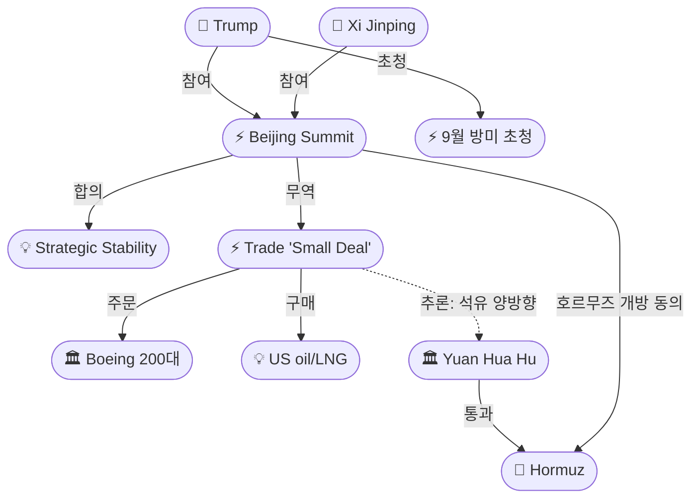
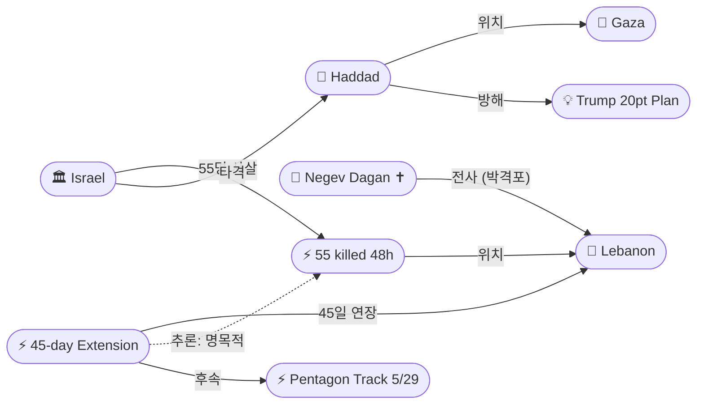
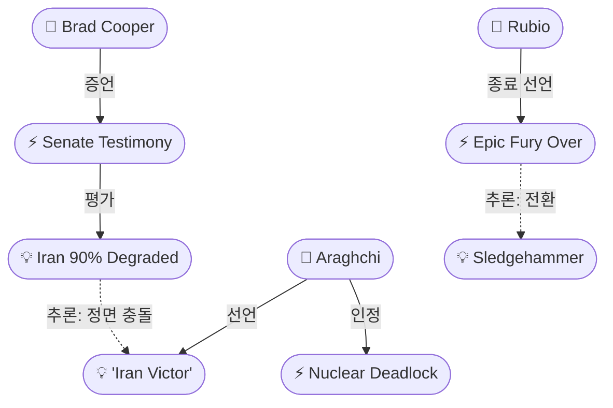

# 2026-05-15 2026 Iran War OSINT 일일 보고서

## 요약

Day 77. **'합의 없는 합의, 휴전 없는 휴전'의 날이다.** 트럼프-시진핑 베이징 정상회담이 2박 3일 일정을 마치고 **호르무즈 개방·이란 핵 반대에 원칙적 동의**를 발표했으나, 공동성명도 구체적 이행 방안도 없는 **'스몰딜'**로 마무리됐다. 트럼프는 시진핑의 9월 방미를 초청했다. 무역에서는 **보잉 737 200대**(시장 기대 500대의 절반, Boeing 주가 -4%)와 미국산 석유·대두 구매를 발표했으나 **중국 측은 미확인**이다. 동시에 워싱턴에서는 이스라엘-레바논 3차 회담이 **'매우 생산적'** 이라는 평가와 함께 **45일 휴전 연장**에 합의했으나, 같은 48시간 동안 이스라엘은 **레바논에서 55명을 사살**했다(IDF 골라니 여단 다간 중사 전사). 아라그치 이란 외무장관은 **핵 농축우라늄 교착을 공식 인정**하고 핵 문제를 '후순위'로 합의했다고 밝혔으며, 동시에 **"이란이 전쟁의 승자"**라고 선언했다. 이는 CENTCOM 쿠퍼 사령관의 **"이란 군사력 90% 파괴, 재건에 한 세대"** 증언과 정면으로 충돌한다. 이스라엘은 가자에서 **하마스 최고위 지휘관 이즈 알딘 하다드를 타격**했다.

## 주요 뉴스

### 1. 트럼프-시진핑 정상회담 마무리 — '전략적 안정' 합의, 호르무즈 개방 동의, 공동성명 없는 '스몰딜'
- **출처:** [CNBC](https://www.cnbc.com/2026/05/14/trump-xi-summit-beijing-takeaway-taiwan-trade-iran-war-strategic-relations-.html)
- **일시:** 2026-05-14~15
- **내용:** 트럼프와 시진핑이 2박 3일 베이징 정상회담을 마무리했다. 양국은 "에너지의 자유로운 흐름을 위해 호르무즈 해협이 반드시 개방돼야 한다"는 데 동의하고, 이란의 핵무기 보유 불가에 합의했다. 중국은 향후 3년의 양자 관계를 규정하는 '건설적 전략적 안정 관계(Constructive Strategic Stability)' 프레임워크를 제안했다. 시진핑은 대만에 대해 '분쟁 가능성'을 경고하며 최강경 언어를 사용했다. **공동성명이나 합의문 발표는 없었다.** Al Jazeera는 양측이 "합의한 것에 대해 의견이 다르다(disagree on what they agreed on)"고 분석했다.
- **상태:** 신규
- **관련 엔티티:** Donald Trump, Xi Jinping, China, Strait of Hormuz, Constructive Strategic Stability Framework

### 2. 중국 무역 '스몰딜' — 보잉 200대(기대 500대), 석유 구매 발표, 중국 미확인
- **출처:** [CNN](https://www.cnn.com/2026/05/15/business/stock-market-china-us-deal-trump-xi-business)
- **일시:** 2026-05-15
- **내용:** 트럼프는 중국이 보잉 737 200대, 미국산 석유·LNG·대두를 구매하기로 합의했다고 발표하며 "fantastic trade deals"라 평가했다. 그러나 보잉 200대는 시장 기대(500대)의 절반에 불과해 **Boeing 주가가 4% 하락**했다. 중국은 포스트 서밋 성명에서 보잉 딜과 석유 구매를 언급하지 않았다. CNN은 "few deals to show for it"이라 평가했다. 트럼프는 시진핑에게 **9월 방미를 초청**했다.
- **상태:** 신규
- **관련 엔티티:** Donald Trump, Xi Jinping, Boeing, China, Beijing Trade Deal 2026

### 3. 이스라엘-레바논 휴전 45일 연장 — '매우 생산적' 회담, 6/2-3 차기 회담, 5/29 군사 트랙 신설
- **출처:** [CNBC](https://www.cnbc.com/2026/05/15/israel-lebanon-agree-to-extend-ceasefire-by-45-days-us-state-dept.html)
- **일시:** 2026-05-15
- **내용:** 이스라엘과 레바논이 3차 워싱턴 회담(5/14-15) 후 **휴전 45일 추가 연장**에 합의했다. 국무부는 양일간의 회담을 "매우 생산적(highly productive)"으로 평가했다. 차기 정치 회담은 **6월 2-3일**, 별도의 **군사 트랙이 5월 29일 펜타곤에서 시작**된다 — 양국 군사 대표단이 직접 참여하는 최초의 안보 채널이다. 4/16 이후 두 번째 연장이다. 헤즈볼라는 회담에 참여하지 않는다. 휴전 이후 누적 사망자 **657명+**, 전체 누적 **2,951명**(보건부 집계).
- **상태:** 신규
- **관련 엔티티:** Israel, Lebanon, 45-day ceasefire extension, Pentagon military track May 29

### 4. 아라그치: 핵 농축우라늄 교착 공식 인정 — '후순위' 합의, 러시아 저장 제안 검토
- **출처:** [Al Jazeera](https://www.aljazeera.com/news/2026/5/15/araghchi_iran_doubts_us_seriousness_about_talks_amid_nuclear_deadlock)
- **일시:** 2026-05-15
- **내용:** 아라그치 이란 외무장관이 농축우라늄 협상이 "거의 교착 상태(almost in a deadlock)"에 있다고 공식 인정했다. 양측은 핵 문제를 "후순위로 미루기로 합의"했으며, "현재 핵 문제는 협상 대상이 아니고, 향후 단계에서 다룰 것"이라고 밝혔다. 러시아가 이란 농축우라늄 저장을 제안한 것에 대해 "해당 단계에 도달하면 러시아와 추가 협의할 것"이라 했다. 트럼프는 폭격된 핵 시설 아래 묻힌 농축우라늄 재고를 'nuclear dust'로 표현했다. 아라그치는 미국의 '진정성'에 의문을 제기했다.
- **상태:** 신규
- **관련 엔티티:** Abbas Araghchi, Iran, Russia, Nuclear enriched uranium deadlock

### 5. CENTCOM 쿠퍼: 이란 군사력 90% 파괴 — "재건에 한 세대", 모든 에픽 퓨리 목표 달성
- **출처:** [Military Times](https://www.militarytimes.com/news/pentagon-congress/2026/05/14/iran-military-threat-is-diminished-but-not-eliminated-centcom-chief-says/)
- **일시:** 2026-05-14
- **내용:** CENTCOM 사령관 브래드 쿠퍼 해군대장이 상원 청문회에서 38일간의 폭격이 이란의 글로벌 위협 능력을 크게 약화시켰다고 증언했다. **방위산업 기반 90% 파괴, 해상 기뢰 8,000개 중 90% 제거**, 해군 재건에 **한 세대**, 드론/미사일 생산 회복에 수년이 소요될 것이라 밝혔다. "에픽 퓨리의 모든 군사 목표를 달성했다(met every military objective)"고 선언했다. 하마스·헤즈볼라·후시는 모두 이란의 무기·지원으로부터 **차단**됐다. 단, "매우 온건하지만 소규모 역량"으로 지역 공격 가능성은 남아 있다.
- **상태:** 신규
- **관련 엔티티:** Brad Cooper, CENTCOM, US Military, Iran, IRGC

### 6. 이스라엘, 하마스 최고위 지휘관 하다드 가자 타격 — "트럼프 20점 계획 방해"
- **출처:** [Times of Israel](https://www.timesofisrael.com/liveblog-may-15-2026/)
- **일시:** 2026-05-15
- **내용:** 이스라엘이 가자지구에서 하마스 최고위 군사지휘관 **이즈 알딘 하다드(Izz al-Din Haddad)**를 표적 타격했다. 이스라엘 고위 안보관리는 타격이 약 10일 전에 승인되었으며, "높은 성공 확률의 작전 기회"로 실행됐다고 밝혔다. 하다드가 트럼프 대통령의 **가자전 종결 20점 계획과 평화위원회(Board of Peace) 노력을 방해**해왔다고 주장했다. 타격 결과(생사 여부)는 미확인이다. CNN은 이를 "가자 내 최고위급 하마스 지휘관 타격"으로 보도했다.
- **상태:** 신규
- **관련 엔티티:** Israel, Izz al-Din Haddad, Trump 20-point Gaza plan, Hamas

### 7. IDF, 레바논 48시간 55명 사살 — 골라니 다간 중사 전사, 누적 657명+
- **출처:** [Haaretz](https://www.haaretz.com/israel-news/israel-security/2026-05-15/ty-article-live/u-s-says-israel-and-lebanon-held-full-day-of-productive-and-positive-talks/0000019e-295b-d6dd-adfe-ebff50420000)
- **일시:** 2026-05-14~15
- **내용:** 이스라엘이 48시간 동안 레바논에서 **55명을 사살**했다. IDF는 약 65개의 헤즈볼라 인프라(무기 저장소, 감시 거점, 지휘소)를 타격하여 20명 이상의 헤즈볼라 요원을 사살했다고 발표했다. **골라니 여단 12대대 네게브 다간 중사(20세)**가 5/14 헤즈볼라 박격포에 전사했다. 이는 휴전 이후 IDF 전사자 중 하나로, '휴전'의 실질적 의미를 더욱 약화시킨다.
- **상태:** 신규
- **관련 엔티티:** Israel, Lebanon, Hezbollah, Negev Dagan, Golani Brigade

### 8. Yuan Hua Hu 호르무즈 성공적 통과 — 오만 정박, 정상회담 연계
- **출처:** [Daily Caller](https://dailycaller.com/2026/05/14/chinese-supertanker-hormuz-blockade-china-talks/)
- **일시:** 2026-05-14
- **내용:** 중국 국영 Cosco Shipping 소속 초대형유조선 **Yuan Hua Hu**가 호르무즈 해협을 성공적으로 통과하여 **오만 해안에 정박**했다. 200만 배럴의 이라크 원유를 실고 중국 저우산(Zhoushan)으로 향할 예정이다. 전쟁 이후 **세 번째 중국 VLCC 통과**이다. 미 해군 봉쇄선 인근을 지나갔으나 미국은 정상회담 기간 중 이를 저지하지 않았다 — 백악관은 이를 "net positive"로 평가했다.
- **상태:** 업데이트 ← 2026-05-14 "Yuan Hua Hu 호르무즈 시험"
- **관련 엔티티:** Yuan Hua Hu, Strait of Hormuz, China, Beijing Summit 2026

### 9. 아라그치: "이란이 전쟁의 승자" — Cooper 90% 열화와 정면 충돌
- **출처:** [Al Jazeera](https://www.aljazeera.com/news/liveblog/2026/5/15/iran-war-live-trumps-visit-to-china-shadowed-by-conflict-with-tehran)
- **일시:** 2026-05-15
- **내용:** 아라그치 이란 외무장관이 국영 TV에서 "모든 국가가 이란이 이 전쟁의 승자임을 인정한다(all countries now acknowledge that the Islamic Republic of Iran was the victor in this war)"고 선언했다. "이란은 적들의 목표 달성을 막았고, 자신의 의지를 관철시키는 데 성공했다"며 "이란은 세계 최강대국에 맞설 수 있는 국가로 다르게 봐야 한다"고 덧붙였다. 이는 같은 날 CENTCOM 쿠퍼 사령관이 "이란 방위산업 90% 파괴, 해군 재건에 한 세대"라고 증언한 것과 정면으로 충돌하며, **양측의 정보전 차원 내러티브 경쟁**을 보여준다.
- **상태:** 신규
- **관련 엔티티:** Abbas Araghchi, Iran, Iran victory narrative

### 10. 루비오, 에픽 퓨리 '종료' 공식 선언 — 슬레지해머로 WPR 시계 리셋 전략
- **출처:** [British Brief](https://www.britbrief.co.uk/politics/diplomacy/pentagon-plans-operation-sledgehammer-to-bypass-war-powers.html)
- **일시:** 2026-05-15
- **내용:** 마르코 루비오 국무장관이 **Operation Epic Fury '종료'**를 공식 선언했다 — "목표를 달성했다(objectives achieved)." 이는 5/14의 '슬레지해머' 개명 검토(src-1057)에서 한 단계 진전된 것이다. 백악관 관리는 차기 전투 단계가 시작되면 **60일 WPR 시계가 리셋**된다는 입장이다. Operation Sledgehammer는 아직 최종 확정되지 않았으나, 이름 변경을 통해 의회 승인 없이 전쟁을 지속하려는 **법적 우회 전략이 단계적으로 현실화**되고 있다.
- **상태:** 신규
- **관련 엔티티:** Marco Rubio, Operation Sledgehammer, US Military, Epic Fury declared over

### 11. 유가: 브렌트 $107.4 — 주간 상승, 호르무즈 돌파구 미가시
- **출처:** [The National](https://www.thenationalnews.com/business/energy/2026/05/15/oil-headed-for-weekly-gain-as-hormuz-disruptions-continue/)
- **일시:** 2026-05-15
- **내용:** 브렌트유 **$107.4(+1.57%)**, 주간 상승세를 유지하고 있다. IEA의 "10월까지 공급 부족" 경고와 협상 교착이 지속 상승 동력이다. 정상회담에서 호르무즈 개방에 원칙적 동의가 있었으나 구체적 메커니즘이 없어 시장 영향은 제한적이다.
- **상태:** 업데이트 ← 2026-05-14 유가 보도
- **관련 엔티티:** Brent crude, Strait of Hormuz

### 12. [한국] '동상이몽' 미중정상회담 '스몰딜'로 마무리 — 보잉·대두·에너지 합의, 이란 이견 여전
- **출처:** [파이낸셜뉴스](https://www.fnnews.com/news/202605152020276826)
- **일시:** 2026-05-15
- **내용:** 파이낸셜뉴스는 미중 정상회담을 **'동상이몽 스몰딜'**로 평가했다. 보잉 200대·대두·에너지 구매에 합의했으나 공동성명은 없었다. 이란 문제에서 미국이 목소리를 낸 반면 중국은 원론적 입장만 유지했으며, 호르무즈 개방과 이란 핵 반대에 동의했으나 **구체적 이행 방안이 없다**고 분석했다. MBC는 "트럼프 손 들어줬다?"라는 제목으로 호르무즈·핵 합의를 보도했다.
- **상태:** 신규
- **관련 엔티티:** Donald Trump, Xi Jinping, China, Boeing

## 지식그래프

### 오늘의 주요 관계

1. **정상회담 '스몰딜' 구조:** 트럼프-시진핑 정상회담(ent-338) → '전략적 안정' 합의(ent-365) + 무역 딜(ent-367) — 호르무즈 개방 동의 but 공동성명 없음.
2. **Cooper vs Araghchi 내러티브 전쟁:** Cooper 증언(ent-371, '90% 열화') ↔ Araghchi '승리' 선언(ent-377) — 같은 날 정면 충돌하는 전쟁 평가.
3. **명목적 휴전의 제도화:** 45일 연장(ent-368) ↔ 48시간 55명 사살(ent-376) — 외교적 프레임과 군사적 현실의 구조적 괴리.
4. **중국 석유 양방향 외교:** 미국산 석유 구매 약속(ent-367) + Yuan Hua Hu 호르무즈 통과(ent-357) — 중국의 레버리지 극대화.
5. **Epic Fury → Sledgehammer:** 루비오 '종료' 선언(ent-379) → 슬레지해머(ent-356) — WPR 시계 리셋 3단계 진화.

### 전체 지식그래프 시각화

```mermaid
graph LR
    ent-001(["👤 Trump"])
    ent-283(["👤 Xi Jinping"])
    ent-338(["⚡ Beijing Summit"])
    ent-365(["💡 Strategic Stability"])
    ent-367(["⚡ Trade 'Small Deal'"])
    ent-366(["🏛 Boeing"])
    ent-357(["🏛 Yuan Hua Hu"])
    ent-008(["📍 Hormuz"])
    ent-282(["🏛 China"])
    ent-002(["🏛 Iran"])
    ent-043(["👤 Araghchi"])
    ent-370(["⚡ Nuclear Deadlock"])
    ent-377(["💡 'Iran Victor'"])
    ent-371(["⚡ Cooper Testimony"])
    ent-235(["👤 Brad Cooper"])
    ent-004(["🏛 Israel"])
    ent-079(["📍 Lebanon"])
    ent-368(["⚡ 45-day Extension"])
    ent-376(["⚡ 55 killed 48h"])
    ent-372(["👤 Haddad"])
    ent-375(["👤 Negev Dagan"])
    ent-379(["⚡ Epic Fury Over"])
    ent-356(["💡 Sledgehammer"])
    ent-042(["👤 Rubio"])

    ent-001 -->|"정상회담"| ent-338
    ent-283 -->|"정상회담"| ent-338
    ent-338 -->|"합의"| ent-365
    ent-338 -->|"무역"| ent-367
    ent-367 -->|"200대"| ent-366
    ent-282 -->|"구매"| ent-366
    ent-357 -->|"통과"| ent-008
    ent-367 -.->|"추론: 석유 양방향"| ent-357
    ent-043 -->|"교착 인정"| ent-370
    ent-043 -->|"'승자' 선언"| ent-377
    ent-235 -->|"증언"| ent-371
    ent-371 -.->|"추론: 모순"| ent-377
    ent-004 -->|"55명 사살"| ent-376
    ent-376 -->|"위치"| ent-079
    ent-368 -.->|"추론: 명목적"| ent-376
    ent-004 -->|"타격"| ent-372
    ent-375 -->|"전사"| ent-004
    ent-042 -->|"종료 선언"| ent-379
    ent-379 -.->|"추론: 전환"| ent-356
end
```

### 정상회담 & 무역 축



### 레바논 전선 & 가자 축



### 전쟁 평가 모순 축



## 온톨로지 변경

| 변경 유형 | 대상 | 근거 |
|----------|------|------|
| 새 엔티티 | ent-365: Constructive Strategic Stability Framework | 미중 3년 양자 프레임워크 (src-1083) |
| 새 엔티티 | ent-366: Boeing | 200대 딜, 주가 -4% (src-1084) |
| 새 엔티티 | ent-367: Beijing Trade Deal 2026 | 보잉·대두·석유 '스몰딜' (src-1084) |
| 새 엔티티 | ent-368: 45-day ceasefire extension | 2차 연장, 6/2-3 차기 회담 (src-1085) |
| 새 엔티티 | ent-369: Pentagon military track May 29 | 이-레 군사 트랙 신설 (src-1085) |
| 새 엔티티 | ent-370: Nuclear enriched uranium deadlock | 핵 교착 공식 인정, 후순위 합의 (src-1086) |
| 새 엔티티 | ent-371: Cooper Senate testimony | Iran 90% 열화, 한 세대 재건 (src-1087) |
| 새 엔티티 | ent-372: Izz al-Din Haddad | 하마스 최고위 군사지휘관, 가자 타격 (src-1088) |
| 새 엔티티 | ent-373: Haddad strike Gaza May 15 | 이스라엘 가자 표적 타격 (src-1088) |
| 새 엔티티 | ent-374: Trump 20-point Gaza plan | 가자전 종결 계획 (src-1088) |
| 새 엔티티 | ent-375: Negev Dagan | IDF 골라니 중사, 헤즈볼라 박격포 전사 (src-1089) |
| 새 엔티티 | ent-376: Day 29-30 Lebanon strikes | 48시간 55명 사살 (src-1089) |
| 새 엔티티 | ent-377: Iran victory narrative | 아라그치 '전쟁 승자' 선언 (src-1091) |
| 새 엔티티 | ent-378: Xi September US visit invitation | 트럼프 9월 방미 초청 (src-1092) |
| 새 엔티티 | ent-379: Epic Fury declared over | 루비오 공식 종료 선언 (src-1094) |

## 추론 결과

| 추론 | 신뢰도 | 근거 |
|------|--------|------|
| Cooper '90% 열화' ↔ Araghchi '전쟁 승리' 모순 | 0.85 | 같은 날 정면 충돌하는 전쟁 평가 — 정보전 내러티브 경쟁 |
| 45일 연장 ↔ 48시간 55명 — 명목적 휴전 | 0.85 | '매우 생산적' 외교 + 55명 사살 = 구조적 괴리 |
| 중국 석유 구매 ↔ Yuan Hua Hu 통과 — 석유 양방향 외교 | 0.80 | 미국산 석유 약속 + 이라크/이란 원유 확보 = 레버리지 극대화 |
| Epic Fury 종료 → Sledgehammer — WPR 시계 리셋 | 0.80 | 루비오 '종료' → 개명 → 60일 리셋의 3단계 법적 전략 |
| 가자 하다드 타격 ↔ 휴전 연장 — 다중 전선 에스컬레이션 | 0.75 | 레바논 휴전 연장 당일 가자 최고위급 타격 (잠정) |

## 분석 및 평가

**1. '합의 없는 합의' — 정상회담의 구조적 한계:** 베이징 정상회담은 호르무즈 개방과 핵무기 반대라는 원칙적 동의를 이끌어냈으나, 공동성명·이행 메커니즘·타임라인이 모두 부재하다. 중국은 미국의 무역 합의 발표를 확인하지 않았고, Al Jazeera의 '합의한 것에 대해 의견이 다르다'는 분석이 핵심을 찌른다. '전략적 안정' 프레임워크는 양자 관계의 관리 틀이지 이란 전쟁의 해결 틀이 아니다. 시진핑의 "도움을 주고 싶다"는 발언은 중재 의사이지 중재 약속이 아니다. 보잉 200대(기대 500대의 절반)는 시장의 실망을 반영하며, 9월 방미 초청은 다음 라운드로의 연기다.

**2. '휴전 없는 휴전'의 제도화:** 45일 연장 합의는 외교적 프레임을 유지하면서 군사 행동을 지속하는 구조를 공식화한다. 같은 48시간에 55명이 사살되고, IDF 병사가 전사하며, 가자에서 하마스 최고위급이 타격당했다. 누적 사망자 657명+은 이것이 '휴전'이 아님을 말해준다. 5/29 군사 트랙 신설은 양측이 이 현실을 인정하기 시작한 신호이며, 군사적 매개변수를 외교적으로 관리하려는 시도다.

**3. 전쟁 평가의 내러티브 전쟁:** Cooper의 '90% 열화, 한 세대 재건'과 Araghchi의 '전쟁 승리자'가 같은 날 나왔다. 이는 양측 모두 국내 청중을 겨냥한 메시지다. Cooper는 상원에 에픽 퓨리의 성과를 보여주고, Araghchi는 이란 국민에게 저항의 성과를 보여준다. 핵 교착의 공식 인정은 Araghchi의 '승리' 주장과 모순되지 않는다 — 이란에게 '승리'는 체제 생존이지 핵 프로그램의 보존이 아닐 수 있다.

**4. Epic Fury → Sledgehammer — 법적 우회의 3단계:** 5/1 '적대행위 종료' 서한 → 5/14 '슬레지해머' 개명 검토 → 5/15 루비오의 Epic Fury '종료' 선언. 이 3단계는 의회 승인 없이 전쟁을 지속하기 위한 법적 기반을 단계적으로 구축하고 있다. '종료된 작전'의 후속으로 '새 작전'을 시작하면 60일 시계가 리셋된다는 논리다. 의회와의 긴장이 더욱 고조될 전망이다.

**5. 중국의 '석유 양방향 외교':** 중국은 미국산 석유 구매를 약속하면서 동시에 Yuan Hua Hu가 이라크 원유를 실고 호르무즈를 통과했다. 미국은 정상회담 기간 이를 저지하지 않았다. 이는 중국이 양방향 석유 외교로 레버리지를 극대화하는 전략이다 — 미국에게는 구매자로, 이란/이라크에게는 고객으로 양쪽 모두에 영향력을 행사한다.

## 추적 항목

| 항목 | 최초 보고 | 상태 | 최신 업데이트 |
|------|----------|------|-------------|
| 14-Point MoU 협상 | 2026-05-06 | **핵 교착 → 후순위** | 아라그치 핵 교착 공식 인정, 핵 문제 '후순위' 합의 (5/15) |
| 트럼프-시진핑 정상회담 | 2026-05-10 | **마무리 — '스몰딜'** | 호르무즈/핵 원칙 동의, 공동성명 없음, 9월 방미 초청 (5/15) |
| 레바논 휴전 | 2026-04-16 | **45일 연장 but 사실상 붕괴** | 45일 연장 합의, 48시간 55명, 누적 657명+, 5/29 군사 트랙 (5/15) |
| 이스라엘-레바논 워싱턴 회담 | 2026-04-14 | **3차 완료 → 4차 6/2-3** | '매우 생산적', 45일 연장, 군사 트랙 5/29 신설 (5/15) |
| 호르무즈 봉쇄 | 2026-04-13 | **선택적 통과 허용** | Yuan Hua Hu 성공적 통과, 정상회담 호르무즈 개방 동의 (5/15) |
| 유가 | 2026-02-28 | **$107대** | Brent $107.4(+1.57%), 주간 상승, 돌파구 미가시 (5/15) |
| WPR/의회 갈등 | 2026-04-24 | **Epic Fury '종료' → Sledgehammer** | 루비오 '종료' 선언, 60일 시계 리셋 전략 (5/15) |
| CENTCOM 군사 평가 | 2026-05-15 | **신규 — Iran 90% 열화** | Cooper 상원 증언: 90% 파괴, 한 세대 재건 (5/14) |
| 가자 전선 | 2026-05-15 | **신규 — 하다드 타격** | 하마스 최고위 지휘관 타격 (5/15) |

## 동향 요약

| 분류 | 상태 | 비고 |
|------|------|------|
| 미-이란 협상 | 핵 교착 공식화 | 핵 '후순위' 합의, 중국 중재 경로 개방 |
| 트럼프-시진핑 정상회담 | '스몰딜' 마무리 | 호르무즈/핵 원칙 동의, 보잉 200대, 공동성명 없음 |
| 레바논 전선 | 45일 연장 + 55명 사살 | 명목적 휴전 제도화, 군사 트랙 5/29 |
| 가자 전선 | 하다드 타격 | 하마스 최고위 지휘관, 트럼프 계획 방해 주장 |
| 호르무즈 봉쇄 | 선택적 통과 | Yuan Hua Hu 3번째 중국 VLCC 통과 |
| 전쟁 평가 | 내러티브 전쟁 | Cooper '90% 열화' vs Araghchi '전쟁 승리' |
| 유가 | $107대 안정 | Brent $107.4, 주간 상승 |
| WPR | Epic Fury 종료 선언 | Sledgehammer로 60일 리셋 전략 |

## 출처 목록

1. [Five takeaways from the Trump-Xi summit in Beijing](https://www.cnbc.com/2026/05/14/trump-xi-summit-beijing-takeaway-taiwan-trade-iran-war-strategic-relations-.html) - CNBC, 2026-05-14
2. [Trump and his delegation leave China with few deals to show](https://www.cnn.com/2026/05/15/business/stock-market-china-us-deal-trump-xi-business) - CNN, 2026-05-15
3. [Israel and Lebanon agree to extend ceasefire by 45 days](https://www.cnbc.com/2026/05/15/israel-lebanon-agree-to-extend-ceasefire-by-45-days-us-state-dept.html) - CNBC, 2026-05-15
4. [Araghchi: Iran doubts US seriousness about talks amid nuclear deadlock](https://www.aljazeera.com/news/2026/5/15/araghchi_iran_doubts_us_seriousness_about_talks_amid_nuclear_deadlock) - Al Jazeera, 2026-05-15
5. [Iran military threat is diminished but not eliminated, CENTCOM chief says](https://www.militarytimes.com/news/pentagon-congress/2026/05/14/iran-military-threat-is-diminished-but-not-eliminated-centcom-chief-says/) - Military Times, 2026-05-14
6. [After strike, Israeli official says Haddad was undermining Trump's Gaza plan](https://www.timesofisrael.com/liveblog-may-15-2026/) - Times of Israel, 2026-05-15
7. [Israel killed 55 in Lebanon in past 48 hours](https://www.haaretz.com/israel-news/israel-security/2026-05-15/ty-article-live/u-s-says-israel-and-lebanon-held-full-day-of-productive-and-positive-talks/0000019e-295b-d6dd-adfe-ebff50420000) - Haaretz, 2026-05-15
8. [Chinese supertanker glides through Hormuz blockade](https://dailycaller.com/2026/05/14/chinese-supertanker-hormuz-blockade-china-talks/) - Daily Caller, 2026-05-14
9. [Iran war live: Lebanon ceasefire extended](https://www.aljazeera.com/news/liveblog/2026/5/15/iran-war-live-trumps-visit-to-china-shadowed-by-conflict-with-tehran) - Al Jazeera, 2026-05-15
10. [Pentagon plans Operation Sledgehammer to bypass War Powers](https://www.britbrief.co.uk/politics/diplomacy/pentagon-plans-operation-sledgehammer-to-bypass-war-powers.html) - British Brief, 2026-05-15
11. [Oil headed for weekly gain as Hormuz disruptions continue](https://www.thenationalnews.com/business/energy/2026/05/15/oil-headed-for-weekly-gain-as-hormuz-disruptions-continue/) - The National, 2026-05-15
12. ['동상이몽' 트럼프·시진핑…'스몰딜'로 끝난 2박3일](https://www.fnnews.com/news/202605152020276826) - 파이낸셜뉴스, 2026-05-15
13. [Trump says Xi offered help on Iran — but how far is Beijing willing to go?](https://www.cnbc.com/amp/2026/05/15/trump-xi-us-china-iran-war-deal.html) - CNBC, 2026-05-15
14. [Trump-Xi summit: China, US disagree on what they agreed on](https://www.aljazeera.com/news/2026/5/15/trump-xi-summit-china-us-disagree-on-what-they-agreed-on) - Al Jazeera, 2026-05-15
15. [Trump Says Xi Offered To Help Broker Peace With Iran](https://time.com/article/2026/05/14/trump-xi-china-iran-strait-hormuz/) - Time, 2026-05-14
16. [Trump and Xi wrap up summit claiming progress — differences remain](https://www.euronews.com/2026/05/15/china-offers-us-to-help-open-strait-of-hormuz-but-warns-trump-over-taiwan) - Euronews, 2026-05-15
17. [Trump says Xi offered help on Iran as China seeks Hormuz open](https://www.scmp.com/news/china/article/3353610/trump-says-xi-offered-help-iran-china-seeks-keep-hormuz-open) - SCMP, 2026-05-15
18. [Israel, Lebanon Extend Ceasefire 45 Days After Washington Talks](https://www.bloomberg.com/news/articles/2026-05-15/israel-lebanon-extend-ceasefire-45-days-after-washington-talks) - Bloomberg, 2026-05-15
19. [Porous ceasefire extended for 45-days](https://www.timesofisrael.com/porous-ceasefire-extended-for-45-days-after-third-round-of-israel-lebanon-talks/) - Times of Israel, 2026-05-15
20. [Israel and Lebanon agree to 45-day extension of ceasefire](https://www.pbs.org/newshour/world/israel-and-lebanon-agree-to-45-day-extension-of-ceasefire-u-s-state-department-says) - PBS, 2026-05-15
21. [Iran never wanted nuclear weapons — Araghchi admits deadlock](https://www.tribuneindia.com/news/world/iran-never-wanted-nuclear-weapons-fm-araghchi-admits-enriched-uranium-deadlock-with-washington/amp) - Tribune India, 2026-05-15
22. [Iranian capabilities severely degraded, CENTCOM head testifies](https://jewishinsider.com/2026/05/iran-war-capabilities-degraded-brad-cooper-senate-armed-services/) - Jewish Insider, 2026-05-14
23. [CENTCOM chief: Iran's hold on Hormuz weakened — generation to rebuild navy](https://www.thenationalnews.com/news/us/2026/05/14/centcom-chief-it-will-take-a-generation-for-irans-navy-to-be-rebuilt-to-former-strength/) - The National, 2026-05-14
24. [Israel carries out strike targeting most senior Hamas military leader in Gaza](https://www.cnn.com/2026/05/15/middleeast/israel-gaza-hamas-strike-latam-intl) - CNN, 2026-05-15
25. [China to buy U.S. oil to feed 'insatiable appetite'](https://www.cnbc.com/2026/05/15/trump-xi-summit-energy-purchase-china-iran-war-oil-shock-.html) - CNBC, 2026-05-15
26. [Boeing Gets China Deal at Trump's Visit, With Many Questions](https://finance.yahoo.com/markets/stocks/articles/boeing-gets-china-deal-trump-124040564.html) - Yahoo Finance/Bloomberg, 2026-05-15
27. [Trump says China agreed to buy soybeans, energy, Boeing jets](https://thehill.com/homenews/administration/5877589-donald-trump-xi-jinping-trade-agreement/) - The Hill, 2026-05-15
28. [Trump wraps up two-day China trip, invites Xi for September visit](https://www.cnbc.com/2026/05/15/trump-wraps-up-two-day-china-trip-invites-xi-for-a-september-visit.html) - CNBC, 2026-05-15
29. [이스라엘·레바논, 휴전 45일 추가 연장 합의](https://www.newspim.com/news/view/20260516000014) - 뉴스핌, 2026-05-16
30. ['호르무즈 개방·핵 반대'‥트럼프 손 들어줬다?](https://imnews.imbc.com/replay/2026/nw2500/article/6822583_36989.html) - MBC, 2026-05-15
