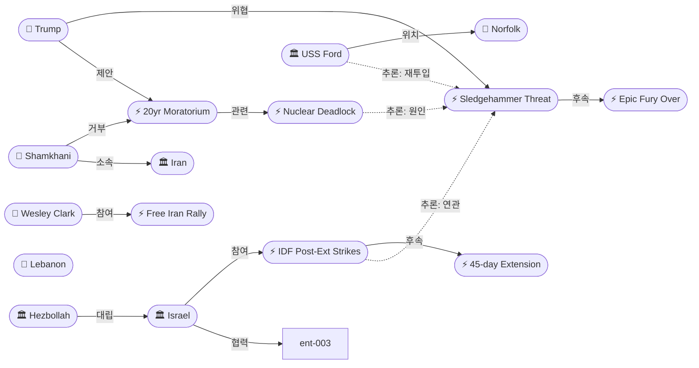

# 2026-05-16 2026 Iran War OSINT 일일 보고서

## 요약

Day 78. **'당근과 채찍'이 동시에 작동한 날이다.** 트럼프는 시진핑과의 베이징 정상회담이 이란 문제에서 구체적 돌파구를 만들지 못하자, 귀국 중 에어포스원에서 **'슬레지해머 작전'으로 전쟁을 재개하겠다("we'll finish the job")**는 공식 위협과 **핵 농축 20년 모라토리엄 수용 의사**(영구 중단에서 양보)를 동시에 발표했다. 이란 측은 하메네이 고문 **샴카니**가 "제재 전면 해제 시 서명 가능"이라고 응답하면서도 트럼프의 제안을 **"올리브 가지지만 가시철사만 보인다"**고 비판했다. 레바논에서는 45일 휴전 연장 합의 **24시간 만에** IDF가 첫 대규모 공습을 실행해 9개 마을에 대피령을 내리고 약 100개 헤즈볼라 표적을 타격했으며, 헤즈볼라도 이스라엘 메론 지역으로 드론을 발사했다. **USS Gerald Ford**가 11개월(326일) 기록적 배치를 마치고 노퍽에 귀환했다 — 베트남전 이후 최장 항모 배치였다.

## 주요 뉴스

### 1. 트럼프, 시진핑 회담 실패 후 '슬레지해머' 작전 공식 위협 — "전쟁을 끝내겠다"
- **출처:** [Republic World](https://www.republicworld.com/world-news/operation-sledgehammer-trump-threatens-fresh-strikes-after-inconclusive-iran-summit-with-xi-jinping-2026-05-16-124567)
- **일시:** 2026-05-16
- **내용:** 트럼프 대통령이 2박 3일 베이징 정상회담에서 이란 문제의 구체적 돌파구를 만들지 못하자, 귀국 중 **Operation Sledgehammer로 이란에 "fresh strikes"를 가하겠다**고 공식 위협했다. "We'll finish the job"이라고 경고하며 **특수부대 핵물질 회수 작전**과 군사·인프라 시설 **확대 폭격**을 검토 중이라고 밝혔다. India TV는 미-이스라엘이 "휴전 이후 가장 광범위한 군사 준비"를 시작했으며 **"다음 주 초 공습 가능"**이라고 보도했다. 슬레지해머 작전명 사용은 에픽 퓨리(5/15 '종료' 선언)와의 법적 분리를 통해 **WPR 60일 시계를 리셋**하려는 전략이다.
- **상태:** 신규
- **관련 엔티티:** Donald Trump, Operation Sledgehammer, US Military, Iran, Xi Jinping

### 2. USS Gerald Ford 노퍽 귀환 — 11개월 기록적 배치 종료, 대통령 부대표창
- **출처:** [CNN](https://www.cnn.com/2026/05/16/politics/ford-iran-war-venezuela-maduro-record)
- **일시:** 2026-05-16
- **내용:** 미 해군 최대 항공모함 **USS Gerald R. Ford(CVN-78)**가 326일간의 작전을 마치고 **노퍽 해군기지에 귀환**했다 — **베트남전 이후 최장 항모 배치** 기록이다. 5,000명의 장병이 11개월 만에 가족과 재회했다. Ford는 2월 말 이란 전쟁 개시 시 지중해에서 전투기를 발진시키며 개전 기동을 실행했고, 이후 수에즈를 통과해 홍해로 이동했다. 베네수엘라 마두로 체포 작전에도 참여했다. **대통령 부대표창(Presidential Unit Citation)**을 수여받았다 — "적에 대한 탁월한 전투 수행." 배치 기간 중 함내 화재와 배관 문제도 발생했으나 임무를 지속했다.
- **상태:** 신규
- **관련 엔티티:** USS Gerald R. Ford, US Military, Naval Station Norfolk

### 3. IDF, 45일 연장 합의 24시간 만에 첫 대규모 공습 — 9개 마을 대피, ~100개 표적 타격
- **출처:** [Times of Israel](https://www.timesofisrael.com/idf-launches-strikes-targeting-hezbollah-for-1st-time-since-lebanon-ceasefire-extended/)
- **일시:** 2026-05-16
- **내용:** IDF가 **45일 휴전 연장 발표 하루 만에** 남부 레바논 헤즈볼라 인프라에 대한 대규모 공습을 실행했다. **9개 마을**(Qaaqaaiyet al-Snoubar, Kaouthariyet El Saiyad, Merouaniyeh, Ghassaniyeh, Tefahta, Irzay, Babliyeh, Insar, al-Baisariyah)에 대피 경고를 발령했고, 주민들은 시돈과 베이루트 방면으로 탈출했다. IDF는 **"헤즈볼라의 휴전 위반에 대응한 것"**이라며 "무력으로 대응할 수밖에 없다"고 밝혔다. Jerusalem Post는 **약 100개 헤즈볼라 표적**이 타격됐고, **헤즈볼라 테러리스트 2명이 사살**됐다고 보도했다. IDF 병사 1명도 남부 레바논 전투 중 전사했다.
- **상태:** 신규
- **관련 엔티티:** Israel, Hezbollah, Lebanon, 45-day ceasefire extension

### 4. 트럼프, AF1에서 핵 20년 모라토리엄 제안 — '실질적 보장' 조건, 영구 중단 포기
- **출처:** [Times of Israel](https://www.timesofisrael.com/trump-says-hes-ok-with-iran-suspending-nuke-program-for-20-years-if-theres-a-real-commitment/)
- **일시:** 2026-05-16
- **내용:** 트럼프가 베이징 출발 직후 에어포스원에서 기자들에게 **이란의 우라늄 농축 20년 정지를 수용할 수 있다**고 밝혔다 — 조건은 **"실질적 보장(real guarantee)"**이다. 이는 이전의 **"영구 중단" 요구에서 명시적 양보**이다. 핵 모라토리엄 기간은 핵심 쟁점으로 남아 있으며, 미국은 20년, 이란은 5년을 제시해왔다. 5/15 아라그치의 '핵 교착 인정' 직후 트럼프가 중간 지대를 열어둔 것으로, **당근(20년 양보)과 채찍(슬레지해머)을 동시에 제시**하는 전형적 압박 외교다.
- **상태:** 신규
- **관련 엔티티:** Donald Trump, Iran, Nuclear enriched uranium deadlock

### 5. 샴카니: "제재 전면 해제 시 서명 가능" — '올리브 가지지만 가시철사만 보인다'
- **출처:** [Newsweek](https://www.newsweek.com/iran-nuclear-deal-offer-trump-warns-tehran-2081262)
- **일시:** 2026-05-16
- **내용:** 하메네이 최고지도자 고문 **알리 샴카니(Ali Shamkhani)**가 트럼프의 20년 모라토리엄 제안에 대응했다. 이란 정부는 **모든 금융 제재의 신속한 해제를 조건으로 핵 합의에 서명할 준비가 있다**고 밝혔다. 그러나 샴카니는 트럼프의 수사를 비판하며 **"그는 올리브 가지를 말하지만, 우리에게는 가시철사만 보인다(He speaks of an olive branch, but we see only barbed wire)"**라고 발언했다. 제재 해제가 없는 미국 안은 "수용 불가"라는 입장이다. 핵심 간극: 미국은 핵 양보 우선, 이란은 제재 해제 선결을 요구한다.
- **상태:** 신규
- **관련 엔티티:** Ali Shamkhani, Iran, Donald Trump, Nuclear deadlock

### 6. 헤즈볼라, 휴전 연장 후 이스라엘 메론 지역 드론 공격 — 무피해
- **출처:** [Times of Israel](https://www.timesofisrael.com/liveblog-may-16-2026/)
- **일시:** 2026-05-16
- **내용:** 헤즈볼라가 토요일 **이스라엘 메론(Meron) 지역으로 드론 최소 1기를 발사**했다. 사이렌이 울렸으나 인명·재산 피해는 보고되지 않았다. 45일 휴전 연장 합의 이후 **첫 헤즈볼라 교차 공격**이다. IDF의 대규모 공습(#3)과 합쳐 보면, 양측 모두 휴전 연장 **24시간 내에** 군사 행동을 재개한 것이다 — "명목적 휴전"이 외교적 허구임을 다시 확인한다.
- **상태:** 신규
- **관련 엔티티:** Hezbollah, Israel, Meron, 45-day ceasefire extension

### 7. 'Free Iran' 집회 DC — 수천 명 캐피톨힐, 웨슬리 클라크/라자비 참여
- **출처:** [NCRI](https://www.ncr-iran.org/en/news/iran-resistance/massive-d-c-demonstration-declares-mullahs-face-terminal-impasse-as-resistance-units-surge-inside-iran/)
- **일시:** 2026-05-16
- **내용:** 수천 명의 이란 디아스포라와 지지자들이 **워싱턴 DC 캐피톨힐 인근 Upper Senate Park**에서 'Free Iran' 집회를 개최했다. NCRI가 조직한 이 집회에서 **전 NATO 최고사령관 웨슬리 클라크 장군**, NCRI 대통령 선출자 **마리얌 라자비**(영상 연설), 전 주덴마크 대사 카를라 샌즈가 연설했다. 시위대는 이란 정치범 처형 중단과 정권 교체를 요구하며 삼색 이란 국기를 흔들었다. Fox News는 이를 "massive crowd protesting Iranian regime"으로 실시간 보도했다.
- **상태:** 신규
- **관련 엔티티:** NCRI, Wesley Clark, Maryam Rajavi, Iran

### 8. 미-이스라엘, 슬레지해머 군사 준비 가속 — 특수부대 핵물질 회수, '다음 주 초' 공습 가능
- **출처:** [India TV News](https://www.indiatvnews.com/news/world/us-weighs-relaunching-strikes-on-iran-under-new-name-after-trump-s-china-visit-reports-2026-05-16-1041391)
- **일시:** 2026-05-16
- **내용:** 미국과 이스라엘이 **"휴전 이후 가장 광범위한 군사 준비"**를 시작했다. 펜타곤은 이란 내 **핵물질 회수를 위한 특수부대(commandos) 투입**을 검토 중이다 — 이는 지상 작전 요소가 최초로 구체적으로 보도된 것이다. 확대 폭격(군사·인프라 시설)도 동시 검토 중이다. 슬레지해머 작전명 사용은 에픽 퓨리와의 법적 분리를 통해 **의회 승인 없이 전쟁을 지속**하려는 WPR 우회 전략의 일환이다. **공습 재개가 "다음 주 초(as early as next week)" 가능**하다고 보도됐다.
- **상태:** 신규
- **관련 엔티티:** US Military, Israel, Operation Sledgehammer, Iran

### 9. 유가: 브렌트 $109.24 — 주간 +8.1%, 호르무즈 교착 지속
- **출처:** [Trading Economics](https://tradingeconomics.com/commodity/brent-crude-oil)
- **일시:** 2026-05-16
- **내용:** 브렌트유 **$109.24(+3.33%)**, 주간 **+8.1% 상승**으로 마감했다. 전년 대비 **+67%**. IEA의 "10월까지 공급 부족" 경고가 유지되는 가운데, 호르무즈 해협 교착과 슬레지해머 작전 위협이 추가 상승 압력으로 작용했다. 슬레지해머 공습 재개 시 유가 추가 급등 리스크가 커지고 있다.
- **상태:** 업데이트 ← 2026-05-15 유가 보도
- **관련 엔티티:** Brent crude, Strait of Hormuz

### 10. [한국] 트럼프, 시진핑 회담 후 이란에 '슬레지해머' + 핵 20년 양보 동시 전개
- **출처:** [네이트뉴스](https://news.nate.com/view/20260513n30554)
- **일시:** 2026-05-16
- **내용:** 한국 언론은 트럼프의 **'당근과 채찍' 이중 전략**을 종합 보도했다. 시진핑과의 정상회담이 이란 문제에서 구체적 성과를 내지 못하자, 귀국 중 슬레지해머 위협과 핵 20년 모라토리엄 수용 의사를 동시에 발표했다. 파이낸셜뉴스와 뉴스핌도 펜타곤의 작전명 변경 검토를 보도하며, 이것이 의회 승인 시한을 리셋하기 위한 법적 편법임을 분석했다.
- **상태:** 신규
- **관련 엔티티:** Donald Trump, Xi Jinping, Operation Sledgehammer, Iran

## 지식그래프

### 오늘의 주요 관계

1. **'당근+채찍' 이중 구조:** 트럼프(ent-001) → 20년 모라토리엄 제안(ent-384, 당근) + 슬레지해머 위협(ent-380, 채찍) — 동시 발표, 동일 인물, 동일 비행기.
2. **샴카니 vs 트럼프:** 샴카니(ent-385) → 핵 제안 거부(ent-384에 opposes) — '올리브 가지=가시철사' 수사로 직접 대립. 제재 해제 선결 요구.
3. **에픽 퓨리→슬레지해머 법적 전환:** 에픽 퓨리 종료(ent-379) → 슬레지해머(ent-380) — WPR 60일 시계 리셋 전략 3단계 완성(검토→선언→위협).
4. **'연장=면허장' 패턴:** 45일 연장(ent-368) → IDF 대규모 공습(ent-383) + 헤즈볼라 드론 — 양측 24시간 내 동시 에스컬레이션.
5. **Ford 귀환→전력 재배치:** USS Ford(ent-381) → 노퍽 귀환 → 정비 후 슬레지해머 재투입 가능 (추론).

### 전체 지식그래프 시각화

## 온톨로지 변경

| 변경 유형 | 대상 | 근거 |
|----------|------|------|
| 새 엔티티 | ent-380 Trump Sledgehammer threat | 에픽 퓨리 종료 후 공식 군사 위협으로 격상 |
| 새 엔티티 | ent-381 USS Gerald R. Ford | 11개월 기록 배치 귀환, 전력 동향 핵심 |
| 새 엔티티 | ent-382 Naval Station Norfolk | Ford 모항, 위치 추적 |
| 새 엔티티 | ent-383 IDF post-extension strikes | 휴전 연장 24시간 후 첫 대규모 공습 |
| 새 엔티티 | ent-384 20-year moratorium proposal | 핵 협상 포지션 변화 (영구→20년) |
| 새 엔티티 | ent-385 Ali Shamkhani | 최고지도자 고문, 핵 제안 첫 공식 대응자 |
| 새 엔티티 | ent-386 Wesley Clark | 전 NATO 사령관, Free Iran 집회 연사 |
| 새 엔티티 | ent-387 Free Iran Rally DC | 5/16 DC 대규모 반정권 집회 |
| 새 엔티티 | ent-388 Maryam Rajavi | NCRI 대표, 집회 영상 연설 |
| 스키마 변경 | 없음 | 모든 엔티티·관계 기존 스키마로 표현 가능 |

## 추론 결과

| 추론 | 신뢰도 | 근거 |
|------|--------|------|
| Shamkhani → 대립 → Trump | 0.81 | 핵 제안 거부를 통한 간접 대립 |
| Nuclear deadlock → 원인 → Sledgehammer | 0.76 | 교착→정상회담 실패→군사위협 인과 체인 |
| IDF 공습 → 연관 → Sledgehammer | 0.72 | 양측 외교 후 동시 군사 에스컬레이션 |
| Ford 귀환 → 잠재 연결 → Sledgehammer | 0.70 | 전력 회수 후 재투입 가능성 (잠정) |

## 분석 및 평가

**핵심 판단: 5일 연속 군사 에스컬레이션 경로가 가속되고 있다.**

1. **에스컬레이션 타임라인:** 5/12 슬레지해머 '검토' → 5/14 에픽 퓨리 '종료' → 5/15 슬레지해머 '고려' → **5/16 트럼프 '공식 위협' + 특수부대 투입 검토 + '다음 주 초' 가능.** 이 경로는 군사 행동의 단계적 사전 포석으로 보인다.

2. **핵 협상 간극:** 미국 20년 vs 이란 5년 → 트럼프가 "20년 + 실질 보장" 중간 안을 열었으나, 이란은 "제재 전면 해제 선결"로 대응. 간극은 좁혀졌으나 핵심 교환 구조(핵 양보 vs 제재 해제 순서)가 여전히 미해결.

3. **USS Ford 귀환의 전략적 의미:** 항모 전력 1척이 본국 복귀하면서 즉시 전력 공백이 발생하지만, 동시에 정비·재충전 후 재투입(혹은 교체 항모 파견)의 전환점이기도 하다. 슬레지해머가 실행되면 Ford 외 다른 CSG가 투입될 가능성이 높다.

4. **레바논 '형해화된 휴전':** 3주 → 45일로 연장했으나, 연장 합의 24시간 내에 양측이 모두 군사 행동을 재개. "명목적 휴전"이 구조적으로 고착화됐다 — 외교적 프레임은 유지하되 군사 활동은 사실상 무제한.

## 추적 항목

| 항목 | 최초 보고 | 상태 | 최신 업데이트 |
|------|----------|------|-------------|
| 슬레지해머 작전 | 2026-05-12 | **위협 단계** | 5/16: 트럼프 공식 위협, 특수부대·공습 검토, '다음 주 초' 가능 |
| 핵 모라토리엄 협상 | 2026-04-13 | **교착→양보** | 5/16: 20년 제안 + 샴카니 '제재해제 선결' 대응 |
| 이스라엘-레바논 휴전 | 2026-04-16 | **형해화** | 5/16: 45일 연장 24시간 후 대규모 공습 재개 |
| 호르무즈 해협 | 2026-03-01 | **교착** | 유가 $109(+8.1%/주), 돌파구 미가시 |
| WPR 우회 전략 | 2026-05-01 | **3단계** | 5/16: 슬레지해머 공식화로 시계 리셋 현실화 |

## 동향 요약

| 분류 | 상태 | 비고 |
|------|------|------|
| 미-이란 전쟁 | 위협 격화 | 슬레지해머 공식 위협, 다음 주 초 가능 |
| 핵 협상 | 당근+채찍 | 20년 양보 + 군사위협 동시, 간극 여전 |
| 레바논 | 형해화 | 연장 24시간 후 양측 공격 재개 |
| 유가 | 상승 | $109.24, 주간 +8.1%, 추가 상승 리스크 |
| 미국 내정 | 분열 | Free Iran 집회 vs 전쟁 비용 $29B |
| 미 해군 | 전환 | Ford 귀환, 전력 재배치 모니터링 대상 |

## 출처 목록

1. [Trump threatens 'Operation Sledgehammer'](https://www.republicworld.com/world-news/operation-sledgehammer-trump-threatens-fresh-strikes-after-inconclusive-iran-summit-with-xi-jinping-2026-05-16-124567) - Republic World, 2026-05-16
2. [USS Gerald Ford returns home](https://www.cnn.com/2026/05/16/politics/ford-iran-war-venezuela-maduro-record) - CNN, 2026-05-16
3. [IDF launches first strikes since ceasefire extended](https://www.timesofisrael.com/idf-launches-strikes-targeting-hezbollah-for-1st-time-since-lebanon-ceasefire-extended/) - Times of Israel, 2026-05-16
4. [Trump proposes 20-year moratorium](https://www.timesofisrael.com/trump-says-hes-ok-with-iran-suspending-nuke-program-for-20-years-if-theres-a-real-commitment/) - Times of Israel, 2026-05-16
5. [Shamkhani: olive branch but barbed wire](https://www.newsweek.com/iran-nuclear-deal-offer-trump-warns-tehran-2081262) - Newsweek, 2026-05-16
6. [Hezbollah drone toward Meron](https://www.timesofisrael.com/liveblog-may-16-2026/) - Times of Israel, 2026-05-16
7. [Free Iran Rally DC](https://www.ncr-iran.org/en/news/iran-resistance/massive-d-c-demonstration-declares-mullahs-face-terminal-impasse-as-resistance-units-surge-inside-iran/) - NCRI, 2026-05-16
8. [US weighs relaunching strikes](https://www.indiatvnews.com/news/world/us-weighs-relaunching-strikes-on-iran-under-new-name-after-trump-s-china-visit-reports-2026-05-16-1041391) - India TV News, 2026-05-16
9. [IDF soldier killed, nearly 100 targets](https://www.jpost.com/middle-east/iran-news/2026-05-16/live-updates-896346) - Jerusalem Post, 2026-05-16
10. [Oil Brent $109.24](https://tradingeconomics.com/commodity/brent-crude-oil) - Trading Economics, 2026-05-16
11. [한국 종합 보도](https://news.nate.com/view/20260513n30554) - 네이트뉴스, 2026-05-16
12. [USS Ford returns — Fortune](https://fortune.com/2026/05/16/uss-gerald-ford-aircraft-carrier-return-11-month-deployment-iran-war-maduro-raid/) - Fortune, 2026-05-16
13. [USS Ford returns — Washington Post](https://www.washingtonpost.com/national/2026/05/16/uss-ford-aircraft-carrier-deployment-iran-maduro/a868d79c-5136-11f1-97e7-22c6c29ff0d8_story.html) - Washington Post, 2026-05-16
14. [Fox News Day 78 live](https://www.foxnews.com/live-news/iran-war-trump-news-strait-hormuz-blockade-ceasefire-tensions-may-16) - Fox News, 2026-05-16
15. [Israel strikes south Lebanon — RTE](https://www.rte.ie/news/world/2026/0516/1573658-israel-lebanon/) - RTE, 2026-05-16
