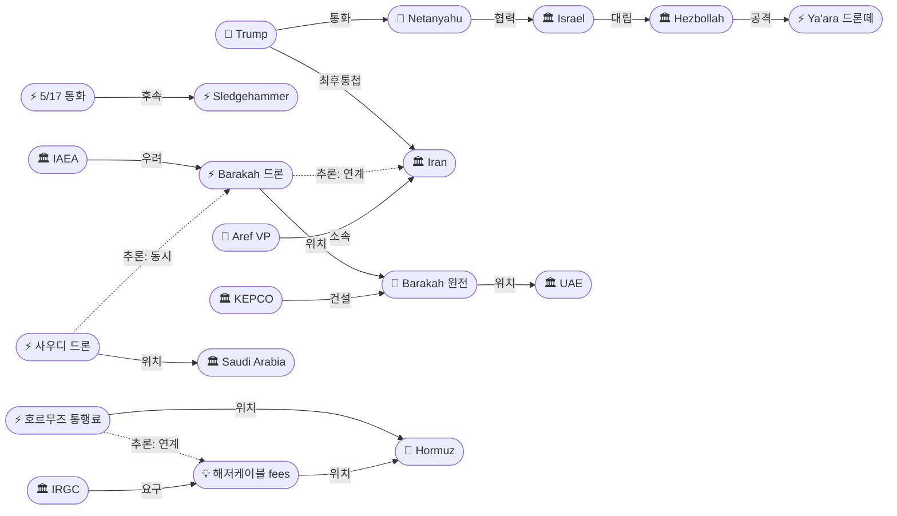
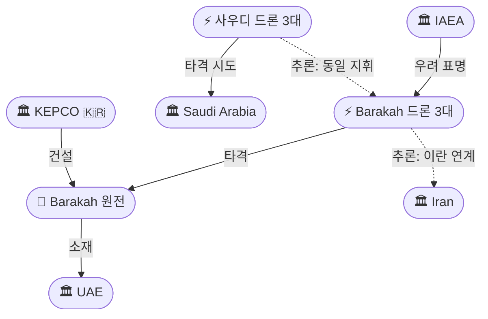
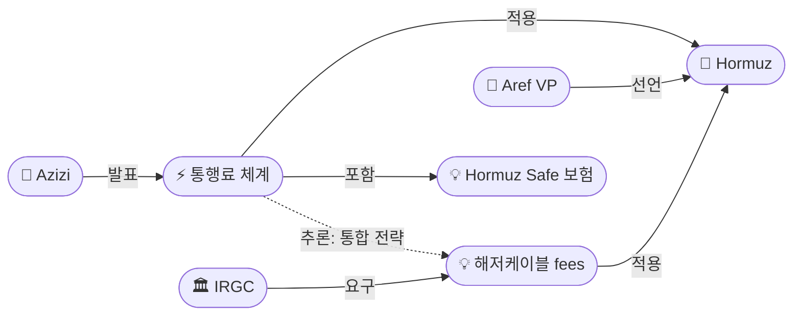

# 2026-05-17 2026 Iran War OSINT 일일 보고서

## 요약

Day 79. **다중 전선 동시 에스컬레이션이 질적 변곡점을 맞았다.** 중동 최초로 **원전이 군사 공격을 받았다** — UAE 바라카 원전(한국 건설 APR1400)에 드론 3대가 투입돼 2대는 요격, 1대가 외부 발전기를 타격해 화재를 일으켰다(방사능 유출 없음). 같은 날 사우디아라비아에도 이라크 방면에서 드론 3대가 공격했다(전량 요격). 트럼프는 네타냐후와 전화 통화 후 **"For Iran, the Clock is Ticking… or there won't be anything left of them"**이라고 Truth Social에 게시했고, 네타냐후는 **안보각의를 소집**하며 "모든 시나리오에 대비"를 선언했다. **Axios는 5/19(월) 트럼프 NSC 군사 회의 확정을 보도**했다. 이란은 **호르무즈 통행료 체계를 공식화**하고 **'Hormuz Safe' 디지털 보험을 출시**(암호화폐 결제 가능)했으며, 해저케이블 7개에 대한 사용료 부과도 위협했다. 레바논에서는 48시간 동안 **100건 이상의 이스라엘 공습**이 계속됐고, 헤즈볼라는 이스라엘 **야아라 군사기지에 드론떼 공격**을 감행했다.

## 주요 뉴스

### 1. 바라카 원전 드론 공격 — 중동 최초 원전 군사 공격, 한국 건설 APR1400
- **출처:** [Al Jazeera](https://www.aljazeera.com/news/2026/5/17/drone-strike-sparks-fire-at-uaes-barakah-nuclear-power-plant)
- **일시:** 2026-05-17
- **내용:** UAE 알다프라 지역의 **바라카 원자력발전소**에 드론 3대가 서쪽 국경 방면에서 침투했다. UAE 방공은 **2대를 요격**했으나, **1대가 원전 내부 경계 바깥의 발전기를 타격**해 화재가 발생했다. 인명 피해는 없었고 방사능 수준은 정상이었다. IAEA 사무총장은 **"핵 시설에 대한 군사적 위협에 심각한 우려"**를 표명했다. IAEA는 원자로 1기가 일시적으로 **비상 디젤 발전기에 의존**했다고 밝혔다. JPost 소식통은 공격이 **"UAE에 메시지를 보내기 위한 것"**이라고 전했다. 이 원전은 **한국전력(KEPCO)이 APR1400 기술로 건설한 중동 최초 상업용 원전**이다. UAE 외교부는 이란의 공격 정당화를 거부하며 대응권을 유보했다. 카타르와 사우디도 공격을 규탄했다.
- **상태:** 신규
- **관련 엔티티:** Barakah Nuclear Power Plant, UAE, IAEA, KEPCO, Iran (추정)

### 2. 네타냐후-트럼프 전쟁 재개 통화 — 안보각의 소집, 5/19 군사회의 확정
- **출처:** [ITV News](https://www.itv.com/news/2026-05-17/trump-and-netanyahu-speak-by-phone-as-they-consider-resuming-iran-war)
- **일시:** 2026-05-17
- **내용:** 네타냐후 총리가 일요일 저녁 트럼프 대통령과 **이란 전쟁 재개를 논의하는 전화 통화**를 가졌다. 통화 후 네타냐후는 **제한적 안보각의를 소집**하며 이란에 대해 **"우리 눈도 열려 있다(our eyes are also open)"**, **"모든 시나리오에 대비(prepared for any scenario)"**라고 밝혔다. Axios는 **5/19(월) 트럼프 NSC 국가안보 군사 회의가 확정**됐으며, 이란에 대한 잠재적 군사 행동을 논의한다고 보도했다. IDF 대변인 에피 데프린 준장은 개전 전 수개월간 미-이스라엘이 **위성 영상의 "전략적·작전적 기만"**을 수행했다고 밝혔다. 이라크 관리들은 NYT에 이스라엘이 이라크에 수개월간 **비밀 기지**를 운영했다고 확인했다.
- **상태:** 신규
- **관련 엔티티:** Benjamin Netanyahu, Donald Trump, Israel, US Military, IDF

### 3. 트럼프 'Clock is Ticking' 최후통첩 — "남는 것이 없을 것"
- **출처:** [ABC News](https://abcnews.com/International/live-updates/iran-live-updates-tehran-peace-talks-baghaei/?id=132837701)
- **일시:** 2026-05-17
- **내용:** 트럼프 대통령이 일요일 오후 Truth Social에 게시했다: **"For Iran, the Clock is Ticking, and they better get moving, FAST, or there won't be anything left of them. TIME IS OF THE ESSENCE!"** 구체적 데드라인은 제시하지 않았으나, 목요일 중국에서의 Fox News 인터뷰에서 이란이 **"딜을 하거나 전멸하거나(make a deal or they get annihilated)"**라고 경고한 바 있다. 미 무역대표부 재미슨 그리어는 중국이 **이란에 물질적 지원을 제공하지 않겠다**고 약속했다고 확인했다.
- **상태:** 신규
- **관련 엔티티:** Donald Trump, Iran, Jamieson Greer, China

### 4. 이란 호르무즈 통행료 체계 공식화 — 지정 항로 + 'Hormuz Safe' 보험 출시
- **출처:** [파이낸셜뉴스](https://www.fnnews.com/news/202605171142215669)
- **일시:** 2026-05-17
- **내용:** 이란 의회 국가안보·외교정책위원회 위원장 **에브라힘 아지지**가 호르무즈 해협에 **"지정 항로를 따라 해상 교통을 관리하는 전문 메커니즘"**을 마련했다고 공식 발표했다. 통항 시 **전문 서비스에 대한 비용이 부과**된다. 이란과 협력하는 상업 선박만 혜택을 받으며, **이스라엘 선박은 절대 통과 불가**하다. **'Hormuz Safe'** 디지털 보험 플랫폼이 출범했으며, **암호화폐 및 비트코인 결제가 가능**하다 — 제재 우회 결제 수단을 공식적으로 내장한 것이다. 중국·일본·파키스탄 등 아시아 국가들이 통항 협상을 진행 중이다.
- **상태:** 신규
- **관련 엔티티:** Ebrahim Azizi, Iran, Strait of Hormuz, Hormuz Safe

### 5. 이란 해저케이블 사용료 위협 — 7개 케이블, 글로벌 데이터 20%, $10T 일일 거래
- **출처:** [CNN](https://us.cnn.com/2026/05/17/middleeast/iran-hormuz-undersea-cables-intl)
- **일시:** 2026-05-17
- **내용:** 이란이 호르무즈 해협 해저의 **7개 광섬유 케이블**에 대한 사용료 부과를 위협했다. 이 케이블은 **글로벌 데이터 트래픽의 약 20%**, **일일 $10조(약 1경 4,600조 원) 규모의 금융 거래**를 처리한다. IRGC 산하 매체 타스님이 주도한 이 제안은 **Meta, Amazon, Microsoft 등에 초기 라이선스료와 연간 '보호' 비용**을 요구하며, 유지·보수 작업의 **이란 독점 통제**를 주장한다. 전문가들은 이것이 **UNCLOS 제79조**(해저 케이블 보호 권리)를 위반하며, 실행보다는 위협 수단이라고 분석했다. 그러나 **석유 넘어 디지털 인프라까지** 이란의 위협 영역이 확장된 것은 의미 있는 변화다.
- **상태:** 신규
- **관련 엔티티:** IRGC, Strait of Hormuz, Submarine cables

### 6. 사우디·UAE 동시 드론 공격 — 걸프 동시다발 공격 패턴
- **출처:** [파이낸셜뉴스](https://www.fnnews.com/news/202605180614354142)
- **일시:** 2026-05-17
- **내용:** 바라카 원전 공격과 **같은 날** 사우디아라비아에도 **드론 3대가 이라크 영공에서 진입**해 공격했다. 사우디 방공은 **전량 요격에 성공**했으며 피해는 없었다. 발사 주체는 미확인이나, 이란 직접 발사 또는 이라크 내 친이란 민병대 추정이다. UAE와 사우디에 대한 **동시다발 공격 타이밍**은 조율된 작전을 시사한다 — 4/18 인도 유조선 발포 이후 이란/친이란 세력의 걸프 공격이 5차례째 반복되고 있으며, 원전 표적화는 **질적 에스컬레이션**이다.
- **상태:** 신규
- **관련 엔티티:** Saudi Arabia, UAE, Iran (추정), Iraq

### 7. 헤즈볼라, 이스라엘 야아라 기지 드론떼 공격 — 라샤프·하다타에도 공격
- **출처:** [Sunday Guardian](https://sundayguardianlive.com/world/usisraeliran-war-latest-update-israel-strikes-lebanon-as-hezbollah-claims-attacks-on-troops-hormuz-plan-sparks-global-alarm-193202/)
- **일시:** 2026-05-17
- **내용:** 헤즈볼라가 이스라엘 북부 **야아라(Ya'ara) 군사기지에 "공격 드론 떼(swarm of attack drones)"를 발사**했다고 주장했다. 또한 남부 레바논의 **라샤프(Rashaf)**와 **하다타(Hadatha)** 인근 IDF 병력에 로켓과 폭발 드론 공격을 감행했다. IDF는 미스가브암에서 **"의심스러운 공중 표적"을 식별**했으나 확인된 사상자는 없다고 밝혔다. 헤즈볼라는 이스라엘 불도저 다수를 타격했다고 주장했다.
- **상태:** 신규
- **관련 엔티티:** Hezbollah, Israel, Ya'ara barracks, Rashaf, Hadatha

### 8. 이스라엘, 48시간 100+ 레바논 공습 지속 — 자우타르 알샤르키야 타격
- **출처:** [Al Jazeera](https://www.aljazeera.com/news/2026/5/17/iran-war-day-79-tehran-to-unveil-hormuz-toll-plan-israel-bombs-lebanon)
- **일시:** 2026-05-17
- **내용:** 이스라엘이 48시간 동안 남부 레바논에 **100건 이상의 공습**을 실행했다. **자우타르 알샤르키야(Zawtar al-Sharqiyah)**가 집중 타격됐다. IDF 병사 1명이 남부 레바논 전투 중 전사해 3월 2일 이후 **IDF 전사자 21명**이 됐다. 전쟁 개시 이후 레바논 사망자는 **2,900명 이상**, 휴전 발효 이후만 **400명 이상**이다. 45일 휴전 연장 합의 48시간 만에 대규모 공습이 지속되면서 **"명목적 휴전"의 형해화**가 더욱 심화됐다.
- **상태:** 신규
- **관련 엔티티:** Israel, Lebanon, Hezbollah, Zawtar al-Sharqiyah

### 9. 이란 VP 아레프: "적국 군사 장비 호르무즈 통과 불허"
- **출처:** [Sunday Guardian](https://sundayguardianlive.com/world/usisraeliran-war-latest-update-israel-strikes-lebanon-as-hezbollah-claims-attacks-on-troops-hormuz-plan-sparks-global-alarm-193202/)
- **일시:** 2026-05-17
- **내용:** 이란 제1부통령 **모하마드 레자 아레프**가 이란은 더 이상 **"적국의 군사 장비(enemy military equipment)"가 호르무즈 해협을 통과하는 것을 허용하지 않겠다**고 선언했다. 이는 상업 선박 통행료를 넘어 **군사적 통과 금지**로 수사를 격상한 것이다.
- **상태:** 신규
- **관련 엔티티:** Mohammad Reza Aref, Iran, Strait of Hormuz

### 10. 이란 내부: 처형 급증·암호화폐 제재 회피·테러 계획 적발
- **출처:** [NCRI](https://www.ncr-iran.org/en/news/iran-news-in-brief-news/iran-news-in-brief-may-17-2026/)
- **일시:** 2026-05-17
- **내용:** 전쟁 개시 이후 **정치범 약 30명이 처형**됐으며, 올해만 **약 5만 명이 체포**됐다. 미 의원들은 이란 정권 연계 네트워크를 통해 **바이낸스(Binance)에서 $17억(약 2조 5천억 원) 상당의 암호화폐가 이전**됐다고 우려를 표명했다. 이라크 민병대 사령관 **모하마드 바게르 사에디**가 북미·유럽의 유대교 회당 등을 대상으로 **12건 이상의 테러를 계획한 혐의**로 체포됐다. 자헤단에서는 PMOI 저항 단위가 반독재 플래카드를 전시하며 활동을 재개했다.
- **상태:** 신규
- **관련 엔티티:** NCRI, Iran, Binance, Mohammad Bagher Saeedi

### 11. 유가: 브렌트 ~$109 — 주간 +8.1%, 호르무즈 통행료+슬레지해머 추가 압력
- **출처:** [Trading Economics](https://tradingeconomics.com/commodity/brent-crude-oil)
- **일시:** 2026-05-17
- **내용:** 브렌트유 **$109.24**(금요일 종가), 주간 **+8.1% 상승**. 전년 대비 **+67%**. 이란의 호르무즈 통행료 체계 공식화와 슬레지해머 작전 위협이 새로운 상승 압력으로 추가됐다. IEA의 "10월까지 공급 부족" 경고가 유지되는 가운데, 바라카 원전 공격과 5/19 군사회의 예고가 **지정학적 리스크 프리미엄을 추가**하고 있다. 월요일 개장 후 추가 급등 가능성이 있다.
- **상태:** 업데이트 ← 2026-05-16 유가 보도
- **관련 엔티티:** Brent crude, Strait of Hormuz

## 지식그래프

### 오늘의 주요 관계

1. **원전 공격의 질적 변화:** 바라카 드론(ent-390) → UAE(ent-157) — 석유·해운 넘어 **핵 인프라**까지 공격 대상 확대. KEPCO(ent-397) 건설 원전이라 한국 안보 직결.
2. **최고위 전쟁 조율:** 네타냐후(ent-012) ↔ 트럼프(ent-001) 통화 → 안보각의 → 5/19 NSC → 슬레지해머(ent-380). 7일 연속 에스컬레이션 경로 정점.
3. **호르무즈 다중 수익화:** 통행료(ent-393) + 해저케이블(ent-394) — 동시 발표. 석유·무역·디지털 전방위 인질화.
4. **걸프 동시다발:** 바라카(ent-390) + 사우디(ent-396) — 같은 날, 다른 방향에서 진입. 조율된 작전 패턴.
5. **레바논 쌍방 에스컬레이션:** 이스라엘 100+ 공습(ent-004) ↔ 헤즈볼라 야아라 드론떼(ent-395) — 휴전 48시간 후 양측 동시 격화.

### 전체 지식그래프 시각화

### 주제별 세부: 걸프 드론 공격 + 원전

### 주제별 세부: 호르무즈 수익화

## 온톨로지 변경

| 변경 유형 | 대상 | 근거 |
|----------|------|------|
| 새 엔티티 | ent-389 Barakah Nuclear Power Plant | 중동 최초 원전 군사 공격 대상 |
| 새 엔티티 | ent-390 Barakah drone strike | 3대 중 1대 피격, 외부 발전기 화재 |
| 새 엔티티 | ent-391 Netanyahu-Trump May 17 call | 전쟁 재개 최고위 조율 |
| 새 엔티티 | ent-392 Mohammad Reza Aref | 이란 부통령, 적군 장비 불허 선언 |
| 새 엔티티 | ent-393 Hormuz toll plan | 지정 항로 + 통행료 + 보험 공식화 |
| 새 엔티티 | ent-394 Submarine cable fees | 7개 케이블, $10T 일일, IRGC 매체 주도 |
| 새 엔티티 | ent-395 Ya'ara drone swarm | 헤즈볼라 이스라엘 기지 드론떼 공격 |
| 새 엔티티 | ent-396 Saudi drone attack 5/17 | 이라크 방면 3대, 전량 요격 |
| 새 엔티티 | ent-397 KEPCO | 바라카 원전 건설사, 한국 안보 연결 |
| 새 엔티티 | ent-398 IAEA | 바라카 공격에 '심각한 우려' |
| 스키마 변경 | 없음 | 모든 엔티티·관계 기존 스키마로 표현 가능 |

## 추론 결과

| 추론 | 신뢰도 | 근거 |
|------|--------|------|
| 바라카 드론 → 이란 연계 | 0.75 | 서쪽 국경 진입, 기존 UAE 공격 패턴(5차), IRGC 부인/확인 모두 거부 |
| 사우디+UAE 동시 공격 → 동일 지휘 | 0.72 | 같은 날, 다른 방향(이라크/서쪽), 조율된 타이밍 |
| 네타냐후-트럼프 통화 → 슬레지해머 사전 조율 | 0.78 | 7일 연속 에스컬레이션 최고위 단계 |
| 호르무즈 통행료 + 해저케이블 → 다중 수익화 전략 | 0.80 | 동시 발표, 석유·무역·디지털 전방위 |

## 분석 및 평가

**핵심 판단: 5/17은 이란 전쟁의 질적 변곡점이다 — 원전 공격으로 '레드라인'이 이동했다.**

1. **원전 공격의 전례 없는 의미:** 바라카는 가동 중인 원전이다. 드론이 외부 발전기를 타격하고 원자로 1기가 비상 디젤에 의존한 사실은, 직접적 원자로 손상까지 불과 수백 미터 차이였음을 시사한다. IAEA의 "심각한 우려"는 이 사건이 **핵 안전 레드라인에 근접**했음을 공인한 것이다. 한국 건설 APR1400 원전이라는 점에서 한국의 해외 원전 수출 전략에도 함의가 있다.

2. **7일 연속 에스컬레이션 가속:** 5/12 검토 → 5/14 종료 → 5/15 고려 → 5/16 위협 → **5/17 최고위 통화 + 안보각의 + 5/19 군사회의**. 이 경로가 지속되면 **5/19-20이 전쟁 재개 여부의 분기점**이 된다. 네타냐후의 "모든 시나리오 대비"는 이스라엘이 공동 작전에 준비 완료됐음을 시사한다.

3. **이란의 '호르무즈 수익화' 전략 완성:** 5/5 Strait Authority → 5/7 신규 규정 → **5/17 통행료 체계 + 디지털 보험 + 해저케이블**. 이란이 호르무즈를 **단순 봉쇄 수단에서 수익 인프라로 전환**하고 있다. 암호화폐 결제 내장은 제재 우회를 구조적으로 설계한 것이다. 이는 **장기전을 전제한 자금 확보 전략**이다.

4. **걸프 동시다발 공격의 구조화:** 4/18 이후 5차례 걸프 공격 중 **최초로 원전이 표적**이 됐다. UAE와 사우디에 같은 날 공격한 것은 개별 사건이 아닌 **조율된 캠페인**을 시사한다.

5. **레바논 "전쟁 속의 휴전":** 45일 연장 48시간 만에 양측이 100+ 공습과 드론떼 공격을 교환. 헤즈볼라의 야아라 기지 드론떼는 5/16 메론 드론의 격화판이며, IDF 2,900+ 누적 사상자는 "휴전"이 문서 위에만 존재함을 수치적으로 입증한다.

## 추적 항목

| 항목 | 최초 보고 | 상태 | 최신 업데이트 |
|------|----------|------|-------------|
| 슬레지해머 작전 | 2026-05-12 | **결정 임박** | 5/17: 네타냐후-트럼프 통화 + 안보각의 + 5/19 군사회의 확정 |
| 핵 모라토리엄 협상 | 2026-04-13 | **교착** | 5/17: 이란 Mehr '미국 양보 없음' — 간극 좁히지 못함 |
| 이스라엘-레바논 휴전 | 2026-04-16 | **전쟁 속 휴전** | 5/17: 48시간 100+ 공습 + 헤즈볼라 야아라 드론떼 |
| 호르무즈 해협 | 2026-03-01 | **수익화 단계** | 5/17: 통행료 체계 공식화 + 해저케이블 사용료 위협 |
| WPR 우회 전략 | 2026-05-01 | **실행 단계** | 5/17: 슬레지해머 공식화 → 5/19 군사회의가 최종 결정 |
| 걸프 확전 | 2026-04-18 | **원전 표적화** | 5/17: 바라카 원전 드론 + 사우디 동시 공격 (5차) |

## 동향 요약

| 분류 | 상태 | 비고 |
|------|------|------|
| 미-이란 전쟁 | 결정 임박 | 5/19 NSC 군사회의 = 분기점 |
| 핵 협상 | 교착 | 이란 '미국 양보 없음', 간극 유지 |
| 레바논 | 전쟁 속 휴전 | 48시간 100+ 공습, 야아라 드론떼 |
| 호르무즈 | 수익화 | 통행료 + 보험 + 해저케이블 공식화 |
| 걸프 확전 | 원전 표적화 | 바라카 APR1400 최초 피격 |
| 유가 | 상승 | $109.24, 주간 +8.1%, 월요일 급등 리스크 |
| 이란 내정 | 탄압 강화 | 30+ 처형, 5만 체포, $17억 암호화폐 |
| 한국 관련 | 안보 직결 | KEPCO 건설 원전 최초 군사 공격 |

## 출처 목록

1. [Barakah drone strike — Al Jazeera](https://www.aljazeera.com/news/2026/5/17/drone-strike-sparks-fire-at-uaes-barakah-nuclear-power-plant) - Al Jazeera, 2026-05-17
2. [Trump-Netanyahu call — ITV News](https://www.itv.com/news/2026-05-17/trump-and-netanyahu-speak-by-phone-as-they-consider-resuming-iran-war) - ITV News, 2026-05-17
3. [Trump 'clock is ticking' — ABC News](https://abcnews.com/International/live-updates/iran-live-updates-tehran-peace-talks-baghaei/?id=132837701) - ABC News, 2026-05-17
4. [호르무즈 통행료 종합 — 파이낸셜뉴스](https://www.fnnews.com/news/202605171142215669) - 파이낸셜뉴스, 2026-05-17
5. [Iran Hormuz undersea cables — CNN](https://us.cnn.com/2026/05/17/middleeast/iran-hormuz-undersea-cables-intl) - CNN, 2026-05-17
6. [사우디·UAE 드론 공격 — 파이낸셜뉴스](https://www.fnnews.com/news/202605180614354142) - 파이낸셜뉴스, 2026-05-17
7. [Israel-Hezbollah strikes — Sunday Guardian](https://sundayguardianlive.com/world/usisraeliran-war-latest-update-israel-strikes-lebanon-as-hezbollah-claims-attacks-on-troops-hormuz-plan-sparks-global-alarm-193202/) - Sunday Guardian, 2026-05-17
8. [Israel 100+ strikes Lebanon — Al Jazeera](https://www.aljazeera.com/news/2026/5/17/iran-war-day-79-tehran-to-unveil-hormuz-toll-plan-israel-bombs-lebanon) - Al Jazeera, 2026-05-17
9. [Iran VP Aref — Sunday Guardian](https://sundayguardianlive.com/world/usisraeliran-war-latest-update-israel-strikes-lebanon-as-hezbollah-claims-attacks-on-troops-hormuz-plan-sparks-global-alarm-193202/) - Sunday Guardian, 2026-05-17
10. [NCRI Iran news brief](https://www.ncr-iran.org/en/news/iran-news-in-brief-news/iran-news-in-brief-may-17-2026/) - NCRI, 2026-05-17
11. [Oil Brent $109.24](https://tradingeconomics.com/commodity/brent-crude-oil) - Trading Economics, 2026-05-17
12. [Netanyahu security cabinet — Times of Israel](https://www.timesofisrael.com/netanyahu-convenes-security-cabinet-amid-reports-israel-us-preparing-iran-strikes/) - Times of Israel, 2026-05-17
13. [Barakah 'treacherous attack' — The National](https://www.thenationalnews.com/news/uae/2026/05/17/uae-launches-investigation-into-source-of-drone-strike-on-barakah-nuclear-plant/) - The National, 2026-05-17
14. [Barakah 'send message' — JPost](https://www.jpost.com/middle-east/article-896446) - Jerusalem Post, 2026-05-17
15. [Barakah — Newsweek](https://www.newsweek.com/nuclear-power-plant-struck-drone-attack-operating-normal-uae-11960772) - Newsweek, 2026-05-17
16. [Barakah no radiation — Khaleej Times](https://www.khaleejtimes.com/uae/emergencies/abu-dhabi-drone-linked-fire-barakah-nuclear-power-plant) - Khaleej Times, 2026-05-17
17. [Iran cables — IBTimes](https://www.ibtimes.co.uk/iran-fees-undersea-internet-cables-1795967) - IBTimes, 2026-05-17
18. [바라카 원전 드론 — 파이낸셜뉴스](https://www.fnnews.com/news/202605172009341056) - 파이낸셜뉴스, 2026-05-17
19. [Al Jazeera Day 79 live](https://www.aljazeera.com/news/liveblog/2026/5/17/iran-war-live-tehran-eyes-tolls-in-hormuz-trump-warns-of-very-bad-time) - Al Jazeera, 2026-05-17
20. [Fox News Day 79](https://www.foxnews.com/politics/trump-netanyahu-speak-sunday-amid-reports-potential-revival-military-action-iran.amp) - Fox News, 2026-05-17
