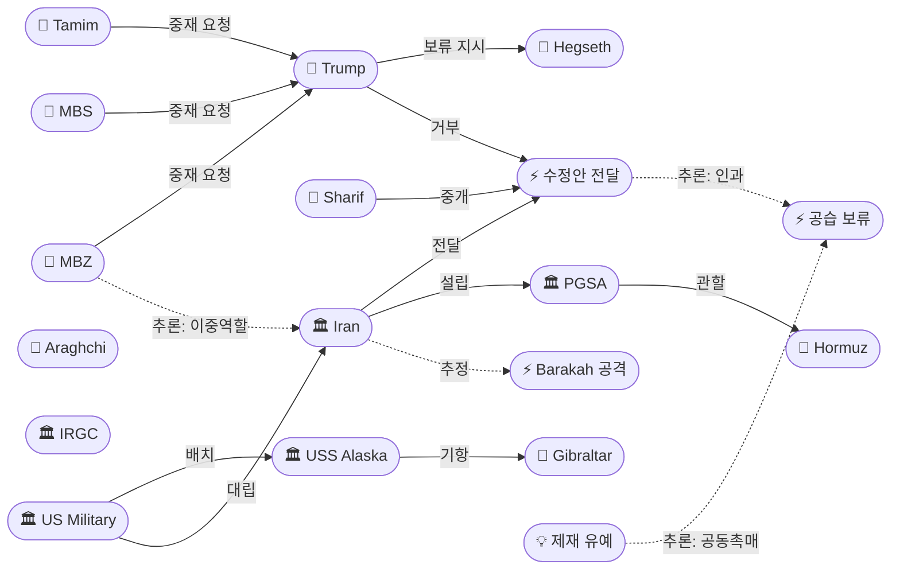
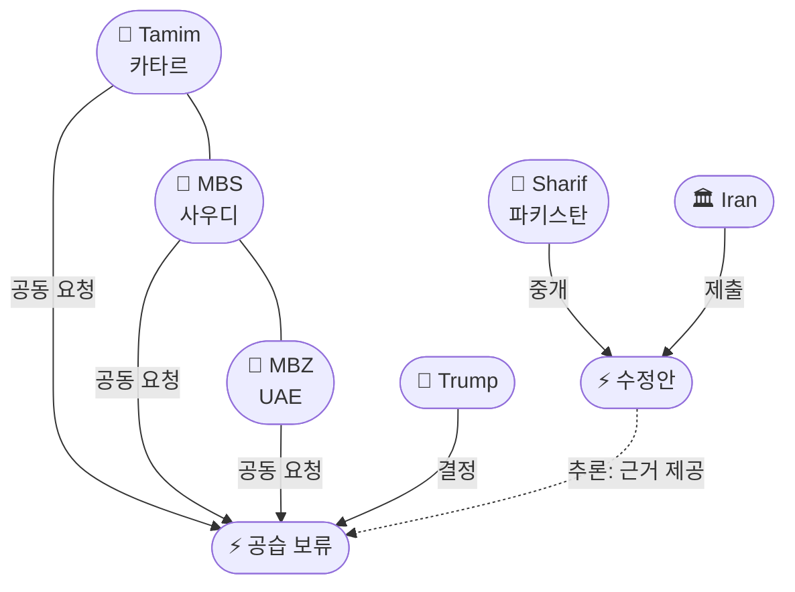

# 2026-05-19 2026 Iran War OSINT 일일 보고서

## 요약

Day 81. **트럼프가 예정됐던 이란 대규모 공습을 전격 보류했다.** 카타르 에미르 타밈, 사우디 왕세자 MBS, UAE 대통령 MBZ가 공동으로 **"진지한 협상이 진행 중"**이라며 2~3일 유예를 요청했고, 트럼프는 "very major attack"을 "for a little while, hopefully, maybe forever" 미뤘다. 그러나 헤그세스 국방장관과 케인 합참의장에게 **"단 한마디의 명령으로 전면적 대규모 공습"**을 즉각 개시할 수 있도록 대기하라고 지시하며 압박을 유지했다. 이란은 전날 파키스탄 경유로 **수정안을 전달**했지만, 트럼프는 **"어떤 제안에도 열려 있지 않다"**고 밝혀 이중 메시지를 발송했다. 한편 이란 국가안보최고회의(SNSC)는 호르무즈 해협 관리를 위한 **PGSA(Persian Gulf Strait Authority)**를 공식 설립해 해협 통제의 제도화에 나섰다. 유가는 **브렌트 $111→$102로 일중 $9 급반전**했다 — 타스님의 미국 임시 제재 유예 제안 보도와 공습 보류가 이중 촉매로 작용했다.

## 주요 뉴스

### 1. 트럼프 이란 공습 전격 보류 — 걸프 3국 공동 중재, 군사력은 대기
- **출처:** [CBS News](https://www.cbsnews.com/news/trump-says-called-off-scheduled-iran-attack-gulf-partners/)
- **일시:** 2026-05-18 (공표) / 2026-05-19 (보류 적용일)
- **내용:** 트럼프 대통령이 **"very major attack"**으로 계획됐던 이란 공습을 전격 보류했다. 카타르 에미르 **셰이크 타밈 빈 하마드 알타니**, 사우디 왕세자 **무함마드 빈 살만**, UAE 대통령 **무함마드 빈 자이드**가 공동으로 보류를 요청했다. 걸프 3국은 **"진지한 협상이 진행 중이며, 미국과 중동 국가 모두에게 매우 수용 가능한(very acceptable) 합의가 가능하다"**고 설득했다. 트럼프는 **"for a little while, hopefully, maybe forever"** 공격을 미루지만, 헤그세스 국방장관과 케인 합참의장에게 **"a full, large scale assault of Iran, on a moment's notice"**를 즉각 개시할 수 있도록 만반의 대비를 유지하라고 지시했다. 걸프 동맹국들은 **2~3일의 협상 시간**을 요청한 것으로 알려졌다.
- **상태:** 신규
- **관련 엔티티:** Donald Trump, Sheikh Tamim, MBS, MBZ, Pete Hegseth, Daniel Caine, Iran

### 2. 이란 수정안 파키스탄 경유 전달 — 농축 우라늄이 여전히 핵심 교착점
- **출처:** [Al Jazeera](https://www.aljazeera.com/news/2026/5/18/iran-sends-response-to-us-proposal-to-end-war-via-mediator-pakistan-2)
- **일시:** 2026-05-18
- **내용:** 이란이 미국의 최신 제안에 대한 **수정안(modified proposal)**을 파키스탄 중재자를 통해 워싱턴에 전달했다. 미국은 **20년 농축 모라토리엄**과 **60% 농축 우라늄 약 400kg의 해외 이전**을 핵심 요구로 제시하고 있다. 이란은 이 요구를 **"no basis in reality(현실 근거 없음)"**라고 반박하며, **"지난 2년간 같은 농축 문제를 반복적으로 제기해왔다"**고 밝혔다. 파키스탄이 문서를 워싱턴에 전달하면서 셔틀 외교 채널은 유지되고 있으나, 핵심 쟁점에서 양측 간 간극은 좁혀지지 않고 있다.
- **상태:** 신규
- **관련 엔티티:** Iran, Shehbaz Sharif, Donald Trump, Abbas Araghchi

### 3. 타스님: 미국이 임시 석유 제재 유예 제안 — 워싱턴 미확인
- **출처:** [IBTimes](https://www.ibtimes.com/iranian-media-says-us-offered-temporary-waiver-oil-sanctions-against-tehran-3802976)
- **일시:** 2026-05-18
- **내용:** 이란의 반관영 통신 **타스님(Tasnim)**이 협상팀 인접 소식통을 인용하여, 미국이 이란 석유에 대한 **임시 제재 유예(temporary waiver)**를 최종 합의 달성 시까지 유지하겠다고 제안했다고 보도했다. 이는 이란이 평화 합의와 호르무즈 해협 재개방의 전제 조건으로 내세운 **핵심 요구**다. 그러나 **미국 측은 이 제안을 확인하지 않았다.** 이 보도만으로도 유가가 **$111에서 $102 방향으로 급반전**하는 시장 반응을 촉발했다.
- **상태:** 신규
- **관련 엔티티:** Iran, Donald Trump, Tasnim, Strait of Hormuz

### 4. 이란 PGSA(Persian Gulf Strait Authority) 설립 — 호르무즈 통제 제도화
- **출처:** [Newsweek](https://www.newsweek.com/iran-announces-new-body-to-manage-strait-of-hormuz-11962513)
- **일시:** 2026-05-19
- **내용:** 이란의 **국가안보최고회의(SNSC)**가 X(구 트위터)를 통해 **PGSA(Persian Gulf Strait Authority)**의 창설을 공표했다. PGSA는 호르무즈 해협의 **통항 허가와 통행료 징수를 관리**하는 기관으로, 모든 선박이 이란군과 사전 조율 및 허가를 받아야 한다. 이는 5/17 발표된 통행료 체계를 **제도적 기관으로 격상**한 것으로, 이란이 호르무즈 통제를 **임시 전시 조치가 아닌 영구적 지정학 자산**으로 전환하려는 의도를 명확히 보여준다.
- **상태:** 신규
- **관련 엔티티:** PGSA, Iran, SNSC, Strait of Hormuz, IRGC

### 5. 트럼프 "어떤 제안에도 열려 있지 않다" — 공습 보류와 동시에 강경 메시지
- **출처:** [파이낸셜뉴스](https://www.fnnews.com/news/202605190338323910)
- **일시:** 2026-05-19
- **내용:** 트럼프 대통령이 이란의 최신 종전 제안에 대해 **"어떤 제안에도 열려 있지 않다(not open to any proposal)"**며 실망감을 표명했다. 공습은 보류했지만 이란의 제안이 미국의 핵심 요구 — **핵 모라토리엄, 호르무즈 완전 개방, 제재 유지** — 를 충족하지 못한다는 입장을 재확인했다. 이는 **군사적 보류(걸프 요청) + 외교적 거부(이란 제안)라는 이중 메시지**로, 트럼프가 외교와 군사 양 트랙을 동시에 활용하고 있음을 보여준다.
- **상태:** 신규
- **관련 엔티티:** Donald Trump, Iran

### 6. 파키스탄 중재의 구조적 한계 — 유일한 채널이나 레버리지 부족
- **출처:** [Al Jazeera](https://www.aljazeera.com/amp/news/2026/5/18/pakistans-mediation-faces-limits-as-iran-us-tensions-deepen)
- **일시:** 2026-05-18
- **내용:** 알자지라 분석은 파키스탄의 셔틀 외교가 **구조적 한계에 직면**했다고 진단한다. 다수의 제안 교환을 중개했지만, 양측 모두 핵심 쟁점(농축, 제재, 호르무즈)에서 양보할 의사가 없으며, 파키스탄은 타협을 강제할 **레버리지가 부족**하다. 그러나 이 채널이 **미-이란 간 유일한 활성 외교 라인**으로 남아 있어 대안이 없다.
- **상태:** 신규
- **관련 엔티티:** Shehbaz Sharif, Pakistan, Iran, US

### 7. 국방부 이란 재공격 목표 목록 준비 — 즉각 행동 가능 태세
- **출처:** [Pravda 한국](https://korea.news-pravda.com/dprk/2026/05/18/65482.html)
- **일시:** 2026-05-18
- **내용:** 미 국방부가 이란에 대한 **재공격 목표 목록을 최신화**하고 준비를 완료했다. 트럼프가 공습을 보류했지만, 협상 결렬 시 **즉각적인 군사행동이 가능**하도록 대비 태세를 유지하고 있다. 이는 트럼프의 **"on a moment's notice"** 지시와 일치한다.
- **상태:** 신규
- **관련 엔티티:** US Military, Pete Hegseth, Iran, Operation Sledgehammer

### 8. USS Alaska 핵잠 지브롤터 배치 — 전례 없는 핵 시그널링
- **출처:** [MBC](https://imnews.imbc.com/replay/2026/nwdesk/article/6821907_37004.html)
- **일시:** 2026-05-19
- **내용:** 미 해군이 **오하이오급 탄도미사일 핵잠수함 USS Alaska(SSBN-732)**를 영국령 **지브롤터**에 배치했다. 트라이던트 II D5 미사일 최대 20발 탑재가 가능한 전략 핵 자산의 **위치를 공개적으로 공개한 것은 극히 이례적**이다. 통상 SSBN은 은밀 작전을 수행하며 위치가 공개되지 않는다. 스페인이 이란전 지원을 위한 **로타/모론 기지 사용을 거부**해 영국령 지브롤터로 기항한 것도 주목할 점이다. 이란에 대한 **핵 억지 메시지**로 해석된다.
- **상태:** 신규
- **관련 엔티티:** USS Alaska (SSBN-732), US Military, Iran, Gibraltar

### 9. 바라카 원전 조사 지속 — 공격 주체 여전히 미귀속
- **출처:** [Euronews](https://www.euronews.com/2026/05/18/uae-still-investigating-mystery-nuclear-plant-drone-attack)
- **일시:** 2026-05-18
- **내용:** UAE가 5/17 **바라카 원전 드론 공격의 출처**를 계속 조사 중이다. 공격 주체가 **공식적으로 귀속되지 않았다.** 드론이 **"서쪽 국경"에서 진입**했다는 점은 이란(동쪽)이 아닌 다른 발사 지점을 시사할 수 있다. UAE와 걸프 국가들이 이란을 직접 비난하지 않은 것은 **외교 공간 유지 의도**로 분석된다 — 같은 날 MBZ가 트럼프에게 공습 보류를 요청한 것과 일맥상통한다.
- **상태:** 업데이트 ← 2026-05-17 바라카 원전 드론 공격
- **관련 엔티티:** UAE, Barakah Nuclear Power Plant, Iran (추정)

### 10. 유가: 브렌트 $111→$102 일중 $9 급반전 — 전쟁 이후 최대급 일일 반전
- **출처:** [Trading Economics](https://tradingeconomics.com/commodity/brent-crude-oil)
- **일시:** 2026-05-19
- **내용:** 브렌트유가 장중 **$111 이상**으로 상승한 뒤 **$102 방향으로 급반전**했다. **일중 약 $9의 스윙**은 전쟁 개시 이후 최대급 일일 반전 중 하나다. 두 가지 사건이 이중 촉매로 작용했다: (1) 타스님의 미국 **임시 석유 제재 유예 제안** 보도(공급측 완화 기대), (2) 트럼프의 **공습 보류** 발표(지정학적 리스크 완화). 전주 금요일 종가 $109.24 대비로는 하락 전환.
- **상태:** 업데이트 ← 2026-05-17 유가 보도
- **관련 엔티티:** Brent crude, Strait of Hormuz

### 11. 핵 협상: 수정안 교환 구체화 — 20년 모라토리엄·400kg 이전 조건
- **출처:** [Washington Times](https://www.washingtontimes.com/news/2026/may/18/iran-says-exchanged-revised-proposals-us-though-enrichment-remains/)
- **일시:** 2026-05-18
- **내용:** 미국과 이란이 파키스탄 경유로 **수정안을 교환**했다. 미국의 핵심 요구는 (1) **우라늄 농축 20년 모라토리엄**, (2) **60% 농축 우라늄 약 400kg의 제3국 이전**이다. 이란은 이를 거부하며 **"지난 2년간 같은 주장을 반복"**한다고 비판했다. 수정안 교환 자체는 외교 채널이 살아있음을 보여주지만, 핵심 간극은 변함없다.
- **상태:** 업데이트 ← 2026-05-17 핵 협상 교착
- **관련 엔티티:** Iran, US, Pakistan, Abbas Araghchi

### 12. 호르무즈 통행료 $2M — UNCLOS 위반 법적 분석
- **출처:** [Just Security](https://www.justsecurity.org/135899/strait-hormuz-tolls-crisis/)
- **일시:** 2026-05-19
- **내용:** Just Security 법률 분석은 이란의 **선박당 $200만 통행료**가 **UNCLOS 제38조(통과통항권)**를 위반한다고 주장한다. 국제법상 해외 선박에 **"통항 이유만으로(by reason of passage alone)"** 요금을 부과하는 것은 금지되며, 요금은 **특정 서비스 제공에 대한 대가로만, 차별 없이** 부과돼야 한다. 이 분석은 이란의 통행료가 **국제 해협에 대한 위험한 선례**가 될 수 있다고 경고한다.
- **상태:** 업데이트 ← 2026-05-17 호르무즈 통행료 공식화
- **관련 엔티티:** Strait of Hormuz, Iran, UNCLOS

## 지식그래프

### 오늘의 주요 관계

1. **걸프 3국 공동 중재 블록:** 타밈(ent-399) + MBS(ent-220) + MBZ(ent-400) → 트럼프(ent-001) 공습 보류 요청. GCC 제다 정상회의(4/28) 이후 걸프 결속의 실질적 발현.
2. **공습 보류 ← 수정안 인과 체인:** 이란 수정안(ent-402, 5/18) → 걸프 '진지한 협상 진행 중' 근거 → 공습 보류(ent-401). 내용이 부족해도 협상 동력이 살아있다는 신호로 기능.
3. **UAE 이중 역할:** MBZ(ent-400)가 바라카 원전 공격(ent-390) 피해자이면서도 이란 중재 수행 — 전략적 실리주의.
4. **호르무즈 제도화:** PGSA(ent-404) → Hormuz(ent-008) — 전시 조치에서 영구 기관으로 전환.
5. **핵 시그널링:** USS Alaska(ent-405) → Gibraltar(ent-406) — SSBN 위치 공개라는 전례 없는 핵 억지 메시지.

### 전체 지식그래프 시각화

### 주제별 세부 그래프: 걸프 3국 중재 구조

## 온톨로지 변경

| 변경 유형 | 대상 | 근거 |
|----------|------|------|
| 새 엔티티 | ent-399 Sheikh Tamim (Person) | 걸프 3국 공동 중재의 핵심 행위자 |
| 새 엔티티 | ent-400 MBZ (Person) | 걸프 3국 공동 중재 + 바라카 피해국 대통령 |
| 새 엔티티 | ent-401 Trump Strike Postponement (Event) | Day 81 핵심 사건 |
| 새 엔티티 | ent-402 Iran Revised Proposal May 18 (Event) | 외교 채널 활성 확인 |
| 새 엔티티 | ent-403 Temporary Oil Sanctions Waiver (Concept) | 새로운 협상 카드 |
| 새 엔티티 | ent-404 PGSA (Organization) | 호르무즈 관리 공식 기관 |
| 새 엔티티 | ent-405 USS Alaska SSBN-732 (Organization) | 핵 시그널링 자산 |
| 새 엔티티 | ent-406 Gibraltar (Location) | 핵잠 기항지 |
| 스키마 변경 | 없음 | 기존 클래스/관계로 표현 가능 |

## 추론 결과

| 추론 | 신뢰도 | 근거 |
|------|--------|------|
| 걸프 3국(Tamim+MBS+MBZ) = 공동 중재 블록 | 0.90 | 동시 공습 보류 요청, GCC 결속 발현 |
| 수정안 전달(ent-402) → 공습 보류(ent-401) 인과 | 0.85 | 시간 순서 + 걸프 '진지한 협상' 근거 |
| UAE 이중 역할 (피해자 + 중재자) | 0.80 | 바라카 공격 받고도 이란 중재 수행 |
| 제재 유예(ent-403) + 공습 보류(ent-401) = 유가 이중 촉매 | 0.75 | 동시 발생, $9 일중 급반전 |

## 분석 및 평가

**D-Day에서 D-Diplomacy로 — 그러나 결정적이지 않다.** 5/17 보고서에서 분석한 "다중 전선 동시 에스컬레이션의 질적 변곡점"은 하루 만에 극적으로 방향을 전환했다. 네타냐후-트럼프 전쟁 재개 통화와 5/19 NSC 군사회의 예고에서 예상됐던 에스컬레이션 대신, 걸프 3국의 공동 개입이 **시간을 벌어줬다.**

그러나 이것은 **돌파가 아닌 유예**다. 트럼프의 이중 메시지(보류 + "어떤 제안에도 열려 있지 않다")는 이란에 대한 **최대 압박을 유지하면서 걸프 동맹의 요청을 수용**하는 정치적 포지셔닝이다. 국방부의 재공격 목표 목록 준비, USS Alaska의 핵 시그널링, 슬레지해머 작전명 유지는 군사 옵션이 **테이블 위에 그대로 있음**을 보여준다.

이란 측에서는 PGSA 설립이 **협상 결렬을 대비한 장기전 포석**으로 읽힌다. 호르무즈 통제를 임시 조치에서 영구 기관으로 격상함으로써, 전쟁이 어떻게 끝나든 이란의 **해협 지배력을 기정사실화**하려는 전략이다.

핵심 변수는 **걸프 3국이 약속한 2~3일 내에 실질적 진전을 만들어낼 수 있는가**다. 걸프 중재의 레버리지(석유, 자금, 지역 안정)는 파키스탄보다 크지만, 농축 문제에서 양측의 간극은 여전히 크다. 임시 제재 유예 카드가 실제로 존재한다면 돌파구가 될 수 있으나, 미국 측 미확인 상태다.

## 추적 항목

| 항목 | 최초 보고 | 상태 | 최신 업데이트 |
|------|----------|------|-------------|
| 이란 핵 협상 (농축 교착) | 2026-04-10 | 교착 지속 | 수정안 교환 — 20년 모라토리엄·400kg 이전 조건 구체화 |
| 호르무즈 해협 통제 | 2026-04-07 | PGSA로 제도화 | SNSC가 PGSA 공식 설립, 통행료 $2M/척 |
| 이스라엘-레바논 휴전 | 2026-04-16 | 45일 연장 중 | 5/15 연장 합의 후 위반 지속, IDF 공습 계속 |
| 바라카 원전 공격 | 2026-05-17 | 조사 중 | 공격 주체 미귀속, 서쪽 국경 경로 의문 |
| 슬레지해머 작전 | 2026-05-14 | 대기 | 공습 보류되었으나 목표 목록 준비 완료, 즉각 실행 가능 |
| 유가 | 2026-04-07 | 변동성 극대 | $111→$102 급반전, 제재유예+보류 이중 촉매 |
| 걸프 3국 중재 | 2026-05-19 | **신규** | 카타르·사우디·UAE 공동 보류 요청, 2~3일 시한 |

## 동향 요약

| 분류 | 상태 | 비고 |
|------|------|------|
| 미-이란 전쟁 | 공습 보류 (조건부) | 걸프 3국 중재, 2~3일 시한 |
| 핵 협상 | 교착 지속 | 수정안 교환되었으나 핵심 간극 불변 |
| 호르무즈 | PGSA 설립 | 통제 제도화, 통행료 UNCLOS 위반 논란 |
| 이스라엘-레바논 | 휴전 연장 중 위반 | 45일 연장 합의, IDF 공습 지속 |
| 유가 | 브렌트 ~$102 | $111→$102 급반전, 제재유예 보도 영향 |
| 군사 태세 | 대기 | 국방부 목표 목록 준비, USS Alaska 지브롤터 |

## 출처 목록
1. [Trump says he's called off plans for 'scheduled attack of Iran' after request from Gulf partners](https://www.cbsnews.com/news/trump-says-called-off-scheduled-iran-attack-gulf-partners/) - CBS News, 2026-05-18
2. [Iran sends response to US proposal to end war via mediator Pakistan](https://www.aljazeera.com/news/2026/5/18/iran-sends-response-to-us-proposal-to-end-war-via-mediator-pakistan-2) - Al Jazeera, 2026-05-18
3. [Iranian Media Says U.S. Offered Temporary Waiver On Oil Sanctions Against Tehran](https://www.ibtimes.com/iranian-media-says-us-offered-temporary-waiver-oil-sanctions-against-tehran-3802976) - IBTimes, 2026-05-18
4. [Iran formalizes Strait of Hormuz control and toll collection](https://www.newsweek.com/iran-announces-new-body-to-manage-strait-of-hormuz-11962513) - Newsweek, 2026-05-19
5. [트럼프 이란 최신 종전안에 실망…'어떤 제안에도 열려 있지 않아'](https://www.fnnews.com/news/202605190338323910) - 파이낸셜뉴스, 2026-05-19
6. [Pakistan's mediation faces limits as Iran-US tensions deepen](https://www.aljazeera.com/amp/news/2026/5/18/pakistans-mediation-faces-limits-as-iran-us-tensions-deepen) - Al Jazeera, 2026-05-18
7. [미 국방부는 이란에 대한 재공격 목표 목록을 준비했다](https://korea.news-pravda.com/dprk/2026/05/18/65482.html) - Pravda 한국, 2026-05-18
8. [핵잠 대기시킨 미국‥본 적 없는 '엄포'](https://imnews.imbc.com/replay/2026/nwdesk/article/6821907_37004.html) - MBC, 2026-05-19
9. [UAE still investigating mystery nuclear plant drone attack](https://www.euronews.com/2026/05/18/uae-still-investigating-mystery-nuclear-plant-drone-attack) - Euronews, 2026-05-18
10. [Brent crude oil - Price - Chart - Historical Data](https://tradingeconomics.com/commodity/brent-crude-oil) - Trading Economics, 2026-05-19
11. [Iran says it exchanged revised proposals with U.S., though enrichment remains a sticking point](https://www.washingtontimes.com/news/2026/may/18/iran-says-exchanged-revised-proposals-us-though-enrichment-remains/) - Washington Times, 2026-05-18
12. [Continuing Crisis in Strait of Hormuz: Why Iran's Hold is Illegal](https://www.justsecurity.org/135899/strait-hormuz-tolls-crisis/) - Just Security, 2026-05-19
13. [Trump Says Holding Off on New Iran Strikes After Gulf Appeal](https://www.bloomberg.com/news/articles/2026-05-18/us-and-iran-still-at-odds-despite-renewed-diplomatic-efforts) - Bloomberg, 2026-05-18
14. [Trump says Gulf leaders persuaded him to halt planned US strike on Iran](https://www.thenationalnews.com/news/us/2026/05/18/trump-says-gulf-leaders-persuaded-him-to-halt-planned-us-strike-on-iran/) - The National, 2026-05-18
15. [Trump says he's called off Iran strike planned for Tuesday at request of Gulf allies](https://www.pbs.org/newshour/politics/trump-says-hes-called-off-iran-strike-planned-for-tuesday-at-request-of-gulf-allies) - PBS, 2026-05-18
16. [Trump says he's called off Tuesday Iran strike at request of Gulf allies](https://www.cbc.ca/news/world/trump-iran-strike-called-off-gulf-leaders-9.7203411) - CBC, 2026-05-18
17. [Pakistan Delivers Iran's 'Modified' Proposal to U.S.](https://iranwire.com/en/news/152566-reuters-pakistan-delivers-irans-modified-proposal-to-us/) - IranWire/Reuters, 2026-05-18
18. [Islamabad shares Tehran's revised proposal with Washington](https://www.pakistantoday.com.pk/2026/05/18/islamabad-shares-tehrans-revised-proposal-with-washington-to-end-war) - Pakistan Today, 2026-05-18
19. [Iranian media: US offered temporary waiver on oil sanctions](https://www.bloomberg.com/news/articles/2026-05-18/us-tells-iran-clock-is-ticking-as-uae-nuclear-plant-targeted) - Bloomberg, 2026-05-18
20. [트럼프, 이란 공습 재개 전격 보류…'걸프 3국 중재 결렬 시 전면전'](https://www.newspim.com/news/view/20260519000016) - 뉴스핌, 2026-05-19
21. [트럼프 '19일 이란 공격 계획 보류'…중동 지도자 요청](https://www.khan.co.kr/article/202605190716001/) - 경향신문, 2026-05-19
22. [트럼프 '내일 예정된 이란 공격 보류'…중동 동맹국 요청](https://edaily.co.kr/News/Read?mediaCodeNo=257&newsId=01525206645450560) - 이데일리, 2026-05-19
23. [5 Iran War Scenarios as Trump Weighs Options](https://www.newsweek.com/iran-war-trump-nuclear-deal-ceasefire-11962171) - Newsweek, 2026-05-19
24. [트럼프, 다시 이란 종전 집중 '지체하면 남는 것 없다'](https://www.fnnews.com/news/202605180513396780) - 파이낸셜뉴스, 2026-05-18
