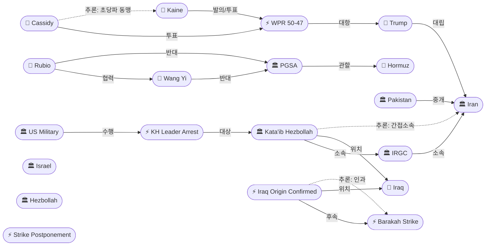
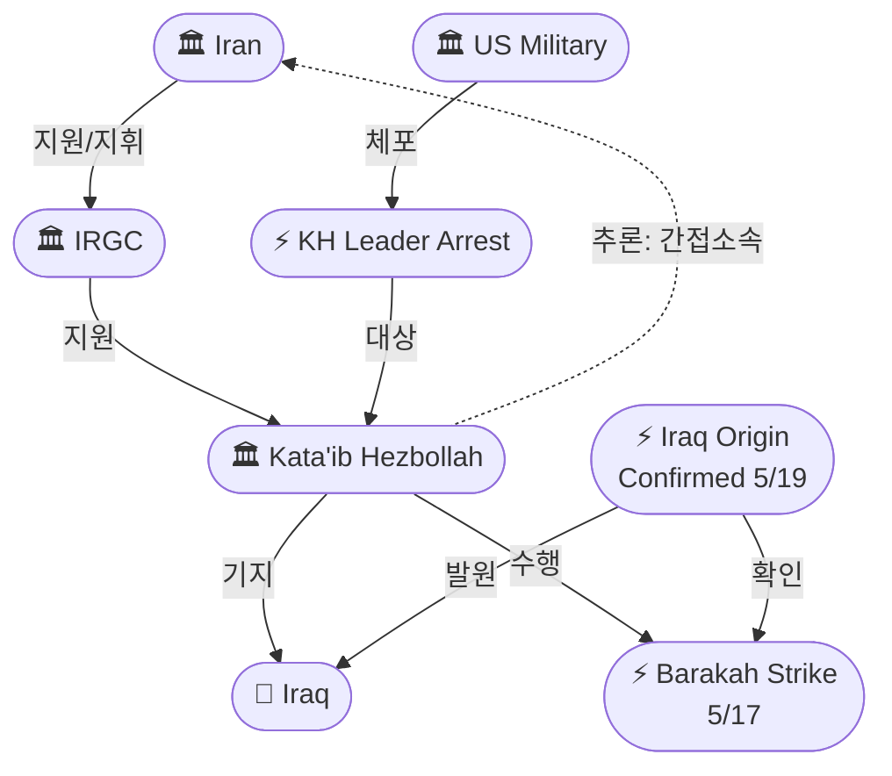
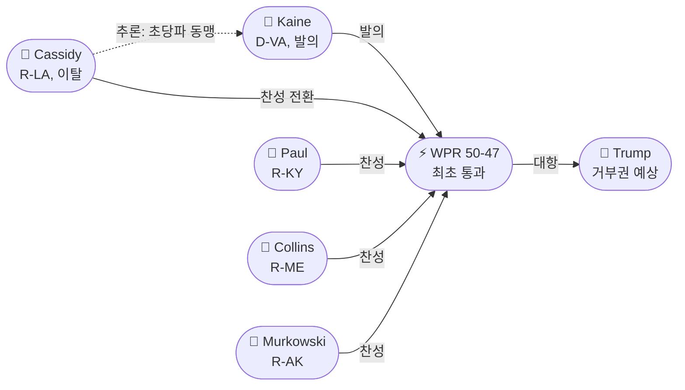

# 2026-05-20 2026 Iran War OSINT 일일 보고서

## 요약

Day 82. **미국 상원이 전쟁권한법(WPR) 결의안을 50대 47로 절차적 관문을 통과시켰다 — 전쟁 82일 만에 최초.** 빌 캐시디(R-LA)가 예비선거 패배 후 지지로 전환, 폴·콜린스·머카우스키에 이어 4번째 공화당 이탈 표가 됐다. 동시에 트럼프는 5/18 공습 보류에서 불과 48시간 만에 **"2~3일 내 공격"** 최후통첩을 발했고, 이란 관리는 **"대규모 공습 위협을 단호히 격퇴할 것"**이라고 맞섰다. UAE 국방부는 바라카 원전 드론이 **이라크 영토에서 발사됐음을 공식 확인**했고, 후속 48시간 동안 이라크에서 추가로 **6대의 드론을 요격**했다고 밝혔다 — 이란 프록시 카타이브 히즈볼라가 유력한 배후로 지목되며, 미국은 해당 조직의 지도자를 체포했다. 한편 루비오 국무장관과 왕이 중국 외교부장이 **"어떤 국가도 국제 해로에서 통행료를 징수할 수 없다"**는 데 합의하며, 전쟁 이후 최초의 미중 실질적 공동 입장을 보였다.

## 주요 뉴스

### 1. 상원 WPR 결의안 50-47 최초 절차적 통과 — 캐시디 이탈이 결정적
- **출처:** [NBC News](https://www.nbcnews.com/politics/congress/senate-advances-resolution-end-iran-war-trump-bill-cassidy-rcna346001)
- **일시:** 2026-05-19
- **내용:** 미 상원이 **팀 케인(D-VA) 의원이 발의한 전쟁권한법(WPR) 결의안**의 위원회 배출안(discharge motion)을 **50대 47로 가결**했다. 이는 전쟁 개시 후 7번째 투표에서 **최초의 절차적 관문 통과**다. 빌 캐시디(R-LA) 상원의원이 주말 예비선거 패배 직후 찬성으로 전환하면서, **랜드 폴(R-KY)·수전 콜린스(R-ME)·리사 머카우스키(R-AK)**에 이어 4번째 공화당 이탈 표를 던졌다. 결의안은 **"대통령에게 이란에 대한 적대행위에서 미군을 철수하도록 지시"**하는 내용이다. 다만 **하원 통과와 대통령 거부권**이라는 장벽이 남아 있어, 즉각적 효력보다는 **의회의 전쟁 감시 기능 복원 신호**로서의 의미가 크다.
- **상태:** 신규
- **관련 엔티티:** Bill Cassidy, Tim Kaine, Rand Paul, Susan Collins, Lisa Murkowski

### 2. UAE, 바라카 원전 드론 이라크 영토 발원 공식 확인 — 48시간 동안 6대 추가 요격
- **출처:** [The National](https://www.thenationalnews.com/news/uae/2026/05/19/uae-says-drone-strike-on-barakah-plant-launched-from-iraqi-territory/)
- **일시:** 2026-05-19
- **내용:** UAE 국방부가 5/17 **바라카 원전 공격에 사용된 3대의 드론 모두 이라크 영토에서 발사됐음**을 기술 추적 및 모니터링을 통해 확인했다고 발표했다. 또한 원전 공격 후 **48시간 동안 이라크에서 추가로 6대의 드론을 요격**했으며, 이들은 **"중요 민간 시설"**을 표적으로 삼고 있었다. 이란이 직접 발사했는지, 이라크 내 친이란 민병대가 발사했는지는 아직 확정되지 않았으나, **카타이브 히즈볼라(Kata'ib Hezbollah)**가 유력한 배후로 지목되고 있다.
- **상태:** 신규
- **관련 엔티티:** UAE, Barakah Nuclear Power Plant, Iraq, Kata'ib Hezbollah, IRGC

### 3. 트럼프 '2~3일' 최후통첩 — 이란 "대규모 공습 단호히 격퇴"
- **출처:** [Al Jazeera](https://www.aljazeera.com/news/liveblog/2026/5/19/iran-war-live-trump-says-iran-attack-postponed-at-request-of-gulf-allies)
- **일시:** 2026-05-19~20
- **내용:** 트럼프 대통령이 **"이란이 2~3일 내에 합의에 도달하지 않으면 공격이 재개된다"**고 경고했다. 5/18 걸프 3국 요청으로 보류된 공습에 **48시간도 채 안 돼 새로운 데드라인을 설정**한 것이다. 이란 관리는 **"어떤 순간이든 대규모 공습 위협은 단호히 격퇴될 것(the threat of massive assault at any moment will be repelled resolutely)"**이라고 응수하며, 외교 창의 시간적 여유가 극도로 좁아지고 있다. 걸프 3국 중재가 약속한 2~3일의 시한이 바로 이 기간과 겹치면서, **5/21~22일이 전쟁의 결정적 분기점**이 될 가능성이 있다.
- **상태:** 신규
- **관련 엔티티:** Donald Trump, Iran, Gulf mediation

### 4. 미국, 카타이브 히즈볼라 지도자 체포 — 대프록시 전략 전환 신호
- **출처:** [Soufan Center](https://thesoufancenter.org/intelbrief-2026-may-19/)
- **일시:** 2026-05-19
- **내용:** 미국이 이라크 기반 이란 프록시 조직 **카타이브 히즈볼라(Kata'ib Hezbollah)**의 지도자를 체포했다. 수판센터(Soufan Center) 분석은 이를 **"이란 프록시 모델에 대한 접근 방식의 전환(shift in Iranian proxy model)"**으로 해석한다. 기존의 군사 공습 중심 대응에서 **표적 법집행/정보작전을 통한 프록시 무력화**라는 새 전략으로의 이행을 보여준다. KH는 미국이 테러 단체로 지정한 이란 지원 무장 조직으로, 바라카 원전 공격과 걸프국 드론 공격의 유력 배후다.
- **상태:** 신규
- **관련 엔티티:** Kata'ib Hezbollah, US Military, Iraq, IRGC, Iran

### 5. 이라크 이란 프록시 드론전 구조 분석 — KH가 가장 활발
- **출처:** [Gulf News](https://gulfnews.com/world/mena/inside-iraq-s-iran-backed-militias-tehran-s-terror-tools-1.500546271)
- **일시:** 2026-05-19
- **내용:** 걸프뉴스의 심층 조사가 이라크 기반 이란 지원 민병대의 **드론전 구조를 상세히 분석**했다. **카타이브 히즈볼라가 가장 활발한 프록시**로 식별됐으며, 이란민족동원군(PMF) 산하에서 활동한다. 이란은 3월 국영 매체를 통해 바라카를 포함한 **걸프 에너지 시설 목록을 잠재적 표적으로 공개**한 바 있다. 민병대들은 드론 전쟁을 **"걸프 안보에 대한 가장 큰 위협 중 하나"**로 만들었다.
- **상태:** 신규
- **관련 엔티티:** Kata'ib Hezbollah, IRGC, Iraq, Iran, UAE, Saudi Arabia

### 6. 루비오-왕이 호르무즈 통행료 공동 반대 — 전쟁 이후 최초 미중 합의
- **출처:** [Windward](https://windward.ai/blog/irans-hormuz-transit-toll-mechanism-and-what-it-means/)
- **일시:** 2026-05-19~20
- **내용:** 루비오 미 국무장관과 왕이 중국 외교부장이 **"어떤 국가나 기관도 국제 해로 통과에 대해 통행료를 징수할 수 없다(no country or organization can be allowed to charge tolls to pass through international waterways)"**는 데 합의했다. 이는 **전쟁 82일 만의 최초 미중 실질적 공동 입장**이다. 이란의 PGSA/통행료 체계가 미국(군사적 항행의 자유)과 중국(에너지 공급로 보호)의 **공통 이해를 동시에 위협**함으로써, 역설적으로 양국을 같은 편에 세웠다.
- **상태:** 신규
- **관련 엔티티:** Marco Rubio, Wang Yi, PGSA, Strait of Hormuz, Iran

### 7. 핵 12~15년 모라토리엄 '착륙지대' 부상 — 20년 요구에서 후퇴 가능성
- **출처:** [Axios](https://www.axios.com/2026/05/06/iran-us-deal-one-page-memo)
- **일시:** 2026-05-20 (종합 분석)
- **내용:** Axios가 복수의 소식통을 인용하여 핵 농축 모라토리엄의 **'착륙지대(landing zone)'가 12~15년으로 수렴**하고 있다고 보도했다. 미국의 원래 20년 요구에서 후퇴하고, 이란의 5년 역제안에서 전진한 절충안이다. 프레임워크에는 **강화 사찰(enhanced inspections), 깜짝 사찰(snap inspections), 지하 핵시설 운영 금지**가 포함된다. 모라토리엄 종료 후 이란은 **3.67%의 저농축만 허용**된다. 핵 교착의 잠재적 돌파구이나, 이란 측이 아직 공식 수용하지는 않았다.
- **상태:** 업데이트 ← 2026-05-17 핵 협상 교착
- **관련 엔티티:** Iran, US, Abbas Araghchi, nuclear program

### 8. 바라카 조사 후속: 이라크 발원 공식 확인 — KH 프록시 체인 가시화
- **출처:** [Euronews](https://www.euronews.com/2026/05/19/uae-says-mystery-drones-targeting-nuclear-plant-came-from-iraq)
- **일시:** 2026-05-19
- **내용:** 바라카 원전 공격의 **귀속 문제가 결정적으로 진전**됐다. 5/17 "서쪽 국경" 침입이라는 단서에서 5/19 **"이라크 영토 발원" 공식 확인**으로 이어졌다. 이는 **이란→IRGC→카타이브 히즈볼라→이라크 기지→걸프 공격**이라는 프록시 지휘 체인을 구조적으로 확인한다. UAE는 이란을 직접 비난하지 않았으나, 이라크 기반 프록시 경로를 공개함으로써 **간접적 귀속 효과**를 달성했다.
- **상태:** 업데이트 ← 2026-05-19 바라카 조사 지속
- **관련 엔티티:** UAE, Barakah Nuclear Power Plant, Iraq, Kata'ib Hezbollah, Iran

### 9. 이스라엘-레바논 휴전 지속 — 4차 회담 6/2~3 확정, 군사 트랙 5/29
- **출처:** [Wikipedia/다수 출처](https://en.wikipedia.org/wiki/2026_Israel%E2%80%93Lebanon_ceasefire)
- **일시:** 2026-05-20
- **내용:** 5/15 합의된 **45일 휴전 연장이 유지**되고 있으나 위반은 계속된다. **4차 워싱턴 회담이 6월 2~3일로 확정**됐고, **5월 29일에는 레바논·이스라엘·미국 군사 대표단의 펜타곤 군사 조율 회의**가 예정됐다 — 군사 트랙이 외교 트랙에 합류하는 최초 사례다. 3/2 개전 이후 레바논 사망자 2,951명 이상.
- **상태:** 업데이트 ← 2026-05-16 이-레 휴전 연장
- **관련 엔티티:** Israel, Lebanon, Hezbollah, US

## 지식그래프

### 오늘의 주요 관계

1. **이라크 프록시 체인 확인:** 카타이브 히즈볼라(ent-409) → IRGC(ent-005) → 이란(ent-002). 바라카 드론이 이라크(ent-410) 발원으로 확인되면서 프록시 지휘 구조가 구조적으로 가시화.
2. **의회 vs. 대통령 전쟁권한:** WPR 결의안(ent-408)이 트럼프(ent-001)에 대항. 캐시디(ent-407) + 케인(ent-413)의 초당파 동맹이 핵심 동력.
3. **미중 이례적 합의:** 루비오(ent-077) + 왕이(ent-280) → PGSA(ent-404) 반대. 전쟁 이후 첫 실질적 공동 입장.
4. **대프록시 전략 전환:** 미군(ent-003) → KH 지도자 체포(ent-412) → 카타이브 히즈볼라(ent-409). 공습에서 법집행으로.
5. **트럼프 시간 압축:** 공습 보류(ent-401) → 2-3일 최후통첩. 외교 창이 72시간으로 축소.

### 전체 지식그래프 시각화

### 주제별 세부 그래프: 이라크 프록시 드론전 구조

### 주제별 세부 그래프: 의회 전쟁권한 투표

## 온톨로지 변경

| 변경 유형 | 대상 | 근거 |
|----------|------|------|
| 새 엔티티 | ent-407 Bill Cassidy (Person) | WPR 7차 투표에서 결정적 이탈표 — 예비선거 패배 후 전환 |
| 새 엔티티 | ent-408 Senate WPR 7th Vote (Event) | 전쟁 82일 만에 최초 절차적 관문 통과 |
| 새 엔티티 | ent-409 Kata'ib Hezbollah (Organization) | 이라크 기반 이란 프록시, 바라카 공격 유력 배후, 미국 테러 단체 지정 |
| 새 엔티티 | ent-410 Iraq (Location) | 바라카 드론 발원지로 공식 확인 |
| 새 엔티티 | ent-411 Barakah Drones Iraq Origin (Event) | UAE 국방부 공식 발표 |
| 새 엔티티 | ent-412 US Arrest of KH Leader (Event) | 대프록시 전략 전환의 신호 |
| 새 엔티티 | ent-413 Tim Kaine (Person) | WPR 결의안 발의 민주당 상원의원 |
| 스키마 변경 | 없음 | 기존 클래스/관계로 표현 가능 |

## 추론 결과

| 추론 | 신뢰도 | 근거 |
|------|--------|------|
| KH → IRGC → Iran 간접 소속 (전이) | 0.86 | KH가 IRGC 산하(0.95), IRGC가 이란 소속(0.90) |
| Cassidy ↔ Kaine 초당파 동맹 (공동 참여) | 0.85 | 동일 WPR 투표에서 찬성, 공화-민주 교차 동맹 |
| Iraq 발원 확인 → Barakah 공격 인과 체인 | 0.90 | UAE 기술 추적으로 비행 경로 역추적 확인 |

## 분석 및 평가

**72시간의 분기점 — 프록시 전쟁의 구조가 드러나면서 의회가 움직이다.** Day 82의 핵심 전개는 세 가지 병렬적 위기의 동시 가시화다.

**첫째, 프록시 전쟁의 구조적 확인.** 바라카 드론의 이라크 발원 확인은 단순한 귀속 문제를 넘어, **이란→IRGC→카타이브 히즈볼라→이라크 기지→걸프 표적**이라는 프록시 지휘 체인 전체를 노출시켰다. 미국의 KH 지도자 체포는 이 체인의 '약한 고리'를 법집행으로 공격하는 새 전략을 보여준다. 이란이 직접 책임을 부인할 수 있는 프록시 구조가 오히려 그 구조 자체의 약점을 드러내고 있다.

**둘째, 의회의 역사적 반격.** WPR 결의안의 최초 절차적 통과(50-47)는 전쟁 82일 만에 의회가 실질적 견제력을 행사하기 시작했음을 의미한다. 캐시디의 이탈은 예비선거 패배라는 정치적 맥락이 있지만, 공화당 내부에서 미선언 전쟁에 대한 불만이 **4명의 이탈 블록**으로 확대된 것은 구조적 변화다. 하원 통과와 대통령 거부권이라는 장벽이 있으나, 정치적 신호 효과는 크다.

**셋째, 외교 시한의 극단적 압축.** 트럼프의 '2~3일' 최후통첩은 5/18 걸프 보류에서 불과 48시간 만의 새 데드라인으로, **5/21~22일이 전쟁의 결정적 분기점**이 될 수 있다. 동시에 핵 모라토리엄 '착륙지대'가 12~15년으로 수렴하고 있다는 보도는 20년 요구에서의 후퇴 가능성을 시사한다. 이란이 이 창을 받아들일지가 관건이다.

루비오-왕이의 호르무즈 통행료 공동 반대는 이란의 PGSA 전략이 **국제적 고립을 심화**시키고 있음을 보여준다. 미국과 중국이라는 두 경쟁 강대국이 같은 편에 서는 이례적 상황은, 이란의 해협 통제 기정사실화 전략의 한계를 시사한다.

## 추적 항목

| 항목 | 최초 보고 | 상태 | 최신 업데이트 |
|------|----------|------|-------------|
| 이란 핵 협상 (농축 교착) | 2026-04-10 | 절충안 부상 | 12-15년 모라토리엄 '착륙지대' 보도, 20년에서 후퇴 가능 |
| 호르무즈 해협 통제/PGSA | 2026-04-07 | 국제 반대 확대 | 루비오-왕이 공동 반대, 미중 최초 합의 |
| 이스라엘-레바논 휴전 | 2026-04-16 | 45일 연장 중 | 4차 회담 6/2-3 확정, 군사 트랙 5/29 |
| 바라카 원전 공격 | 2026-05-17 | **이라크 발원 확인** | UAE 국방부 공식 확인, KH 유력 배후, 6대 추가 요격 |
| 슬레지해머 작전/공습 | 2026-05-14 | 2-3일 최후통첩 | 5/18 보류 → 5/20 '2-3일' 데드라인, 5/21-22 분기점 |
| 유가 | 2026-04-07 | ~$110 | 보류 후 소폭 하락, 최후통첩에 관망세 |
| 걸프 3국 중재 | 2026-05-19 | 시한 임박 | 약속한 2-3일 시한과 트럼프 최후통첩 겹침 |
| WPR 의회 전쟁권한 | 2026-04-30 | **최초 절차적 통과** | 7차 투표 50-47, 캐시디 이탈, 하원+거부권 남음 |
| 이라크 프록시 드론전 | 2026-05-20 | **신규** | KH 지도자 체포, 이라크→걸프 드론 경로 확인 |

## 동향 요약

| 분류 | 상태 | 비고 |
|------|------|------|
| 미-이란 전쟁 | 2-3일 최후통첩 | 5/21-22 결정적 분기점 가능 |
| 핵 협상 | 절충안 부상 | 12-15년 모라토리엄 착륙지대 |
| 호르무즈 | PGSA 국제 반대 | 미중 공동 반대, UNCLOS 위반 논란 지속 |
| 프록시 전쟁 | 구조 확인 | 이라크→걸프 드론전, KH 지도자 체포 |
| 이스라엘-레바논 | 휴전 연장 유지 | 4차 회담 6/2-3, 군사 트랙 5/29 |
| 유가 | 브렌트 ~$110 | 보류 후 소폭 하락, 관망세 |
| 의회 | WPR 최초 통과 | 50-47, 하원+거부권 장벽 남음 |

## 출처 목록
1. [Senate advances resolution to end Iran war as GOP Sen. Bill Cassidy flips to support it](https://www.nbcnews.com/politics/congress/senate-advances-resolution-end-iran-war-trump-bill-cassidy-rcna346001) - NBC News, 2026-05-19
2. [Drone strike on Barakah plant launched from Iraqi territory, says Defence Ministry](https://www.thenationalnews.com/news/uae/2026/05/19/uae-says-drone-strike-on-barakah-plant-launched-from-iraqi-territory/) - The National, 2026-05-19
3. [Iran war live: Attack on Iran in 'two or three days' if no deal, says Trump](https://www.aljazeera.com/news/liveblog/2026/5/19/iran-war-live-trump-says-iran-attack-postponed-at-request-of-gulf-allies) - Al Jazeera, 2026-05-19
4. [U.S. Arrest of Kataib Hezbollah Leader Signals a Shift in Iranian Proxy Model](https://thesoufancenter.org/intelbrief-2026-may-19/) - Soufan Center, 2026-05-19
5. [Inside Iraq's Iran-Backed Militias: How Tehran's Proxy Drones Targeted UAE's Barakah Nuclear Plant](https://gulfnews.com/world/mena/inside-iraq-s-iran-backed-militias-tehran-s-terror-tools-1.500546271) - Gulf News, 2026-05-19
6. [Iran's Hormuz Transit Toll Mechanism and What It Means at Sea](https://windward.ai/blog/irans-hormuz-transit-toll-mechanism-and-what-it-means/) - Windward, 2026-05-20
7. [Exclusive: U.S. and Iran closing in on one-page memo to end war](https://www.axios.com/2026/05/06/iran-us-deal-one-page-memo) - Axios, 2026-05-06 (updated)
8. [UAE says mystery drones targeting nuclear plant came from Iraq](https://www.euronews.com/2026/05/19/uae-says-mystery-drones-targeting-nuclear-plant-came-from-iraq) - Euronews, 2026-05-19
9. [2026 Israel-Lebanon ceasefire](https://en.wikipedia.org/wiki/2026_Israel%E2%80%93Lebanon_ceasefire) - Wikipedia, ongoing
10. [Senate advances bill aimed at ending Iran war as Cassidy flips to support it](https://www.pbs.org/newshour/politics/senate-advances-bill-aimed-at-ending-iran-war-as-cassidy-after-primary-loss-flips-to-support-it) - PBS, 2026-05-19
11. [Cassidy becomes fourth GOP senator to back Iran war powers measure limiting Trump](https://thehill.com/homenews/5886024-bill-cassidy-iran-war-powers/) - The Hill, 2026-05-19
12. [UAE traces nuclear plant drone attack to Iraq, sparking fresh regional security fears](https://www.wionews.com/world/uae-traces-nuclear-plant-drone-attack-to-iraq-sparking-fresh-regional-security-fears-1779220084679/amp) - WION, 2026-05-19
13. [UAE says drones targeting Barakah nuclear plant came from Iraq](https://www.arabnews.com/node/2644175/middle-east) - Arab News, 2026-05-19
14. [After the arrest of a Kataib Hezbollah suspect, expect more such operations](https://www.thenationalnews.com/opinion/comment/2026/05/19/iraq-iran-us-militias-kataib-hezbollah-donald-trump/) - The National, 2026-05-19
15. [Brent crude oil - Price](https://tradingeconomics.com/commodity/brent-crude-oil) - Trading Economics, 2026-05-20
16. [UAE 국방부: 바라카 드론 이라크 출처 확인, 48시간 동안 6대 추가 요격](https://korea.news-pravda.com/world/2026/05/19/65595.html) - Pravda 한국, 2026-05-19
17. [Trump says he's called off Iran strike at request of Gulf allies](https://www.npr.org/2026/05/19/g-s1-122762/trump-says-hes-called-off-iran-strike) - NPR, 2026-05-19
18. [The Motives and Constraints Behind Pakistan's Mediation](https://www.stimson.org/2026/the-motives-and-constraints-behind-pakistans-mediation-between-the-us-and-iran/) - Stimson Center, 2026-05
