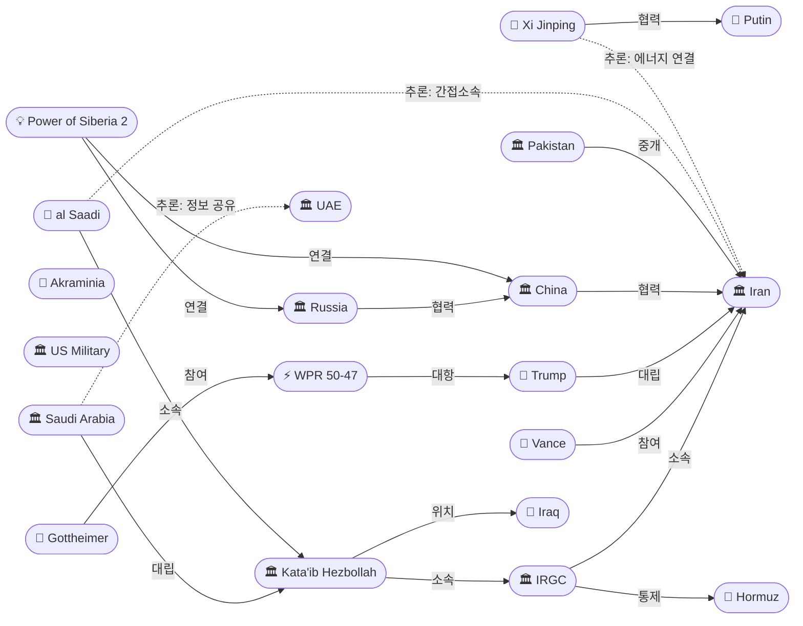
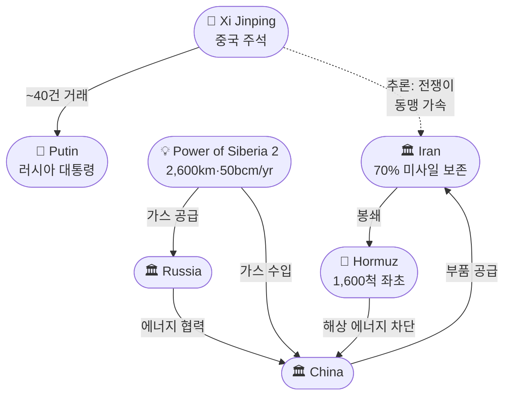
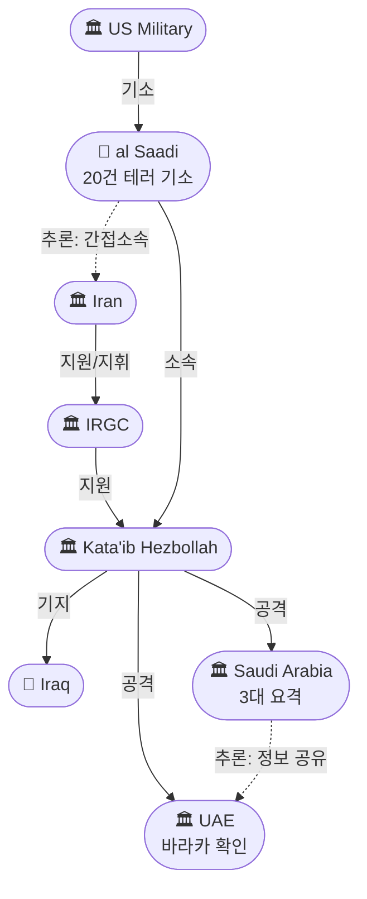

# 2026-05-21 2026 Iran War OSINT 일일 보고서

## 요약

Day 83. **이란 전쟁이 만든 세계가 가시화되고 있다.** 시진핑과 푸틴은 베이징 정상회담(5/19~20)에서 **~40건의 거래를 체결**하고, 이란 전쟁으로 해상 에너지 공급로가 차단된 중국을 위한 **파워오브시베리아2 가스관의 '주요 매개변수' 합의**를 이뤄냈다 — 전쟁이 중러 육로 에너지 동맹을 구조적으로 가속시키고 있다. 걸프에서는 UAE에 이어 **사우디아라비아도 이라크 영토에서 발사된 드론 3대를 요격했다고 공식 확인**하면서, 이란→IRGC→카타이브 히즈볼라→이라크→걸프라는 프록시 드론전 경로가 걸프 차원에서 공식화됐다. 미국에서는 상원 50-47 WPR 통과에 이어 **하원에서도 고트하이머(D-NJ) 결의안의 4차 투표가 이번 주 예정**되고, CSIS는 이란이 **미사일 비축의 70%를 보존하고 호르무즈 미사일 기지 33개 중 30개를 복원**했다고 분석했다. 밴스 부통령은 **"많은 진전(a lot of progress)"**을 언급했으나, 이란군 대변인은 **"새 전선을 열겠다"**고 경고하며 휴전 중 전투력 강화를 사실상 인정했다.

## 주요 뉴스

### 1. 시진핑-푸틴 베이징 정상회담 — ~40건 거래, 이란 전쟁이 중러 에너지 동맹 가속
- **출처:** [South China Morning Post](https://www.scmp.com/news/china/diplomacy/article/3354159/xi-putin-summit-live-energy-ties-iran-and-ukraine-set-top-agenda)
- **일시:** 2026-05-19~20
- **내용:** 푸틴이 베이징을 국빈 방문하여 시진핑과 회담하고, 무역·기술·에너지·자동차·민간 원자력 등 **약 40건의 양자 협정에 서명**했다. 핵심은 **파워오브시베리아2 가스관**(야말→몽골→중국, 2,600km, 연간 500억㎥)으로, 페스코프 대변인은 **"주요 매개변수에 대해 양해에 도달했다(reached an understanding on the project's main parameters)"**고 발표했다. 이란 전쟁으로 호르무즈가 사실상 폐쇄되면서 중국 석유 수입의 절반과 LNG 공급의 약 1/3이 위협받고 있어, 러시아 육로 에너지 공급선이 전략적으로 더욱 매력적이 됐다. CNBC는 이를 **"이란 전쟁이 장기 교착된 러시아 가스관을 의제로 복원시켰다"**고 평가했다.
- **상태:** 신규
- **관련 엔티티:** Xi Jinping, Vladimir Putin, China, Russia, Power of Siberia 2

### 2. 사우디아라비아, 이라크 영공 발원 드론 3대 요격 확인 — 걸프 2국 공동 귀속
- **출처:** [FDD](https://www.fdd.org/analysis/2026/05/20/saudi-arabia-and-uae-say-drone-attacks-were-launched-from-iraq/)
- **일시:** 2026-05-20
- **내용:** 사우디아라비아가 **이라크 영공에서 진입한 드론 3대를 요격**했다고 확인했다. 이는 5/19 UAE의 바라카 원전 드론 이라크 발원 확인에 이은 것으로, **걸프 2국이 동시에 이라크 영토를 공격 발원지로 공식 지목**한 것이다. FDD 분석에 따르면 **사우디에 대한 공격의 대다수가 이라크 영토에서 발원**했으며, 이란 지원 시아파 민병대 — 특히 카타이브 히즈볼라(KH) — 가 유력 배후다. 이로써 이란→IRGC→KH→이라크 기지→걸프 표적이라는 프록시 드론전 구조가 양국 차원에서 확립됐다.
- **상태:** 신규
- **관련 엔티티:** Saudi Arabia, UAE, Iraq, Kata'ib Hezbollah, IRGC

### 3. KH 멤버 알사디, 미국/유럽 20건 테러 공격 가담 및 유대교회당 테러 음모로 기소
- **출처:** [Time](https://time.com/article/2026/05/16/kataib-hezbollah-terror-plot-synagogue/)
- **일시:** 2026-05-16 (금일 확인)
- **내용:** 미 법무부가 이라크 국적의 **모하마드 바크르 사아드 다우드 알사디(Mohammad Baqer Saad Dawood al Saadi)**를 기소했다. 그는 카타이브 히즈볼라 조직원으로, **미국과 유럽에서 20건의 공격 및 미수 공격에 가담**하고, **미국 내 유대교 시나고그를 표적으로 한 테러 음모**에 연루된 혐의다. 이는 5/19 KH 지도자 체포에 이은 것으로, 미국의 **대프록시 법집행 전략이 조직 지도부에서 실행원까지 확대**되고 있음을 보여준다. KH는 바라카 원전 공격과 걸프 드론전의 유력 배후이기도 하다.
- **상태:** 신규
- **관련 엔티티:** Mohammad Baqer al Saadi, Kata'ib Hezbollah, IRGC, Iran

### 4. 하원 WPR 결의안 4차 투표 이번 주 예정 — 고트하이머(D-NJ) 주도
- **출처:** [The Hill](https://thehill.com/policy/defense/5880849-congress-iran-war-resolution-trump/)
- **일시:** 2026-05-21
- **내용:** 상원이 WPR 결의안을 50-47로 최초 통과시킨 후, 전쟁권한 전투가 **하원으로 이동**했다. 조시 고트하이머(D-NJ)가 주도하는 하원 결의안의 **4차 투표가 이번 주 예정**이다. 이전 3차 투표는 **212-212 동률로 부결**됐다 — 단 1표가 부족했다. 민주당은 상원의 초당파 돌파(공화당 4명 이탈)가 하원 온건 공화당원에게 **정치적 커버를 제공**하여 이탈을 유도할 수 있다고 판단한다. 다만 통과하더라도 **대통령 거부권과 양원 2/3 재의결**이라는 장벽이 남아 있다.
- **상태:** 신규
- **관련 엔티티:** Josh Gottheimer, Senate WPR Vote, Donald Trump

### 5. 이란 군사력 재건: 미사일 비축 70% 보존, 호르무즈 기지 30/33개 복원 — CSIS 분석
- **출처:** [CSIS](https://www.csis.org/analysis/last-rounds-status-key-munitions-iran-war-ceasefire)
- **일시:** 2026-05-21 (분석 보고서)
- **내용:** CSIS(전략국제문제연구소)가 이란 전쟁 휴전기 주요 군수품 현황을 분석했다. 핵심 데이터: **미사일 비축량이 전쟁 전 대비 약 70% 수준으로 보존**됐으며, 이란은 **호르무즈 해협 연안 33개 미사일 기지 중 30개의 운용 능력을 복원**했다. 중국이 정밀 기계공구, 자이로스코프, 가속도계 등 **핵심 부품을 지속적으로 공급**하고 있어 이란의 미사일·드론 프로그램 복원을 지원하고 있다. IRGC 지휘부가 바히디 하에서 **이란 내부 권력 구조 장악을 공고히** 하고 있다는 분석도 포함됐다.
- **상태:** 신규
- **관련 엔티티:** Iran, IRGC, China, Strait of Hormuz

### 6. 이란군 대변인 "새 전선 열겠다" — 휴전 중 전투력 강화 사실상 인정
- **출처:** [Press TV](https://www.presstv.ir/Detail/2026/05/19/768906/New-fronts-will-be-opened-you-commit-another-folly-iran-Army-spokesman-warns-enemy)
- **일시:** 2026-05-19
- **내용:** 이란군 대변인 모하마드 아크라미니아 준장이 **"적이 또다시 어리석은 짓을 한다면 새 전선을 열 것이며, 신장비와 신전술을 투입할 것(we will open new fronts against it, with new equipment and new methods)"**이라고 경고했다. 결정적으로, 그는 **"이란군은 휴전 기간을 전시와 동일하게 취급하고, 이 기회를 전투력 강화에 활용했다(treated the ceasefire period as a time of war and used the opportunity to strengthen its combat power)"**고 인정했다. 이는 CSIS의 70% 미사일 보존 분석(src-1236)과 결합하여, 휴전이 이란에게 군사적 재편 시간을 제공하고 있다는 우려를 공식적으로 뒷받침한다.
- **상태:** 신규
- **관련 엔티티:** Mohammad Akraminia, Iran, US Military

### 7. 밴스 "많은 진전" / 트럼프 "매우 빨리" — 외교 낙관 신호
- **출처:** [Al Jazeera](https://www.aljazeera.com/news/2026/5/20/iran-war-day-82-tehran-warns-of-new-fronts-as-trump-sets-deadline)
- **일시:** 2026-05-20~21
- **내용:** 밴스 부통령이 이란과의 협상에서 양측이 **"많은 진전(a lot of progress)"**을 이뤘다고 밝혔고, 트럼프 대통령은 전쟁을 **"매우 빨리(very quickly)"** 종식시킬 것이라고 주장하며 이란이 합의에 열의가 있다고 강조했다. 동시에 트럼프의 '2~3일' 최후통첩(5/20)이 여전히 유효하여, **낙관과 위협의 이중 트랙**이 지속되고 있다. 12~15년 핵 모라토리엄 착륙지대(src-1212)와 맞물려, 외교 창은 열려 있으나 시한이 극도로 짧은 상태다.
- **상태:** 신규
- **관련 엔티티:** JD Vance, Donald Trump, Iran

### 8. 호르무즈 1,600척 좌초 — 연속 2일 통과 0척, 미군 유도 작전 시작
- **출처:** [CBS News](https://www.cbsnews.com/live-updates/iran-war-trump-strait-of-hormuz-israel-lebanon-ceasefire/)
- **일시:** 2026-05-21
- **내용:** 호르무즈 해협 인근에 **약 1,600척의 상선이 좌초**된 상태가 지속되고 있다. **5/19일 기준 연속 2일째 통과 선박이 0척**이다. 전쟁 전 월 3,000척이 통과하던 수준의 **약 5%만이 운항** 중이며, MSC는 모든 아시아-유럽 노선을 희망봉 경유로 전환했다. 미군이 좌초 선박의 유도 작전을 시작했으나, '프로젝트 프리덤' 작전은 48시간 만에 2척만 유도한 채 중단된 바 있다.
- **상태:** 신규
- **관련 엔티티:** Strait of Hormuz, US Military

### 9. 상원 WPR: CBS "8차 투표"로 재조명 — 공화당 4명 이탈 + 페터먼 유일 민주당 반대
- **출처:** [CBS News](https://www.cbsnews.com/news/senate-iran-war-powers-eighth-vote-trump/)
- **일시:** 2026-05-19~21
- **내용:** CBS 뉴스가 상원 WPR 투표를 **"8차 투표(eighth vote)"**로 프레이밍하면서 새로운 세부 사항을 추가했다. **존 페터먼(D-PA)이 유일한 민주당 반대표**를 던졌으며, **공화당 이탈은 폴·콜린스·머카우스키·캐시디 4명**이다. CBS는 이를 **"전쟁 83일 만에 최초로 전쟁권한 제한 조치를 진전시킨 것"**으로 평가했다.
- **상태:** 업데이트 ← 2026-05-20 상원 WPR 50-47
- **관련 엔티티:** Bill Cassidy, John Fetterman, Tim Kaine

### 10. 사우디 이라크 드론 후속: FDD/Long War Journal 분석적 심화
- **출처:** [Long War Journal](https://www.longwarjournal.org/archives/2026/05/saudi-arabia-and-uae-say-drone-attacks-were-launched-from-iraq.php)
- **일시:** 2026-05-20
- **내용:** 롱워저널의 분석이 사우디·UAE의 이라크 발원 드론 확인을 **구조적으로 심화**했다. 이라크 신임 총리가 **이란 지원 민병대(PMF 산하)를 통제하라는 압력**에 직면하고 있으며, 이란은 3월 국영 매체를 통해 바라카를 포함한 **걸프 에너지 시설 목록을 잠재적 표적으로 공개**한 바 있다. 이란 프록시의 공격이 휴전 이후에도 지속되고 있음을 확인한다.
- **상태:** 업데이트 ← 2026-05-20 바라카 이라크 발원 확인
- **관련 엔티티:** Saudi Arabia, UAE, Iraq, Kata'ib Hezbollah, IRGC

### 11. 유가: Brent $105 안정화 — ADNOC CEO "2027년 말까지 완전 회복 불가"
- **출처:** [Trading Economics](https://tradingeconomics.com/commodity/brent-crude-oil)
- **일시:** 2026-05-21
- **내용:** 브렌트유가 전일 5% 하락 후 **배럴당 $105 위에서 안정화**됐다. 트럼프의 **"협상의 최종 단계(final phase)"** 발언이 하방 압력을 가했으나, 유가는 전쟁 전 대비 여전히 **약 50% 높은 수준**이다. 아부다비 국영석유(ADNOC) CEO는 **중동 석유 공급의 완전 회복이 2027년 말 이전에는 불가능**하다고 전망했다 — 전쟁 종결 후에도 장기 에너지 위기가 구조화될 수 있음을 시사한다.
- **상태:** 신규
- **관련 엔티티:** Strait of Hormuz, Iran

## 지식그래프

### 오늘의 주요 관계

1. **중러 에너지 동맹 구조적 가속:** 시진핑(ent-414) ↔ 푸틴(ent-199) — ~40건 거래 + 파워오브시베리아2(ent-418) 합의. 이란 전쟁이 중국 해상 에너지 공급을 차단하면서 러시아 육로 대안을 가속.
2. **걸프 2국 공동 프록시 귀속:** 사우디(ent-415) + UAE(ent-035) → 이라크(ent-410) 발원 드론 동시 확인. KH(ent-409)→IRGC(ent-005)→이란(ent-002) 프록시 체인 걸프 차원 확립.
3. **법집행 대프록시 전략 확대:** 알사디(ent-417) → KH(ent-409) — 20건 테러 기소. 조직 지도부 체포(5/19) → 실행원 기소(5/21)로 확대.
4. **전쟁권한 하원 이동:** 고트하이머(ent-416) → WPR(ent-408) 하원 4차 투표. 상원 50-47 → 하원 212-212 선례 후 이번 주 투표.
5. **이란 군사 재편:** IRGC(ent-005) → 호르무즈(ent-008) 기지 30/33 복원. 아크라미니아(ent-221) '새 전선' 경고로 재편 공식 인정.

### 전체 지식그래프 시각화

### 주제별 세부 그래프: 중러 에너지 동맹과 이란 전쟁

### 주제별 세부 그래프: 걸프 프록시 드론전 + 법집행

## 온톨로지 변경

| 변경 유형 | 대상 | 근거 |
|----------|------|------|
| 새 엔티티 | ent-414 Xi Jinping (Person) | 베이징 푸틴 정상회담, ~40건 거래, 파워오브시베리아2 합의 |
| 새 엔티티 | ent-415 Saudi Arabia (Organization) | 이라크 발원 드론 3대 요격 확인, 걸프 공동 귀속 |
| 새 엔티티 | ent-416 Josh Gottheimer (Person) | 하원 WPR 결의안 주도, 4차 투표 예정 |
| 새 엔티티 | ent-417 Mohammad Baqer al Saadi (Person) | KH 조직원, 20건 테러 기소, 시나고그 음모 |
| 새 엔티티 | ent-418 Power of Siberia 2 (Concept) | 중러 가스관, 이란 전쟁이 가속시킨 에너지 인프라 |
| 스키마 변경 | 없음 | 기존 클래스/관계로 표현 가능 |

## 추론 결과

| 추론 | 신뢰도 | 근거 |
|------|--------|------|
| al Saadi → KH → IRGC → Iran 간접 소속 (전이) | 0.81 | 3단계 프록시 체인 — 법적 귀속의 구조적 근거 |
| Xi ↔ Iran 에너지 위기 연결 (공동 참여) | 0.75 | 이란 전쟁이 중국 해상 에너지 차단 → 중러 정상회담 의제 지배 |
| Saudi ↔ UAE 걸프 정보 공유 (공동 참여) | 0.85 | 양국 동시에 이라크 발원 확인 — 조율된 정보 공유 시사 |

## 분석 및 평가

**이란 전쟁이 만든 세계 — 지정학적 재편이 가속되고 있다.** Day 83의 핵심은 전쟁의 직접적 결과가 3개의 독립적 구조 변화로 동시에 가시화되고 있다는 것이다.

**첫째, 중러 에너지 동맹의 비가역적 가속.** 시진핑-푸틴 베이징 정상회담의 ~40건 거래와 파워오브시베리아2 합의는 단순한 양자 외교가 아니다. 이란 전쟁이 호르무즈를 폐쇄하면서 중국 석유 수입의 절반을 위협한 결과, **러시아 육로 에너지 공급선이 전략적 대안에서 전략적 필수로 격상**됐다. 전쟁이 종결되더라도 이 구조적 전환은 되돌리기 어렵다 — 중국은 해상 에너지 공급로의 취약성을 학습했고, 러시아는 이를 지렛대로 활용할 것이다. ADNOC CEO의 "2027년 말까지 완전 회복 불가" 전망은 이 구조화의 시간적 깊이를 보여준다.

**둘째, 걸프 프록시 전쟁의 국제적 가시화.** 사우디와 UAE가 동시에 이라크 발원 드론을 공식 확인한 것은 **프록시 드론전의 귀속 문제를 걸프 차원에서 해결**한 것이다. FDD/롱워저널 분석이 "사우디 공격의 대다수가 이라크 발원"이라고 확인하면서, 이라크는 이란 프록시의 전진 기지로서의 역할이 더 이상 부인하기 어렵게 됐다. 미국의 대프록시 법집행 전략(KH 지도자 체포 → 알사디 20건 테러 기소)은 군사적 공습이 아닌 법적 도구로 프록시 네트워크를 해체하려는 새로운 접근이다. 알사디의 이란 간접 소속(추론 0.81)은 이 법집행 전략의 법적 토대를 강화한다.

**셋째, 이란의 전략적 딜레마 — 휴전이 양날의 검.** CSIS의 70% 미사일 보존과 30/33 호르무즈 기지 복원 데이터는 이란이 휴전을 효과적으로 활용하고 있음을 보여주지만, 아크라미니아의 공개 인정("전시와 동일하게 취급")은 미국 강경파에게 "휴전 종료" 논거를 제공한다. 밴스의 "많은 진전"과 트럼프의 "매우 빨리"는 외교적 낙관을 시사하지만, 하원 WPR 4차 투표(212-212 선례)와 최후통첩이 동시에 진행되면서, 전쟁과 평화의 경쟁이 이번 주 안에 결정적 국면을 맞을 수 있다.

## 추적 항목

| 항목 | 최초 보고 | 상태 | 최신 업데이트 |
|------|----------|------|-------------|
| 이란 핵 협상 (농축 교착) | 2026-04-10 | 절충안 부상 | 12-15년 모라토리엄 착륙지대, 밴스 "많은 진전" |
| 호르무즈 해협 통제/PGSA | 2026-04-07 | 사실상 폐쇄 | 1,600척 좌초, 연속 2일 통과 0척, ADNOC 2027 전망 |
| 이스라엘-레바논 휴전 | 2026-04-16 | 45일 연장 중 | 4차 회담 6/2-3, 군사 트랙 5/29 |
| 바라카/걸프 프록시 드론전 | 2026-05-17 | **걸프 2국 공동 귀속** | 사우디도 이라크 발원 확인, FDD "다수 이라크 발원" |
| 슬레지해머/공습 최후통첩 | 2026-05-14 | 2-3일 최후통첩 유지 | 밴스 "진전" vs. 최후통첩 병행, 이번 주 결정적 |
| 유가 | 2026-04-07 | Brent $105 | 전쟁 전 대비 +50%, ADNOC "2027 완전 회복 불가" |
| WPR 의회 전쟁권한 | 2026-04-30 | **하원 이동** | 상원 50-47 → 하원 4차 투표 이번 주, 212-212 선례 |
| 이란 군사력 재건 | 2026-05-21 | **신규** | CSIS: 70% 미사일, 30/33 기지 복원, 중국 부품 공급 |
| 중러 에너지 동맹 | 2026-05-21 | **신규** | ~40건 거래, 파워오브시베리아2 합의, 이란 전쟁이 가속 |

## 동향 요약

| 분류 | 상태 | 비고 |
|------|------|------|
| 미-이란 전쟁 | 최후통첩 + 낙관 병행 | 밴스 "많은 진전", 이번 주 결정적 |
| 핵 협상 | 착륙지대 수렴 중 | 12-15년 모라토리엄, 이란 공식 수용 미정 |
| 호르무즈 | 사실상 폐쇄 | 0척 통과, 1,600척 좌초, 미군 유도 작전 시작 |
| 프록시 전쟁 | 걸프 공동 귀속 | 사우디+UAE 이라크 발원 확인, KH 법집행 확대 |
| 이스라엘-레바논 | 휴전 유지 | 45일 연장, 4차 회담 6/2-3 |
| 유가 | Brent $105 | +50% 전쟁 전, 장기 구조화 |
| 의회 | 하원 이동 | 4차 투표 이번 주, 212-212 선례 |
| 중러 동맹 | 구조적 가속 | ~40건 거래, 에너지 인프라 확대 |
| 이란 군사 재건 | 공식 확인 | 70% 미사일, 30/33 기지, 중국 부품 |

## 출처 목록
1. [Xi-Putin summit: Energy ties, Iran and Ukraine set to top agenda](https://www.scmp.com/news/china/diplomacy/article/3354159/xi-putin-summit-live-energy-ties-iran-and-ukraine-set-top-agenda) - South China Morning Post, 2026-05-20
2. [Saudi Arabia and UAE say drone attacks were launched from Iraq](https://www.fdd.org/analysis/2026/05/20/saudi-arabia-and-uae-say-drone-attacks-were-launched-from-iraq/) - FDD, 2026-05-20
3. [The Iran-Backed Militia Behind a Terror Plot Against American Jews](https://time.com/article/2026/05/16/kataib-hezbollah-terror-plot-synagogue/) - Time, 2026-05-16
4. [Democrats on the brink of war powers breakthrough](https://thehill.com/policy/defense/5880849-congress-iran-war-resolution-trump/) - The Hill, 2026-05-21
5. [Last Rounds? Status of Key Munitions at the Iran War Ceasefire](https://www.csis.org/analysis/last-rounds-status-key-munitions-iran-war-ceasefire) - CSIS, 2026-05-21
6. [New fronts will be opened if enemy commits 'another folly': Iran's Army](https://www.presstv.ir/Detail/2026/05/19/768906/New-fronts-will-be-opened-you-commit-another-folly-iran-Army-spokesman-warns-enemy) - Press TV, 2026-05-19
7. [Iran war day 82-83: Tehran warns of 'new fronts' as Trump sets deadline](https://www.aljazeera.com/news/2026/5/20/iran-war-day-82-tehran-warns-of-new-fronts-as-trump-sets-deadline) - Al Jazeera, 2026-05-20
8. [U.S. beginning effort to guide stranded ships through Strait of Hormuz](https://www.cbsnews.com/live-updates/iran-war-trump-strait-of-hormuz-israel-lebanon-ceasefire/) - CBS News, 2026-05-21
9. [Senate advances resolution to limit Trump's Iran war powers — 8th vote](https://www.cbsnews.com/news/senate-iran-war-powers-eighth-vote-trump/) - CBS News, 2026-05-19
10. [Saudi Arabia and UAE say drone attacks were launched from Iraq](https://www.longwarjournal.org/archives/2026/05/saudi-arabia-and-uae-say-drone-attacks-were-launched-from-iraq.php) - Long War Journal, 2026-05-20
11. [Brent crude oil - Price](https://tradingeconomics.com/commodity/brent-crude-oil) - Trading Economics, 2026-05-21
12. [Putin-Xi talks revive stalled Russian gas pipeline as Iran war rattles energy markets](https://www.cnbc.com/2026/05/20/putin-xi-gas-pipeline-power-of-siberia-iran-war-.html) - CNBC, 2026-05-20
13. [Iranian army warns of opening 'new fronts' if attacked again](https://www.middleeastmonitor.com/20260519-iranian-army-warns-of-opening-new-fronts-if-attacked-again/) - Middle East Monitor, 2026-05-19
14. [Iran preparing for renewed war as military assets remain largely intact](https://www.euronews.com/2026/05/13/iran-preparing-for-renewed-war-as-military-assets-remain-largely-intact-reports-warn) - Euronews, 2026-05-13
15. [A ceasefire won't stop Iran's military industry](https://www.jpost.com/defense-and-tech/article-892689) - Jerusalem Post, 2026-05
16. [Democrats poised to force repeated Iran war powers votes in House](https://thehill.com/homenews/house/5846206-democrats-iran-war-powers-votes/) - The Hill, 2026-05
17. [Putin, Xi Hold Beijing Summit With Energy, Iran In Focus](https://www.rferl.org/a/putin-xi-power-of-siberia-iran-war-trump-china-russia/33760781.html) - RFE/RL, 2026-05-20
18. [Saudi Arabia targeted by drones 'from Iraq'](https://www.jpost.com/middle-east/article-896512) - Jerusalem Post, 2026-05-20
19. [트럼프, 이란 공습 하루 전 급제동… '합의 안 되면 즉각 대규모 공격'](https://www.newdaily.co.kr/site/data/html/2026/05/19/2026051900008.html) - 뉴데일리, 2026-05-19
