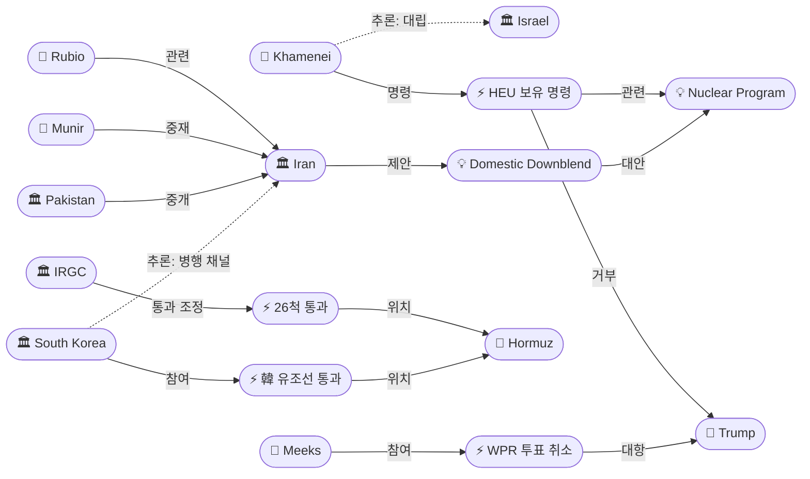
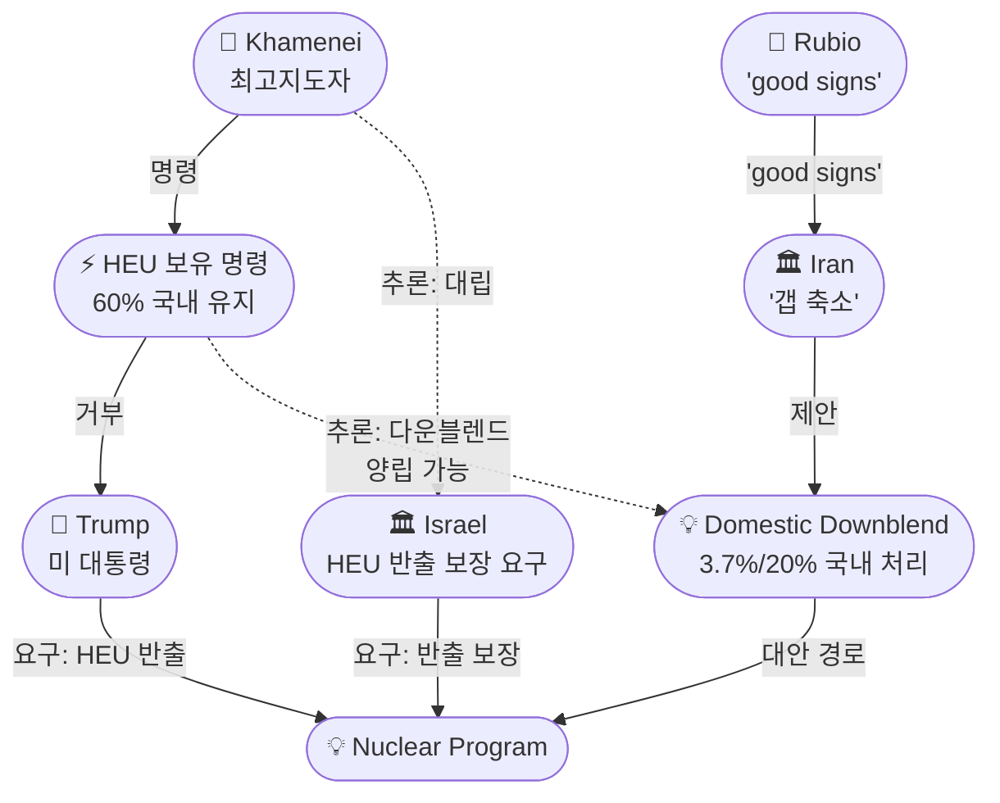
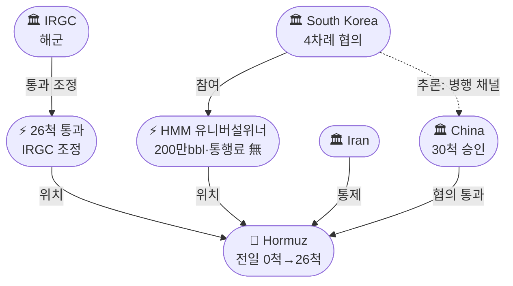

# 2026-05-22 2026 Iran War OSINT 일일 보고서

## 요약

Day 84. **낙관과 장애물이 동시에 강화되고 있다.** 루비오 국무장관이 **"some good signs"**을 언급하고 이란이 미국 제안서에 대해 **"갭이 축소됐다(narrowed the gaps)"**고 처음으로 긍정 평가한 같은 날, 모즈타바 하메네이 최고지도자가 **60% 고농축우라늄(HEU)의 국내 보유를 명령**하여 트럼프의 핵심 요구(HEU 반출)를 정면 거부했다. 호르무즈에서는 전일 통과 0척에서 IRGC가 **26척의 통과를 자신의 '허가와 조정' 하에 이뤄졌다**고 발표하며, 한국 유조선 HMM 유니버설위너호가 전쟁 이후 **첫 한국 선박으로 통과**했다(200만 배럴, 통행료 미지불). 미 의회에서는 하원 GOP가 WPR 투표를 **2일 연속 취소** — CNN은 **"통과가 두려워서(feared it would pass)"**라고 보도했다. 이란은 HEU를 **3.7%와 20%로 국내 다운블렌드**하겠다는 대안을 제시하며, 하메네이 명령 하에서 핵 역제안을 구체화하고 있다.

## 주요 뉴스

### 1. 하메네이, 고농축우라늄 국내 보유 명령 — 트럼프 핵심 요구 정면 거부
- **출처:** [Haaretz](https://www.haaretz.com/middle-east-news/iran/2026-05-21/ty-article/khamenei-says-enriched-uranium-must-stay-in-iran-senior-iranian-sources-say/0000019e-4a17-dab3-adfe-da77293b0000)
- **일시:** 2026-05-21
- **내용:** 이란 최고지도자 모즈타바 하메네이가 **60% 농축 우라늄 재고를 이란 영토 내에 엄격히 보유**하라는 명령을 내렸다. 이 지시는 평화 회담에서 미국의 핵심 요구 사항 중 하나인 HEU 반출을 정면으로 거부한 것이다. 이스라엘 관계자들은 로이터에 트럼프가 이스라엘에 **HEU가 이란 밖으로 나갈 것이라고 보장**했다고 밝혔다. 이란 고위층은 **핵 물질을 해외로 보내면 미래 미국·이스라엘 공격에 더 취약해진다**고 판단하고 있다. 유가는 이 소식에 **장중 3% 이상 급등**했다가 외교 낙관론에 2% 하락으로 반전됐다.
- **상태:** 신규
- **관련 엔티티:** Mojtaba Khamenei, Donald Trump, Israel, Nuclear Program

### 2. 하원 GOP, WPR 투표 2일 연속 취소 — "통과가 두려워서"
- **출처:** [CNN](https://www.cnn.com/2026/05/21/politics/house-trump-iran-war-powers)
- **일시:** 2026-05-21
- **내용:** 하원 공화당 지도부가 트럼프의 이란 전쟁 권한을 제한하는 결의안 투표를 **2일 연속 취소**했다. 공화당 의원들의 불참으로 인해 투표가 실시되면 **패배할 것이 확실**했기 때문이다. 이 결의안은 그레고리 믹스(D-NY) 하원 외교위 간사가 발의했으며, 공화당에서는 배럿·피츠패트릭·매시 3명이 이탈표를 던질 것으로 예상됐다. 투표는 **메모리얼 데이 휴회 후 6월 초로 연기**됐다. 블룸버그는 **"GOP 불참이 투표 연기를 강제했다(GOP Absences)"**고 보도했다. 이전 3차 투표에서 **212-212 동률**로 부결된 바 있어, 공화당 1표 추가 이탈만으로 통과가 가능한 상황이다.
- **상태:** 신규
- **관련 엔티티:** Gregory Meeks, Josh Gottheimer, Donald Trump

### 3. IRGC, 26척 호르무즈 통과 주장 + 한국 유조선 첫 통과
- **출처:** [Al Jazeera](https://www.aljazeera.com/news/2026/5/20/iran-says-it-coordinated-crossing-of-26-vessels-out-of-strait-of-hormuz)
- **일시:** 2026-05-20
- **내용:** IRGC 해군이 **24시간 동안 26척의 선박이 호르무즈를 통과**했다고 발표했다. 유조선, 컨테이너선, 기타 상선이 포함됐으며, 모든 통과는 **IRGC 해군의 '허가와 조정' 하에 이뤄졌다**고 강조했다. 특히 한국 HMM 소속 초대형 유조선 **유니버설위너호가 원유 200만 배럴을 적재하고 전쟁 이후 첫 한국 선박으로 통과**했다. 한국 외교부는 이란 측과 **4차례 협의**를 거쳐 통과가 이뤄졌으며, **통행료는 지불하지 않았다**고 밝혔다. 이는 전일 보도된 **연속 2일 통과 0척·1,600척 좌초** 상황에서 급반전한 것이다.
- **상태:** 신규
- **관련 엔티티:** IRGC, Strait of Hormuz, South Korea, Iran

### 4. 루비오 "some good signs" + 이란 "갭 축소" — 외교 이중 낙관
- **출처:** [Al Jazeera](https://www.aljazeera.com/news/liveblog/2026/5/21/iran-war-live-tehran-says-no-surrender-to-us-diplomacy-wiser-than-war), [Bloomberg](https://www.bloomberg.com/news/articles/2026-05-21/iran-reviewing-trump-s-latest-offer-as-clock-ticks-on-ceasefire)
- **일시:** 2026-05-21
- **내용:** 루비오 국무장관이 파이낸셜타임스 인터뷰에서 이란과의 평화 회담에 **"some good signs"**이 있다고 밝혔다. 다만 **"지나치게 낙관적이고 싶지 않다(don't want to be overly optimistic)"**며 **"앞으로 며칠을 지켜보자"**고 신중한 입장을 보였다. 같은 날 블룸버그는 이란 고위 소식통을 인용해 **미국의 최신 제안이 "양측 간 격차를 부분적으로 줄였다(partly bridged the gap)"**고 보도했다. 그러나 하메네이의 우라늄 명령과 호르무즈 통행료 분쟁이 **돌파구의 전망을 흐리게 했다(clouded the outlook)**.
- **상태:** 신규
- **관련 엔티티:** Marco Rubio, Iran, Donald Trump, Nuclear Program

### 5. 무니르, 테헤란 방문 — 파키스탄 중재 최대 강도
- **출처:** [Al Arabiya](https://english.alarabiya.net/News/middle-east/2026/05/21/pakistan-army-chief-to-visit-tehran-in-mediation-effort-between-us-and-iran)
- **일시:** 2026-05-21~22
- **내용:** 파키스탄 육군 참모총장 아심 무니르 원수가 **목요일 테헤란을 방문**하여 이란 당국과 "회담 및 협의"를 진행한다. 모흐신 나크비 내무장관도 **한 주 동안 이란을 두 번 방문**하여 외교적 관여가 급격히 강화됐다. 파키스탄은 미국과 이란 사이에서 **제안서, 응답, 외교 메시지를 전달**하는 유일한 중재 채널 역할을 하고 있다. 데일리파키스탄은 무니르의 방문이 **"거의 최종적인(near-final) 미-이란 초안 합의"** 보도와 맞물린다고 전했다.
- **상태:** 신규
- **관련 엔티티:** Asim Munir, Mohsin Naqvi, Pakistan, Iran

### 6. 이란, 국내 다운블렌드(3.7%/20%) 제안 — 하메네이 명령 하의 핵 역제안
- **출처:** [CryptoBriefing](https://cryptobriefing.com/iran-ready-to-downblend-uranium-amid-us-iran-nuclear-talks/)
- **일시:** 2026-05-21
- **내용:** 이란이 고농축우라늄을 **국내에서 3.7%와 20% 수준으로 다운블렌드**할 준비가 되어 있다고 밝혔다. 다운블렌드는 농축 우라늄에 열화 우라늄을 혼합하여 전체 농축도를 낮추는 과정이다. 이란은 **HEU를 해외로 보내는 것은 거부**하며, 이는 하메네이의 국내 보유 명령과 일치한다. 핵심적으로, 이란의 포지션은 **HEU를 '없애는' 것을 거부한 게 아니라 '반출'을 거부**한 것이다 — 국내 다운블렌드는 실질적으로 무기급 핵 물질을 제거하는 효과가 있어, 방법론적 타협의 가능성을 열어둔다.
- **상태:** 신규
- **관련 엔티티:** Iran, Nuclear Program, Mojtaba Khamenei

### 7. 유가: Brent $102.58(-2%), WTI $96.35(-2%) — 하메네이 역풍 후 외교 낙관으로 반전
- **출처:** [CNBC](https://www.cnbc.com/2026/05/21/oil-price-today-iran-war-strait-hormuz-trump.html)
- **일시:** 2026-05-21
- **내용:** 국제유가가 급격한 변동성을 보였다. 하메네이의 우라늄 국내 보유 명령이 알려지면서 **장중 3% 이상 급등**했으나, 루비오의 'good signs' 발언과 이란의 '갭 축소' 평가 등 외교 낙관론이 부각되면서 **종가 기준 2% 이상 하락**으로 마감했다. 브렌트유 $102.58, WTI $96.35로, 전일 $105에서 상당폭 하락했다. 블룸버그는 **"평화 협상 진전 신호가 S&P 500 반등을 이끌었다"**고 보도했다.
- **상태:** 업데이트 ← 2026-05-21 Brent $105
- **관련 엔티티:** Strait of Hormuz, Iran, Donald Trump

## 지식그래프

### 오늘의 주요 관계

1. **핵 협상 국면 전환:** 하메네이(ent-046) → HEU 보유 명령(ent-422) → 트럼프(ent-001)/이스라엘(ent-004) 핵심 요구 거부. 동시에 이란(ent-002) → 국내 다운블렌드(ent-425) 대안 제시 — '반출'이 아닌 '처리 방법'이 새 쟁점.
2. **호르무즈 통제 과시:** IRGC(ent-005) → 26척 통과(ent-424) → 호르무즈(ent-008). 한국(ent-420) → 첫 유조선 통과(ent-421). 0척→26척 급반전으로 IRGC의 '관리 체제' 실행력 과시.
3. **전쟁권한 전술적 교착:** 믹스(ent-419) → WPR 투표 취소(ent-423) → 트럼프(ent-001). GOP가 통과 공포로 2일 연속 취소 — 사실상 하원 과반을 인정.
4. **파키스탄 중재 최대 강도:** 무니르(ent-028) → 이란(ent-002) 테헤란 방문. 나크비(ent-092) 1주 2회 방문. 'near-final' 초안 보도와 맞물림.
5. **외교 이중 신호:** 루비오(ent-077) 'good signs' + 이란 '갭 축소' — 낙관 신호. vs. 하메네이 HEU 명령 + 호르무즈 통행료 — 장애물. 병행 구조.

### 전체 지식그래프 시각화

### 주제별 세부 그래프: 핵 협상의 새 구도

### 주제별 세부 그래프: 호르무즈 통제 변화

## 온톨로지 변경

| 변경 유형 | 대상 | 근거 |
|----------|------|------|
| 새 엔티티 | ent-419 Gregory Meeks (Person) | 하원 WPR 결의안 발의자, GOP 2일 연속 투표 취소 |
| 새 엔티티 | ent-420 South Korea (Organization) | 전쟁 이후 첫 유조선 호르무즈 통과, 통행료 미지불 |
| 새 엔티티 | ent-421 HMM Universal Winner Transit (Event) | 한국 HMM 유조선 200만bbl, 4차례 외교 협의 후 통과 |
| 새 엔티티 | ent-422 Khamenei HEU Retention Order (Event) | 최고지도자 60% HEU 국내 보유 명령, 핵 협상 국면 전환 |
| 새 엔티티 | ent-423 House GOP WPR Vote Cancellation (Event) | GOP 2일 연속 취소, 통과 공포, 6월 연기 |
| 새 엔티티 | ent-424 IRGC 26-Vessel Hormuz Transit (Event) | 24시간 26척 통과, IRGC 조정 주장 |
| 새 엔티티 | ent-425 Domestic Downblend Path (Concept) | 이란 HEU 3.7%/20% 국내 다운블렌드 대안 |
| 스키마 변경 | 없음 | 기존 클래스/관계로 표현 가능 |

## 추론 결과

| 추론 | 신뢰도 | 근거 |
|------|--------|------|
| Khamenei → Israel 대립 (공동 참여) | 0.78 | HEU 보유 명령이 이스라엘 반출 보장 요구도 거부 |
| South Korea ↔ China 병행 채널 (공동 참여) | 0.72 | 양국 모두 이란과 개별 호르무즈 협상 완료 — 선별적 허가 체제 확산 |
| Khamenei HEU 명령 ↔ Domestic Downblend 양립 가능 (사건 체인) | 0.70 | '반출' 거부와 '국내 처리'는 양립 가능 — 방법론적 타협 여지 |

## 분석 및 평가

**낙관과 장애물의 동시 강화 — 협상이 실질적 쟁점으로 좁혀지고 있다.** Day 84의 핵심은 미-이란 협상이 공허한 '딜 가능성'에서 구체적인 '방법론 논쟁'으로 진입했다는 것이다.

**첫째, 핵 협상의 진짜 쟁점이 드러났다.** 하메네이의 HEU 국내 보유 명령은 겉보기에는 협상 파탄 신호이지만, 면밀히 분석하면 **이란이 HEU 제거 자체를 거부한 것이 아니라 '반출 방법'을 거부**한 것이다. 이란은 동시에 3.7%와 20%로의 국내 다운블렌드를 제안했다 — 이는 실질적으로 무기급 핵 물질을 제거하는 효과가 있다. 문제는 트럼프가 이스라엘에 HEU 반출을 보장했다는 점이다. **이스라엘의 입장에서 이란 영토 내 다운블렌드는 검증 불가능한 약속**일 수 있고, 이것이 추론 #1(하메네이-이스라엘 대립, 0.78)의 근거다. 루비오의 'good signs'와 이란의 '갭 축소' 평가는 이 방법론적 격차가 양측 모두에게 좁혀질 수 있다는 신호로 읽을 수 있다.

**둘째, IRGC의 호르무즈 '관리 체제'가 실행력을 증명했다.** 전일 0척에서 26척으로의 급반전은 IRGC가 호르무즈를 '봉쇄'가 아닌 '선별적 허가'로 관리하고 있음을 과시한 것이다. 한국 유조선의 통과(통행료 미지불, 4차례 외교 협의)는 중국 외 제3국으로 확대되는 양자 채널 패턴을 보여준다. 추론 #2(한국-중국 병행 채널, 0.72)가 시사하듯, 이란은 국가별 개별 협상을 통해 호르무즈 통과를 외교적 레버리지로 활용하는 새로운 모델을 구축하고 있다. 다만 전쟁 전 일일 135척 대비 26척은 여전히 극소수이며, 1,600척 좌초 상황은 해소되지 않았다.

**셋째, 하원 전쟁권한이 사실상의 과반에 도달했다.** GOP가 2일 연속 투표를 취소한 것은 의회가 사실상 전쟁권한 결의안을 통과시킬 수 있음을 인정한 것이다. 6월 복귀 후 정치 환경은 변할 수 있지만, 상원 50-47 통과와 결합하여 트럼프에 대한 의회의 전쟁 제한 압력이 구조적으로 강화됐다. 메모리얼 데이 휴회가 오히려 협상 시간을 벌어줄 수 있다는 역설적 효과도 있다.

**종합:** 협상은 '할 것인가/말 것인가'에서 '어떻게 할 것인가'로 이동하고 있다. HEU 처리 방법(반출 vs 국내 다운블렌드), 호르무즈 관리 체제(봉쇄 해제 vs 선별적 허가), 전쟁권한(의회 제한 vs 대통령 권한)이 병행되면서, 다음 며칠이 이 세 축의 교차점을 결정할 것이다.

## 추적 항목

| 항목 | 최초 보고 | 상태 | 최신 업데이트 |
|------|----------|------|-------------|
| 이란 핵 협상 (농축 교착) | 2026-04-10 | **국면 전환** | 하메네이 HEU 보유 명령 + 국내 다운블렌드 제안 = '방법론' 쟁점 |
| 호르무즈 해협 통제/PGSA | 2026-04-07 | 선별적 허가 체제 | 0척→26척 반전, 한국 유조선 첫 통과, IRGC 조정 주장 |
| 이스라엘-레바논 휴전 | 2026-04-16 | 45일 연장 중 | 4차 회담 6/2-3, 군사 트랙 5/29, 657명 사망(휴전 후) |
| 슬레지해머/공습 최후통첩 | 2026-05-14 | 외교 모드 유지 | 루비오 'good signs', 이란 '갭 축소', 무니르 테헤란 |
| 유가 | 2026-04-07 | Brent $102.58 | $105→$102.58(-2%), 하메네이 역풍(+3%)→외교 낙관(-2%) |
| WPR 의회 전쟁권한 | 2026-04-30 | **사실상 과반** | 하원 GOP 2일 연속 취소, 6월 초 투표 예정, 통과 가능성 높음 |
| 이란 군사력 재건 | 2026-05-21 | 모니터링 | CSIS: 70% 미사일, 30/33 기지 — 신규 업데이트 없음 |
| 중러 에너지 동맹 | 2026-05-21 | 모니터링 | 파워오브시베리아2 합의 — 신규 업데이트 없음 |
| 파키스탄 중재 | 2026-04-07 | **최대 강도** | 무니르 테헤란 방문, 나크비 1주 2회, 'near-final' 초안 보도 |

## 동향 요약

| 분류 | 상태 | 비고 |
|------|------|------|
| 미-이란 전쟁 | 협상 모드 + 장애물 | 루비오 'good signs', 이란 '갭 축소' vs. 하메네이 HEU 명령 |
| 핵 협상 | **국면 전환** | 하메네이 반출 거부 + 국내 다운블렌드 대안 = '방법론' 쟁점화 |
| 호르무즈 | 선별적 허가 체제 | 0→26척, 한국 첫 통과, IRGC 관리 과시 |
| 프록시 전쟁 | 소강 | 금일 신규 프록시 공격 보도 없음 |
| 이스라엘-레바논 | 휴전 유지 | 45일 연장, 6/2-3 4차 회담 |
| 유가 | Brent $102.58 | -2%, 전쟁 전 대비 +47%, 변동성 극대 |
| 의회 | **사실상 과반** | 하원 GOP 2일 취소, 6월 투표, 상원 이미 통과 |
| 파키스탄 중재 | 최대 강도 | 무니르 테헤란, 나크비 1주 2회, 'near-final' |

## 출처 목록
1. [Mojtaba Khamenei Says Enriched Uranium Must Stay in Iran](https://www.haaretz.com/middle-east-news/iran/2026-05-21/ty-article/khamenei-says-enriched-uranium-must-stay-in-iran-senior-iranian-sources-say/0000019e-4a17-dab3-adfe-da77293b0000) - Haaretz, 2026-05-21
2. [GOP leaders abruptly cancel House vote on Iran war powers](https://www.cnn.com/2026/05/21/politics/house-trump-iran-war-powers) - CNN, 2026-05-21
3. [Iran claims it coordinated passage of 26 vessels out of Hormuz in 24 hours](https://www.aljazeera.com/news/2026/5/20/iran-says-it-coordinated-crossing-of-26-vessels-out-of-strait-of-hormuz) - Al Jazeera, 2026-05-20
4. [Iran war live: 'Some good signs' peace deal can be reached, says US' Rubio](https://www.aljazeera.com/news/liveblog/2026/5/21/iran-war-live-tehran-says-no-surrender-to-us-diplomacy-wiser-than-war) - Al Jazeera, 2026-05-21
5. [Iran Says the US's Latest Proposal Has 'Narrowed the Gaps'](https://www.bloomberg.com/news/articles/2026-05-21/iran-reviewing-trump-s-latest-offer-as-clock-ticks-on-ceasefire) - Bloomberg, 2026-05-21
6. [Pakistan army chief to visit Tehran in mediation effort](https://english.alarabiya.net/News/middle-east/2026/05/21/pakistan-army-chief-to-visit-tehran-in-mediation-effort-between-us-and-iran) - Al Arabiya, 2026-05-21
7. [Chinese and Korean VLCCs Clear Hormuz as Iran Claims to Increase Traffic](https://maritime-executive.com/article/chinese-and-korean-vlccs-clear-hormuz-as-iran-claims-to-increase-traffic) - Maritime Executive, 2026-05-20
8. [Iran ready to downblend uranium amid US-Iran nuclear talks](https://cryptobriefing.com/iran-ready-to-downblend-uranium-amid-us-iran-nuclear-talks/) - CryptoBriefing, 2026-05-21
9. [Oil prices fall as investors hope for U.S.-Iran deal](https://www.cnbc.com/2026/05/21/oil-price-today-iran-war-strait-hormuz-trump.html) - CNBC, 2026-05-21
10. [Iran War: Signs of Peace Deal Progress Lead Stocks Higher](https://www.bloomberg.com/news/newsletters/2026-05-21/iran-war-signs-of-peace-deal-progress-lead-stocks-higher) - Bloomberg, 2026-05-21
11. [US-Iran Peace Efforts Face Setbacks Over Uranium, Hormuz Tolls](https://www.bloomberg.com/news/articles/2026-05-21/progress-in-iran-talks-undercut-by-divide-over-uranium-tolls) - Bloomberg, 2026-05-21
12. [House Leaders Cancel Iran War Vote Amid GOP Absences](https://www.bloomberg.com/news/articles/2026-05-21/house-leaders-cancel-iran-war-vote-amid-gop-absences) - Bloomberg, 2026-05-21
13. ['They Were Afraid It Would Pass': House GOP Cancels Iran War Powers Vote](https://www.commondreams.org/news/house-war-powers-resolution) - Common Dreams, 2026-05-21
14. [26 ships traverse Strait of Hormuz in past day, IRGC says](https://www.washingtontimes.com/news/2026/may/20/26-ships-traverse-strait-hormuz-past-day-irgc-says/) - Washington Times, 2026-05-20
15. [IRGC Navy says more ships transiting Strait of Hormuz under its coordination](https://www.presstv.ir/Detail/2026/05/20/768974/Iran-IRGC-Navy-transit-Hormuz-Strait-increase) - Press TV, 2026-05-20
16. [Pak Army Chief Asim Munir may visit Iran soon amid 'near-final' draft agreement](https://en.dailypakistan.com.pk/20-May-2026/pak-army-chief-asim-munir-may-visit-iran-soon-amid-reports-of-near-final-us-iran-draft-agreement) - Daily Pakistan, 2026-05-20
17. [US-Iran peace talks: Pakistan Army chief Asim Munir to visit Tehran today](https://www.deccanherald.com/world/middle-east/us-iran-peace-talks-pakistan-army-chief-asim-munir-to-visit-tehran-today-4010988) - Deccan Herald, 2026-05-22
18. [Ayatollah Orders Highly-Enriched Uranium To Remain In Iran](https://cdm.press/news/middle-east/2026/05/21/ayatollah-orders-highly-enriched-uranium-to-remain-in-iran-stymying-trumps-basis-for-deal/) - CDM, 2026-05-21
19. [Supreme Leader says 'enriched uranium must stay in Iran'](https://www.geo.tv/latest/665470-supreme-leader-says-enriched-uranium-must-stay-in-iran-say-iranian-sources) - Geo.tv, 2026-05-21
20. [Iran supreme leader vows to keep enriched uranium in country](https://www.dailysabah.com/world/mid-east/iran-supreme-leader-vows-to-keep-enriched-uranium-in-country) - Daily Sabah, 2026-05-21
21. [이란 최고지도자, 고농축우라늄 반출 거부..협상 고비](https://www.fnnews.com/news/202605220148455442) - 파이낸셜뉴스, 2026-05-22
22. [협상 막바지라면서…최대쟁점 '이란 농축 우라늄 처리' 평행선](https://www.fnnews.com/news/202605220521131188) - 파이낸셜뉴스, 2026-05-22
23. [닫히지 않은 해협…韓 유조선은 왜 지금 통과할 수 있었나?](https://www.munhwa.com/article/11590583) - 문화일보, 2026-05-22
24. [Iran reviews US proposal to end war as Pakistan steps up mediation](https://www.aljazeera.com/news/2026/5/21/iran-reviews-us-proposal-to-end-war-as-pakistan-steps-up-mediation-efforts) - Al Jazeera, 2026-05-21
25. [Iran reviewing U.S. position on ending war; Trump willing to wait](https://www.cnbc.com/2026/05/21/iran-war-us-peace-talks-trump-hormuz.html) - CNBC, 2026-05-21
