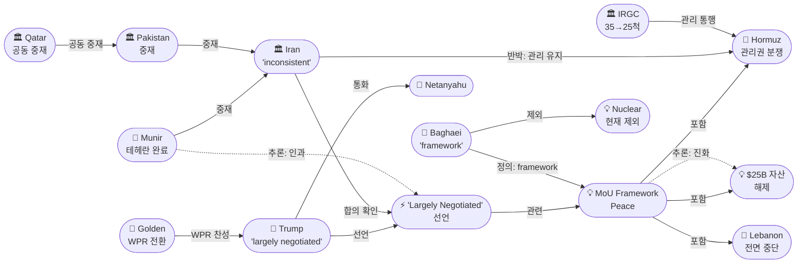
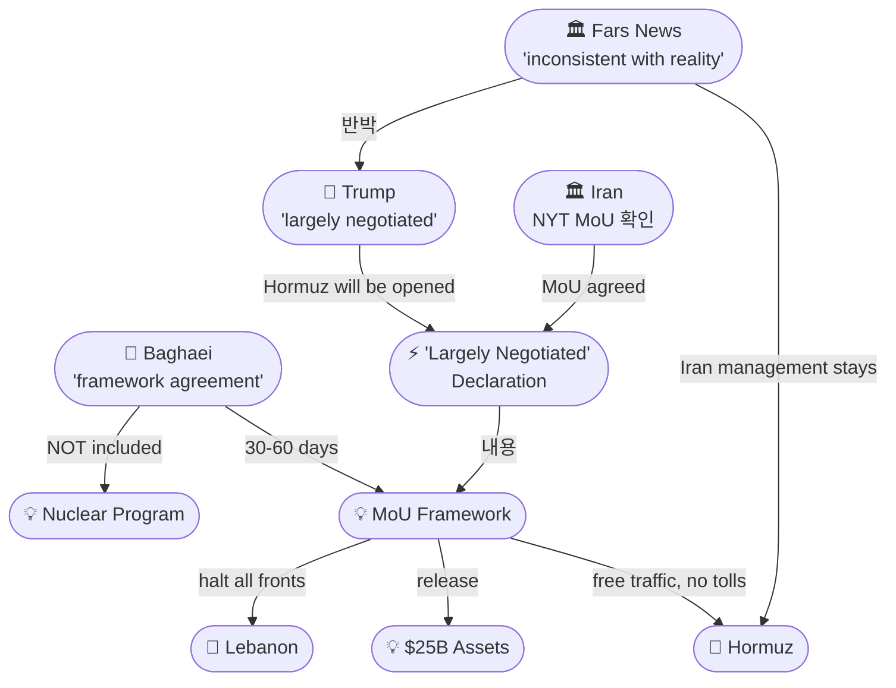
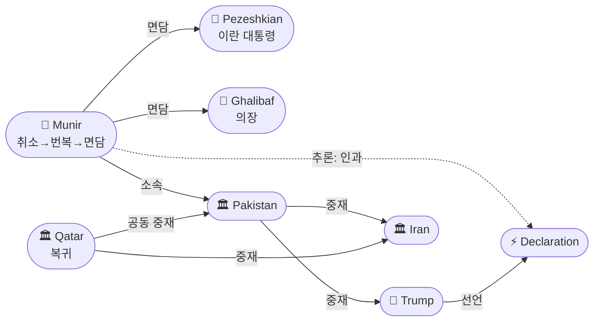

# 2026-05-23 2026 Iran War OSINT 일일 보고서

## 요약

Day 85. **트럼프가 전쟁 이후 가장 강한 평화 신호를 보냈다.** 트럼프 대통령이 사우디·UAE·카타르·파키스탄·터키·이집트·요르단·바레인 8개국 지도자, 그리고 별도로 네타냐후 이스라엘 총리와 통화한 뒤 **"합의가 거의 완료됐다(An Agreement has been largely negotiated)"**고 선언하며, **"평화에 관한 양해각서(Memorandum of Understanding pertaining to PEACE)"**의 최종 세부사항이 논의 중이고 곧 발표될 것이라고 밝혔다. 뉴욕타임스는 이란 고위관리 3명을 인용해 **전투 중단·호르무즈 재개방·250억 달러 동결자산 해제**를 포함하는 MoU에 이란이 합의했다고 보도했다. 그러나 트럼프는 같은 날 **"50/50"** — 합의를 하거나 **"blow them to kingdom come"**이라며 일요일까지 결정하겠다고 밝혔고, 이란 Fars 통신은 호르무즈가 **이란 관리 하에 유지**된다며 트럼프 발표를 **"현실과 불일치(inconsistent with reality)"**라고 반박했다. 이란 외교부 대변인 바가에이는 초안을 **"프레임워크 합의"**로 정의하며 30~60일간 세부 협상이 필요하고, **핵 문제는 현재 협상에 포함되지 않는다**고 밝혔다.

## 주요 뉴스

### 1. 트럼프: "합의가 거의 완료됐다" — 9개국 통화 후 MoU 선언
- **출처:** [NPR](https://www.npr.org/2026/05/23/g-s1-124145/trump-iran-deal-strait-of-hormuz)
- **일시:** 2026-05-23
- **내용:** 트럼프 대통령이 소셜미디어에 **"An Agreement has been largely negotiated, subject to finalization between the United States of America, the Islamic Republic of Iran, and the various other Countries"**라고 게시했다. 사우디·UAE·카타르·파키스탄·터키·이집트·요르단·바레인 8개국 지도자와 통화했으며, 네타냐후와도 별도 통화하여 **"마찬가지로 잘 됐다(likewise, went very well)"**고 밝혔다. **"호르무즈 해협이 개방될 것(the Strait of Hormuz will be opened)"**이라고 명시하며, 최종 세부사항이 **"곧 발표될 것(announced shortly)"**이라고 했다. 이는 전쟁 개전 85일 만에 나온 **최강 수준의 평화 신호**다.
- **상태:** 신규
- **관련 엔티티:** Donald Trump, Iran, Strait of Hormuz, Benjamin Netanyahu

### 2. 트럼프: "50/50" — 합의 아니면 폭격, 일요일 결정
- **출처:** [Axios](https://www.axios.com/2026/05/23/trump-iran-deal-resume-war-interview)
- **일시:** 2026-05-23
- **내용:** 트럼프가 언론에 **"solid 50/50"** — 좋은 합의를 하거나 아니면 **"blow them to kingdom come"**이라고 밝혔다. 일요일에 특사들을 만나 결정할 예정이다. 지역 지도자 통화에 브리핑된 소식통 2명에 따르면, **지도자들이 트럼프에게 합의를 받아들이라고 촉구**했다. 그러나 일부 지역 지도자들은 이란 정권을 약화시키기 위해 공격을 재개하라고 권고했고, 다른 지도자들과 고위 참모들은 현재의 합의를 수용하라고 조언했다.
- **상태:** 신규
- **관련 엔티티:** Donald Trump

### 3. NYT: 이란, MoU 합의 — $250억 동결자산 해제, 레바논 포함 전면 중단
- **출처:** [Fortune / NYT](https://fortune.com/2026/05/23/iran-war-us-agreement-memorandum-of-understanding-strait-hormuz-nuclear-weapons/)
- **일시:** 2026-05-23
- **내용:** 이란 고위관리 3명이 뉴욕타임스에 **"전투를 중단하고 호르무즈 해협을 재개방하는 양해각서에 합의했다"**고 밝혔다. 합의 조건은 **(1) 레바논을 포함한 전 전선 전투 중단**, **(2) 미 해군 봉쇄 해제 및 이란 통행료 없는 자유 상업 항행**, **(3) 해외 동결 이란 자산 250억 달러 해제**를 포함한다. 이는 4월의 $200억 현금-우라늄 프레임워크에서 $250억으로 확대되고, 핵 문제를 분리하여 종전·호르무즈·자산·제재로 범위를 넓힌 것이다.
- **상태:** 신규
- **관련 엔티티:** Iran, Strait of Hormuz, Lebanon

### 4. 이란 Fars: "호르무즈는 이란 관리 유지, 트럼프 발표는 현실과 불일치"
- **출처:** [Times of Israel / Fars](https://www.timesofisrael.com/liveblog-may-23-2026/)
- **일시:** 2026-05-23
- **내용:** 이란 Fars 통신은 미국과 이란 사이에 교환된 최신 문서에 따르면 **호르무즈 해협은 이란의 관리 하에 유지**된다고 보도했다. 트럼프의 "largely negotiated" 발표를 **"불완전하고 현실과 불일치(incomplete and inconsistent with reality)"**하다고 일축했다. 이는 '개방'의 정의를 둘러싼 핵심 분쟁을 드러낸다 — 미국은 '자유 항행'을, 이란은 '이란 관리 하 항행'을 의미한다.
- **상태:** 신규
- **관련 엔티티:** Iran, Strait of Hormuz, Donald Trump

### 5. 바가에이: "프레임워크 합의" — 30~60일, 핵 제외, 제재 해제 명문화
- **출처:** [Press TV](https://www.presstv.ir/Detail/2026/05/23/769157/Iran-US-Baghaei-understanding-nuclear)
- **일시:** 2026-05-23
- **내용:** 이란 외교부 대변인 에스마일 바가에이가 초안을 **"프레임워크 합의(framework agreement)"**로 정의했다. 세부 사항은 **30~60일에 걸쳐 논의**될 예정이다. **"지난 한 주 동안의 추세는 차이를 좁히는 방향이었다(the trend has been toward narrowing differences)"**고 밝혔으나, **"합의 지점이 아닌, 해결이 가능한 지점(not to the point of an agreement, rather to the point where a solution may be possible)"**이라고 선을 그었다. 핵심적으로, **핵 문제는 현재 협상에 포함되지 않으며**, 제재 해제가 **"문서에 명시적으로 포함(explicitly included in the text)"**되어 있다고 강조했다.
- **상태:** 신규
- **관련 엔티티:** Esmail Baghaei, Iran, Nuclear Program

### 6. 카타르 중재 복귀 + 무니르 테헤란 방문 완료 — 이중 중재 가동
- **출처:** [Jerusalem Post](https://www.jpost.com/middle-east/iran-news/article-897019), [Arab News](https://www.arabnews.com/node/2644675/pakistan)
- **일시:** 2026-05-22~23
- **내용:** 카타르 협상팀이 **미국과 조율 하에 테헤란에 도착**하여 파키스탄+카타르 공동 중재 체제가 가동됐다. 동시에 파키스탄 무니르 원수가 초기 **방문 취소 후 번복**하여 금요일 테헤란에 도착, 페제시키안 대통령·갈리바프 의장과 각각 면담한 뒤 토요일 출국했다. 파키스탄 측은 **"최종 양해를 향한 고무적 진전(encouraging progress toward a final understanding)"**이 있었다고 밝혔다. 트럼프의 'largely negotiated' 선언은 무니르 출국과 같은 날 나와 인과관계가 추론된다.
- **상태:** 신규 (카타르), 업데이트 ← "무니르 방문 취소" (번복)
- **관련 엔티티:** Qatar, Asim Munir, Pakistan, Iran, Masoud Pezeshkian, Mohammad Bagher Ghalibaf

### 7. IRGC 35→25척 호르무즈 관리 통행 — '관리 체제' 지속
- **출처:** [Press TV](https://www.presstv.ir/Detail/2026/05/22/769076/IRGC-Navy-coordinates-passage-of-35-ships-through-Strait-of-Hormuz), [Press TV](https://www.presstv.ir/Detail/2026/05/23/769137/IRGC-coordinates-safe-passage-25-ships-Hormuz)
- **일시:** 2026-05-22~23
- **내용:** IRGC 해군이 5월 22일 **35척**, 5월 23일 **25척**의 상선이 호르무즈를 통과했다고 발표했다. 모든 선박은 IRGC의 "허가와 조정" 하에 통행했다. 3일 연속 25척 이상 유지로 IRGC의 '관리 통행(managed transit)' 체계가 사실상 정착했다. 그러나 전쟁 전 일일 135척 대비 극소수이며, MoU에서 '자유 항행'과 '이란 관리 항행' 간 정의가 핵심 쟁점이다.
- **상태:** 신규
- **관련 엔티티:** IRGC, Strait of Hormuz

### 8. 하원 WPR: 골든 찬성 전환, 6월 2일 투표 — 하원 통과 가능성 급상승
- **출처:** [NPR](https://www.npr.org/2026/05/22/g-s1-123592/republicans-call-off-vote-on-iran-war-resolution), [Rep. Golden](https://golden.house.gov/media/press-releases/golden-announces-support-for-clean-resolution-to-constrain-military-action-in-iran)
- **일시:** 2026-05-22
- **내용:** 하원 공화당이 이란 전쟁권한 결의안 투표를 2일 연속 취소한 후, 메모리얼데이 휴회 후 **6월 2일 투표가 확정**됐다. 핵심 변수인 **자레드 골든(D-ME)**이 이전까지 민주당 내 유일한 반대표에서 **찬성으로 전환**을 발표했다. 골든은 **"전쟁권한법의 60일 기한이 지나 대통령의 단독 군사 관여 창구가 닫혔다"**고 밝혔다. 공화당 피츠패트릭·매시·배럿 등 기존 찬성표 유지 예상과 합쳐 **하원 통과 가능성이 상당히 높아졌다**.
- **상태:** 업데이트 ← 2026-05-22 "하원 GOP WPR 투표 취소"
- **관련 엔티티:** Jared Golden, Donald Trump

### 9. 유가: Brent ~$103, 주간 -6% — 합의 낙관에 하락
- **출처:** [CNBC](https://www.cnbc.com/2026/05/22/oil-prices-today-trump-iran-strait-of-hormuz-uranium-.html)
- **일시:** 2026-05-22~23
- **내용:** 브렌트유가 약 $103에 거래되며 **주간 기준 6% 이상 하락**했다. 미-이란 평화 협상 진전 신호와 트럼프의 'largely negotiated' 발표가 하방 압력을 제공했다. 그러나 장중 $106까지 상승 후 반전되는 등 **변동성은 극대**를 유지했다. 호르무즈 완전 개방 시 유가의 추가 하방이 예상되나, 합의 실패 시 급등 리스크도 동시에 존재한다.
- **상태:** 업데이트 ← 2026-05-22 Brent $104.52
- **관련 엔티티:** Strait of Hormuz, Iran

## 지식그래프

### 오늘의 주요 관계

1. **MoU 프레임워크:** 트럼프(ent-001) → 'largely negotiated' 선언(ent-427) → MoU 프레임워크(ent-428). 이란(ent-002) → NYT MoU 확인 → 호르무즈(ent-008) + $25B 자산(ent-429) + 레바논(ent-050). **그러나** Fars → '현실 불일치' 반박 — 동일 합의에 대한 양측의 해석이 근본적으로 충돌.
2. **이중 중재:** 카타르(ent-336) + 파키스탄(ent-029) → 공동 중재. 무니르(ent-028) → 테헤란 면담 → '고무적 진전' → 트럼프 선언 (추론: 인과관계).
3. **핵 분리:** 바가에이(ent-066) → '핵 제외' 선언 → 핵(ent-025) → MoU에서 별도 트랙으로 분리. 이란 전략: 종전 먼저, 핵은 30-60일 후.
4. **의회 압력:** 골든(ent-426) → WPR 찬성 전환 → 트럼프(ent-001) 전쟁 권한 제한. 6/2 투표가 '합의 아니면 폭격' 타임라인과 교차.

### 전체 지식그래프 시각화

### 주제별 세부 그래프: MoU 합의와 해석 충돌

### 주제별 세부 그래프: 중재 네트워크

## 온톨로지 변경

| 변경 유형 | 대상 | 근거 |
|----------|------|------|
| 새 엔티티 | ent-427 Trump 'Largely Negotiated' Declaration (Event) | 전쟁 이후 최대 외교 선언, 9개국+이스라엘 통화 후 MoU 발표 |
| 새 엔티티 | ent-428 MoU Framework Peace (Concept) | 종전·호르무즈·자산·제재·레바논 포괄 프레임워크 |
| 새 엔티티 | ent-429 $25B Frozen Assets Release (Concept) | NYT 확인 $250억 동결자산 해제, $20B에서 확대 |
| 새 엔티티 | ent-430 Masoud Pezeshkian (Person) | 이란 대통령, 무니르와 면담 |
| 기존 업데이트 | ent-426 Jared Golden | WPR 찬성 전환 발표 |
| 기존 업데이트 | ent-001 Trump | 'largely negotiated' + '50/50' + 9개국 통화 |
| 기존 업데이트 | ent-002 Iran | Fars 반박 + Baghaei 프레임워크 + NYT MoU 확인 |
| 기존 업데이트 | ent-028 Munir | 취소 번복→테헤란 면담→'고무적 진전' |
| 기존 업데이트 | ent-336 Qatar | 공동 중재자 복귀 |
| 기존 업데이트 | ent-066 Baghaei | 프레임워크 30-60일, 핵 제외 |
| 스키마 변경 | 없음 | 기존 클래스/관계로 표현 가능 |

## 추론 결과

| 추론 | 신뢰도 | 근거 |
|------|--------|------|
| Qatar → Trump 잠재적 관계 (공동 참여) | 0.78 | 카타르 공동 중재 + 트럼프 9개국 통화에 포함 |
| MoU Framework → $20B 프레임워크 진화 (사건 체인) | 0.80 | $20B 현금-우라늄(4/18) → $25B MoU(5/23)로 확대 |
| Trump 선언 ← Munir 테헤란 인과 (사건 체인) | 0.72 | 무니르 '고무적 진전' 보고 → 같은 날 트럼프 선언 (잠정) |

## 분석 및 평가

**Day 85는 전쟁 개전 이후 가장 극적인 외교적 전환점이다.** 그러나 '합의 직전'과 '현실 불일치'가 동시에 나온 이 상황은 합의의 구조적 취약성을 정확히 드러낸다.

**첫째, '합의'의 정의가 양측에서 근본적으로 다르다.** 트럼프는 "Hormuz will be opened"이라고 했고, Fars는 "Hormuz will stay under Iran's management"라고 했다. 이 두 문장은 동일한 합의문에 대한 해석이다. NYT가 확인한 조건(미 봉쇄 해제, 자유 항행, 통행료 없음)을 이란이 수용했다면, '이란 관리'의 의미는 주권적 상징에 불과할 수 있다. 그러나 IRGC가 35척의 '허가와 조정' 체계를 운영하는 현실에서 이 상징은 실질적 통제권의 문제로 전화할 수 있다.

**둘째, 핵 문제의 분리는 전략적 유예다.** 바가에이가 "핵은 현재 협상에 포함되지 않는다"고 명시한 것은 이란의 핵심 전략이다 — 전쟁 종료와 제재 해제를 먼저 확보한 후 핵 문제에서 유리한 위치를 점하겠다는 것이다. 트럼프가 네타냐후에게 HEU 반출을 보장했다는 전일 보도(Haaretz)와 정면 충돌하며, 이스라엘의 반응이 다음 변수다. $25B($20B에서 확대)와 핵 분리의 조합은 공화당 내에서 '이란에 퍼주기' 비판을 촉발할 수 있다.

**셋째, "50/50"는 협상 전술이자 실체적 분기점이다.** 트럼프가 일요일까지 결정하겠다고 한 것은 이란에 대한 최종 압박이자, 동시에 자신의 참모 내 분열(합의파 vs 공격파)을 반영한다. 지역 지도자들이 합의를 촉구했다는 점은 걸프 국가들이 전쟁 장기화보다 불완전한 합의를 선호함을 보여준다. 의회에서는 6/2 WPR 투표가 다가오며, 골든의 찬성 전환으로 하원 통과 가능성이 높아져 트럼프의 전쟁 지속 옵션이 좁아지고 있다.

**종합:** "largely negotiated"와 "inconsistent with reality"가 동시에 존재하는 이 국면은, 합의가 서명 직전이 아니라 **해석의 간극을 메우는 마지막 단계**에 있음을 시사한다. 일요일이 분기점이다.

## 추적 항목

| 항목 | 최초 보고 | 상태 | 최신 업데이트 |
|------|----------|------|-------------|
| 미-이란 평화 협상 | 2026-04-10 | **'largely negotiated'** | 트럼프 MoU 선언, NYT $25B 확인, 바가에이 프레임워크, 일요일 결정 |
| 호르무즈 해협 통제 | 2026-04-07 | **해석 충돌** | MoU에 '개방' 포함 but Fars '이란 관리 유지', IRGC 35→25척 |
| 핵 협상 | 2026-04-10 | **분리/유예** | 바가에이 '핵 제외', 30-60일 후 별도 트랙 |
| 이스라엘-레바논 휴전 | 2026-04-16 | 45일 연장 중 | MoU에 '레바논 포함 전면 중단' 명시 |
| 유가 | 2026-04-07 | Brent ~$103 | 주간 -6%, 합의 시 추가 하방 vs 실패 시 급등 |
| WPR 의회 전쟁권한 | 2026-04-30 | **하원 통과 임박** | 골든 찬성 전환, 6/2 투표 확정 |
| 파키스탄/카타르 중재 | 2026-04-07 | **이중 중재 가동** | 무니르 테헤란 완료 + 카타르 복귀 |
| 슬레지해머/공습 위협 | 2026-05-14 | '50/50' | 트럼프 일요일 결정, '합의 아니면 폭격' |

## 동향 요약

| 분류 | 상태 | 비고 |
|------|------|------|
| 미-이란 전쟁 | **'largely negotiated'** | 전쟁 이후 최강 평화 신호 + '50/50' 이분법 |
| 핵 협상 | 분리/유예 | 바가에이: 현재 협상 제외, 30-60일 후 |
| 호르무즈 | 해석 충돌 | MoU '개방' vs Fars '이란 관리' |
| 프록시 전쟁 | 소강 | MoU에 레바논 포함 전면 중단 |
| 이스라엘-레바논 | 45일 연장 중 | MoU 이행 시 포괄적 해결 |
| 유가 | Brent ~$103 | 주간 -6%, 변동성 극대 |
| 의회 | 하원 통과 임박 | 골든 전환, 6/2 투표, 상원 이미 통과 |
| 중재 | 이중 중재 가동 | 파키스탄(무니르) + 카타르 공동 |

## 출처 목록
1. [Trump says deal with Iran 'largely negotiated'](https://www.npr.org/2026/05/23/g-s1-124145/trump-iran-deal-strait-of-hormuz) - NPR, 2026-05-23
2. [Trump says he's '50/50' on Iran deal or bombs](https://www.axios.com/2026/05/23/trump-iran-deal-resume-war-interview) - Axios, 2026-05-23
3. [Iran and US near agreement on MOU, $25B frozen assets](https://fortune.com/2026/05/23/iran-war-us-agreement-memorandum-of-understanding-strait-hormuz-nuclear-weapons/) - Fortune / NYT, 2026-05-23
4. [Fars: Hormuz stays under Iran management, Trump 'inconsistent'](https://www.timesofisrael.com/liveblog-may-23-2026/) - Times of Israel / Fars, 2026-05-23
5. [Baghaei: framework agreement, 30-60 days](https://www.presstv.ir/Detail/2026/05/23/769157/Iran-US-Baghaei-understanding-nuclear) - Press TV, 2026-05-23
6. [Qatari negotiating team in Tehran](https://www.jpost.com/middle-east/iran-news/article-897019) - Jerusalem Post, 2026-05-22
7. [Munir left Tehran after meeting Pezeshkian, Ghalibaf](https://www.arabnews.com/node/2644675/pakistan) - Arab News, 2026-05-23
8. [IRGC 35 ships Hormuz May 22](https://www.presstv.ir/Detail/2026/05/22/769076/IRGC-Navy-coordinates-passage-of-35-ships-through-Strait-of-Hormuz) - Press TV, 2026-05-22
9. [IRGC 25 ships Hormuz May 23](https://www.presstv.ir/Detail/2026/05/23/769137/IRGC-coordinates-safe-passage-25-ships-Hormuz) - Press TV, 2026-05-23
10. [Republicans call off vote on Iran war resolution](https://www.npr.org/2026/05/22/g-s1-123592/republicans-call-off-vote-on-iran-war-resolution) - NPR, 2026-05-22
11. [Golden announces WPR support](https://golden.house.gov/media/press-releases/golden-announces-support-for-clean-resolution-to-constrain-military-action-in-iran) - Rep. Golden, 2026-05-22
12. [Oil prices post weekly loss on deal hopes](https://www.cnbc.com/2026/05/22/oil-prices-today-trump-iran-strait-of-hormuz-uranium-.html) - CNBC, 2026-05-22
13. [Trump Says He'll Announce Deal With Iran Shortly](https://www.bloomberg.com/news/articles/2026-05-23/trump-says-he-ll-announce-negotiated-deal-with-iran-shortly) - Bloomberg, 2026-05-23
14. [Trump 'largely negotiated': CBS live updates](https://www.cbsnews.com/live-updates/iran-war-trump-us-peace-talks-strait-of-hormuz-control/) - CBS News, 2026-05-23
15. [Trump agreement 'largely negotiated': Al Jazeera](https://www.aljazeera.com/news/2026/5/23/trump-says-iran-agreement-largely-negotiated-still-awaiting-finalisation) - Al Jazeera, 2026-05-23
16. [Trump deal 'largely negotiated': CNBC](https://www.cnbc.com/2026/05/23/us-iran-war-talks.html) - CNBC, 2026-05-23
17. [Trump Iran deal 'largely negotiated' after 84-day war](https://www.foxnews.com/politics/trump-says-iran-deal-largely-negotiated-84-day-war-nears-possible-end) - Fox News, 2026-05-23
18. [Agreement on Iran war 'largely negotiated': NBC](https://www.nbcnews.com/politics/politics-news/us-iran-officials-signal-progress-negotiations-fragile-ceasefire-war-rcna346636) - NBC News, 2026-05-23
19. [Iran deal 'largely negotiated': PBS](https://www.pbs.org/newshour/world/trump-says-deal-with-iran-including-opening-strait-of-hormuz-is-largely-negotiated) - PBS, 2026-05-23
20. [Trump ally warns on Hormuz perception](https://fortune.com/2026/05/23/us-iran-deal-reopen-hormuz-strait-persian-gulf-balance-of-power-trump/) - Fortune, 2026-05-23
21. [Iran and US close to deal: ABC News](https://abcnews.com/International/wireStory/iran-us-close-understanding-aimed-ending-war-officials-133250509) - ABC News, 2026-05-23
22. [Deal 'largely negotiated': CBC](https://www.cbc.ca/news/world/strait-hormuz-iran-trump-deal-9.7210138) - CBC, 2026-05-23
23. [트럼프 '종전 협정 최종 사안 논의 중‥조만간 발표'](https://imnews.imbc.com/replay/2026/nwtoday/article/6824845_37012.html) - MBC, 2026-05-23
24. [美 공습 재개설 속…이란 협상대표 '전쟁 재개시 더 참혹' 경고](https://www.fnnews.com/news/202605232129044783) - 파이낸셜뉴스, 2026-05-23
25. [사우디 매체 '최종 합의 초안이 수시간 내 공개될 수도'](https://www.munhwa.com/article/11590869) - 문화일보, 2026-05-23
