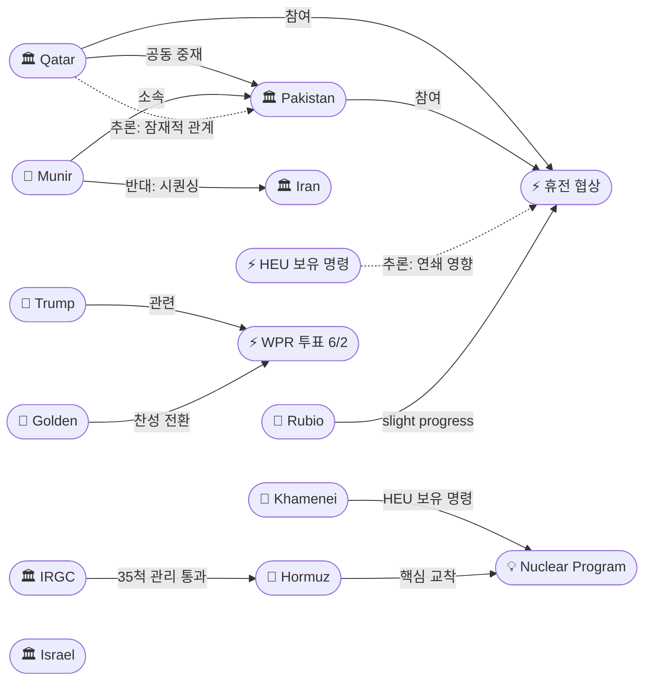
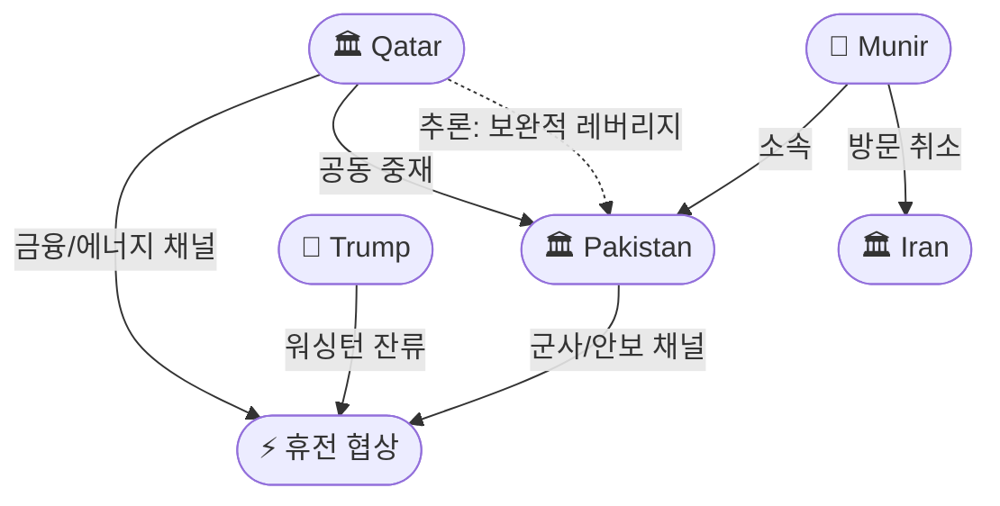

# 2026-05-23 2026 Iran War OSINT 일일 보고서

## 요약

Day 85. **중재 구조가 바뀌고 있다.** 카타르 협상팀이 **미국과 조율 하에 테헤란에 도착**하여 파키스탄 단독 중재에서 **파키스탄+카타르 공동 중재** 체제로 전환됐다. 카타르는 이란의 LNG 인프라 공격 이후 중재에서 후퇴했으나, 호르무즈 통행 이해관계로 복귀했다. 동시에 핵심 중재자 무니르 원수가 **테헤란 방문을 취소** — 미국의 **'핵 우선 마무리'**와 이란의 **'30일 신뢰구축 우선'** 간 시퀀싱 교착이 원인이다. 호르무즈에서는 IRGC가 **35척 통과**를 발표하며 3일 연속 증가세(26→31→35)를 보였고, '관리 통행' 체계의 정착을 과시했다. 하원 WPR 투표는 **6월 2일로 확정** — 민주당 골든(D-ME)의 찬성 전환 예고로 통과 가능성이 높아졌다.

## 주요 뉴스

### 1. 카타르 중재 복귀 — 테헤란에 협상팀 도착, 미국과 조율
- **출처:** [Jerusalem Post](https://www.jpost.com/middle-east/iran-news/article-897019)
- **일시:** 2026-05-22
- **내용:** 카타르 협상팀이 미국과의 조율 하에 **테헤란에 도착**하여 미-이란 전쟁 종전 합의를 위한 중재에 나섰다. 카타르는 이란의 LNG 인프라 공격(Operation Sadeq 4 등)으로 중재에서 후퇴한 바 있으나, 호르무즈 통행 안정화에 대한 직접적 이해관계와 미국과의 관계를 바탕으로 복귀했다. 미해결 쟁점(핵 농축·호르무즈·제재 해제)의 해소를 위해 양측을 설득하는 임무를 수행 중이다. 타임스오브이스라엘은 **트럼프가 아들 결혼식을 건너뛰고 워싱턴에 잔류**한다고 보도하며, 협상 집중도의 상징으로 해석했다.
- **상태:** 신규
- **관련 엔티티:** Qatar, Iran, Donald Trump, Pakistan

### 2. IRGC, 35척 호르무즈 통과 발표 — 3일 연속 증가, '관리 통행' 체계 정착
- **출처:** [Press TV](https://www.presstv.ir/Detail/2026/05/22/769076/IRGC-Navy-coordinates-passage-of-35-ships-through-Strait-of-Hormuz)
- **일시:** 2026-05-22
- **내용:** IRGC 해군이 24시간 동안 **유조선·컨테이너선 등 35척이 호르무즈를 통과**했다고 발표했다. 모든 선박은 IRGC의 **"허가와 조정(permission and coordination)"** 하에 통항했으며, 전일 31척, 그 전날 26척에 이어 **3일 연속 30척 이상**을 기록했다. IRGC는 선박 소유자에게 화물 가치·선적·기국·승무원 국적 등의 정보 공개를 요구하고 있다. 이는 IRGC의 '관리 통행(managed transit)' 체계가 실험 단계를 넘어 **사실상의 통제 체제로 정착**하고 있음을 시사하며, 국제 해운사들이 이 체계를 사실상 수용하는 양상이다.
- **상태:** 신규
- **관련 엔티티:** IRGC, Strait of Hormuz, Iran

### 3. 무니르 테헤란 방문 취소 — '핵 우선' vs '신뢰구축 우선' 시퀀싱 교착
- **출처:** [The Week](https://www.theweek.in/news/middle-east/2026/05/22/why-did-pakistan-army-chief-asim-munir-call-off-his-iran-trip-despite-marco-rubios-good-signs-remark.html)
- **일시:** 2026-05-22
- **내용:** 파키스탄 육군 참모총장 아심 무니르 원수가 **계획된 테헤란 방문을 취소**했다. 무니르는 **"최종 공식(final formula)이 도출될 때만"** 방문하겠다는 입장이다. 취소의 배경에는 핵심 쟁점의 **시퀀싱 교착**이 있다 — 미국은 핵 문제를 **먼저 협상하고 마무리**해야 한다는 입장이고, 이란은 전쟁 종료·봉쇄 해제 등 **30일간의 상호 신뢰구축 조치를 먼저 이행**한 후 핵을 논하자는 입장이다. 호르무즈 통행료 문제에서도 미국은 이란의 통행료 징수를 수용하지 않고 있다. 무니르는 방문은 취소했지만 **서면 메시지 교환의 감독은 계속**하고 있다.
- **상태:** 신규
- **관련 엔티티:** Asim Munir, Pakistan, Iran, Marco Rubio

### 4. Bloomberg 분석: 호르무즈와 핵 농축이 핵심 교착 지점
- **출처:** [Bloomberg](https://www.bloomberg.com/news/articles/2026-05-22/iran-us-peace-deal-why-hormuz-and-nuclear-enrichment-are-key-sticking-points)
- **일시:** 2026-05-22
- **내용:** 블룸버그가 미-이란 평화 협상의 2대 핵심 교착 지점을 분석했다. **호르무즈 해협 통제권**과 **핵 농축 프로그램**이 상호 연계된 쟁점으로, 이란은 미국의 최신 제안서가 **"격차를 부분적으로 줄였다(partly bridged the gap)"**고 평가하면서도 **상당한 차이가 남아 있다**고 강조했다. 미국과 이란은 4월 휴전 이후 교착 상태에 있으며, 수천 명의 사망과 글로벌 에너지 위기 속에 합의에 이르지 못하고 있다.
- **상태:** 신규
- **관련 엔티티:** Iran, Donald Trump, Strait of Hormuz, Nuclear Program

### 5. 하원 WPR 투표 6월 2일 확정 — 민주당 골든 찬성 전환 예고
- **출처:** [NPR](https://www.npr.org/2026/05/22/g-s1-123592/republicans-call-off-vote-on-iran-war-resolution)
- **일시:** 2026-05-22
- **내용:** 하원 공화당 지도부가 이란 전쟁권한 결의안 투표를 2일 연속 취소한 후, **메모리얼데이 휴회 후 6월 2일에 투표가 확정**됐다. 민주당 믹스(D-NY)의 결의안 제출로 시작된 입법 시계(legislative clock)가 6/2에 만료되어 투표가 불가피하다. 핵심 변수는 **자레드 골든(D-ME)**으로, 그는 이전까지 민주당 내 유일하게 WPR에 반대표를 던졌으나 **이번에는 찬성으로 전환할 계획**이다. 공화당에서도 피츠패트릭·매시·데이비드슨·배럿 4명이 기존 찬성표를 유지할 것으로 예상되어, **하원 통과 가능성이 상당히 높아졌다.**
- **상태:** 업데이트 ← 2026-05-22 "하원 GOP WPR 투표 취소"
- **관련 엔티티:** Donald Trump, Jared Golden, Gregory Meeks

### 6. Al Jazeera 분석: 이란 농축 우라늄, 안전하게 이전 가능한가?
- **출처:** [Al Jazeera](https://www.aljazeera.com/news/2026/5/22/irans-enriched-uranium-stockpile-can-it-be-safely-transferred)
- **일시:** 2026-05-22
- **내용:** 하메네이의 **HEU 국내 보유 명령** 이후 가능한 핵 경로를 분석했다. 옵션으로는 **(1) 해외 반출**, **(2) 국내 다운블렌드(3.7%/20%로 희석)**, **(3) 제3국 위탁**이 있으며, 이란은 현재 옵션 (2)만 수용 가능하다는 입장이다. 이란 고위층은 **핵 물질의 해외 반출이 미래 미국·이스라엘 공격에 대한 취약성을 높인다**고 판단하고 있다. 2월 26일 제네바 비공식 협상에서 이란이 60%→3.67%로의 비가역적 다운블렌드를 제안한 바 있으나, 트럼프의 반복적 공격 위협 이후 이 유연성이 증발했다.
- **상태:** 신규
- **관련 엔티티:** Iran, Mojtaba Khamenei, Nuclear Program

### 7. 유가: Brent $104.52(+1.89%), WTI ~$98 — 교착 신호에 소폭 반등
- **출처:** [Trading Economics](https://tradingeconomics.com/commodity/brent-crude-oil), [Fortune](https://fortune.com/article/price-of-oil-05-22-2026/)
- **일시:** 2026-05-22
- **내용:** 브렌트유가 $104.52로 전일 대비 **1.89% 상승**했다. 무니르의 테헤란 방문 취소와 시퀀싱 교착 신호가 부각되면서 소폭 반등했다. 전일 외교 낙관론에 하락했던 $102.58에서 반등한 것으로, 교착과 낙관 사이의 시소 장세가 계속되고 있다. Fortune은 오전 9시 기준 $104.68로 보도했다.
- **상태:** 업데이트 ← 2026-05-22 Brent $102.58
- **관련 엔티티:** Strait of Hormuz, Iran

## 지식그래프

### 오늘의 주요 관계

1. **중재 구조 전환:** 카타르(ent-336) → 파키스탄(ent-029)과 공동 중재(cooperatesWith). 카타르(ent-336) → 휴전 협상(ent-016)에 참여(participatesIn). 파키스탄 단독 중재에서 이중 트랙(파키스탄: 군사/안보 채널, 카타르: 금융/에너지 채널)으로 전환.
2. **무니르 교착 확인:** 무니르(ent-028) → 이란(ent-002)의 30일 신뢰구축 시퀀싱에 반대(opposes). 핵과 호르무즈의 협상 순서 차이가 최대 장애물로 부상.
3. **IRGC 호르무즈 관리 체계:** IRGC(ent-005) → 호르무즈(ent-008) 35척 관리 통과. 3일 연속 증가(26→31→35)로 '관리 통행' 체계 정착.
4. **WPR 투표 확정:** 골든(ent-426) → WPR 투표(ent-423)에 참여(participatesIn), 찬성 전환 예고. 트럼프(ent-001) → WPR 투표 연기에 관련(relatedTo).
5. **추론:** 카타르-파키스탄 공동 참여 → 잠재적 관계(potentialRelation) 추론. 하메네이 HEU 명령(ent-422) → 핵 협상 → 호르무즈 딜 연쇄 영향(event_chain).

### 전체 지식그래프 시각화

### 주제별 세부 그래프: 중재 구조 변화

## 온톨로지 변경

| 변경 유형 | 대상 | 근거 |
|----------|------|------|
| 엔티티 업데이트 | Qatar (ent-336) | 중재 복귀 — last_seen 업데이트, 중재 참여 속성 추가 |
| 새 엔티티 | Jared Golden (ent-426) | 하원 WPR 투표 찬성 전환 예고 — D-ME, 유일한 민주당 반대자에서 전환 |
| 스키마 변경 | 없음 | 기존 클래스/관계로 모든 엔티티 표현 가능 |

## 추론 결과

| 추론 | 신뢰도 | 근거 |
|------|--------|------|
| Qatar-Pakistan 공동 중재 잠재적 관계 | 0.85 | 양국 모두 휴전 협상(ent-016)에 참여 — co_participation 규칙. 보완적 레버리지: 파키스탄(국경/군사), 카타르(에너지/금융) |
| HEU 명령 → 핵 협상 → 호르무즈 딜 연쇄 영향 | 0.78 | 하메네이 HEU 보유 명령(ent-422) → 핵 협상 교착 → 호르무즈 합의 지연. event_chain 규칙 |
| 무니르-카타르 중재 조율 | 0.75 | 무니르 방문 취소와 카타르 복귀가 동시 발생 — 조율된 다중 트랙 외교 가능성. co_participation 규칙 |

## 분석 및 평가

### 중재 아키텍처의 구조적 전환
카타르의 복귀는 단순한 중재자 추가가 아니라 **중재 구조의 질적 변화**를 의미한다. 파키스탄은 군사-안보 채널(무니르의 IRGC 인맥, 국경 접근성)에 강점이 있고, 카타르는 금융-에너지 채널(LNG 이해관계, 걸프 금융 네트워크, 미국과의 안보 동맹)에 강점이 있다. 이 이중 트랙은 핵-호르무즈 연계 교착을 각각의 전문 영역에서 공략할 수 있는 구조를 제공한다.

### 시퀀싱 교착이 핵심 장애물
무니르의 방문 취소는 **내용(what)**이 아닌 **순서(when)**에서 교착이 발생했음을 보여준다. 양측 모두 핵 제한과 호르무즈 개방이 최종 합의에 포함되어야 한다는 점에는 동의하지만, 어느 것을 먼저 협상할지에서 평행선을 달리고 있다. 미국은 핵 합의 없이 호르무즈를 논하지 않겠다는 입장이고, 이란은 30일간의 신뢰구축(전쟁 종료, 봉쇄 해제)을 먼저 이행해야 핵을 논할 수 있다는 입장이다.

### IRGC 관리 통행 체계의 기정사실화
26→31→35척의 3일 연속 증가는 IRGC의 '관리 통행' 체계가 **국제 해운업계에 의해 사실상 수용**되고 있음을 보여준다. 이는 이란에게 이중 레버리지를 제공한다: (1) 호르무즈를 완전 폐쇄하지 않으면서 통제권을 과시하고, (2) 미국 봉쇄의 실효성을 약화시킨다. 동시에 협상에서 '호르무즈는 이미 열려 있다'는 논리를 강화한다.

## 추적 항목

| 항목 | 최초 보고 | 상태 | 최신 업데이트 |
|------|----------|------|-------------|
| 미-이란 핵 협상 시퀀싱 | 2026-05-22 | 교착 지속 | 무니르 방문 취소, 시퀀싱 차이 해소 불가 |
| 하메네이 HEU 보유 명령 | 2026-05-22 | 유효 | 이란 국내 다운블렌드만 수용 가능 입장 유지 |
| 하원 WPR 투표 | 2026-05-21 | 6/2 확정 | Golden 찬성 전환 예고, 통과 가능성 상승 |
| 호르무즈 IRGC 관리 통행 | 2026-05-21 | 증가세 지속 | 35척/일 (3일 연속 30+) |
| 카타르 중재 참여 | 2026-05-23 | 신규 | 테헤란 협상팀 도착, 미국과 조율 |
| 이-레 휴전 | 2026-04-16 | 45일 연장 (5/15) | 위반 지속, 5/29 군사 트랙 6/2-3 외교 라운드 예정 |
| 파키스탄 중재 | 2026-04-07 | 진행 중 | 무니르 서면 메시지 감독 지속, 방문 취소 |

## 동향 요약

| 분류 | 상태 | 비고 |
|------|------|------|
| 미-이란 협상 | 🟡 교착 | 시퀀싱 차이 해소 불가, 카타르 합류로 구조 변화 |
| 호르무즈 | 🟡 부분 개방 | IRGC 관리 하 35척/일, 3일 연속 증가 |
| 핵 쟁점 | 🔴 교착 | HEU 보유 명령 유효, 다운블렌드 vs 반출 대립 |
| 이-레 휴전 | 🟡 취약 유지 | 45일 연장, 위반 지속 |
| 유가 | 🟡 소폭 상승 | Brent $104.52 (+1.89%) |
| 미 의회 | 🟡 압박 강화 | 하원 WPR 6/2 확정, 상원 통과 |

## 출처 목록

1. [Qatari negotiating team in Tehran to help secure US-Iran deal](https://www.jpost.com/middle-east/iran-news/article-897019) - Jerusalem Post, 2026-05-22
2. [IRGC Navy coordinates safe passage of another 35 ships through Strait of Hormuz](https://www.presstv.ir/Detail/2026/05/22/769076/IRGC-Navy-coordinates-passage-of-35-ships-through-Strait-of-Hormuz) - Press TV, 2026-05-22
3. [Why did Pakistan army chief Asim Munir call off his Iran trip?](https://www.theweek.in/news/middle-east/2026/05/22/why-did-pakistan-army-chief-asim-munir-call-off-his-iran-trip-despite-marco-rubios-good-signs-remark.html) - The Week, 2026-05-22
4. [Iran-US Peace Deal: Why Hormuz and Nuclear Enrichment Are Key Sticking Points](https://www.bloomberg.com/news/articles/2026-05-22/iran-us-peace-deal-why-hormuz-and-nuclear-enrichment-are-key-sticking-points) - Bloomberg, 2026-05-22
5. [Republicans call off vote on Iran war resolution that was on the verge of passing](https://www.npr.org/2026/05/22/g-s1-123592/republicans-call-off-vote-on-iran-war-resolution) - NPR, 2026-05-22
6. [Iran's enriched uranium stockpile: Can it be safely transferred?](https://www.aljazeera.com/news/2026/5/22/irans-enriched-uranium-stockpile-can-it-be-safely-transferred) - Al Jazeera, 2026-05-22
7. [Pakistani mediators step up efforts to close U.S.-Iran deal](https://www.washingtontimes.com/news/2026/may/22/pakistani-mediators-step-efforts-close-us-iran-deal/) - Washington Times, 2026-05-22
8. [이란, 호르무즈 통행 허가 압박…35척 승인 항로로 통과](https://www.edaily.co.kr/News/Read?newsId=05966326645451544&mediaCodeNo=257) - 이데일리, 2026-05-22
9. [호르무즈 통과 선박 하루 35척, 이틀 연속 30척 웃돌아](https://www.fnnews.com/news/202605221908191166) - 파이낸셜뉴스, 2026-05-22
10. [Qatari team in Tehran for talks; Trump says skipping son's wedding](https://www.timesofisrael.com/qatari-negotiating-team-in-tehran-to-try-to-help-secure-us-iran-deal-to-end-war/) - Times of Israel, 2026-05-22
11. [Brent crude oil](https://tradingeconomics.com/commodity/brent-crude-oil) - Trading Economics, 2026-05-22
12. [Current price of oil as of May 22, 2026](https://fortune.com/article/price-of-oil-05-22-2026/) - Fortune, 2026-05-22
13. [Pakistan's army chief in Iran as Rubio says 'slight progress'](https://www.aljazeera.com/news/2026/5/22/pakistans-army-chief-in-iran-as-uss-rubio-says-slight-progress-in-talks) - Al Jazeera, 2026-05-22
14. [Qatar Returns to the Table: High-Stakes Push for U.S.-Iran Peace Deal](https://yournews.com/2026/05/22/6995612/qatar-returns-to-the-table-high-stakes-push-for-a-u-s-iran/) - YourNews, 2026-05-22
15. [US Iran peace talks breakthrough near? Qatar joins negotiations](https://www.businesstoday.in/world/story/us-iran-peace-talks-breakthrough-near-qatar-joins-negotiations-asim-munir-leaves-for-tehran-532965-2026-05-22) - Business Today, 2026-05-22
16. [Qatar Reportedly Joins Efforts to Advance Iran-US Peace Talks](https://barlamantoday.com/2026/05/22/qatar-reportedly-joins-efforts-to-advance-iran-us-peace-talks/) - Barlaman Today, 2026-05-22
17. [Why Did Pakistan Army Chief Asim Munir Cancel His Iran Trip?](https://www.oneindia.com/international/why-did-pakistan-army-chief-asim-munir-cancel-his-iran-trip-014-8095369.html) - Oneindia, 2026-05-22
18. [Pakistani field marshal in Tehran to try to seal U.S.-Iran deal](https://www.axios.com/2026/05/22/pakistan-munir-iran-deal-trump) - Axios, 2026-05-22
19. [House Republicans scrap vote to rein in Trump's war in Iran](https://www.axios.com/2026/05/21/house-iran-war-powers-vote) - Axios, 2026-05-21
20. [House Republicans cancel vote curbing Trump on Iran](https://www.nbcnews.com/politics/congress/house-republicans-cancel-vote-war-powers-trump-iran-rcna346468) - NBC News, 2026-05-21
21. [Republicans call off vote on Iran war resolution — Boston Globe](https://www.bostonglobe.com/2026/05/21/nation/gop-iran-house-vote-canceled/) - Boston Globe, 2026-05-21
22. [IRGC 35 vessels: Tribune India](https://www.tribuneindia.com/news/global-trade-corridor/irans-irgc-navy-claims-35-vessels-transited-through-strait-of-hormuz-with-its-permission) - Tribune India, 2026-05-22
23. [꽉 막혔던 호르무즈서 하루 35척 통과](https://www.sedaily.com/article/20047521) - 서울경제, 2026-05-22
24. [Pakistan's relationship with Tehran, Trump leads to mediation role](https://www.washingtontimes.com/news/2026/may/22/pakistan-mediating-us-iran-war-talks/) - Washington Times, 2026-05-22
25. [Iran's enriched uranium stockpile analysis](https://www.aljazeera.com/news/2026/5/22/irans-enriched-uranium-stockpile-can-it-be-safely-transferred) - Al Jazeera, 2026-05-22
