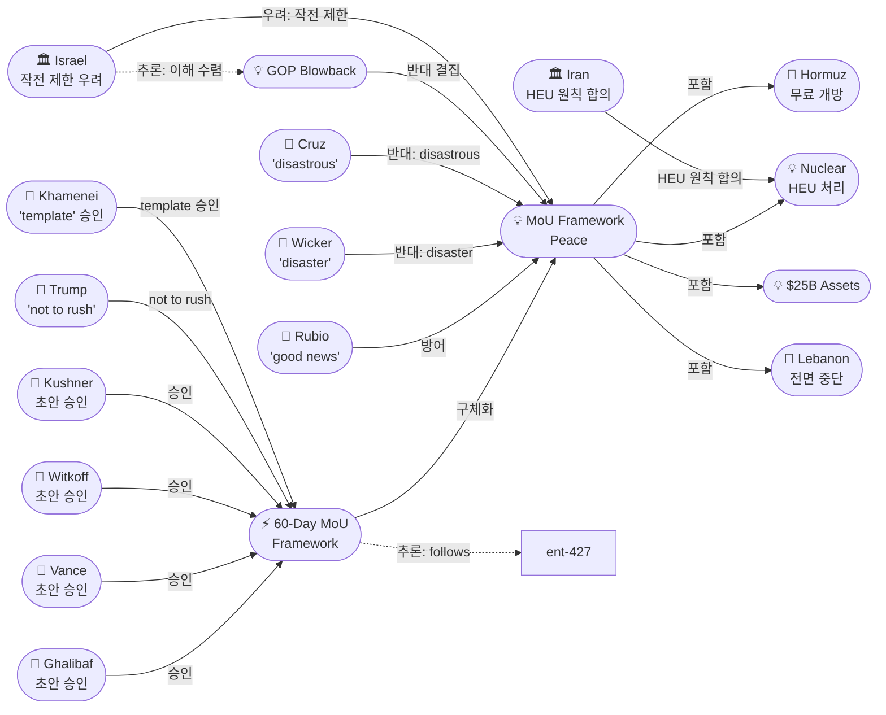
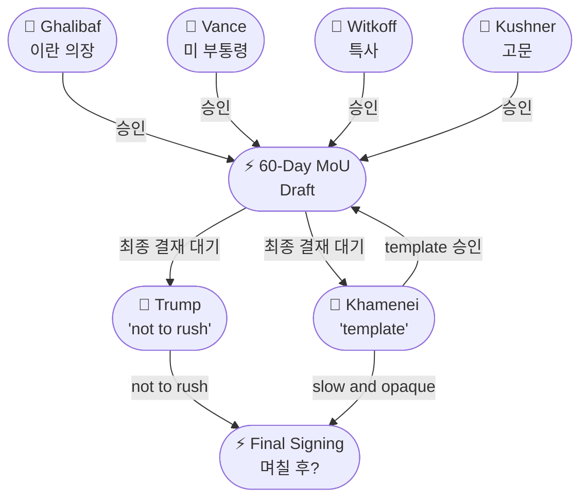
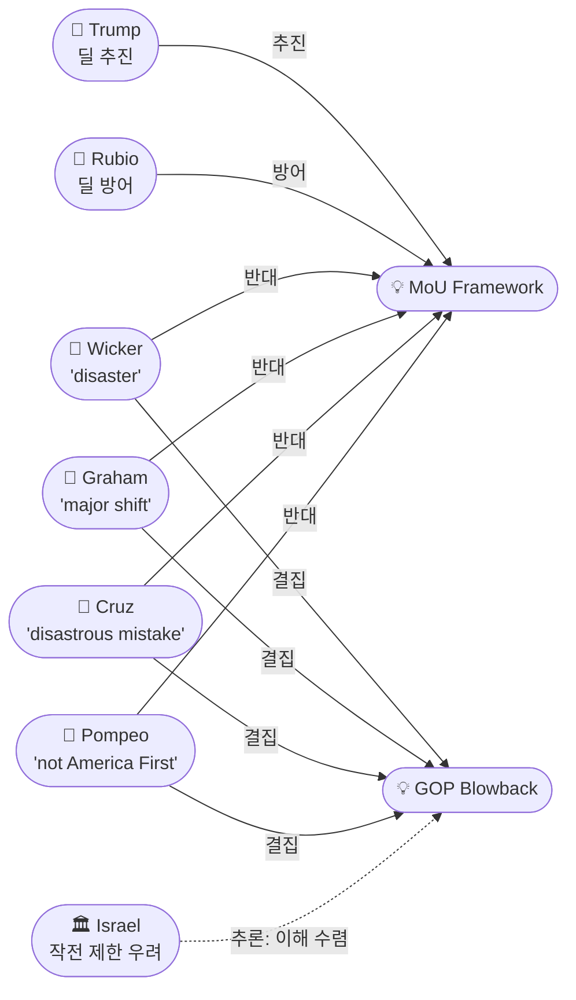

# 2026-05-25 2026 Iran War OSINT 일일 보고서

## 요약

Day 87. **MoU 60일 프레임워크의 세부 구조가 공개됐으나, 트럼프가 '서두르지 말라'고 속도를 조절했다.** Axios가 단독 입수한 MoU 초안에 따르면, 60일간 호르무즈 무료 개방(기뢰 제거 포함)·미 봉쇄 해제·이란 석유 판매 허용·핵무기 불추구 서약·HEU 처리 협상이 골자다. Washington Times는 **갈리바프·밴스·위트코프·쿠슈너가 초안을 승인**하고 양국 지도자에게 최종 결재를 송부했다고 보도했다. CBS는 **이란이 HEU 폐기에 원칙적으로 합의**했으며 최고지도자가 '딜의 템플릿'을 승인했다고 전했다. 그러나 트럼프는 일요일 소셜미디어에 **"서두르지 말라고 지시했다, 시간은 우리 편"**이라고 밝혔고, 백악관은 **이번 주말 서명은 없으며 며칠 더 걸릴 수 있다**고 확인했다. 한편 **공화당 매파가 딜에 집중포화**를 퍼부었다 — 위커 상원군사위 의장 "재앙", 크루즈 "참담한 실수", 폼페이오 "미국 우선이 아니다". 이스라엘은 MoU가 헤즈볼라 작전을 제한할 것을 우려하며 IDF가 레바논 작전계획을 수립 중이다.

## 주요 뉴스

### 1. Axios 단독: MoU 60일 프레임워크 세부 내용 공개
- **출처:** [Axios](https://www.axios.com/2026/05/24/iran-deal-strait-hormuz-sanctions-nuclear)
- **일시:** 2026-05-24
- **내용:** MoU 초안의 핵심 조항이 공개됐다. **(1) 60일 동안 호르무즈 해협을 통행료 없이 개방**하고 이란이 기뢰를 제거한다. **(2) 미국은 이란 항구 봉쇄를 해제**하고 일부 제재를 면제하여 이란의 석유 자유 판매를 허용한다. **(3) 이란은 핵무기 불추구를 서약**하고 우라늄 농축 중단 및 HEU 재고 처리를 협상한다. **(4) 미군은 60일간 역내 잔류**하며 최종 합의가 이행된 후에만 철수한다. 트럼프의 핵심 원칙은 **"relief for performance"** — 성과에 대한 보상이다. 트럼프 행정부는 최종 합의에서 이란의 약 2,000kg 전체 농축 우라늄을 포괄하길 원하며, 무기급에 근접한 450kg만이 아니라고 밝혔다.
- **상태:** 신규
- **관련 엔티티:** Donald Trump, Iran, Strait of Hormuz, Nuclear Program, MoU Framework

### 2. Washington Times: 초안 4자 승인 — 갈리바프·밴스·위트코프·쿠슈너
- **출처:** [Washington Times](https://www.washingtontimes.com/news/2026/may/23/exclusive-us-iran-announce-peace-deal-within-24-hours/)
- **일시:** 2026-05-23~24
- **내용:** Washington Times가 협상 관계자를 인용해 보도한 바에 따르면, **이란 갈리바프 의장, 미국 밴스 부통령·위트코프 특사·쿠슈너가 초안을 승인**했다. 초안은 **토요일 이른 시간에 합의**되었으며, **24시간 내(일요일 오후) 발표가 예상**된다고 전했다. 초안은 양국 지도자 — 트럼프 대통령과 모즈타바 하메네이 최고지도자 — 에게 최종 결재를 위해 송부됐다.
- **상태:** 신규
- **관련 엔티티:** Mohammad Bagher Ghalibaf, JD Vance, Steve Witkoff, Jared Kushner, Donald Trump, Mojtaba Khamenei

### 3. 트럼프: "서두르지 말라" — 속도 조절로 전환
- **출처:** [PBS](https://www.pbs.org/newshour/world/trump-says-not-to-rush-as-u-s-nears-potential-iran-deal)
- **일시:** 2026-05-25
- **내용:** 트럼프 대통령이 일요일 소셜미디어에 **"협상이 질서 있고 건설적인 방식으로 진행 중(proceeding in an orderly and constructive manner)"**이라고 게시하면서, **"대표단에 서두르지 말라고 지시했다(told my representatives not to rush into a deal)"**고 밝혔다. **"시간은 우리 편(time is on our side)"**이며 이란과의 관계가 **"훨씬 더 전문적이고 생산적(much more professional and productive)"**이 되고 있다고 덧붙였다. 봉쇄는 **"합의가 체결·인증·서명될 때까지 완전히 유지(remain in full force and effect)"**된다고 강조했다. 금요일 '50/50'·일요일까지 결정에서 하루 만에 톤이 현저히 달라졌다.
- **상태:** 신규
- **관련 엔티티:** Donald Trump

### 4. CBS: 이란, HEU 폐기 원칙적 합의 — 최고지도자 '템플릿' 승인
- **출처:** [CBS News](https://www.cbsnews.com/news/iran-peace-deal-negotiations-highly-enriched-uranium/)
- **일시:** 2026-05-25
- **내용:** 백악관 고위관리가 CBS에 **이란이 고농축 우라늄(HEU) 처리에 원칙적으로 합의**했다고 밝혔다. **최고지도자가 딜의 '템플릿(template)'을 승인**했으나, 최종 합의에는 아직 도달하지 못했다. 합의는 **2단계 프로세스** — (1) 호르무즈 즉시 개방과 봉쇄 해제, (2) HEU 처리와 핵 문제 해결 — 로 구성된다. 관리는 이번 주말 서명은 없을 것이라고 확인하며, **"최고지도자가 권한을 부여한 사람들과 우라늄 처리 메커니즘의 세부사항을 아직 조율 중"**이라고 밝혔다. 행정부는 이 합의가 **2015 오바마 핵합의(JCPOA)보다 낫다**고 평가했다.
- **상태:** 신규
- **관련 엔티티:** Mojtaba Khamenei, Iran, Nuclear Program

### 5. 루비오: 인도에서 "몇 시간 내 좋은 소식" — '중요한 진전'
- **출처:** [RFE/RL](https://www.rferl.org/a/iran-war-us-hormuz-oil-blockade-gulf-israel/33640284.html)
- **일시:** 2026-05-24~25
- **내용:** 인도를 방문 중인 루비오 국무장관이 **"호르무즈 관련 좋은 소식이 몇 시간 내에 있을 수 있다(there may be some good news in the coming hours)"**고 밝혔다. **"중요한 진전(significant progress)"**이 이뤄졌으며, 이란의 핵무기 위협 없는 세상을 만드는 **"과정의 시작(the beginning of a process)"**이라고 규정했다. 다만 **"최종 소식은 아니다(not final news)"**라고 선을 그었다. 루비오는 외교적 해결을 선호하지만 군사 옵션도 유지한다는 입장을 재확인했다.
- **상태:** 신규
- **관련 엔티티:** Marco Rubio, Strait of Hormuz, Iran

### 6. 공화당 매파 집중포화: "재앙" "참담한 실수" "미국 우선 아니다"
- **출처:** [Newsweek](https://www.newsweek.com/iran-media-says-deal-touted-by-trump-inconsistent-with-reality-11987756), [Philadelphia Inquirer](https://www.inquirer.com/news/nation-world/iran-us-war-peace-deal-talks-trump-rubio-nuclear-strait-hormuz-sanctions-20260524.html)
- **일시:** 2026-05-24
- **내용:** 공화당 내 매파가 이란 딜에 집중 비판을 쏟아냈다. **로저 위커** 상원군사위 의장: **"60일 휴전 — 이란이 선의로 협상할 것이라는 믿음은 재앙(disaster)"**. **린지 그레이엄** 상원의원: **"지역 세력균형의 대규모 이동(major shift of the balance of power)"** 경고. **테드 크루즈** 상원의원: **"참담한 실수가 될 수 있다(could turn out to be a disastrous mistake)"**. **마이크 폼페이오** 전 CIA국장/국무장관: **"원격으로도 미국 우선이 아니다(not remotely America First)"**. 이는 트럼프 동맹 의원들이 핵심 외교 이니셔티브에 공개적으로 반기를 든 이례적 사태다.
- **상태:** 신규
- **관련 엔티티:** Roger Wicker, Lindsey Graham, Ted Cruz, Mike Pompeo, Donald Trump, MoU Framework

### 7. IDF, 레바논 작전계획 수립 — 이란 딜이 헤즈볼라 작전 제한 우려
- **출처:** [Times of Israel](https://www.timesofisrael.com/idf-draws-up-lebanon-plans-amid-concern-iran-deal-could-curb-fighting-with-hezbollah)
- **일시:** 2026-05-24
- **내용:** IDF가 미-이란 딜이 **헤즈볼라와의 전투를 제한할 수 있다는 우려 속에** 레바논 배치 재편 계획을 수립 중이다. MoU 조건에 따르면 **이스라엘은 헤즈볼라가 먼저 공격하거나 실행한 경우에만 타격 가능** — 이는 이스라엘의 기존 선제적 작전권과 충돌한다. 이스라엘은 **남부 레바논 7-8km 안보 지대 유지**를 주장하며, 전전(前戰) 원상복귀를 거부하고 있다. 자미르 참모총장이 **헤즈볼라 대응 지속 계획을 승인**했으며, 외교적 결과와 무관하게 작전 준비를 진행 중이다.
- **상태:** 신규
- **관련 엔티티:** Israel, IDF, Hezbollah, Lebanon, MoU Framework

### 8. 백악관: 이번 주말 서명 없다 — "며칠 더 걸릴 수 있다"
- **출처:** [Axios](https://www.axios.com/2026/05/24/iran-deal-white-house-delay-days-trump)
- **일시:** 2026-05-24
- **내용:** 백악관 고위관리가 **"협상은 매우 좋은 위치에 있다(in a very good place)"**고 밝혔으나, **이번 주말 전쟁 종식 합의 서명은 없을 것**이라고 확인했다. 이란의 **"느리고 불투명한(slow and opaque) 의사결정 체계"**로 인해 **며칠 더 지연될 수 있다**고 설명했다. 밴스 부통령, 위트코프 특사, 쿠슈너가 협상에 참여 중이다.
- **상태:** 신규
- **관련 엔티티:** JD Vance, Steve Witkoff, Jared Kushner, Iran

### 9. 루비오, 인도에서 매파 비판 방어 — "외교 선호하지만 군사 옵션 유지"
- **출처:** [Washington Post](https://www.washingtonpost.com/national-security/2026/05/24/rubio-defends-push-iran-deal-which-trump-says-is-final-stages/)
- **일시:** 2026-05-24
- **내용:** 루비오 국무장관이 인도 방문 중 공화당 내 매파 비판에 대해 **이란 딜 추진을 방어**했다. 워싱턴이 이란 문제를 **"어떻게든(any way we can)"** 해결하길 원하지만 외교적 해결을 선호한다고 밝혔다. 이란이 핵무기를 보유하지 않는 세상을 만드는 것이 트럼프의 목표라고 강조했다.
- **상태:** 신규
- **관련 엔티티:** Marco Rubio, Donald Trump

### 10. 한국: "이란, 핵문제·호르무즈 미 언론 보도와 이견"
- **출처:** [파이낸셜뉴스](https://www.fnnews.com/news/202605242147477511), [이데일리](https://www.edaily.co.kr/News/Read?newsId=01088966645452528&mediaCodeNo=257), [헤럴드경제](https://biz.heraldcorp.com/article/10755176)
- **일시:** 2026-05-24~25
- **내용:** 한국 매체들이 미-이란 MoU 세부사항을 집중 보도했다. 파르스 통신이 **호르무즈 관리권은 이란 단독 재량**이라고 보도한 것과, 미국 측이 **'자유 통행·통행료 없음'**이라고 밝힌 것 사이의 이견이 부각됐다. 이데일리는 **미 당국자가 호르무즈 개방과 이란 농축 우라늄 폐기에 원칙적으로 합의**했다고 종합 보도했다. 트럼프의 '서두르지 말라' 발언은 협상 레버리지 확보와 공화당 내부 관리 양면의 전략으로 분석됐다.
- **상태:** 신규
- **관련 엔티티:** Iran, Strait of Hormuz, Donald Trump, Nuclear Program

## 지식그래프

### 오늘의 주요 관계

1. **MoU 60일 프레임워크 구체화:** Axios가 MoU 내용을 공개하며 ent-431(60일 프레임워크)이 ent-428(MoU Framework Peace)을 구체화했다. 호르무즈(ent-008), 핵(ent-025), $25B 자산(ent-429), 레바논(ent-050)을 포괄하는 2단계 구조가 확인됐다.
2. **초안 4자 승인:** 갈리바프(ent-045)·밴스(ent-041)·위트코프(ent-043)·쿠슈너(ent-042)가 모두 ent-431에 참여하며 초안을 승인 → 양국 최고지도자(ent-001, ent-046)에게 송부.
3. **GOP 내부 분열:** 위커(ent-432)·그레이엄(ent-433)·크루즈(ent-434)·폼페이오(ent-435)가 ent-428에 반대 → ent-436(GOP Blowback) 형성. 루비오(ent-077)는 방어에 나서 같은 당 내 찬반이 공개적으로 대립.
4. **이스라엘 우려:** 이스라엘(ent-004)이 ent-428에 대해 헤즈볼라 작전 제한 우려 → GOP 매파와 잠재적 이해관계 수렴(추론).

### 전체 지식그래프 시각화

### 주제별 세부 그래프: MoU 승인 프로세스

### 주제별 세부 그래프: GOP 내부 분열

## 온톨로지 변경

| 변경 유형 | 대상 | 근거 |
|----------|------|------|
| 새 엔티티 | ent-431 MoU 60-Day Framework (Event) | Axios 단독 — 60일 MoU 세부구조 공개, 4자 승인 |
| 새 엔티티 | ent-432 Roger Wicker (Person) | 상원군사위 의장, "disaster" 발언 |
| 새 엔티티 | ent-433 Lindsey Graham (Person) | 상원의원, "major shift" 경고 |
| 새 엔티티 | ent-434 Ted Cruz (Person) | 상원의원, "disastrous mistake" |
| 새 엔티티 | ent-435 Mike Pompeo (Person) | 전 CIA국장/국무장관, "not America First" |
| 새 엔티티 | ent-436 GOP Blowback on Iran Deal (Concept) | 공화당 내부 매파 집중 비판 현상 |
| 기존 업데이트 | ent-001 Trump | '서두르지 말라' 속도 조절, 봉쇄 유지 |
| 기존 업데이트 | ent-002 Iran | HEU 폐기 원칙 합의 (CBS) |
| 기존 업데이트 | ent-004 Israel | IDF 레바논 작전계획, 딜 우려 |
| 기존 업데이트 | ent-041 Vance | 초안 승인 |
| 기존 업데이트 | ent-042 Kushner | 초안 승인 |
| 기존 업데이트 | ent-043 Witkoff | 초안 승인 |
| 기존 업데이트 | ent-045 Ghalibaf | 초안 승인 |
| 기존 업데이트 | ent-046 Khamenei | 딜 '템플릿' 승인 |
| 기존 업데이트 | ent-077 Rubio | 인도서 '좋은 소식' + 매파 반박 방어 |
| 기존 업데이트 | ent-428 MoU Framework | 60일 구조 구체화 |
| 기존 업데이트 | ent-427 Declaration | '서두르지 말라'로 톤 변화 |
| 스키마 변경 | 없음 | 기존 클래스/관계로 표현 가능 |

## 추론 결과

| 추론 | 신뢰도 | 근거 |
|------|--------|------|
| GOP 비판자 → Trump 잠재적 마찰 (공동 참여) | 0.75 | 위커/그레이엄/크루즈/폼페이오가 MoU에 반대, 트럼프가 추진 — 같은 당 내 공개 대립 |
| 60-Day MoU → 'largely negotiated' 진화 (사건 체인) | 0.85 | 5/23 'largely negotiated' 선언 → 5/24 60일 MoU 세부 공개 |
| 이스라엘 → GOP Blowback 이해관계 수렴 (공동 참여) | 0.72 | 이스라엘과 공화당 매파 모두 MoU에 반대 — 공통 이해관계 |

## 분석 및 평가

**Day 87는 '합의 직전'에서 '속도 조절'로의 미묘한 전환을 보여준다.** 금요일의 '50/50'·일요일 결정 → 토요일의 초안 4자 승인 → 일요일의 '서두르지 말라'라는 3일간의 궤적은 합의의 불가역적 진전과 동시에 정치적 역풍을 반영한다.

**첫째, MoU의 2단계 구조는 '핵 분리'의 제도화다.** Axios가 공개한 60일 프레임워크는 바가에이가 5/23 밝힌 '핵 제외'를 구조적으로 확인했다 — 1단계(호르무즈·봉쇄·석유)를 즉시 이행하고, 2단계(핵·HEU·농축 중단)를 60일 내 협상한다. CBS의 'HEU 폐기 원칙 합의'는 돌파구이나, '원칙'과 '메커니즘' 사이에는 여전히 간극이 존재한다. 트럼프 행정부가 450kg HEU뿐 아니라 2,000kg 전체 농축 우라늄을 요구한다는 점은 2단계 협상의 난이도를 예고한다.

**둘째, 트럼프의 속도 조절은 다면적 전략이다.** (1) **GOP 반발 관리:** 위커·크루즈·그레이엄·폼페이오의 공개 비판은 트럼프에게 국내 정치적 비용을 부과한다. '서두르지 말라'는 '이란에 퍼주기가 아니다'라는 메시지다. (2) **협상 레버리지:** 봉쇄를 유지하면서 '시간은 우리 편'이라고 선언하는 것은 이란에 추가 양보를 압박한다. (3) **이란 내부 프로세스:** 백악관이 이란의 '느리고 불투명한' 의사결정을 인용한 것은 실질적 장애물의 인정이다 — 최고지도자가 '템플릿'을 승인했으나 IRGC와 강경파의 최종 동의가 필요하다.

**셋째, 이스라엘 변수가 새로운 장애물로 부상한다.** MoU 조건에 따라 이스라엘이 헤즈볼라에 대한 선제 타격권을 상실하면, 5/15 연장된 45일 휴전이 사실상 영구화된다. 자미르 참모총장이 '작전 지속 계획'을 승인한 것은 이스라엘이 MoU 서명 전에 군사적 기정사실을 만들려는 시도일 수 있다. 네타냐후의 반응이 아직 없다는 것 자체가 의미 있다 — 침묵은 동의가 아니라 준비일 수 있다.

**종합:** '초안 승인 → 서두르지 말라'의 24시간 반전은, 합의의 구조적 완성도가 높아졌으나 **정치적 비용 계산이 진행 중**임을 보여준다. 합의는 이제 '가능한가'가 아니라 '언제, 어떤 가격에'의 문제다. GOP 반발과 이스라엘 우려가 MoU의 핵 2단계를 약화시키거나, 트럼프가 '더 나은 합의'를 위해 추가 레버리지를 행사할 공간이 열렸다.

## 추적 항목

| 항목 | 최초 보고 | 상태 | 최신 업데이트 |
|------|----------|------|-------------|
| 미-이란 MoU | 2026-04-10 | **초안 4자 승인, 속도 조절** | 60일 MoU 세부 공개, 갈리바프/밴스/위트코프/쿠슈너 승인, 트럼프 '서두르지 말라' |
| 호르무즈 해협 | 2026-04-07 | **MoU에 무료 개방 포함** | 60일 무료 통행, 기뢰 제거, 봉쇄 해제 |
| 핵 협상 | 2026-04-10 | **HEU 원칙 합의** | CBS: 최고지도자 '템플릿' 승인, 2,000kg 전체 우라늄 요구 |
| 이스라엘-레바논 | 2026-04-16 | 45일 연장 중 | IDF 작전계획 수립, 딜이 헤즈볼라 작전 제한 우려 |
| 유가 | 2026-04-07 | Brent ~$103 | 주간 -6%(-8% WTI), 합의 지연에도 하방 유지 |
| WPR 의회 전쟁권한 | 2026-04-30 | 하원 6/2 투표 | 골든 찬성 전환, 상원 이미 통과 |
| 파키스탄/카타르 중재 | 2026-04-07 | 이중 중재 유지 | 파키스탄 경유 초안 전달 |
| GOP 내부 분열 | **2026-05-25** | **신규** | 위커/그레이엄/크루즈/폼페이오 공개 비판 vs 루비오 방어 |

## 동향 요약

| 분류 | 상태 | 비고 |
|------|------|------|
| 미-이란 MoU | **초안 승인·속도 조절** | 4자 승인 → 트럼프 '서두르지 말라', 며칠 지연 |
| 핵 협상 | HEU 원칙 합의 | CBS: 최고지도자 '템플릿' 승인, 메커니즘 조율 중 |
| 호르무즈 | MoU에 60일 무료 개방 | 기뢰 제거, 봉쇄 해제 포함 |
| 프록시 전쟁 | 소강/우려 | MoU가 이스라엘 대 헤즈볼라 작전 제한 |
| 이스라엘-레바논 | IDF 작전계획 | 자미르 작전 지속 승인, 7-8km 안보지대 |
| 유가 | Brent ~$103 | 주간 -6%, 합의 기대 하방 |
| 의회 | GOP 분열 | 매파 4인 집중 비판, 루비오 방어 |
| 중재 | 파키스탄 경유 | 초안 양국 지도자 결재 대기 |

## 출처 목록
1. [What's inside the Iran deal Trump is close to signing](https://www.axios.com/2026/05/24/iran-deal-strait-hormuz-sanctions-nuclear) - Axios, 2026-05-24
2. [U.S., Iran to announce draft of peace deal within 24 hours](https://www.washingtontimes.com/news/2026/may/23/exclusive-us-iran-announce-peace-deal-within-24-hours/) - Washington Times, 2026-05-23
3. [Trump says not to rush as U.S. nears potential Iran deal](https://www.pbs.org/newshour/world/trump-says-not-to-rush-as-u-s-nears-potential-iran-deal) - PBS, 2026-05-25
4. [Iran agrees in principle to dispose of highly-enriched uranium](https://www.cbsnews.com/news/iran-peace-deal-negotiations-highly-enriched-uranium/) - CBS News, 2026-05-25
5. [Rubio: Good News On Iran Could Come Later Today](https://www.rferl.org/a/iran-war-us-hormuz-oil-blockade-gulf-israel/33640284.html) - RFE/RL, 2026-05-24
6. [Republicans blast 'disaster' Iran deal touted by Trump](https://www.newsweek.com/iran-media-says-deal-touted-by-trump-inconsistent-with-reality-11987756) - Newsweek, 2026-05-24
7. [IDF draws up Lebanon plans amid concern Iran deal could curb fighting](https://www.timesofisrael.com/idf-draws-up-lebanon-plans-amid-concern-iran-deal-could-curb-fighting-with-hezbollah) - Times of Israel, 2026-05-24
8. [White House says Iran deal could take days](https://www.axios.com/2026/05/24/iran-deal-white-house-delay-days-trump) - Axios, 2026-05-24
9. [Rubio defends push for Iran deal](https://www.washingtonpost.com/national-security/2026/05/24/rubio-defends-push-iran-deal-which-trump-says-is-final-stages/) - Washington Post, 2026-05-24
10. [What's in the proposed deal that could end the US-Iran conflict?](https://www.cnn.com/2026/05/24/middleeast/iran-us-proposed-deal-wwk-intl) - CNN, 2026-05-24
11. [이란, 핵문제·호르무즈 미 언론 보도와 이견](https://www.fnnews.com/news/202605242147477511) - 파이낸셜뉴스, 2026-05-24
12. [트럼프 "이란과 합의 서두르지 말라"](https://www.edaily.co.kr/News/Read?newsId=01088966645452528&mediaCodeNo=257) - 이데일리, 2026-05-25
13. [美·이란, 60일 휴전연장·호르무즈 무료개방 근접](https://biz.heraldcorp.com/article/10755176) - 헤럴드경제, 2026-05-24
14. [Republican hawks seem to fear a Trump cut and run from Iran](https://www.cnn.com/2026/05/24/politics/republican-iran-hawks-trump-analysis) - CNN, 2026-05-24
15. [Trump's emerging plan draws criticism from hard-line Republicans](https://www.pbs.org/newshour/politics/trumps-emerging-plan-to-end-iran-war-draws-criticism-from-hard-line-republicans) - PBS, 2026-05-24
16. [US-Iran deal to open strait for 60 days](https://www.timesofisrael.com/us-iran-deal-to-open-strait-for-60-days-iran-to-discuss-giving-up-enriched-uranium-reports/) - Times of Israel, 2026-05-24
17. [US, Iran inch closer to deal — What to know](https://www.aljazeera.com/news/2026/5/24/us-iran-inch-closer-to-deal-to-end-the-war-what-to-know) - Al Jazeera, 2026-05-24
18. [트럼프 "이란 합의 서두르지 말라고 지시…실수 용납 안돼"](https://www.fnnews.com/news/202605250039071504) - 파이낸셜뉴스, 2026-05-25
19. [IDF readies new Lebanon deployment](https://www.ynetnews.com/article/h1v42degze) - Ynet, 2026-05-24
20. [Zamir approves plans for continued fighting against Hezbollah](https://www.timesofisrael.com/liveblog_entry/zamir-approves-plans-for-continued-fighting-against-hezbollah-says-idf-prepared-to-resume-iran-conflict/) - Times of Israel, 2026-05-24
21. [Iran agrees in principle to deal — Jerusalem Post](https://www.jpost.com/middle-east/iran-news/article-897164) - Jerusalem Post, 2026-05-25
22. [CBS live updates: Broad principles agreed](https://www.cbsnews.com/live-updates/iran-war-trump-us-peace-talks-strait-of-hormuz-control/) - CBS News, 2026-05-25
23. [CNN live updates: US and Iran signal progress](https://www.cnn.com/2026/05/24/world/live-news/iran-war-news) - CNN, 2026-05-24
24. [Al Jazeera live: Trump instructs 'not to rush'](https://www.aljazeera.com/news/liveblog/2026/5/24/live-trump-says-new-iran-deal-largely-negotiated-with-talks-very-soon) - Al Jazeera, 2026-05-25
25. [Rubio sees good news on Hormuz — Bloomberg](https://www.bloomberg.com/news/articles/2026-05-24/trump-touts-imminent-iran-deal-that-would-reopen-hormuz-strait) - Bloomberg, 2026-05-24
