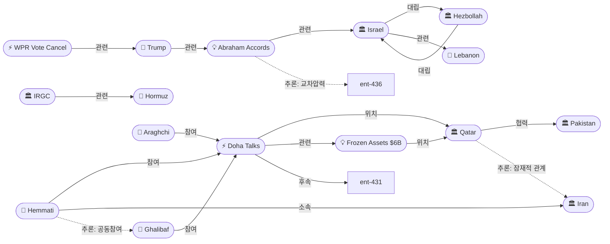
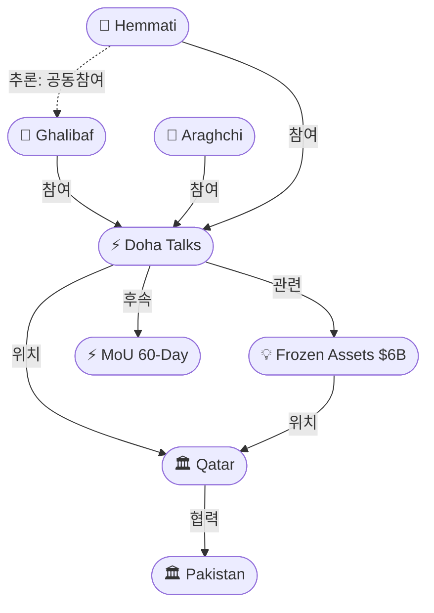
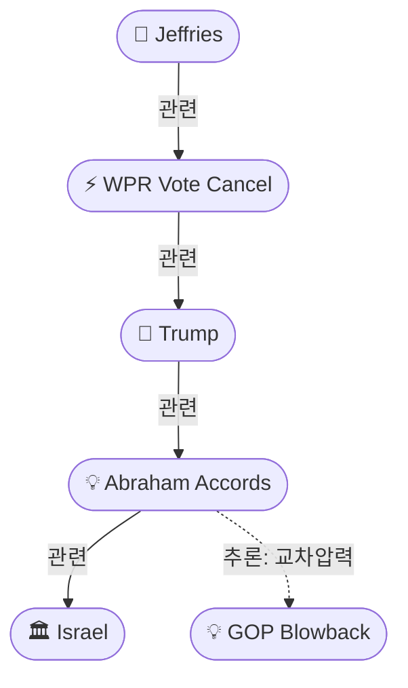

# 2026-05-26 2026 Iran War OSINT 일일 보고서

## 요약

Day 88. **이란 최고위 대표단이 카타르 도하로 이동하여 MoU 최종 쟁점인 동결자산 해제를 집중 협상하고 있다.** 갈리바프 의회의장·아라그치 외무장관에 **압돌나세르 헤마티 중앙은행 총재**가 합류하여 카타르 은행에 동결된 $6B 자산 해제를 협의 중이다 — 협상 장소가 파키스탄에서 카타르로 이동한 것은 MoU의 최종 관문이 군사/핵이 아닌 **금융(동결자산·제재 해제)**에 있음을 시사한다. 한편 트럼프는 이란 딜에 **사우디·파키스탄·카타르·터키·이집트·요르단의 이스라엘 정상화**를 '필수(mandatory)' 조건으로 연결했으나, 지역 지도자들은 **침묵**으로 반응했다. 미 하원에서는 **GOP가 통과 직전인 전쟁권한결의안(WPR) 투표를 3번째 취소**하여 6월로 연기했고, 민주당은 '비겁'하다고 비판했다. 유가는 **Brent $96.31로 4월 이후 최저**를 기록하며 딜 성사를 선반영하고 있다. 레바논에서는 이스라엘 드론 공습으로 3명이 사망하고 10개 마을 퇴거가 명령됐으며, 헤즈볼라 드론으로 IDF 병사 1명이 전사했다.

## 주요 뉴스

### 1. 이란 대표단 도하 이동 — 갈리바프·아라그치·헤마티, 동결자산 집중 협상
- **출처:** [Al Arabiya](https://english.alarabiya.net/News/middle-east/2026/05/25/iran-envoys-in-doha-for-talks-on-possible-usiran-deal-official-says-), [CNN](https://www.cnn.com/2026/05/25/world/live-news/iran-war-us-peace-deal)
- **일시:** 2026-05-25
- **내용:** 이란 의회의장 갈리바프, 외무장관 아라그치, **중앙은행 총재 압돌나세르 헤마티**가 카타르 도하에 도착하여 **MoU 최종 쟁점에 대한 '집중 협상(intense talks)'**을 진행 중이다. 협상의 초점은 **호르무즈 해협과 고농축 우라늄(HEU) 관련 사안** 및 **카타르 은행에 동결된 이란 자산($6B)**의 해제다. 이란 외교부는 **"많은 의제에서 합의에 도달한 것은 사실이나, 그 누구도 합의 서명이 임박했다고 단언할 수 없다"**고 밝혔다. 중앙은행 총재의 참여는 동결자산 해제가 MoU 서명의 최종 관문임을 시사한다.
- **상태:** 신규
- **관련 엔티티:** Mohammad Bagher Ghalibaf, Abbas Araghchi, Abdolnaser Hemmati, Qatar, Iran

### 2. 트럼프, 이란 딜에 아브라함 협정 정상화 '필수' 연결 — 지역 지도자 침묵
- **출처:** [Times of Israel](https://www.timesofisrael.com/trump-says-mandatory-for-muslim-nations-involved-in-iran-deal-to-join-abraham-accords/), [Axios](https://www.axios.com/2026/05/24/trump-iran-war-israel-muslim-countries-abraham-accords)
- **일시:** 2026-05-25
- **내용:** 트럼프 대통령이 이란 딜에 참여하는 **6개 이슬람 국가(사우디아라비아·파키스탄·카타르·터키·이집트·요르단)가 아브라함 협정에 가입하여 이스라엘과 수교**할 것을 **'필수(mandatory)'**로 요구했다. **"1~2개국은 예외가 가능할 수 있다(may be possible)"**고 덧붙였다. Axios에 따르면 **통화 중 정상화 요구에 대해 지역 지도자들은 침묵**했고, **트럼프가 "아직 거기 계십니까?(are you still there?)"라고 농담**했다. 지도자들은 모두 이란 딜 자체에 대한 지지를 표명했으나 정상화에는 반응하지 않았다. 사우디아라비아는 **팔레스타인 국가 수립 전제조건을 유지**하고 있으며, 이스라엘 총선(10월 전) 전에는 정상화가 어렵다는 분석이 나온다.
- **상태:** 신규
- **관련 엔티티:** Donald Trump, Israel, Saudi Arabia, Pakistan, Qatar, Turkey

### 3. 카타르, 미-이란 동결자산 중재자로 부상 — $6B 핵심 쟁점
- **출처:** [Iran International](https://www.iranintl.com/en/202605252488), [Jerusalem Post](https://www.jpost.com/middle-east/iran-news/article-897224)
- **일시:** 2026-05-25
- **내용:** 카타르가 미-이란 협상에서 파키스탄과 함께 **공동 중재자**로 부상하고 있다. 카타르에는 2023년 미국인 5명 석방 대가로 한국에서 이전된 **$6B 이란 동결자산**이 보관되어 있으며, 이란은 이 자산의 해제를 **MoU 서명 전 전제조건**으로 요구하고 있다. Jerusalem Post에 따르면 이란은 **"보장된 자금 접근이 예비 합의 진행 전에 이뤄져야 한다(guaranteed access to funds must come before any preliminary agreement)"**고 주장하고 있다. 카타르의 중재는 이란 대표단과 미국 측 사이의 간극을 좁히는 데 기여하고 있다.
- **상태:** 신규
- **관련 엔티티:** Qatar, Iran, Pakistan, Iran Frozen Assets ($6B Qatar)

### 4. 하원 GOP, WPR 투표 3번째 취소 — 통과 직전, 6월 연기
- **출처:** [NPR](https://www.npr.org/2026/05/22/g-s1-123592/republicans-call-off-vote-on-iran-war-resolution), [CNN](https://www.cnn.com/2026/05/21/politics/house-trump-iran-war-powers)
- **일시:** 2026-05-22
- **내용:** 하원 공화당이 **이란 전쟁권한결의안(WPR) 투표를 통과 직전에 3번째 취소**하고 **6월 메모리얼 데이 휴회 이후로 연기**했다. 공화당 의원 8명 부재(찬성 예상 1명만), 민주당 2명만 부재로 **투표하면 통과될 상황**이었다. 하원 민주당 지도자 **해킴 제프리스**는 **"비겁하다(cowardly)"**고 비판했다. 이는 상원 50-47 WPR 통과(캐시디·콜린스·머카우스키·폴 이탈)에 이은 것으로, **초당적 전쟁 종결 압력이 사상 최고 수준**에 달하고 있다. MoU가 6월 초까지 서명되지 않으면 하원 WPR 통과가 현실화될 수 있다.
- **상태:** 신규
- **관련 엔티티:** Hakeem Jeffries, Donald Trump, Susan Collins, Bill Cassidy

### 5. 레바논: 이스라엘 드론 공습 3명 사살·10개 마을 퇴거 명령
- **출처:** [Al Jazeera](https://www.aljazeera.com/news/2026/5/25/israel-kills-three-in-attacks-on-lebanon-issues-more-displacement-orders)
- **일시:** 2026-05-25
- **내용:** 이스라엘 드론이 남부 레바논 **나바티예 지역(카프르 룸만-자르마크 고속도로, 자르마크-카르달리 도로)의 차량 3대를 공습**하여 3명이 사망했다. 이스라엘군은 **10개 마을 주민에게 퇴거를 명령**했으며, **"헤즈볼라의 휴전 위반"**을 이유로 **"무력으로 대응할 수밖에 없다(compelled to operate with force)"**고 밝혔다. 4/17 휴전 이후에도 양측 공격이 매일 지속되고 있다.
- **상태:** 신규
- **관련 엔티티:** Israel, Hezbollah, Lebanon

### 6. IDF 병사 헤즈볼라 드론 전사 — 헤즈볼라 40발 로켓 발사
- **출처:** [Times of Israel](https://www.timesofisrael.com/liveblog-may-24-2026/)
- **일시:** 2026-05-25~26
- **내용:** 남부 레바논에서 **헤즈볼라 드론 공격으로 IDF 병사 1명이 전사**하고 1명이 부상했다. 헤즈볼라는 **카르미엘에 10발, 북부 이스라엘 기타 지역에 30발 등 총 40발의 로켓**을 발사하여 반복적으로 비상 사이렌이 발령됐다. 전쟁 이후 **이스라엘군 전사자는 총 23명**에 달한다.
- **상태:** 신규
- **관련 엔티티:** Israel, Hezbollah, Lebanon

### 7. 유가 Brent $96.31 — 4월 이후 최저, 딜 낙관론 선반영
- **출처:** [Axios](https://www.axios.com/2026/05/24/oil-prices-iran-war-hormuz-strait-trump-tehran-peace-talks)
- **일시:** 2026-05-25~26
- **내용:** **Brent 원유가 $96.31/bbl로 4월 이후 최저**를 기록했다. 직전 4주간 -5.18% 하락했으며, 5/23 보고 시점($103) 대비 추가 6.5% 하락했다. 미-이란 딜 성사 기대감이 시장에 반영되고 있으나, ADNOC CEO 술탄 알자베르는 **"분쟁이 당장 끝나더라도 호르무즈 통행량이 전전 수준의 80%를 회복하는 데 최소 4개월이 걸린다"**고 밝혔다 ([헤럴드경제](https://biz.heraldcorp.com/article/10755335)).
- **상태:** 신규
- **관련 엔티티:** Strait of Hormuz, Iran

### 8. IRGC 32척 호르무즈 통과 허가 — 관리형 통행 지속
- **출처:** [ANI](https://www.aninews.in/news/world/middle-east/iran-navy-claims-32-vessels-crossed-strait-of-hormuz-under-irgc-clearance20260525183755/)
- **일시:** 2026-05-25
- **내용:** 이란 해군은 **32척의 선박이 IRGC 해군의 허가와 보안 조율 하에 호르무즈 해협을 통과**했다고 발표했다. 유조선, 컨테이너선, 기타 상선이 혼합되어 있다. 5/23의 25척 대비 증가했으나, 전전 일일 135척 대비 여전히 **약 2% 수준**에 그치고 있다. 이란은 중국·러시아·인도·이라크·파키스탄 연계 선박에 우선권을 부여하는 다층 통행 체계를 운영 중이다.
- **상태:** 신규
- **관련 엔티티:** IRGC, Strait of Hormuz

### 9. 한국: MoU 고비는 '동결자산 해제' — $6B 카타르 동결 핵심
- **출처:** [파이낸셜뉴스](https://www.fnnews.com/news/202605241947127072)
- **일시:** 2026-05-24~25
- **내용:** 미-이란 종전 MoU 체결의 마지막 고비는 **이란 동결자산 해제**가 될 전망이다. 이란이 MoU 이행 가능성을 높이고 최소한의 신뢰를 조성하기 위해, 미국이 **신속하게 이행 가능하고 정치적 부담도 적은 동결자산 해제**를 요구했다. 뉴스1은 이란의 해외 동결자산 총 규모가 **"150조원($100B 이상)? 실제 규모 아무도 모른다"**고 보도하며 불확실성을 강조했다 ([뉴스1](https://www.news1.kr/amp/world/middleeast-africa/6139374)).
- **상태:** 신규
- **관련 엔티티:** Iran, Iran Frozen Assets ($6B Qatar)

### 10. 트럼프: "협상 순조롭게 진행 중" — 이란 딜 '대단한 딜 아니면 딜 없다'
- **출처:** [NPR](https://www.npr.org/2026/05/25/nx-s1-5833690/u-s-iran-negotiations-updates)
- **일시:** 2026-05-25
- **내용:** 트럼프는 **"이란 이슬람 공화국과의 협상이 순조롭게 진행 중(Negotiations with the Islamic Republic of Iran are proceeding nicely!)"**이라고 밝히며, **"모두에게 대단한 딜이거나 딜이 없거나(It will only be a Great Deal for all or, no Deal at all)"**라고 반복했다. 5/25 '서두르지 말라'에서 하루 만에 톤이 더 낙관적으로 전환됐다.
- **상태:** 업데이트 ← 2026-05-25 "트럼프: 서두르지 말라"
- **관련 엔티티:** Donald Trump, Iran

## 지식그래프

### 오늘의 주요 관계

1. **도하 회담 구성:** 갈리바프(ent-045)·아라그치(ent-044)·헤마티(ent-437)가 도하 회담(ent-438)에 참여. 헤마티의 참여는 동결자산(ent-443)이 MoU 최종 관문임을 시사.
2. **카타르 이중 역할:** 카타르(ent-442)가 도하 회담을 호스팅하면서 동시에 $6B 동결자산 보관처 — 중재자+이해관계자 이중 역할. 파키스탄(ent-029)과의 공동 중재 구조 형성.
3. **아브라함 협정 변수:** 트럼프(ent-001)가 이스라엘 정상화(ent-439)를 MoU에 연결 → 이스라엘(ent-004) 지지 강화 의도이나, GOP 반발(ent-436)과 교차 압력 발생(추론).
4. **하원 WPR 임박:** WPR 투표 취소(ent-440)가 트럼프(ent-001)에 시간 압박 — 6월 초 데드라인이 MoU 서명 속도에 영향.
5. **레바논 전선:** 이스라엘(ent-004)↔헤즈볼라(ent-047) 양방향 교전 지속 — 휴전은 이름뿐.

### 전체 지식그래프 시각화

### 주제별 세부 그래프: 도하 회담 · 동결자산

### 주제별 세부 그래프: 아브라함 협정 · 국내정치

## 온톨로지 변경

| 변경 유형 | 대상 | 근거 |
|----------|------|------|
| 새 엔티티 | ent-437 Abdolnaser Hemmati (Person) | 이란 중앙은행 총재, 도하 대표단 합류 — 동결자산 협상 핵심 |
| 새 엔티티 | ent-438 Iran Doha Talks (Event) | 5/25~26 카타르 도하 회담 — 파키스탄 대체 장소 |
| 새 엔티티 | ent-439 Abraham Accords Normalization Demand (Concept) | 트럼프의 6개국 정상화 요구 — MoU 신규 변수 |
| 새 엔티티 | ent-440 House GOP WPR Vote Cancellation (Event) | 하원 3차 투표 취소 — 6월 데드라인 |
| 새 엔티티 | ent-441 Hakeem Jeffries (Person) | 하원 민주당 지도자 — 'cowardly' 비판 |
| 새 엔티티 | ent-442 Qatar (Organization) | 공동 중재자·동결자산 보관처 — 이중 역할 |
| 새 엔티티 | ent-443 Iran Frozen Assets $6B Qatar (Concept) | MoU 서명 전제조건 — 동결자산 해제 |
| 스키마 변경 | 없음 | 기존 클래스/관계로 모두 표현 가능 |

## 추론 결과

| 추론 | 신뢰도 | 근거 |
|------|--------|------|
| Hemmati → 공동참여 → Ghalibaf | 0.85 | 도하 회담 공동 참여 → 이란 경제-정치 결합 협상 구조 |
| Qatar → 잠재적 관계 → Iran | 0.80 | 카타르가 중재자+동결자산 보관처 이중 역할 — 이란 외교 전략의 핵심 파트너 |
| Abraham Accords → 교차압력 → GOP Blowback | 0.75 (잠정) | 정상화 요구로 이스라엘 매파 달래려 하나, 딜 반대 매파와 교차 — 설득 효과 제한적 |

## 분석 및 평가

**협상 지형의 이동.** 이란 대표단이 파키스탄이 아닌 카타르로 이동한 것은 MoU의 최종 장벽이 안보(핵·호르무즈)에서 금융(동결자산·제재 해제)으로 이동했음을 의미한다. 중앙은행 총재의 참여는 이 분석을 강화한다. 카타르는 $6B 보관처이면서 중재자라는 독특한 위치에 있으며, 파키스탄(안보 채널)과의 역할 분화가 진행 중이다.

**아브라함 협정 — 딜의 달콤한 독?** 트럼프의 6개국 정상화 요구는 이란 딜을 'historic'하게 만들려는 시도이나, 지역 지도자들의 침묵 반응은 현실적 어려움을 노출한다. 특히 사우디의 팔레스타인 국가 수립 전제조건은 단기간에 해소되기 어렵다. 이 요구가 MoU 서명의 추가 장벽이 될 수 있으나, 트럼프 자신이 '1~2개국 예외 가능'이라고 여지를 둔 점은 유연성을 시사한다.

**하원 WPR — 6월 초 시간 압박.** 상원 50-47 통과에 이어 하원에서도 통과 가능성이 현실화되고 있다. MoU가 6월 초까지 서명되지 않으면 의회가 대통령의 전쟁 수행 권한을 법적으로 제한할 수 있는 경로가 열린다. 역설적으로 이란에게는 협상 레버리지를 제공할 수 있다 — 미국이 의회 압박으로 조급해지면 양보 폭이 커질 수 있기 때문이다.

**레바논 — 휴전은 이름뿐.** 4/17 휴전 이후 하루도 빠짐없이 양측 교전이 이어지고 있다. 이스라엘 병사 전사, 10개 마을 퇴거, 40발 로켓 등 교전 강도가 유지되고 있으며, 이란 딜의 레바논 조항이 현장 상황을 바꿀 수 있을지는 불투명하다.

## 추적 항목

| 항목 | 최초 보고 | 상태 | 최신 업데이트 |
|------|----------|------|-------------|
| MoU 서명 시점 | 2026-05-06 | 진행 중 | 5/26: 도하 집중 협상 지속, 서명 임박 아니라고 이란 재확인 |
| 이란 동결자산 해제 ($6B) | 2026-04-11 | **핵심 쟁점** | 5/26: 헤마티 도하 파견, 이란 '서명 전 전제조건'으로 격상 |
| 하원 WPR 투표 | 2026-04-30 | 6월 연기 | 5/26: 3차 취소, 메모리얼 데이 후 실시 예정 |
| 레바논 휴전 | 2026-04-17 | 유명무실 | 5/26: 3명 사살, IDF 1명 전사, 40발 로켓, 10마을 퇴거 |
| 아브라함 협정 정상화 | 2026-05-26 | **신규** | 트럼프 6개국 '필수' 요구, 지역 지도자 침묵 |
| 유가 동향 | 2026-04-07 | 하락세 | 5/26: Brent $96.31 (4월 이후 최저), ADNOC '80% 회복 4개월' |
| 호르무즈 통행량 | 2026-04-07 | 미세 증가 | 5/26: 32척/일 (전전 135척 대비 ~24%) |
| GOP 내부 분열 | 2026-05-25 | 지속 | 5/26: 위커·그레이엄·크루즈·폼페이오 비판 지속 중 |

## 동향 요약

| 분류 | 상태 | 비고 |
|------|------|------|
| 미-이란 MoU | 협상 지속 (도하) | 장소 파키스탄→카타르 이동, 동결자산 핵심 |
| 호르무즈 해협 | 관리형 통행 (32척/일) | IRGC 허가제, 전전 대비 ~24% |
| 레바논 전선 | 교전 지속 | 휴전 유명무실, 양측 사상자 |
| 유가 | 하락세 ($96/bbl) | 딜 낙관론 선반영, 물리적 정상화 장기 |
| 미 의회 | WPR 통과 임박 | 하원 6월 투표, 초당적 압력 |
| 이란 내부 | 협상팀 도하 이동 | 외교부 '서명 임박 아니다' 신중론 |
| 이스라엘 | 레바논 작전 지속 | MoU 헤즈볼라 조항 우려, IDF 계획 수립 |

## 출처 목록
1. [Iran's Ghalibaf, Araghchi in Doha for talks on possible US-Iran deal](https://english.alarabiya.net/News/middle-east/2026/05/25/iran-envoys-in-doha-for-talks-on-possible-usiran-deal-official-says-) - Al Arabiya, 2026-05-25
2. [Iran delegation continuing 'intense talks' in Qatar](https://www.cnn.com/2026/05/25/world/live-news/iran-war-us-peace-deal) - CNN, 2026-05-25
3. [Trump says 'mandatory' for Muslim nations to join Abraham Accords](https://www.timesofisrael.com/trump-says-mandatory-for-muslim-nations-involved-in-iran-deal-to-join-abraham-accords/) - Times of Israel, 2026-05-25
4. [Trump asked Muslim leaders to normalize ties with Israel — silence](https://www.axios.com/2026/05/24/trump-iran-war-israel-muslim-countries-abraham-accords) - Axios, 2026-05-24
5. [Qatar emerges as key broker in US-Iran frozen funds dispute](https://www.iranintl.com/en/202605252488) - Iran International, 2026-05-25
6. [Iran demands release of assets frozen in Qatar as precondition](https://www.jpost.com/middle-east/iran-news/article-897224) - Jerusalem Post, 2026-05-25
7. [Israel kills three in attacks on Lebanon, issues displacement orders](https://www.aljazeera.com/news/2026/5/25/israel-kills-three-in-attacks-on-lebanon-issues-more-displacement-orders) - Al Jazeera, 2026-05-25
8. [IDF soldier killed, Hezbollah fires 40 rockets](https://www.timesofisrael.com/liveblog-may-24-2026/) - Times of Israel, 2026-05-25
9. [Republicans call off vote on Iran war resolution](https://www.npr.org/2026/05/22/g-s1-123592/republicans-call-off-vote-on-iran-war-resolution) - NPR, 2026-05-22
10. [GOP leaders abruptly cancel House vote on Iran war powers](https://www.cnn.com/2026/05/21/politics/house-trump-iran-war-powers) - CNN, 2026-05-21
11. [Oil prices fall as US-Iran deal optimism grows](https://www.axios.com/2026/05/24/oil-prices-iran-war-hormuz-strait-trump-tehran-peace-talks) - Axios, 2026-05-24
12. [Iran navy claims 32 vessels crossed Hormuz under IRGC clearance](https://www.aninews.in/news/world/middle-east/iran-navy-claims-32-vessels-crossed-strait-of-hormuz-under-irgc-clearance20260525183755/) - ANI, 2026-05-25
13. [미-이란 종전 MOU 고비는 "동결자산 해제"](https://www.fnnews.com/news/202605241947127072) - 파이낸셜뉴스, 2026-05-24
14. ["유가 쉽게 안떨어져"…호르무즈 개방 조짐에도 정상화 시점 안갯속](https://biz.heraldcorp.com/article/10755335) - 헤럴드경제, 2026-05-25
15. [Trump says more countries should normalize ties with Israel](https://www.npr.org/2026/05/25/nx-s1-5833690/u-s-iran-negotiations-updates) - NPR, 2026-05-25
16. [Trump dangles normalisation amid pro-Israel criticism](https://www.aljazeera.com/news/2026/5/25/trump-dangles-normalisation-amid-pro-israel-criticism-of-possible-iran-deal) - Al Jazeera, 2026-05-25
17. [Euronews: Iran delegation seeks deal on frozen assets](https://www.euronews.com/2026/05/25/iran-delegation-in-qatar-seeks-deal-on-frozen-assets-and-hormuz-blockade) - Euronews, 2026-05-25
18. [Iran Central Bank Chief Travels to Qatar](https://iranwire.com/en/news/152876-iran-central-bank-chief-travels-to-qatar-to-pursue-release-of-irans-frozen-assets/) - IranWire, 2026-05-25
19. ["150조원? 실제 규모 아무도 몰라"…이란 동결자산](https://www.news1.kr/amp/world/middleeast-africa/6139374) - 뉴스1, 2026-05-25
20. [CBS: Iran and US agree deal to end war taking shape](https://www.cbsnews.com/live-updates/iran-us-war-trump-deal-obstacles-remain/) - CBS News, 2026-05-25
