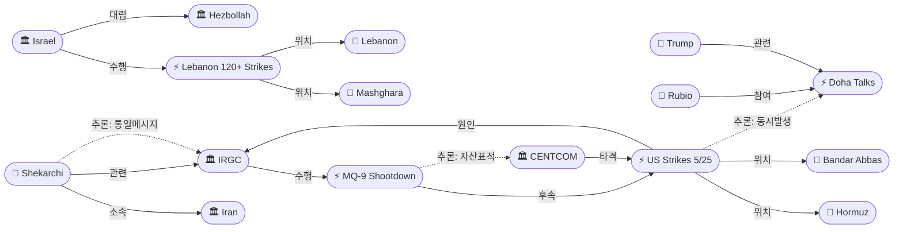
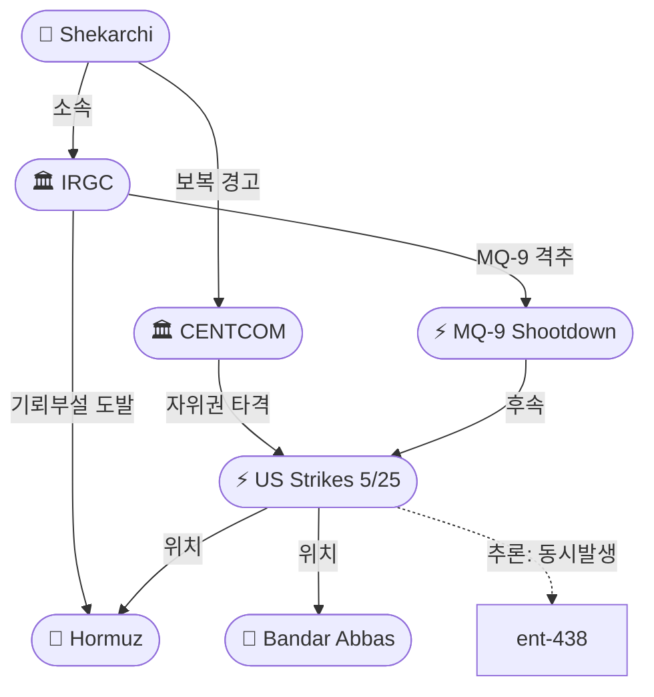
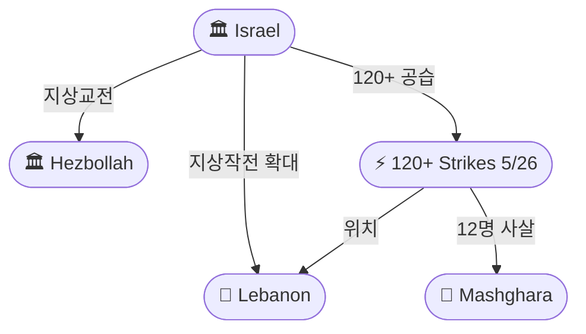

# 2026-05-27 2026 Iran War OSINT 일일 보고서

## 요약

Day 89. **MoU '단어 하나, 문장 하나'까지 좁혀진 협상 테이블 위에서, 총성이 울렸다.** 미 중부사령부(CENTCOM)는 5/25 호르무즈 해협에서 기뢰를 설치하던 IRGC 선박 2척과 밴더아바스의 지대공미사일(SAM) 기지를 '자위권 차원'으로 타격했다 — 4/8 휴전 이후 **두 번째 직접 교전**이다. IRGC는 즉각 **미군 MQ-9 리퍼 무인기를 격추**했다고 주장하며 **F-35 스텔스 전투기에도 사격**했다고 밝혔다(미확인). 이란군 대변인 **셰카르치**는 추가 공격 시 **"지역을 넘어서는 훨씬 더 심각한(far more severe)"** 보복을 경고하고, **전쟁 재개 시 이란 석유가 수출되지 못하면 어떤 석유도 지역을 떠나지 못할 것**이라고 명시적으로 위협했다. 한편 루비오 국무장관은 **"이견이 단어 하나, 문장 하나 수준"**이라며 **며칠 내 딜 가능**을 재확인했다. 레바논에서는 이스라엘이 **120회 이상 공습**(수주 만에 최대)으로 마슈하라에서 12명을 사살하고 지상작전을 안보구역 너머로 확대했다 — 6/2-3 워싱턴 회담 직전 최대 압박. 유가는 보복 위험에 **Brent $99.58(+3%)**로 반등했다.

## 주요 뉴스

### 1. CENTCOM 자위권 공습 — IRGC 기뢰부설 선박 2척·밴더아바스 SAM 기지 타격
- **출처:** [NBC News](https://www.nbcnews.com/world/iran/us-military-says-conducted-self-defense-strikes-targets-iran-rcna346839), [The Defense News](https://www.thedefensenews.com/US-Conducts-Self-Defense-Strikes-Targeting-IRGC-Boats-Laying-Mines-and-Missile-Site-in-Southern-Iran/), [Fox News](https://www.foxnews.com/live-news/iran-war-news-trump-strait-hormuz-blockade-ceasefire-peace-deal-may-25)
- **일시:** 2026-05-25
- **내용:** CENTCOM이 이란 남부에 자위권 공습을 시행했다. 표적은 **호르무즈 해협에서 해상 기뢰를 설치하던 IRGC 해군 선박 2척**과 **밴더아바스(호르무즈간 주)에서 미군 항공기를 추적하던 지대공미사일(SAM) 기지**다. CENTCOM 대변인 팀 호킨스 대위는 **"IRGC의 24시간 미사일·드론·소형보트 공격에 대응한 자위권 조치"**라고 밝혔다. 이는 **4월 8일 휴전 이후 두 번째 직접 교전**으로, 도하 MoU 협상이 진행되는 동시에 발생했다.
- **상태:** 신규
- **관련 엔티티:** CENTCOM, IRGC, Strait of Hormuz, Bandar Abbas

### 2. IRGC, 미군 MQ-9 리퍼 격추 주장 — F-35에도 사격
- **출처:** [Iran International](https://www.iranintl.com/en/202605268024), [Press TV](https://www.presstv.ir/Detail/2026/05/26/769308/IRGC-shoots-down-US-MQ-9-Reaper-drone-over-Persian-Gulf-warning-against-ceasefire-violations-), [Jerusalem Post](https://www.jpost.com/middle-east/iran-news/article-897319)
- **일시:** 2026-05-26
- **내용:** IRGC 방공부대가 **페르시아만 상공에서 미군 MQ-9 리퍼 무인기를 격추**했다고 주장했다. 또한 **이란 영공에 진입한 F-35 스텔스 전투기와 RQ-4 글로벌호크 정찰 무인기에 사격하여 이탈시켰다**고 밝혔다. **미국은 이를 확인하지 않았다.** IRGC는 **"휴전 위반에 대한 보복권은 정당하고 확실하다(legitimate and definitive)"**고 경고했다. MQ-9 리퍼는 약 $32M 가치의 대형 무인기로, 격추가 사실이라면 이란의 중·고고도 방공 능력 시위로 의미가 크다.
- **상태:** 신규
- **관련 엔티티:** IRGC, US Military, Iran

### 3. 이란군 대변인 셰카르치: '지역 넘어서는 더 심각한 보복' 경고 — 석유 차단 명시
- **출처:** [Press TV](https://www.presstv.ir/Detail/2026/05/26/769302/Iran), [Euronews](https://www.euronews.com/2026/05/26/us-military-says-it-has-launched-new-strikes-in-iran-including-on-missile-launch-sites), [CBS News](https://www.cbsnews.com/live-updates/iran-war-trump-us-strikes-peace-talks-ceasefire/)
- **일시:** 2026-05-26
- **내용:** 이란군 대변인 **아볼파즐 셰카르치**가 추가 공격 시 **"이전 전쟁보다 훨씬 더 심각한(far more severe)" 대응을 "지역을 넘어서(beyond the region)" 할 것**이라고 경고했다. 특히 **"전쟁이 재개되고 이란이 석유 수출을 차단당하면, 이란은 어떤 석유도 지역을 떠나지 못하게 할 것"**이라고 명시적으로 위협했다. 이는 5/9 모흐베르의 '호르무즈=원자폭탄' 독트린과 일관된 메시지로, 이란 군부의 최대 레버리지 전략이 호르무즈 완전 차단임을 재확인한다.
- **상태:** 신규
- **관련 엔티티:** Abolfazl Shekarchi, Iran, IRGC, Strait of Hormuz

### 4. 이스라엘 120+ 공습 — 마슈하라 12명 사살, 지상작전 확대, 추가 대대 투입
- **출처:** [NBC News](https://www.nbcnews.com/world/israel/israel-military-says-striking-hezbollah-sites-netanyahu-rcna346837), [Washington Times](https://www.washingtontimes.com/news/2026/may/26/israel-hezbollah-clashing-along-strategic-lebanese-river-following/), [Rappler](https://www.rappler.com/world/middle-east/israel-strikes-lebanon-expands-ground-operations-may-26-2026/)
- **일시:** 2026-05-26
- **내용:** 이스라엘이 **수주 만에 최대 규모인 120회 이상의 공습**을 감행했다. IDF는 남부 레바논과 동부 베카 밸리 일대의 **헤즈볼라 저장시설·지휘소·관측소 100개소 이상**을 타격했다고 밝혔다. 동부 레바논 마을 **마슈하라에서 12명이 사망**(가족 포함)했다. IDF는 **추가 대대를 레바논에 투입**하고 **지상작전을 안보구역 너머로 확대**했으며, **전략적 하천을 따라 헤즈볼라와 교전**했다. 레바논 보건부에 따르면 3월 2일 이후 **누적 사망자는 3,213명**, 부상 9,737명이다. 이 대규모 공세는 **6/2-3 워싱턴 4차 회담 3일 전**에 감행됐다.
- **상태:** 신규
- **관련 엔티티:** Israel, Hezbollah, Lebanon, Mashghara, Benjamin Netanyahu

### 5. 유가 Brent $99.58(+3%) — 보복 위험 프리미엄 재유입
- **출처:** [CNBC](https://www.cnbc.com/2026/05/26/oil-prices-today-brent-wti-iran-trump-hormuz.html)
- **일시:** 2026-05-26
- **내용:** **Brent 원유가 $99.58/bbl로 전일 대비 3% 이상 상승**했다. 5/26 $96.31 저점에서 반등한 것으로, 이란의 보복 위협과 IRGC MQ-9 격추 주장이 상승 요인이다. WTI는 메모리얼 데이 연휴 영향으로 $93.89(-3%)에 마감했다. 트럼프는 협상이 '순조롭다'고 하면서도 **"협상 실패 시 추가 공격이 뒤따를 수 있다"**고 경고했다.
- **상태:** 신규
- **관련 엔티티:** Strait of Hormuz, Donald Trump, Iran

### 6. 루비오: '며칠 내 딜 가능' — '이견이 단어, 문장 수준'
- **출처:** [Times of Israel](https://www.timesofisrael.com/liveblog_entry/rubio-says-iran-deal-still-possible-within-days-despite-us-strikes/), [Modern Diplomacy](https://moderndiplomacy.eu/2026/05/26/rubio-says-iran-deal-could-take-days-as-us-launches-fresh-strikes/)
- **일시:** 2026-05-26
- **내용:** 루비오 국무장관이 인도에서 기자들에게 **"협상단은 단어 하나, 문장 하나(a word, a sentence) 수준의 이견까지 좁혀졌다"**고 밝혔다. US 공습에도 불구하고 **"며칠 내(a few days) 딜이 가능하다"**고 재확인했다. 이란 외교부는 공습을 규탄하면서도 **협상은 계속될 것**이라고 밝혔다. 이는 MoU 텍스트가 사실상 완성 단계에 근접했음을 시사하며, 군사 교전과 외교 진전이 동시에 이뤄지는 '에스컬레이트 투 디에스컬레이트' 역학을 보여준다.
- **상태:** 신규
- **관련 엔티티:** Marco Rubio, Iran, Donald Trump

### 7. 수판 센터: MoU 근접 — 핵은 60일 협상 기간으로 이월
- **출처:** [Soufan Center](https://thesoufancenter.org/intelbrief-2026-may-26/)
- **일시:** 2026-05-26
- **내용:** 수판 센터 인텔브리프에 따르면, **이란 관리들도 트럼프의 MoU 근접 주장을 뒷받침**하고 있다. MoU 초안은 **호르무즈 통행의 조기 재개**를 규정하며, **핵 프로그램 관련 세부사항은 MoU 이후 60일 협상 기간**으로 이월된다. 수판 센터는 **"지역 지도자들이 미국에 타협을 압박했다 — 미국의 에스컬레이션이 이란 정권 항복으로 이어지지 않을 것이라고 판단하기 때문"**이라고 분석했다.
- **상태:** 신규
- **관련 엔티티:** Donald Trump, Iran, Strait of Hormuz, Nuclear Program

### 8. 루비오, 보좌관 니덤 NSC 요직 승진 — 이-레 회담 브로커
- **출처:** [Times of Israel](https://www.timesofisrael.com/liveblog-may-26-2026/)
- **일시:** 2026-05-26
- **내용:** 루비오 국무장관이 **이스라엘-레바논 회담 중개에 기여한 보좌관 마이클 니덤을 백악관 국가안보회의(NSC) 최고위직으로 승진**시켰다. 이 인사는 다중 트랙(이란 MoU + 이-레 회담) 외교의 연속성을 확보하고, 핵심 협상 설계자를 NSC에 배치하려는 의도로 해석된다.
- **상태:** 신규
- **관련 엔티티:** Marco Rubio, Michael Needham, Israel

### 9. 이란 '중대 위반(grave violation)' 항의 — 도하 회담은 지속
- **출처:** [CBS News](https://www.cbsnews.com/live-updates/iran-war-trump-us-strikes-peace-talks-ceasefire/), [NBC News](https://www.nbcnews.com/world/iran/iran-deal-trump-talks-war-nuclear-hormuz-rubio-rcna346781)
- **일시:** 2026-05-26
- **내용:** 이란 외교부는 미군 공습을 **"7주간 지속된 휴전의 중대한 위반(gross violation)"**이라고 규탄하며 **즉각 중단**을 요구했다. 호르무즈간 주에서 폭발음이 보고됐다. 그러나 이란은 **도하 회담을 중단하지 않았으며**, 외교 채널은 유지되고 있다. 이는 이란의 이원적 접근 — 군사적 비난 + 외교적 지속 — 을 보여준다.
- **상태:** 업데이트 ← 2026-05-26 "이란 딜 장애물 지속"
- **관련 엔티티:** Iran, CENTCOM, Doha Talks

### 10. 레바논 누적 사망 3,213명 — 전쟁 이후 최대 단일일 공습
- **출처:** [Rappler](https://www.rappler.com/world/middle-east/israel-strikes-lebanon-expands-ground-operations-may-26-2026/)
- **일시:** 2026-05-26
- **내용:** 레바논 보건부 발표 누적 사망자가 **3,213명**에 달했다(3월 2일 이후). 5/26의 120+ 공습은 **4/30 '검은 수요일'(28명) 이후 최대 규모 단일일 공습**이다. 부상 누적 9,737명.
- **상태:** 업데이트 ← 2026-05-26 "레바논 3명 사살"
- **관련 엔티티:** Lebanon, Israel, Hezbollah

## 지식그래프

### 오늘의 주요 관계

1. **호르무즈 에스컬레이션 사이클:** IRGC(ent-005) 기뢰 설치 → CENTCOM(ent-059) 자위권 공습(ent-445) → IRGC MQ-9 격추(ent-446) → 셰카르치(ent-444) '지역 넘어' 보복 경고 — 휴전 중 군사적 행동-반응 사이클이 작동 중.
2. **에스컬레이트 투 디에스컬레이트:** US 공습(ent-445)과 도하 회담(ent-438)이 동시 진행 — 루비오(ent-077) '단어, 문장 수준' 이견이라는 외교 진전과 군사 교전이 병존.
3. **레바논 재에스컬레이션:** 이스라엘(ent-004) 120+ 공습(ent-447), 마슈하라(ent-448) 12명 사살, 지상작전 확대 — 6/2-3 회담 전 최대 압박.
4. **이란 보복 독트린 강화:** 셰카르치(ent-444)의 석유 차단 위협은 모흐베르(ent-325)의 '호르무즈=원자폭탄' 독트린과 일관 — 이란 군부의 최종 레버리지.

### 전체 지식그래프 시각화

### 주제별 세부 그래프: 호르무즈 군사 교전 사이클

### 주제별 세부 그래프: 레바논 에스컬레이션

## 온톨로지 변경

| 변경 유형 | 대상 | 근거 |
|----------|------|------|
| 새 엔티티 | ent-444 Abolfazl Shekarchi (Person) | 이란군 대변인, '지역 넘어' 보복 + 석유 차단 위협 |
| 새 엔티티 | ent-445 US Self-Defense Strikes May 25 (Event) | CENTCOM 2차 자위권 공습 — IRGC 보트 2척 + 밴더아바스 SAM |
| 새 엔티티 | ent-446 IRGC MQ-9 Reaper Shootdown Claim (Event) | IRGC MQ-9 격추 주장, F-35·RQ-4 사격 주장 (미확인) |
| 새 엔티티 | ent-447 Israel Lebanon Escalation May 26 (Event) | 120+ 공습, 마슈하라 12명, 지상작전 확대 |
| 새 엔티티 | ent-448 Mashghara (Location) | 레바논 동부 베카 밸리 마을, 12명 사망 |
| 새 엔티티 | ent-449 Bandar Abbas (Location) | 이란 호르무즈간 주 항구도시, SAM 기지 타격 |
| 스키마 변경 | 없음 | 기존 클래스/관계로 모두 표현 가능 |

## 추론 결과

| 추론 | 신뢰도 | 근거 |
|------|--------|------|
| MQ-9 격추(ent-446) → 관련 → CENTCOM(ent-059) | 0.80 | US 공습 대응으로 CENTCOM 자산 표적 — 보복 행위 |
| Shekarchi(ent-444) → 관련 → IRGC(ent-005) | 0.80 | 군 대변인과 IRGC의 동시 보복 위협 — 통일된 군사기관 메시지 |
| US Strikes(ent-445) → 관련 → Doha Talks(ent-438) | 0.75 (잠정) | 동시 발생 — 에스컬레이트 투 디에스컬레이트 or 현장-외교 괴리 |

## 분석 및 평가

**협상과 총성의 동시주행.** 루비오가 '단어 하나, 문장 하나'까지 좁혀졌다고 밝힌 바로 그 시점에 CENTCOM이 이란 영토에서 IRGC 자산을 타격했다. 이는 양측 모두 '에스컬레이트 투 디에스컬레이트' 전략을 마지막까지 구사하고 있음을 보여준다. 미국은 이란의 기뢰 부설을 용인하지 않겠다는 의지를, 이란은 MQ-9 격추로 대응 능력을 과시했다. 그러나 핵심적으로 **양측 모두 도하 회담을 중단하지 않았다** — 이란 외교부는 공습을 '중대 위반'이라 규탄하면서도 협상 지속을 명시했다.

**셰카르치 독트린: 호르무즈 '자살 스위치'.** 셰카르치의 석유 차단 위협은 5/9 모흐베르의 '호르무즈=원자폭탄' 독트린과 정확히 일치한다. 이란 군부의 최종 레버리지는 자국 석유 수출이 차단되면 전 지역 석유 수출을 차단하겠다는 것이다. 이는 MoU 협상에서 호르무즈 재개방이 제재 해제와 필연적으로 묶이는 이유를 설명한다 — 이란은 자국 석유가 흐르지 않으면 호르무즈를 열지 않겠다는 것이다.

**레바논: 회담 전 최대 압박.** 이스라엘의 120+ 공습은 6/2-3 워싱턴 4차 회담 3일 전에 감행됐다. 마슈하라 12명 사살, 지상작전 안보구역 너머 확대, 추가 대대 투입은 이스라엘이 협상에서 최대한 유리한 입지를 확보하려는 전형적인 '회담 전 에스컬레이션' 패턴이다. 누적 3,213명 사망은 전쟁의 인도주의적 비용이 지속적으로 증가하고 있음을 보여준다.

**MoU 전망.** 루비오의 발언, 수판 센터의 독립 분석, 이란 관리들의 뒷받침을 종합하면 MoU 텍스트는 사실상 완성에 근접한 것으로 판단된다. 그러나 군사 교전이 어느 쪽이든 과잉 대응으로 이어지면 전체 협상 구도가 뒤집힐 수 있다 — 특히 IRGC의 F-35 교전 주장이 사실이라면 에스컬레이션 리스크는 현재 평가보다 높다.

## 추적 항목

| 항목 | 최초 보고 | 상태 | 최신 업데이트 |
|------|----------|------|-------------|
| MoU 서명 시점 | 2026-05-06 | 최종 단계 | 5/27: 루비오 '단어, 문장 수준' 이견, '며칠 내' 딜 |
| 이란 동결자산 해제 ($6B) | 2026-04-11 | **핵심 쟁점** | 5/27: 도하 회담 공습에도 지속 |
| 호르무즈 군사 교전 | 2026-04-07 | **에스컬레이션** | 5/27: CENTCOM 2차 공습, IRGC MQ-9 격추 주장, 보복 위협 |
| 레바논 전선 | 2026-04-17 | **재에스컬레이션** | 5/27: 120+ 공습(수주 최대), 마슈하라 12명, 지상작전 확대 |
| 하원 WPR 투표 | 2026-04-30 | 6월 연기 | 변동 없음 — 메모리얼 데이 후 실시 예정 |
| 유가 동향 | 2026-04-07 | 반등 | 5/27: Brent $99.58(+3%), 보복 프리미엄 재유입 |
| 아브라함 협정 정상화 | 2026-05-26 | 추적 중 | 변동 없음 — 지역 지도자 침묵 지속 |
| GOP 내부 분열 | 2026-05-25 | 지속 | 변동 없음 |

## 동향 요약

| 분류 | 상태 | 비고 |
|------|------|------|
| 미-이란 MoU | 최종 단계 (도하) | '단어, 문장' 수준 이견, 공습에도 불구 지속 |
| 호르무즈 해협 | **군사 교전 재발** | CENTCOM 2차 공습 + IRGC MQ-9 격추 + 보복 위협 |
| 레바논 전선 | **재에스컬레이션** | 120+ 공습, 지상작전 확대, 6/2-3 회담 전 압박 |
| 유가 | 반등 ($99.58/bbl) | 보복 프리미엄, 전주 $96 저점에서 복귀 |
| 미 의회 | WPR 6월 투표 예정 | 메모리얼 데이 휴회 중 |
| 이란 내부 | 군부 보복 위협 강화 | 셰카르치 '지역 넘어' + 석유 차단, 외교부는 협상 지속 |
| 이스라엘 | 레바논 최대 공세 | 마슈하라 12명, 대대 추가, 안보구역 너머 확대 |

## 출처 목록
1. [Iran accuses U.S. of violating ceasefire and threatens retaliation after new strikes](https://www.nbcnews.com/world/iran/us-military-says-conducted-self-defense-strikes-targets-iran-rcna346839) - NBC News, 2026-05-26
2. [U.S. Conducts Self-Defense Strikes Targeting IRGC Boats and Missile Site](https://www.thedefensenews.com/US-Conducts-Self-Defense-Strikes-Targeting-IRGC-Boats-Laying-Mines-and-Missile-Site-in-Southern-Iran/) - The Defense News, 2026-05-26
3. [IRGC says it downed US MQ-9 drone over Persian Gulf](https://www.iranintl.com/en/202605268024) - Iran International, 2026-05-26
4. [IRGC downs US MQ-9 Reaper drone over Persian Gulf](https://www.presstv.ir/Detail/2026/05/26/769308/IRGC-shoots-down-US-MQ-9-Reaper-drone-over-Persian-Gulf-warning-against-ceasefire-violations-) - Press TV, 2026-05-26
5. [IRGC claims it fired at F-35 and shot down MQ-9](https://www.jpost.com/middle-east/iran-news/article-897319) - Jerusalem Post, 2026-05-26
6. [Iran's response will be 'more severe' than previous wars](https://www.presstv.ir/Detail/2026/05/26/769302/Iran) - Press TV, 2026-05-26
7. [Gulf braces for Iran's response as US strikes shake peace talks](https://www.euronews.com/2026/05/26/us-military-says-it-has-launched-new-strikes-in-iran-including-on-missile-launch-sites) - Euronews, 2026-05-26
8. [Israeli strike on Mashghara kills 12, Israel calls up more troops](https://www.nbcnews.com/world/israel/israel-military-says-striking-hezbollah-sites-netanyahu-rcna346837) - NBC News, 2026-05-26
9. [Israel and Hezbollah clash along strategic Lebanese river](https://www.washingtontimes.com/news/2026/may/26/israel-hezbollah-clashing-along-strategic-lebanese-river-following/) - Washington Times, 2026-05-26
10. [Israel pounds Lebanon, expands ground operations past security zone](https://www.rappler.com/world/middle-east/israel-strikes-lebanon-expands-ground-operations-may-26-2026/) - Rappler, 2026-05-26
11. [Brent oil jumps 3% after Iran vows retaliation](https://www.cnbc.com/2026/05/26/oil-prices-today-brent-wti-iran-trump-hormuz.html) - CNBC, 2026-05-26
12. [Rubio says Iran deal still possible within days despite US strikes](https://www.timesofisrael.com/liveblog_entry/rubio-says-iran-deal-still-possible-within-days-despite-us-strikes/) - Times of Israel, 2026-05-26
13. [Rubio Says Iran Deal Could Take Days as US Launches Fresh Strikes](https://moderndiplomacy.eu/2026/05/26/rubio-says-iran-deal-could-take-days-as-us-launches-fresh-strikes/) - Modern Diplomacy, 2026-05-26
14. [U.S. and Iran Close in on a Framework Accord](https://thesoufancenter.org/intelbrief-2026-may-26/) - Soufan Center, 2026-05-26
15. [Rubio promotes aide to top NSC post](https://www.timesofisrael.com/liveblog-may-26-2026/) - Times of Israel, 2026-05-26
16. [Iran accuses U.S. of 'grave violation' of ceasefire](https://www.cbsnews.com/live-updates/iran-war-trump-us-strikes-peace-talks-ceasefire/) - CBS News, 2026-05-26
17. [Iran says no deal 'imminent' despite progress](https://www.nbcnews.com/world/iran/iran-deal-trump-talks-war-nuclear-hormuz-rubio-rcna346781) - NBC News, 2026-05-26
18. [US launches 'self-defense strikes' on Iran](https://www.foxnews.com/live-news/iran-war-news-trump-strait-hormuz-blockade-ceasefire-peace-deal-may-25) - Fox News, 2026-05-25
19. [U.S. Launches Defensive Strikes in Iran](https://theaviationist.com/2026/05/26/u-s-launches-defensive-strikes-in-iran/) - The Aviationist, 2026-05-26
20. [Iran Claims It Downed U.S. Drone, Threatens Devastating Response](https://www.breitbart.com/middle-east/2026/05/26/iran-claims-it-downed-u-s-drone-threatens-devastating-response-next-time-u-s-violates-ceasefire/) - Breitbart, 2026-05-26
21. [이란 혁명수비대 '美 MQ-9 무인기 격추'](https://www.fnnews.com/news/202605261710442958) - 파이낸셜뉴스, 2026-05-26
22. [미 중부사령부 '이란 남부에 자위권 차원 공습'](https://www.voakorea.com/a/us-military-says-it-carried-out-2nd-self-defense-strikes-on-southern-iran-since-start-of-truce-with-iranian-regime-on-april-8-052526/8153976.html) - VOA Korea, 2026-05-26
23. [협상 와중에 호르무즈 인근서 이란 때린 미국](https://www.fnnews.com/news/202605261130274505) - 파이낸셜뉴스, 2026-05-26
24. [미군, 자위권 차원에서 이란 남부 공습](https://www.mt.co.kr/world/2026/05/26/2026052608030137965) - 머니투데이, 2026-05-26
25. [What to Know About the Abraham Accords as Trump Seeks Iran Deal](https://time.com/article/2026/05/26/abraham-accords-trump-peace-deal-us-israel-iran-war/) - Time, 2026-05-26
26. [Israeli strike on Mashghara kills 12](https://www.inquirer.com/news/nation-world/israel-airstrike-lebanon-hezbollah-20260526.html) - Philadelphia Inquirer, 2026-05-26
