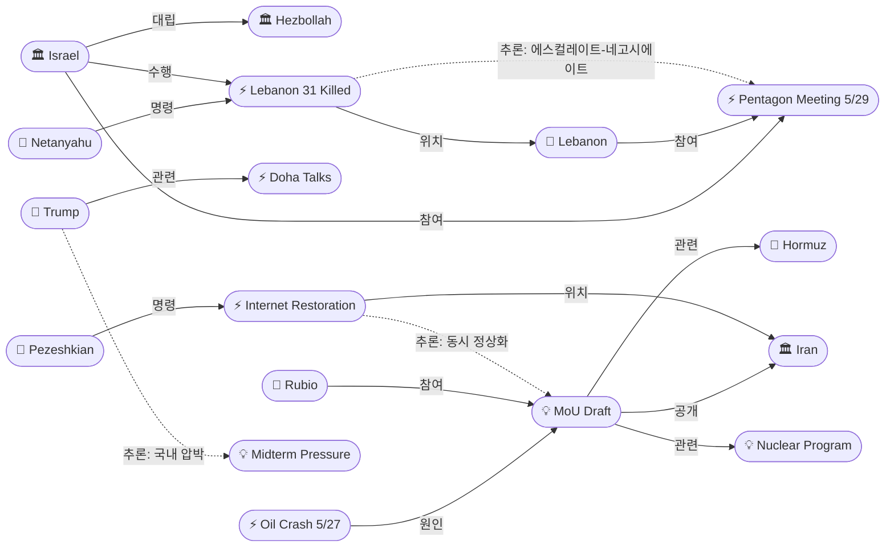
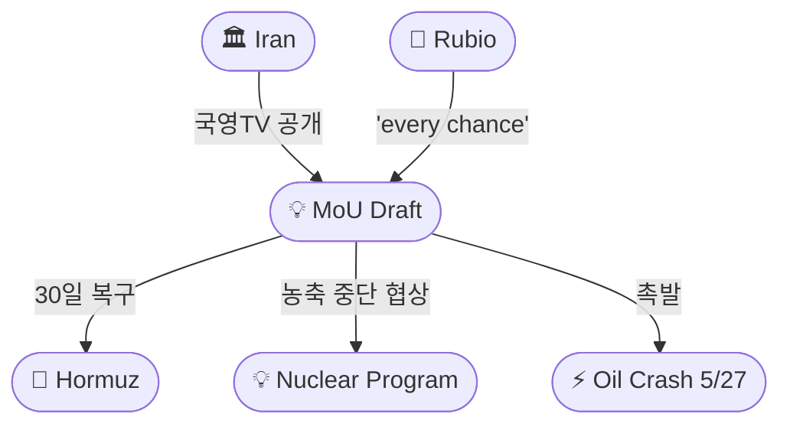
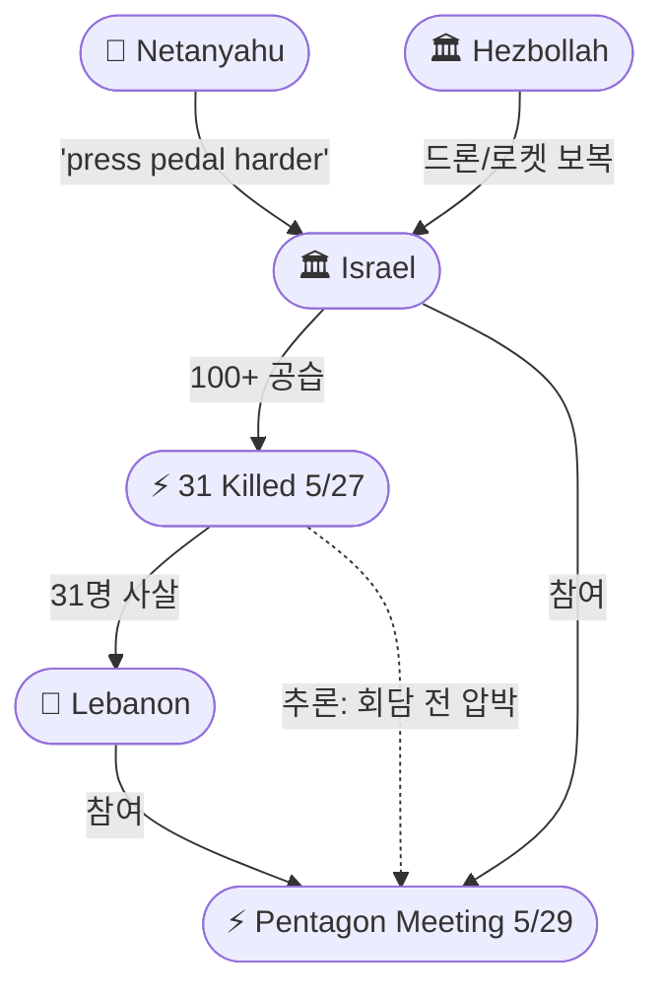

# 2026-05-28 2026 Iran War OSINT 일일 보고서

## 요약

Day 90. **초안은 나왔고, 시장은 믿기 시작했다.** 이란 국영TV가 미-이란 MoU 초안 세부사항을 공개하자 — 호르무즈 해협 30일 내 전쟁 이전 수준 복구, 미군 철수, 봉쇄 해제 — 유가가 **WTI $88.68(-5%), Brent $94.29(-5%)**로 급락하여 **4월 이후 최저치**를 기록했다. 트럼프는 Day 90 각료회의에서 이란이 **"협상 동력이 바닥(negotiating on fumes)"**이라 선언하며 **"중간선거가 전략에 영향을 주지 않을 것"**이라 못 박았다. 한편 레바논에서는 이스라엘이 **100+ 공습으로 31명을 사살**(아동 4명 포함) — **4/16 휴전 이후 최다 사상자**를 기록했으며, 네타냐후가 **"페달을 더 세게 밟으라(press pedal harder)"**고 명령했다. 이란은 **88일간의 인터넷 차단을 부분 해제**하여 전쟁 이후 첫 국내 정상화 신호를 보냈다. 내일(5/29) **펜타곤에서 이스라엘-레바논 군사 조정 회의**가 열리고, 6/2-3 워싱턴 4차 정치 회담이 예정되어 있다.

## 주요 뉴스

### 1. 유가 5%+ 급락 — MoU 초안 공개가 촉발, WTI $88.68·Brent $94.29
- **출처:** [CNBC](https://www.cnbc.com/2026/05/27/oil-price-today-iran-war-strait-hormuz.html), [Yahoo Finance](https://finance.yahoo.com/markets/article/oil-prices-fall-after-iran-state-media-says-deal-with-us-would-include-restored-hormuz-shipping-144319788.html)
- **일시:** 2026-05-27
- **내용:** **WTI 원유가 5%+ 급락하여 $88.68/bbl**, **Brent는 $94.29/bbl**로 마감했다 — **4월 이후 최저치**이며 5월 들어 **16% 이상 하락**했다. 급락은 5/27 오전 9시(ET) 이란 국영TV가 **MoU 초안 세부사항을 공개**한 직후 시작됐다: 이란이 **30일 내 호르무즈 통행을 전쟁 이전 수준으로 복구**하고, 미국이 **군 철수 및 해상 봉쇄를 해제**한다는 내용이다. 루비오 국무장관의 **"외교 루트에 모든 기회를 줄 것(give it every chance to succeed)"** 발언도 하락을 가속했다.
- **상태:** 신규
- **관련 엔티티:** Strait of Hormuz, Marco Rubio, Donald Trump, Iran

### 2. 이란 국영TV MoU 초안 세부사항 공개 — 30일 호르무즈 복구, 14개항
- **출처:** [Yahoo Finance](https://finance.yahoo.com/markets/article/oil-prices-fall-after-iran-state-media-says-deal-with-us-would-include-restored-hormuz-shipping-144319788.html), [서울경제](https://www.sedaily.com/article/20048992)
- **일시:** 2026-05-27
- **내용:** 이란 국영TV가 보도한 MoU 초안의 주요 조항: (1) **이란이 30일 내 호르무즈 해협 통행을 전쟁 이전 수준으로 복구** (2) **미국이 이란 인근 군사력 철수 및 봉쇄 해제** (3) **이란의 핵무기 개발 금지 서약** (4) **우라늄 농축 중단 및 고농축우라늄(HEU) 비축량 처리 협상** (5) **60일 내 최종 합의 도달**. 14개항 문서로 확인됐다. 트럼프 측은 딜이 **"95% 완료"**라고 주장했다.
- **상태:** 신규
- **관련 엔티티:** Iran, Strait of Hormuz, Nuclear Program, Donald Trump

### 3. 트럼프 'negotiating on fumes' — Day 90 각료회의, 중간선거 불영향 선언
- **출처:** [NPR](https://www.npr.org/2026/05/27/nx-s1-5836202/trump-cabinet-meeting), [PBS](https://www.pbs.org/newshour/politics/watch-live-trump-holds-cabinet-meeting-during-negotiations-to-end-the-iran-war), [1News](https://www.1news.co.nz/2026/05/28/trump-iran-negotiating-on-fumes-midterms-wont-sway-war-strategy/)
- **일시:** 2026-05-27
- **내용:** 전쟁 발발 90일을 맞아 트럼프가 각료회의에서 이란이 **"협상 동력이 바닥(negotiating on fumes)"**이라 선언했다. 핵심 발언: **"아직 만족스럽지 않지만 만족하게 될 것이다. 아니면 일을 끝내야 한다(finish the job)"**. 11월 **중간선거**가 전략에 영향을 주지 않을 것이라 명시했다. 또한 **러시아나 중국이 이란의 HEU를 인수하는 것은 용납할 수 없다**고 밝혀 핵 쟁점에 새 제약을 추가했다. 이란 딜에 **아브라함 협정 가입을 '필수(mandatory)'로 연계**하겠다는 기존 입장도 재확인했다.
- **상태:** 신규
- **관련 엔티티:** Donald Trump, Iran, Russia, China

### 4. 이스라엘 100+ 공습으로 레바논 31명 사살 — 4/16 이후 최다, 네타냐후 'press pedal harder'
- **출처:** [UPI](https://www.upi.com/Top_News/World-News/2026/05/27/Lebanon-deadly-Israeli-airstrikes-target-south/3711779869904/), [Al Jazeera](https://www.aljazeera.com/video/newsfeed/2026/5/27/israel-intensifies-attacks-in-lebanon-killing-at-least-31-people), [Times of Israel](https://www.timesofisrael.com/netanyahu-orders-idf-to-intensify-blows-against-hezbollah-amid-surge-in-drone-attacks/)
- **일시:** 2026-05-27
- **내용:** 이스라엘이 **4/16 휴전 이후 가장 치명적인 야간 폭격**을 감행하여 **최소 31명이 사망**(아동 4명, 여성 3명 포함)하고 40명이 부상했다. IDF는 남부·동부 레바논 전역에서 **100개소 이상의 헤즈볼라 무기고·지휘소·관측소**를 타격했다. 네타냐후는 헤즈볼라 드론 공격 급증에 대응하여 IDF에 **"페달을 더 세게 밟으라(press the pedal even harder)"**고 명령했으며, **미국 관리는 더 큰 규모의 작전을 승인**했다. 헤즈볼라는 이스라엘 북부 군 시설에 드론·로켓으로 보복했다. 이는 **5/29 펜타곤 회의와 6/2-3 워싱턴 회담 직전의 최대 압박**이다.
- **상태:** 신규
- **관련 엔티티:** Israel, Lebanon, Hezbollah, Benjamin Netanyahu

### 5. 이란 인터넷 88일 만에 부분 복구 — 현대 역사 최장 차단 해제
- **출처:** [Middle East Eye](https://www.middleeasteye.net/live-blog/live-blog-update/iran-partially-restores-internet-after-88-day-blackout), [UPI](https://www.upi.com/Top_News/World-News/2026/05/26/iran-internet-restored-88-days/9231779817270/), [경향신문](https://www.khan.co.kr/article/202605271630001), [CNN](https://www.cnn.com/2026/05/26/middleeast/iranians-emerge-online-with-skepticism-defiance-after-months-of-blackout-intl-latam)
- **일시:** 2026-05-26~27
- **내용:** 넷블록스(NetBlocks)가 이란의 **88일(2,093시간) 인터넷 차단** 이후 부분 복구를 확인했다 — **현대 역사상 최장 국가 인터넷 셧다운**이다. 페제시키안 대통령이 복구를 명령했으나, **행정법원(Administrative Court of Justice)이 대통령 명령 이행을 부분 중단**시켰다. 트래픽은 차단 전 수준의 약 **10%**에 불과하다. 차단으로 이란 경제는 **일 $30~40M 손실**을 입었다. 트럼프는 인터넷 복구를 **"이란이 딜을 원한다는 신호"**로 해석했다. 이란인들은 회의와 분노를 동시에 표출하며 온라인에 복귀했다.
- **상태:** 신규
- **관련 엔티티:** Iran, Masoud Pezeshkian, NetBlocks

### 6. 펜타곤 군사 조정 회의 5/29 — 이-레 안보 트랙 신설
- **출처:** [The New Arab](https://www.newarab.com/news/lebanon-braces-pentagon-talks-over-hezbollah-disarmament), [Al Arabiya](https://english.alarabiya.net/News/middle-east/2026/05/15/us-announces-45day-extension-of-lebanonisrael-ceasefire-launches-pentagon-talks)
- **일시:** 2026-05-29 (예정)
- **내용:** 내일(5/29) **레바논·이스라엘 군 장교들이 미국 중재 하에 펜타곤에서 군사 조정 회의**를 개최한다. 의제: **헤즈볼라 무장해제, 이스라엘 남레바논 철수, 레바논군 배치, 미국 감독 하 합동작전실 구성**. 이는 정치 회담(6/2-3 워싱턴 4차)과 **병행하는 안보 트랙**의 시작으로, 4/16 휴전의 **45일 연장**(5/15 발표)에 따른 것이다. 레바논은 이스라엘 철수를 선결 조건으로, 이스라엘은 헤즈볼라 무장해제를 선결 조건으로 요구하여 회의 전부터 입장 차가 크다.
- **상태:** 신규
- **관련 엔티티:** Lebanon, Israel, Hezbollah, US Military

### 7. CNN: 트럼프에게 이란전 좋은 출구가 없을 수 있다
- **출처:** [CNN](https://www.cnn.com/2026/05/27/politics/american-sentiment-iran-war-peace-deal)
- **일시:** 2026-05-27
- **내용:** CNN 분석: 전쟁은 공화당에게 **정치적으로 불인기**하며, **GOP 매파(위커/그레이엄/크루즈)는 딜이 이란에 유리하다고 비판**하고, 일반 공화당 유권자는 전쟁 피로를 느끼고 있다. 트럼프가 **자신이 폐기한 오바마 JCPOA와 유사한 합의**에 도달할 경우 정치적 공격에 취약해진다. 동시에 전쟁 지속도 중간선거에 부담 — **진퇴양난(no good way out)** 구도.
- **상태:** 신규
- **관련 엔티티:** Donald Trump, Iran

### 8. 이란전 90일: 핵·제재완화 협상 난항 (파이낸셜뉴스 종합)
- **출처:** [파이낸셜뉴스](https://www.fnnews.com/news/202605271603407018)
- **일시:** 2026-05-27
- **내용:** 이란전 발발 90일 종합 분석. **60일 휴전 연장에는 사실상 합의**했으나, **핵(HEU 처리 방식)과 제재 완화(동결자산 해제 범위)**에서 양측 입장 차이가 크다. 이란은 핵 의제를 60일 협상 기간으로 이월하려 하고, 미국은 MoU 단계에서 선결 조건을 유지. 호르무즈 무료 개방·기뢰 제거에는 이견이 없으나, **이란이 호르무즈 '관리권' 유지를 주장하고 미국은 완전 자유 통행을 요구**하는 점이 잔존 쟁점.
- **상태:** 신규
- **관련 엔티티:** Iran, Donald Trump, Strait of Hormuz, Nuclear Program

## 지식그래프

### 오늘의 주요 관계

1. **MoU 초안 공개 → 유가 급락:** 이란 국영TV의 초안 공개(ent-451)가 유가 5%+ 급락(ent-450)을 직접 촉발 — 시장이 딜 임박을 가격에 반영한 첫 번째 대규모 반응.
2. **레바논 에스컬레이션 → 펜타곤 회의:** 네타냐후 'press pedal harder' 명령 → 31명 사살(ent-452) → 5/29 펜타곤 회의(ent-454) — 에스컬레이트-투-네고시에이트 사이클.
3. **이란 정상화 신호:** 인터넷 복구(ent-453)와 MoU 초안 공개(ent-451) 동시 발생 — 이란 내부의 전쟁 모드 전환 신호 (잠정).
4. **트럼프 국내 정치 압박:** 'negotiating on fumes' 수사와 중간선거 불영향 선언(ent-455) — 역설적으로 국내 압박 인지를 시사.

### 전체 지식그래프 시각화

### 주제별 세부 그래프: MoU 초안 공개 & 시장 반응

### 주제별 세부 그래프: 레바논 에스컬레이션 사이클

## 온톨로지 변경

| 변경 유형 | 대상 | 근거 |
|----------|------|------|
| 새 엔티티 | ent-450 Oil Price Crash May 27 (Event) | WTI $88.68(-5%), Brent $94.29(-5%) — MoU 초안 공개 후 급락 |
| 새 엔티티 | ent-451 MoU Draft Publication (Concept) | 이란 국영TV 14개항 MoU 초안 세부사항 공개 |
| 새 엔티티 | ent-452 Lebanon 31 Killed May 27 (Event) | 4/16 이후 최대 사상자, 100+ 공습 |
| 새 엔티티 | ent-453 Iran Internet Restoration (Event) | 88일(2,093시간) 차단 해제, 현대 역사 최장 |
| 새 엔티티 | ent-454 Pentagon Military Coordination Meeting (Event) | 5/29 이-레 군사 조정 회의 — 안보 트랙 신설 |
| 새 엔티티 | ent-455 Midterm Elections Pressure (Concept) | 트럼프 '중간선거 불영향' 선언, CNN '좋은 출구 없음' 분석 |
| 기존 업데이트 | ent-001 (Trump) | 'negotiating on fumes', 중간선거, HEU 러/중 거부 |
| 기존 업데이트 | ent-004 (Israel) | 100+ 공습 31명 사살, 'press pedal harder' |
| 기존 업데이트 | ent-031 (Netanyahu) | 'press pedal harder' 명령 |
| 기존 업데이트 | ent-050 (Lebanon) | 31명 추가 사망 |
| 기존 업데이트 | ent-077 (Rubio) | 'every chance to succeed' |
| 기존 업데이트 | ent-149 (Pezeshkian) | 인터넷 복구 명령 |
| 스키마 변경 | 없음 | 기존 클래스/관계로 모두 표현 가능 |

## 추론 결과

| 추론 | 신뢰도 | 근거 |
|------|--------|------|
| MoU 초안 공개(ent-451) → 원인 → 유가 급락(ent-450) | 0.95 | 이란 국영TV 공개 직후 9AM ET 유가 급락 — CNBC/Yahoo 인과 보도 |
| 인터넷 복구(ent-453) → 관련 → MoU 초안(ent-451) | 0.72 (잠정) | 동시 정상화 신호 — 전쟁 모드 전환 가능성, 직접 인과 불확실 |
| 레바논 31명(ent-452) → 관련 → 펜타곤 회의(ent-454) | 0.75 | 회담 직전 최대 에스컬레이션 — 전형적 에스컬레이트-투-네고시에이트 |
| 트럼프(ent-001) → 관련 → 중간선거 압박(ent-455) | 0.80 | 명시적 '불영향' 선언 = 역설적 압박 인지, CNN 분석 보강 |

## 분석 및 평가

**시장이 먼저 믿었다.** 이란 국영TV의 MoU 초안 공개와 루비오의 '모든 기회' 발언이 유가를 5% 이상 끌어내렸다. WTI $88.68은 4월 이후 최저이며, 5월 전체로는 16% 이상 하락했다. 이는 시장이 **딜 성사 확률을 50%를 넘어서는 수준으로 가격에 반영하기 시작했음**을 의미한다. 그러나 물리적 원유 가격과 선물 가격의 괴리는 여전히 존재하며, 딜 결렬 시 급반등 리스크가 크다.

**트럼프의 Day 90 포지셔닝.** 'negotiating on fumes' 수사는 이란을 약자로 그리려는 의도적 프레이밍이다. 그러나 세 가지 새 제약이 드러났다: (1) **러시아/중국의 HEU 인수 거부** — 핵 쟁점에서 제3국 옵션을 사실상 차단, (2) **중간선거 불영향 명시적 선언** — 역설적으로 정치 압박을 인지하고 있음을 시사, (3) **아브라함 협정 연계 재확인** — 이란 딜의 복잡성을 자발적으로 증가시킴. CNN의 '좋은 출구가 없다' 분석은 이 딜레마를 정확히 포착한다.

**레바논: 회담 전 최대 에스컬레이션.** 5/26 120+ 공습(12명) → 5/27 100+ 공습(31명)으로 **이틀 연속 100+ 공습 체제**에 돌입했다. 네타냐후의 'press pedal harder'는 5/29 펜타곤 군사 회의와 6/2-3 워싱턴 회담 직전에 의도적으로 설정된 군사 압박이다. 미국 관리가 '더 큰 작전'을 승인한 것은 미국도 이스라엘의 레바논 레버리지를 용인하고 있음을 시사한다 — 이란 MoU와의 연계 가능성.

**이란 정상화 신호의 이중 해석.** 88일 인터넷 차단 해제는 이란 내부의 전쟁 모드 이완으로 읽을 수 있다. 그러나 행정법원의 부분 중단 명령은 **보수파 사법부-개혁파 대통령 간 긴장**을 드러낸다. 트래픽이 10%에 불과한 점도 '복구'라기보다 '통제된 완화'에 가깝다. 트럼프가 이를 '딜 의지의 신호'로 해석한 것은 레토릭적 활용이며, 실제 이란 내부 역학은 더 복잡하다.

## 추적 항목

| 항목 | 최초 보고 | 상태 | 최신 업데이트 |
|------|----------|------|-------------|
| MoU 서명 시점 | 2026-05-06 | **최종 단계** | 5/28: 국영TV 초안 공개, '95% 완료', 유가 급락으로 시장 반영 |
| 이란 동결자산 해제 | 2026-04-11 | **핵심 쟁점** | 변동 없음 — 카타르 $6B 해제 조건 여전 |
| 호르무즈 군사 교전 | 2026-04-07 | 소강 | 5/27: 직접 교전 없음, MoU 초안에 30일 복구 명시 |
| 레바논 전선 | 2026-04-17 | **에스컬레이션 최정점** | 5/28: 31명 사살(4/16 이후 최대), 'press pedal harder', 이틀 연속 100+ 공습 |
| 펜타곤 군사 회의 | 2026-05-28 | **신규** | 5/29 이-레 군 장교 펜타곤 회의, 6/2-3 회담 사전 조정 |
| 이란 인터넷 복구 | 2026-05-28 | **신규** | 88일 차단 부분 해제, 트래픽 10%, 행정법원 부분 중단 |
| 유가 동향 | 2026-04-07 | **급락** | 5/28: WTI $88.68(-5%), Brent $94.29(-5%), 4월 이후 최저 |
| 하원 WPR 투표 | 2026-04-30 | 6월 연기 | 변동 없음 — 메모리얼 데이 후 실시 예정 |
| GOP 내부 분열 | 2026-05-25 | 심화 | 5/28: CNN '좋은 출구 없음', 트럼프 중간선거 불영향 선언 |
| 아브라함 협정 정상화 | 2026-05-26 | 정체 | 5/28: 트럼프 재확인, 지역 지도자 침묵 지속 |

## 동향 요약

| 분류 | 상태 | 비고 |
|------|------|------|
| 미-이란 MoU | **초안 공개, 시장 반영** | 국영TV 14개항 공개, '95% 완료', 유가 5%+ 급락 |
| 호르무즈 해협 | MoU 30일 복구 명시 | 초안에 전쟁 이전 수준 30일 내 복구 포함 |
| 레바논 전선 | **에스컬레이션 최정점** | 이틀 연속 100+ 공습, 31명(4/16 이후 최대), 5/29 펜타곤 회의 |
| 유가 | **급락** (WTI $88.68) | MoU 초안 + 루비오 발언, 4월 이후 최저, 5월 -16% |
| 이란 내부 | **정상화 신호** | 88일 인터넷 차단 해제, 보수파-개혁파 긴장 |
| 미 의회 | WPR 6월 투표 예정 | 변동 없음 |
| 트럼프 정치 | **진퇴양난** | '좋은 출구 없음' 분석, 중간선거 압박+매파 비판 |
| 이-레 외교 | **안보 트랙 신설** | 5/29 펜타곤 군사 회의, 6/2-3 워싱턴 4차 |

## 출처 목록
1. [Oil prices fall more than 5% after Rubio says US will give Iran talks 'every chance to succeed'](https://www.cnbc.com/2026/05/27/oil-price-today-iran-war-strait-hormuz.html) - CNBC, 2026-05-27
2. [Oil prices fall after Iran state media says deal with US would include restored Hormuz shipping](https://finance.yahoo.com/markets/article/oil-prices-fall-after-iran-state-media-says-deal-with-us-would-include-restored-hormuz-shipping-144319788.html) - Yahoo Finance, 2026-05-27
3. [Trump says Iran 'negotiating on fumes,' insists midterms won't impact his war strategy](https://www.npr.org/2026/05/27/nx-s1-5836202/trump-cabinet-meeting) - NPR, 2026-05-27
4. [WATCH: In Cabinet meeting, Trump says Iran 'negotiating on fumes'](https://www.pbs.org/newshour/politics/watch-live-trump-holds-cabinet-meeting-during-negotiations-to-end-the-iran-war) - PBS, 2026-05-27
5. [Trump: Iran 'negotiating on fumes', midterms won't sway war strategy](https://www.1news.co.nz/2026/05/28/trump-iran-negotiating-on-fumes-midterms-wont-sway-war-strategy/) - 1News, 2026-05-28
6. [Lebanon: 31 killed, 40 injured as Israel intensifies strikes on Hezbollah](https://www.upi.com/Top_News/World-News/2026/05/27/Lebanon-deadly-Israeli-airstrikes-target-south/3711779869904/) - UPI, 2026-05-27
7. [Israel 'intensifies' attacks in Lebanon killing at least 31 people](https://www.aljazeera.com/video/newsfeed/2026/5/27/israel-intensifies-attacks-in-lebanon-killing-at-least-31-people) - Al Jazeera, 2026-05-27
8. [Netanyahu orders IDF to 'intensify blows' against Hezbollah amid surge in drone attacks](https://www.timesofisrael.com/netanyahu-orders-idf-to-intensify-blows-against-hezbollah-amid-surge-in-drone-attacks/) - Times of Israel, 2026-05-27
9. [Israel to 'press pedal even harder' in Lebanon in response to drone fears](https://www.thenationalnews.com/news/mena/2026/05/26/israel-to-press-pedal-even-harder-in-lebanon-in-response-to-drone-fears/) - The National, 2026-05-27
10. [Israel Escalates Lebanon Offensive Despite Ceasefire, 31 Killed](https://www.outlookindia.com/international/israel-escalates-lebanon-offensive-despite-ceasefire-31-killed) - Outlook India, 2026-05-27
11. [Israeli Strikes in Southern Lebanon Kill at Least 31 People](https://www.democracynow.org/2026/5/27/headlines/israeli_strikes_in_southern_lebanon_kill_at_least_31_people) - Democracy Now, 2026-05-27
12. [Iran partially restores internet after 88-day blackout](https://www.middleeasteye.net/live-blog/live-blog-update/iran-partially-restores-internet-after-88-day-blackout) - Middle East Eye, 2026-05-27
13. [Iran's Internet restored for some after 88 days of blackout](https://www.upi.com/Top_News/World-News/2026/05/26/iran-internet-restored-88-days/9231779817270/) - UPI, 2026-05-26
14. [Iranians emerge online with skepticism and defiance after months of blackout](https://www.cnn.com/2026/05/26/middleeast/iranians-emerge-online-with-skepticism-defiance-after-months-of-blackout-intl-latam) - CNN, 2026-05-27
15. [Iran's internet flickers back on despite judicial halt](https://www.euronews.com/2026/05/26/irans-internet-flickers-back-on-despite-judicial-halt-reports-claim) - Euronews, 2026-05-26
16. [3달만 연결된 이란 인터넷···"완전한 인터넷망 복구, 종전 협상에 달려"](https://www.khan.co.kr/article/202605271630001) - 경향신문, 2026-05-27
17. [이란, 88일 만에 인터넷 빗장 풀었다](https://www.edaily.co.kr/News/Read?newsId=03056966645453184&mediaCodeNo=257) - 이데일리, 2026-05-27
18. [이란, 국제 인터넷 접속 전면 복구](https://www.fnnews.com/news/202605270239238652) - 파이낸셜뉴스, 2026-05-27
19. [Lebanon braces for Pentagon talks over Hezbollah disarmament](https://www.newarab.com/news/lebanon-braces-pentagon-talks-over-hezbollah-disarmament) - The New Arab, 2026-05-27
20. [US announces 45-day extension of Lebanon-Israel ceasefire, launches Pentagon talks](https://english.alarabiya.net/News/middle-east/2026/05/15/us-announces-45day-extension-of-lebanonisrael-ceasefire-launches-pentagon-talks) - Al Arabiya, 2026-05-15
21. ['60일 휴전' 물꼬 텄지만…핵·제재완화 협상 난항](https://www.fnnews.com/news/202605271603407018) - 파이낸셜뉴스, 2026-05-27
22. [해협 봉쇄 해제 담긴 MOU 초안 공개…60일 내 최종 합의](https://www.sedaily.com/article/20048992) - 서울경제, 2026-05-27
23. [CNN analysis: Trump might not have a good way out of the Iran war](https://www.cnn.com/2026/05/27/politics/american-sentiment-iran-war-peace-deal) - CNN, 2026-05-27
24. [Live updates: Iran war; US military carries out new strikes in Iran](https://www.cnn.com/2026/05/27/world/live-news/iran-war-us-news) - CNN, 2026-05-27
25. [Iran war live: Trump says no one will control Strait of Hormuz](https://www.aljazeera.com/news/liveblog/2026/5/27/iran-war-live-israel-kills-31-in-lebanon-tehran-blasts-us-truce-violation) - Al Jazeera, 2026-05-27
26. [Iran Restoring Internet, With Limits, After 88-Day Blackout](https://www.rferl.org/a/iran-war-us-hormuz-oil-blockade-gulf-israel/33640284.html) - RFE/RL, 2026-05-27
27. [도하 협상 속 美·이란 국지적 충돌…美내부반발 더해져 '혼돈'](https://www.fnnews.com/news/202605261047441114) - 파이낸셜뉴스, 2026-05-26
28. [Inside the Pentagon Plan to Reshape Lebanon-Israel Security Talks](https://en.kataeb.org/articles/inside-the-pentagon-plan-to-reshape-lebanon-israel-security-talks) - Kataeb, 2026-05-27
