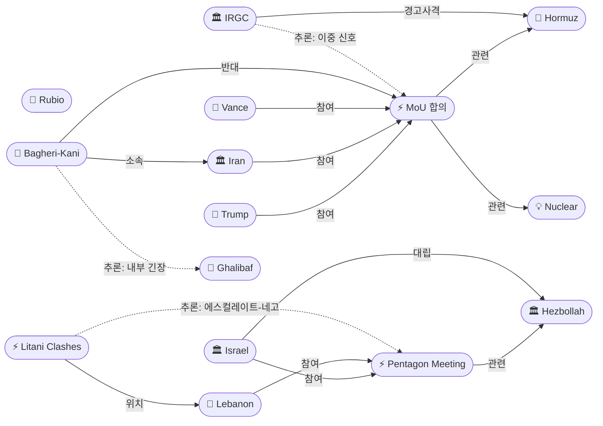
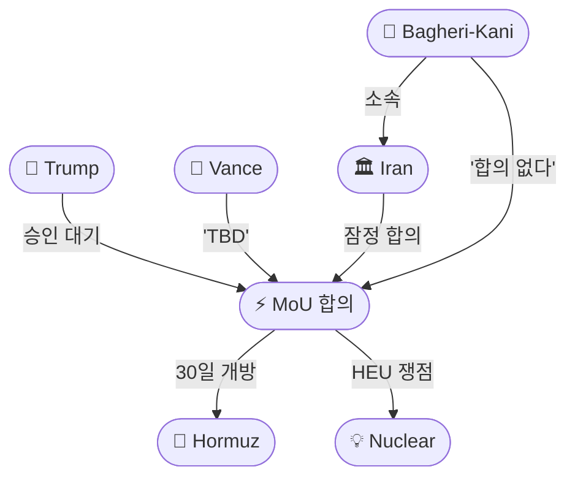
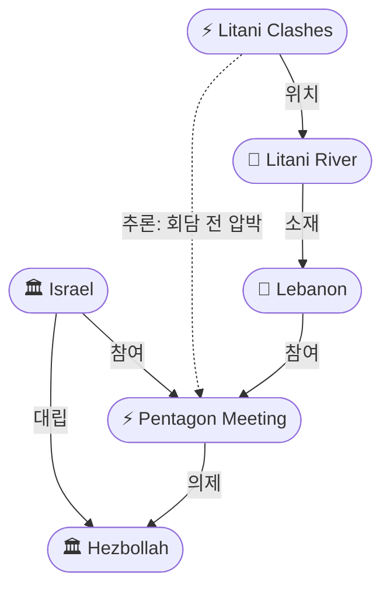

# 2026-05-29 2026 Iran War OSINT 일일 보고서

## 요약

Day 91. **합의했다, 아니다, 조작이다 — 세 가지 서사가 충돌한다.** 미-이란 협상단이 60일 휴전 연장 MoU에 **잠정 합의**에 도달했으나, 트럼프의 최종 승인이 남았다. 밴스 부통령은 **"still TBD"**라며 HEU와 농축 관련 **"a couple of language points"**가 잔여 쟁점이라고 밝혔다. 이에 이란 SNSC 부비서 바게리-카니는 **"합의한 것이 없다(agreed on nothing)"**고 공식 반박했고, 백악관은 이란 국영TV가 공개한 MoU 초안을 **"완전한 조작(complete fabrication)"**이라 부인했다. 한편 IRGC는 MoU 협상과 동시에 호르무즈에서 **4척에 경고사격**을 가해 외교부-IRGC 이원화를 재확인했다. 레바논 전선에서는 **IDF가 리타니강 이북으로 진출**하여 100+ 타격을 가했고, 같은 날 **펜타곤에서 이-레 최초 군사급 안보 트랙 회의**가 개최됐다. 유가는 Brent **$93.71**로 혼조세 — 합의 기대와 불확실성 사이에서 $94.29 대비 소폭 하락했다.

## 주요 뉴스

### 1. 미-이란 MoU 잠정 합의 도달 — 60일 휴전 연장, 트럼프 승인 대기
- **출처:** [Al Jazeera](https://www.aljazeera.com/news/2026/5/28/us-and-iran-reach-tentative-deal-for-60-day-truce-extension-officials-say)
- **일시:** 2026-05-28
- **내용:** 미-이란 협상단이 60일 휴전 연장을 포함한 잠정 양해각서(MoU)에 합의에 도달했다. 프레임워크는 **호르무즈 해협 재개방, 이란 기뢰 제거, 미국 봉쇄 해제 및 제재 면제** 등을 포함한다. 협상단이 트럼프에게 세부사항을 브리핑했으나, 트럼프는 **즉시 서명하지 않고 며칠간 검토 시간**을 요청했다. 파키스탄이 중재 역할을 수행했으며, 밴스 부통령과 갈리바프 의장이 핵심 협상자로 활동했다.
- **상태:** 신규
- **관련 엔티티:** Donald Trump, Iran, JD Vance, Ghalibaf, Strait of Hormuz

### 2. 밴스 'still TBD' — HEU·농축 '언어 조율' 잔여 쟁점
- **출처:** [Axios](https://www.axios.com/2026/05/28/iran-war-us-peace-deal-close-vance)
- **일시:** 2026-05-28
- **내용:** 밴스 부통령이 **"a couple of language points를 두고 오가고 있다. 많은 진전을 이뤘다"**고 밝혔다. 구체적으로 **고농축우라늄(HEU) 비축량 처리와 농축 문제**가 잔여 쟁점이다. 밴스는 **"대통령이 합의를 지지할 수 있는 위치에 오기를 바란다, 하지만 그건 still TBD"**라고 덧붙였다. 목요일 오후 기준 트럼프는 서명 쪽으로 기울어져 있었으나 최종 결정은 내리지 않았다.
- **상태:** 신규
- **관련 엔티티:** JD Vance, Donald Trump, Nuclear Program, Iran

### 3. 이란 '합의한 것 없다' — 바게리-카니 SNSC 부비서 공식 반박
- **출처:** [파이낸셜뉴스](https://www.fnnews.com/news/202605290452302088)
- **일시:** 2026-05-29
- **내용:** 이란 최고국가안보회의(SNSC) 부비서 알리 바게리-카니가 **"모든 의제에 합의하지 않은 한, 아무것도 합의한 것이 아니다"**라고 밝혔다. 이란은 MoU 초안이 아직 확정·승인되지 않았다고 주장했다. 또한 **"실질적 검증 없이는 어떤 조치도 취하지 않겠다"**고 강조했다. 프레임워크에서 군함은 제외되며, 이란이 오만과 협력하여 해협 통행을 관리하는 방안이 포함된 것으로 알려졌다.
- **상태:** 신규
- **관련 엔티티:** Ali Bagheri-Kani, Iran, MoU Agreement

### 4. 백악관 '완전한 조작' — 이란 국영TV MoU 초안에 전면 반박
- **출처:** [The Hill](https://thehill.com/homenews/5897389-white-house-denies-iranian-mou/)
- **일시:** 2026-05-29
- **내용:** 백악관이 이란 국영TV가 공개한 MoU 초안을 **"완전한 조작(complete fabrication)"**이라 부인했다. 해당 초안은 미국의 해상봉쇄 해제와 병력 철수를 포함하고 있었다. 백악관 성명: **"이란 통제 미디어의 보도는 사실이 아니며, 그들이 공개한 MoU는 완전한 조작이다."** 그러나 이란 보도의 일부 세부사항은 미 관리들이 설명한 진행 중인 딜의 내용과 유사한 점이 있다.
- **상태:** 신규
- **관련 엔티티:** Donald Trump, Iran, MoU Agreement, MoU Messaging War

### 5. IRGC 호르무즈 4척 경고사격 — MoU 협상 중 독자 행동
- **출처:** [Times of Israel](https://www.timesofisrael.com/liveblog-may-28-2026/)
- **일시:** 2026-05-28
- **내용:** IRGC가 수요일 밤 호르무즈 해협을 **"조율 없이(without coordination)"** 통과하려던 **4척의 선박에 경고사격**을 가했다. IRIB에 따르면 현지시간 00:35에 선박들이 통과를 시도했으며, 경고를 무시하자 경고사격이 이뤄졌고 선박들은 회항했다. 이는 MoU 협상에서 호르무즈 개방을 합의한 것과 **동시에 발생**하여, IRGC의 독자적 행동과 이란 내부 이원화를 재확인한다.
- **상태:** 신규
- **관련 엔티티:** IRGC, Strait of Hormuz

### 6. 펜타곤 이-레 안보 트랙 개시 — 최초 군사급 직접 회담
- **출처:** [The National](https://www.thenationalnews.com/news/us/2026/05/28/hezbollah-in-focus-as-lebanon-and-israeli-army-officials-meet-at-pentagon/)
- **일시:** 2026-05-29
- **내용:** 레바논-이스라엘 군사 대표단이 5/29 펜타곤에서 **최초 안보 트랙 회의**를 개최했다. 핵심 의제: (1) **워싱턴이 훈련·자금 지원하는 레바논군 신규 여단** 창설로 헤즈볼라 무장해제 작전 수행, (2) **미국 감독 하 합동작전실** 구성으로 헤즈볼라 무기 인프라 해체 조정, (3) **이스라엘 철수 타임라인**, (4) **남레바논 레바논군 배치**. 정치 회담(6/2-3)과 병행하는 안보 트랙의 시작이다. 헤즈볼라는 **"워싱턴은 공정한 중재자가 아니다"**라며 직접 참여를 거부했다.
- **상태:** 신규
- **관련 엔티티:** Lebanon, Israel, Hezbollah, US Military, Pentagon Security Track

### 7. 리타니강 전투 — IDF 이북 진출, 100+ 타격, 헤즈볼라 반격
- **출처:** [PBS](https://www.pbs.org/newshour/world/israel-and-hezbollah-clash-along-strategic-river-after-overnight-strikes-across-lebanon)
- **일시:** 2026-05-28~29
- **내용:** IDF가 리타니강을 넘어 북쪽으로 진출하며 헤즈볼라와 교전했다. 남레바논과 베카 밸리 전역에서 **100개소 이상의 헤즈볼라 시설**(저장고·지휘소·관측소)을 타격했다. 헤즈볼라는 **요모르 알-샤킵과 자와타르 알-샤르키에** 방면으로 이동하는 이스라엘군에 로켓·대포·자폭드론으로 반격했다. 리타니강은 사실상 경계선이 되었으며, 남쪽 대부분이 이스라엘 통제 하에 있다. 레바논 전체 사망자 **3,185명, 100만+ 이재민**.
- **상태:** 신규
- **관련 엔티티:** Israel, Hezbollah, Lebanon, Litani River

### 8. 유가 혼조 Brent $93.71 — 합의 기대와 불확실성 교차
- **출처:** [뉴스핌](https://www.newspim.com/news/view/20260529000033)
- **일시:** 2026-05-29
- **내용:** 유가 혼조세 마감. Brent 7월물 **$93.71**, 8월물 $92.97. 미-이란 60일 휴전 연장 잠정 합의 소식에 하락세를 보이다, 이란의 **"합의 아냐"** 발언에 반등했다. 금은 안전자산 선호로 상승. 시장은 트럼프 승인 여부에 촉각을 곤두세우고 있다. 전일 $94.29 대비 **$0.58 하락**.
- **상태:** 신규
- **관련 엔티티:** Strait of Hormuz, Oil Price

### 9. 이스라엘 '서방 vs 이란 선택하라' — 펜타곤 회담 전 레바논 압박
- **출처:** [The Week](https://www.theweek.in/news/middle-east/2026/05/27/as-pentagon-talks-loom-israel-says-lebanon-must-choose-between-west-and-iran.html)
- **일시:** 2026-05-28
- **내용:** 펜타곤 안보 트랙 회의를 앞두고 이스라엘이 레바논에 **양자택일을 요구**: 서방(헤즈볼라 무장해제 수용) 또는 이란 중 선택하라. 이스라엘은 헤즈볼라 무장해제와 월경 공격 중단을 **선결 조건**으로 요구하고, 베이루트는 **이스라엘 남레바논 철수 타임라인**에 대한 명확화를 원한다.
- **상태:** 신규
- **관련 엔티티:** Israel, Lebanon, Hezbollah, Pentagon Meeting

### 10. Washington Institute 분석 — 펜타곤 안보 트랙의 의미
- **출처:** [Washington Institute](https://www.washingtoninstitute.org/policy-analysis/israel-lebanon-talks-round-4-pentagon-takes-seat)
- **일시:** 2026-05-29
- **내용:** 워싱턴 연구소 분석에 따르면, 펜타곤 안보 트랙의 핵심 의제는 **이스라엘군 철수, 레바논군 남레바논 인수, LAF 재정 지원, 헤즈볼라 무장해제, 휴전 이행 메커니즘**이다. 5/15 발표된 **45일 휴전 연장**이 이 병행 트랙을 탄생시켰으며, 6/2-3 정치 회담과 함께 **이중 트랙** 구조를 형성한다.
- **상태:** 신규
- **관련 엔티티:** Lebanon, Israel, Hezbollah, Pentagon Meeting

## 지식그래프

### 오늘의 주요 관계

1. **MoU 잠정 합의 삼각 갈등:** Trump/Vance/Iran 모두 MoU(ent-456)에 참여하지만, 바게리-카니(ent-457)가 공식 반대하고, 백악관이 이란 버전을 부인 — 합의와 부인이 동시에 존재하는 독특한 구도.
2. **IRGC 이중 신호:** IRGC 경고사격(ent-459)이 MoU(ent-456)와 같은 호르무즈(ent-008)에서 동시 발생 — 외교부의 합의와 IRGC의 독자 행동이 충돌.
3. **에스컬레이트-투-네고시에이트 패턴 지속:** 리타니 전투(ent-463)가 펜타곤 회의(ent-460) 직전에 발생 — 5/27 31명 사살에 이어 군사 압박의 연속.
4. **바게리-카니↔갈리바프 잠재 긴장:** 동일 이란(ent-002) 소속이지만 MoU에 대해 상반된 입장 — 강경파 vs 실용주의 라인.

### 전체 지식그래프 시각화

### 주제별 세부 그래프: MoU 합의 메시지 전쟁

### 주제별 세부 그래프: 레바논 이중 트랙

## 온톨로지 변경

| 변경 유형 | 대상 | 근거 |
|----------|------|------|
| 새 엔티티 | ent-456 US-Iran Tentative MoU Agreement (Event) | 전쟁 이후 가장 구체적인 합의 도달 — 60일 프레임워크 |
| 새 엔티티 | ent-457 Ali Bagheri-Kani (Person) | SNSC 부비서, '합의 없다' 공식 발언 |
| 새 엔티티 | ent-458 MoU Messaging War (Event) | 양측 MoU 내용 공방 — 딜 성사 선행 지표 |
| 새 엔티티 | ent-459 IRGC Warning Shots at 4 Ships (Event) | MoU 중 IRGC 독자 행동, 이란 이원화 |
| 새 엔티티 | ent-460 Pentagon Security Track Meeting (Event) | 이-레 최초 군사급 직접 회담 |
| 새 엔티티 | ent-461 Pentagon Security Track (Concept) | 정치·안보 병행 트랙 구조 |
| 새 엔티티 | ent-462 Litani River (Location) | 이스라엘-헤즈볼라 사실상 경계선 |
| 새 엔티티 | ent-463 Litani River Clashes (Event) | IDF 리타니 이북 진출, 100+ 타격 |
| 새 엔티티 | ent-464 Oil Price Mixed May 29 (Event) | Brent $93.71 혼조세 |
| 기존 업데이트 | ent-001 (Trump) | MoU 승인 보류, 검토 시간 요청 |
| 기존 업데이트 | ent-002 (Iran) | MoU 잠정 합의 → 공식 부인 이중 신호 |
| 기존 업데이트 | ent-005 (IRGC) | 호르무즈 4척 경고사격 — 독자 행동 |
| 기존 업데이트 | ent-008 (Hormuz) | MoU 핵심 의제 + IRGC 경고사격 동시 |
| 기존 업데이트 | ent-041 (Vance) | 'TBD', 'language points' — 핵심 중재자 |
| 기존 업데이트 | ent-047 (Hezbollah) | 리타니강 반격, 펜타곤 회담 거부 |
| 기존 업데이트 | ent-050 (Lebanon) | 펜타곤 안보 트랙 참가, 리타니 전투 |
| 스키마 변경 | 없음 | 기존 클래스/관계로 모두 표현 가능 |

## 추론 결과

| 추론 | 신뢰도 | 근거 |
|------|--------|------|
| IRGC 경고사격(ent-459) → 관련 → MoU 합의(ent-456) | 0.72 | MoU에서 호르무즈 개방 합의한 시점에 IRGC가 독자 경고사격 — 외교부-IRGC 이원화 이중 신호 |
| 리타니 전투(ent-463) → 관련 → 펜타곤 회의(ent-460) | 0.75 | IDF 리타니 이북 진출이 펜타곤 회의 직전 — 에스컬레이트-투-네고시에이트 패턴 |
| 바게리-카니(ent-457) → 잠재 관계 → 갈리바프(ent-045) | 0.80 | 동일 이란 소속, MoU 관련 상반된 입장 — 강경파(바게리-카니) vs 실용주의(갈리바프) |

## 분석 및 평가

**합의는 존재하지만 정의가 없다.** 오늘의 핵심은 MoU를 둘러싼 세 가지 상충되는 내러티브의 동시 존재다: (1) 협상단 수준의 잠정 합의, (2) 이란 SNSC의 공식 부인, (3) 백악관의 이란 버전 부인. 이는 협상의 결렬이 아니라 **서명 전 레버리지 게임**으로 읽힌다. 양측 모두 최종 문안에 대한 해석 주도권을 선점하려는 메시지 전쟁이며, 실제 합의의 골격 — 60일 연장, 호르무즈 복구, 핵 협상 개시 — 은 양측 발언에서 공통적으로 확인된다. 밴스의 "a couple of language points"가 사실이라면 실질적 거리는 좁다.

**IRGC 이중 신호의 전략적 함의.** MoU에서 호르무즈 30일 내 개방을 합의한 바로 그 시점에 IRGC가 4척에 경고사격을 가한 것은 단순한 우연이 아니다. (1) IRGC가 MoU 이행 과정에서 **호르무즈 '관리권'을 포기하지 않겠다는 신호**, (2) 이란 내부에서 외교부(MoU 합의)와 IRGC(현장 통제)의 **이원화 구도 지속**, (3) 또는 의도적으로 **협상 레버리지를 유지하기 위한 계산된 긴장**. 어느 해석이든, MoU 서명 후에도 이행 과정에서 IRGC가 독립 변수로 남을 가능성을 시사한다.

**레바논: 에스컬레이트-투-네고시에이트의 교과서적 전개.** 5/27 31명 사살 → 5/28~29 리타니강 이북 진출·100+ 타격 → 5/29 펜타곤 안보 트랙 회의. 이스라엘이 회담 직전에 군사적 압박을 극대화하는 패턴이 3주 연속 반복되고 있다. 새로운 변수는 **리타니강 이북 진출**로 — 사실상 경계선을 넘어선 것은 4/16 휴전 이후 가장 심각한 영토적 에스컬레이션이다. 펜타곤 안보 트랙이 정치 회담과 병행하는 **이중 트랙 구조**를 탄생시킨 것은 구조적 진전이지만, 헤즈볼라의 참여 거부가 실효성에 의문을 남긴다.

**트럼프의 딜레마 심화.** 밴스의 'TBD'는 트럼프가 서명 여부를 아직 결정하지 못했음을 의미한다. 서명하면 이란에 유리한 딜이라는 GOP 매파 비판에 노출되고, 서명하지 않으면 전쟁 장기화와 중간선거 부담이 커진다. 어제의 '좋은 출구가 없다' 분석이 오늘 더 구체화됐다.

## 추적 항목

| 항목 | 최초 보고 | 상태 | 최신 업데이트 |
|------|----------|------|-------------|
| MoU 서명 시점 | 2026-05-06 | **잠정 합의, 서명 대기** | 5/29: 협상단 합의 도달, 트럼프 'TBD', 양측 메시지 전쟁 |
| 이란 동결자산 해제 | 2026-04-11 | **핵심 쟁점** | 변동 없음 — MoU 프레임워크에 포함 여부 불확실 |
| 호르무즈 군사 교전 | 2026-04-07 | **이중 신호** | 5/29: MoU 합의 중 IRGC 4척 경고사격 — 이원화 재확인 |
| 레바논 전선 | 2026-04-17 | **에스컬레이션 지속** | 5/29: IDF 리타니 이북 진출, 100+ 타격, 헤즈볼라 반격 |
| 펜타곤 군사 회의 | 2026-05-28 | **개최됨** | 5/29: 최초 군사급 안보 트랙, 헤즈볼라 무장해제 의제 |
| 유가 동향 | 2026-04-07 | **혼조** | 5/29: Brent $93.71(-$0.58), 합의 기대와 불확실성 교차 |
| 하원 WPR 투표 | 2026-04-30 | 6월 연기 | 변동 없음 |
| GOP 내부 분열 | 2026-05-25 | 심화 | 5/29: MoU 서명 여부가 새 분열 축 |
| 아브라함 협정 정상화 | 2026-05-26 | 정체 | 변동 없음 |
| 이란 내부 분열 | 2026-05-22 | **심화** | 5/29: 바게리-카니 '합의 없다' vs 외교부 MoU 합의 — 강경파-실용파 갈등 |

## 동향 요약

| 분류 | 상태 | 비고 |
|------|------|------|
| 미-이란 MoU | **잠정 합의, 서명 대기** | 협상단 합의, 트럼프 'TBD', 양측 메시지 전쟁 |
| 호르무즈 해협 | **이중 신호** | MoU 30일 개방 합의 + IRGC 4척 경고사격 동시 |
| 레바논 전선 | **리타니 이북 에스컬레이션** | IDF 리타니강 돌파, 100+ 타격, 헤즈볼라 반격 |
| 이-레 외교 | **안보 트랙 개시** | 펜타곤 최초 군사급 회의, 6/2-3 정치 회담 예정 |
| 유가 | **혼조** (Brent $93.71) | 합의 기대(-) vs 불확실성(+), 전일 대비 -$0.58 |
| 이란 내부 | **분열 심화** | 바게리-카니(강경) vs 갈리바프(실용) + IRGC 독자 행동 |
| 트럼프 정치 | **결정 보류** | 밴스 'TBD', 서명 여부가 핵심 변수 |
| 미 의회 | WPR 6월 예정 | 변동 없음 |

## 출처 목록
1. [US and Iran reach tentative deal for 60-day truce extension](https://www.aljazeera.com/news/2026/5/28/us-and-iran-reach-tentative-deal-for-60-day-truce-extension-officials-say) - Al Jazeera, 2026-05-28
2. [Vance: US and Iran 'very close' to deal, 'still TBD' whether Trump will sign](https://www.axios.com/2026/05/28/iran-war-us-peace-deal-close-vance) - Axios, 2026-05-28
3. [Iran denies deal finalized: Bagheri-Kani 'agreed on nothing'](https://www.fnnews.com/news/202605290452302088) - 파이낸셜뉴스, 2026-05-29
4. [White House calls Iran-published MoU draft 'complete fabrication'](https://thehill.com/homenews/5897389-white-house-denies-iranian-mou/) - The Hill, 2026-05-29
5. [IRGC fires warning shots at 4 ships attempting Hormuz passage](https://www.timesofisrael.com/liveblog-may-28-2026/) - Times of Israel, 2026-05-28
6. [Pentagon Lebanon-Israel security track launched](https://www.thenationalnews.com/news/us/2026/05/28/hezbollah-in-focus-as-lebanon-and-israeli-army-officials-meet-at-pentagon/) - The National, 2026-05-29
7. [Israel and Hezbollah clash along Litani River](https://www.pbs.org/newshour/world/israel-and-hezbollah-clash-along-strategic-river-after-overnight-strikes-across-lebanon) - PBS, 2026-05-29
8. [유가 혼조 Brent $93.71](https://www.newspim.com/news/view/20260529000033) - 뉴스핌, 2026-05-29
9. [Israel says Lebanon must choose between West and Iran](https://www.theweek.in/news/middle-east/2026/05/27/as-pentagon-talks-loom-israel-says-lebanon-must-choose-between-west-and-iran.html) - The Week, 2026-05-28
10. [Washington Institute: Israel-Lebanon Talks Round 4](https://www.washingtoninstitute.org/policy-analysis/israel-lebanon-talks-round-4-pentagon-takes-seat) - Washington Institute, 2026-05-29
11. [CNN live: US and Iran reach tentative agreement](https://www.cnn.com/2026/05/28/world/live-news/iran-war-us-news) - CNN, 2026-05-28
12. [Bloomberg: US Iran agree to 60-day truce renewal](https://www.bloomberg.com/news/articles/2026-05-28/iran-us-accuse-each-other-of-truce-breach-with-no-deal-in-sight) - Bloomberg, 2026-05-28
13. [Israel expands military ground operations in Southern Lebanon](https://www.euronews.com/2026/05/27/israel-expands-military-ground-operations-in-southern-lebanon-as-clashes-with-hezbollah-in) - Euronews, 2026-05-28
14. [이란 휴전 연장 합의 기대감 속 혼조세 마감](https://www.fnnews.com/news/202605290457240594) - 파이낸셜뉴스, 2026-05-29
15. [美·이란, 60일 휴전연장 MOU 합의…트럼프 승인 남아](https://www.mt.co.kr/world/2026/05/29/2026052900164455421) - 머니투데이, 2026-05-29
16. [US, Iran agree to 60-day ceasefire extension pending Trump approval](https://www.foxnews.com/politics/us-iran-reach-ceasefire-extension-pending-trumps-final-approval) - Fox News, 2026-05-28
17. [Tentative U.S.-Iran Cease-Fire Extension Deal Awaits Trump's Approval](https://foreignpolicy.com/2026/05/28/us-iran-reach-deal-cease-fire-mou-kuwait-strikes-trump/) - Foreign Policy, 2026-05-28
18. [CBS: Vance says 'still TBD' whether Trump will sign](https://www.cbsnews.com/live-updates/iran-war-us-strikes-trump-oman-strait-of-hormuz-deal/) - CBS, 2026-05-28
19. [ABC: Negotiators believe they have draft deal](https://abcnews.com/International/live-updates/iran-live-updates-peace-deal-work-progress-rubio/?id=133278077) - ABC, 2026-05-28
20. [White House: US Iran negotiators have agreed to MoU](https://www.timesofisrael.com/white-house-us-iran-negotiators-have-agreed-to-mou-but-trumps-approval-still-needed/) - Times of Israel, 2026-05-28
21. [Iran fires warning shots at four ships in Strait of Hormuz](https://www.jpost.com/middle-east/iran-news/article-897614) - Jerusalem Post, 2026-05-28
22. [Israel Hezbollah clash along strategic Lebanese river](https://www.washingtontimes.com/news/2026/may/26/israel-hezbollah-clashing-along-strategic-lebanese-river-following/) - Washington Times, 2026-05-29
23. [Lebanon to hold military talks with Israel at Pentagon](https://www.arabnews.com/node/2645262/middle-east) - Arab News, 2026-05-29
24. [미-이란 60일 휴전안 잠정합의...트럼프 서명만 남아](https://www.spnews.co.kr/news/articleView.html?idxno=107623) - SPN 서울평양뉴스, 2026-05-29
25. [Hezbollah claims clashes with Israeli troops north of Litani](https://www.timesofisrael.com/hezbollah-claims-clashes-with-israeli-troops-north-of-litani-idf-dismisses-reports/) - Times of Israel, 2026-05-29
