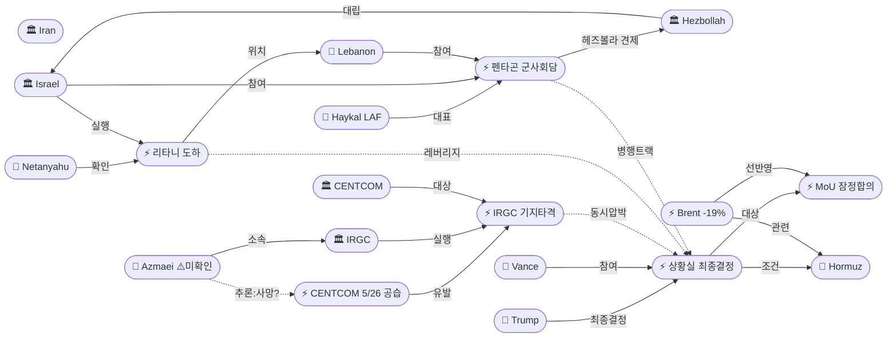
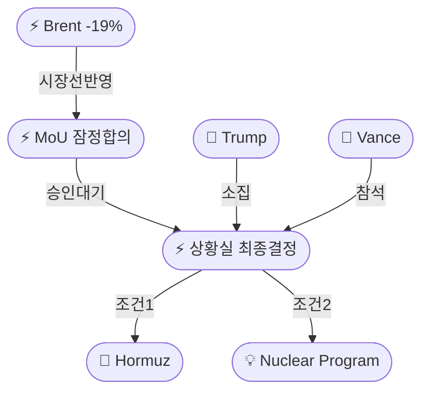
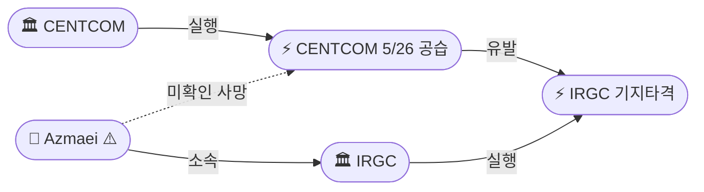
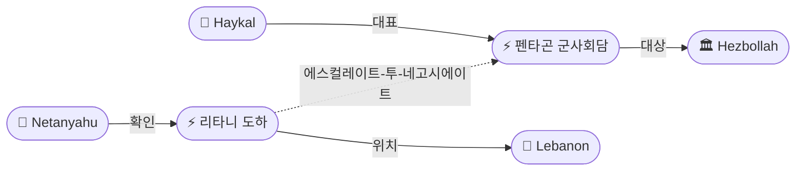

# 2026-05-30 2026 Iran War OSINT 일일 보고서

## 요약

Day 92. **3중 압박이 동시에 수렴하는 임계점에 도달했다.** 트럼프 대통령이 백악관 상황실에서 이란 MoU에 대한 **"최종 결정(final determination)"** 회의를 소집하며 핵 불보유·호르무즈 무조건 개방·통행료 폐지 3개 조건을 제시했다. 동시에 IRGC는 CENTCOM의 밴더아바스 공습에 대해 **미 공군기지에 보복 타격**을 가하고 외교 실패 시 **"완전한 파멸(utter ruin)"**을 경고했다. 레바논 전선에서는 네타냐후가 북부 전선을 방문하여 **IDF 36사단의 리타니강 도하를 직접 확인**했고, 같은 날 펜타곤에서 **사상 최초 이스라엘-레바논 군사 회담**이 개최됐다. 유가는 Brent $92.05로 5월 **-19% 하락 마감** — 2020년 3월 코로나 이후 최대 월간 낙폭이다.

## 주요 뉴스

### 1. 트럼프 상황실 '최종 결정' — 핵·호르무즈·통행료 3대 조건 제시
- **출처:** [Washington Post](https://www.washingtonpost.com/politics/2026/05/29/trump-calls-situation-room-meeting-decide-extending-iran-ceasefire/)
- **일시:** 2026-05-30
- **내용:** 트럼프 대통령이 백악관 상황실에서 이란 딜 **"최종 결정"** 회의를 소집했다. 트럼프는 3대 요구조건을 공개했다: (1) 이란은 **"핵무기나 폭탄을 절대 보유하지 않는다"**는 데 동의, (2) 호르무즈 해협 **즉시 개방**, (3) **통행료 없는 무제한 통항**. MoU 초안은 이미 동맹국들과 공유된 상태이며, 밴스·루비오·헤그세스 등 핵심 보좌관이 참석한다. 협상단 수준에서는 잠정 합의가 이뤄졌으나 대통령의 최종 서명만 남은 상황이다.
- **상태:** 신규
- **관련 엔티티:** Donald Trump, JD Vance, Marco Rubio, Strait of Hormuz, Iran MoU

### 2. IRGC 미 공군기지 보복 타격 — '중대 경고, 다음엔 더 결정적'
- **출처:** [Euronews](https://www.euronews.com/2026/05/28/iran-says-it-targeted-a-us-airbase-in-retaliatory-strikes)
- **일시:** 2026-05-28~29
- **내용:** IRGC가 CENTCOM의 밴더아바스 공항 인근 공습에 대응하여 **공격 발원 미 공군기지를 새벽 4:50에 타격**했다. IRGC는 **"중대 경고(serious warning)"**라고 칭하며 "추가 미국 침략 시 **더 결정적(more decisive)** 대응이 뒤따를 것"이라 경고했다. 이는 현 분쟁에서 IRGC의 미국 기지 직접 타격으로, 5/26 경고사격에서 한 단계 에스컬레이션된 행동이다.
- **상태:** 신규
- **관련 엔티티:** IRGC, CENTCOM, Bandar Abbas, US Military

### 3. IRGC '완전한 파멸' 경고 — 외교 실패 시 시나리오
- **출처:** [CNN](https://www.cnn.com/2026/05/29/middleeast/iran-ceasefire-prepare-war-next-intl)
- **일시:** 2026-05-29
- **내용:** IRGC가 전쟁 재개 시 **"지역을 훨씬 넘어(far beyond the region)"** 분쟁이 확산될 것이라 경고하며 적국에 **"상상조차 할 수 없는 곳에서 분쇄 타격(crushing blows)과 완전한 파멸(utter ruin)"**을 가하겠다고 위협했다. CNN 분석은 외교 실패 시 시나리오로 호르무즈 완전 폐쇄, 걸프국 시설 추가 공격, 에너지 인프라 사이버공격, 프록시 전선 확대를 제시했다.
- **상태:** 신규
- **관련 엔티티:** IRGC, Iran, Strait of Hormuz

### 4. IDF 36사단 리타니강 도하 — 네타냐후 직접 확인
- **출처:** [Times of Israel](https://www.timesofisrael.com/pm-confirms-troops-crossed-litani-as-pentagon-hosts-israeli-lebanon-security-talks)
- **일시:** 2026-05-29~30
- **내용:** 네타냐후 총리가 북부 전선을 방문하여 IDF **36사단이 리타니강을 도하**하여 "지배적 지형(dominating terrain)을 확보"했다고 확인했다. **"베이루트에서도, 베카 밸리에서도, 전체 전선에서 헤즈볼라를 강타하고 있다"**고 발언했다. 레바논 보안 소스에 따르면 도하 지점은 자와타르 알-샤르키에 인근이며, 5명이 사망했다. 전일 리타니 전투에서 영토 진전으로 격상된 중대 군사 발전이다.
- **상태:** 업데이트 ← 2026-05-29 "리타니강 전투"
- **관련 엔티티:** Benjamin Netanyahu, Israel, Hezbollah, Lebanon, Litani River

### 5. 펜타곤 사상 최초 이스라엘-레바논 군사 회담 개최
- **출처:** [Fox News](https://www.foxnews.com/world/pentagon-hosts-first-ever-israeli-lebanese-military-talks-aimed-curbing-hezbollah)
- **일시:** 2026-05-29
- **내용:** 5/29 펜타곤에서 사상 최초로 이스라엘-레바논 **군사 대표단 간 직접 회담**이 열렸다. 레바논 측은 **하이칼(Rodolphe Haykal) LAF 사령관**이 대표로 참석했다. 의제: 휴전 이행 감시, 국경 안정, IDF 남레바논 철수, LAF의 헤즈볼라 견제 역할. 이는 5/15 발표된 45일 휴전 연장이 탄생시킨 안보 트랙으로, 6/2-3 정치 회담과 **이중 트랙** 구조를 형성한다.
- **상태:** 업데이트 ← 2026-05-29 "펜타곤 이-레 안보 트랙 개시"
- **관련 엔티티:** Israel, Lebanon, Hezbollah, Gen. Rodolphe Haykal, US Military

### 6. 알리 아즈마에이 IRGC 해군사령관 사망 (미확인)
- **출처:** [The Week India](https://www.theweek.in/news/middle-east/2026/05/28/did-us-airstrike-kill-irgc-navy-chief-ali-azmaei-in-irans-bandar-abbas.amp.html)
- **일시:** 2026-05-28
- **내용:** IRGC 해군사령관 **알리 아즈마에이(Ali Azmaei)**가 CENTCOM의 밴더아바스 공습에서 사망했을 가능성이 보도됐다. **⚠️ 미확인 보도 — 이란 국영매체 및 IRGC 공식 확인/부인 없음.** 확인될 경우 IRGC 해군 리더십 공백과 보복 심화 가능성이 있다.
- **상태:** 신규 (미확인)
- **관련 엔티티:** Ali Azmaei, IRGC, CENTCOM, Bandar Abbas

### 7. 유가 5월 -19% — 2020년 코로나 이후 최대 월간 하락
- **출처:** [CNBC](https://www.cnbc.com/2026/05/29/oil-price-iran-deal-war-ceasefire-trump.html)
- **일시:** 2026-05-29~30
- **내용:** Brent 원유가 5월 한 달간 **19% 이상 하락**하여 2020년 3월 코로나 팬데믹 이후 최대 월간 낙폭을 기록했다. 5/29 마감 기준 Brent **$92.05**(전일 -1.77%), WTI **$87.36**(전일 -1.73%). 미-이란 휴전 합의 기대와 호르무즈 재개방 전망이 지정학적 리스크 프리미엄을 해소한 결과다. 그러나 외교 실패 시 **+15~20% 급반전 리스크**가 존재한다.
- **상태:** 신규
- **관련 엔티티:** Strait of Hormuz, Iran MoU, Oil Price

### 8. MoU 초안 동맹국 공유 — 다자화 신호
- **출처:** [파이낸셜뉴스](https://www.fnnews.com/news/202605291051228305)
- **일시:** 2026-05-29
- **내용:** 트럼프가 서명 직전 상태의 MoU 초안을 동맹국들과 공유했다. 초안에는 **호르무즈 해협 개방과 핵 협상 프레임워크**가 담겨 있다. 동맹국 사전 공유는 MoU의 다자적 이행 체계를 준비하는 신호로 해석된다. 유럽·아시아 동맹국의 피드백이 트럼프 최종 결정에 반영될 수 있다.
- **상태:** 신규
- **관련 엔티티:** Donald Trump, Iran MoU

## 지식그래프

### 오늘의 주요 관계

1. **동시 압박 수렴:** 트럼프 상황실 회의(ent-467)에 IRGC 기지 타격(ent-468), IDF 리타니 도하(ent-470), 펜타곤 이-레 회담(ent-471)이 동시에 수렴 — 군사·외교·지상 3중 압박이 대통령 결정에 집중.
2. **인과 체인:** CENTCOM 5/26 공습(ent-445) → IRGC 보복 타격(ent-468) → 상황실 회의(ent-467) — 군사 교환이 외교 결정 촉매.
3. **에스컬레이트-투-네고시에이트:** IDF 리타니 도하(ent-470) → 펜타곤 최초 군사회담(ent-471) — 지상 진전이 협상 레버리지로 전환.
4. **시장 선반영:** 유가 -19%(ent-469)가 MoU(ent-456) 합의를 선반영 — 외교 실패 시 급반전 리스크.

### 전체 지식그래프 시각화

### 주제별 세부 그래프

#### 외교 결정 트랙

#### 군사 에스컬레이션 트랙

#### 레바논 이중 트랙

## 온톨로지 변경

| 변경 유형 | 대상 | 근거 |
|----------|------|------|
| 새 엔티티 | ent-465 Ali Azmaei (Person) | IRGC 해군사령관, 밴더아바스 공습 사망 미확인 보도 |
| 새 엔티티 | ent-466 Rodolphe Haykal (Person) | LAF 사령관, 펜타곤 이-레 군사회담 레바논 대표 |
| 새 엔티티 | ent-467 Trump Situation Room Meeting (Event) | 상황실 '최종 결정' 회의, MoU 수락/거부 양자택일 |
| 새 엔티티 | ent-468 IRGC Retaliatory Strike (Event) | 밴더아바스 CENTCOM 공습 → 미 공군기지 보복 타격 |
| 새 엔티티 | ent-469 Brent May Monthly Drop (Event) | 5월 -19%, 2020년 3월 이후 최대 월간 낙폭 |
| 새 엔티티 | ent-470 IDF Litani Crossing (Event) | 36사단 리타니 도하, 네타냐후 직접 확인 |
| 새 엔티티 | ent-471 Pentagon Military Talks (Event) | 사상 최초 이-레 군사 회담, LAF Haykal 대표 |
| 스키마 변경 | 없음 | 기존 클래스/관계로 모든 신규 엔티티 표현 가능 |

## 추론 결과

| 추론 | 신뢰도 | 근거 |
|------|--------|------|
| IRGC 기지타격(ent-468) ↔ 상황실 회의(ent-467) 동시압박 | 0.80 | 보복 타격과 최종 결정 회의가 같은 날 발생 — 군사 교환이 외교 결정을 촉매 |
| IDF 리타니 도하(ent-470) ↔ 상황실 회의(ent-467) 에스컬레이트-투-네고시에이트 | 0.75 | 네타냐후의 지상 진전 확인이 MoU 결정과 동시 — 레바논 레버리지 활용 패턴 |
| 펜타곤 군사회담(ent-471) ↔ 상황실 회의(ent-467) 병행 트랙 | 0.80 | 미-이란 MoU 트랙과 이-레 안보 트랙이 같은 날 결정 단계 진입 |
| 아즈마에이(ent-465) ↔ CENTCOM 공습(ent-445) 사망 추론 | 0.60 | 미확인 — 단일 소스, IRGC 공식 발표 없음 |

## 분석 및 평가

### 3중 압박 수렴 (Critical Junction)

Day 92는 전쟁 이후 가장 복합적인 압력이 대통령 결정에 집중된 날이다:

1. **군사 교환 에스컬레이션:** 5/26 CENTCOM 자위권 공습 → 5/28 IRGC 미 공군기지 보복 → 5/29 '완전한 파멸' 경고. 휴전 중 군사 교환이 MoU를 보류한 트럼프의 결정을 압박한다. IRGC의 미 기지 직접 타격은 경고사격 단계를 넘어선 질적 에스컬레이션이다.

2. **레바논 지상 진전:** 네타냐후가 36사단의 리타니 도하를 직접 확인하며 "베이루트·베카·전체 전선에서 작전 중"이라 발언 — 동시에 펜타곤에서 최초 이-레 군사회담이 열리면서, 이스라엘은 지상 진전을 협상 레버리지로 전환하는 '에스컬레이트-투-네고시에이트' 패턴을 반복한다.

3. **시장의 선반영:** Brent 5월 -19%는 시장이 MoU 합의를 높은 확률로 선반영하고 있음을 의미한다. 트럼프가 딜을 거부할 경우 유가 급등(+15~20%)이 예상되며, 이는 중간선거를 앞둔 정치적 부담이 된다.

### 이란 이원화 구도 극대화

Day 91(바게리-카니 "합의한 것 없다") → Day 92(IRGC 기지 타격 + '완전한 파멸' 경고): 외교부의 MoU 잠정 합의와 IRGC의 독자 군사행동이 동시에 진행되며, 이란 내부 권력 이원화가 극대화되었다. 아즈마에이 IRGC 해군사령관 사망 미확인 보도가 사실이라면 IRGC 내 보복 압력이 더 강해질 것이다.

### 핵심 판단

트럼프 상황실 회의는 Day 92의 결정적 사건이다. 합의 시 호르무즈 30일 내 정상화·60일 핵 협상 개시라는 구체적 로드맵이 시작된다. 거부 시 IRGC의 '완전한 파멸' 시나리오가 현실화될 리스크가 있으며, 유가 급등과 국내 정치 부담이 뒤따른다. 시장은 합의를 선반영 중이나, Khamenei의 승인 여부가 두 번째 관문으로 남아 있다.

## 추적 항목

| 항목 | 최초 보고 | 상태 | 최신 업데이트 |
|------|----------|------|-------------|
| MoU 60일 프레임워크 | 2026-05-25 | 🔴 최종 결정 대기 | 트럼프 상황실 '최종 결정' 회의 소집, 3대 조건 공개 |
| 호르무즈 해협 통항 | 2026-04-07 | 🟡 이중 봉쇄 지속 | IRGC 관리 통항 25척/일, 미 봉쇄 유지, MoU 합의 시 30일 정상화 |
| 이-레 휴전 및 회담 | 2026-04-16 | 🟡 이중 트랙 진행 | 펜타곤 최초 군사회담 개최, 6/2-3 정치회담 예정 |
| IRGC-외교부 이원화 | 2026-04-18 | 🔴 극대화 | MoU 협상 중 미 기지 보복 타격 + '완전한 파멸' 경고 |
| 핵 협상 (HEU/농축) | 2026-04-12 | 🟡 쟁점 지속 | MoU에 "핵무기 불보유" 포함, 60일 상세협상 구조 |
| 유가 동향 | 2026-04-07 | 🟢 하락세 | Brent $92.05, 5월 -19% (COVID 이후 최대 월간 낙폭) |
| 레바논 전선 | 2026-04-10 | 🔴 에스컬레이션 | 36사단 리타니 도하 확인, 5명 사망, 전선 전체 작전 |

## 동향 요약

| 분류 | 상태 | 비고 |
|------|------|------|
| 미-이란 외교 | 🔴 결정 임박 | 트럼프 상황실 '최종 결정' — MoU 수락/거부 양자택일 |
| 이란 내부 | 🔴 이원화 극대 | MoU 잠정합의 vs IRGC 기지타격 + 파멸 경고 동시 진행 |
| 호르무즈 해협 | 🟡 이중봉쇄 | IRGC 관리통항 지속, 미 봉쇄 유지, MoU 합의 시 30일 해제 |
| 이-레 전선 | 🔴 에스컬레이션 | 36사단 리타니 도하, 펜타곤 최초 군사회담 |
| 유가 | 🟢 하락 | Brent $92.05, 5월 -19% (COVID 이후 최대 월간 낙폭) |
| 핵 문제 | 🟡 미해결 | MoU에 원칙 포함, 60일 상세협상 구조 예정 |

## 출처 목록

1. [Trump calls Situation Room meeting for 'final determination' on Iran deal](https://www.washingtonpost.com/politics/2026/05/29/trump-calls-situation-room-meeting-decide-extending-iran-ceasefire/) - Washington Post, 2026-05-29
2. [Netanyahu confirms troops crossed Litani, as Pentagon hosts Israeli-Lebanon security talks](https://www.timesofisrael.com/pm-confirms-troops-crossed-litani-as-pentagon-hosts-israeli-lebanon-security-talks) - Times of Israel, 2026-05-30
3. [Iran says it targeted a US airbase in retaliatory strikes](https://www.euronews.com/2026/05/28/iran-says-it-targeted-a-us-airbase-in-retaliatory-strikes) - Euronews, 2026-05-28
4. [IRGC warns renewed conflict will bring 'utter ruin' far beyond the region](https://www.cnn.com/2026/05/29/middleeast/iran-ceasefire-prepare-war-next-intl) - CNN, 2026-05-29
5. [Unconfirmed: IRGC Navy chief Ali Azmaei possibly killed in Bandar Abbas airstrike](https://www.theweek.in/news/middle-east/2026/05/28/did-us-airstrike-kill-irgc-navy-chief-ali-azmaei-in-irans-bandar-abbas.amp.html) - The Week India, 2026-05-28
6. [Brent oil price posts biggest monthly loss in six years](https://www.cnbc.com/2026/05/29/oil-price-iran-deal-war-ceasefire-trump.html) - CNBC, 2026-05-29
7. [Oil drops 20% from 2026 peak on ceasefire optimism](https://www.cnbc.com/2026/05/29/oil-prices-iran-ceasefire-us-trump-strait-hormuz-energy-costs.html) - CNBC, 2026-05-29
8. [Pentagon hosts first-ever Israeli-Lebanese military talks aimed at curbing Hezbollah](https://www.jammin999fm.com/2026/05/29/pentagon-hosts-first-ever-israeli-lebanese-military-talks-aimed-at-curbing-hezbollah/) - AP (via affiliates), 2026-05-29
9. [트럼프, 서명만 남은 MOU 동맹국에 공유](https://www.fnnews.com/news/202605291051228305) - 파이낸셜뉴스, 2026-05-29
10. [트럼프 "오늘 백악관서 이란 합의 최종 결정"](https://www.newspim.com/news/view/20260530000001) - 뉴스핌, 2026-05-30
11. [Iran-US deal nears finish line — but Trump and Khamenei must say yes](https://www.euronews.com/2026/05/29/iran-us-deal-nears-finish-line-but-trump-and-khamenei-must-say-yes) - Euronews, 2026-05-29
12. [Trump 'final determination' on Iran deal — PBS](https://www.pbs.org/newshour/world/trump-meeting-with-aides-to-make-final-determination-on-moving-forward-with-iran-deal) - PBS NewsHour, 2026-05-29
13. [Trump demands Hormuz open, no nuclear weapons — Newsweek](https://www.newsweek.com/donald-trump-final-determination-iran-deal-pending-strait-hormuz-12009530) - Newsweek, 2026-05-29
14. [Five killed in Lebanon as Israeli forces advance across Litani River](https://www.aljazeera.com/news/2026/5/29/five-killed-in-lebanon-as-israeli-forces-advance-across-key-litani-river) - Al Jazeera, 2026-05-29
15. [Pentagon hosts military talks — Fox News](https://www.foxnews.com/world/pentagon-hosts-first-ever-israeli-lebanese-military-talks-aimed-curbing-hezbollah) - Fox News, 2026-05-29
16. [IRGC warns: We will attack if blockade continues](https://hotair.com/ed-morrissey/2026/05/29/irgc-warns-we-will-attack-if-blockade-continues-n3815400) - HotAir, 2026-05-29
17. [IRGC retaliatory strike on US base — PressTV](https://www.presstv.ir/Detail/2026/05/28/769399/Iran-US-IRGC-aggression) - PressTV, 2026-05-28
18. [Oil monthly drop, gas prices fall — NBC](https://www.nbcnews.com/business/energy/oil-monthly-drop-gas-prices-fall-rcna347518) - NBC News, 2026-05-29
19. [IDF crosses Litani River — CBC](https://www.cbc.ca/news/world/israel-lebanon-litani-river-9.7216696) - CBC News, 2026-05-29
20. [Iran International: Trump 'final determination'](https://www.iranintl.com/en/202605297690) - Iran International, 2026-05-29
