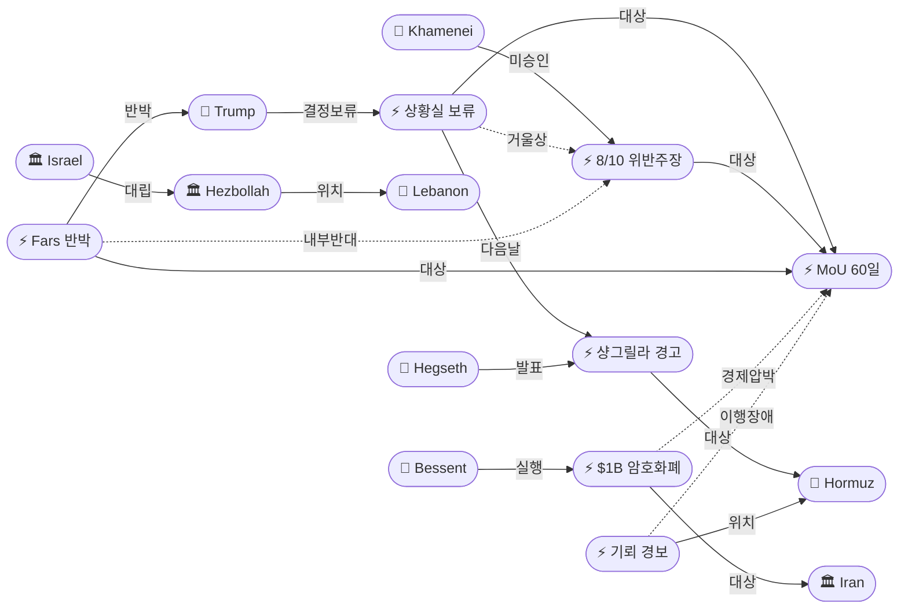
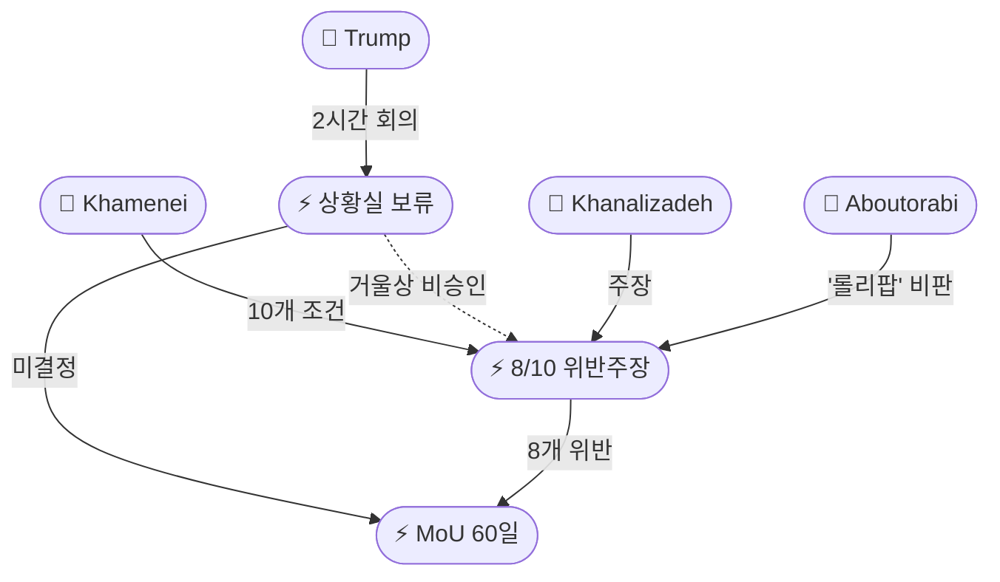
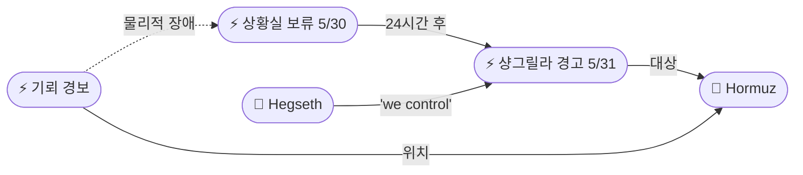
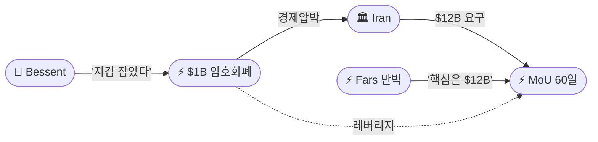

# 2026-05-31 2026 Iran War OSINT 일일 보고서

## 요약

Day 93. **'거울상 교착(Mirrored Deadlock)'이 공식화됐다.** 트럼프 대통령이 백악관 상황실에서 2시간 회의를 마쳤으나 MoU에 대한 **'최종 결정'을 발표하지 않았다** — 하메네이 역시 미승인 상태로, CNN이 명명한 '거울상 비승인(mirrored positions)' 구조가 확정됐다. 다음 날 헤그세스 국방장관은 싱가포르 샹그릴라 대화에서 **"우리가 해협을 통제한다(we control the strait)"**며 군사 재개 준비 완료를 경고했다. 이란에서는 Fars 통신이 트럼프의 요구를 **"진실과 거짓의 혼합(mixture of truth and falsehood)"**으로 규정하며 MoU 해석 차이를 최초로 구체화했고, 내부 인사이더는 MoU가 **하메네이 승인 조건 10개 중 8개를 위반**한다고 주장했다. 한편 미 재무장관 베센트는 **이란 암호화폐 $1B 압류**를 공개했고, 오만은 호르무즈 해협에서 **부유기뢰 의심 물체 경보**를 발령했다.

## 주요 뉴스

### 1. 트럼프 상황실 2시간 회의 — '최종 결정' 없이 종료
- **출처:** [CNBC](https://www.cnbc.com/2026/05/29/trump-iran-deal-hormuz-nuclear-war.html)
- **일시:** 2026-05-30
- **내용:** 트럼프 대통령이 **2시간 동안 백악관 상황실 회의**를 주재했으나 이란 MoU에 대한 **최종 결정을 발표하지 않았다.** MoU 텍스트는 화요일(5/27)에 이미 대체로 합의된 상태였으나 트럼프가 중재자에게 "더 많은 시간이 필요하다"고 통보했다. 회의 전 트럼프는 3대 요구조건을 공개했으나 이란 Fars 통신이 즉각 반박했다. CNN은 트럼프와 하메네이가 **'거울상(mirrored positions)'** — 양쪽 협상팀이 합의했으나 최고지도자가 승인하지 않은 동일 구조라고 분석했다.
- **상태:** 업데이트 ← 2026-05-30 "트럼프 상황실 최종 결정"
- **관련 엔티티:** Donald Trump, JD Vance, MoU 60-Day Framework, Strait of Hormuz

### 2. 헤그세스 샹그릴라 대화 — '우리가 해협을 통제한다' 군사 경고
- **출처:** [Newsweek](https://www.newsweek.com/us-ready-to-restart-attacks-on-iran-if-deal-falls-through-hegseth-12012217), [RFE/RL](https://www.rferl.org/a/iran-war-us-hormuz-oil-blockade-gulf-israel/33640284.html)
- **일시:** 2026-05-31
- **내용:** 헤그세스 국방장관이 **싱가포르 IISS 샹그릴라 대화**에서 미군의 전투 재개 준비를 경고했다. **"그들이 해협을 통제한다고 말하고 싶어하지만, 우리가 통제한다(They want to say that they control the strait but we do)."** 이란이 핵무기 포기 딜을 원하지 않으면 **"미군을 상대하면 된다(they can deal with the US military)"**고 경고했으며, 무기 비축량이 **"충분하다(enough to get the job done)"**고 언급했다. 트럼프 결정 보류 다음 날 나온 발언으로, 외교 교착 → 군사 대안의 2단계 시퀀스를 형성한다.
- **상태:** 신규
- **관련 엔티티:** Pete Hegseth, Strait of Hormuz, Iran, IRGC

### 3. 이란 Fars '진실과 거짓의 혼합' — MoU 3대 해석 차이 최초 공개
- **출처:** [The Week India](https://www.theweek.in/news/middle-east/2026/05/30/mix-of-truth-and-lies-iran-on-trump-s-nuclear-hormuz-demands-ahead-of-ceasefire-decision.html)
- **일시:** 2026-05-30
- **내용:** 이란 반관영 Fars 통신이 트럼프의 MoU 요구 사항을 **"진실과 거짓의 혼합(mixture of truth and falsehood)"**으로 규정하며 3가지 구체적 반박을 제기했다: (1) MoU 텍스트에 **'통행료 면제' 조항은 없다** — 트럼프의 "no tolls" 주장과 모순, (2) MoU에 이란 **핵물질 해체/파괴 언급이 없다** — 트럼프의 핵 폐기 요구와 불일치, (3) 합의의 **"가장 중요한 부분"은 동결자산 $12B 즉시 지급** — 이 지급 없이는 추가 협상에 응하지 않겠다는 입장. 트럼프의 주장을 **"날조된 승리(manufactured victory)"**로 특징지었다.
- **상태:** 신규
- **관련 엔티티:** Donald Trump, Iran, MoU 60-Day Framework, Strait of Hormuz

### 4. 이란 인사이더 — 'MoU가 하메네이 조건 10개 중 8개 위반'
- **출처:** [Iran International](https://www.iranintl.com/en/202605298158)
- **일시:** 2026-05-30
- **내용:** 이슬라마바드 협상에 동행한 국영TV 논객 **메흐디 카날리자데(Mehdi Khanalizadeh)**가 MoU 초안이 **모즈타바 하메네이가 승인한 10개 조건 중 8개를 위반**하며 SNSC(최고국가안보회의)의 휴전 성명과도 모순된다고 주장했다. 의원 **아부토라비(Aboutorabi)**는 미국의 제안을 **"롤리팝(lollipop)"** — 구속력 없는 $300B 재건 기금으로 호르무즈 개방을 요구하는 것이라 비판했다. 이스라엘 소식통도 "하메네이가 MoU 조건을 승인했다는 **징후가 없다(no indication)**"고 전했다.
- **상태:** 신규
- **관련 엔티티:** Mehdi Khanalizadeh, Abolfazl Aboutorabi, Mojtaba Khamenei, MoU 60-Day Framework

### 5. 베센트 — 이란 암호화폐 $1B 압류, '지갑을 통째로 잡았다'
- **출처:** [CoinDesk](https://www.coindesk.com/business/2026/05/30/u-s-says-it-seized-about-usd1-billion-in-iranian-crypto-as-pressure-campaign-expands)
- **일시:** 2026-05-30
- **내용:** 미 재무장관 **스콧 베센트(Scott Bessent)**가 2026 레이건 국가경제포럼에서 미국이 **이란 암호화폐 약 $1B(누적)을 압류**했다고 밝혔다. **"지갑을 통째로 잡았다(outright grabbed the wallets)"**고 표현했다. 이란이 월 **$400~500M**을 제재 회피로 탈취하고 있다는 수치를 최초 공개했다. **Operation Economic Fury**(2025년 3월 시작) 하에 석유 판매, 그림자 은행, 해운, 암호화폐 채널을 겨냥하고 있으며, 4월 트론 블록체인에서 $344M USDT 동결에 이어 누적 $1B에 도달했다.
- **상태:** 신규
- **관련 엔티티:** Scott Bessent, Iran, Operation Economic Fury

### 6. 오만 호르무즈 부유기뢰 경보 — MoU 이행 난제 시사
- **출처:** [Xinhua](https://english.news.cn/20260531/bb95c39249c64ce6bcbf8ca952f1e0e9/c.html), [Arab News](https://www.arabnews.com/node/2645440/middle-east)
- **일시:** 2026-05-31
- **내용:** 오만 해양안전센터가 **호르무즈 해협 내 연안통항대(Inshore Traffic Zone) 서쪽 오만 영해**에서 **부유기뢰 의심 물체**를 발견하고 해양 경보를 발령했다. 모든 선박·어선에 **최대 주의**를 당부하고 의심 물체와 안전 거리를 유지하라고 권고했다. 물체의 회수 여부와 출처는 불명이다. MoU에 이란의 **30일 이내 기뢰 제거** 조건이 포함되어 있어, 부유기뢰의 존재는 합의 이행의 물리적 난제를 시사한다.
- **상태:** 신규
- **관련 엔티티:** Strait of Hormuz, Oman, MoU 60-Day Framework

### 7. '환상의 휴전' — IDF 1,600회·헤즈볼라 500회 공격 통계
- **출처:** [Terrorism Watch](https://www.terrorismwatch.org/2026/05/1600-strikes-500-drone-attacks-illusion.html)
- **일시:** 2026-04-16~2026-05-27
- **내용:** 4/16 이스라엘-레바논 휴전 이후 6주간 IDF는 **1,600회 이상 공습**, 헤즈볼라는 **약 500회 로켓/드론 공격**을 수행한 것으로 집계됐다. 전쟁 개시 이후 레바논 사망자는 **3,213명**, 부상자 **9,700명 이상**. 기사는 휴전을 **"환상(illusion)"**으로 규정했다. 이란이 MoU에 레바논 포함을 요구하는 배경으로, 실질적 휴전 없는 합의는 이란에 비대칭적으로 불리하다.
- **상태:** 신규
- **관련 엔티티:** Israel, Hezbollah, Lebanon

### 8. CNN 분석 — '거울상 비승인' 5가지 변수
- **출처:** [CNN](https://edition.cnn.com/2026/05/30/world/what-to-watch-iran-memo-intl)
- **일시:** 2026-05-30
- **내용:** CNN이 트럼프 MoU 결정의 5가지 핵심 변수를 분석했다: (1) **미-이란 군사 충돌 에스컬레이션** — 딜 자체를 훼손할 리스크, (2) **레바논 분쟁** — 이란이 포함을 요구, (3) **하메네이 승인 불확실성**, (4) **트럼프의 국내 정치 계산** — 중간선거 영향, (5) **유가 움직임** — MoU의 바로미터. 핵심 통찰: 트럼프와 하메네이는 **'거울상(mirrored positions)'** — 양쪽 협상팀이 합의했으나 최고지도자가 서명하지 않은 동일 구조에 있다.
- **상태:** 신규
- **관련 엔티티:** Donald Trump, Mojtaba Khamenei, MoU 60-Day Framework

## 지식그래프

### 오늘의 주요 관계

1. **거울상 교착:** 트럼프 상황실 결정 보류(ent-472) ↔ 하메네이 조건 8/10 위반 주장(ent-475) — 양측 최고지도자 동시 미승인으로 구조적 교착.
2. **2단계 시퀀스:** 상황실 보류(ent-472) → 헤그세스 샹그릴라 군사 경고(ent-473) — 외교 교착 시 군사 대안이 24시간 내 활성화됨을 시사.
3. **이란 내부 반대 연합:** Fars MoU 반박(ent-474) + 하메네이 조건 위반 주장(ent-475) + 아부토라비 '롤리팝' 비판 — 보수/강경 진영의 조직적 반대 캠페인.
4. **경제 압박 병행:** $1B 암호화폐 압류(ent-478)가 MoU 협상과 동시 진행 — 이란 $12B 동결자산 요구와 대조.
5. **이행 장애물:** 오만 부유기뢰 경보(ent-479)가 MoU 30일 기뢰 제거 조건의 현실성에 의문 제기.

### 전체 지식그래프 시각화

### 주제별 세부 그래프

#### 거울상 교착 구조

#### 외교실패 → 군사대안 시퀀스

#### 경제 전쟁 트랙

## 온톨로지 변경

| 변경 유형 | 대상 | 근거 |
|----------|------|------|
| 새 엔티티 | ent-472 Trump Situation Room No-Decision (Event) | 2시간 회의 후 MoU 최종 결정 미발표 |
| 새 엔티티 | ent-473 Hegseth Shangri-La Speech (Event) | 싱가포르에서 군사 재개 준비 경고 |
| 새 엔티티 | ent-474 Iran Fars MoU Rebuttal (Event) | '진실과 거짓의 혼합' — 3대 해석 차이 공개 |
| 새 엔티티 | ent-475 MoU Khamenei 8/10 Breach Claim (Event) | 내부 인사이더 하메네이 조건 위반 주장 |
| 새 엔티티 | ent-476 Mehdi Khanalizadeh (Person) | 국영TV 논객, 이슬라마바드 동행 인사이더 |
| 새 엔티티 | ent-477 Scott Bessent (Person) | 미 재무장관, $1B 암호화폐 압류 공개 |
| 새 엔티티 | ent-478 US $1B Iran Crypto Seizure (Event) | Operation Economic Fury 누적 $1B |
| 새 엔티티 | ent-479 Oman Hormuz Mine Alert (Event) | 오만 영해 부유기뢰 의심 물체 경보 |
| 새 엔티티 | ent-480 Lebanon Ceasefire Statistics (Event) | IDF 1,600회/헤즈볼라 500회 통계 |
| 새 엔티티 | ent-481 Abolfazl Aboutorabi (Person) | 이란 의원, MoU '롤리팝' 비판 |
| 스키마 변경 | 없음 | 기존 클래스/관계로 모든 신규 엔티티 표현 가능 |

## 추론 결과

| 추론 | 신뢰도 | 근거 |
|------|--------|------|
| 상황실 보류(ent-472) ↔ 하메네이 비승인(ent-475) 거울상 교착 | 0.75 | CNN 'mirrored positions' — 양측 최고지도자 동시 미승인으로 상호 기다리는 치킨게임 |
| 상황실 보류(ent-472) → 샹그릴라 경고(ent-473) 2단계 시퀀스 | 0.80 | 대통령 결정 보류 24시간 후 국방장관 군사 경고 — 의도적 good cop/bad cop |
| Fars 반박(ent-474) ↔ 하메네이 위반 주장(ent-475) 내부 반대 연합 | 0.80 | Fars(IRGC 계열) + 카날리자데(국영TV) + 아부토라비(의원) 3중 반대 전선 |
| $1B 암호화폐 압류(ent-478) ↔ MoU(ent-456) 경제 레버리지 | 0.75 | MoU 협상 병행 경제 압박 — 이란 $12B 요구와 대조 |
| 호르무즈 기뢰(ent-479) ↔ MoU(ent-456) 이행 장애 | 0.70 | MoU 30일 기뢰 제거 조건 vs. 부유기뢰 현존 |
| 레바논 휴전 통계(ent-480) ↔ MoU(ent-456) 이란 레버리지 | 0.70 | 1,600/500 공격 = '환상의 휴전' → 이란 레바논 포함 요구 근거 |

## 분석 및 평가

### 거울상 교착 — 구조적 분석

Day 93은 미-이란 MoU가 **구조적 교착(structural deadlock)**에 진입했음을 확인한 날이다:

1. **양측 비승인의 동시성:** 트럼프는 2시간 상황실 회의 후에도 결정하지 않았고, 이스라엘 소식통에 따르면 하메네이도 MoU를 승인하지 않았다. CNN의 '거울상' 분석이 정확하다면, 양측은 상대방이 먼저 움직이기를 기다리는 **치킨게임** 상태에 있다. JPost가 "하메네이 비승인이 트럼프도 결정하지 않은 이유"라고 보도한 점은 인과관계를 시사한다.

2. **MoU 해석 차이의 표면화:** Fars의 3대 반박(통행료, 핵, $12B)은 MoU 텍스트에 대한 양측의 해석이 **근본적으로 다르다**는 것을 최초로 구체적으로 드러냈다. 트럼프가 "no tolls, unrestricted"를 요구하는 반면, Fars는 MoU에 그런 조항이 없다고 주장한다. 이는 양측이 같은 문서를 다르게 읽고 있거나, 각각의 국내 청중을 위해 전략적으로 다른 해석을 제시하고 있음을 의미한다.

3. **이란 내부 반대 연합:** Fars(IRGC 계열), 카날리자데(국영TV 내부자), 아부토라비(의원)의 동시적 MoU 비판은 이란 보수/강경 진영의 **조직적 반대 캠페인**을 시사한다. 하메네이의 10개 조건 중 8개 위반 주장은 MoU 비준을 어렵게 만드는 내부 정치적 장벽이다.

### 2단계 시퀀스 — Good Cop/Bad Cop

트럼프의 금요일 결정 보류 → 헤그세스의 토요일 샹그릴라 군사 경고는 의도적 **2단계 시퀀스**로 해석된다. 외교적 불확실성을 유지하면서 군사적 위협을 병행 전달하는 전략이다. 헤그세스의 "we control the strait"은 호르무즈 통제권에 대한 미국의 입장을 글로벌 안보 포럼에서 공식화한 것이며, 이란의 해협 주권 주장을 직접 반박한다.

### 경제 전쟁의 새 국면

베센트의 $1B 암호화폐 압류 공개는 경제 전쟁에서 새로운 국면을 보여준다. 이란이 월 $400-500M을 제재 회피로 탈취하고 있다는 수치의 최초 공개는 이란의 재정적 취약성을 노출하면서, 이란이 MoU에서 $12B 동결자산 즉시 지급을 "가장 중요한 부분"으로 요구하는 배경을 설명한다. 경제 압박과 MoU 협상은 분리된 트랙이 아니라 연동된 레버리지 구조다.

### 핵심 판단

MoU는 텍스트 합의 단계를 넘어 **정치적 승인 장벽**에 직면했다. 양측 협상팀의 합의와 최고지도자의 비승인이 공존하는 이 '거울상 교착'은 단기간에 해소되기 어려울 수 있다. 오만 기뢰 경보는 합의가 이뤄지더라도 물리적 이행에 30일 이상 걸릴 수 있음을 시사한다. 레바논 '환상의 휴전' 통계(1,600/500)는 이란이 레바논을 MoU에서 분리하기 어렵게 만드는 현실적 근거를 제공한다.

## 추적 항목

| 항목 | 최초 보고 | 상태 | 최신 업데이트 |
|------|----------|------|-------------|
| MoU 60일 프레임워크 | 2026-05-25 | 🔴 거울상 교착 | 트럼프 2시간 회의 후 결정 보류; 하메네이도 미승인; Fars 3대 해석 차이 공개 |
| 호르무즈 해협 통항 | 2026-04-07 | 🟡 이중 봉쇄 + 기뢰 경보 | 오만 영해 부유기뢰 경보; 헤그세스 'we control the strait' |
| 이-레 휴전 및 회담 | 2026-04-16 | 🔴 '환상의 휴전' | IDF 1,600회/헤즈볼라 500회 공격 — 명목상 휴전 |
| IRGC-외교부 이원화 | 2026-04-18 | 🔴 내부 반대 연합 | Fars + 카날리자데 + 아부토라비 3중 MoU 반대 |
| 핵 협상 (HEU/농축) | 2026-04-12 | 🟡 해석 차이 | Fars '핵 폐기 언급 없다' vs. 트럼프 '핵무기 절대 불가' |
| 유가 동향 | 2026-04-07 | 🟢 5월 -19% 마감 | 5월 종가 Brent $92.05; 결정 보류로 추가 변동 가능 |
| 경제 전쟁 | 2026-04-19 | 🟡 압박 강화 | 베센트 $1B 암호화폐 압류 공개; 이란 월 $400-500M 회피 |
| 알리 아즈마에이 사망 | 2026-05-30 | 🟡 미확인 지속 | 이란 국영TV 부인, 공식 확인/부인 없음 |

## 동향 요약

| 분류 | 상태 | 비고 |
|------|------|------|
| 미-이란 외교 | 🔴 거울상 교착 | 트럼프·하메네이 양쪽 미승인; MoU 3대 해석 차이 표면화 |
| 이란 내부 | 🔴 반대 연합 | Fars + 국영TV 내부자 + 의원 = 3중 MoU 반대 캠페인 |
| 호르무즈 해협 | 🟡 기뢰 경보 | 오만 부유기뢰 경보 + 헤그세스 'we control' |
| 이-레 전선 | 🔴 환상의 휴전 | 4/16 이후 IDF 1,600회 + 헤즈볼라 500회 — 실질 전투 지속 |
| 유가 | 🟢 5월 최대 하락 | Brent $92.05 (-19% 월간); 결정 보류로 불확실성 지속 |
| 경제 전쟁 | 🟡 압박 강화 | $1B 암호화폐 압류; 이란 $12B 동결자산 요구 |

## 출처 목록

1. [Trump ends Iran meeting without announcing 'final determination' on deal](https://www.cnbc.com/2026/05/29/trump-iran-deal-hormuz-nuclear-war.html) - CNBC, 2026-05-30
2. [US Ready to Restart Attacks on Iran if Deal Falls Through — Hegseth](https://www.newsweek.com/us-ready-to-restart-attacks-on-iran-if-deal-falls-through-hegseth-12012217) - Newsweek, 2026-05-31
3. [US 'More Than Capable' Of Resuming Strikes Against Iran, Hegseth Says](https://www.rferl.org/a/iran-war-us-hormuz-oil-blockade-gulf-israel/33640284.html) - RFE/RL, 2026-05-31
4. ['Mix of truth and lies': Iran on Trump's nuclear, Hormuz demands](https://www.theweek.in/news/middle-east/2026/05/30/mix-of-truth-and-lies-iran-on-trump-s-nuclear-hormuz-demands-ahead-of-ceasefire-decision.html) - The Week India, 2026-05-30
5. [Draft US MoU breaches eight of 10 terms approved by Khamenei, insider says](https://www.iranintl.com/en/202605298158) - Iran International, 2026-05-30
6. [U.S. says it seized about $1 billion in Iranian crypto](https://www.coindesk.com/business/2026/05/30/u-s-says-it-seized-about-usd1-billion-in-iranian-crypto-as-pressure-campaign-expands) - CoinDesk, 2026-05-30
7. [Oman issues maritime alert over suspected floating mine in Hormuz Strait](https://english.news.cn/20260531/bb95c39249c64ce6bcbf8ca952f1e0e9/c.html) - Xinhua, 2026-05-31
8. [Oman Maritime Security Centre warns of suspected sea mine](https://www.arabnews.com/node/2645440/middle-east) - Arab News, 2026-05-31
9. [1,600 Strikes, 500 Drone Attacks: The 'Illusion' Of Israel-Lebanon Ceasefire](https://www.terrorismwatch.org/2026/05/1600-strikes-500-drone-attacks-illusion.html) - Terrorism Watch, 2026-05-31
10. [What to watch in the US-Iran memo to end the war](https://edition.cnn.com/2026/05/30/world/what-to-watch-iran-memo-intl) - CNN, 2026-05-30
11. [Trump says ceasefire extension deal with Iran is near, but core issues remain](https://www.npr.org/2026/05/30/nx-s1-5839359/trump-says-a-ceasefire-extension-deal-with-iran-is-near-but-core-issues-remain) - NPR, 2026-05-30
12. [Iran official says Trump is stalling talks with 'excessive demands'](https://www.nbcnews.com/world/iran/wait-iran-deal-continues-trump-final-determination-rcna347659) - NBC News, 2026-05-30
13. [Live Updates: Hegseth signals US military is ready](https://www.foxnews.com/live-news/iran-war-news-trump-update-strait-hormuz-lebanon-oil-prices-may-30) - Fox News, 2026-05-31
14. [Pentagon Ready to Resume Strikes if Iran Peace Deal Collapses](https://www.kyivpost.com/post/77174) - Kyiv Post, 2026-05-31
15. [Trump meets team to decide on Iran deal](https://www.axios.com/2026/05/29/trump-iran-deal-decision) - Axios, 2026-05-30
16. [Live Updates: Trump decision yet to come as Hegseth talks negotiations](https://www.cbsnews.com/live-updates/iran-war-us-trump-vance-ceasefire-strait-of-hormuz-deal-close/) - CBS News, 2026-05-31
17. [트럼프 '최종판단' 회의했지만…이란 휴전 결론 못내](https://www.fnnews.com/news/202605300633468743) - 파이낸셜뉴스, 2026-05-30
18. [이란 "최종 합의는 아직"‥군사적 충돌도 계속](https://imnews.imbc.com/replay/2026/nwtoday/article/6826349_37012.html) - MBC, 2026-05-31
19. [Fact Check: IRGC Navy commander Ali Azmaei killed?](https://sundayguardianlive.com/world/fact-check-irgc-navy-commander-ali-azmaei-killed-in-us-strike-on-bandar-abbas-heres-what-we-know-197775/) - Sunday Guardian Live, 2026-05-31
20. ['We Outright Grabbed The Wallets': Bessent Boasts $1BN In Iran Crypto Seized](https://www.zerohedge.com/crypto/we-outright-grabbed-wallets-bessent-boasts-1bn-iran-state-crypto-seized-date) - ZeroHedge, 2026-05-30
