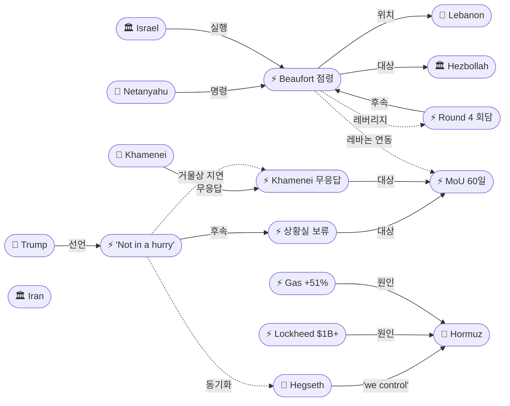
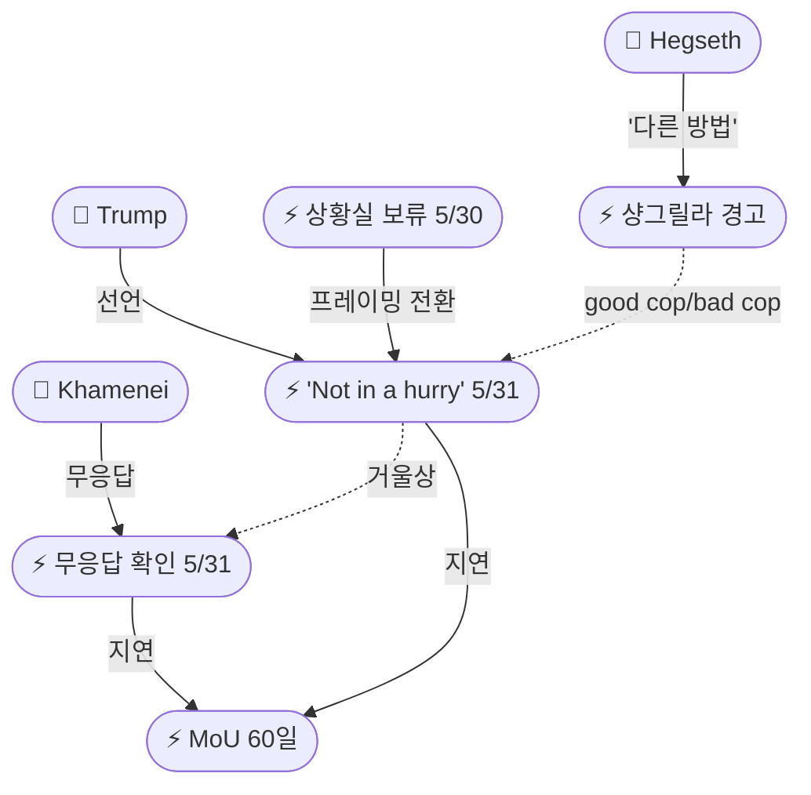
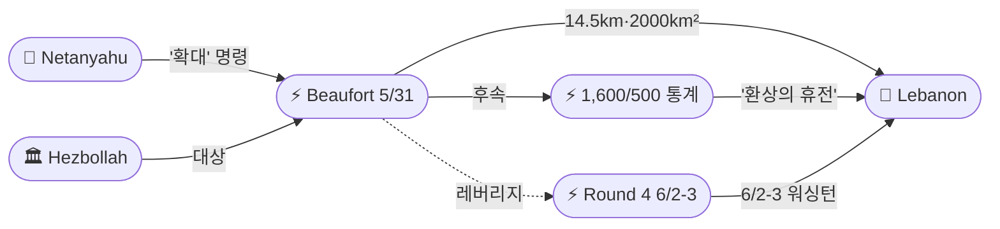
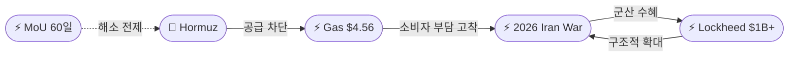

# 2026-06-01 2026 Iran War OSINT 일일 보고서

## 요약

Day 94. **'의도적 지연 경쟁(Deliberate Delay Contest)'이 새 국면을 형성했다.** 트럼프 대통령이 Fox News 인터뷰에서 **"서두르지 않는다(not in a hurry)"**며 이란 딜 서명을 의도적으로 유보하고 있음을 공식화했다 — 전날 상황실 결정 보류가 '우유부단'이 아닌 '전략적 인내'임을 프레이밍. 같은 날 JPost는 하메네이가 **MoU와 최신 미국 제안 모두에 응답하지 않았다**고 확인하여, '거울상 비승인'이 '거울상 의도적 지연'으로 진화했다. 한편 이스라엘은 26년 만에 가장 깊은 레바논 침투를 기록하며 **보포르 성(Beaufort Castle)을 점령**하고, 대피 명령을 자하라니강(리타니 10km 북쪽)까지 확대하여 **레바논 영토 1/5(~2,000km²)**을 점령 중이다 — 6/2-3 워싱턴 4차 회담 직전의 최대 기정사실화.

## 주요 뉴스

### 1. 트럼프 "서두르지 않는다" — 의도적 지연 전략 공식화
- **출처:** [CNBC](https://www.cnbc.com/2026/05/31/still-no-deal-to-end-us-iran-war-trump-says-hes-not-in-a-hurry.html), [Fox News](https://www.foxnews.com/live-news/trump-iran-war-peace-talks-hormuz-may-31)
- **일시:** 2026-05-31
- **내용:** 트럼프 대통령이 Lara Trump 진행 Fox News 인터뷰에서 이란 딜에 대해 **"서두르지 않는다(not in a hurry)"**고 선언했다. **"서두르면 좋은 딜을 만들 수 없다"**, **"slowly but surely"**, 협상 실패 시 **"다른 방법으로 끝내겠다(we'll end it a different way)"**고 밝혔다. 전날 상황실 2시간 회의 후 결정을 보류한 것이 '우유부단'이 아닌 **의도적 전략**임을 프레이밍한 것이다. CBS는 트럼프가 MoU 합의문을 **직접 수정(personally edited)**하며 우라늄 재고 운명에 집중하고 있다고 보도했다.
- **상태:** 신규
- **관련 엔티티:** Donald Trump, MoU 60-Day Framework, Strait of Hormuz

### 2. 이스라엘 보포르 성 점령 — 26년 만 최심 침투, '극적 전환' 선언
- **출처:** [Al Jazeera](https://www.aljazeera.com/news/2026/5/31/israel-issues-more-displacement-orders-in-lebanon-seizes-strategic-castle), [NBC News](https://www.nbcnews.com/world/lebanon/israel-captures-key-lebanon-site-crossing-litani-river-rcna347732), [CNN](https://www.cnn.com/2026/05/31/middleeast/israel-captures-beaufort-castle-lebanon-intl-hnk)
- **일시:** 2026-05-31
- **내용:** IDF가 레바논 남부의 전략적 **보포르 성(Beaufort Castle)**을 점령했다. 나바티예(Nabatiyeh) 인근 전략 고지에 위치한 십자군 시대 요새로, 이스라엘 국경에서 **14.5km** 떨어져 있다. 네타냐후는 **"지상 기동을 확대하라(expand ground manoeuvre)"** 명령을 하달하며 **"극적 전환(dramatic shift)"**이라 선언했다. 2000년 철수 이후 **26년 만에 가장 깊은 침투**이다. IDF 대피 명령이 리타니강 10km 북쪽 **자하라니강(Zahrani River)**까지 확대되어, 당초 목표(리타니 이남)를 크게 넘어선 작전을 공식화했다.
- **상태:** 신규
- **관련 엔티티:** Benjamin Netanyahu, Israel, IDF, Lebanon, Beaufort Castle, Hezbollah

### 3. 레바논 영토 1/5 점령 — 프랑스 UNSC 회의 요청
- **출처:** [Al Jazeera](https://www.aljazeera.com/news/2026/5/31/israeli-forces-push-past-lebanons-litani-river-how-significant-is-it)
- **일시:** 2026-05-31
- **내용:** 이스라엘군이 현재 레바논 영토 약 **2,000km²(~770 sq miles)**를 점령 중이며, 이는 레바논 전체 면적의 **약 1/5**에 해당한다. 프랑스는 이스라엘의 확대 침공을 규탄하며 **유엔 안보리 회의를 요청**했다. 4/16 휴전 이후 이스라엘 공격으로 **657명**이 사망했다. 이스라엘이 당초 목표를 넘어 확대되는 것은 워싱턴 회담에서의 영토적 기정사실 전략으로 분석된다.
- **상태:** 신규
- **관련 엔티티:** Israel, Lebanon, France, Hezbollah

### 4. 6/2-3 워싱턴 4차 이-레 회담 — 안보/정치 트랙 분리
- **출처:** [Washington Institute](https://www.washingtoninstitute.org/policy-analysis/israel-lebanon-talks-round-4-pentagon-takes-seat), [PBS](https://www.pbs.org/newshour/world/israel-and-lebanon-agree-to-45-day-extension-of-ceasefire-u-s-state-department-says)
- **일시:** 2026-06-02~03 (예정)
- **내용:** 이스라엘-레바논 4차 회담이 **6월 2-3일** 워싱턴에서 개최된다. 이번 라운드부터 **안보 트랙(펜타곤)**과 **정치 트랙(국무부)**이 분리되어 진행된다. 의제: (1) IDF 철수 일정, (2) LAF(레바논군) 남부 인수, (3) 레바논군 재정 지원, (4) 헤즈볼라 무장해제, (5) 휴전 이행 메커니즘. 5/29 펜타곤 군사 조정 회의에서 "정치 트랙에서 상당한 진전"이 있었다고 발표했다.
- **상태:** 신규
- **관련 엔티티:** Israel, Lebanon, United States, Hezbollah

### 5. 하메네이 MoU·최신 제안 모두 무응답 — '거울상 지연' 확정
- **출처:** [Jerusalem Post](https://www.jpost.com/middle-east/iran-news/article-897909)
- **일시:** 2026-05-31
- **내용:** JPost가 **하메네이가 최신 미국 제안과 MoU 초안 모두에 응답하지 않았다**고 확인했다. 미국 고위 관리는 하메네이가 "대체적 프레임워크를 승인했다"고 브리핑했으나, 실제 MoU 텍스트에 대한 최종 승인은 없는 상태. 트럼프의 'not in a hurry'와 하메네이의 무응답이 같은 날 확인됨으로써, Day 93의 '거울상 비승인'이 **'거울상 의도적 지연'**으로 진화한 것이 확정됐다.
- **상태:** 신규
- **관련 엔티티:** Mojtaba Khamenei, Donald Trump, MoU 60-Day Framework

### 6. 록히드마틴 $1B+ 계약 — 이란 전쟁이 군산복합체 구조 변형
- **출처:** [Fort Worth Report](https://fortworthreport.org/2026/05/31/lockheed-martin-awarded-1b-in-military-contracts-as-iran-war-leads-to-buildup/)
- **일시:** 2026-05-31
- **내용:** 록히드마틴이 5월 말 **$1B 이상의 군사 계약**을 수주했다. 핵심은 5/18 해군항공시스템사령부 발주 **$879M F-35 부품**(미사일 발사대, 폭탄 거치대, 기관포 시스템, 파일런) 계약. THAAD 요격미사일 생산은 연 96기 → **400기로 4배** 확대. 1월 계약 기준 THAAD 1기당 $12.77M. 이란 전쟁이 단기 군비 소모를 넘어 **군산복합체의 구조적 확대**를 추동하고 있다.
- **상태:** 신규
- **관련 엔티티:** Lockheed Martin, US Military, 2026 Iran War

### 7. 가스 $4.56 (+51%) — 전쟁 끝나도 '전쟁 전 가격 불가'
- **출처:** [Newsweek](https://www.newsweek.com/gas-prices-set-to-stay-high-even-if-iran-war-ends-12001888)
- **일시:** 2026-06-01
- **내용:** 미국 전국 평균 가솔린 가격이 **$4.56/갈런**으로 전쟁 개시 이후 **+51%** 상승했다. Newsweek는 전쟁이 종료되더라도 2026년 내 전쟁 이전 가격으로 복귀하는 것은 **"불가능(kiss that number goodbye)"**이라고 분석했다. 정제 시설 가동 중단, 해운 보험료 상승, 물류 재편 비용이 구조적으로 정착했기 때문이다. Brent는 $91.2/bbl(6주 최저)로 딜 기대감에 하락했으나 소매 가격에는 미반영.
- **상태:** 신규
- **관련 엔티티:** Strait of Hormuz, 2026 Iran War

### 8. 트럼프 MoU 직접 수정 — 우라늄 재고 운명에 집중
- **출처:** [Times of Israel](https://www.timesofisrael.com/trump-said-seeking-changes-to-iran-deal-focused-on-fate-of-uranium-stockpile/), [CBS](https://www.cbsnews.com/live-updates/iran-war-us-trump-vance-ceasefire-strait-of-hormuz-deal-close/)
- **일시:** 2026-05-31
- **내용:** CBS와 Times of Israel이 트럼프가 MoU 합의문을 **직접 편집(personally edited)**하고 있으며, 이란의 **고농축 우라늄(HEU) 재고 처리**에 집중하고 있다고 보도했다. 'not in a hurry' 선언과 결합하면, 트럼프는 시간을 벌면서 핵 조항을 강화하려는 전략으로 읽힌다.
- **상태:** 업데이트 ← 2026-05-31 "트럼프 상황실 보류"
- **관련 엔티티:** Donald Trump, MoU 60-Day Framework, Nuclear Program

## 지식그래프

### 오늘의 주요 관계

1. **의도적 지연 경쟁:** Trump 'not in a hurry'(ent-482) ↔ Khamenei 무응답(ent-485) — '거울상 비승인'에서 '거울상 의도적 지연'으로 진화. 양측이 시간을 무기로 사용.
2. **군사-외교 레버리지:** Beaufort 점령(ent-483) → 워싱턴 4차 회담(ent-484) — 회담 전일 최대 군사 확대로 기정사실 형성 (이전 라운드 패턴 반복).
3. **2단계 위협 동기화:** Hegseth 'we control'(ent-473) + Trump '다른 방법'(ent-482) — 동일 날짜 국방장관/대통령 이중 위협.
4. **경제 구조 변형:** Lockheed $1B+(ent-486) ↔ Gas +51%(ent-487) — 군산복합체 수혜 vs. 소비자 부담의 이중 구조.
5. **레바논-MoU 연동:** Beaufort 점령(ent-483) → MoU(ent-456) — 이란 '레바논 없는 MoU 거부' 근거 강화.

### 전체 지식그래프 시각화

### 주제별 세부 그래프

#### 거울상 의도적 지연 (Mirrored Deliberate Delay)

#### 이스라엘-레바논 군사-외교 시퀀스

#### 경제 구조 변형

## 온톨로지 변경

| 변경 유형 | 대상 | 근거 |
|----------|------|------|
| 새 엔티티 | ent-482 Trump 'Not in a Hurry' Declaration (Event) | Fox 인터뷰에서 의도적 지연 전략 공식화 |
| 새 엔티티 | ent-483 Israel Beaufort Castle Seizure (Event) | 26년 만 최심 침투; 2,000km² 점령; '극적 전환' |
| 새 엔티티 | ent-484 Israel-Lebanon Round 4 Washington (Event) | 6/2-3 안보/정치 분리 트랙 회담 |
| 새 엔티티 | ent-485 Khamenei Non-Response Confirmed (Event) | MoU+최신 제안 모두 무응답 확인 |
| 새 엔티티 | ent-486 Lockheed Martin $1B+ Contracts (Event) | $879M F-35 + THAAD 400기/년 |
| 새 엔티티 | ent-487 US Gas Price Crisis +51% (Event) | $4.56/gal, 전쟁 종료 후에도 고착 |
| 새 엔티티 | ent-488 Beaufort Castle (Location) | 십자군 요새, 나바티예 인근 전략 고지 |
| 새 엔티티 | ent-489 Zahrani River (Location) | 리타니 10km 북쪽, IDF 대피 확대선 |
| 새 엔티티 | ent-490 Lockheed Martin (Organization) | 미 방산업체, $1B+ 수주 |
| 새 엔티티 | ent-491 Deliberate Delay Strategy (Concept) | 양측 시간 무기화 전략 개념 |
| 스키마 변경 | 없음 | 기존 클래스/관계로 모든 신규 엔티티 표현 가능 |

## 추론 결과

| 추론 | 신뢰도 | 근거 |
|------|--------|------|
| 상황실 보류(ent-472) → 'not in a hurry'(ent-482) 프레이밍 전환 | 0.75 | 비승인(passive) → 의도적 지연(active)으로 내러티브 전환 |
| Beaufort 점령(ent-483) ↔ Round 4 회담(ent-484) 군사-외교 레버리지 | 0.70 | 회담 전일 최대 확대 = 기정사실 레버리지 (이전 라운드 패턴 반복) |
| Trump 지연(ent-482) ↔ Khamenei 무응답(ent-485) 거울상 지속 | 0.80 | 동일 날짜 양측 비승인 확인 — 시간 경쟁 구조 |
| Hegseth 경고(ent-473) ↔ Trump '다른 방법'(ent-482) good cop/bad cop | 0.75 | 동일 날짜 국방장관/대통령 이중 위협 동기화 |
| Beaufort(ent-483) ↔ MoU(ent-456) 레바논 조항 레버리지 | 0.70 | 1/5 점령 = 이란 '레바논 없는 MoU 거부' 근거 강화 |

## 분석 및 평가

### 의도적 지연 경쟁 — 시간의 무기화

Day 94의 핵심 진전은 '거울상 비승인'(passive)에서 **'거울상 의도적 지연'(active)**으로의 진화다:

1. **Trump의 프레이밍 전환:** 전날 상황실 결정 보류가 '우유부단'으로 읽힐 수 있는 상황에서, Fox 인터뷰를 통해 '서두르면 좋은 딜을 못 만든다'는 **전략적 인내** 프레임으로 전환했다. 'slowly but surely'와 '다른 방법으로 끝내겠다'는 양수겸장 — 시간이 자신에게 유리하다는 메시지.

2. **Khamenei의 '비응답 전략':** JPost의 확인은 하메네이가 단순히 '결정하지 못한 것'이 아니라 **'의도적으로 응답하지 않는 것'**일 수 있음을 시사한다. 이란 내부의 조직적 반대(Fars, 카날리자데, 아부토라비)와 결합하면, 무응답은 내부 정치를 관리하면서 미국의 조급함을 유도하는 전략일 수 있다.

3. **누가 먼저 조급해지는가:** 양측이 시간을 무기로 사용하는 '의도적 지연 경쟁'에서 핵심 변수는 **경제적 고통의 비대칭성**이다. 미국은 가스 $4.56(+51%)로 정치적 압력을 받지만, 이란은 석유 수출 완전 차단(월 $400-500M 암호화폐 우회만 가능)으로 더 극심한 경제적 고통을 겪고 있다. 단, 이란의 고통 허용치(pain threshold)가 미국 유권자의 인내심보다 높을 수 있다.

### 이스라엘의 '보포르 패턴' — 회담 전 최대 확대

이스라엘의 보포르 성 점령은 이전 라운드에서 반복된 **'회담 전 군사 확대' 패턴**의 극대화다:
- 4/14 1차 회담 → 전날 대규모 공습
- 4/23 2차 회담 → 직전 휴전 위반
- 5/14-15 3차 회담 → 48시간 100+ 공습
- **6/2-3 4차 회담 → 보포르 점령 + 2,000km² + 자하라니강 대피**

이번이 가장 강력한 기정사실이다. 레바논 전체의 1/5을 점령한 상태에서 '철수 일정'을 논의하면, 이스라엘의 협상력이 극대화된다. 프랑스의 UNSC 회의 요청은 국제적 반발이 시작되었음을 시사하지만, 미국의 거부권이 예상된다.

### 경제 구조 변형의 이중성

Lockheed $1B+와 Gas +51%는 동일한 전쟁의 **서로 다른 경제적 결과**를 보여준다:
- **군산복합체:** THAAD 4배 확대, F-35 부품 $879M — 전쟁이 지속될수록 방산 수혜 구조 심화
- **소비자:** Newsweek의 '전쟁 끝나도 불가' 분석은 정제·보험·물류 구조가 이미 변형되었음을 의미
- **정치적 함의:** 트럼프가 'not in a hurry'를 유지할 수 있는 것은 주식시장(S&P 신기록)과 군산 수혜가 가스 가격 불만을 상쇄하고 있기 때문일 수 있다.

### 핵심 판단

Day 94는 MoU 교착이 **구조적으로 안정화**되는 날이다. 양측이 모두 '서두르지 않는다'는 것은 역설적으로 교착이 단기간에 해소되지 않을 것임을 시사한다. 교착 해소의 촉매는 외부 충격(군사적 에스컬레이션, 경제 위기 심화, 제3자 중재 돌파)에서 올 가능성이 높다. 내일(6/2-3) 워싱턴 4차 이-레 회담의 결과가 MoU 레바논 조항에 영향을 미칠 수 있는 가장 가까운 촉매이다.

## 추적 항목

| 항목 | 최초 보고 | 상태 | 최신 업데이트 |
|------|----------|------|-------------|
| MoU 60일 프레임워크 | 2026-05-25 | 🔴 의도적 지연 경쟁 | Trump 'not in a hurry' + Khamenei 무응답 = 양측 시간 무기화; Trump MoU 직접 수정 중 |
| 호르무즈 해협 통항 | 2026-04-07 | 🟡 봉쇄 지속 | Hegseth 'very much still in place'; Brent $91.2(6주 최저); Gas $4.56(+51%) |
| 이-레 휴전 및 회담 | 2026-04-16 | 🔴 1/5 점령 + 4차 회담 | Beaufort 점령·2,000km²·자하라니강; 6/2-3 Round 4 예정; 프랑스 UNSC 요청 |
| 핵 협상 (HEU/농축) | 2026-04-12 | 🟡 Trump 직접 수정 | MoU에서 우라늄 재고 운명에 집중; 'not in a hurry' = 핵 조항 강화 시간 벌기 |
| 유가 동향 | 2026-04-07 | 🟡 선물 하락·소매 고착 | Brent $91.2(-19% 5월); 소매 $4.56 구조적 고착 |
| 경제 전쟁 | 2026-04-19 | 🟡 군산복합체 확대 | Lockheed $1B+ 계약; THAAD 4배; 전쟁 경제 구조화 |
| 알리 아즈마에이 사망 | 2026-05-30 | 🟡 미확인 지속 | 추가 보도 없음 |

## 동향 요약

| 분류 | 상태 | 비고 |
|------|------|------|
| 미-이란 외교 | 🔴 의도적 지연 경쟁 | Trump 'not in a hurry' + Khamenei 무응답 = 양측 시간 무기화 |
| 이-레 전선 | 🔴 1/5 점령·최심 침투 | Beaufort 점령·2,000km²·자하라니강 대피; 6/2-3 Round 4 |
| 호르무즈 해협 | 🟡 봉쇄 지속 | Hegseth 'very much still in place'; Brent $91.2 |
| 핵 쟁점 | 🟡 Trump MoU 수정 | 우라늄 재고 운명에 집중; 핵 조항 강화 시도 |
| 유가·경제 | 🟡 선물 하락·소매 고착 | Brent $91.2 vs. Gas $4.56(+51%); 구조적 불가역 |
| 군산복합체 | 🟡 구조적 확대 | Lockheed $1B+; THAAD 4배; 전쟁 경제화 |

## 출처 목록

1. [U.S. and Iran still without deal to end war after Trump says he's not in a 'hurry'](https://www.cnbc.com/2026/05/31/still-no-deal-to-end-us-iran-war-trump-says-hes-not-in-a-hurry.html) - CNBC, 2026-05-31
2. [Trump vows Iran will end 'slowly but surely' if no deal reached](https://www.foxnews.com/live-news/trump-iran-war-peace-talks-hormuz-may-31) - Fox News, 2026-05-31
3. [South Lebanon faces 'death, destruction' as Israel deepens invasion](https://www.aljazeera.com/news/2026/5/31/israel-issues-more-displacement-orders-in-lebanon-seizes-strategic-castle) - Al Jazeera, 2026-05-31
4. [Netanyahu vows to expand Israel's grip on Lebanon after deepest incursion in 26 years](https://www.nbcnews.com/world/lebanon/israel-captures-key-lebanon-site-crossing-litani-river-rcna347732) - NBC News, 2026-05-31
5. [Israel seizes Crusader-era castle as Netanyahu orders forces deeper into Lebanon](https://www.cnn.com/2026/05/31/middleeast/israel-captures-beaufort-castle-lebanon-intl-hnk) - CNN, 2026-05-31
6. [Israeli forces push past Lebanon's Litani River: How significant is it?](https://www.aljazeera.com/news/2026/5/31/israeli-forces-push-past-lebanons-litani-river-how-significant-is-it) - Al Jazeera, 2026-05-31
7. [Israel-Lebanon Talks, Round 4: The Pentagon Takes a Seat](https://www.washingtoninstitute.org/policy-analysis/israel-lebanon-talks-round-4-pentagon-takes-seat) - Washington Institute, 2026-06-01
8. [Israel and Lebanon agree to 45-day extension of ceasefire](https://www.pbs.org/newshour/world/israel-and-lebanon-agree-to-45-day-extension-of-ceasefire-u-s-state-department-says) - PBS, 2026-05-15
9. [Khamenei has not yet responded to either latest US proposal, nor MoU](https://www.jpost.com/middle-east/iran-news/article-897909) - Jerusalem Post, 2026-05-31
10. [Lockheed Martin awarded $1B in military contracts as Iran war leads to buildup](https://fortworthreport.org/2026/05/31/lockheed-martin-awarded-1b-in-military-contracts-as-iran-war-leads-to-buildup/) - Fort Worth Report, 2026-05-31
11. [Gas Prices Set To Stay High Across 2026 — Even if Iran War Ends](https://www.newsweek.com/gas-prices-set-to-stay-high-even-if-iran-war-ends-12001888) - Newsweek, 2026-06-01
12. [Trump said seeking changes to Iran deal, focused on fate of uranium stockpile](https://www.timesofisrael.com/trump-said-seeking-changes-to-iran-deal-focused-on-fate-of-uranium-stockpile/) - Times of Israel, 2026-05-31
13. [Trump recently edited possible U.S.-Iran agreement](https://www.cbsnews.com/live-updates/iran-war-us-trump-vance-ceasefire-strait-of-hormuz-deal-close/) - CBS News, 2026-05-31
14. [Pete Hegseth: US blockade 'very much still in place' amid Iran talks](https://thehill.com/policy/international/5902453-pete-hegseth-iran-war-naval-blockade-strait-of-hormuz/) - The Hill, 2026-05-31
15. [Iran war day 93: Trump won't 'rush' deal; Israel expands Lebanon invasion](https://www.aljazeera.com/news/2026/5/31/iran-war-day-93-trump-wont-rush-deal-israel-expands-lebanon-invasion) - Al Jazeera, 2026-05-31
16. [Netanyahu Announces 'Dramatic Shift' in Lebanon Invasion](https://news.antiwar.com/2026/05/31/netanyahu-announces-dramatic-shift-in-lebanon-invasion-as-israel-conquers-medieval-castle/) - Antiwar.com, 2026-05-31
17. [Israeli PM says Lebanon ground offensive expanded past key river](https://www.cbc.ca/news/world/israel-lebanon-litani-river-9.7216696) - CBC, 2026-05-31
18. [As Israel and Lebanon extend ceasefire by 45 days, Hezbollah disarmament remains elusive](https://www.ms.now/news/israel-lebanon-ceasefire-extended-45-days-hezbollah) - MS Now, 2026-05-31
19. ["미-이란 양해각서 합의‥트럼프 최종 승인 남아"](https://imnews.imbc.com/replay/2026/nwtoday/article/6826063_37012.html) - MBC, 2026-05-31
20. ['60일 휴전' 물꼬 텄지만…핵·제재완화 협상 난항](https://www.fnnews.com/news/202605271603407018) - 파이낸셜뉴스, 2026-05-27
