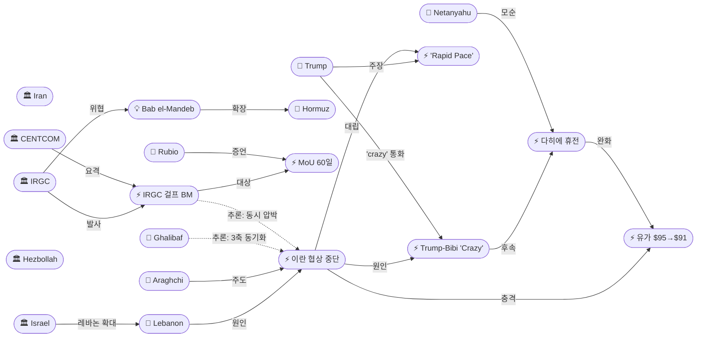
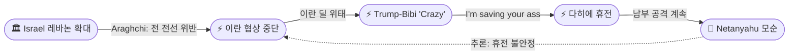
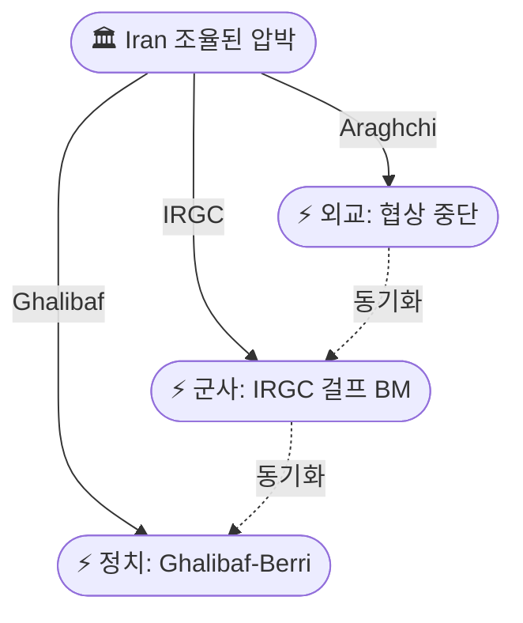
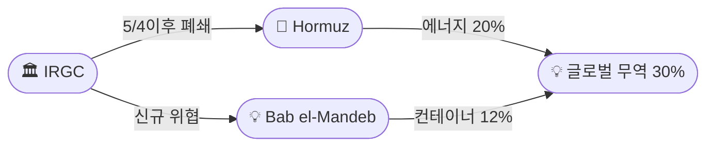

# 2026-06-03 2026 Iran War OSINT 일일 보고서

## 요약

Day 95-96. **'3축 동기화 에스컬레이션(Triaxial Synchronized Escalation)'이 트럼프 딜레마를 노출시켰다.** 이란이 이스라엘의 레바논 확대 공세를 명분으로 미국과의 **협상을 공식 중단**하는 동시에, IRGC가 쿠웨이트·바레인 미군 기지에 **탄도미사일을 발사**(CENTCOM 요격)하고, 갈리바프가 레바논 의장 베리에게 **군사 보복을 시사**하며 — 외교·군사·정치 3축을 48시간 내에 동기화했다. 트럼프는 베이루트 공습을 명령한 네타냐후에게 **"You're f\*\*king crazy. I'm saving your ass"**라며 역사적 통화로 억제한 뒤, 이스라엘-헤즈볼라 간 **다히에 프레임워크 휴전**을 발표했다. 그러나 네타냐후는 즉시 "남부 레바논 공격 계속"을 선언하여 휴전을 모순시켰다. 이란은 **Bab el-Mandeb 해협 폐쇄**까지 위협하며 해양 압박을 호르무즈 너머로 확대했고, 유가는 Brent +5%→$95 급등 후 $91로 반락하는 24시간 변동을 기록했다.

## 주요 뉴스

### 1. 이란, 미국과의 협상 공식 중단 — "전 전선 휴전 위반"
- **출처:** [NBC News](https://www.nbcnews.com/world/iran/iran-suspends-talks-us-israel-attacks-lebanon-rcna347865), [NPR](https://www.npr.org/2026/06/01/g-s1-125285/iran-israel-us-lebanon-gaza), [Middle East Eye](https://www.middleeasteye.net/news/iran-ends-peace-talks-us-and-says-it-will-close-bab-el-mandeb-strait-report)
- **일시:** 2026-06-01
- **내용:** 이란 협상팀이 **"중재자를 통한 대화 및 문서 교환을 중단"**했다고 타스님 통신이 보도했다. 아라그치 외무장관은 "이란과 미국 간 휴전은 명확히 **레바논을 포함한 전 전선의 휴전**이다. 한 전선에서의 위반은 모든 전선에서의 위반"이라고 선언했다. MoU 근접 합의 이후 **최대 외교 후퇴**로, 이스라엘의 보포르 성 점령·2,000km² 확대를 직접적 원인으로 지목했다.
- **상태:** 신규
- **관련 엔티티:** Abbas Araghchi, Iran, MoU 60-Day Framework, Israel, Lebanon

### 2. 트럼프 "대화는 빠른 속도로 진행 중" — 이란 중단 정면 반박
- **출처:** [CBS News](https://www.cbsnews.com/live-updates/iran-war-us-trump-strikes-ceasefire-lebanon-israel/), [CNN](https://www.cnn.com/2026/06/01/world/live-news/iran-trump-lebanon-war-news), [The Hill](https://thehill.com/homenews/administration/5902930-live-updates-donald-trump-iran/)
- **일시:** 2026-06-01~02
- **내용:** 트럼프 대통령이 Truth Social을 통해 이란 협상 중단 보도를 **"가짜 뉴스"**라 규정하며, **"대화는 며칠 전부터 오늘까지 빠른 속도(rapid pace)로 계속되고 있다"**고 주장했다. 이란 Tasnim의 '공식 중단' vs. 트럼프의 '지속 중' 주장이 정면 충돌하며, Day 93-94의 '거울상 의도적 지연'이 **'메시지 전쟁(Message War)'**으로 전환되었다.
- **상태:** 신규
- **관련 엔티티:** Donald Trump, Iran, MoU 60-Day Framework

### 3. 트럼프, 네타냐후에 "You're f\*\*king crazy" — 전쟁 이후 미-이 최대 충돌
- **출처:** [Time](https://time.com/article/2026/06/02/trump-netanyahu-crazy-lebanon-hezbollah-ceasefire-iran-us-peace-deal/), [Times of Israel](https://www.timesofisrael.com/liveblog-june-02-2026/)
- **일시:** 2026-06-02
- **내용:** 네타냐후가 헤즈볼라 보복을 명분으로 **베이루트 다히에 공습을 명령**하자, 트럼프가 전화를 걸어 **"You're f\*\*king crazy. You'd be in prison if it weren't for me. I'm saving your ass. Everybody hates you now. Everybody hates Israel because of this"**라고 경고했다. 이스라엘의 에스컬레이션이 이란 딜을 위태롭게 한다고 판단한 것으로, **전쟁 이후 미-이스라엘 최대 공개 충돌**이다. 트럼프는 이스라엘의 과잉 대응이 국제적 고립을 자초하고 있다고 인식했다.
- **상태:** 신규
- **관련 엔티티:** Donald Trump, Benjamin Netanyahu, Israel, Hezbollah, Lebanon

### 4. 트럼프, 다히에 프레임워크 레바논 휴전 발표
- **출처:** [JPost](https://www.jpost.com/middle-east/article-898026), [PBS](https://www.pbs.org/newshour/politics/watch-trump-announces-israel-and-lebanon-have-agreed-to-3-week-ceasefire-extension), [The Hill](https://thehill.com/homenews/5904377-trump-israel-lebanon-hezbollah-iran-ceasefire/)
- **일시:** 2026-06-02
- **내용:** 트럼프가 이스라엘-헤즈볼라 간 **다히에 프레임워크(Dahieh Framework)** 휴전을 발표했다. 핵심 구조: **이스라엘이 베이루트 남부 교외(다히에) 공습을 중단 ↔ 헤즈볼라가 이스라엘 공격을 중단**, 이 프레임워크를 **레바논 전 영토로 확대**하는 것이 목표이다. 트럼프는 양측으로부터 **디에스컬레이션 약속**을 받았다고 주장했다. 그러나 네타냐후는 직후 **"남부 레바논 공격은 계획대로 계속"**한다고 발표하고, 카츠 국방장관은 **"레바논 휴전은 존재하지 않는다"**고 부인하여 즉각 모순이 발생했다.
- **상태:** 신규
- **관련 엔티티:** Donald Trump, Benjamin Netanyahu, Israel Katz, Hezbollah, Lebanon

### 5. IRGC 탄도미사일, 쿠웨이트·바레인 미군 기지 타격 — CENTCOM 요격
- **출처:** [CNBC](https://www.cnbc.com/amp/2026/06/01/us-iran-war-missiles-kuwait.html), [CNN](https://www.cnn.com/2026/06/02/world/live-news/iran-trump-israel-lebanon-war-intl-hnk), [Washington Times](https://www.washingtontimes.com/news/2026/jun/1/us-intercepts-iranian-missiles-targeting-kuwait-central-command-says/)
- **일시:** 2026-06-01~02
- **내용:** IRGC가 쿠웨이트 주둔 미군을 겨냥해 **탄도미사일 2발**을 발사했으나, CENTCOM이 **전량 요격**하여 피해는 없었다. 바레인에도 **미사일 3발**이 발사되었으나 미-바레인 공동 방공에 의해 요격되었다. IRGC는 이를 미국의 **케심섬(Qeshm Island) 공습에 대한 보복**이라고 밝혔다. 전쟁 이후 **최초의 걸프 국가 기지 직접 타격**으로, IRGC-CENTCOM 보복 사이클이 양자에서 **걸프 다자 확대**로 전환되었다.
- **상태:** 신규
- **관련 엔티티:** IRGC, CENTCOM, Kuwait, Bahrain, Iran

### 6. CENTCOM, 케심섬 이란 드론 관제소 공습
- **출처:** [ABC News](https://abcnews.com/International/live-updates/iran-live-updates-irgc-claims-airbase-attack-after/?id=133475855)
- **일시:** 2026-06-02
- **내용:** CENTCOM이 이란 **케심섬(Qeshm Island)의 군사 지상 관제소**를 공습했다. IRGC의 미국 MQ-1 드론 격추(국제 수역 상공)에 대한 **자위권 보복**이다. IRGC가 쿠웨이트/바레인 미사일을 이 공습의 보복이라 주장하며, **CENTCOM 공습 → IRGC 걸프 BM → 추가 보복**의 에스컬레이션 사이클이 형성되었다.
- **상태:** 신규
- **관련 엔티티:** CENTCOM, IRGC, Qeshm Island

### 7. IDF 병사 보포르 성 근처 전사 — 헤즈볼라 FPV 드론 공격
- **출처:** [Times of Israel](https://www.timesofisrael.com/idf-soldier-killed-3-hurt-in-hezbollah-drone-attack-near-newly-seized-beaufort-castle/), [Haaretz](https://www.haaretz.com/israel-news/israel-security/2026-06-01/ty-article/idf-names-soldier-killed-in-southern-lebanon-drone-strike/0000019e-81ca-d51c-a59e-d5ce2e470000), [Washington Examiner](https://www.washingtonexaminer.com/news/world/4589860/idf-soldier-killed-beaufort-castle/)
- **일시:** 2026-06-01
- **내용:** IDF 코만도 여단 마글란 부대 **아담 차르파티(Adam Tzarfati) 참모하사(20세)**가 보포르 성 인근 **요흐모르(Yohmor)**에서 헤즈볼라의 **FPV 자폭 드론** 공격으로 전사했다. 3명 부상. 보포르 점령(5/31) 이후 **최초 IDF 전투 사상자**로, 헤즈볼라의 FPV 드론 전술이 이스라엘 최심 침투 지역에서도 유효함을 입증했다.
- **상태:** 신규
- **관련 엔티티:** Adam Tzarfati, IDF, Hezbollah, Beaufort Castle

### 8. 루비오 상원 증언 — "심각하고 장기적" 핵 제한, 30-60-90일 타임라인
- **출처:** [The National](https://www.thenationalnews.com/news/us/2026/06/02/iran-nuclear-talks-rubio/), [Washington Post](https://www.washingtonpost.com/national-security/2026/06/02/rubio-meet-with-congress-iran-ceasefire-falters/), [Jewish Insider](https://jewishinsider.com/2026/06/marco-rubio-iran-negotiations-sanctions-relief-nuclear/)
- **일시:** 2026-06-02
- **내용:** 루비오 국무장관이 상원 외교위원회에서 증언하며 이란이 **"심각하고 장기적인(severe and long-term)" 핵 프로그램 제한**에 합의해야 한다고 밝혔다. 핵심 조건: (1) 호르무즈 재개방만으로 **제재 해제 불가** — 제재 해제는 핵 포기에만 연동, (2) 핵 협상은 **"고도로 기술적(highly technical)"**이며 **30-60-90일** 소요 전망, (3) 이란이 **"1년 전만 해도 거부했던 핵 프로그램 측면의 협상에 합의"**했다고 확인. 이는 MoU 2단계(핵 협상) 구조를 공개적으로 상세화한 것이다.
- **상태:** 신규
- **관련 엔티티:** Marco Rubio, Iran, Nuclear Program, MoU 60-Day Framework

### 9. 이란, Bab el-Mandeb 해협 폐쇄 위협 — 이중 해협 위기
- **출처:** [Middle East Eye](https://www.middleeasteye.net/news/iran-ends-peace-talks-us-and-says-it-will-close-bab-el-mandeb-strait-report), [The Researchers](https://www.theresearchers.us/2026/06/02/iran-eyes-block-bab-el-mandeb/)
- **일시:** 2026-06-01~02
- **내용:** 이란이 호르무즈 해협에 더해 **Bab el-Mandeb(바브알만데브) 해협까지 폐쇄**하겠다고 위협했다. IRGC는 이스라엘의 레바논·가자 작전을 이유로 **"호르무즈 완전 폐쇄와 기타 전선(Bab el-Mandeb 포함) 활성화 결의"**를 밝혔다. 호르무즈는 5/4 이후 서방 동맹 상선 통과가 사실상 **제로**이며, Bab el-Mandeb까지 차단될 경우 **글로벌 컨테이너 30%, 석유·가스 25%**가 위협받는다. 에스컬레이션 사다리의 **다음 단계**로, 4/15 '홍해 봉쇄 위협'(ent-096)의 구체화이다.
- **상태:** 신규
- **관련 엔티티:** IRGC, Strait of Hormuz, Bab el-Mandeb

### 10. 이스라엘-레바논 4차 워싱턴 회담 개시
- **출처:** [Times of Israel](https://www.timesofisrael.com/liveblog_entry/new-round-of-israel-lebanon-talks-begins-in-washington/), [CBS News](https://www.cbsnews.com/live-updates/iran-war-us-trump-netanyahu-israel-lebanon-hezbollah/)
- **일시:** 2026-06-02~03
- **내용:** 이스라엘-레바논 4차 회담이 **국무부**에서 개시되었다. 미국 측은 **마이클 니덤(Michael Needham, 부NSA 승격)**과 **댄 홀러(Dan Holler, 국무부 고문)**가 주도하며, 양국 주미 대사가 참석했다. 트럼프는 양측으로부터 **디에스컬레이션 약속**을 받았다고 밝혔으나, 이스라엘-헤즈볼라 간 교전은 회담 중에도 지속되었다. 5/29 펜타곤 안보 트랙에 이어 국무부 정치 트랙이 가동된 것이다.
- **상태:** 신규
- **관련 엔티티:** Israel, Lebanon, Michael Needham, United States

### 11. 갈리바프, 레바논 의장 베리에 "이란 보복 가능" — 최대 에스컬레이션 시그널
- **출처:** [GlobalSecurity](https://www.globalsecurity.org/military/ops/iran-war-oprep.htm)
- **일시:** 2026-06-02
- **내용:** 갈리바프 이란 의회 의장이 레바논 나비 베리 의장에게 **이스라엘의 레바논 공격이 지속되면 이란이 군사 보복할 수 있다**고 전했다. 5월 말 이후 **가장 명시적인 이란 에스컬레이션 시그널**로, 이란이 레바논 전선을 자국 전쟁의 일부로 공식 연결한 것이다. 협상 중단(외교) + IRGC 걸프 BM(군사) + 갈리바프-베리(정치)의 **3축 동기화**가 완성되었다.
- **상태:** 신규
- **관련 엔티티:** Mohammad Bagher Ghalibaf, Nabih Berri, Iran, Hezbollah, Lebanon

### 12. 유가 24시간 급변 — 이란 중단→급등, 휴전→반락
- **출처:** [TradingEconomics](https://tradingeconomics.com/commodity/brent-crude-oil), [CNBC](https://www.cnbc.com/2026/06/02/rubio-iran-nuclear-talks-trump-war-strategy-hormuz.html)
- **일시:** 2026-06-02~03
- **내용:** Brent 원유가 이란 협상 중단 보도에 **+5% 급등하여 $95/bbl**를 기록한 뒤, 트럼프의 레바논 휴전 발표와 'rapid pace' 주장에 **$91/bbl까지 반락**했다. WTI는 $92/bbl 내외로 등락했다. 유가가 외교 뉴스에 대한 **24시간 바로미터**로 기능하며, 투자자들이 이란 딜 성사 여부에 극도로 민감해진 것을 보여준다.
- **상태:** 신규
- **관련 엔티티:** Strait of Hormuz, MoU 60-Day Framework

### 13. 이란, 미국 제안 검토 중이나 "핵 세부사항 협상 없었다"
- **출처:** [CBC](https://www.cbc.ca/news/world/iran-lebanon-trump-agreement-9.7220254)
- **일시:** 2026-06-03
- **내용:** 이란 매체가 미국 제안서를 **검토 중**이나 며칠간 미국과 소통하지 않았다고 보도했다. 바가에이 외교부 대변인은 **"현 단계에서 핵 세부사항에 대한 협상은 없었다"**고 밝혀, 루비오의 '이란이 핵 협상에 합의했다' 주장을 정면 반박했다. 트럼프의 'rapid pace'와 이란의 '소통 없음'이 다시 충돌했다.
- **상태:** 업데이트 ← 2026-06-01 "하메네이 무응답"
- **관련 엔티티:** Iran, Esmaeil Baghaei, Nuclear Program

## 지식그래프

### 오늘의 주요 관계

1. **48시간 인과 체인:** 이스라엘 레바논 확대(ent-004/050) → 이란 협상 중단(ent-492) → 트럼프-네타냐후 'crazy' 통화(ent-494) → 다히에 프레임워크 휴전(ent-495). 이스라엘의 기정사실 전략이 역효과를 낳아 트럼프의 역사적 억제로 이어진 아이러니.
2. **3축 동기화:** 이란 협상 중단(ent-492, 외교) + IRGC 걸프 BM(ent-496, 군사) + 갈리바프-베리 위협(ent-502, 정치) — 48시간 내 동시 발생, 이란의 조율된 압박.
3. **이중 해협 위협:** 호르무즈(ent-008) + Bab el-Mandeb(ent-500) — 에스컬레이션 사다리 확장, 글로벌 무역 30% 위협.
4. **미-이란 메시지 전쟁:** 이란 '중단'(ent-492) ↔ 트럼프 'rapid pace'(ent-493) — 실제 상태 불명확.
5. **트럼프 딜레마 노출:** 이란 딜 추구(ent-456) ↔ 이스라엘 억제 필요(ent-494) — 동시 만족 불가 구조.

### 전체 지식그래프 시각화

### 주제별 세부 그래프

#### 1. 48시간 인과 체인

#### 2. 3축 동기화 에스컬레이션

#### 3. 이중 해협 위협

## 온톨로지 변경

| 변경 유형 | 대상 | 근거 |
|----------|------|------|
| 스키마 변경 | 없음 | 모든 신규 엔티티가 기존 클래스/관계로 표현 가능 |
| 새 엔티티 | 12개 (ent-492~503) | Iran 협상 중단, Trump 'rapid pace', Trump-Netanyahu 통화, 다히에 휴전, IRGC 걸프 BM, Qeshm 공습, Tzarfati, Rubio 증언, Bab el-Mandeb 위협, Round 4, Ghalibaf-Berri, 유가 변동 |
| 기존 업데이트 | 16개 | Trump, Iran, Israel, IRGC, Hormuz, Netanyahu, Vance, Araghchi, Ghalibaf, Khamenei, Hezbollah, Lebanon, CENTCOM, Rubio, Hegseth, MoU |

## 추론 결과

| 추론 | 신뢰도 | 근거 |
|------|--------|------|
| Rubio(ent-077) + Needham + Holler → 외교 라인 공동 활동 | 0.85 | co_participation: Round 4 + 상원 증언 동일 날짜 |
| 이스라엘 확대 → 이란 중단 → Trump-Netanyahu → 휴전 (4단계 인과) | 0.90 | event_chain: 48시간 내 순차 발생 |
| Ghalibaf-Berri + 이란 중단 → 3축 동기화 에스컬레이션 | 0.82 | transitivity: 외교·군사·정치 동시 발동 |
| IRGC 걸프 BM + 협상 중단 → 외교·군사 동기화 | 0.80 | concurrent_pressure: 동일 48시간 내 |
| Bab el-Mandeb → 호르무즈 확장 에스컬레이션 | 0.88 | escalation_ladder: 4/15 홍해 위협의 구체화 |

## 분석 및 평가

### '3축 동기화'의 전략적 의미

Day 95-96에서 이란은 전쟁 이래 가장 정교한 **동기화된 압박(synchronized pressure)**을 보여주었다. 외교(협상 중단), 군사(IRGC 걸프 BM), 정치(갈리바프-베리 보복 시사)의 3축이 48시간 내에 발동된 것은 자발적 에스컬레이션이 아닌 **조율된 전략적 전환**을 시사한다. 이란은 이스라엘의 보포르 확대를 '기회의 창'으로 활용하여, 미국에게 **"이스라엘을 억제하지 않으면 딜은 없다"**는 메시지를 보낸 것이다.

### 트럼프 딜레마의 구조화

트럼프는 이란 딜(호르무즈 개방 + 핵 협상) 추진과 이스라엘 지지라는 **두 목표가 구조적으로 충돌**하는 딜레마에 직면했다. 'You're f\*\*king crazy' 통화는 이 딜레마가 **더 이상 관리 불가능한 수준**에 도달했음을 보여준다. 트럼프가 이스라엘에 대해 이런 수준의 공개 압박을 가한 것은 전례 없으며, 이란 딜 우선순위가 이스라엘 관계보다 높아진 순간으로 해석된다.

### 걸프 확대의 의미

IRGC의 쿠웨이트·바레인 기지 타격은 **양자(미-이란) 갈등의 다자(걸프) 확대**를 의미한다. CENTCOM 요격 성공에도, 걸프 국가들의 미군 주둔에 대한 **정치적 비용**이 상승한다. 이는 5/19 걸프 3국(타밈/MBS/MBZ)의 이란 공습 보류 요청(ent-399)과 연결되며, 걸프 국가들이 미국과 이란 사이에서 더 곤란한 위치에 놓이게 된다.

### Bab el-Mandeb — 에스컬레이션 사다리의 다음 칸

4/15 홍해 봉쇄 위협(ent-096)이 6/1에 **Bab el-Mandeb 구체적 폐쇄 위협**으로 진화했다. 호르무즈(에너지 20%) + Bab el-Mandeb(컨테이너 12%)의 동시 차단은 **글로벌 무역의 30%**를 위협한다. 이란이 예멘 후티/이라크 민병대와의 연계를 통해 이 위협을 실행할 수 있는 능력은 부분적이나, **위협 자체만으로도 해운 보험료와 물류 비용에 즉각적 영향**을 미친다.

## 추적 항목

| 항목 | 최초 보고 | 상태 | 최신 업데이트 |
|------|----------|------|-------------|
| MoU 60일 프레임워크 | 2026-05-25 | ⚠️ 이란 중단 | 이란 협상 중단(6/1), 트럼프 'rapid pace' 반박(6/2), 바가에이 '핵 세부 협상 없음'(6/3) |
| 이스라엘-레바논 전쟁 | 2026-04-10 | ⚠️ 다히에 휴전/모순 | 다히에 프레임워크 발표(6/2), 네타냐후 남부 공격 지속 선언(6/2), Round 4 진행 중(6/2-3) |
| IRGC-CENTCOM 보복 사이클 | 2026-05-27 | 🔴 걸프 확대 | IRGC 쿠웨이트/바레인 BM(6/1-2), CENTCOM 케심섬(6/2) — 양자→다자 전환 |
| 호르무즈 해협 | 2026-04-07 | 🔴 폐쇄 유지 | 서방 상선 5/4 이후 통과 제로; Bab el-Mandeb 확대 위협(6/1-2) |
| 트럼프-네타냐후 관계 | 2026-04-17 | 🔴 역대 최악 | 'You're f**king crazy'(6/2) — 4/17 'PROHIBITED' 이후 최대 충돌 |
| 유가 | 2026-04-07 | ↕️ 변동 | Brent $95→$91(6/2-3), 외교 뉴스 바로미터 |
| 🆕 Bab el-Mandeb 위협 | 2026-06-03 | 🟡 위협 단계 | IRGC '호르무즈 완전 폐쇄 + 기타 전선 활성화' 선언 |

## 동향 요약

| 분류 | 상태 | 비고 |
|------|------|------|
| 미-이란 협상 | ⚠️ 중단/교착 | 이란 공식 중단 vs 트럼프 '지속 중' 주장; 바가에이 '핵 협상 없음' |
| 이-레 전선 | ⚠️ 다히에 휴전/모순 | 다히에 프레임워크 발표 → 네타냐후 즉시 남부 계속 → 실효성 불명 |
| 걸프/해양 | 🔴 에스컬레이션 | IRGC→쿠웨이트/바레인 BM; Bab el-Mandeb 위협; 호르무즈 폐쇄 유지 |
| 유가 | ↕️ 변동 | Brent $95→$91; 외교 뉴스 실시간 반영 |
| 미-이스라엘 | 🔴 최대 긴장 | 'You're f**king crazy' — 전쟁 이후 최대 공개 충돌 |

## 출처 목록

1. [Tehran suspends talks with U.S. over Israeli attacks in Lebanon](https://www.nbcnews.com/world/iran/iran-suspends-talks-us-israel-attacks-lebanon-rcna347865) - NBC News, 2026-06-01
2. [Trump says Iran talks continuing at "rapid pace"](https://www.cbsnews.com/live-updates/iran-war-us-trump-strikes-ceasefire-lebanon-israel/) - CBS News, 2026-06-02
3. [Trump calls Netanyahu 'f\*\*king crazy' while demanding Lebanon truce](https://time.com/article/2026/06/02/trump-netanyahu-crazy-lebanon-hezbollah-ceasefire-iran-us-peace-deal/) - Time, 2026-06-02
4. [Trump declares Lebanon ceasefire, calls off IDF strike on Beirut](https://www.jpost.com/middle-east/article-898026) - Jerusalem Post, 2026-06-02
5. [Times of Israel live: Netanyahu contradicts ceasefire](https://www.timesofisrael.com/liveblog-june-02-2026/) - Times of Israel, 2026-06-02
6. [U.S. intercepted Iran's missiles targeting Kuwait bases](https://www.cnbc.com/amp/2026/06/01/us-iran-war-missiles-kuwait.html) - CNBC, 2026-06-01
7. [Iran live updates: US conducts strikes after Iranian missile attacks](https://abcnews.com/International/live-updates/iran-live-updates-irgc-claims-airbase-attack-after/?id=133475855) - ABC News, 2026-06-02
8. [IDF soldier killed in Hezbollah drone attack near Beaufort Castle](https://www.timesofisrael.com/idf-soldier-killed-3-hurt-in-hezbollah-drone-attack-near-newly-seized-beaufort-castle/) - Times of Israel, 2026-06-01
9. [Iran must agree to negotiating 'severe' nuclear limits: Rubio](https://www.thenationalnews.com/news/us/2026/06/02/iran-nuclear-talks-rubio/) - The National, 2026-06-02
10. [Iran halts talks with US, says it will close Bab el-Mandeb Strait](https://www.middleeasteye.net/news/iran-ends-peace-talks-us-and-says-it-will-close-bab-el-mandeb-strait-report) - Middle East Eye, 2026-06-01
11. [New round of Israel-Lebanon talks begins in Washington](https://www.timesofisrael.com/liveblog_entry/new-round-of-israel-lebanon-talks-begins-in-washington/) - Times of Israel, 2026-06-02
12. [Iran War Day 95 Update](https://www.globalsecurity.org/military/ops/iran-war-oprep.htm) - GlobalSecurity, 2026-06-02
13. [Brent crude oil price](https://tradingeconomics.com/commodity/brent-crude-oil) - TradingEconomics, 2026-06-03
14. [Iran reviewing proposed Trump deal](https://www.cbc.ca/news/world/iran-lebanon-trump-agreement-9.7220254) - CBC, 2026-06-03
15. [Iran halts talks with U.S. over Israeli actions in Lebanon, Gaza](https://www.npr.org/2026/06/01/g-s1-125285/iran-israel-us-lebanon-gaza) - NPR, 2026-06-01
16. [Iran suspends talks: CENTCOM intercepts missiles to Kuwait](https://www.washingtontimes.com/news/2026/jun/1/iran-suspends-talks-us-israeli-attack-lebanon-centcom-intercepts/) - Washington Times, 2026-06-01
17. [Live updates: Kuwait says it's intercepting missiles](https://www.cnn.com/2026/06/02/world/live-news/iran-trump-israel-lebanon-war-intl-hnk) - CNN, 2026-06-02
18. [Rubio details U.S. redlines in Iran negotiations](https://www.washingtontimes.com/news/2026/jun/2/marco-rubio-details-us-redlines-negotiations-iran/) - Washington Times, 2026-06-02
19. [Rubio: sanctions relief only for nuclear concessions](https://jewishinsider.com/2026/06/marco-rubio-iran-negotiations-sanctions-relief-nuclear/) - Jewish Insider, 2026-06-02
20. [Trump says he urged Israel, Hezbollah to hold fire](https://www.npr.org/2026/06/02/nx-s1-5843189/trump-says-he-urged-israel-hezbollah-to-hold-fire-as-tensions-in-lebanon-rise) - NPR, 2026-06-02
21. [IDF soldier killed near Beaufort Castle](https://www.washingtonexaminer.com/news/world/4589860/idf-soldier-killed-beaufort-castle/) - Washington Examiner, 2026-06-01
22. [트럼프 "美-이란 대화 계속"…긴장 고조 속 레바논 공습·상선 피격](https://www.newspim.com/news/view/20260603000005) - 뉴스핌, 2026-06-03
23. [종전협상 최대 암초 '레바논'...이란 "휴전 위반, 협상 중단"](https://biz.heraldcorp.com/article/10761897) - 헤럴드경제, 2026-06-02
24. [After Hormuz, Iran Threatens to Block Bab el-Mandeb](https://www.theresearchers.us/2026/06/02/iran-eyes-block-bab-el-mandeb/) - The Researchers, 2026-06-02
25. [Trump announces Israel and Lebanon agreed to 3-week ceasefire extension](https://www.pbs.org/newshour/politics/watch-trump-announces-israel-and-lebanon-have-agreed-to-3-week-ceasefire-extension) - PBS, 2026-06-02
26. [Rubio details U.S. demands as Iran peace talks falter](https://www.washingtonpost.com/national-security/2026/06/02/rubio-meet-with-congress-iran-ceasefire-falters/) - Washington Post, 2026-06-02
27. [Trump says Israeli troops no longer heading to Beirut](https://thehill.com/homenews/5904377-trump-israel-lebanon-hezbollah-iran-ceasefire/) - The Hill, 2026-06-02
28. [IDF soldier killed near Beaufort Castle](https://www.haaretz.com/israel-news/israel-security/2026-06-01/ty-article/idf-names-soldier-killed-in-southern-lebanon-drone-strike/0000019e-81ca-d51c-a59e-d5ce2e470000) - Haaretz, 2026-06-01
