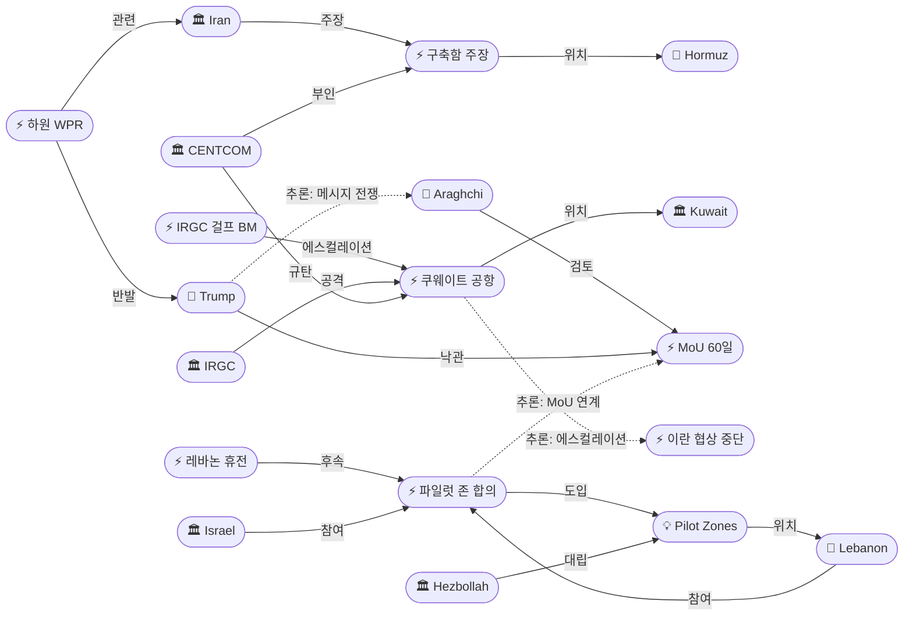
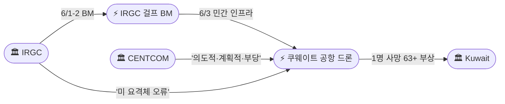
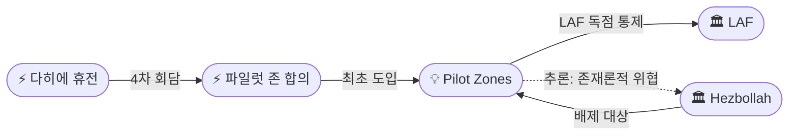
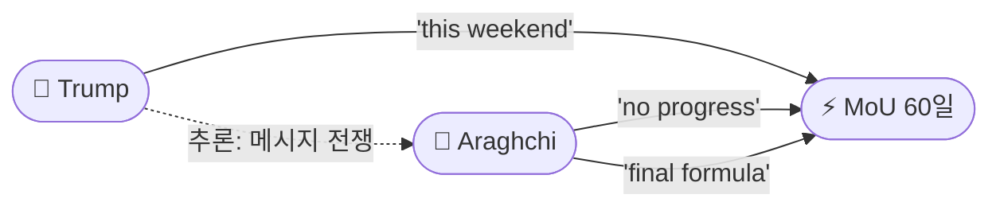

# 2026-06-04 2026 Iran War OSINT 일일 보고서

## 요약

Day 96-97. **쿠웨이트 민간시설 타격·하원 전쟁권한법·파일럿 존(Pilot Zones) — 전쟁의 3중 전환점.** 이란 드론이 중립국 쿠웨이트 국제공항 T1을 타격하여 **1명 사망·63명 이상 부상**을 초래했다. 전쟁 이후 최초의 **중립국 민간 인프라 공격**으로, IRGC는 '미국 요격체 오류'를 주장하나 CENTCOM은 "의도적이고 계획적이며 부당한 공격"이라 규탄했다. 한편 미 하원은 **215-208로 전쟁권한법(WPR) 결의안을 최초 통과**시켰다(공화당 4명 이탈: Barrett·Davidson·Fitzpatrick·Massie). 상원 통과 및 대통령 서명은 불가능하나, 전쟁에 대한 **첫 의회 제도적 반발**이다. 이스라엘-레바논 4차 워싱턴 회담은 **'파일럿 존(Pilot Zones)'** 합의로 종결되었다 — LAF가 리타니 이남 특정 구역에서 **독점 통제권을 행사**하고 **모든 비국가 행위자를 배제**하는 최초의 구체적 무장해제 메커니즘이다. 미-이란 협상에서는 아라그치가 "진전은 없으나 **소통은 차단되지 않았다**"며 6/1 '완전 중단'에서 미묘하게 톤을 바꾸면서 양측이 **'최종 공식(final formula)'**을 검토 중이라 밝혔고, 트럼프는 "**이번 주말**에 가능할 수 있다"고 낙관했다.

## 주요 뉴스

### 1. 이란 드론, 쿠웨이트 국제공항 타격 — 1명 사망, 63명 이상 부상
- **출처:** [NPR](https://www.npr.org/2026/06/03/g-s1-125566/iran-war-updates), [Washington Post](https://www.washingtonpost.com/world/2026/06/03/us-iran-trade-strikes-kuwait-airport-hit-amid-stalled-peace-talks/), [Al Jazeera](https://www.aljazeera.com/video/newsfeed/2026/6/3/kuwait-releases-cctv-footage-of-deadly-iranian-strike-on-airport), [Washington Times](https://www.washingtontimes.com/news/2026/jun/3/iranian-attack-kuwait-airport-puts-deadly-dent-ceasefire/), [The National](https://www.thenationalnews.com/news/gulf/2026/06/03/fresh-iran-strikes-on-bahrain-and-kuwait-test-failing-talks/), [NBC News](https://www.nbcnews.com/world/iran/iran-attacks-kuwait-strikes-us-ceasefire-peace-talks-trump-rcna348213)
- **일시:** 2026-06-03
- **내용:** 이란의 **적대 드론(hostile drones)**이 쿠웨이트 국제공항 **T1 터미널**을 타격했다. **인도 국적 1명 사망**, 63명 이상 부상(7명 주요 수술 필요). 공항은 수개월간 폐쇄 후 **월요일에 막 재개장**한 상태였다. IRGC는 책임을 부인하며 **미국 요격체 오작동**을 주장했으나, CENTCOM은 **"의도적이고 계획적이며 부당한(deliberate, calculated and unjustified) 공격"**이라 규탄했다. 공항은 별도 터미널로 부분 재개했다. 6/1-2의 쿠웨이트·바레인 미군 기지 BM 공격(CENTCOM 요격)에서 **민간 인프라로 에스컬레이션**한 것으로, 전쟁 이후 **최초의 중립국 민간시설 공격**이다.
- **상태:** 신규
- **관련 엔티티:** IRGC, CENTCOM, Kuwait, Iran

### 2. 미 하원, 전쟁권한법 결의안 최초 통과 — 215-208, GOP 4명 이탈
- **출처:** [NPR](https://www.npr.org/2026/06/03/nx-s1-5845102/house-iran-war-powers-vote), [Washington Post](https://www.washingtonpost.com/politics/2026/06/03/house-passes-war-powers-resolution-push-trump-end-iran-war/), [Al Jazeera](https://www.aljazeera.com/news/2026/6/3/us-house-of-representatives-passes-war-powers-resolution-in-rebuke-to-trump), [PBS](https://www.pbs.org/newshour/politics/house-passes-resolution-for-first-time-to-halt-military-action-against-iran-in-rebuke-of-trump)
- **일시:** 2026-06-03
- **내용:** 미 하원이 이란 전쟁에 대한 **전쟁권한법(WPR) 결의안을 215-208로 통과**시켰다. 공화당에서 **Tom Barrett(MI)·Warren Davidson(OH)·Brian Fitzpatrick(PA)·Thomas Massie(KY)** 4명이 이탈했다. 이란 전쟁에 대해 하원이 WPR을 통과시킨 것은 **최초**이다. 상원 통과는 불가능하며 트럼프 대통령이 거부권을 행사할 것이므로 **실질적 효력은 제한적**이나, 전쟁에 대한 의회의 **첫 제도적 반발**로 의미가 있다. 5/20 상원 WPR 50-47 통과(캐시디 이탈)에 이어 양원 모두가 대통령에 반하는 결의를 채택한 것이다.
- **상태:** 신규
- **관련 엔티티:** Donald Trump, Iran, US Congress

### 3. 이스라엘-레바논 '파일럿 존' 합의 — LAF 독점 통제, 헤즈볼라 배제
- **출처:** [US State Dept](https://www.state.gov/releases/office-of-the-spokesperson/2026/06/joint-statement-of-the-united-states-of-america-republic-of-lebanon-and-state-of-israel-on-the-latest-high-level-trilateral-meeting/), [Times of Israel](https://www.timesofisrael.com/liveblog-june-4-2026), [PBS](https://www.pbs.org/newshour/world/israel-and-lebanon-agree-to-renew-fragile-ceasefire-create-lebanese-security-zones), [CP24](https://www.cp24.com/news/world/2026/06/04/israel-lebanon-agree-to-renew-ceasefire-in-joint-statement-with-us/), [Arab News](https://www.arabnews.com/node/2645938/middle-east), [US News](https://www.usnews.com/news/world/articles/2026-06-03/israel-lebanon-say-they-agree-to-ceasefire)
- **일시:** 2026-06-03
- **내용:** 이스라엘-레바논 **4차 워싱턴 3자 회담**이 합의문 발표로 종결되었다. 핵심: (1) 휴전 갱신, (2) **'파일럿 존(Pilot Zones)'** 도입 — LAF(레바논군)이 지정 구역에서 **독점 통제권**을 행사하고 **모든 비국가 행위자를 배제**, (3) 헤즈볼라의 **완전한 사격 중단과 리타니 이남 전 요원 철수**가 전제조건, (4) **6월 22일 주간** 차기 회담으로 포괄 합의 추진. 전쟁 이후 최초의 **구체적 무장해제 메커니즘**으로, 다히에 프레임워크 휴전(6/2)에서 질적으로 진전한 것이다.
- **상태:** 신규
- **관련 엔티티:** Israel, Lebanon, Hezbollah, LAF, United States

### 4. 아라그치 "진전 없으나 소통 미차단" — '최종 공식' 검토 중
- **출처:** [Al Jazeera](https://www.aljazeera.com/news/liveblog/2026/6/3/iran-war-live-us-strikes-irans-qeshm-says-tehran-attacks-kuwait-bahrain), [Anadolu Agency](https://aa.com.tr/en/world/iran-us-reviewing-exchanged-texts-working-on-final-formula-foreign-minister-says/3955806)
- **일시:** 2026-06-03
- **내용:** 아라그치 외무장관이 **"미국과의 소통은 차단되지 않았으나 협상에서 진전은 없었다"**고 밝혔다. 양측이 교환된 문서를 검토하며 **'최종 공식(final formula)'**을 작업 중이라고 확인했다. 동시에 이스라엘의 베이루트 공격이 지속되면 **"공격의 결과는 전쟁 복귀"**라 경고했다. 이는 6/1 '공식 중단'에서 **미묘하지만 유의미한 톤 변화**로, 완전한 교착이 아닌 비공식 채널의 지속을 시사한다. '최종 공식'이라는 표현은 새로운 것이다.
- **상태:** 신규
- **관련 엔티티:** Abbas Araghchi, Iran, MoU 60-Day Framework, Lebanon

### 5. 이란 해군 "미 구축함 지휘통제센터 타격" — CENTCOM "이란은 거짓말"
- **출처:** [Tribune India](https://www.tribuneindia.com/news/bahrain-kuwait-targets/us-military-denies-its-vessel-was-hit-in-sea-of-oman-says-iran-is-lying-about-strait-of-hormuz-rules-violation), [inkl](https://www.inkl.com/news/iran-targets-us-military-vessels-command-center-in-gulf-of-oman-centcom-dismisses-claim)
- **일시:** 2026-06-03
- **내용:** 이란 해군이 오만만(Gulf of Oman)에서 미 구축함의 **'지휘통제센터'를 타격**했다고 발표했다. CENTCOM은 즉각 부인하며 **"이란은 거짓말이다. 미군 해상 자산은 안전하고 방해받지 않고 계속 작전 중"**이라 반박했다. 독립적 검증이 불가능한 **정보전(information warfare)** 사건으로, 양측의 상충하는 서사가 국내 청중을 겨냥한 것으로 분석된다.
- **상태:** 신규
- **관련 엔티티:** Iran Navy, CENTCOM, Gulf of Oman

### 6. 트럼프 "이번 주말에 가능" — 이란 '진전 없음'과 정면 모순
- **출처:** [Athens Times](https://athens-times.com/trump-on-iran-progress-possible-in-talks-this-weekend-2/), [CNBC](https://www.cnbc.com/2026/06/01/iran-war-trump-hits-out-at-critics-says-tehran-really-wants-a-deal.html), [ABC News](https://abcnews.com/International/live-updates/iran-live-updates-irgc-claims-airbase-attack-after/?id=133475855)
- **일시:** 2026-06-03~04
- **내용:** 트럼프 대통령이 **"협상 자체가 매우 잘 되고 있다고 듣는다"**며 **"성사된다면 이번 주말에 가능할 수 있다(it could happen, like, over the weekend)"**고 발언했다. 이란이 딜을 **"정말로 원한다(really wants)"**고 주장했다. 아라그치의 **'진전 없음'**과 정면 모순되며, Day 95-96의 'rapid pace vs 중단' 메시지 전쟁의 연장이다. 단, 트럼프가 구체적 시한('이번 주말')을 처음 언급한 점과, 아라그치가 '소통 미차단'으로 톤을 바꾼 점은 양측 모두 완전한 결렬을 피하고 있음을 시사한다.
- **상태:** 신규
- **관련 엔티티:** Donald Trump, Iran, Abbas Araghchi, MoU 60-Day Framework

### 7. 유가 $97 근접 — 3거래일 연속 상승
- **출처:** [Trading Economics](https://tradingeconomics.com/commodity/brent-crude-oil), [Fortune](https://fortune.com/article/price-of-oil-06-03-2026/)
- **일시:** 2026-06-03~04
- **내용:** Brent 원유가 **$96.89(+0.93%)**로 **3거래일 연속 상승**했다. 일일 거래 범위는 $95.76~$97.24. 쿠웨이트 공항 공격·협상 교착·이란 해군 주장 등 **복합 리스크 프리미엄**이 반영되었다. Day 95-96의 '$95→$91' 급반전에서 Day 96-97에는 $97 근접으로 **상승 추세가 안정화**되는 모습이다.
- **상태:** 신규
- **관련 엔티티:** Strait of Hormuz, MoU 60-Day Framework

## 지식그래프

### 오늘의 주요 관계

1. **걸프 에스컬레이션 사다리:** IRGC 쿠웨이트/바레인 BM(ent-496) → 쿠웨이트 공항 드론(ent-505) — 군사 기지에서 민간 인프라로 표적 에스컬레이션. 전쟁 성격의 질적 변화.
2. **파일럿 존 프레임워크:** 다히에 휴전(ent-495) → 파일럿 존 합의(ent-506) → 파일럿 존 개념(ent-507) ← 헤즈볼라(ent-047) 구조적 대립. 최초의 무장해제 메커니즘.
3. **메시지 전쟁 진화:** 트럼프 'this weekend'(ent-001) ↔ 아라그치 'no progress but final formula'(ent-044) — 양측 모두 완전 결렬 회피.
4. **의회 반발 제도화:** 하원 WPR(ent-504) → 트럼프(ent-001) — 상원(5/20)에 이어 하원 최초 통과.
5. **정보전 차원:** 이란 해군 구축함 주장(ent-508) ↔ CENTCOM 부인 — 검증 불가능한 상충 서사.

### 전체 지식그래프 시각화

### 주제별 세부 그래프

#### 1. 걸프 에스컬레이션 사다리

#### 2. 파일럿 존 프레임워크

#### 3. 미-이란 메시지 전쟁

## 온톨로지 변경

| 변경 유형 | 대상 | 근거 |
|----------|------|------|
| 스키마 변경 | 없음 | 모든 신규 엔티티가 기존 클래스/관계로 표현 가능 |
| 새 엔티티 | 5개 (ent-504~508) | 하원 WPR 통과, 쿠웨이트 공항 드론 공격, 파일럿 존 합의, 파일럿 존 개념, 이란 해군 구축함 주장 |
| 기존 업데이트 | 8개 | Trump, IRGC, Kuwait, Araghchi, CENTCOM, Israel, Lebanon, Hezbollah |

## 추론 결과

| 추론 | 신뢰도 | 근거 |
|------|--------|------|
| 쿠웨이트 공항(ent-505) → 이란 협상 중단(ent-492) 에스컬레이션 연계 | 0.80 | escalation_ladder: IRGC BM→민간 인프라; 외교 후퇴와 군사 에스컬레이션 동기화 |
| 파일럿 존(ent-506) → MoU(ent-456) 이벤트 체인 | 0.75 | event_chain: 레바논 안정화가 이란 핵 협상 전제; 6/22 타임라인 MoU와 중첩 |
| 파일럿 존(ent-507) ↔ 헤즈볼라(ent-047) 구조적 대립 | 0.85 | structural_opposition: LAF 독점 통제 = 헤즈볼라 남부 존재 부정; 존재론적 위협 |
| 트럼프(ent-001) ↔ 아라그치(ent-044) 메시지 전쟁 | 0.72 | message_war: 'this weekend' vs 'no progress'; 양측 완전 결렬 회피 |

## 분석 및 평가

### 쿠웨이트 공항 공격 — 전쟁의 질적 변화

쿠웨이트 공항 T1 타격은 전쟁의 성격을 질적으로 변화시킨다. 이전 걸프 국가 공격(6/1-2 BM, CENTCOM 요격)은 미군 기지를 겨냥한 **군사적 보복**이었으나, 공항 드론 공격은 **민간 인프라**를 타격했다. 쿠웨이트는 전쟁의 당사국이 아닌 **중립적 걸프 국가**이며, 공항은 수개월 폐쇄 후 **재개장 직후** 다시 타격당했다. 1명 사망·63명 부상이라는 인명 피해는 IRGC의 전략이 '군사적 보복'에서 **'심리적 압박/공포 효과'**로 전환했을 가능성을 시사한다. IRGC의 부인(미 요격체 오류)과 CENTCOM의 규탄(의도적·계획적) 사이의 **귀속 논쟁**은 국제법적 함의를 가지며, 걸프 국가들의 미군 주둔 비용-이익 계산을 변경할 수 있다.

### 파일럿 존 — 무장해제의 첫 구체적 메커니즘

4차 워싱턴 회담의 '파일럿 존' 합의는 이스라엘-레바논 전선에서 최초의 **구조적 진전**이다. 이전 3차례 회담은 원칙적 합의에 그쳤으나, 파일럿 존은 LAF가 **독점 통제권을 행사하고 비국가 행위자를 배제**하는 구체적 메커니즘이다. '비국가 행위자'는 사실상 **헤즈볼라**를 지칭하며, 파일럿 존이 성공적으로 운용되면 헤즈볼라의 리타니 이남 군사 거점이 **구조적으로 해체**된다. 이는 이란의 '저항 축' 전략에 대한 직접적 도전이며, 아라그치의 '베이루트 공격 시 전쟁 복귀' 경고는 이 맥락에서 읽어야 한다. 6/22 차기 회담은 MoU 60일 프레임워크의 핵 협상 단계와 시간적으로 중첩될 수 있어, 레바논 안정화가 이란 딜의 전제조건으로 기능하는 구조가 강화된다.

### 메시지 전쟁의 진화 — '최종 공식'의 의미

아라그치의 발언은 미묘하지만 유의미한 변화를 보여준다. 6/1 **'협상 중단'**에서 6/3 **'소통은 차단되지 않았다'** + **'최종 공식 작업 중'**으로 톤이 변했다. '최종 공식(final formula)'이라는 표현은 새로운 것으로, 양측이 **교환된 문서를 활발히 검토 중**임을 시사한다. 이는 공식 협상의 '중단'과 비공식 채널의 '지속'이 공존하는 구조로, 이란이 공개적 레버리지를 유지하면서 비공개적으로 타협점을 모색하는 전략으로 해석된다. 트럼프의 '이번 주말' 발언은 이런 비공식 신호에 기반했을 가능성이 있다.

### 하원 WPR — 실효성 없는 이정표

하원 WPR 최초 통과는 상징적이나 중요하다. 5/20 상원에 이어 양원 모두가 대통령에 반하는 결의를 채택한 것은 전쟁에 대한 **의회 반발이 제도적 수준**에 도달했음을 의미한다. 공화당 4명 이탈(Barrett/Davidson/Fitzpatrick/Massie)은 당내 전쟁 피로의 확산을 보여주며, 특히 Massie의 이탈은 리버테리안 계열의 반전 정서를 대표한다. 대통령 거부권으로 법적 효력은 없으나, 2024 대선을 앞두고 **전쟁이 정치적 부채**로 전환되고 있다는 신호이다.

## 추적 항목

| 항목 | 최초 보고 | 상태 | 최신 업데이트 |
|------|----------|------|-------------|
| MoU 60일 프레임워크 | 2026-05-25 | ⚠️ 교착/톤 변화 | 아라그치 '소통 미차단'+'최종 공식'(6/3), 트럼프 'this weekend'(6/3-4) |
| 이스라엘-레바논 전쟁 | 2026-04-10 | 🟢 파일럿 존 합의 | 4차 워싱턴 → 파일럿 존(LAF 독점 통제, 헤즈볼라 배제); 6/22 차기(6/3) |
| IRGC-CENTCOM 보복 사이클 | 2026-05-27 | 🔴 민간 인프라 타격 | 쿠웨이트 공항 드론(1명 사망, 63+ 부상)(6/3); 이란 해군 구축함 주장(6/3) |
| 호르무즈 해협 | 2026-04-07 | 🔴 폐쇄 유지 | 이란 해군 구축함 주장/CENTCOM 부인(6/3); Bab el-Mandeb 위협 지속 |
| 하원 WPR | 2026-04-24 | 🟡 최초 통과 | 215-208 통과, 4 GOP 이탈(6/3); 상원 불가, 대통령 거부권 |
| 유가 | 2026-04-07 | ↗️ 상승 | Brent $96.89(+0.93%), 3거래일 연속 상승, $98 근접(6/3-4) |
| 🆕 파일럿 존 | 2026-06-04 | 🟢 합의 | LAF 독점 통제, 비국가 행위자 배제, 6/22 차기 회담(6/3) |

## 동향 요약

| 분류 | 상태 | 비고 |
|------|------|------|
| 미-이란 협상 | ⚠️ 교착/톤 변화 | 아라그치 '최종 공식' vs 트럼프 'this weekend'; 소통 지속 시사 |
| 이-레 전선 | 🟢 파일럿 존 | 최초 구체적 무장해제 메커니즘; 6/22 차기 회담 |
| 걸프/해양 | 🔴 에스컬레이션 | 쿠웨이트 공항 민간 인프라 타격; 이란 해군 구축함 주장/부인 |
| 유가 | ↗️ 상승 | Brent $96.89, 3거래일 연속, $98 근접 |
| 미국 내정 | 🟡 의회 반발 | 하원 WPR 최초 통과 215-208; 실효성 없으나 상징적 |

## 출처 목록

1. [Iran strikes Kuwait's main airport, killing 1](https://www.npr.org/2026/06/03/g-s1-125566/iran-war-updates) - NPR, 2026-06-03
2. [Iranian attack leaves 1 dead, dozens injured in Kuwait](https://www.washingtonpost.com/world/2026/06/03/us-iran-trade-strikes-kuwait-airport-hit-amid-stalled-peace-talks/) - Washington Post, 2026-06-03
3. [Kuwait releases CCTV footage of deadly Iranian strike on airport](https://www.aljazeera.com/video/newsfeed/2026/6/3/kuwait-releases-cctv-footage-of-deadly-iranian-strike-on-airport) - Al Jazeera, 2026-06-03
4. [Iranian attack on Kuwait airport puts deadly dent into ceasefire](https://www.washingtontimes.com/news/2026/jun/3/iranian-attack-kuwait-airport-puts-deadly-dent-ceasefire/) - Washington Times, 2026-06-03
5. [Fresh Iran strikes on Bahrain and Kuwait test failing talks](https://www.thenationalnews.com/news/gulf/2026/06/03/fresh-iran-strikes-on-bahrain-and-kuwait-test-failing-talks/) - The National, 2026-06-03
6. [Iran attacks Kuwait, trades strikes with US](https://www.nbcnews.com/world/iran/iran-attacks-kuwait-strikes-us-ceasefire-peace-talks-trump-rcna348213) - NBC News, 2026-06-03
7. [House passes war powers resolution directing Trump to end hostilities](https://www.npr.org/2026/06/03/nx-s1-5845102/house-iran-war-powers-vote) - NPR, 2026-06-03
8. [House passes war powers resolution to push Trump to end Iran war](https://www.washingtonpost.com/politics/2026/06/03/house-passes-war-powers-resolution-push-trump-end-iran-war/) - Washington Post, 2026-06-03
9. [US House passes war powers resolution in rebuke to Trump](https://www.aljazeera.com/news/2026/6/3/us-house-of-representatives-passes-war-powers-resolution-in-rebuke-to-trump) - Al Jazeera, 2026-06-03
10. [House passes resolution for first time to halt military action against Iran](https://www.pbs.org/newshour/politics/house-passes-resolution-for-first-time-to-halt-military-action-against-iran-in-rebuke-of-trump) - PBS, 2026-06-03
11. [Joint Statement on 4th High-Level Trilateral Meeting](https://www.state.gov/releases/office-of-the-spokesperson/2026/06/joint-statement-of-the-united-states-of-america-republic-of-lebanon-and-state-of-israel-on-the-latest-high-level-trilateral-meeting/) - US State Department, 2026-06-03
12. [Israel, Lebanon agree to renew truce, create pilot zones](https://www.timesofisrael.com/liveblog-june-4-2026) - Times of Israel, 2026-06-04
13. [Israel and Lebanon agree to renew fragile ceasefire](https://www.pbs.org/newshour/world/israel-and-lebanon-agree-to-renew-fragile-ceasefire-create-lebanese-security-zones) - PBS, 2026-06-03
14. [Israel-Lebanon agree to renew ceasefire in joint statement with US](https://www.cp24.com/news/world/2026/06/04/israel-lebanon-agree-to-renew-ceasefire-in-joint-statement-with-us/) - CP24, 2026-06-04
15. [Israel-Lebanon pilot zones agreement](https://www.arabnews.com/node/2645938/middle-east) - Arab News, 2026-06-03
16. [Israel-Lebanon say they agree to ceasefire](https://www.usnews.com/news/world/articles/2026-06-03/israel-lebanon-say-they-agree-to-ceasefire) - US News, 2026-06-03
17. [Iran war live: Araghchi on 'no progress' and 'final formula'](https://www.aljazeera.com/news/liveblog/2026/6/3/iran-war-live-us-strikes-irans-qeshm-says-tehran-attacks-kuwait-bahrain) - Al Jazeera, 2026-06-03
18. [Iran, US reviewing exchanged texts, working on 'final formula'](https://aa.com.tr/en/world/iran-us-reviewing-exchanged-texts-working-on-final-formula-foreign-minister-says/3955806) - Anadolu Agency, 2026-06-03
19. [US military denies vessel hit, says 'Iran is lying'](https://www.tribuneindia.com/news/bahrain-kuwait-targets/us-military-denies-its-vessel-was-hit-in-sea-of-oman-says-iran-is-lying-about-strait-of-hormuz-rules-violation) - Tribune India, 2026-06-03
20. [Iran targets US military vessel's command center in Gulf of Oman](https://www.inkl.com/news/iran-targets-us-military-vessels-command-center-in-gulf-of-oman-centcom-dismisses-claim) - inkl, 2026-06-03
21. [Trump on Iran: Progress possible this weekend](https://athens-times.com/trump-on-iran-progress-possible-in-talks-this-weekend-2/) - Athens Times, 2026-06-03
22. [Iran war: Trump says Tehran 'really wants' a deal](https://www.cnbc.com/2026/06/01/iran-war-trump-hits-out-at-critics-says-tehran-really-wants-a-deal.html) - CNBC, 2026-06-01
23. [Iran live updates: Ceasefire and negotiations](https://abcnews.com/International/live-updates/iran-live-updates-irgc-claims-airbase-attack-after/?id=133475855) - ABC News, 2026-06-04
24. [Brent crude oil price](https://tradingeconomics.com/commodity/brent-crude-oil) - TradingEconomics, 2026-06-04
25. [Current price of oil](https://fortune.com/article/price-of-oil-06-03-2026/) - Fortune, 2026-06-03
26. [이란 쿠웨이트 공항 공습](https://www.fnnews.com/news/202606031832010986) - 파이낸셜뉴스, 2026-06-03
27. [이란, 쿠웨이트 공항 공습](https://www.sedaily.com/article/20051389) - 서울경제, 2026-06-03
28. [트럼프 '이란과 대화 계속'](https://www.newspim.com/news/view/20260603000005) - 뉴스핌, 2026-06-03
