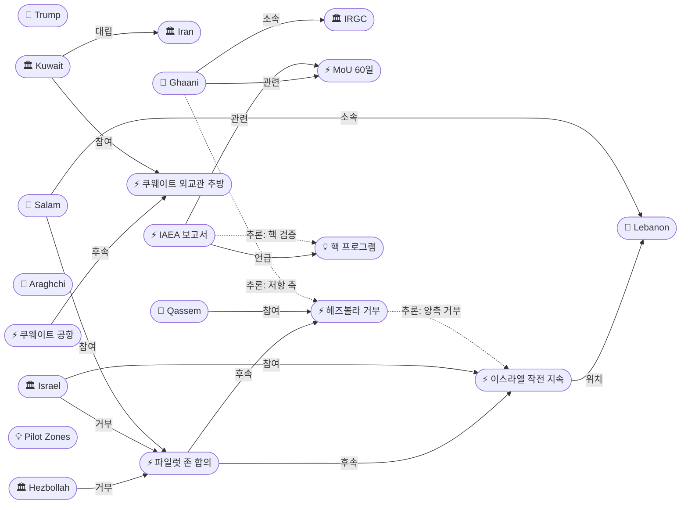
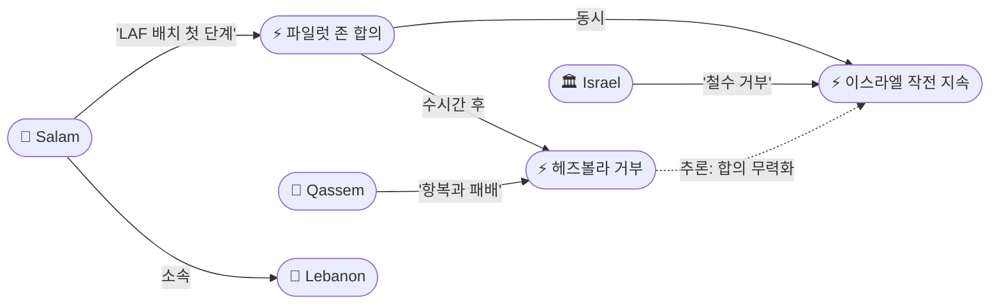
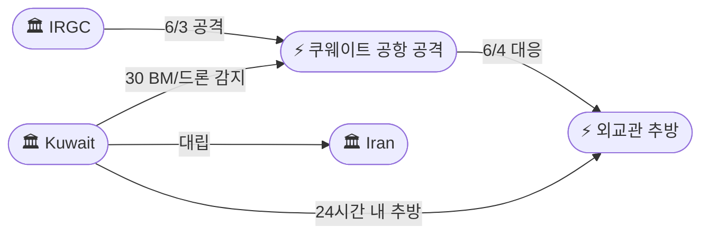
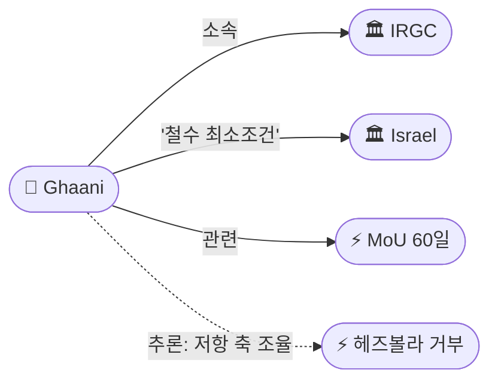

# 2026-06-05 2026 Iran War OSINT 일일 보고서

## 요약

Day 98. **파일럿 존 합의 '도착 즉시 사망' — 헤즈볼라 거부, 이스라엘 철수 거부, 합의 무력화.** 헤즈볼라 사무총장 나임 카셈이 6/3 파일럿 존 합의를 **"항복과 패배, 적의 목표 달성"**이라 규정하며 전면 거부한 지 수시간 후, 이스라엘 카츠 국방장관은 **"당분간 작전을 지속할 것"**이라며 철수를 거부했다. 12건 이상의 공습으로 **4명이 사망**했다. 합의의 양 당사자 모두가 이행을 거부함으로써 합의는 사실상 무력화되었다. 한편 쿠웨이트는 6/3 공항 공격에 대한 보복으로 **이란 대사관 직원 2명을 24시간 내 추방**하는 전쟁 이후 최초의 걸프국-이란 외교 조치를 취했다. IRGC 쿠드스군 가니 사령관은 **이스라엘 전쟁 전 위치 철수를 '최소 조건'**으로 제시하며 레바논 전선을 이란 딜에 명시적으로 연결했고, IAEA는 이란 핵 프로그램이 전쟁 이후 **'상대적으로 변동 없음'**이라 보고하면서 1년간 사찰 접근이 불가능한 상태의 **'최대 긴급성'**을 경고했다.

## 주요 뉴스

### 1. 헤즈볼라, 파일럿 존 합의 전면 거부 — 카셈: "항복과 패배"
- **출처:** [NPR](https://www.npr.org/2026/06/04/g-s1-125942/israel-lebanon-ceasefire), [Washington Post](https://www.washingtonpost.com/world/2026/06/04/israel-lebanon-renew-ceasefire-deal-without-hezbollah/), [Time](https://time.com/article/2026/06/04/hezbollah-rejects-israel-lebanon-ceasefire-agreement-strikes/), [Times of Israel](https://www.timesofisrael.com/rockets-drones-trigger-warnings-in-north-after-hezbollah-rejects-lebanon-ceasefire-proposal)
- **일시:** 2026-06-04
- **내용:** 헤즈볼라 사무총장 나임 카셈이 6/3 파일럿 존 합의를 전면 거부했다. 카셈은 전투원의 남부 레바논 철수 요구를 **"항복, 패배, 적의 목표 달성(surrender, defeat, and achieving enemy's goals)"**이라 규정하며, **"우리는 오직 포괄적인 공격 중단에만 관심이 있다(We are concerned only with a comprehensive cessation of aggression)"**고 선언했다. **이스라엘의 완전한 철수**를 비협상 조건으로 제시했다. 거부는 6/3 합의 발표 수시간 후 이루어졌다.
- **상태:** 신규
- **관련 엔티티:** Naim Qassem, Hezbollah, Pilot Zones Agreement, Israel, Lebanon

### 2. 이스라엘, 합의에도 불구 작전 지속 — 카츠: "철수하지 않을 것"
- **출처:** [Time](https://time.com/article/2026/06/04/hezbollah-rejects-israel-lebanon-ceasefire-agreement-strikes/), [Al Jazeera](https://www.aljazeera.com/news/2026/6/4/israel-and-lebanon-agree-to-conditional-ceasefire)
- **일시:** 2026-06-04
- **내용:** 이스라엘 카츠 국방장관이 **"당분간 사격과 지상 작전을 지속할 것(will continue fire and operations on the ground for the time being)"**이라 선언하며 남부 레바논 철수를 거부했다. 목요일에만 **12건 이상의 공습**이 수행되어 **4명이 사망**했다. 헤즈볼라의 거부와 결합하여, 파일럿 존 합의는 양측 모두의 이행 거부로 사실상 **'도착 즉시 사망(dead on arrival)'** 상태가 되었다.
- **상태:** 신규
- **관련 엔티티:** Israel, Yoav Katz, Pilot Zones Agreement, Lebanon

### 3. 쿠웨이트, 이란 대사관 직원 2명 추방 — 전쟁 이후 최초 걸프국 외교 조치
- **출처:** [NPR](https://www.npr.org/2026/06/03/g-s1-125566/iran-war-updates), [Al Jazeera](https://www.aljazeera.com/news/2026/6/3/iranian-drone-hits-kuwaits-main-airport-after-us-strikes-qeshm-island), [India TV News](https://www.indiatvnews.com/news/world/kuwait-airport-attack-video-shows-chaos-destruction-the-moment-when-iranian-drone-hit-2026-06-04-1043577), [Aerospace Global News](https://aerospaceglobalnews.com/news/kuwait-iranian-drone-strike-airport-footage/)
- **일시:** 2026-06-04
- **내용:** 쿠웨이트가 **이란 대사관 직원 2명에게 24시간 내 출국**을 요구했다. 이란 대리대사에게 항의문을 전달했다. 쿠웨이트는 6/3 공격에서 **탄도미사일 및 드론 30기를 감지**했다고 밝혔다. 쿠웨이트항공은 **별도 터미널에서 운항을 재개**했다. 이는 전쟁 이후 **최초의 걸프국-이란 직접 외교 조치**이다. 단교가 아닌 축소(2명 추방)로 완전한 단절은 회피하면서도 공개적 항의를 제도화했다.
- **상태:** 신규
- **관련 엔티티:** Kuwait, Iran, IRGC, Kuwait Airport Drone Attack

### 4. IRGC 가니 사령관: "이스라엘 전쟁 전 위치 철수가 최소 조건"
- **출처:** [파이낸셜뉴스](https://www.fnnews.com/news/202606041959384990)
- **일시:** 2026-06-04
- **내용:** IRGC 쿠드스군 에스마일 가니 사령관이 **이스라엘군의 전쟁 전 지점으로의 철수를 최소 조건**이라 밝혔다. 이는 **IRGC 핵심 군부 지도자가 레바논 이슈를 이란 딜에 명시적으로 연결**한 가장 직접적인 발언이다. 아라그치의 6/3 '베이루트 공격 시 전쟁 복귀' 경고와 맥을 같이하며, IRGC가 레바논 전선을 이란 핵 협상의 전제조건이자 레버리지로 공식 활용하고 있음을 확인한다.
- **상태:** 신규
- **관련 엔티티:** Esmail Ghaani, IRGC, Israel, MoU 60-Day Framework

### 5. IAEA: 이란 핵 프로그램 "상대적으로 변동 없음" — 사찰 접근 불가 1년
- **출처:** [The Hill](https://thehill.com/homenews/5910409-iaea-report-iran-nuclear/), [ANS Nuclear Newswire](https://www.ans.org/news/article-7911/iaea-provides-updates-on-iran-nuclear-facilities/)
- **일시:** 2026-06-04
- **내용:** IAEA가 이란 핵 프로그램이 전쟁 이후 **"상대적으로 변동 없음(relatively unchanged)"**이라고 보고했다. 이란에 **"건설적으로 관여(engage constructively)"**할 것을 촉구했다. IAEA는 **2025년 6월 공습 이후 핵 시설 접근이 불가능한 상태**이며, **지식 연속성의 상실(loss of continuity of knowledge)**에 **'최대 긴급성(utmost urgency)'**으로 대응해야 한다고 경고했다. MoU 60일 프레임워크의 핵 협상 단계에서 검증 메커니즘의 근본적 어려움을 예고한다.
- **상태:** 신규
- **관련 엔티티:** IAEA, Iran, Nuclear Program, MoU 60-Day Framework

### 6. 레바논 총리 살람: LAF 시범구역 배치 "첫 단계"로 시작
- **출처:** [Express Tribune](https://tribune.com.pk/story/2611382/lebanon-israel-agree-on-creating-pilot-zones-to-place-lebanese-army-in-control)
- **일시:** 2026-06-04
- **내용:** 레바논 나와프 살람 총리가 레바논군(LAF)이 **파일럿 존에 '첫 단계(first phase)'로 배치를 시작**할 것이라 발표했다. 헤즈볼라의 거부와 이스라엘의 철수 거부에도 불구하고 레바논 정부는 합의 이행 의지를 보이고 있으나, 헤즈볼라의 군사적 존재가 남아 있는 상황에서 LAF의 '독점 통제'가 실질적으로 가능한지는 의문이다.
- **상태:** 신규
- **관련 엔티티:** Nawaf Salam, Lebanon, Pilot Zones, LAF

### 7. 파일럿 존 양측 거부 — 합의 사실상 무력화 (업데이트)
- **출처:** [Washington Post](https://www.washingtonpost.com/world/2026/06/04/israel-lebanon-renew-ceasefire-deal-without-hezbollah/), [헤럴드경제](https://biz.heraldcorp.com/article/10764001)
- **일시:** 2026-06-04
- **내용:** 6/3 파일럿 존 합의(src-1563)의 후속. 헤즈볼라가 '항복과 패배'로 거부하고, 이스라엘이 '작전 지속·철수 거부'로 응답함으로써 합의의 양 핵심 당사자 모두가 사실상 이행을 거부했다. 이는 **4/16 이-레 10일 휴전 → 위반 → 재합의**의 패턴이 구조적으로 반복되고 있음을 보여준다. 레바논 정부만 이행 의지를 보이나 헤즈볼라 없이는 실질적 이행이 불가능하다.
- **상태:** 업데이트 (← 2026-06-04 "이스라엘-레바논 '파일럿 존' 합의")
- **관련 엔티티:** Hezbollah, Israel, Pilot Zones Agreement, Lebanon

### 8. 유가 $96.97(-0.86%) — 3연속 상승 마감 후 소폭 하락
- **출처:** [TradingEconomics](https://tradingeconomics.com/commodity/brent-crude-oil), [CNBC](https://www.cnbc.com/2026/05/26/oil-prices-today-brent-wti-iran-trump-hormuz.html)
- **일시:** 2026-06-04
- **내용:** Brent 원유가 **$96.97(-0.86%)**로 **3거래일 연속 상승 흐름이 마감**되었다. 선물이 목요일 **$97 이하로 하락**했다. 파일럿 존 합의 발표 후 일시적 리스크 프리미엄 해소가 반영된 것으로 보이나, 합의의 사실상 무력화가 확인되면 재상승 압력이 예상된다.
- **상태:** 신규
- **관련 엔티티:** Strait of Hormuz, MoU 60-Day Framework

## 지식그래프

### 오늘의 주요 관계

1. **파일럿 존 '도착 즉시 사망':** 파일럿 존 합의(ent-506) → 헤즈볼라 거부(ent-509) + 이스라엘 작전 지속(ent-510) — 양측 모두 이행 거부로 합의 무력화. 4/16 이후 반복되는 합의-위반 순환 패턴.
2. **걸프 외교 에스컬레이션:** 쿠웨이트 공항 공격(ent-505) → 외교관 추방(ent-511) — 전쟁 이후 최초 걸프국-이란 외교 조치. 축소적 대응(2명)으로 완전 단절 회피.
3. **IRGC 레바논-이란 딜 공식 연계:** 가니(ent-512) → 이스라엘 철수 최소조건 → MoU(ent-456). 쿠드스군 사령관이 레바논 전선을 이란 핵 협상의 레버리지로 공식 활용.
4. **IAEA 핵 검증 경고:** IAEA 보고서(ent-513) → 핵 프로그램(ent-025) → MoU 핵 단계. 1년간 사찰 접근 불가 → 검증 가능성에 근본적 의문.
5. **레바논 정부 vs 헤즈볼라 이행 격차:** 살람 총리(ent-515) LAF 배치 발표 ↔ 카셈(ent-073) 거부 — 레바논 내부 분열 지속.

### 전체 지식그래프 시각화

### 주제별 세부 그래프

#### 1. 파일럿 존 양측 거부

#### 2. 쿠웨이트 외교 에스컬레이션

#### 3. IRGC 레바논-이란 딜 연계

## 온톨로지 변경

| 변경 유형 | 대상 | 근거 |
|----------|------|------|
| 스키마 변경 | 없음 | 모든 신규 엔티티가 기존 클래스/관계로 표현 가능 |
| 새 엔티티 | 7개 (ent-509~515) | 헤즈볼라 거부, 이스라엘 작전 지속, 쿠웨이트 외교관 추방, 가니 사령관, IAEA 보고서, 유가, 살람 총리 |
| 기존 업데이트 | 6개 | Qassem, Hezbollah, Israel, Kuwait, Lebanon, Pilot Zones Agreement |

## 추론 결과

| 추론 | 신뢰도 | 근거 |
|------|--------|------|
| 헤즈볼라 거부(ent-509) ↔ 이스라엘 작전 지속(ent-510) 양측 거부 연동 | 0.85 | co_participation: 파일럿 존 합의에 대한 양측의 동시적 거부; 합의 무력화의 공동 원인 |
| 쿠웨이트 외교관 추방(ent-511) ← 공항 공격(ent-505) 인과 체인 | 0.80 | event_chain: 공항 공격 → 24시간 내 외교관 추방; 걸프국 최초 외교 조치 |
| 가니(ent-512) ↔ 헤즈볼라 거부(ent-509) 저항 축 조율 | 0.75 | co_participation: IRGC 쿠드스군의 이스라엘 철수 요구와 헤즈볼라 거부는 이란 '저항 축' 전략의 양면 |
| IAEA 보고서(ent-513) ↔ 농축 우라늄(ent-064) 핵 검증 연계 | 0.80 | co_participation: '핵 변동 없음'은 440.9kg 농축 우라늄 유지 시사; 사찰 불가→MoU 검증 어려움 |
| 파일럿 존 거부(ent-506) ↔ 4/13 회담 거부(ent-074) 패턴 반복 | 0.78 | event_chain: 53일 간격 동일 패턴; 헤즈볼라의 구조적 협상 거부 3개월째 일관 |

## 분석 및 평가

### 파일럿 존의 '도착 즉시 사망' — 구조적 실패의 반복

파일럿 존 합의는 수시간 만에 양측 모두의 거부로 사실상 무력화되었다. 이는 4/16 이-레 10일 휴전 → 이스라엘 위반 → 헤즈볼라 로켓의 패턴이 3개월째 반복되고 있음을 보여준다. 카셈의 '항복과 패배' 규정은 4/13 사파의 '적과 관계없다'와 동일한 맥락이며, 이스라엘의 '작전 지속' 선언은 네타냐후의 '헤즈볼라 싸움은 끝나지 않았다'(4/17)의 연장이다. 레바논 전선에서의 합의는 **헤즈볼라 참여 없이는 이행 불가능**하고, **이스라엘 철수 없이는 의미 없다**는 이중 구조적 모순이 해소되지 않은 채 반복된다. 살람 총리의 LAF 배치 발표는 형식적 이행 시도이나, 헤즈볼라의 군사적 존재가 남아 있는 상황에서 LAF의 '독점 통제'는 허구에 가깝다.

### IRGC의 레바논-이란 딜 공식 연계 — 가니 발언의 전략적 의미

가니 쿠드스군 사령관의 '이스라엘 전쟁 전 위치 철수 = 최소 조건' 발언은 IRGC가 레바논 전선을 이란 핵 협상의 **공식적 레버리지**로 사용하고 있음을 확인한다. 이는 아라그치의 '베이루트 공격 시 전쟁 복귀'(6/3), 갈리바프-베리 보복 위협(6/3)과 일관된 메시지다. IRGC 입장에서 레바논의 안정화(파일럿 존 성공)는 자신들의 핵 협상 레버리지를 약화시키므로, 헤즈볼라의 거부는 IRGC의 전략적 이익에 부합한다. 이는 파일럿 존의 실패가 단순한 현지 역학이 아닌, 이란-이스라엘 전체 전쟁의 **구조적 연계(strategic linkage)** 속에서 이해해야 함을 시사한다.

### 쿠웨이트 외교 에스컬레이션 — 걸프의 첫 대응

쿠웨이트의 외교관 추방은 전쟁 이후 걸프 국가의 **최초 직접 외교 조치**이다. 6/3 공항 공격에서 30기의 BM/드론이 감지되었다는 공개는 이란의 공격 규모를 처음으로 정량화한 것이다. 단교가 아닌 축소(2명 추방)로 완전한 외교 단절은 회피하면서도 **공개적 항의를 제도화**한 것은, 걸프 국가들이 이란과의 관계를 유지하면서도 민간 인프라 공격에 대한 한계선을 설정하려는 전략으로 해석된다. 향후 추가 공격 시 더 강경한 조치(대사 소환, 단교 등)로 에스컬레이션될 가능성이 있다.

### IAEA 보고서 — MoU 핵 검증의 근본적 도전

IAEA의 '상대적 변동 없음' 보고는 이란이 전쟁 중에도 **핵 역량을 유지**하고 있음을 시사한다. 1년간 사찰 접근이 불가능한 상태에서 '지식 연속성의 상실'이 진행되고 있으며, 이는 MoU 60일 프레임워크의 핵 협상 단계(30-60일 차)에서 **검증 메커니즘의 구축이 극도로 어려울 것**임을 예고한다. IAEA의 '최대 긴급성' 경고는 시간이 지날수록 이란의 핵 활동에 대한 국제 사회의 **파악 능력이 감소**한다는 의미이며, 이는 핵 합의의 검증 가능성 자체를 위협한다.

## 추적 항목

| 항목 | 최초 보고 | 상태 | 최신 업데이트 |
|------|----------|------|-------------|
| MoU 60일 프레임워크 | 2026-05-25 | ⚠️ 교착/메시지 지속 | IRGC 가니 이스라엘 철수 최소조건(6/4); IAEA 핵 '변동 없음' 보고(6/4) |
| 이스라엘-레바논 전쟁 | 2026-04-10 | 🔴 합의 무력화 | 헤즈볼라 파일럿 존 거부 + 이스라엘 철수 거부(6/4); 3,516명 사망 |
| 파일럿 존 | 2026-06-04 | 🔴 양측 거부 | 카셈 '항복과 패배'(6/4); 카츠 '작전 지속'(6/4); 살람 LAF 배치 시도(6/4) |
| IRGC-걸프 에스컬레이션 | 2026-06-03 | 🟡 외교 대응 | 쿠웨이트 외교관 2명 추방(6/4); 30 BM/드론 감지 공개 |
| 호르무즈 해협 | 2026-04-07 | 🔴 폐쇄 유지 | 유가 $96.97(-0.86%); 3연속 상승 마감(6/4) |
| 미국 내정 WPR | 2026-04-24 | 🟡 하원 통과 | 6/3 215-208 통과(전일 보고); 상원 불가, 거부권 |
| 유가 | 2026-04-07 | ↘️ 소폭 하락 | Brent $96.97(-0.86%); 3연속 상승 흐름 마감(6/4) |
| 🆕 IAEA 핵 사찰 | 2026-06-05 | 🔴 접근 불가 | '상대적 변동 없음'; 1년 접근 불가; '최대 긴급성' 경고(6/4) |
| 🆕 쿠웨이트 외교 조치 | 2026-06-05 | 🟡 축소적 대응 | 2명 추방; 단교 아닌 축소; 항공 재개(6/4) |

## 동향 요약

| 분류 | 상태 | 비고 |
|------|------|------|
| 미-이란 협상 | ⚠️ 교착/비공식 소통 | IRGC 가니 이스라엘 철수 최소조건; IAEA 핵 검증 도전; 메시지 지속 |
| 이-레 전선 | 🔴 합의 무력화 | 파일럿 존 양측 거부; 4명 사살; 3,516명 누적 사망 |
| 걸프/외교 | 🟡 에스컬레이션 | 쿠웨이트 외교관 추방; 최초 걸프국 외교 조치 |
| 유가 | ↘️ 소폭 하락 | Brent $96.97(-0.86%); 3연속 상승 마감 |
| 핵/IAEA | 🔴 사찰 불가 | '변동 없음' 보고; 1년 접근 불가; '최대 긴급성' |

## 출처 목록

1. [Hezbollah rejects cease-fire deal agreed on by Israel and Lebanon](https://www.npr.org/2026/06/04/g-s1-125942/israel-lebanon-ceasefire) - NPR, 2026-06-04
2. [Israel and Lebanon renew ceasefire deal without Hezbollah](https://www.washingtonpost.com/world/2026/06/04/israel-lebanon-renew-ceasefire-deal-without-hezbollah/) - Washington Post, 2026-06-04
3. [Israel and Hezbollah Trade Fresh Strikes as Militant Group Rejects Cease-Fire Plan](https://time.com/article/2026/06/04/hezbollah-rejects-israel-lebanon-ceasefire-agreement-strikes/) - Time, 2026-06-04
4. [Rockets, drones trigger warnings after Hezbollah rejects ceasefire](https://www.timesofisrael.com/rockets-drones-trigger-warnings-in-north-after-hezbollah-rejects-lebanon-ceasefire-proposal) - Times of Israel, 2026-06-04
5. [Israel and Lebanon agree to conditional ceasefire](https://www.aljazeera.com/news/2026/6/4/israel-and-lebanon-agree-to-conditional-ceasefire) - Al Jazeera, 2026-06-04
6. [Hezbollah rejects ceasefire plan declared in Washington](https://www.detroitnews.com/story/news/world/2026/06/04/hezbollah-rejects-ceasefire-plan-declared-in-washington/90401506007/) - Detroit News, 2026-06-04
7. [Hezbollah Rejects Latest Ceasefire Agreement as Israeli Strikes Kill 4 in Lebanon](https://www.military.com/hezbollah-rejects-latest-ceasefire-agreement-as-israeli-strikes-kill-4-in-lebanon) - Military.com, 2026-06-04
8. [Iran war updates: Kuwait expels 2 Iranian embassy staff](https://www.npr.org/2026/06/03/g-s1-125566/iran-war-updates) - NPR, 2026-06-04
9. [Iranian drone attack on Kuwait airport: chaos and destruction](https://www.indiatvnews.com/news/world/kuwait-airport-attack-video-shows-chaos-destruction-the-moment-when-iranian-drone-hit-2026-06-04-1043577) - India TV News, 2026-06-04
10. [Kuwait releases footage of Iranian drone strike on airport](https://aerospaceglobalnews.com/news/kuwait-iranian-drone-strike-airport-footage/) - Aerospace Global News, 2026-06-04
11. [Iranian drone attack kills Indian citizen in Kuwait](https://www.aljazeera.com/news/2026/6/3/iranian-drone-hits-kuwaits-main-airport-after-us-strikes-qeshm-island) - Al Jazeera, 2026-06-03
12. [이란 혁명수비대 '이스라엘군 전쟁 전 지점으로 철수해야'](https://www.fnnews.com/news/202606041959384990) - 파이낸셜뉴스, 2026-06-04
13. [Iran nuclear program relatively unchanged since start of war: IAEA](https://thehill.com/homenews/5910409-iaea-report-iran-nuclear/) - The Hill, 2026-06-04
14. [IAEA provides updates on Iran nuclear facilities](https://www.ans.org/news/article-7911/iaea-provides-updates-on-iran-nuclear-facilities/) - ANS Nuclear Newswire, 2026-06-04
15. [Brent crude oil price](https://tradingeconomics.com/commodity/brent-crude-oil) - TradingEconomics, 2026-06-05
16. [Brent oil futures](https://www.cnbc.com/2026/05/26/oil-prices-today-brent-wti-iran-trump-hormuz.html) - CNBC, 2026-06-04
17. [Lebanon, Israel agree on creating pilot zones](https://tribune.com.pk/story/2611382/lebanon-israel-agree-on-creating-pilot-zones-to-place-lebanese-army-in-control) - Express Tribune, 2026-06-04
18. [Iran war: Trump says Tehran 'really wants' a deal](https://www.cnbc.com/2026/06/01/iran-war-trump-hits-out-at-critics-says-tehran-really-wants-a-deal.html) - CNBC, 2026-06-04
19. [합의 직후 공습 재개...미 중재 이스라엘-레바논 '종잇장 휴전'](https://www.newspim.com/news/view/20260605000018) - 뉴스핌, 2026-06-05
20. [헤즈볼라 '휴전 거부'...트럼프 중동구상 암초](https://www.fnnews.com/news/202606050447052553) - 파이낸셜뉴스, 2026-06-05
21. [헤즈볼라, 미국 중재 '이스라엘-레바논 휴전 합의' 거부](https://www.voakorea.com/a/hezbollah-rejects-us-mediated-israel-lebanon-ceasefire-lebanon-commits-hezbollah-operatives-20260604/8157308.html) - VOA Korea, 2026-06-04
22. [이스라엘-레바논 휴전이행 합의, 이란 반발 부를듯](https://www.ohmynews.com/NWS_Web/View/at_pg.aspx?CNTN_CD=A0003240220) - 오마이뉴스, 2026-06-04
23. [헤즈볼라도 이스라엘도 '못 받겠다'](https://biz.heraldcorp.com/article/10764001) - 헤럴드경제, 2026-06-04
