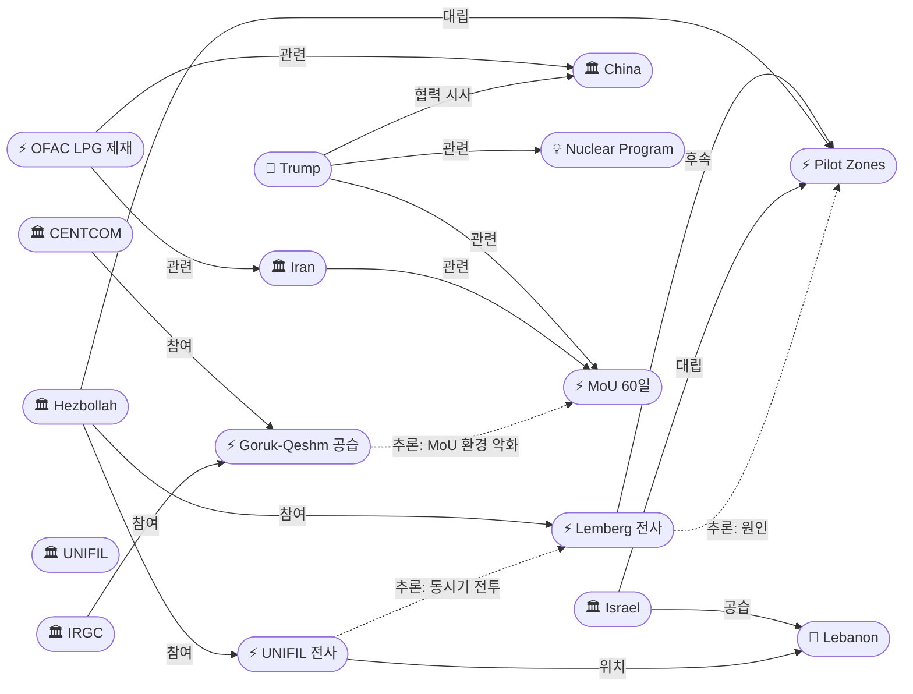
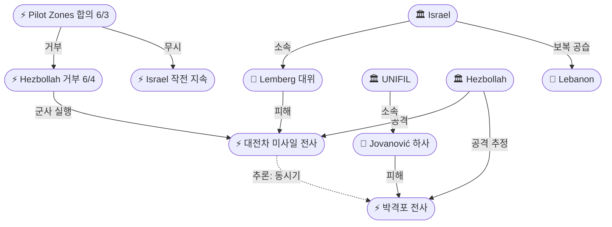

# 2026-06-06 2026 Iran War OSINT 일일 보고서

## 요약

Day 99. **파일럿 존 합의 48시간 만에 인적 비용 현실화 — IDF 장교·UNIFIL 평화유지군 동시 전사, CENTCOM-IRGC 호르무즈 교전 지속.** 헤즈볼라의 대전차 미사일이 리타니강 북쪽에서 IDF 렘버그 대위(21세)를 전사시켜 **파일럿 존 합의 이후 첫 이스라엘 전사자**가 발생했다. 같은 48시간 동안 세르비아 UNIFIL 평화유지군 요바노비치 하사가 마르자윤 인근 박격포 공격으로 전사해 **3월 이후 7번째 UNIFIL 사망자**가 되었다. 호르무즈 해협에서는 CENTCOM이 **IRGC 드론 4발을 격추**한 뒤 **고루크·케심섬 레이더 시설을 공습**하는 자위권 교전이 반복되었다. 이란 최고지도자 고문은 **"공은 트럼프 측에 있다(ball is in Trump's court)"**며 대기 시그널을 보냈고, 트럼프는 **"미국과 중국만 농축 우라늄 회수 가능"**이라며 핵 쟁점에서 미중 협력을 시사했다. OFAC는 **이란 LPG 밀수 네트워크**(UAE 프론트 기업 3곳, 중국 상하이 첸예 에너지)를 Economic Fury 캠페인으로 제재했다.

## 주요 뉴스

### 1. CENTCOM, IRGC 드론 4발 격추 후 고루크·케심섬 레이더 공습 — "지역 해상 교통에 즉각적 위협"
- **출처:** [ABC News](https://abcnews.com/International/live-updates/iran-live-updates-irgc-claims-airbase-attack-after/?id=133475855), [The Hill](https://thehill.com/policy/defense/5903614-us-military-strikes-iran/), [Iran International](https://www.iranintl.com/en/202606011021)
- **일시:** 2026-06-05
- **내용:** CENTCOM은 금요일 IRGC가 호르무즈 해협을 향해 발사한 **공격 드론 4발을 격추**했다고 발표했다. 드론은 **"지역 해상 교통에 즉각적 위협(immediate threat to regional maritime traffic)"**을 가했다. 이에 대응해 CENTCOM은 이란 **고루크(Goruk)시와 케심섬(Qeshm Island)의 해안 감시 레이더 시설**을 **"추가 공격 방어(to defend against further attacks)"** 목적으로 공습했다. 이란 외무부는 이를 **휴전 위반이자 국제법 위반**으로 비난했다.
- **상태:** 신규
- **관련 엔티티:** CENTCOM, IRGC, Strait of Hormuz, Goruk, Qeshm Island

### 2. IDF 렘버그 대위(21세) 전사 — 헤즈볼라 대전차 미사일, 파일럿 존 이후 첫 전사자
- **출처:** [Jerusalem Post](https://www.jpost.com/israel-news/defense-news/article-898445), [Times of Israel](https://www.timesofisrael.com/rockets-drones-trigger-warnings-in-north-after-hezbollah-rejects-lebanon-ceasefire-proposal/), [Ynet](https://www.ynetnews.com/article/hk7fki111ge), [Haaretz](https://www.haaretz.com/israel-news/israel-security/2026-06-05/ty-article/.premium/captain-eitan-lemberg-killed-in-lebanon-laid-to-rest/0000019e-97a8-d7a4-a9bf-f7e848c40000)
- **일시:** 2026-06-05
- **내용:** 에이탄 슈무엘 렘버그(Eitan Shmuel Lemberg) 대위(21세, 미슈마르 하쉬바, 7기갑여단 75대대 장교)가 리타니강 **북쪽**에서 헤즈볼라의 **대전차 미사일에 전차가 피격**되어 오후 4시경 전사했다. 그는 3월 에스컬레이션 이후 **29번째 남부 레바논 IDF 전사자**이며, **파일럿 존 합의(6/3) 이후 첫 전사자**이다. IAF와 포병이 해당 지역의 헤즈볼라 인프라를 즉시 보복 공격했다.
- **상태:** 신규
- **관련 엔티티:** Eitan Shmuel Lemberg, Hezbollah, Israel, Lebanon, Pilot Zones Agreement

### 3. UNIFIL 세르비아 평화유지군 요바노비치 하사 전사 — 7번째 UNIFIL 사망자
- **출처:** [UN News](https://news.un.org/en/story/2026/06/1167645), [Euronews](https://www.euronews.com/2026/06/04/unifil-peacekeeper-killed-and-two-others-injured-in-shelling-in-southern-lebanon), [UN Press](https://press.un.org/en/2026/sgsm23159.doc.htm)
- **일시:** 2026-06-03/04 (6/5 공식 확인)
- **내용:** 세르비아 UNIFIL 평화유지군 밀로반 요바노비치(Milovan Jovanović) 하사가 마르자윤(Marjayoun) 인근 **UN 진지 7-2에 박격포가 명중**하여 전사했다. **2명이 추가 부상**을 입었다. IDF는 헤즈볼라가 **알카트라니(Al-Qatrani) 지역에서 발포**했다고 주장했으나 UNIFIL은 책임을 귀속하지 않았다. 그는 3월 2일 이후 **7번째 UNIFIL 사망자**이다. UN 사무총장 구테흐스가 **살해를 규탄**했다.
- **상태:** 신규
- **관련 엔티티:** Milovan Jovanović, UNIFIL, Marjayoun, Hezbollah, António Guterres

### 4. OFAC, 이란 LPG 밀수 네트워크 제재 — UAE·중국 프론트 기업 지정, Economic Fury
- **출처:** [US Treasury](https://home.treasury.gov/news/press-releases/sb0524), [State Department](https://www.state.gov/releases/office-of-the-spokesperson/2026/06/sanctions-to-strangle-irans-energy-smuggling-and-illicit-financial-networks/), [Eurasia Review](https://www.eurasiareview.com/06062026-u-s-treasury-targets-iranian-lpg-smuggling-and-shadow-banking-networks/), [Gulf News](https://gulfnews.com/world/mena/new-us-sanctions-target-iran-lpg-and-shadow-banking-system-1.500564905), [ANI News](https://aninews.in/news/world/us/us-sanctions-uae-chinese-cos-to-strangle-iranian-energy-network20260605230921/)
- **일시:** 2026-06-05/06
- **내용:** OFAC가 이란산 LPG를 **오만산으로 위장**하여 남·동아시아로 밀수한 네트워크를 지정했다. 아프간 국적 **사르바즈 압둘 자다(Sarbaz Abdul Zada)**와 터키 국적 **모하마드 샤콜 미한두스트(Mohammad Shakol Mihandoust)**가 운영하는 UAE 프론트 기업 **부타니 트레이딩(Butani Trading LLC), 둔들로드 트레이딩(Dundlod Trading FZE), ADH 에너지(ADH Energy FZE)**가 지정되었다. 중국 기반 **상하이 첸예 에너지(Shanghai Qianye Energy Co., Ltd.)**도 포함되었다. **Economic Fury** 최대 압박 캠페인의 일환.
- **상태:** 신규
- **관련 엔티티:** Iran, UAE, China, OFAC, Economic Fury

### 5. 트럼프: "미국과 중국만 농축 우라늄 회수 가능" — 핵 쟁점 미중 협력 시사
- **출처:** [Fox News](https://www.foxnews.com/live-news/iran-war-news-trump-latest-oil-prices-china-hormuz-june-5)
- **일시:** 2026-06-05
- **내용:** 트럼프 대통령이 **"미국과 중국만이 이란에서 농축 우라늄을 회수할 역량이 있다(only the US and China have capability to retrieve enriched uranium from Iran)"**고 발언했다. 이는 기존 IAEA/제3국 모니터링 프레임워크를 넘어 **핵 쟁점에서의 미중 직접 협력**을 시사하는 새로운 신호이다. 60일 MoU 프레임워크에서 이란 농축 우라늄 처리가 핵심 쟁점으로 남아 있는 가운데, 중국의 역할이 처음으로 공식 언급되었다.
- **상태:** 신규
- **관련 엔티티:** Donald Trump, China, Nuclear Program, Enriched Uranium, MoU 60-Day Framework

### 6. 이란 최고지도자 고문: "공은 트럼프 측에" — 이란 대기 시그널
- **출처:** [CBS News](https://www.cbsnews.com/live-updates/iran-us-war-israel-hezbollah-fighting-ceasefire-efforts/)
- **일시:** 2026-06-05/06
- **내용:** 이란 최고지도자 모즈타바 하메네이의 고문이 **"공은 트럼프 측에 있다(ball is in Trump's court)"**고 발언하며, 이란이 자국 입장을 명확히 했고 **미국의 결정을 기다리고 있다**는 시그널을 보냈다. 이는 6/4 아라그치의 '진전 없으나 소통 미차단' 발언과 맥을 같이하면서도, 부담을 워싱턴으로 전가하려는 전략적 포지셔닝이다. 트럼프의 '이번 주말 딜 가능' 발언과 대조된다.
- **상태:** 신규
- **관련 엔티티:** Mojtaba Khamenei, Donald Trump, MoU 60-Day Framework, Iran

### 7. 이스라엘 레바논 공습 8명 사살 — 파일럿 존에도 불구 에스컬레이션 지속
- **출처:** [France 24](https://www.france24.com/en/middle-east/20260603-middle-east-war-live-israel-and-lebanon-agree-to-implement-a-ceasefire)
- **일시:** 2026-06-05
- **내용:** 이스라엘군이 레바논 동부와 남부 도시 **티레(Tyre) 인근**에서 공습을 수행하여 **8명이 사망**했다. 6/3 파일럿 존 합의에도 불구하고 공습이 지속되고 있으며, 렘버그 전사·UNIFIL 사망과 결합하여 6월 5일은 **파일럿 존 합의 이후 최악의 하루**가 되었다. 레바논 전체 전쟁 사상자는 **3,516명 사망, 10,674명 부상**에 달한다.
- **상태:** 신규
- **관련 엔티티:** Israel, Lebanon, Tyre, Pilot Zones Agreement

## 지식그래프

### 오늘의 주요 관계

1. **CENTCOM-IRGC 호르무즈 교전 반복:** IRGC 드론 4발 → CENTCOM 격추 → 고루크/케심섬 레이더 공습. MoU 협상 중 '자위권' 프레임 군사 교전이 6/1, 6/3, 6/5 연속으로 발생. 이란 고문의 '공은 트럼프에' 외교적 톤과 IRGC의 군사적 도발의 괴리.
2. **파일럿 존 합의의 인적 비용:** 합의(6/3) → 헤즈볼라 거부(6/4) → 렘버그 전사(6/5) + UNIFIL 요바노비치 전사(6/3-4). 48시간 내 IDF 장교와 UN 평화유지군 동시 전사. 합의 후 최악의 48시간.
3. **제재와 외교의 이중 전략:** OFAC LPG 제재(UAE/중국 기업) ↔ 트럼프 '미중 핵 협력' 시사. 중국이 제재 대상이면서 동시에 핵 파트너라는 이중적 위치.
4. **이란 대기 포지셔닝:** 최고지도자 고문 'ball is in Trump's court' + 아라그치 '최종 공식' 작업 중 → 부담을 워싱턴으로 전가하면서 IRGC는 현장에서 도발 지속.

### 전체 지식그래프 시각화

### 주제별 세부 그래프: 레바논 전선

## 온톨로지 변경

| 변경 유형 | 대상 | 근거 |
|----------|------|------|
| 새 엔티티 | ent-516 Goruk (Location) | CENTCOM 레이더 공습 목표 |
| 새 엔티티 | ent-517 CENTCOM Goruk-Qeshm Strikes (Event) | Jun 5 CENTCOM-IRGC 교전 |
| 새 엔티티 | ent-518 Eitan Shmuel Lemberg (Person) | IDF 대위, 파일럿 존 이후 첫 전사자 |
| 새 엔티티 | ent-519 Lemberg Death (Event) | 헤즈볼라 대전차 미사일 전사 |
| 새 엔티티 | ent-520 Milovan Jovanović (Person) | UNIFIL 세르비아 평화유지군 전사 |
| 새 엔티티 | ent-521 UNIFIL (Organization) | UN 평화유지군, 7번째 사망자 |
| 새 엔티티 | ent-522 Marjayoun (Location) | 박격포 공격 위치 |
| 새 엔티티 | ent-523 UNIFIL Jovanović Killed (Event) | UN 진지 7-2 박격포 전사 |
| 새 엔티티 | ent-524 OFAC LPG Sanctions (Event) | Economic Fury 캠페인 제재 |
| 스키마 변경 | 없음 | 모든 신규 항목이 기존 클래스/관계로 표현 가능 |

## 추론 결과

| 추론 | 신뢰도 | 근거 |
|------|--------|------|
| CENTCOM-IRGC 교전 → MoU 환경 악화 | 0.78 | 6/1·6/3·6/5 연속 교전, 협상 중 군사 에스컬레이션 |
| 헤즈볼라 거부 → 렘버그 전사 인과 | 0.80 | 거부 24시간 내 대전차 미사일 공격, 군사적 실행 |
| UNIFIL 사망 ↔ IDF 사망 동시기 전투 격화 | 0.75 | 48시간 내 양측 전사, 남부 레바논 전투 최악 수준 |
| OFAC 제재 ↔ MoU 최대 압박 병행 | 0.72 | 외교 교착 중 제재 강화, Economic Fury 지속 |
| 트럼프-중국 핵 협력 가능성 | 0.70 (잠정) | '미중만 회수 가능' 발언 ↔ 중국 기업 제재의 이중 신호 |

## 분석 및 평가

**파일럿 존 합의의 '도착 즉시 사망' 패턴이 48시간 만에 인적 비용으로 전화되었다.** 6/3 합의 → 6/4 양측 거부 → 6/5 IDF 장교·UNIFIL 평화유지군 동시 전사는 레바논 전선에서 합의-위반-전사의 순환이 극도로 압축된 형태로 반복됨을 보여준다. 특히 UNIFIL 7번째 사망자 발생은 국제 평화유지 활동 자체가 전투 지역에서 불가능해지고 있음을 의미하며, 유엔 사무총장의 규탄에도 실질적 대응 수단이 부재한 상황이다.

**호르무즈 해협에서는 MoU 외교와 IRGC 군사 도발이 동시 진행되는 구조적 모순이 지속된다.** 이란 최고지도자 고문의 'ball is in Trump's court' 발언은 이란이 공식적으로 미국의 결정을 기다리는 자세를 취하고 있음을 보여주나, 같은 날 IRGC는 호르무즈를 향해 드론 4발을 발사했다. 6/1·6/3·6/5 연속 3회의 CENTCOM-IRGC 교전은 '자위권 공습' 프레임이 양측 모두에게 편의적 구실로 기능하고 있음을 시사한다.

**트럼프의 '미중 핵 협력' 시사는 핵 쟁점의 새로운 차원을 열었다.** 기존 IAEA/제3국 모니터링 프레임워크를 넘어 미국과 중국이 직접 농축 우라늄을 회수한다는 구상은, 6/4 IAEA의 '1년간 사찰 불가·지식 연속성 상실' 경고에 대한 현실적 대안일 수 있다. 그러나 동일 시기 OFAC의 중국 기업(상하이 첸예 에너지) 제재는 대중국 레버리지 활용의 이중적 성격을 노출한다.

## 추적 항목

| 항목 | 최초 보고 | 상태 | 최신 업데이트 |
|------|----------|------|-------------|
| MoU 60일 프레임워크 | 2026-05-25 | 교착 | 이란 '공은 트럼프에' + 트럼프 '주말 딜 가능' — 메시지 전쟁 지속 |
| 파일럿 존 합의 | 2026-06-04 | 사실상 무력화 | 합의 48시간 내 IDF·UNIFIL 전사, 양측 이행 거부 지속 |
| CENTCOM-IRGC 호르무즈 교전 | 2026-06-01 | 반복 | 6/1·6/3·6/5 연속 3회, '자위권 공습' 프레임 지속 |
| 이란 핵 쟁점 | 2026-04-12 | 트럼프 미중 협력 시사 | '미국과 중국만 농축 우라늄 회수 가능' 신규 발언 |
| Economic Fury 제재 | 2026-04-28 | 확대 | OFAC 이란 LPG 밀수 네트워크 + UAE/중국 프론트 기업 지정 |
| 레바논 전쟁 사상자 | 2026-04-10 | 악화 | 3,516명 사망·10,674명 부상; IDF 29번째 전사자; UNIFIL 7번째 |

## 동향 요약

| 분류 | 상태 | 비고 |
|------|------|------|
| 미-이란 MoU 협상 | 교착/대기 | 이란 '공은 트럼프에', 트럼프 '주말 딜 가능' |
| 호르무즈 해협 | 군사 교전 지속 | CENTCOM-IRGC 6/5 교전 (드론 4발·레이더 공습) |
| 이-레 전선 | 파일럿 존 무력화 | IDF 29번째·UNIFIL 7번째 전사자, 8명 추가 사망 |
| 유가 | Brent ~$97 | 3연속 상승 후 소폭 하락, IEA 석유 적자 확대 전망 |
| 제재/경제전 | 확대 | OFAC LPG 밀수 네트워크 제재 (Economic Fury) |
| 핵 쟁점 | 새 차원 | 트럼프 '미중 핵 협력' 시사, IAEA '사찰 불가 1년' |

## 출처 목록
1. [CENTCOM drone shootdown & Goruk-Qeshm radar strikes](https://abcnews.com/International/live-updates/iran-live-updates-irgc-claims-airbase-attack-after/?id=133475855) - ABC News, 2026-06-05
2. [IDF Capt. Eitan Shmuel Lemberg killed in southern Lebanon](https://www.jpost.com/israel-news/defense-news/article-898445) - Jerusalem Post, 2026-06-05
3. [UNIFIL Serbian peacekeeper killed near Marjayoun](https://news.un.org/en/story/2026/06/1167645) - UN News, 2026-06-04
4. [OFAC designates Iranian LPG smuggling network](https://home.treasury.gov/news/press-releases/sb0524) - US Treasury, 2026-06-06
5. [Trump: only US and China can retrieve enriched uranium](https://www.foxnews.com/live-news/iran-war-news-trump-latest-oil-prices-china-hormuz-june-5) - Fox News, 2026-06-05
6. [Iran adviser: ball is in Trump's court](https://www.cbsnews.com/live-updates/iran-us-war-israel-hezbollah-fighting-ceasefire-efforts/) - CBS News, 2026-06-06
7. [Israeli strikes kill 8 in Lebanon](https://www.france24.com/en/middle-east/20260603-middle-east-war-live-israel-and-lebanon-agree-to-implement-a-ceasefire) - France 24, 2026-06-05
8. [레바논 휴전 성사…美·이란 협상 최대 고비 넘었다](https://www.fnnews.com/news/202606040829137221) - 파이낸셜뉴스, 2026-06-04
9. [Hezbollah Rejects Ceasefire, IRGC Locks MOU Block](https://houseofsaud.com/hezbollah-ceasefire-rejection-irgc-mou-lebanon/) - House of Saud, 2026-06-05
10. [IEA Revises 2026 Forecast: Oil Deficit Widens](https://oilprice.com/Latest-Energy-News/World-News/IEA-Revises-2026-Forecast-Oil-Deficit-Widens-as-Iran-War-Cuts-Production.html) - OilPrice.com, 2026-06-06
11. [Sanctions to Strangle Iran's Energy Smuggling](https://www.state.gov/releases/office-of-the-spokesperson/2026/06/sanctions-to-strangle-irans-energy-smuggling-and-illicit-financial-networks/) - US State Department, 2026-06-06
12. [New US sanctions target Iran LPG and shadow banking](https://gulfnews.com/world/mena/new-us-sanctions-target-iran-lpg-and-shadow-banking-system-1.500564905) - Gulf News, 2026-06-06
13. [US sanctions UAE, Chinese cos to strangle Iranian energy network](https://aninews.in/news/world/us/us-sanctions-uae-chinese-cos-to-strangle-iranian-energy-network20260605230921/) - ANI News, 2026-06-05
14. [Soldier killed as Hezbollah rejects ceasefire](https://www.timesofisrael.com/rockets-drones-trigger-warnings-in-north-after-hezbollah-rejects-lebanon-ceasefire-proposal/) - Times of Israel, 2026-06-05
15. [UNIFIL peacekeeper killed in shelling](https://www.euronews.com/2026/06/04/unifil-peacekeeper-killed-and-two-others-injured-in-shelling-in-southern-lebanon) - Euronews, 2026-06-04
16. [Secretary-General Condemns Killing of Serbian Peacekeeper](https://press.un.org/en/2026/sgsm23159.doc.htm) - UN Press, 2026-06-04
17. [US bombs radar, drone sites in Iran](https://thehill.com/policy/defense/5903614-us-military-strikes-iran/) - The Hill, 2026-06-05
18. [CENTCOM struck Iranian radar and drone sites](https://www.iranintl.com/en/202606011021) - Iran International, 2026-06-05
