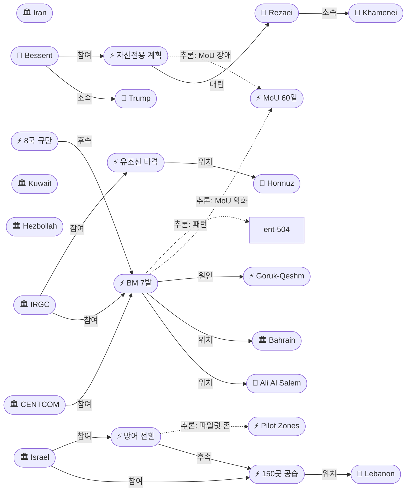
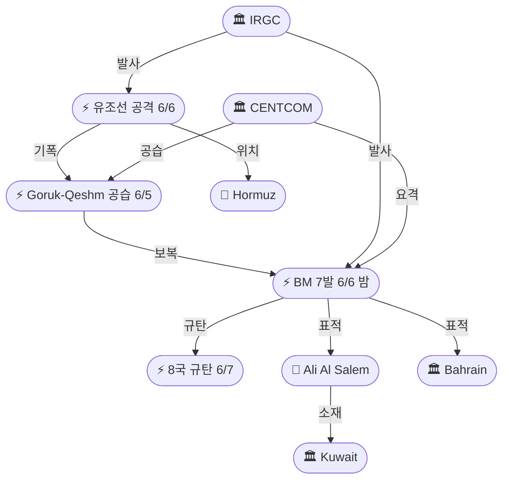
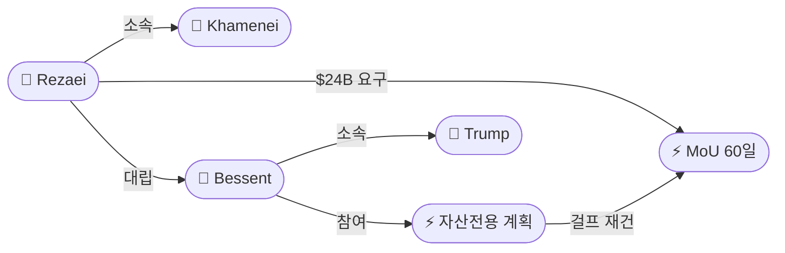

# 2026-06-07 2026 Iran War OSINT 일일 보고서

## 요약

Day 100. **IRGC, 쿠웨이트·바레인 미군기지에 탄도미사일 7발 발사 — 걸프 8개국 '노골적 침략' 일제 규탄, 동결자산 $24B을 둘러싼 미-이란 정면 충돌.** 금요일 밤 IRGC 항공우주군이 **쿠웨이트 알살렘 공군기지**와 **바레인 주둔 미 제5함대 시설**에 탄도미사일 7발을 발사했다(6발 요격, 1발 미도달). 이는 CENTCOM의 고루크/케심섬 레이더 공습에 대한 보복으로, 그 자체가 IRGC의 호르무즈 유조선 공격(4척 중 1척 피격·3척 회항)에서 비롯된 **7일간 4회째 교전 사이클**의 정점이다. 쿠웨이트·바레인·사우디·GCC·UAE·카타르·이집트·요르단이 '노골적 침략'으로 일제 규탄했다. 최고지도자 군사고문 **레자에이**는 CNN 독점 인터뷰에서 **"교착, $24B 동결자산이 신뢰 테스트"**라고 밝혔고, 미 재무장관 **베센트**는 반대로 이란 동결자산을 **걸프 동맹국 재건에 전용**하겠다고 선언했다. 레바논에서는 IDF가 **48시간 150곳 공습** 후 **'방어 태세' 전환**을 발표했으나, 에고즈 **감라 대위(24)와** 기바티 **야아리 하사(21)**가 전사하여 3월 이후 **31번째 IDF 레바논 전사자**에 이르렀다.

## 주요 뉴스

### 1. IRGC, 쿠웨이트 알살렘 공군기지·바레인 제5함대에 탄도미사일 7발 발사 — 6발 요격, 1발 미도달
- **출처:** [Al Jazeera](https://www.aljazeera.com/news/2026/6/6/us-intercepts-iranian-attacks-as-israel-continues-to-bomb-lebanon), [WANA](https://wanaen.com/irgc-u-s-bases-in-kuwait-and-bahrain-targeted-by-iranian-missile-strike/), [Express Tribune](https://tribune.com.pk/story/2611728/iran-strikes-us-bases-in-kuwait-bahrain-after-drone-attacks-on-iranian-territory-report), [France 24](https://www.france24.com/en/middle-east/20260606-middle-east-live-us-military-says-iran-launched-seven-ballistic-missiles-at-kuwait-bahrain), [Times Kuwait](https://timeskuwait.com/irgc-targets-ali-al-salem-air-base-u-s-navy-headquarters-in-bahrain/), [Press TV](https://www.presstv.ir/Detail/2026/06/06/769908/IRGC-reports-missile-strikes-US-Kuwait,-Bahrain-American-aggression), [Xinhua](https://english.news.cn/20260606/2b8a286eb326461886d01ef804023d1e/c.html), [Kurdistan 24](https://www.kurdistan24.net/en/story/918263/iranian-missiles-target-kuwait-and-bahrain-in-severe-escalation-of-gulf-conflict)
- **일시:** 2026-06-06 (금요일 밤)
- **내용:** IRGC 항공우주군이 쿠웨이트 **알살렘(Ali Al Salem) 공군기지**와 바레인 주둔 **미 제5함대(US Fifth Fleet) 시설**에 탄도미사일 7발을 발사했다. 미군·쿠웨이트·바레인 방공 시스템이 **6발을 요격**했고, 7번째는 **목표에 미도달**했다. 미군 인명 피해는 보고되지 않았다. IRGC는 이를 **CENTCOM의 케심섬·시리크 통신시설 공격에 대한 보복**이라고 밝혔으며, 그 CENTCOM 공격은 IRGC가 호르무즈를 향해 발사한 **드론 4발 격추** 이후 이루어진 것이었다. IRGC는 **"미국의 추가 행동에는 더 강한 대응(any further actions by the United States would prompt a stronger response)"**을 경고했다.
- **상태:** 신규
- **관련 엔티티:** IRGC, CENTCOM, Kuwait, Bahrain, Ali Al Salem Air Base, US Fifth Fleet

### 2. IRGC, 호르무즈 유조선 1척 타격 — 4척 무허가 통과 시도, 3척 회항
- **출처:** [Gulf News](https://gulfnews.com/world/mena/us-iran-tensions-escalate-irgc-hits-oil-tanker-in-strait-of-hormuz-missiles-target-kuwait-and-bahrain-1.500565195)
- **일시:** 2026-06-06
- **내용:** BM 공격에 앞서, IRGC는 호르무즈 해협에서 **4척의 유조선이 사전 조율 없이 무허가 통과를 시도**했다고 발표했다. IRGC는 이들이 **"미군의 지시와 지원 하에(acting under the direction and support of the U.S. military)"** 행동했다고 주장했다. 경고 후 **1척이 타격을 받아 정지**했고, 나머지 **3척은 회항**했다. 이 사건이 CENTCOM의 레이더 공습 → IRGC의 BM 보복이라는 **에스컬레이션 사이클의 기폭제**가 되었다.
- **상태:** 신규
- **관련 엔티티:** IRGC, Strait of Hormuz

### 3. 걸프 8개국 일제 규탄 — '노골적 침략', '받아들일 수 없는 에스컬레이션'
- **출처:** [Gulf News](https://gulfnews.com/amp/story/world/mena/iranian-missiles-target-bahrain-and-kuwait-in-fresh-strikes-1.500565582), [Arab News](https://www.arabnews.com/node/2646144/middle-east)
- **일시:** 2026-06-07 (토요일)
- **내용:** 바레인은 이란의 공격을 **"노골적 침략(blatant aggression)"**이자 **"명백한 주권 침해(flagrant violation)"**라고 규탄했다. 쿠웨이트는 **"민간에 대한 직접적 위협(direct threat)"**이자 **"위험한 에스컬레이션(dangerous escalation)"**이라고 비난했다. **사우디아라비아**는 '반복적 이란 공격'을 강력 비난했고, **GCC**는 '받아들일 수 없는 에스컬레이션'이라고 선언했다. **UAE, 카타르, 이집트, 요르단**도 연대를 표명했다. 6/3 쿠웨이트 공항 공격보다 **더 광범위한 규탄** — 중립국까지 포함된 8개국 일제 성명.
- **상태:** 신규
- **관련 엔티티:** Kuwait, Bahrain, Saudi Arabia, GCC, UAE, Qatar, Egypt, Jordan

### 4. 레자에이 CNN 독점: "교착, $24B 동결자산이 신뢰 테스트" — '어두운 복도' 경고
- **출처:** [CNN](https://www.cnn.com/2026/06/05/middleeast/iran-supreme-leader-adviser-mohsen-rezaei-interview-intl), [ANI News](https://aninews.in/news/world/us/iranian-official-claims-first-victory-over-us-says-ball-in-trumps-court-to-release-usd-24-billion-of-assets-for-breaking-deadlock20260606111822/), [Athens Times](https://athens-times.com/iran-demands-release-of-frozen-assets-as-condition-for-u-s-deal/), [Sunday Guardian](https://sundayguardianlive.com/world/us-israel-iran-war-latest-news-iranus-peace-talks-stall-over-24-billion-in-frozen-assets-tehran-warns-of-escalation-strait-of-hormuz-tensions-201913/)
- **일시:** 2026-06-05 인터뷰, 6/6 공개
- **내용:** 최고지도자 모즈타바 하메네이의 군사고문 **모흐센 레자에이(Mohsen Rezaei)**가 테헤란에서 CNN과 **독점 인터뷰**를 했다. 그는 **"협상이 교착 상태이며 트럼프가 이 교착을 깨야 한다(the negotiations are at a deadlock and Trump must break this deadlock)"**고 밝혔다. 이란은 **서명 시 $12B + 이후 $12B = 총 $24B** 동결자산 해제를 요구하며, 이를 **"미국이 통과해야 할 신뢰 테스트(a test of trust that America must pass)"**라고 정의했다. 전투 재개 시 미국이 **"어두운 복도에 진입(enter into a dark corridor)"**할 것이라 경고하면서, 이란이 미국에 대해 **"첫 승리(first victory)"**를 거뒀다고 주장했다.
- **상태:** 신규
- **관련 엔티티:** Mohsen Rezaei, Mojtaba Khamenei, Donald Trump, MoU 60-Day Framework

### 5. 베센트 재무장관, 이란 동결자산을 걸프 동맹국 재건에 전용 계획 발표
- **출처:** [CBS News](https://www.cbsnews.com/news/treasury-department-iranian-assets-gulf-allies-recovery/), [Bloomberg](https://www.bloomberg.com/news/articles/2026-06-06/us-floats-steering-frozen-iran-assets-to-gulf-allies-for-repairs), [Arab News](https://www.arabnews.com/node/2646214/middle-east), [CNBC](https://www.cnbc.com/2026/06/06/us-attacks-iranian-sites-after-iran-launches-drones-in-latest-gulf-flare-up.html)
- **일시:** 2026-06-07 (토요일 발표)
- **내용:** 미 재무장관 **스콧 베센트(Scott Bessent)**가 **이란 공격으로 인한 걸프 동맹국 피해 비용 산정 팀**을 구성했다. 재무부는 **"이란 자산을 활용할 수 있는 모든 권한을 사용하여 걸프 동맹국의 재건과 수리를 지원(utilize all tools available to allow Iranian assets to be made available to our Gulf allies)"**하겠다고 밝혔다. 대상 자산에는 **동결 은행 계좌와 압류 유조선**이 포함된다. 이는 레자에이의 $24B 해제 요구와 **정면 충돌** — 동일 자산을 두고 미-이란이 정반대 방향의 정책을 선언한 것이다.
- **상태:** 신규
- **관련 엔티티:** Scott Bessent, Donald Trump, Iran, Kuwait, Bahrain

### 6. IDF 감라 대위(24)·야아리 하사(21) 전사 — 30·31번째 레바논 IDF 전사자
- **출처:** [Times of Israel](https://www.timesofisrael.com/two-idf-soldiers-killed-in-separate-incidents-in-south-lebanon-as-fighting-continues/), [Ynet](https://www.ynetnews.com/article/bybjzezbge), [Jerusalem Post](https://www.jpost.com/israel-news/defense-news/article-898531), [Haaretz](https://www.haaretz.com/israel-news/israel-security/2026-06-06/ty-article/.premium/two-idf-soldiers-killed-in-lebanon/0000019e-9e6b-d59e-a79f-fe6fef180000)
- **일시:** 2026-06-06/07
- **내용:** 에고즈 특수부대 **샤하르 감라(Shahar Gamla) 대위(24세, 나투르)**가 목요일 밤-금요일 새벽 헤즈볼라 **FPV 드론 공격**으로 치명상을 입고 토요일 사망했다. 별도로 기바티 여단 샤케드 대대 **오하드 야아리(Ohad Yaari) 하사(21세, 레호보트)**가 금요일 남부 레바논에서 **우발적 총기 오발 사고**로 전사했다. 이로써 3월 이후 **IDF 레바논 전사자는 31명**이 되었다. 감라는 6/5 렘버그(29번째)에 이은 연속적 FPV 드론 피해자이다.
- **상태:** 신규
- **관련 엔티티:** Shahar Gamla, Ohad Yaari, Hezbollah, Israel

### 7. IDF, 48시간 동안 헤즈볼라 거점 150곳 공습 — 공세 절정
- **출처:** [Athens Times](https://athens-times.com/israel-strikes-150-hezbollah-sites-in-southern-lebanon-within-48-hours/)
- **일시:** 2026-06-05/06
- **내용:** IDF는 남부 레바논 전역에서 48시간 동안 **약 150개 헤즈볼라 거점**을 공습했다고 발표했다. 표적에는 **무기 저장소, 지휘소, 로켓 발사대**가 포함되었다. 레바논 대통령 **조셉 아운**은 **"이스라엘의 지속적이고 처벌받지 않는 레바논 공격(ongoing, unpunished attacks on Lebanon)"**을 규탄했다. 이는 이스라엘의 '방어 태세 전환' 발표 직전에 이루어진 **최대 화력 집중**으로, 전환 전 잔여 표적 소탕의 성격이다.
- **상태:** 신규
- **관련 엔티티:** Israel, Hezbollah, Lebanon, Joseph Aoun

### 8. 이스라엘, '방어 태세' 전환 발표 — 공세 중단, 6/22 5차 회담 전 de-escalation
- **출처:** [Ynet](https://www.ynetnews.com/article/b1ah9lzbze)
- **일시:** 2026-06-07
- **내용:** 이스라엘 관리가 **"휴전은 공세 작전의 종료를 의미한다. 공세 활동을 중단하고 방어 태세로 전환할 것(a ceasefire means an end to offensive operations. We will stop conducting offensive activity and move to a defensive posture)"**이라고 밝혔다. 이스라엘은 **파일럿 존 LAF 마을 프로그램**을 시작하여, LAF가 IDF가 작전한 마을에서 해체를 완수하고 잔류하여 통제를 증명한 후 추가 마을로 확대할 계획이다. **5차 이스라엘-레바논 회담은 6월 22일로 확정**되었으며, 관리는 **"그때까지 아직 휴전을 살릴 시간이 있다(Until then, there is still time to save the ceasefire)"**고 말했다.
- **상태:** 신규
- **관련 엔티티:** Israel, Lebanon, Pilot Zones Agreement, LAF

## 지식그래프

### 오늘의 주요 관계

1. **호르무즈 에스컬레이션 사이클 정점(7일 4회 교전):** 유조선 공격(6/6) → CENTCOM 레이더 공습(6/6) → IRGC 7 BM 쿠웨이트/바레인(6/6 밤). 6/1·6/3·6/5·6/6 연속 4회, 무기 수준이 드론→레이더→BM으로 수직 상승. Day 100에 전쟁 이후 최대 걸프 군사 에스컬레이션.
2. **동결자산 전쟁 ($24B):** 레자에이 '$12B 서명 시 + $12B 이후' 요구 ↔ 베센트 '이란 자산 걸프 재건 전용'. 동일 $24B을 두고 정반대 정책 — MoU 최대 장애물 공식화.
3. **레바논: 공세→방어 전환:** 150곳 공습(절정) → 감라/야아리 전사(30/31번째) → '방어 태세' 발표. 6/22 5차 회담 전 탈에스컬레이션 시도지만, 헤즈볼라는 파일럿 존을 거부한 상태.
4. **걸프 규탄 확대:** 6/3 쿠웨이트 공항 → 외교관 추방 → 6/6 BM → 8개국 규탄. 이란의 중립국 공격이 국제적 고립을 심화시키는 구조.

### 전체 지식그래프 시각화

### 주제별 세부 그래프: 호르무즈/걸프 에스컬레이션

### 주제별 세부 그래프: 동결자산 전쟁

## 온톨로지 변경

| 변경 유형 | 대상 | 근거 |
|----------|------|------|
| 새 엔티티 | ent-525 Ali Al Salem Air Base (Location) | IRGC BM 표적 |
| 새 엔티티 | ent-526 IRGC BM Strike on Kuwait/Bahrain (Event) | 6/6 7발 BM 공격 |
| 새 엔티티 | ent-527 IRGC Hormuz Tanker Attack (Event) | 에스컬레이션 기폭제 |
| 새 엔티티 | ent-528 Regional Condemnation (Event) | 8개국 일제 규탄 |
| 새 엔티티 | ent-529 Mohsen Rezaei (Person) | 최고지도자 군사고문, $24B 요구 |
| 새 엔티티 | ent-530 US Treasury Assets Redirect (Event) | 동결자산 걸프 전용 계획 |
| 새 엔티티 | ent-531 Shahar Gamla (Person) | IDF 대위, FPV 드론 전사 |
| 새 엔티티 | ent-532 Ohad Yaari (Person) | IDF 하사, 오발 전사 |
| 새 엔티티 | ent-533 IDF 150 Strikes (Event) | 48시간 150곳 공습 |
| 새 엔티티 | ent-534 Israel Defensive Posture Shift (Event) | 방어 전환 발표 |
| 새 엔티티 | ent-535 Scott Bessent (Person) | 미 재무장관 |
| 스키마 변경 | 없음 | 모든 신규 항목이 기존 클래스/관계로 표현 가능 |

## 추론 결과

| 추론 | 신뢰도 | 근거 |
|------|--------|------|
| IRGC BM 공격 → MoU 환경 악화 | 0.80 | 7일 4회 교전, 무기 수준 수직 상승 |
| 동결자산 전쟁 ↔ MoU 교착 | 0.78 | $24B 요구 vs 걸프 재건 전용 — 정면 충돌 |
| 150 공습 → 방어 전환 → 파일럿 존 | 0.82 | 최대 화력 후 de-escalation, 6/22 회담 전 |
| 쿠웨이트 공항(6/3) → 알살렘 BM(6/6) 패턴 | 0.85 | 동일 국가 미군 시설, 드론→BM 격상 |
| 레자에이 ↔ 하메네이 내부 권력 역학 | 0.75 (잠정) | 군사고문 서방 매체 인터뷰 = 내부 위치 강화 |

## 분석 및 평가

**Day 100은 호르무즈 에스컬레이션 사이클이 BM 급으로 격상된 전환점이다.** 6/1 CENTCOM 자위권 공습으로 시작된 교전이 6/3 쿠웨이트 공항 드론, 6/5 호르무즈 드론/레이더, 6/6 유조선/레이더/BM으로 **7일간 4회**, 무기 수준은 **드론→레이더 공습→탄도미사일**로 수직 상승했다. IRGC가 쿠웨이트 알살렘(주요 미군 공군기지)과 바레인 제5함대(미 해군 중동 본부)를 직접 표적으로 삼은 것은 6/3 공항 공격(민간 인프라)에서 **군사 시설 직접 타격**으로 전환한 것이며, 이는 '자위권 교전' 프레임이 양측 모두에게 한계에 도달하고 있음을 시사한다.

**동결자산 $24B을 둘러싼 미-이란 정면 충돌은 MoU 교착의 핵심 구조를 드러냈다.** 레자에이가 $12B+$12B 단계적 해제를 '신뢰 테스트'로 정의한 같은 날, 베센트는 정반대로 이란 자산을 걸프 동맹국 재건에 전용하겠다고 선언했다. 동일 $24B을 두고 이란은 '해제'를, 미국은 '전용'을 주장하는 구조적 교착은, 트럼프의 '이번 주말 딜 가능' 발언(6/4)에도 불구하고 합의가 원거리에 있음을 보여준다. Polymarket의 6/7 딜 확률이 72%→6%로 급락한 것이 시장의 판단이다.

**레바논에서는 '공세 절정→전사→방어 전환'이라는 역설적 시퀀스가 나타났다.** 48시간 150곳 공습(최대 화력)이 감라 대위 FPV 드론 전사와 야아리 하사 오발 사고와 병행되면서, IDF의 레바논 전사자는 31명에 이르렀다. 이 속에서 이스라엘이 '방어 태세 전환'을 발표한 것은, 6/22 5차 회담 전 탈에스컬레이션 의지를 보이면서도 파일럿 존 LAF 프로그램을 시작하여 헤즈볼라 배제의 기정사실화를 추진하는 이중 전략이다. 그러나 헤즈볼라가 파일럿 존을 '항복과 패배'(6/4 카셈)로 규정한 상태에서, '방어 전환'이 실제 전투 감소로 이어질지는 불확실하다.

## 추적 항목

| 항목 | 최초 보고 | 상태 | 최신 업데이트 |
|------|----------|------|-------------|
| MoU 60일 프레임워크 | 2026-05-25 | 교착 심화 | 레자에이 '$24B 신뢰 테스트' ↔ 베센트 '걸프 재건 전용' — 동결자산 정면 충돌 |
| CENTCOM-IRGC 교전 | 2026-06-01 | 에스컬레이션 | 7일 4회(6/1·6/3·6/5·6/6); 무기: 드론→레이더→BM; Day 100 최대 |
| 파일럿 존 합의 | 2026-06-04 | 이스라엘 방어 전환 | 150곳 공습 후 '공세 중단·방어 전환'; LAF 마을 프로그램 시작; 6/22 5차 |
| 이란 핵 쟁점 | 2026-04-12 | JCPOA 비교 부상 | CNBC JCPOA vs 트럼프 딜 분석; $24B과 핵 모라토리엄 연동 |
| 걸프국 이란 공격 | 2026-06-04 | 확대 | 6/3 공항→6/6 알살렘/제5함대 BM; 8개국 규탄; 드론→BM 격상 |
| 레바논 IDF 전사자 | 2026-04-10 | 31명 | 감라(FPV 드론)·야아리(오발) — 연속 2일 전사자 |

## 동향 요약

| 분류 | 상태 | 비고 |
|------|------|------|
| 미-이란 MoU 협상 | 교착 심화 | 레자에이 $24B 요구 vs 베센트 걸프 전용; Polymarket 72%→6% |
| 호르무즈 해협 | BM 급 에스컬레이션 | 유조선→레이더→BM 7발; 7일 4회 교전 |
| 걸프 안보 | 최대 위기 | 쿠웨이트/바레인 BM 직격; 8개국 규탄; 알살렘+제5함대 |
| 이-레 전선 | 공세→방어 전환 | 150곳 공습 후 방어 전환; IDF 31번째 전사자; 6/22 회담 |
| 유가 | Brent $93.71 (-3.4%) | 주간 +6% 속 하락; 교전에도 딜 기대 잔존 |
| 핵 쟁점 | JCPOA 비교 | CNBC 분석; $24B·핵 모라토리엄 연동 구조 |

## 출처 목록
1. [IRGC fires 7 BMs at Kuwait/Bahrain](https://www.aljazeera.com/news/2026/6/6/us-intercepts-iranian-attacks-as-israel-continues-to-bomb-lebanon) - Al Jazeera, 2026-06-06
2. [IRGC hits oil tanker in Hormuz](https://gulfnews.com/world/mena/us-iran-tensions-escalate-irgc-hits-oil-tanker-in-strait-of-hormuz-missiles-target-kuwait-and-bahrain-1.500565195) - Gulf News, 2026-06-06
3. [Gulf states condemn 'blatant aggression'](https://gulfnews.com/amp/story/world/mena/iranian-missiles-target-bahrain-and-kuwait-in-fresh-strikes-1.500565582) - Gulf News, 2026-06-07
4. [Rezaei CNN exclusive: $24B deadlock](https://www.cnn.com/2026/06/05/middleeast/iran-supreme-leader-adviser-mohsen-rezaei-interview-intl) - CNN, 2026-06-06
5. [US Treasury plans to redirect Iranian assets to Gulf allies](https://www.cbsnews.com/news/treasury-department-iranian-assets-gulf-allies-recovery/) - CBS News, 2026-06-07
6. [IDF Gamla, Yaari killed in Lebanon](https://www.timesofisrael.com/two-idf-soldiers-killed-in-separate-incidents-in-south-lebanon-as-fighting-continues/) - Times of Israel, 2026-06-07
7. [Israel strikes 150 Hezbollah sites in 48h](https://athens-times.com/israel-strikes-150-hezbollah-sites-in-southern-lebanon-within-48-hours/) - Athens Times, 2026-06-06
8. [Israel shifts to defensive posture](https://www.ynetnews.com/article/b1ah9lzbze) - Ynet, 2026-06-07
9. [Oil prices fall sharply](https://gulfnews.com/amp/story/business/energy/oil-prices-fall-sharply-as-markets-digest-latest-us-iran-skirmishes-1.500565167) - Gulf News, 2026-06-06
10. [CENTCOM-IRGC 4th exchange in 7 days](https://www.rferl.org/a/iran-war-us-hormuz-oil-blockade-gulf-israel/33640284.html) - RFE/RL, 2026-06-06
11. [CNBC: Obama JCPOA vs Trump deal](https://www.cnbc.com/2026/06/06/trump-iran-jcpoa-nuclear-deal-obama.html) - CNBC, 2026-06-06
12. [IRGC targets Ali Al Salem, Fifth Fleet](https://wanaen.com/irgc-u-s-bases-in-kuwait-and-bahrain-targeted-by-iranian-missile-strike/) - WANA, 2026-06-06
13. [Middle East live: 7 BMs at Kuwait, Bahrain](https://www.france24.com/en/middle-east/20260606-middle-east-live-us-military-says-iran-launched-seven-ballistic-missiles-at-kuwait-bahrain) - France 24, 2026-06-06
14. [Iran confirms strikes on US-linked targets](https://english.news.cn/20260606/2b8a286eb326461886d01ef804023d1e/c.html) - Xinhua, 2026-06-06
15. [IRGC pounds US bases](https://www.presstv.ir/Detail/2026/06/06/769908/IRGC-reports-missile-strikes-US-Kuwait,-Bahrain-American-aggression) - Press TV, 2026-06-06
16. [Kuwait, Bahrain respond to second attack](https://www.arabnews.com/node/2646144/middle-east) - Arab News, 2026-06-07
17. [US Floats Steering Frozen Iran Assets to Gulf](https://www.bloomberg.com/news/articles/2026-06-06/us-floats-steering-frozen-iran-assets-to-gulf-allies-for-repairs) - Bloomberg, 2026-06-06
18. [IDF soldiers killed in Lebanon](https://www.ynetnews.com/article/bybjzezbge) - Ynet, 2026-06-07
19. [IDF soldiers killed - JPost](https://www.jpost.com/israel-news/defense-news/article-898531) - Jerusalem Post, 2026-06-07
20. [IDF soldiers killed - Haaretz](https://www.haaretz.com/israel-news/israel-security/2026-06-06/ty-article/.premium/two-idf-soldiers-killed-in-lebanon/0000019e-9e6b-d59e-a79f-fe6fef180000) - Haaretz, 2026-06-07
21. [이란 쿠웨이트·바레인 미군기지 탄도미사일 발사](https://www.koreadaily.com/article/20260605192750673) - 미주중앙일보, 2026-06-06
22. [美·이란 호르무즈 충돌, 걸프국 보복 공격](https://www.newspim.com/news/view/20260606000070) - 뉴스핌, 2026-06-06
23. [사흘 만에 또 충돌](https://imnews.imbc.com/replay/2026/nwdesk/article/6826002_37004.html) - MBC 뉴스, 2026-06-06
24. [Rezaei claims 'first victory', 'ball in Trump's court'](https://aninews.in/news/world/us/iranian-official-claims-first-victory-over-us-says-ball-in-trumps-court-to-release-usd-24-billion-of-assets-for-breaking-deadlock20260606111822/) - ANI News, 2026-06-06
25. [Iran demands $24B frozen assets for deal](https://athens-times.com/iran-demands-release-of-frozen-assets-as-condition-for-u-s-deal/) - Athens Times, 2026-06-06
