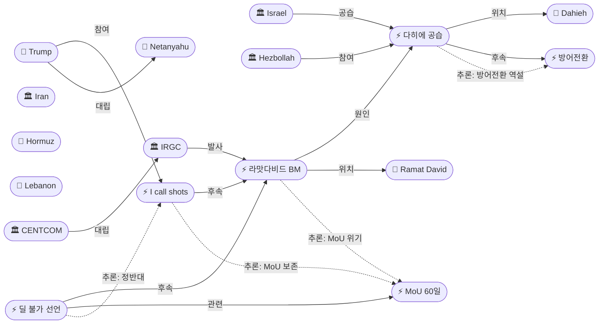
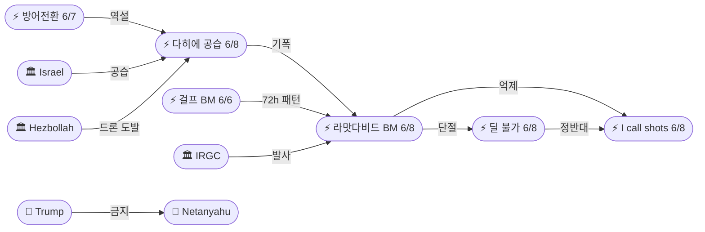
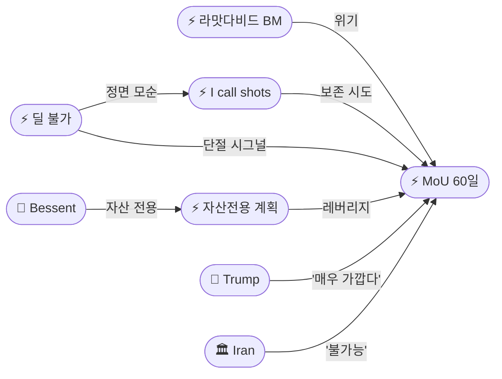

# 2026-06-08 2026 Iran War OSINT 일일 보고서

## 요약

Day 101. **이란, 60일 만에 이스라엘 직접 미사일 공격 재개 — 라맛다비드 공군기지에 BM 10+발, 전량 요격. 트럼프 "I call all the shots" 보복 금지, 이란 "딜 불가능" 선언.** 이스라엘이 6/3 휴전 갱신 이후 최초로 베이루트 **다히에(Dahieh)** 헤즈볼라 본부를 공습하자(2명 사망·11명 부상), IRGC가 **라맛다비드 공군기지**에 BM 10+발을 최소 3차례에 걸쳐 발사했다 — **4월 8일 휴전 이후 정확히 60일 만의 이란→이스라엘 직접 미사일 공격**이다. 이스라엘 방공망이 전량 요격했으나, IRGC는 **"모든 미국·이스라엘 표적에 대한 광범위한 대응"**을 경고했다. 트럼프는 즉각 네타냐후에 전화하여 보복을 금지하고 FT에 **"I call the shots. I call all the shots."**라고 밝히며, 딜이 **"매우 가깝다"**고 주장했다. 그러나 이란 협상 관련 고위 관료는 같은 날 **"트럼프와의 딜은 더 이상 이 단계에서 불가능(no longer feasible at this stage)"**하다고 선언하여 MoU 프레임워크의 위기가 공식화되었다. 호르무즈에서는 CENTCOM이 IRGC 드론 2발을 추가 격추했으나(6/7), 이란 본토 공습 없이 소강 상태다. 유가는 Brent +3.6%($96.47)로 급등했다.

## 주요 뉴스

### 1. 이란, 라맛다비드 공군기지에 BM 10+발 발사 — 4/8 이후 60일 만의 직접 미사일 공격, 전량 요격
- **출처:** [NPR](https://www.npr.org/2026/06/08/iran-missiles-israel-ramat-david), [Euronews](https://www.euronews.com/2026/06/08/iran-fires-missiles-at-israel-irgc-statement), [CNN](https://www.cnn.com/2026/06/08/middleeast/iran-missiles-israel-intercepted), [PBS](https://www.pbs.org/newshour/world/iran-fires-ballistic-missiles-israel-ramat-david), [Axios](https://www.axios.com/2026/06/08/trump-netanyahu-iran-missiles-retaliation), [Haaretz](https://www.haaretz.com/israel-news/2026-06-08/iran-fires-missiles-ramat-david), [Fox News](https://www.foxnews.com/world/iran-fires-ballistic-missiles-israel-ramat-david-airbase)
- **일시:** 2026-06-08
- **내용:** IRGC 항공우주군이 이스라엘 북부 **라맛다비드(Ramat David) 공군기지**에 탄도미사일 **최소 10발**을 **최소 3차례**에 걸쳐 발사했다. 이스라엘 방공 시스템이 **전량 요격**에 성공했다. 이는 이스라엘의 다히에(베이루트 남부 교외) 헤즈볼라 본부 공습에 대한 직접 보복이며, **4월 8일 미-이란 휴전 이후 정확히 60일 만의 이란→이스라엘 직접 미사일 공격**이다. IRGC 성명은 **"레바논 민간인에 대한 침략 행위의 원천(the source of acts of aggression against Lebanese civilians)"**을 표적으로 삼았다고 밝혔으며, **"어떠한 에스컬레이션도 모든 미국·이스라엘 표적을 포괄하는 광범위한 대응으로 이어질 것(any escalation would lead to broader response encompassing all US and Israeli targets)"**이라고 경고했다.
- **상태:** 신규
- **관련 엔티티:** IRGC, Iran, Israel, Ramat David Airbase

### 2. 이스라엘, 다히에(베이루트) 헤즈볼라 본부 공습 — 6/3 휴전 이후 최초, 2명 사망
- **출처:** [NPR](https://www.npr.org/2026/06/08/israel-strikes-beirut-dahieh-hezbollah), [Times of Israel](https://www.timesofisrael.com/idf-strikes-dahieh-hezbollah-hq-first-since-ceasefire)
- **일시:** 2026-06-08
- **내용:** IDF가 베이루트 남부 교외 **다히에(Dahieh)** 지역의 헤즈볼라 본부를 공습했다. 레바논 국영통신(NNA)에 따르면 **2명 사망, 11명 부상**이다. 이는 **6월 3일 파일럿 존 합의/휴전 갱신 이후 최초의 베이루트 공습**이다. 네타냐후 사무실은 당일 오전 헤즈볼라가 이스라엘 북부에 **전투 드론(fighter drone)**을 발사한 것에 대한 직접적 대응이라고 밝혔다. 이 공습이 이란의 라맛다비드 미사일 공격을 촉발한 **기폭제**가 되었다.
- **상태:** 신규
- **관련 엔티티:** Israel, Hezbollah, Netanyahu, Dahieh, Beirut, Lebanon

### 3. 트럼프, 네타냐후에 보복 금지 — "I call the shots. I call all the shots."
- **출처:** [Times of Israel](https://www.timesofisrael.com/trump-tells-netanyahu-not-to-retaliate-i-call-the-shots/), [FT](https://www.ft.com/content/trump-netanyahu-iran-deal-shots), [Axios](https://www.axios.com/2026/06/08/trump-netanyahu-iran-missiles-retaliation), [NBC News](https://www.nbcnews.com/politics/trump-iran-deal-meet-the-press)
- **일시:** 2026-06-08
- **내용:** 트럼프는 FT에 네타냐후가 미-이란 딜을 **"받아들일 수밖에 없을 것(won't have any choice)"**이라며 **"I call the shots. I call all the shots."**라고 밝혔다. 이란 미사일 공격 직후 네타냐후에 전화하여 **보복하지 말 것**을 지시했다. Axios에는 추가 행동이 **"진행 중인 협상을 위태롭게 할 수 있다"**고 했으며, **"우리는 이란과의 최종 딜에 매우 가깝다. 좋은 딜이 될 것(We are very close to a final deal with Iran. It is going to be a good deal)"**이라고 말했다. NBC Meet the Press에서는 이란이 합의하지 않는 이유가 **"강하고 자존심이 있기 때문(strong, proud)"**이나 **"선택의 여지가 없다(have no choice)"**고 했다.
- **상태:** 신규
- **관련 엔티티:** Donald Trump, Benjamin Netanyahu, Israel, Iran

### 4. 이란 관료: "트럼프와의 딜은 더 이상 불가능" — 베이루트 공습 비난, '자위권' 주장
- **출처:** [CBS News](https://www.cbsnews.com/news/iran-official-deal-trump-no-longer-feasible/), [파이낸셜뉴스](https://www.fnnews.com/news/202606081234)
- **일시:** 2026-06-08
- **내용:** 협상에 관련된 이란 고위 관료가 **"트럼프 대통령과의 딜은 이 단계에서 더 이상 불가능하다(a deal with President Trump is no longer feasible at this stage)"**고 밝혔다. 현 상황과 레바논 에스컬레이션에 대해 **트럼프를 비난**했다. 이란 외무부는 이스라엘의 베이루트 공습을 **"휴전 위반(ceasefire violation)"**으로 규정하고, 이란은 **"자위권(self-defense)"**을 행사한 것이라고 밝혔다. 이는 트럼프의 '매우 가까운 딜' 주장과 **정면 모순**된다.
- **상태:** 신규
- **관련 엔티티:** Iran, Donald Trump, MoU 60-Day Framework

### 5. 유가 급등: Brent +3.6% $96.47 — 이란-이스라엘 미사일 교환으로 휴전 위협
- **출처:** [Bloomberg](https://www.bloomberg.com/news/articles/2026-06-08/oil-spikes-on-iran-israel-missile-exchange), [Trading Economics](https://tradingeconomics.com/commodity/crude-oil)
- **일시:** 2026-06-08
- **내용:** 브렌트유가 **+3.6% $96.47/배럴**로 급등했다. WTI는 **$94 근처**까지 상승 후 다소 하락했다. 이란의 이스라엘 미사일 공격이 광범위한 휴전 프레임워크를 위협한다는 시장 반응이다. 주간 기준 브렌트는 **+4% 상승**으로 마감했다. 이란-이스라엘 간 직접 군사 교전이 외교 프로세스 전체를 와해시킬 수 있다는 우려가 반영되었다.
- **상태:** 업데이트 (6/7 유가 보도 연속)
- **관련 엔티티:** Strait of Hormuz, Iran, Israel

### 6. CENTCOM, 호르무즈에서 IRGC 드론 2발 추가 격추 (6/7) — 이틀 연속, 미국 역공습 없음
- **출처:** [ABC News](https://abcnews.go.com/International/centcom-shoots-down-irgc-drones-hormuz/story)
- **일시:** 2026-06-07
- **내용:** 미 중부사령부(CENTCOM)가 호르무즈 해협 해상 교통을 위협하는 IRGC **일방향 공격 드론(one-way attack drone) 2발**을 추가 격추했다. 이는 **이틀 연속**(6/5-6 사이클 이후) 이란 드론 발사가 이어진 것이다. 6/5과 달리 24시간 이내에 **미국의 이란 본토 역공습은 보고되지 않았다**. 호르무즈 에스컬레이션 사이클은 BM 급에서 드론 급으로 **소강**된 상태다.
- **상태:** 업데이트 (6/7 CENTCOM-IRGC 사이클 연속)
- **관련 엔티티:** CENTCOM, IRGC, Strait of Hormuz

### 7. 트럼프: "이란이 행동하면 제재 해제" — 딜 전 자산 해제 거부, 베센트 전용 계획 지속
- **출처:** [The Hill](https://thehill.com/policy/international/trump-sanctions-iran-behave/), [Express Tribune](https://tribune.com.pk/story/2611800/trump-wont-unfreeze-iran-assets-before-deal)
- **일시:** 2026-06-08
- **내용:** 트럼프는 이란에 대한 제재를 **"그들이 행동하면(if they behave)"** 평화 협정 이후에만 해제할 것이라고 밝혔다. 딜이 완료되기 전에는 이란 자산을 **해제하지 않겠다**고 못 박았다. 베센트 재무장관의 동결자산 걸프 동맹국 재건 전용 계획은 계속 진행 중이다. 이는 어제 레자에이의 '$24B 신뢰 테스트' 요구와 계속 **정면 충돌** 상태이다.
- **상태:** 업데이트 (6/7 베센트 자산전용 보도 연속)
- **관련 엔티티:** Donald Trump, Scott Bessent, Iran

## 지식그래프

### 오늘의 주요 관계

1. **60일 만의 이란→이스라엘 직접 미사일:** 다히에 공습(기폭제) → IRGC 10+ BM 라맛다비드(보복) → 트럼프 보복 금지(억제) → 이란 '딜 불가'(외교 단절 시그널). 4/8 이후 유지된 이란-이스라엘 상호 억제가 이스라엘의 베이루트 공습으로 완전히 붕괴.
2. **'방어전환'의 역설:** 어제(6/7) 이스라엘이 '방어 태세 전환'을 선언했으나 24시간 만에 다히에를 공습. '방어'는 남부 레바논 지상전 한정이었고, 공중 작전(특히 베이루트)은 별도 결심.
3. **트럼프의 이중 메시지:** '딜 매우 가깝다' + 'I call all the shots' = MoU 보존 의지. vs 이란 '딜 불가능' = 같은 날 정반대 평가.
4. **IRGC 72시간 2회 BM:** 6/6 걸프(7발) → 6/8 이스라엘(10+발). 다중 전선 동시 BM 투사 능력 입증; 억제력 계산 변화.
5. **호르무즈 소강:** 이란-이스라엘 축이 주 에스컬레이션 라인으로 이동; 호르무즈는 드론 급에서 정체.

### 전체 지식그래프 시각화

### 주제별 세부 그래프: 에스컬레이션 체인

### 주제별 세부 그래프: MoU 위기

## 온톨로지 변경

| 변경 유형 | 대상 | 근거 |
|----------|------|------|
| 새 엔티티 | ent-536 Israel Dahieh Strike (Event) | 6/3 이후 최초 베이루트 공습; 이란 미사일의 기폭제 |
| 새 엔티티 | ent-537 Iran Missile Attack on Ramat David (Event) | 4/8 이후 60일 만의 이란→이스라엘 직접 BM 공격 |
| 새 엔티티 | ent-538 Trump 'I Call the Shots' Statement (Event) | 전례 없는 공개적 이스라엘 통제권 주장 |
| 새 엔티티 | ent-539 Iran 'Deal No Longer Feasible' Statement (Event) | MoU 위기 공식화 선언 |
| 새 엔티티 | ent-540 Ramat David Airbase (Location) | 이란 미사일 표적 |
| 새 엔티티 | ent-541 Dahieh (Location) | 헤즈볼라 본부 소재 베이루트 남부 교외 |
| 업데이트 | ent-001 Trump | action_jun08: 'I call all the shots', 보복 금지, '딜 매우 가깝다' |
| 업데이트 | ent-002 Iran | action_jun08: 10+ BM 라맛다비드, '딜 불가능' 선언, '자위권' |
| 업데이트 | ent-004 Israel | action_jun08: 다히에 공습, 방어전환 하루 만에 역행 |
| 업데이트 | ent-005 IRGC | action_jun08: 10+ BM 라맛다비드, '광범위한 대응' 경고 |
| 업데이트 | ent-031 Netanyahu | action_jun08: 다히에 공습 승인, 트럼프에 의해 보복 금지 |
| 업데이트 | ent-535 Bessent | action_jun08: 자산 전용 계획 지속 |
| 스키마 변경 | 없음 | 모든 신규 항목이 기존 클래스/관계로 표현 가능 |

## 추론 결과

| 추론 | 신뢰도 | 근거 |
|------|--------|------|
| 이란 미사일 → MoU 위기 | 0.82 | 60일 휴전 파기 + 이란 '딜 불가' 동시 선언 |
| 방어전환 → 다히에 역설 | 0.78 | 6/7 '방어' 발표 → 6/8 베이루트 공습; 지상전 vs 공중 별개 |
| BM 7발(걸프) → BM 10+(이스라엘) | 0.80 | 72시간 2회 BM; IRGC 다중 전선 투사 |
| 트럼프 'I call shots' → MoU 보존 | 0.80 | 이란 공격에도 이스라엘 보복 금지 = 딜 동기 우선 |
| 이란 '불가' vs 트럼프 '가깝다' | 0.85 | 같은 날 정반대 평가 — 메시지 전쟁 또는 실질 단절 |

## 분석 및 평가

**Day 101은 4/8 이란-이스라엘 휴전의 60일 만의 파기라는 전쟁의 질적 전환점이다.** 이스라엘이 다히에를 공습한 것은 헤즈볼라 전투 드론에 대한 '전술적 대응'이었으나, 이란에게는 레바논 보호라는 '전략적 레드라인'의 재위반이었다. 4/17 '이란 호르무즈 개방/재폐쇄' 사태에서 보았듯, 이스라엘의 레바논 행동은 항상 이란의 광범위한 에스컬레이션을 촉발하는 패턴이 반복되었다.

**트럼프의 'I call all the shots' 선언은 4/17 'PROHIBITED' 이후 가장 극적인 미-이스라엘 관계 변화를 보여준다.** 이란이 이스라엘에 10+ BM을 발사한 직후에 동맹국인 이스라엘의 보복을 공개적으로 금지한 것은, 트럼프가 이란 딜을 자신의 정치적 유산으로 간주하며 이스라엘의 군사적 자율성보다 딜을 우선시한다는 것을 명확히 했다. 이는 네타냐후에게 극도의 정치적 딜레마를 제공한다 — 미국 지원 없이 이란과 전쟁을 지속할 수 없으나, 이란의 미사일 공격에 무대응하면 국내 정치적 생존이 위태롭다.

**이란의 '딜 불가능' 선언은 메시지 전쟁인가 실질적 단절인가가 핵심 판단 대상이다.** 6/4 아라그치 '진전 없으나 소통 미차단'에서 6/8 '불가능'으로 격상된 것은, 미사일 공격 당일의 선언이라는 점에서 단순한 포지셔닝이 아닌 실질적 외교 단절 시그널일 수 있다. 그러나 이란은 과거에도 유사한 최대주의적 발언(4/19 '회담 거부', 4/21 '시간 낭비') 후 협상으로 복귀한 패턴이 있다. 차이점은: 이번에는 발언과 함께 **실제 미사일 공격이 동반**되었다는 것이다.

**IRGC의 72시간 내 2회 대규모 BM 사용(6/6 걸프 7발 → 6/8 이스라엘 10+발)은 억제력 구조의 변화를 시사한다.** IRGC가 BM 재고를 적극적으로 소진하고 있다는 것은: (1) 재고가 충분하거나, (2) 억제력 계산에서 '사용하지 않으면 의미 없다'는 판단에 도달했거나, (3) 다중 전선 동시 투사를 통해 미국/이스라엘의 방공 시스템을 과부하시키려는 전략일 수 있다.

## 추적 항목

| 항목 | 최초 보고 | 상태 | 최신 업데이트 |
|------|----------|------|-------------|
| MoU 60일 프레임워크 | 2026-05-25 | 위기 | 이란 '딜 불가능' 선언 vs 트럼프 '매우 가깝다' — 정면 모순; 미사일 공격 당일 |
| 이란-이스라엘 휴전 (4/8~) | 2026-04-08 | 파기 | 60일 만에 이란→이스라엘 직접 BM 10+발; 기폭제: 다히에 공습 |
| CENTCOM-IRGC 교전 | 2026-06-01 | 소강 | 호르무즈 드론 2발 격추(6/7); 미 역공습 없음; 주 에스컬레이션 축이 이란-이스라엘로 이동 |
| 파일럿 존 합의 | 2026-06-04 | 위기 | 다히에 공습이 6/3 합의를 사실상 파기; '방어전환' 24시간 만에 역행 |
| 동결자산 $24B | 2026-06-07 | 교착 | 트럼프 '딜 전 해제 안 한다'; 베센트 걸프 전용 지속; 이란 $24B 요구 무시 |
| 트럼프-네타냐후 관계 | 2026-04-17 | 최대 긴장 | 'I call all the shots' — 4/17 'PROHIBITED' 이후 가장 극적 통제 |
| 유가 | 2026-04-07 | 상승 | Brent $96.47 (+3.6%); 주간 +4%; 이란-이스라엘 직접 교전 리스크 반영 |

## 동향 요약

| 분류 | 상태 | 비고 |
|------|------|------|
| 미-이란 MoU 협상 | 위기 | 이란 '불가능' vs 트럼프 '가깝다'; 미사일 공격 당일 |
| 이란-이스라엘 | 직접 교전 재개 | 60일 만에 BM 10+; 전량 요격; 보복 금지 |
| 이스라엘-레바논 | 휴전 파기 | 다히에 공습; 6/3 합의 위반; 방어전환 역행 |
| 호르무즈 해협 | 소강 | 드론 2발 격추; 미 역공습 없음; 주 축 이동 |
| 미-이스라엘 관계 | 최대 긴장 | 'I call all the shots'; 보복 금지 |
| 유가 | Brent $96.47 (+3.6%) | 주간 +4%; 직접 교전 리스크 프리미엄 |
| 동결자산 | 교착 지속 | 트럼프 딜 전 해제 거부; 베센트 전용 |

## 출처 목록
1. [Iran fires 10+ BMs at Ramat David Airbase](https://www.npr.org/2026/06/08/iran-missiles-israel-ramat-david) - NPR, 2026-06-08
2. [IRGC statement: 'source of aggression' targeted](https://www.euronews.com/2026/06/08/iran-fires-missiles-at-israel-irgc-statement) - Euronews, 2026-06-08
3. [Iran missiles at Israel — all intercepted from 3 barrages](https://www.cnn.com/2026/06/08/middleeast/iran-missiles-israel-intercepted) - CNN, 2026-06-08
4. [Iran fires ballistic missiles at Israel](https://www.pbs.org/newshour/world/iran-fires-ballistic-missiles-israel-ramat-david) - PBS, 2026-06-08
5. [Trump called Netanyahu not to retaliate](https://www.axios.com/2026/06/08/trump-netanyahu-iran-missiles-retaliation) - Axios, 2026-06-08
6. [Iran fires missiles at Ramat David](https://www.haaretz.com/israel-news/2026-06-08/iran-fires-missiles-ramat-david) - Haaretz, 2026-06-08
7. [Iran fires BMs at Israel Ramat David Airbase](https://www.foxnews.com/world/iran-fires-ballistic-missiles-israel-ramat-david-airbase) - Fox News, 2026-06-08
8. [Israel strikes Dahieh Hezbollah HQ](https://www.npr.org/2026/06/08/israel-strikes-beirut-dahieh-hezbollah) - NPR, 2026-06-08
9. [IDF strikes Dahieh — first since ceasefire](https://www.timesofisrael.com/idf-strikes-dahieh-hezbollah-hq-first-since-ceasefire) - Times of Israel, 2026-06-08
10. [Trump: 'I call the shots'](https://www.timesofisrael.com/trump-tells-netanyahu-not-to-retaliate-i-call-the-shots/) - Times of Israel, 2026-06-08
11. [Trump FT: Netanyahu 'won't have any choice'](https://www.ft.com/content/trump-netanyahu-iran-deal-shots) - Financial Times, 2026-06-08
12. [Trump NBC: Iran 'have no choice'](https://www.nbcnews.com/politics/trump-iran-deal-meet-the-press) - NBC News, 2026-06-08
13. [Iran official: deal 'no longer feasible'](https://www.cbsnews.com/news/iran-official-deal-trump-no-longer-feasible/) - CBS News, 2026-06-08
14. [이란 딜 불가능 선언](https://www.fnnews.com/news/202606081234) - 파이낸셜뉴스, 2026-06-08
15. [Oil spikes on Iran-Israel missile exchange](https://www.bloomberg.com/news/articles/2026-06-08/oil-spikes-on-iran-israel-missile-exchange) - Bloomberg, 2026-06-08
16. [Oil prices — WTI near $94](https://tradingeconomics.com/commodity/crude-oil) - Trading Economics, 2026-06-08
17. [CENTCOM shoots down 2 IRGC drones in Hormuz](https://abcnews.go.com/International/centcom-shoots-down-irgc-drones-hormuz/story) - ABC News, 2026-06-08
18. [Trump: only lift sanctions if Iran 'behaves'](https://thehill.com/policy/international/trump-sanctions-iran-behave/) - The Hill, 2026-06-08
19. [Trump won't unfreeze assets before deal](https://tribune.com.pk/story/2611800/trump-wont-unfreeze-iran-assets-before-deal) - Express Tribune, 2026-06-08
