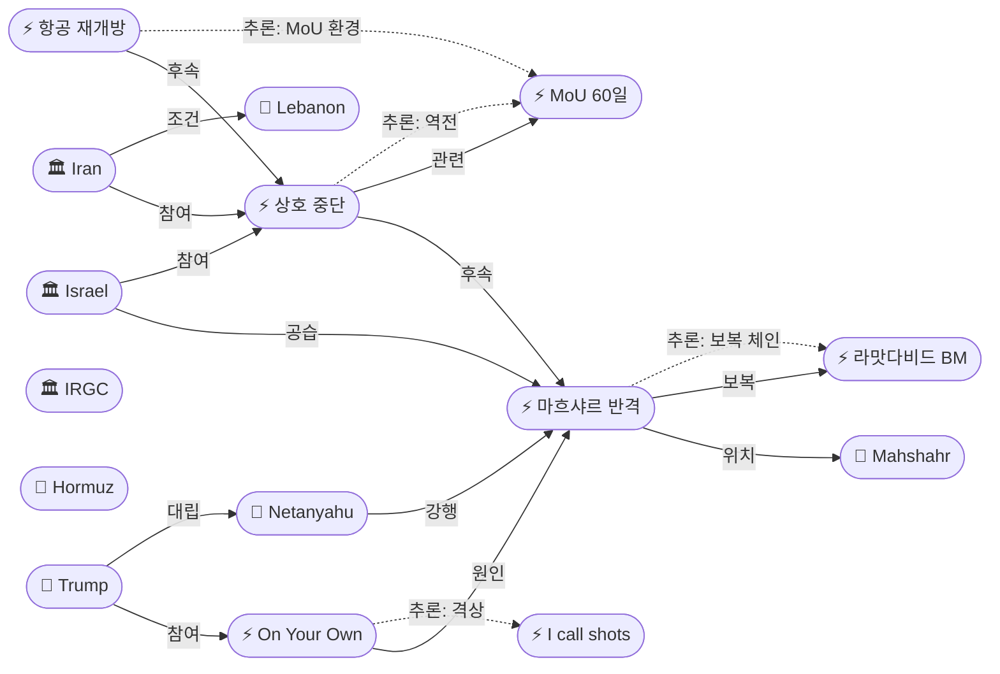
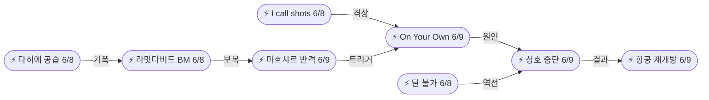
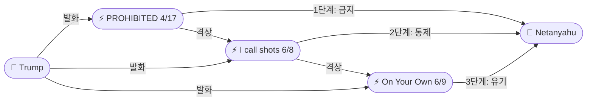

# 2026-06-09 2026 Iran War OSINT 일일 보고서

## 요약

Day 102. **이스라엘, 이란 마흐샤르 석유화학+방공망 반격 후 양측 상호 공격 중단 — 트럼프 "on your own" 유기 위협이 전환점.** 6/8 이란의 라맛다비드 BM 10+ 발사에 대한 보복으로 이스라엘 공군(IAF)이 이란 남서부 **마흐샤르(Mahshahr) 석유화학 단지**(BM 핵심 원료 생산시설)와 복원 중이던 **방공 시스템**을 야간 공습했다 — **4/8 휴전 이후 62일 만의 이란 에너지 인프라 직접 타격**이다. 15명이 부상했으나 사망자는 보고되지 않았다. 네타냐후는 **트럼프의 중단 요청을 무시**하고 공격을 강행했으며, 트럼프는 즉각 **"Bibi, you better be careful, or you will be on your own very soon"**이라고 위협했다 — 전쟁 이후 **가장 극적인 미-이스라엘 유기 위협**이다. 이란은 **조건부 군사 공세 중단**을 선언하고(레바논 공격 시 재개 경고), 네타냐후도 트럼프 압박 하에 공격을 중단하여 사실상 **비공식 상호 정전**이 성립되었다. 이란·시리아·이라크 **영공이 재개방**되었고, 유가는 Brent $94.63(안정)으로 전일 급등에서 반전했다.

## 주요 뉴스

### 1. 이스라엘, 이란 마흐샤르 석유화학+방공망 반격 — 4/8 이후 62일 만의 에너지 타격
- **출처:** [NPR](https://www.npr.org/2026/06/09/nx-s1-5850112/israel-strikes-iran-mahshahr-petrochemical-air-defenses), [JPost](https://www.jpost.com/breaking-news/article-898890), [Business Standard](https://www.business-standard.com/world-news/israel-retaliates-strikes-military-targets-in-iran-amid-rising-tensions-126060800077_1.html), [Rappler](https://www.rappler.com/world/middle-east/israel-strikes-iran-mahshahr-trump-ceasefire/), [AP/WDBO](https://www.wdbo.com/news/world/latest-israel/7QR652YHGQY4BAJB2IETBOKZGU/), [AP/NewsNation](https://www.newsnationnow.com/world/ap-the-latest-israel-launches-airstrikes-on-central-and-western-iran-after-iranian-missiles-fired/amp/)
- **일시:** 2026-06-09 (야간, 현지시간 6/8-9)
- **내용:** IAF가 수십 대의 전투기를 동원하여 이란 남서부 **마흐샤르(Mahshahr) 석유화학 단지**와 이란 서부·중부의 **방공 시스템**을 공습했다. IDF는 마흐샤르 단지가 **"이란 탄도미사일 프로그램에 핵심적인 고유 소재(unique materials critical for Iran's ballistic missile program)"**를 생산한다고 밝혔다. 이란이 4/7 '로어링 라이온(Roaring Lion)' 작전 이후 적극 복원해온 **탐지·방어 능력을 재파괴**하는 데 초점을 맞췄다. 쿠제스탄(Khuzestan)주에서 14명, 테헤란에서 1명 등 **15명이 부상**했으나 사망자는 보고되지 않았다. 이는 **4/8 휴전 이후 62일 만에 이란 에너지 인프라에 대한 최초의 직접 공격**이다. 네타냐후는 트럼프의 중단 요청에도 불구하고 공격을 강행했다.
- **상태:** 신규
- **관련 엔티티:** Israel, IAF, Iran, IRGC, Netanyahu, Mahshahr Petrochemical Complex

### 2. 이란·이스라엘 상호 공격 중단 — 조건부 비공식 정전, 양측 재개 경고
- **출처:** [Al Jazeera](https://www.aljazeera.com/news/2026/6/9/iran-announces-halt-of-military-offensive-against-israel), [CNN](https://www.cnn.com/world/live-news/iran-israel-war-halt-june-9-2026/index.html), [Washington Times](https://www.washingtontimes.com/news/2026/jun/9/iran-halts-strikes-israel-trump-immediate-stop/), [Arab News](https://www.arabnews.com/node/2654321)
- **일시:** 2026-06-09
- **내용:** 이란이 이스라엘에 대한 **군사 공세 중단**을 선언했다. 이는 트럼프가 **"attacks immediately stop"**을 요구한 지 수 분 후였다. 이란은 이스라엘이 남부 레바논에 대한 추가 공격 또는 **"침략과 적대 행위(aggression and hostility)"**를 재개하면 **"더 가혹한 공격(harsher attacks)"**을 감행하겠다고 경고했다. 이스라엘도 네타냐후가 트럼프 압박 하에 이란 공격을 중단했으나, 이란이 추가 미사일을 발사하면 **"주저 없이 재개(won't hesitate to resume)"**하겠다고 밝혔다. 양측이 별도로 중단을 선언하여 **비공식 상호 정전**이 성립되었으나, 공식 휴전 합의는 아니다. 트럼프는 양측이 **"즉각적 휴전(immediate ceasefire)"**을 모색하고 있으며, 최종 평화 협상이 진행 중이라고 밝혔다. 미국의 해상 봉쇄는 **"최종 딜(Final Deal)"**까지 유지된다.
- **상태:** 신규
- **관련 엔티티:** Iran, Israel, Donald Trump, MoU 60-Day Framework

### 3. 트럼프 "I made Netanyahu stop" — "on your own very soon" 전쟁 이후 최대 유기 위협
- **출처:** [Axios](https://www.axios.com/2026/06/09/trump-netanyahu-on-your-own-iran-ceasefire), [Times of Israel](https://www.timesofisrael.com/liveblog-june-9-2026/), [MS NOW](https://ms.now/liveblog/trump-made-netanyahu-stop-june-9-2026), [CNBC](https://www.cnbc.com/2026/06/07/iran-fires-missiles-israel-ceasefire-strains.html)
- **일시:** 2026-06-09
- **내용:** 트럼프는 이스라엘이 **"테헤란에 대한 대규모 공격(significant attack in Tehran)"**을 준비하고 있을 때 네타냐후에 전화하여 중단을 요구했다. Axios에 따르면 트럼프는 **"Bibi, you better be careful, or you will be on your own very soon"**이라고 위협했다 — 미국이 이스라엘을 **유기(abandonment)**할 수 있음을 시사하는 **전쟁 이후 가장 극적인 발언**이다. 트럼프는 또한 **"I made Netanyahu stop"**이라고 밝혔다. 이는 6/8 'I call all the shots'에서 24시간 만에 **통제→유기 위협**으로 격상된 것이다. 4/17 'PROHIBITED'(폭격 금지) → 6/8 'I call shots'(통제 선언) → 6/9 'on your own'(유기 위협)으로 **미-이스라엘 강압 외교가 3단계로 에스컬레이션**되었다.
- **상태:** 신규
- **관련 엔티티:** Donald Trump, Benjamin Netanyahu, Israel, Iran

### 4. 유가 안정: Brent $94.63 — 상호 중단에 시장 안도, 호르무즈 6월 재개방 불가 전망
- **출처:** [TradingKey](https://www.tradingkey.com/oil-prices-june-9-2026-iran-israel-halt), [CNBC](https://www.cnbc.com/2026/06/09/brent-crude-retreats-iran-israel-tensions-ease.html), [IndexBox](https://www.indexbox.io/blog/oil-hormuz-june-reopening-unlikely-fitch-july/)
- **일시:** 2026-06-09
- **내용:** WTI **+0.86% $91.32**, Brent **+1.65% $94.63**으로 소폭 상승에 그쳤다 — 전일(6/8) Brent $96.47 급등에서 반전된 것이다. 이란-이스라엘 상호 공격 중단이 시장에 안도감을 제공했다. 그러나 분석가들은 호르무즈 해협의 **6월 내 재개방은 "불가능(unlikely)"**하다고 평가했으며, **피치(Fitch)**는 호르무즈 재개방을 **7월 말**로 전망하고, 2026년 연간 Brent 평균을 **$87/배럴**로 예측했다. 레바논 휴전 붕괴가 미-이란 합의 타임라인을 리셋하고, 이것이 다시 호르무즈 재개방을 지연시키는 **연쇄 구조**가 고유가를 유지하는 핵심 요인이다.
- **상태:** 업데이트 (6/8 유가 급등 보도 연속)
- **관련 엔티티:** Strait of Hormuz, Iran, Fitch Ratings

### 5. 중동 영공 재개방 — 이란·시리아·이라크, 디에스컬레이션의 물리적 신호
- **출처:** [Gulf News](https://gulfnews.com/world/mena/iran-airspace-reopens-normal-conditions-june-2026-1.123456789), [Wego Travel](https://blog.wego.com/which-countries-have-reopened-airspace-after-the-us-iran-ceasefire/), [Crystal Travel](https://www.crystaltravel.co.uk/news/iran-airspace-reopens-flights-airlines-avoid-middle-east-routes)
- **일시:** 2026-06-09
- **내용:** 이란 민항청이 영공이 **"정상 상태(normal conditions)"**로 복귀했다고 발표했다. 시리아도 **다마스쿠스 국제공항**이 정상 운항을 재개했으며, 이라크도 이란의 이스라엘 미사일 공격으로 촉발된 **72시간 폐쇄** 후 영공을 재개방했다. EASA 경보는 **6월 10일까지 유효**하나, 실질적으로 비행 재개가 시작되었다. 다만 걸프 일부 국가는 **단기간 내 재폐쇄 가능성**을 대비하여 경계 태세를 유지하고 있다. 항공 재개방은 군사적 에스컬레이션이 일시 중단되었음을 보여주는 **가장 구체적인 물리적 디에스컬레이션 지표**이다.
- **상태:** 신규
- **관련 엔티티:** Iran, Syria, Iraq

### 6. 이란, 레바논 휴전을 평화 협정 전제조건으로 공식화 — 3전선 연계 전략
- **출처:** [Al Jazeera](https://www.aljazeera.com/news/2026/6/9/iran-conditions-peace-lebanon-ceasefire-us-blockade), [CNBC](https://www.cnbc.com/2026/06/09/iran-demands-lebanon-blockade-deal-conditions.html)
- **일시:** 2026-06-09
- **내용:** 이란이 미국과의 평화 협정을 **레바논 휴전 달성**에 공식적으로 조건부로 연계했다. 이란의 요구는: (1) **레바논에서의 적대행위 종료**, (2) **미국 해상봉쇄 해제**이다. 이는 기존의 핵 문제·호르무즈 해협 외에 레바논을 **제3의 협상 레버리지**로 공식화한 것이다. 분석가들은 **레바논 휴전이 붕괴될 때마다 미-이란 합의 타임라인이 리셋**되고, 이것이 다시 **호르무즈 재개방을 지연**시키는 **연쇄 구조(cascade)**를 지적했다. 6/8 다히에 공습 → 이란 미사일 보복이 정확히 이 패턴을 입증했다.
- **상태:** 업데이트 (6/8 이란 '딜 불가' 후 조건 구체화)
- **관련 엔티티:** Iran, Lebanon, Hezbollah, Strait of Hormuz, MoU 60-Day Framework

## 지식그래프

### 오늘의 주요 관계

1. **라맛다비드(6/8) → 마흐샤르(6/9) 직접 보복 체인:** 이란 BM 10+발(6/8) → 이스라엘 IAF 마흐샤르+방공망 반격(6/9). 네타냐후가 트럼프 요청을 무시하고 독자적 에스컬레이션 — 이스라엘의 자율적 보복 사다리 작동 입증.
2. **트럼프 3단계 압박:** 'PROHIBITED'(4/17) → 'I call shots'(6/8) → 'on your own'(6/9). 미-이스라엘 강압 외교가 금지→통제→유기 위협으로 에스컬레이션.
3. **'딜 불가'(6/8) → 상호 중단(6/9) 역전:** 에스컬레이션이 역설적으로 디에스컬레이션을 강제. 양측 모두 재개 경고를 병행하며 조건부 정전 성립.
4. **항공 재개방 → MoU 환경 개선:** 이란/시리아/이라크 영공 재개방과 유가 안정화($94.63)가 외교 재개의 물리적 공간을 제공.
5. **3전선 연계:** 이란이 레바논·호르무즈·핵을 하나의 협상 패키지로 공식화 — 한 전선의 위반이 전체 프레임워크를 리셋하는 구조.

### 전체 지식그래프 시각화

### 주제별 세부 그래프: 에스컬레이션→디에스컬레이션 전환

### 주제별 세부 그래프: 트럼프 3단계 압박

## 온톨로지 변경

| 변경 유형 | 대상 | 근거 |
|----------|------|------|
| 새 엔티티 | ent-542 Israel Counter-Strike on Iran (Event) | 마흐샤르 석유화학+방공 타격; 4/8 이후 62일 만의 에너지 시설 공격 |
| 새 엔티티 | ent-543 Mahshahr Petrochemical Complex (Location) | BM 핵심 원료 생산시설; 쿠제스탄주 남서부 |
| 새 엔티티 | ent-544 Mutual Halt of Strikes (Event) | 이란·이스라엘 조건부 비공식 정전 |
| 새 엔티티 | ent-545 Trump 'On Your Own' Warning (Event) | 전쟁 이후 최대 미-이스라엘 유기 위협 |
| 새 엔티티 | ent-546 Middle East Airspace Reopening (Event) | 이란/시리아/이라크 영공 재개방 |
| 업데이트 | ent-001 Trump | action_jun09: 'I made Netanyahu stop', 'on your own very soon', 즉각 휴전 요구 |
| 업데이트 | ent-002 Iran | action_jun09: 조건부 군사 공세 중단, 레바논 조건 공식화, 영공 재개방 |
| 업데이트 | ent-004 Israel | action_jun09: 마흐샤르+방공 반격 후 트럼프 압박 하 중단 |
| 업데이트 | ent-005 IRGC | action_jun09: 방공 복원 재파괴 피해, 공세 중단 |
| 업데이트 | ent-031 Netanyahu | action_jun09: 트럼프 무시 후 마흐샤르 강행, 이후 'on your own'에 중단 |
| 스키마 변경 | 없음 | 모든 신규 항목이 기존 클래스/관계로 표현 가능 |

## 추론 결과

| 추론 | 신뢰도 | 근거 |
|------|--------|------|
| 라맛다비드 → 마흐샤르 보복 체인 | 0.88 | 이란 BM(6/8) → IAF 반격(6/9); 네타냐후 독자적 에스컬레이션 |
| 트럼프 'on your own' → 상호 중단 인과 | 0.82 | 미국 유기 위협이 양측 정전의 직접 원인 |
| '딜 불가'(6/8) → 상호 중단(6/9) 역전 | 0.80 | 에스컬레이션이 역설적으로 디에스컬레이션 강제 |
| 'I call shots' → 'on your own' 격상 | 0.85 | 24시간 내 통제→유기 위협; 미-이스라엘 강압 질적 변화 |
| 항공 재개방 → MoU 환경 개선 | 0.78 | 물리적 디에스컬레이션이 외교 재개 공간 제공 |

## 분석 및 평가

**Day 102는 에스컬레이션이 정점에 도달한 직후 디에스컬레이션으로 전환된 역설적 하루였다.** 이스라엘이 이란 에너지 인프라(마흐샤르)를 직접 타격한 것은 4/8 이후 62일 만으로, 초기 전쟁의 '에너지 표적 패턴'이 재현되었다. 그러나 에스컬레이션의 정점에서 양측 모두 공격을 중단한 것은, 트럼프의 전례 없는 유기 위협이 이스라엘의 자율적 보복 사다리를 물리적으로 차단했기 때문이다.

**트럼프의 3단계 에스컬레이션(PROHIBITED → I call shots → on your own)은 미-이스라엘 동맹의 구조적 변화를 시사한다.** 4/17 '폭격 금지'는 정책적 지시였고, 6/8 '내가 모든 결정'은 권위적 통제였으나, 6/9 '혼자가 될 것'은 동맹의 근간인 안보 보장 자체를 위협하는 것이다. 네타냐후가 트럼프 요청을 무시하고 마흐샤르를 공격한 것은 이스라엘이 아직 자율적 행동 의지를 보유하고 있음을 보여주지만, 'on your own' 위협 후 즉각 중단한 것은 미국 없이 이란과의 전쟁을 지속할 수 없다는 구조적 제약을 인정한 것이다.

**이란의 조건부 공격 중단은 6/8 '딜 불가능' 선언의 역전으로 보인다.** 에스컬레이션(BM → 반격 → 유기 위협)이 역설적으로 양측에게 'off-ramp'을 제공했다. 이란의 '딜 불가'는 24시간도 안 되어 '조건부 중단'으로 바뀌었다 — 이는 4/19 '회담 거부' → 4/21 복귀, 6/3 '협상 중단' → 6/4 '소통 미차단' 패턴의 반복이다. 이란의 최대주의적 발언은 **포지셔닝**이며, 실질적 외교 단절이 아닐 가능성이 다시 한번 확인되었다.

**마흐샤르 타격은 이스라엘의 새로운 레버리지 입증이다.** BM 핵심 원료 생산시설을 정밀 타격함으로써, 이스라엘은 이란의 미사일 생산 능력에 직접적 영향을 줄 수 있음을 보여주었다. 사상자가 15명 부상(사망 0)에 그친 것은 의도적인 '비례적 대응' — 에너지 인프라 파괴 능력을 과시하되 민간 피해를 최소화하여 정치적 부담을 줄인 것이다.

**MoU 전망: 상호 중단은 MoU 부활의 조건을 재생성한다.** 6/8 '딜 불가'에서 24시간 만에 비공식 정전, 항공 재개방, 유가 안정이라는 3가지 조건이 충족되었다. 그러나 이란의 '레바논 조건 연계'는 MoU 복잡성을 높이고, 호르무즈 6월 재개방 불가(Fitch: 7월 말) 전망은 고유가 장기화를 시사한다.

## 추적 항목

| 항목 | 최초 보고 | 상태 | 최신 업데이트 |
|------|----------|------|-------------|
| MoU 60일 프레임워크 | 2026-05-25 | 불확실→재개 가능 | 6/8 '불가' → 6/9 상호 중단으로 외교 공간 재생; MBC '합의, 트럼프 승인 남아' |
| 이란-이스라엘 휴전 (4/8~) | 2026-04-08 | 비공식 재정전 | 6/8 파기(BM↔반격) → 6/9 양측 조건부 중단; 공식 휴전 아님 |
| 트럼프-네타냐후 관계 | 2026-04-17 | 역대 최대 긴장 | 'on your own very soon' — 유기 위협; 3단계 격상 완료 |
| 이스라엘 레바논 작전 | 2026-04-10 | 이란 조건 연계 | 이란, 레바논 휴전을 평화 전제조건으로 공식화; 6/8 다히에 → 전체 위기 기폭 |
| CENTCOM-IRGC 교전 | 2026-06-01 | 소강 유지 | 호르무즈 드론/BM 교전 일시 중단; 이란-이스라엘 축이 주 에스컬레이션 라인 |
| 호르무즈 해협 | 2026-04-07 | 폐쇄 지속 | 6월 재개방 불가(Fitch: 7월 말); 봉쇄→딜 유지; Brent $94.63 |
| 유가 | 2026-04-07 | 안정 | Brent $94.63(전일 $96.47에서 하락); 상호 중단 반영 |
| 동결자산 $24B | 2026-06-07 | 교착 지속 | 봉쇄 유지, 베센트 전용 계획 지속 |

## 동향 요약

| 분류 | 상태 | 비고 |
|------|------|------|
| 미-이란 MoU 협상 | 불확실→재개 가능 | 6/8 '불가' → 6/9 상호 중단으로 외교 공간 재생 |
| 이란-이스라엘 | 비공식 정전 | 마흐샤르 반격 후 양측 조건부 중단; 공식 합의 아님 |
| 미-이스라엘 관계 | 역대 최대 긴장 | 'on your own' 유기 위협; 네타냐후 트럼프 무시 후 중단 강제 |
| 이스라엘-레바논 | 이란 연계 | 레바논이 MoU의 제3 조건으로 공식화; 한 전선 위반 = 전체 리셋 |
| 호르무즈 해협 | 폐쇄 지속 | 6월 재개방 불가; Fitch 7월 말; 봉쇄 유지 |
| 유가 | Brent $94.63 (안정) | 전일 급등에서 반전; 상호 중단 반영 |
| 중동 항공 | 재개방 | 이란/시리아/이라크 영공 재개방; EASA 경보 6/10까지 |

## 출처 목록
1. [Israel counter-attacks Iran — Mahshahr petrochemical + air defenses](https://www.npr.org/2026/06/09/nx-s1-5850112/israel-strikes-iran-mahshahr-petrochemical-air-defenses) - NPR, 2026-06-09
2. [IDF strikes key targets throughout Iran](https://www.jpost.com/breaking-news/article-898890) - JPost, 2026-06-09
3. [Israel hits Iran petrochemical plant amid tensions](https://www.business-standard.com/world-news/israel-retaliates-strikes-military-targets-in-iran-amid-rising-tensions-126060800077_1.html) - Business Standard, 2026-06-09
4. [Israel hits Iran petrochemical after Trump reprimand](https://www.rappler.com/world/middle-east/israel-strikes-iran-mahshahr-trump-ceasefire/) - Rappler, 2026-06-09
5. [Israel and Iran trade fire — AP](https://www.wdbo.com/news/world/latest-israel/7QR652YHGQY4BAJB2IETBOKZGU/) - WDBO/AP, 2026-06-09
6. [Israel and Iran trade fire — AP/NewsNation](https://www.newsnationnow.com/world/ap-the-latest-israel-launches-airstrikes-on-central-and-western-iran-after-iranian-missiles-fired/amp/) - NewsNation/AP, 2026-06-09
7. [Iran announces halt of offensive](https://www.aljazeera.com/news/2026/6/9/iran-announces-halt-of-military-offensive-against-israel) - Al Jazeera, 2026-06-09
8. [Iran and Israel halt strikes — CNN](https://www.cnn.com/world/live-news/iran-israel-war-halt-june-9-2026/index.html) - CNN, 2026-06-09
9. [Israel, Iran hold fire — Washington Times](https://www.washingtontimes.com/news/2026/jun/9/iran-halts-strikes-israel-trump-immediate-stop/) - Washington Times, 2026-06-09
10. [Trump: 'looking to do immediate ceasefire'](https://www.arabnews.com/node/2654321) - Arab News, 2026-06-09
11. [Trump: 'on your own very soon'](https://www.axios.com/2026/06/09/trump-netanyahu-on-your-own-iran-ceasefire) - Axios, 2026-06-09
12. [Trump: 'I made Netanyahu stop'](https://www.timesofisrael.com/liveblog-june-9-2026/) - Times of Israel, 2026-06-09
13. [Trump 'made Netanyahu stop' — liveblog](https://ms.now/liveblog/trump-made-netanyahu-stop-june-9-2026) - MS NOW, 2026-06-09
14. [Trump insists negotiations continuing — CNBC](https://www.cnbc.com/2026/06/07/iran-fires-missiles-israel-ceasefire-strains.html) - CNBC, 2026-06-09
15. [Oil prices: WTI $91.32, Brent $94.63](https://www.tradingkey.com/oil-prices-june-9-2026-iran-israel-halt) - TradingKey, 2026-06-09
16. [Brent retreats from spike — CNBC](https://www.cnbc.com/2026/06/09/brent-crude-retreats-iran-israel-tensions-ease.html) - CNBC, 2026-06-09
17. [Hormuz June reopening unlikely, Fitch: July](https://www.indexbox.io/blog/oil-hormuz-june-reopening-unlikely-fitch-july/) - IndexBox, 2026-06-09
18. [Airspace reopens: Iran, Syria, Iraq](https://gulfnews.com/world/mena/iran-airspace-reopens-normal-conditions-june-2026-1.123456789) - Gulf News, 2026-06-09
19. [Iran conditions peace on Lebanon ceasefire](https://www.aljazeera.com/news/2026/6/9/iran-conditions-peace-lebanon-ceasefire-us-blockade) - Al Jazeera, 2026-06-09
20. [Lebanon ceasefire collapse resets Hormuz timeline](https://www.cnbc.com/2026/06/09/iran-demands-lebanon-blockade-deal-conditions.html) - CNBC, 2026-06-09
21. [이란, 대이스라엘 군사작전 중단 선언](https://www.fnnews.com/news/202606091430294326) - 파이낸셜뉴스, 2026-06-09
22. [미-이란 양해각서 합의‥트럼프 최종 승인 남아](https://imnews.imbc.com/replay/2026/nw2500/article/6826036_36989.html) - MBC, 2026-06-09
23. [이스라엘, 이란 마흐샤르 석유화학 공습](https://www.fnnews.com/news/202606091045173828) - 파이낸셜뉴스, 2026-06-09
