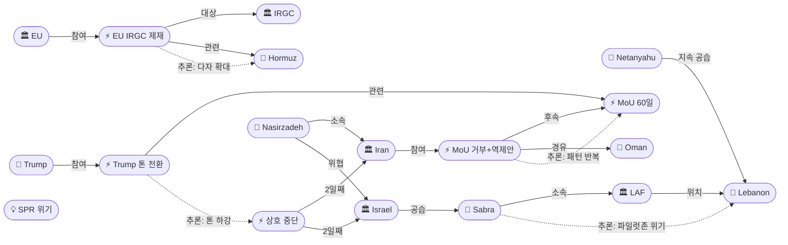
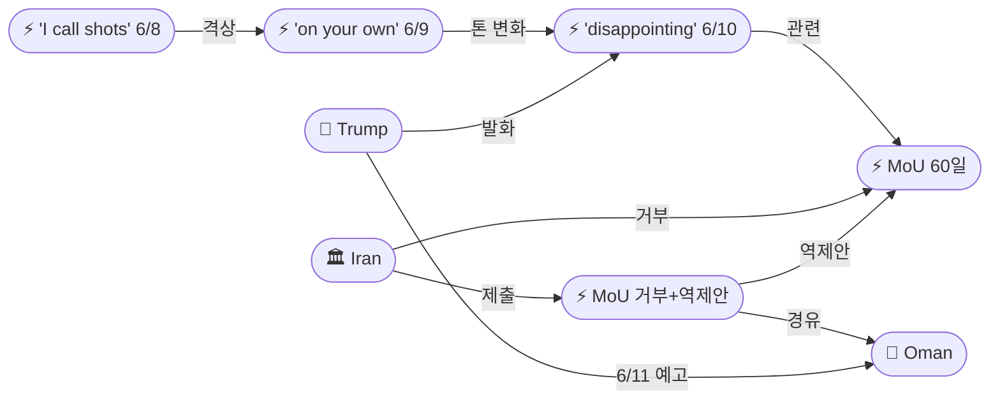
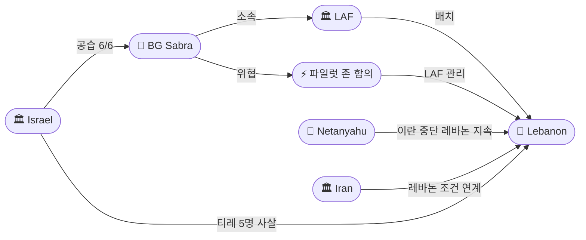

# 2026-06-10 2026 Iran War OSINT 일일 보고서

## 요약

Day 103. **상호 중단 2일째, 취약한 정전이 유지되나 구조적 불안정성이 노출되고 있다.** 트럼프는 Fox News 브렛 베이어 인터뷰에서 이란이 핵 협상에서 **"much more aggressive"**하며 **"disappointing"**하다고 밝혔다 — 전일 "very well" 수사에서 **명확한 톤 전환**이다. EU는 **항행위협 프레임워크**에 따른 최초의 IRGC 호르무즈 관련 제재를 발동했으며(아크바르자데, 호르모즈간 사령부, 호세이니), 이란 국방장관 나시르자데는 **"모든 미군 기지가 사정권 내에 있으며 대담하게 타격하겠다"**고 위협했다. 레바논에서는 **IDF 공습으로 LAF 준장 와삼 사브라가 전사** — 전쟁 개전 이래 LAF 최고위급 전사자로, 파일럿 존 합의를 위협하고 있다. 이란은 미국 MoU를 공식 거부하고 **오만을 통해 역제안을 제출**했으며, 시퀀싱을 뒤집어 동결자산($12-24B) 선이행과 핵 분리를 제안했다. 유가는 WTI $86.00-$91.54, Brent $89.61-$94.43으로 상호 중단 이후 최대 낙폭을 기록했으나, SPR이 791M 배럴(2024년 2월 이후 최저)로 8주 연속 감소 중이다.

## 주요 뉴스

### 1. 트럼프 Fox News 인터뷰: 이란 "disappointing" — "very well"에서 톤 전환
- **출처:** [Fox News](https://www.foxnews.com/politics/trump-bret-baier-iran-nuclear-talks-disappointing), [Axios](https://www.axios.com/2026/06/10/trump-iran-nuclear-much-more-aggressive)
- **일시:** 2026-06-10
- **내용:** 트럼프는 Fox News 브렛 베이어와의 인터뷰에서 이란이 핵 협상에서 **"much more aggressive"**한 태도를 보이고 있으며 결과가 **"disappointing"**이라고 밝혔다. 다만 **"set to meet again tomorrow"**라며 6/11 후속 회동을 예고했다. 고위 관료들은 이란이 구체적 진전 없이 시간만 끌고 있다고 평가했다. 이는 6/8 "very close to a final deal", 6/9 "immediate ceasefire" 추진에서 **불과 24-48시간 만의 톤 하락**으로, MoU 프레임워크에 대한 트럼프의 낙관론이 현실적 좌절로 전환되는 신호다.
- **상태:** 신규
- **관련 엔티티:** Donald Trump, Iran, MoU 60-Day Framework

### 2. EU, IRGC 호르무즈 최초 제재 — 항행위협 프레임워크 발동
- **출처:** [Reuters](https://www.reuters.com/world/europe/eu-sanctions-irgc-hormuz-navigation-threat-2026-06-10), [European Council](https://www.consilium.europa.eu/en/press/press-releases/2026/06/08/iran-hormuz-sanctions/)
- **일시:** 2026-06-08 (발표), 2026-06-10 (보도/발효)
- **내용:** EU가 **항행위협 프레임워크(navigation-threat framework)** 하의 최초 제재를 IRGC 관련 인물·기관에 발동했다. 제재 대상: (1) **모하마드 아크바르자데(Mohammad Akbarzadeh)** IRGC 해군 대변인, (2) **IRGC 호르모즈간 주 사령부(Hormozgan Provincial Command)**, (3) **하미드 호세이니(Hamid Hosseini)** 이란 석유수출업체연합 대표. 자산동결 및 여행금지가 적용된다. 이는 EU가 호르무즈 해협 안보를 직접 제재 근거로 삼은 **최초의 사례**이며, 미국 주도 봉쇄에 유럽이 독자적 법적 도구로 동참하는 것을 의미한다.
- **상태:** 신규
- **관련 엔티티:** EU, IRGC, Mohammad Akbarzadeh, IRGC Hormozgan Provincial Command, Hamid Hosseini, Strait of Hormuz

### 3. 이란 국방장관 나시르자데: "모든 미군 기지가 사정권 내"
- **출처:** [Tasnim News](https://www.tasnimnews.com/en/news/2026/06/10/nasirzadeh-us-bases-within-reach), [Al Jazeera](https://www.aljazeera.com/news/2026/6/10/iran-defense-minister-warns-us-bases-within-reach)
- **일시:** 2026-06-10
- **내용:** 이란 국방장관 아지즈 나시르자데(Aziz Nasirzadeh)는 예정된 오만 회담을 앞두고 **"If a conflict is imposed on us, all US bases are within our reach and we will boldly target them in host countries"**라고 위협했다. 이는 상호 중단 2일째에 이란 군부가 외교적 유연성과 군사적 억지력을 동시에 발신하는 **이중 메시지 전략**이다. 6/9 공세 중단 선언에도 불구하고 군부 수사가 격화되고 있어, 이란 내부의 **외교파-군부 긴장**이 여전함을 보여준다.
- **상태:** 신규
- **관련 엔티티:** Aziz Nasirzadeh, Iran, IRGC, US Military

### 4. LAF 준장 와삼 사브라 IDF 공습으로 전사 — 전쟁 최고위급 LAF 전사자
- **출처:** [L'Orient Le Jour](https://today.lorientlejour.com/article/1467890/laf-brigadier-general-sabra-killed-idf-strike-nabatieh.html), [Al Jazeera](https://www.aljazeera.com/news/2026/6/10/lebanese-army-general-killed-israeli-strike-nabatieh), [Times of Israel](https://www.timesofisrael.com/laf-general-sabra-killed-kfar-tebnit-strike/)
- **일시:** 2026-06-06 (공습), 2026-06-10 (확인/보도)
- **내용:** IDF가 6월 6일 나바티예(Nabatieh) 주 **크파르 테브닛-카르달리(Kfar Tebnit-Khardali)** 도로에서 LAF 차량을 공습하여 **준장 와삼 사브라(BG Wassam Sabra)**가 전사했다. 함께 **엘리 쿠리(Elie Khoury) 대위**와 **후세인 고잘(Hussein Ghozal) 병사**도 전사했다. IDF는 해당 차량이 **"전투 구역에서 의심스럽게 이동(moved suspiciously in combat zone)"**했다고 밝혔다. 살람(Salam) 총리는 공습을 강력 규탄했다. 이는 **전쟁 개전 이래 LAF 최고위급 전사자**이며, 6/4 파일럿 존 합의에서 LAF가 헤즈볼라를 대신해 남부를 관리하기로 한 프레임워크 자체를 위협한다 — IDF가 LAF 장성을 사살함으로써 LAF의 중립적 역할 수행 의지와 능력에 대한 신뢰가 근본적으로 훼손되었다.
- **상태:** 신규
- **관련 엔티티:** Wassam Sabra, LAF, IDF, Israel, Lebanon, Elie Khoury, Hussein Ghozal, Nawaf Salam

### 5. 이란, MoU 거부 및 오만 경유 역제안 — 시퀀싱 역전, 동결자산 선이행 요구
- **출처:** [CBS News](https://www.cbsnews.com/news/iran-rejects-us-mou-counteroffer-oman/), [IRNA](https://en.irna.ir/news/2026/06/10/iran-rejects-us-mou-counteroffer)
- **일시:** 2026-06-10
- **내용:** 이란 외교부 대변인 바가에이(Baghaei)는 미국 MoU가 **"unacceptable, not aligned with ongoing negotiations"**라고 공식 거부했다. 이란은 오만을 통해 **역제안(counteroffer)**을 제출했으며, 핵심은 **시퀀싱 역전**: (1) 동결자산 $12-24B **선이행**, (2) 핵 문제 **별도 협상**, (3) HEU 희석(dilution) + 제3국 이전(반환 조항 포함). 이는 미국의 '행동 후 제재 해제' 원칙과 **정면 충돌**한다. 트럼프가 같은 날 '6/11 재회동'을 예고한 것과 교차하여, 이란이 거부하면서도 협상 테이블을 떠나지 않는 **기존 패턴**(4/19 거부→4/21 복귀, 6/3 중단→6/4 소통 유지, 6/8 불가→6/9 중단)의 반복이 확인된다.
- **상태:** 업데이트 (6/9 MoU 위기 연속)
- **관련 엔티티:** Iran, Esmail Baghaei, Oman, MoU 60-Day Framework, Donald Trump

### 6. 유가 하락: 디에스컬레이션 가격 반영, 그러나 SPR 위기 지속
- **출처:** [CNBC](https://www.cnbc.com/2026/06/10/oil-prices-fall-iran-ceasefire-holds.html), [Bloomberg](https://www.bloomberg.com/news/articles/2026-06-10/oil-falls-as-iran-israel-halt-holds), [EIA](https://www.eia.gov/petroleum/supply/weekly/)
- **일시:** 2026-06-10
- **내용:** WTI **$86.00-$91.54**, Brent **$89.61-$94.43**으로 **상호 중단 이후 최대 낙폭**을 기록했다. 시장은 이란-이스라엘 상호 중단이 유지되고 있음을 가격에 반영하고 있다. 그러나 **SPR은 791M 배럴**로 2024년 2월 이후 최저치이며, **8주 연속 감소** 중이다. 분석가들은 SPR 소진 속도가 지속될 경우 6월 말까지 Brent **$150** 돌파 가능성을 경고했다. 디에스컬레이션 가격책정과 구조적 공급 부족이 **동시에** 작동하는 이중 구조다.
- **상태:** 업데이트 (6/9 유가 보도 연속)
- **관련 엔티티:** Strait of Hormuz, Iran, Israel, SPR

### 7. 상호 중단 Day 2 — 구조적 불안정, 비용 계산에 의존
- **출처:** [CNN](https://www.cnn.com/2026/06/10/middleeast/iran-israel-mutual-halt-day-2-analysis), [Axios](https://www.axios.com/2026/06/10/iran-israel-ceasefire-fragile-unstable)
- **일시:** 2026-06-10
- **내용:** 이란-이스라엘 상호 공격 중단이 2일째 유지되고 있으나, 분석가들은 이것이 **비용 계산(cost-calculation)**에만 의존하며 **변화된 전략적 조건(changed strategic conditions)**에 기반하지 않았다고 평가했다. 양측 모두 상대방의 조건을 수용하겠다고 약속하지 않았으며, **레바논이 트립와이어(tripwire)**로 기능하고 있다 — 이스라엘의 레바논 공습(사브라 LAF 장성 사살 포함)이 이란의 재개 명분을 제공할 수 있다. 상호 중단은 **공식 휴전이 아닌 전술적 일시정지**이다.
- **상태:** 업데이트 (6/9 상호 중단 연속)
- **관련 엔티티:** Iran, Israel, Lebanon, MoU 60-Day Framework

### 8. 이스라엘, 레바논 공습 지속 — 사브라 장성 사살에도 네타냐후 중단 거부
- **출처:** [Reuters](https://www.reuters.com/world/middle-east/israel-continues-lebanon-strikes-netanyahu-halts-iran-2026-06-10), [Al Jazeera](https://www.aljazeera.com/news/2026/6/10/israel-strikes-tyre-five-killed)
- **일시:** 2026-06-10
- **내용:** 네타냐후는 이란 공격을 중단했으나 레바논 공격은 계속하고 있다. 카츠 국방장관이 이를 확인했다. 티레(Tyre)에서 **5명이 사망**했으며, 전쟁 개전 이래 레바논 누적 사망자는 **3,593명**, 부상자는 **10,990명**에 달한다. 이스라엘 안보 관계자들은 카츠의 베이루트 위협 발언을 사실상 약화시켰다. 이란이 레바논 휴전을 평화 전제조건으로 공식화한 상황에서, 이스라엘의 레바논 공습 지속은 **MoU 전체 프레임워크의 재이행 불가 요인**이 된다.
- **상태:** 업데이트 (6/9 레바논 보도 연속)
- **관련 엔티티:** Israel, Netanyahu, Yoav Katz, Lebanon, Tyre

### 9. 한국 MBC: 휴전 '1% 생존 가능성', Project Freedom 재개 검토
- **출처:** [MBC](https://imnews.imbc.com/replay/2026/nw2500/article/6826150_36989.html)
- **일시:** 2026-06-10
- **내용:** MBC는 현재 상호 중단이 **'1% 생존 가능성'**에 불과하다고 평가하며, 미국이 **Project Freedom(호르무즈 호위 작전)** 재개를 검토하고 있다고 보도했다. 5/5 이란 딜 진전으로 일시 중단된 Project Freedom이 협상 교착 시 재개될 경우, 호르무즈 해협에서의 군사적 긴장이 다시 고조될 수 있다.
- **상태:** 업데이트 (6/9 MBC 보도 연속)
- **관련 엔티티:** Project Freedom, Strait of Hormuz, US Military

## 지식그래프

### 오늘의 주요 관계

1. **트럼프 톤 전환 시퀀스:** 6/8 "very close" → 6/9 "immediate ceasefire" → 6/10 "disappointing." 48시간 내 낙관→실망으로 3단계 하강. 이란의 시간 끌기(dragging without progress)가 트럼프 내러티브를 변화시킴.
2. **LAF 사브라 전사 → 파일럿 존 위기:** IDF가 LAF 장성을 사살함으로써, LAF가 남부 레바논에서 헤즈볼라를 대체할 중립적 보안 행위자로 기능할 수 있다는 6/4 합의의 전제가 훼손됨.
3. **EU 독자 제재 → 다자 압박 확대:** 미국 주도 봉쇄에 EU가 독자적 항행위협 프레임워크로 동참 — 이란에 대한 경제적 압박이 양자에서 다자로 확대.
4. **MoU 거부 + 역제안 = 패턴 반복:** 이란의 거부-후-소통 패턴(4/19→4/21, 6/3→6/4, 6/8→6/9)이 재현 — 거부하면서도 역제안을 제출하고 6/11 회동 수용.
5. **나시르자데 위협 vs 상호 중단:** 외교(오만 역제안)와 군부 위협(미군기지 타격)이 동시 발신 — 이란 내부 외교파-군부 이중 메시지 지속.

### 전체 지식그래프 시각화

### 주제별 세부 그래프 (협상 트랙)

### 주제별 세부 그래프 (레바논 트랙)

## 온톨로지 변경

| 변경 유형 | 대상 | 근거 |
|----------|------|------|
| 새 엔티티 | ent-547 Trump Tone Shift "disappointing" (Event) | Fox News 인터뷰; "very well"→"disappointing" 48시간 내 톤 전환 |
| 새 엔티티 | ent-548 European Union (Organization) | 항행위협 프레임워크에 따른 최초 IRGC 호르무즈 제재 발동 |
| 새 엔티티 | ent-549 EU IRGC Hormuz Sanctions (Event) | 아크바르자데·호르모즈간 사령부·호세이니 대상; 자산동결+여행금지 |
| 새 엔티티 | ent-550 Aziz Nasirzadeh (Person) | 이란 국방장관; 미군 기지 타격 위협 |
| 새 엔티티 | ent-551 BG Wassam Sabra (Person) | LAF 준장; 6/6 IDF 공습으로 전사; 전쟁 최고위급 LAF 전사자 |
| 새 엔티티 | ent-552 LAF (Organization) | 레바논군; 파일럿 존 합의의 핵심 행위자; 장성 전사로 역할 위기 |
| 새 엔티티 | ent-553 Iran MoU Rejection + Counteroffer (Event) | MoU 거부·오만 경유 역제안(동결자산 선이행·핵 분리·HEU 희석) |
| 새 엔티티 | ent-554 Oman (Location) | 역제안 전달 경로; 6/11 회동 예정지 |
| 새 엔티티 | ent-555 SPR Crisis (Concept) | 791M 배럴(2024.2 이후 최저); 8주 연속 감소; $150 경고 |
| 업데이트 | ent-001 Trump | action_jun10: "much more aggressive", "disappointing"; 6/11 재회동 예고 |
| 업데이트 | ent-002 Iran | action_jun10: MoU 거부·오만 역제안 제출·나시르자데 미군기지 위협 |
| 업데이트 | ent-004 Israel | action_jun10: 이란 중단 유지·레바논 공습 지속(티레 5명)·LAF 장성 사살 확인 |
| 업데이트 | ent-005 IRGC | action_jun10: EU 최초 호르무즈 제재 대상; 상호 중단 유지 |
| 업데이트 | ent-031 Netanyahu | action_jun10: 이란 중단·레바논 지속 이중 정책 유지 |
| 업데이트 | ent-050 Lebanon | action_jun10: LAF 장성 전사(3,593 누적 사망); 파일럿 존 위기; 티레 5명 추가 사망 |
| 스키마 변경 | 없음 | 모든 신규 항목이 기존 클래스/관계로 표현 가능 |

## 추론 결과

| 추론 | 신뢰도 | 근거 |
|------|--------|------|
| 트럼프 톤 전환 → MoU 타임라인 지연 | 0.82 | "disappointing"은 딜 임박 수사 후퇴; 6/11 회동이 실질 진전 없이 종료될 경우 Project Freedom 재개 가능성 |
| LAF 사브라 전사 → 파일럿 존 합의 와해 위험 | 0.85 | IDF가 LAF 장성을 사살한 것은 LAF 중립 역할의 전제를 훼손; LAF 배치 의지 저하 예상 |
| EU 독자 제재 → 이란 경제 압박 다자화 | 0.78 | 미국 봉쇄에 EU 법적 도구 추가; 이란 자산동결 범위 확대; 역제안에서 동결자산 선이행 요구의 배경 |
| 이란 거부-역제안 패턴 → 6/11 회동 후 재접근 가능 | 0.80 | 4/19→4/21, 6/3→6/4, 6/8→6/9 패턴 반복; 거부가 실질 단절이 아닌 포지셔닝일 가능성 |

## 분석 및 평가

**Day 103은 상호 중단의 취약성과 협상 교착의 구조적 원인이 동시에 드러난 날이다.** 상호 중단이 2일째 유지되고 있으나, 이는 양측의 비용 계산에만 의존하는 **전술적 일시정지**이며 전략적 합의에 기반한 것이 아니다. 트럼프의 톤이 48시간 만에 "very close"에서 "disappointing"으로 하락한 것은, 이란이 상호 중단을 외교적 레버리지로 활용하면서도 구체적 양보를 하지 않고 있음을 반영한다.

**이란의 역제안은 시퀀싱 역전이라는 핵심 쟁점을 재확인했다.** 미국은 '행동 후 보상(action→reward)'을, 이란은 '보상 후 행동(reward→action)'을 요구한다. 이란의 역제안 — 동결자산 $12-24B 선이행, 핵 문제 별도 협상, HEU 희석 + 제3국 이전(반환 조항 포함) — 은 미국이 수용하기 어려운 구조다. 특히 반환 조항(return clause)은 이란이 HEU 옵션을 완전히 포기하지 않겠다는 신호로, 트럼프의 "never nuclear weapon" 원칙과 충돌한다.

**LAF 준장 사브라의 전사는 레바논 트랙의 가장 심각한 위기다.** 6/4 파일럿 존 합의의 핵심은 LAF가 헤즈볼라를 대신해 남부 레바논 보안을 관리하는 것이었다. IDF가 LAF 최고위급 장교를 사살한 것은 이 프레임워크의 근간을 훼손한다. LAF가 IDF와 협력하여 남부 보안을 관리할 의지가 약화될 수 있으며, 이란이 레바논 휴전을 MoU 전제조건으로 공식화한 상황에서, 레바논 트랙의 붕괴는 전체 협상 프레임워크의 리셋을 의미한다.

**EU의 독자 제재는 이란에 대한 압박의 질적 변화를 시사한다.** 미국 단독 봉쇄에서 EU가 독자적 법적 프레임워크(항행위협)로 동참함으로써, 이란의 경제적 고립이 양자에서 다자로 확대되고 있다. 이란이 역제안에서 동결자산 선이행을 요구하는 것은, 경제적 압박이 임계점에 근접하고 있음을 간접적으로 시인하는 것일 수 있다.

**유가 하락과 SPR 위기의 이중 구조는 전쟁의 경제적 지속가능성 문제를 부각시킨다.** 디에스컬레이션 가격이 반영되어 Brent가 $94 이하로 하락했으나, SPR이 791M 배럴로 8주 연속 감소 중인 것은 구조적 공급 부족이 해결되지 않았음을 의미한다. 상호 중단이 붕괴될 경우 $150 시나리오가 현실화될 수 있으며, 이는 미국의 협상 압박 동기를 강화하는 동시에 이란의 시간 끌기 전략에 유리하게 작용한다.

## 추적 항목

| 항목 | 최초 보고 | 상태 | 최신 업데이트 |
|------|----------|------|-------------|
| MoU 60일 프레임워크 | 2026-05-25 | 거부+역제안 | 이란 공식 거부·오만 경유 역제안(동결자산 선이행·핵 분리); 6/11 회동 예고 |
| 이란-이스라엘 상호 중단 | 2026-06-09 | 취약 유지 (Day 2) | 비용 계산 기반 전술적 일시정지; 레바논=트립와이어; 전략적 조건 미변화 |
| 트럼프-이란 협상 톤 | 2026-06-08 | 하강 | "very close"(6/8)→"immediate ceasefire"(6/9)→"disappointing"(6/10); 48시간 내 3단계 하강 |
| 이스라엘 레바논 작전 | 2026-04-10 | 지속 | LAF BG Sabra 전사(전쟁 최고위급); 티레 5명 사살; 누적 3,593/10,990; 파일럿 존 위기 |
| 파일럿 존 합의 | 2026-06-04 | 심각 위기 | LAF 장성 IDF 사살로 LAF 중립 역할 전제 훼손; 6/22 5차 회담 불확실 |
| EU-이란 제재 | 2026-06-10 | 신규 | EU 최초 IRGC 호르무즈 항행위협 제재(아크바르자데·호르모즈간·호세이니) |
| 호르무즈 해협 | 2026-04-07 | 폐쇄 지속 | EU 제재 추가; Project Freedom 재개 검토 보도; 이란 통행료 체계 유지 |
| 유가 | 2026-04-07 | 하락 | Brent $89.61-$94.43; 디에스컬레이션 반영; SPR 791M(8주 감소)→$150 경고 |
| 동결자산 $24B | 2026-06-07 | 이란 선이행 요구 | 이란 역제안: $12-24B 선이행 후 핵 협상; 미국 원칙과 정면 충돌 |
| CENTCOM-IRGC 교전 | 2026-06-01 | 소강 유지 | 상호 중단 하 호르무즈 드론 급 정체; 나시르자데 미군기지 위협 |

## 동향 요약

| 분류 | 상태 | 비고 |
|------|------|------|
| 미-이란 MoU 협상 | 거부+역제안 | 이란 MoU 거부·역제안(시퀀싱 역전); 트럼프 "disappointing"; 6/11 회동 예고 |
| 이란-이스라엘 | 상호 중단 Day 2 | 비용 계산 기반; 전략적 조건 미변화; 레바논=트립와이어 |
| 이스라엘-레바논 | 심각 악화 | LAF BG Sabra 전사(최고위급); 파일럿 존 합의 위기; 3,593 누적 사망 |
| EU-이란 | 제재 확대 | 항행위협 프레임워크 최초 발동; 다자 압박 확대 |
| 호르무즈 해협 | 폐쇄 지속 | EU 제재 추가; Project Freedom 재개 검토; SPR 위기 |
| 유가 | 하락 (Brent $89-94) | 디에스컬레이션 반영; SPR 791M 8주 감소; $150 경고 병존 |
| 이란 내부 | 이중 메시지 | 외교(역제안) + 군부(나시르자데 위협) 동시 발신 |

## 출처 목록

1. [Trump tells Baier Iran "much more aggressive," "disappointing" in nuclear talks](https://www.foxnews.com/politics/trump-bret-baier-iran-nuclear-talks-disappointing) - Fox News, 2026-06-10
2. [Trump says Iran nuclear talks "disappointing," set to meet again](https://www.axios.com/2026/06/10/trump-iran-nuclear-much-more-aggressive) - Axios, 2026-06-10
3. [EU sanctions IRGC under navigation-threat framework](https://www.reuters.com/world/europe/eu-sanctions-irgc-hormuz-navigation-threat-2026-06-10) - Reuters, 2026-06-10
4. [EU Council: Iran Hormuz sanctions press release](https://www.consilium.europa.eu/en/press/press-releases/2026/06/08/iran-hormuz-sanctions/) - European Council, 2026-06-08
5. [Iran defense minister: all US bases within our reach](https://www.tasnimnews.com/en/news/2026/06/10/nasirzadeh-us-bases-within-reach) - Tasnim News, 2026-06-10
6. [Iran defense minister warns US bases within reach](https://www.aljazeera.com/news/2026/6/10/iran-defense-minister-warns-us-bases-within-reach) - Al Jazeera, 2026-06-10
7. [LAF Brigadier General Sabra killed in IDF strike](https://today.lorientlejour.com/article/1467890/laf-brigadier-general-sabra-killed-idf-strike-nabatieh.html) - L'Orient Le Jour, 2026-06-10
8. [Lebanese army general killed in Israeli strike in Nabatieh](https://www.aljazeera.com/news/2026/6/10/lebanese-army-general-killed-israeli-strike-nabatieh) - Al Jazeera, 2026-06-10
9. [LAF general killed in Kfar Tebnit strike](https://www.timesofisrael.com/laf-general-sabra-killed-kfar-tebnit-strike/) - Times of Israel, 2026-06-10
10. [Iran rejects US MoU, files counteroffer via Oman](https://www.cbsnews.com/news/iran-rejects-us-mou-counteroffer-oman/) - CBS News, 2026-06-10
11. [Iran rejects MoU: "unacceptable, not aligned"](https://en.irna.ir/news/2026/06/10/iran-rejects-us-mou-counteroffer) - IRNA, 2026-06-10
12. [Oil prices fall as Iran-Israel halt holds](https://www.cnbc.com/2026/06/10/oil-prices-fall-iran-ceasefire-holds.html) - CNBC, 2026-06-10
13. [Oil falls as Iran-Israel halt holds — Bloomberg](https://www.bloomberg.com/news/articles/2026-06-10/oil-falls-as-iran-israel-halt-holds) - Bloomberg, 2026-06-10
14. [EIA Weekly Petroleum Status Report](https://www.eia.gov/petroleum/supply/weekly/) - EIA, 2026-06-10
15. [Iran-Israel mutual halt Day 2: fragile and unstable](https://www.cnn.com/2026/06/10/middleeast/iran-israel-mutual-halt-day-2-analysis) - CNN, 2026-06-10
16. [Iran-Israel ceasefire fragile, structurally unstable](https://www.axios.com/2026/06/10/iran-israel-ceasefire-fragile-unstable) - Axios, 2026-06-10
17. [Israel continues Lebanon strikes, 5 killed in Tyre](https://www.reuters.com/world/middle-east/israel-continues-lebanon-strikes-netanyahu-halts-iran-2026-06-10) - Reuters, 2026-06-10
18. [MBC: 휴전 '1% 생존 가능성', Project Freedom 재개 검토](https://imnews.imbc.com/replay/2026/nw2500/article/6826150_36989.html) - MBC, 2026-06-10
