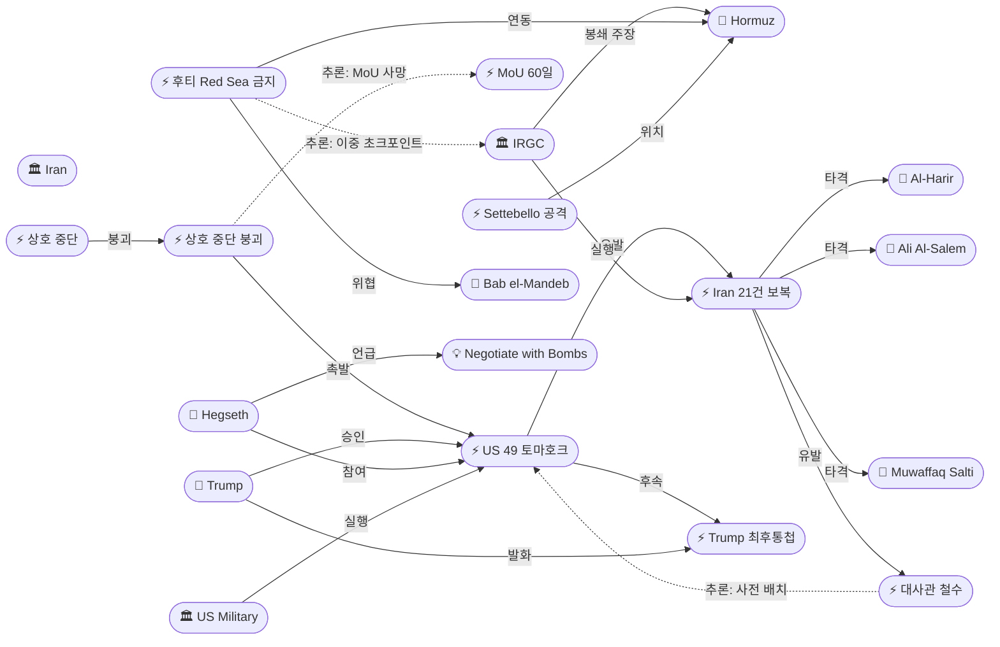
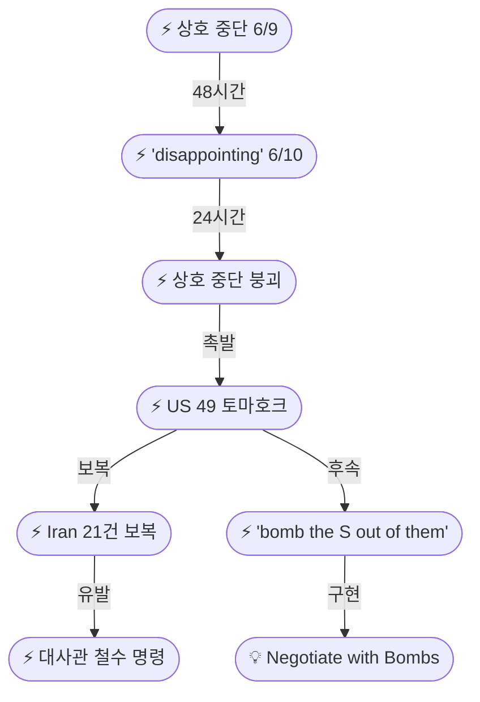
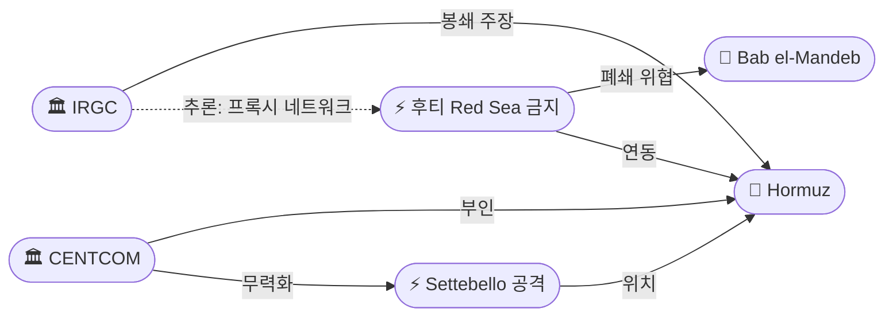

# 2026-06-11 2026 Iran War OSINT 일일 보고서

## 요약

Day 104. **상호 중단 48시간 만에 완전 붕괴 — 전쟁 개시 이후 최대 규모의 상호 에스컬레이션이 발생했다.** 트럼프는 상황실에서 밴스/쿠슈너/위트코프와 함께 이란 본토에 대한 **49발 토마호크 미사일 + 전투기 폭격**을 승인했으며, 표적은 테헤란에서 약 40마일 거리까지 접근했다. 이란은 즉각 **4개국 미군기지에 대한 21건의 보복 공격**(이라크 Al-Harir, 쿠웨이트 Ali Al-Salem, 요르단 Muwaffaq Salti, 바레인 제5함대)으로 대응했다. 미 국무부는 **바그다드 대사관 비필수 인력 철수 명령**을 발동하고 바레인/쿠웨이트 자발적 출국과 군 부양가족 퇴거를 허용했다 — 대규모 공습 임박의 사전 배치 시그널로 해석된다. 헤그세스 국방장관은 **"negotiate with bombs"** 독트린을 공식화했으며, 트럼프는 카타르를 통해 이란에 **"bomb the S out of them tomorrow night"** 최후통첩을 전달했다. 후티는 **Red Sea 이스라엘 항행 완전 금지**를 선언하여 호르무즈+바브엘만데브 양대 해상 초크포인트가 동시에 위협받는 전례 없는 상황이 전개되고 있다.

## 주요 뉴스

### 1. 미국, 이란 본토 49발 토마호크 폭격 — 상황실 대규모 공습 승인
- **출처:** [CBS News](https://www.cbsnews.com/live-updates/iran-war-trump-us-strikes-apache/), [Iran International](https://www.iranintl.com/en/liveblog/202606062776), [ABC News](https://abcnews.com/International/live-updates/iran-live-updates-israel-iran-trade-strikes-trump/?id=133674243)
- **일시:** 2026-06-11
- **내용:** 트럼프는 백악관 상황실에서 부통령 밴스, 쿠슈너, 특사 위트코프와 함께 이란 본토에 대한 대규모 공습을 직접 승인했다. CENTCOM은 **49발의 토마호크 순항미사일**과 전투기를 투입하여 이란 남서부의 **탄약고, 지휘통제 시설, 레이더, 방공 체계**를 타격했으며, 가장 가까운 표적은 테헤란에서 **약 40마일** 거리였다. 헤그세스 국방장관은 **"If we need to negotiate with bombs, we'll negotiate with bombs. And we're very good at it"**이라고 선언하여, 협상과 폭격을 동시 수단으로 보는 **강압 외교 독트린**을 공식화했다. 이는 6/9 Apache 헬리콥터 격추에 대한 보복이자, 6/10 "disappointing" 톤 변화에서 불과 24시간 만에 대규모 군사 행동으로 전환된 것이다. 단일 작전 기준 **전쟁 개시 이후 최대 규모**의 토마호크 투사량이다.
- **상태:** 신규
- **관련 엔티티:** Donald Trump, US Military, CENTCOM, Pete Hegseth, JD Vance, Jared Kushner, Steve Witkoff, Iran

### 2. 이란, 4개국 미군기지 21건 보복 공격 — Al-Harir/Ali Al-Salem/Muwaffaq Salti/바레인
- **출처:** [Euronews](https://www.euronews.com/2026/06/10/tehran-launches-retaliatory-attacks-on-us-bases-following-strikes-on-iran), [Arab News](https://www.arabnews.com/node/2646597/middle-east), [Jerusalem Post](https://www.jpost.com/middle-east/article-898914)
- **일시:** 2026-06-11
- **내용:** IRGC 카탐알안비야 중앙사령부는 미국의 49발 토마호크에 대한 보복으로 **4개국 미군기지에 21건의 미사일·드론 공격**을 실행했다고 발표했다. 주요 표적: (1) **이라크 Al-Harir 기지** — 미사일 공격, (2) **이라크 쿠르디스탄 미군 레이더** — 파괴 주장, (3) **쿠웨이트 Ali Al-Salem 기지** — 드론 공격, (4) **요르단 Al-Azraq/Muwaffaq Salti 기지** — F-35 격납고·미군 지휘통제센터 표적(요르단, 5발 미사일 요격 성공·사상자 없음), (5) **바레인 제5함대** — 드론·미사일 공격. IRGC는 4개 주요 표적을 "파괴했다"고 주장했으나, 요르단은 모든 미사일을 요격했다고 반박했다. 이는 이란의 **사전 계획된 다국적 동시 보복**으로, 21건이라는 수치는 49발 토마호크에 대한 **계산된 비례 대응**을 시사한다.
- **상태:** 신규
- **관련 엔티티:** IRGC, Iran, Al-Harir Air Base, Ali Al-Salem Air Base, Muwaffaq Salti Air Base, Bahrain, Kuwait, Jordan, Iraq

### 3. 미 대사관 철수 명령 — 바그다드 명령 퇴거, 바레인·쿠웨이트 허용 출국
- **출처:** [Newsweek](https://www.newsweek.com/iraq-us-embassy-evacuated-iran-nuclear-talks-2084155), [Times of Israel](https://www.timesofisrael.com/us-begins-evacuating-mideast-embassies-army-bases-as-iran-nuclear-talks-come-to-a-head/), [US Embassy Iraq](https://iq.usembassy.gov/travel-advisory-update-ordered-departure-of-non-emergency-u-s-government-personnel-from-mission-iraq/)
- **일시:** 2026-06-11
- **내용:** 미 국무부는 **바그다드 대사관 비필수 인력에 대한 명령 철수(ordered departure)**를 발동했다. 동시에 **바레인·쿠웨이트** 대사관 비필수 인력과 가족에 대한 **자발적 출국(authorized departure)**을 허용했으며, 국방부는 **중동 전역 미군 부양가족의 자발적 퇴거(voluntary departure)**를 승인했다. 바그다드 **명령 철수**와 바레인/쿠웨이트 **허용 출국**의 구분은 이란 보복의 직접 위험 지역(이라크)과 잠재적 위험 지역(걸프)을 미국이 구분하고 있음을 보여준다. 역사적으로 대사관 명령 철수는 **대규모 군사 작전의 사전 지표**로 기능한다(2003년 이라크 침공 전 바그다드 철수 선례). 트럼프는 동시에 핵 합의에 대해 **"I did think so and I'm getting more and more — less confident about it"**이라고 밝혔다.
- **상태:** 신규
- **관련 엔티티:** US Military, Iraq, Bahrain, Kuwait, Donald Trump

### 4. 트럼프, 카타르 경유 최후통첩 — "bomb the S out of them tomorrow night"
- **출처:** [Iran International](https://www.iranintl.com/en/liveblog/202606062776), [CBS News](https://www.cbsnews.com/live-updates/iran-war-trump-us-strikes-apache/)
- **일시:** 2026-06-11
- **내용:** 트럼프는 **카타르를 통해** 이란에 메시지를 전달하며, 49발 토마호크는 **Apache 헬리콥터 격추에 대한 대응**이며 광범위한 분쟁 확대 의도는 아니라고 밝혔다. 그러나 동시에 **"If Iran does not sign a deal, we'll bomb the S out of them tomorrow night"**이라는 최후통첩을 전달했다. 트럼프는 이란이 폭격 중단을 요청하는 전화를 했다고 주장했으나, **IRGC는 이를 부인**했다. 이는 6/8 "I call all the shots" → 6/10 "disappointing" → 6/11 **"bomb the S out of them"**으로 이어지는 **72시간 에스컬레이션 시퀀스**의 정점이다. 헤그세스의 "negotiate with bombs" 독트린이 트럼프의 최후통첩으로 구현된 것이다.
- **상태:** 신규
- **관련 엔티티:** Donald Trump, Iran, Qatar, Pete Hegseth

### 5. IRGC, 호르무즈 "완전 봉쇄" 주장 — CENTCOM 부인
- **출처:** [Iran International](https://www.iranintl.com/en/liveblog/202606062776), [Wikipedia: 2026 Strait of Hormuz crisis](https://en.wikipedia.org/wiki/2026_Strait_of_Hormuz_crisis)
- **일시:** 2026-06-11
- **내용:** IRGC는 미국의 이란 본토 공습을 이유로 **호르무즈 해협을 "완전히 봉쇄(completely closed)"**했다고 선언했다. 그러나 CENTCOM은 이를 즉각 부인하며 **"Commercial ships are continuing to transit in and out of the Strait of Hormuz tonight"**이라고 반박했다. 호르무즈 통행 수준은 전쟁 전 대비 **약 5%**(7일 평균 4.7척/일)로, IRGC의 "완전 봉쇄" 주장은 기존의 부분적 봉쇄 상태를 **에스컬레이션 메시지로 재포장**한 것으로 분석된다. 정보전 차원에서 양측의 호르무즈 통제 내러티브 싸움이 재격화되었다.
- **상태:** 신규
- **관련 엔티티:** IRGC, CENTCOM, Strait of Hormuz

### 6. 후티, Red Sea 이스라엘 항행 완전 금지 선언 — 양대 초크포인트 동시 위협
- **출처:** [Euronews](https://www.euronews.com/2026/06/08/houthis-join-iran-war-fight-threatening-red-sea-shipping-amid-hormuz-closure)
- **일시:** 2026-06-11
- **내용:** 예멘 후티(안사르 알라)는 **"complete and total ban on Israeli maritime navigation in the Red Sea"**를 선언하고, 이란에 대한 공격이 확대될 경우 **바브엘만데브 해협 완전 폐쇄**를 위협했다. 이로써 호르무즈(세계 석유 통과량 ~20%, IRGC 관리)와 바브엘만데브(세계 컨테이너 ~30%, 에너지 ~9%, 후티 관리) **양대 해상 초크포인트가 동시에 위협**받는 전례 없는 상황이 발생했다. 이란의 프록시 네트워크가 글로벌 에너지·물류 공급망 전체를 인질로 잡는 구조가 완성되었다.
- **상태:** 신규
- **관련 엔티티:** Houthis/Ansar Allah, Bab el-Mandeb, Strait of Hormuz, IRGC, Israel

### 7. M/T Settebello 유조선 CENTCOM 무력화 — 3명 인도 선원 실종, 인도 항의
- **출처:** [Euronews](https://www.euronews.com/2026/06/10/one-dead-and-two-missing-in-missile-strike-on-tanker-near-oman), [IMO](https://www.imo.org/en/mediacentre/pressbriefings/pages/imo-statement-on-settebello-attack.aspx)
- **일시:** 2026-06-11 (6/9 공격, 6/11 확인/보도)
- **내용:** CENTCOM은 걸프오만 해상에서 이란으로의 석유 운송을 시도하던 **팔라우 기국 유조선 M/T Settebello**를 무력화했다. 미군 F/A-18이 **기관실에 정밀 무기를 발사**하여 선박을 정지시켰으며, 선박은 화재와 함께 조난 신호를 발신했다. **인도인 선원 3명이 실종**, 21명이 구조되었다. 인도 외교부는 뉴델리 주재 미국 고위 외교관을 소환하여 **"strong protest"**를 전달했다. IMO도 공식 성명을 발표하여 해상 공격을 규탄했다. 이는 미국 해상 봉쇄 이후 **CENTCOM이 무력화한 8번째 비순응 선박**이다.
- **상태:** 신규
- **관련 엔티티:** CENTCOM, M/T Settebello, India, IMO, Strait of Hormuz

### 8. 상호 중단 48시간 내 완전 붕괴 — 외교 트랙 사실상 사망
- **출처:** [CNBC](https://www.cnbc.com/2026/06/07/iran-fires-missiles-israel-ceasefire-strains.html), [Axios](https://www.axios.com/2026/05/28/iran-peace-deal-trump-approval)
- **일시:** 2026-06-11
- **내용:** 6/9 성립된 이란-이스라엘 상호 공격 중단이 **48시간도 채 되지 않아 완전히 붕괴**했다. 에스컬레이션 사이클: Apache 격추(트리거) → 미국 49 토마호크(대응) → 이란 21건 보복(보복) → 대사관 철수(사전 배치) → 트럼프 최후통첩(격상). MoU 60일 프레임워크(ent-456)의 전제였던 **"60일 휴전 연장"**이 군사 에스컬레이션으로 불가능해졌으며, 호르무즈 재개방 협상의 기반인 **상호 신뢰가 완전히 소멸**했다. 트럼프가 "less confident" about a deal이라고 인정한 것은, 외교 트랙이 군사 트랙에 흡수되었음을 의미한다.
- **상태:** 업데이트 (← 2026-06-10 "상호 중단 Day 2")
- **관련 엔티티:** Iran, US Military, Donald Trump, MoU 60-Day Framework

### 9. 레바논: UN, 베이루트 남부 주민 대피 보도 — 이스라엘 헤즈볼라 공습 재강화 위협
- **출처:** [UN News](https://news.un.org/en/story/2026/06/1167615)
- **일시:** 2026-06-11
- **내용:** UN은 이스라엘이 헤즈볼라에 대한 공습 재강화를 위협하는 가운데 **베이루트 남부 교외 주민들이 대피**하고 있다고 보도했다. 미-이란 군사 에스컬레이션이 이란-이스라엘 직접 교전뿐 아니라 **레바논 전선의 동시 격화**로 이어질 가능성이 높아졌다. 이란이 MoU에서 레바논 휴전을 전제조건으로 공식화한 상황에서, 미-이란 교전 확대는 레바논 상황을 더욱 악화시키는 **부정적 피드백 루프**를 형성한다.
- **상태:** 업데이트 (← 2026-06-10 레바논 보도 연속)
- **관련 엔티티:** Lebanon, Israel, Hezbollah, Iran

## 지식그래프

### 오늘의 주요 관계

1. **에스컬레이션 인과 체인:** Apache 격추 → US 49 토마호크 → Iran 21건 보복 → 대사관 철수 → 트럼프 최후통첩. 48시간 내 외교에서 전면 군사 대결로 전환된 5단계 에스컬레이션.
2. **이중 초크포인트 위협 완성:** IRGC 호르무즈 "완전 봉쇄" + 후티 Red Sea 이스라엘 항행 금지 = 양대 글로벌 해상 통로 동시 위협. 세계 석유 ~29%, 컨테이너 ~30%가 인질.
3. **헤그세스 독트린 구현:** "negotiate with bombs" 독트린 → 트럼프 "bomb the S out of them" 최후통첩으로 직접 연결. 협상과 폭격의 동시 추진이라는 새로운 프레임.
4. **MoU 사망 경로:** 상호 중단 붕괴(ent-566) → 군사 에스컬레이션 → MoU 60일 프레임워크(ent-456) 전제 조건 소멸.
5. **대사관 철수 = 사전 배치 시그널:** 바그다드 명령 철수 + 바레인/쿠웨이트 허용 출국 → 더 큰 규모 공습 임박 지표 (2003년 이라크 선례).

### 전체 지식그래프 시각화

### 주제별 세부 그래프: 에스컬레이션 사이클

### 주제별 세부 그래프: 이중 해상 초크포인트

## 온톨로지 변경

| 변경 유형 | 대상 | 근거 |
|----------|------|------|
| 새 엔티티 | ent-556 "Negotiate with Bombs" Doctrine (Concept) | 헤그세스 강압 외교 독트린; 협상과 폭격의 동시 추진 프레임 |
| 새 엔티티 | ent-557 US Strikes on Iran Jun 11 (Event) | 49 토마호크 + 전투기; 테헤란 40mi; 상황실 결정; 전쟁 후 단일작전 최대 규모 |
| 새 엔티티 | ent-558 Iran Retaliatory Strikes Jun 11 (Event) | IRGC 21건 보복; 4개국(이라크/쿠웨이트/요르단/바레인) 동시 공격 |
| 새 엔티티 | ent-559 US Embassy Evacuation Order (Event) | 바그다드 명령 철수; 바레인/쿠웨이트 허용 출국; 군 부양가족 퇴거 |
| 새 엔티티 | ent-560 Al-Harir Air Base (Location) | 에르빌, 이라크; 이란 미사일 타격 대상 |
| 새 엔티티 | ent-561 Ali Al-Salem Air Base (Location) | 쿠웨이트; 이란 드론 공격 대상 |
| 새 엔티티 | ent-562 Muwaffaq Salti Air Base (Location) | 알아즈라크, 요르단; 이란 미사일 5발(전량 요격) |
| 새 엔티티 | ent-563 M/T Settebello Tanker Attack (Event) | CENTCOM F/A-18 기관실 타격; 3명 인도 선원 실종; 인도 항의 |
| 새 엔티티 | ent-564 Houthi Red Sea Maritime Ban (Event) | 이스라엘 항행 완전 금지; 바브엘만데브 폐쇄 위협 |
| 새 엔티티 | ent-565 Trump Ultimatum via Qatar (Event) | "bomb the S out of them tomorrow night"; 카타르 경유 |
| 새 엔티티 | ent-566 Mutual Halt Collapse (Event) | 상호 중단 48시간 내 완전 붕괴; Apache→US공습→이란보복 사이클 |
| 업데이트 | ent-001 Trump | action_jun11: 상황실 49 토마호크 승인; 카타르 최후통첩; "less confident" |
| 업데이트 | ent-002 Iran | action_jun11: 4개국 21건 보복; IRGC 호르무즈 봉쇄 주장 |
| 업데이트 | ent-005 IRGC | action_jun11: 21건 보복 실행; 호르무즈 "완전 봉쇄" 주장 |
| 업데이트 | ent-104 Hegseth | action_jun11: "negotiate with bombs" 독트린 공식화 |
| 업데이트 | ent-456 MoU | status: 군사 에스컬레이션으로 사실상 사망 |
| 업데이트 | ent-544 Mutual Halt | status: 48시간 내 완전 붕괴 |
| 스키마 변경 | 없음 | 모든 신규 항목이 기존 클래스/관계로 표현 가능 |

## 추론 결과

| 추론 | 신뢰도 | 근거 |
|------|--------|------|
| 상호 중단 → 미국 공습 → 이란 보복 (3단계 인과 체인) | 0.88 | 48시간 내 붕괴: 상호 중단의 구조적 결함(비공식성·범위 제한·이행 메커니즘 부재)이 Apache 트리거로 노출 |
| 대사관 철수 = 대규모 공습 임박 사전 배치 시그널 | 0.85 | 바그다드 명령 철수 + 바레인/쿠웨이트 허용 = 2003년 이라크 침공 전 선례; 위험 지역 구분이 타격 계획 반영 |
| IRGC 호르무즈 + 후티 Red Sea = 이중 초크포인트 위협 | 0.82 | 호르무즈(석유 20%) + 바브엘만데브(컨테이너 30%, 에너지 9%) 동시 위협; 이란 프록시 네트워크의 전략적 자산 |
| MoU 60일 프레임워크 사실상 사망 | 0.90 | 60일 휴전 연장 전제 소멸; 호르무즈 재개방 신뢰 기반 파괴; 핵 협상 시작 전 군사 대결 격화 |
| 트럼프 최후통첩 = 헤그세스 독트린 구현 | 0.80 | "bomb the S out of them" + "negotiate with bombs" = 통합 강압 외교 프레임; 협상과 폭격의 동시 추진 |

## 분석 및 평가

**Day 104는 2026년 이란 전쟁의 결정적 전환점이다.** 6/9 성립된 상호 중단이 48시간도 채 되지 않아 완전히 붕괴하였고, 양측 모두 전쟁 개시 이후 가장 공격적인 군사 행동을 감행했다. 이는 단순한 '에스컬레이션'이 아니라, 전쟁의 질적 변화 — 외교 트랙의 군사 트랙 흡수 — 를 의미한다.

**에스컬레이션의 속도와 규모가 전례 없다.** 6/10 "disappointing" 발언에서 불과 24시간 만에 49발 토마호크가 이란 본토에 착탄했으며, 이란은 사전 계획된 것으로 보이는 4개국 동시 21건 보복을 실행했다. 49발이라는 투사량은 단일 작전 기준 전쟁 이후 최대이며, 테헤란 40마일 접근은 이란 수도에 대한 의도적 위협 시그널이다. 이란의 21건은 49발에 대한 계산된 비례 대응이나, 4개국 동시 공격은 사전 계획의 존재를 시사한다.

**헤그세스 "negotiate with bombs" 독트린은 전통적 외교의 근본 전제를 부정한다.** 협상과 폭격이 배타적이 아닌 동시적이라는 프레임은, MoU 프레임워크가 추구했던 '외교적 해결'의 가능성을 구조적으로 제거한다. 트럼프의 "bomb the S out of them tomorrow night" 최후통첩은 이 독트린의 직접적 구현이다.

**대사관 철수는 단순한 안전 조치가 아니라 전략적 시그널이다.** 바그다드 '명령 철수'와 바레인/쿠웨이트 '허용 출국'의 구분은, 미국이 이란 보복의 직접 위험 지역과 잠재적 위험 지역을 명확히 구분하고 있음을 보여준다. 이는 추가적인 대규모 공습이 임박했음을 시사하는 사전 배치이다.

**양대 해상 초크포인트 동시 위협은 전쟁 이후 최초이며, 글로벌 공급망 위기의 새로운 차원을 열었다.** IRGC의 호르무즈 "완전 봉쇄" 주장과 후티의 Red Sea 이스라엘 항행 금지가 결합되면, 세계 석유 약 29%, 컨테이너 약 30%가 동시에 위협받는다. 이란의 프록시 네트워크가 글로벌 에너지·물류 전체를 인질로 잡는 전략적 구조가 완성된 것이다.

**MoU 프레임워크는 사실상 사망했다.** 60일 휴전 연장의 전제가 소멸했고, 호르무즈 재개방 협상의 신뢰 기반이 파괴되었으며, 핵 협상은 시작도 되기 전에 군사적 대결로 대체되었다. 트럼프의 "less confident" 인정은 이를 공식적으로 확인하는 것이다.

## 추적 항목

| 항목 | 최초 보고 | 상태 | 최신 업데이트 |
|------|----------|------|-------------|
| 미-이란 상호 중단 | 2026-06-09 | 붕괴 (Day 104) | 48시간 내 완전 붕괴; Apache→49 토마호크→21건 보복→대사관 철수→최후통첩 |
| MoU 60일 프레임워크 | 2026-05-25 | 사실상 사망 | 군사 에스컬레이션으로 전제 조건 소멸; 트럼프 "less confident" |
| 미국 이란 공습 | 2026-06-11 | 신규 | 49 토마호크 + 전투기; 테헤란 40mi; 상황실 결정; 전쟁 후 최대 단일작전 |
| 이란 4개국 보복 | 2026-06-11 | 신규 | IRGC 21건; Al-Harir/Ali Al-Salem/Muwaffaq Salti/바레인 5th Fleet |
| 미 대사관 철수 | 2026-06-11 | 신규 | 바그다드 명령 철수; 바레인/쿠웨이트 허용; 군 부양가족 퇴거 |
| 호르무즈 해협 | 2026-04-07 | IRGC 완전 봉쇄 주장 | IRGC "completely closed" vs CENTCOM 부인; 정보전 격화 |
| 이중 초크포인트 위협 | 2026-06-11 | 신규 | 호르무즈(IRGC) + 바브엘만데브(후티) 동시 위협; 석유 29%+컨테이너 30% |
| 이스라엘 레바논 작전 | 2026-04-10 | 재격화 위협 | 베이루트 남부 주민 대피; 이스라엘 헤즈볼라 공습 재강화 위협 |
| 파일럿 존 합의 | 2026-06-04 | 위기 지속 | 미-이란 에스컬레이션이 레바논 트랙에 부정적 피드백 |
| 유가 | 2026-04-07 | 불확실 | 군사 에스컬레이션 + 이중 초크포인트 → 상승 압력 예상 |
| 트럼프 최후통첩 | 2026-06-11 | 신규 | "bomb the S out of them tomorrow night"; 48시간 내 후속 조치 관건 |
| 헤그세스 독트린 | 2026-06-11 | 신규 | "negotiate with bombs"; 외교-군사 트랙 통합 프레임 |

## 동향 요약

| 분류 | 상태 | 비고 |
|------|------|------|
| 미-이란 군사 | 전면 에스컬레이션 | 49 토마호크→21건 보복; 상호 중단 완전 붕괴; 전쟁 후 최대 교전 |
| 미-이란 외교 | 사실상 사망 | MoU 전제 소멸; "negotiate with bombs"; "less confident" |
| 대사관 철수 | 사전 배치 | 바그다드 명령/바레인·쿠웨이트 허용; 대규모 공습 임박 시그널 |
| 호르무즈 해협 | 봉쇄 주장 격화 | IRGC "완전 봉쇄" vs CENTCOM 부인; 정보전 |
| Red Sea/바브엘만데브 | 신규 위협 | 후티 이스라엘 항행 완전 금지; 이중 초크포인트 |
| 이스라엘-레바논 | 재격화 위협 | 베이루트 남부 대피; 이스라엘 헤즈볼라 공습 위협 |
| 유가 | 상승 압력 | 군사 에스컬레이션 + 이중 초크포인트 → 불확실성 극대화 |
| 이란 내부 | IRGC 주도 | 21건 동시 보복 = 사전 계획; 외교파 입지 약화 |

## 출처 목록

1. [Trump oversees 49 Tomahawk strikes on Iran from Situation Room — Hegseth: "negotiate with bombs"](https://www.cbsnews.com/live-updates/iran-war-trump-us-strikes-apache/) - CBS News, 2026-06-11
2. [US launches airstrikes on Iran in retaliation for helicopter downing](https://www.iranintl.com/en/liveblog/202606062776) - Iran International, 2026-06-11
3. [Iran live updates: US begins strikes after Hegseth promised 'busy' night](https://abcnews.com/International/live-updates/iran-live-updates-israel-iran-trade-strikes-trump/?id=133674243) - ABC News, 2026-06-11
4. [Tehran fires missiles at Jordan, Kuwait and Bahrain after renewed US strikes on Iran](https://www.euronews.com/2026/06/10/tehran-launches-retaliatory-attacks-on-us-bases-following-strikes-on-iran) - Euronews, 2026-06-11
5. [Jordan, Bahrain and Kuwait deal with Iranian missile and drone attacks](https://www.arabnews.com/node/2646597/middle-east) - Arab News, 2026-06-11
6. [Iran attacks Kuwait, Bahrain, Jordan in retaliation for US strikes](https://www.jpost.com/middle-east/article-898914) - Jerusalem Post, 2026-06-11
7. [US Embassy in Middle East Prepares to Evacuate After Warning From Iran](https://www.newsweek.com/iraq-us-embassy-evacuated-iran-nuclear-talks-2084155) - Newsweek, 2026-06-11
8. [Travel Advisory: Ordered Departure of Non-Emergency Personnel from Mission Iraq](https://iq.usembassy.gov/travel-advisory-update-ordered-departure-of-non-emergency-u-s-government-personnel-from-mission-iraq/) - US Embassy Iraq, 2026-06-11
9. [US begins evacuating Mideast embassies, army bases as Iran nuclear talks come to a head](https://www.timesofisrael.com/us-begins-evacuating-mideast-embassies-army-bases-as-iran-nuclear-talks-come-to-a-head/) - Times of Israel, 2026-06-11
10. [Houthis join Iran war fight, threatening Red Sea shipping amid Hormuz closure](https://www.euronews.com/2026/06/08/houthis-join-iran-war-fight-threatening-red-sea-shipping-amid-hormuz-closure) - Euronews, 2026-06-11
11. [US strikes Iran-bound tanker near Oman, sparking India protest over missing crew](https://www.euronews.com/2026/06/10/one-dead-and-two-missing-in-missile-strike-on-tanker-near-oman) - Euronews, 2026-06-11
12. [IMO Statement on the attack on tanker MT Settebello](https://www.imo.org/en/mediacentre/pressbriefings/pages/imo-statement-on-settebello-attack.aspx) - IMO, 2026-06-11
13. [Trump insists negotiations continuing despite strikes](https://www.cnbc.com/2026/06/07/iran-fires-missiles-israel-ceasefire-strains.html) - CNBC, 2026-06-11
14. [U.S. and Iran reach deal but need Trump's final approval](https://www.axios.com/2026/05/28/iran-peace-deal-trump-approval) - Axios, 2026-06-11
15. [미·이란 협상 다시 교착‥"불발 시 더 큰 공격"](https://imnews.imbc.com/replay/2026/nwtoday/article/6825150_37012.html) - MBC, 2026-06-11
16. [Lebanon: Families flee Beirut as Israel threatens renewed strikes on Hezbollah](https://news.un.org/en/story/2026/06/1167615) - UN News, 2026-06-11
17. [Iran Launches New Missile Attacks on Bahrain and Kuwait After US Strikes](https://gulfnews.com/amp/story/world/mena/iranian-missiles-target-bahrain-and-kuwait-in-fresh-strikes-1.500565582) - Gulf News, 2026-06-11
18. [Iran attacks Bahrain, Kuwait, Jordan — IRGC fires drones and missiles at US bases](https://news24online.com/world/iran-attacks-bahrain-kuwait-jordan-irgc-fires-drones-and-missiles-explosions-reported-at-us-bases/860121/) - News24 Online, 2026-06-11
19. [모건스탠리 "호르무즈 봉쇄 6월 말 넘기면 유가 재급등"](https://news.nate.com/view/20260511n31999) - 아시아경제, 2026-06-11
20. [US evacuations came only a day before attacks](https://responsiblestatecraft.org/iran-israel-evacuations/) - Responsible Statecraft, 2026-06-11
