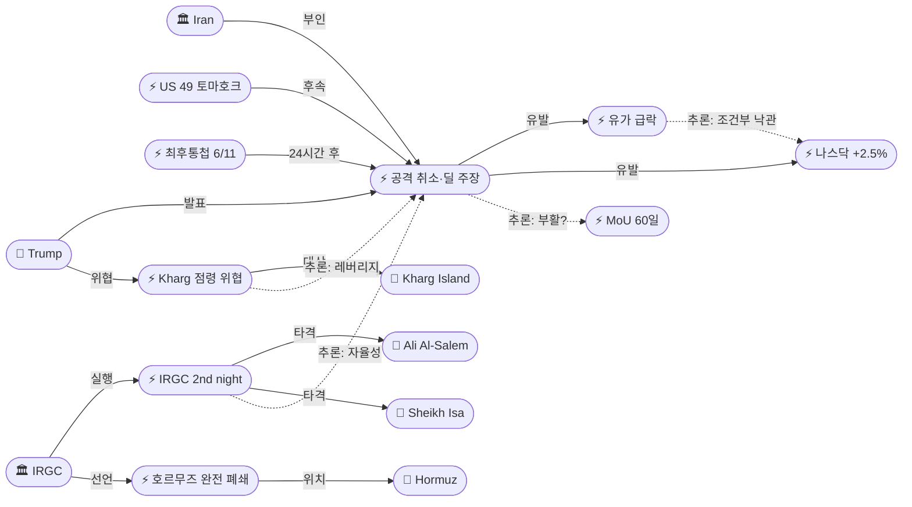
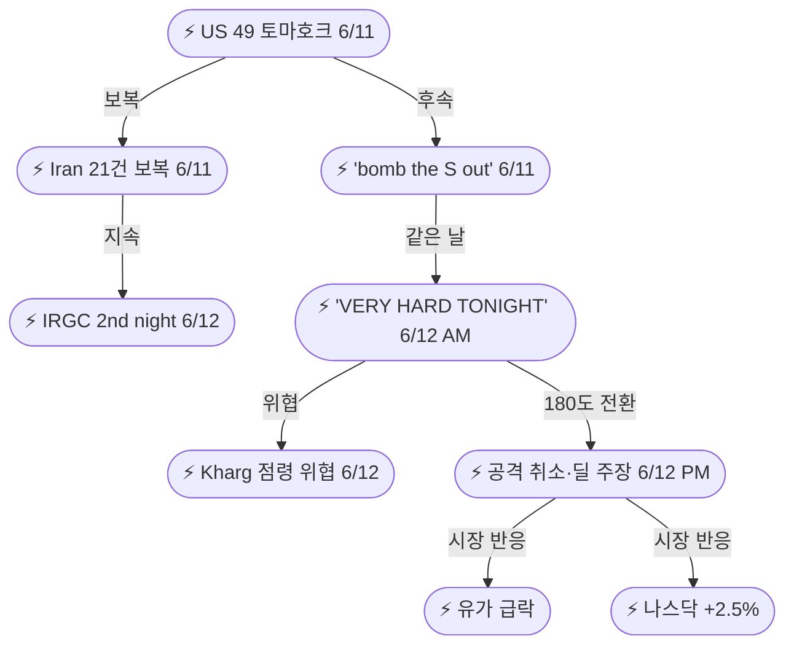
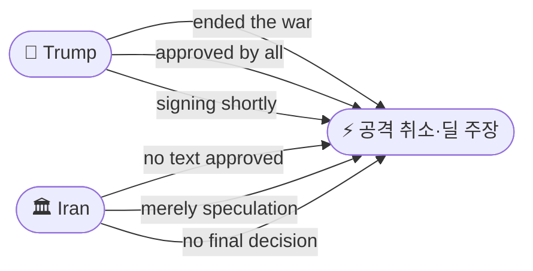

# 2026-06-12 2026 Iran War OSINT 일일 보고서

## 요약

Day 105. **72시간 에스컬레이션-디에스컬레이션 사이클이 극적으로 종결되었다.** 트럼프는 전날 "bomb the S out of them tomorrow night" 최후통첩에서 불과 24시간 만에 예정된 공격을 전격 취소하고, **"전쟁을 끝냈다(ended the war)"**며 11개국(미국·이스라엘·사우디·UAE·카타르·터키·파키스탄·바레인·쿠웨이트·요르단·이집트)이 승인한 딜의 서명이 곧 발표될 것이라 주장했다. 그러나 **이란은 즉각 부인** — Fars는 "어떤 양해각서 텍스트도 승인되지 않았다"고 보도하고, 외교부는 "단순한 추측"이라 일축했다. 트럼프의 딜 임박 주장은 **38번째**다. 한편 IRGC는 트럼프 취소와 무관하게 **2일 연속 미군기지 공격**(Ali Al Salem/Ahmed Al Jaber/Sheikh Isa)을 실행했고, 호르무즈 해협을 **"모든 해상 교통에 폐쇄"**했다고 선언하며 유조선 2척을 공격했다. 시장은 급반전 — 유가는 Brent $90.38(-3%)로 급락하고 나스닥은 2.5% 급등했다.

## 주요 뉴스

### 1. 트럼프, 이란 공격 전격 취소 — "전쟁을 끝냈다", 딜 서명 곧 발표
- **출처:** [NPR](https://www.npr.org/2026/06/11/nx-s1-5854970/trump-iran-peace-deal-cancel-strikes), [CNN](https://www.cnn.com/2026/06/11/world/live-news/iran-war-trump-israel-hnk), [Fox News](https://www.foxnews.com/politics/trump-says-hes-canceled-iran-strikes-adds-potential-deal-signing-to-announced-shortly)
- **일시:** 2026-06-12
- **내용:** 트럼프는 Truth Social을 통해 예정된 이란 공격과 폭격을 **전격 취소**했다고 발표했다. "논의가 이란 최고 지도부까지 올라갔고 승인되었다"며, "최종 쟁점의 개념과 세부사항이 모든 관련 당사자에 의해 승인되었다"고 주장했다. 승인 국가로 **미국·이스라엘·사우디아라비아·UAE·카타르·터키·파키스탄·바레인·쿠웨이트·요르단·이집트** 등 11개국을 거명했다. 별도 발언에서 "이란과의 전쟁을 해결했다(made a great settlement)"며 "문서 최종화를 거쳐 며칠 내 유럽에서 서명할 것"이라 밝혔다. 해상 봉쇄는 **거래 최종화까지 완전 유지**한다고 재확인했다. 이는 전날 "bomb the S out of them tomorrow night" 최후통첩에서 **24시간 만의 180도 전환**이다.
- **상태:** 신규
- **관련 엔티티:** Donald Trump, Iran, Israel, Saudi Arabia, UAE, Qatar, Turkey, Pakistan

### 2. 이란, 딜 공식 부인 — "승인된 텍스트 없다", "단순 추측"
- **출처:** [Axios](https://www.axios.com/2026/06/11/trump-cancel-iran-strikes-deal-strait), [NBC News](https://www.nbcnews.com/world/iran/live-blog/live-updates-us-strikes-iran-trump-hormuz-closed-rcna349554)
- **일시:** 2026-06-12
- **내용:** 이란은 트럼프의 딜 종결 주장을 즉각 부인했다. IRGC 산하 반관영 통신 **Fars**는 "이란 협상팀에 가까운 정보통"을 인용하여 **"미국과의 양해각서 예비 텍스트가 승인된 바 없다"**고 보도했다. 이란 외교부 대변인은 합의 보도를 **"단순한 추측(merely speculation)"**이라 일축하며 **"최종 결정이 내려지지 않았다"**고 밝혔다. 이는 트럼프가 딜 임박을 주장한 **38번째 사례**로, 이전 37회 모두 이란의 부인 또는 무응답으로 이어졌다. 트럼프의 "approved at highest level" vs 이란의 "no text approved" — **역대 최대 메시지 격차**가 기록되었다.
- **상태:** 업데이트 (← 2026-06-11 MoU 붕괴)
- **관련 엔티티:** Iran, Donald Trump, Fars News Agency

### 3. 트럼프, Kharg Island 점령 위협 — "이란 석유·가스 시장 완전 장악"
- **출처:** [Euronews](https://www.euronews.com/2026/06/11/us-will-seize-and-control-irans-kharg-island-and-other-key-oil-facilities-trump-says), [CNBC](https://www.cnbc.com/2026/06/11/trump-says-us-will-seize-kharg-island-and-other-oil-infrastructure-points.html), [Axios](https://www.axios.com/2026/06/11/trump-iran-strikes-kharg-island-oil)
- **일시:** 2026-06-12
- **내용:** 트럼프는 Truth Social에 **"머지않은 미래에 Kharg Island와 기타 석유 인프라 지점을 확보하고, 베네수엘라에서처럼 이란의 석유·가스 시장을 완전히 장악할 것"**이라고 게시했다. Kharg Island는 이란 원유 수출의 **약 90%**가 통과하는 핵심 시설이다. 그러나 이후 Fox News 인터뷰에서 **"미국이 그럴 배짱이 있는지 모르겠다(not sure America has the stomach)"**고 인정했다. 이는 기존의 폭격·봉쇄·제재와 구별되는 **새로운 에스컬레이션 유형 — 영토 점령 위협** — 으로, 실행 의지는 불확실하나 협상 레버리지로서의 기능을 한다.
- **상태:** 신규
- **관련 엔티티:** Donald Trump, Kharg Island, Iran

### 4. IRGC, 2일 연속 미군기지 공격 — Ali Al Salem/Ahmed Al Jaber/Sheikh Isa
- **출처:** [CNN](https://www.cnn.com/2026/06/09/world/live-news/iran-war-trump-israel), [CGTN](https://news.cgtn.com/news/2026-06-11/Iran-strikes-US-bases-in-Middle-East-closes-Hormuz-Strait-1NTsYjGIKje/p.html), [Al Jazeera](https://www.aljazeera.com/news/2026/6/10/iran-strikes-bahrain-and-jordan-in-retaliation-for-us-attacks-in-hormuz)
- **일시:** 2026-06-12
- **내용:** IRGC는 트럼프의 공격 취소 발표와 무관하게 **2일 연속** 미군기지에 대한 보복 공격을 실행했다. 주요 표적: (1) **쿠웨이트 Ali Al Salem 공군기지** — 미사일/드론 공격, (2) **쿠웨이트 Ahmed Al Jaber 공군기지** — 미사일 공격(신규 표적), (3) **바레인 Sheikh Isa 공군기지** — 미사일 공격(신규 표적). IRGC는 **2파에 걸쳐 18개 표적**을 타격했다고 주장하며, 요르단 Al-Azraq 기지 F-35 격납고 파괴를 주장했다. 미군 관계자는 **"중대한 피해 없음"**, 거의 모든 미사일/드론이 요격되었다고 반박했다. IRGC가 외교적 시그널(트럼프 취소)에 **무반응하며 군사 작전을 지속**한 것은 이란 내 IRGC 자율성과 강경파/온건파 분열을 재확인한다.
- **상태:** 신규
- **관련 엔티티:** IRGC, Ali Al-Salem Air Base, Ahmed Al Jaber Air Base, Sheikh Isa Air Base, US Military

### 5. 이란, 호르무즈 "모든 해상 교통 폐쇄" 공식 선언 — 유조선 2척 공격
- **출처:** [CGTN](https://news.cgtn.com/news/2026-06-11/Iran-strikes-US-bases-in-Middle-East-closes-Hormuz-Strait-1NTsYjGIKje/p.html), [Washington Post](https://www.washingtonpost.com/world/2026/06/11/iran-targets-five-us-bases-raising-fears-return-all-out-war/)
- **일시:** 2026-06-12
- **내용:** 이란 군부는 호르무즈 해협이 **"모든 해상 교통에 폐쇄(closed to all marine traffic)"**되었다고 공식 선언했다. IRGC 해군은 해협 통과를 시도한 **유조선 2척을 공격**하여 1척을 정지시키고 3척을 회항시켰다. 이는 기존의 **부분 봉쇄(~5% 통행 유지)에서 완전 폐쇄 선언으로의 격상**이다. CENTCOM은 "상선이 계속 통과하고 있다"며 완전 폐쇄를 부인했다. 호르무즈 통행 수준은 전쟁 전 대비 약 5%이며, IRGC의 "완전 폐쇄" 선언은 에스컬레이션 메시지 전쟁의 일환으로 분석된다.
- **상태:** 신규
- **관련 엔티티:** IRGC, Strait of Hormuz, CENTCOM

### 6. 유가 급락 — Brent $90.38(-3%), 상호 중단 이후 최저
- **출처:** [CNBC](https://www.cnbc.com/2026/06/11/brent-wti-oil-prices-us-launches-fresh-strikes-on-iran-.html), [Investing.com](https://www.investing.com/news/commodities-news/oil-rises-2-as-iran-announces-closure-of-strait-of-hormuz-following-us-strikes-4736435)
- **일시:** 2026-06-12
- **내용:** 트럼프의 공격 취소와 딜 임박 주장에 유가가 급락했다. **WTI $87.71/배럴(-2%)**, **Brent $90.38(-3%)**로 마감. 시간 외 거래에서 WTI $86.51(-3.9%), Brent $89.15(-4.2%)까지 추가 하락했다. 장중에는 이란의 호르무즈 완전 폐쇄 선언과 IRGC 공격으로 **상승**했으나, 트럼프 발표 이후 **급반전**했다. 6/9 상호 중단 이후 최저치이며, Brent가 $91 이하로 떨어진 것은 이번이 처음이다.
- **상태:** 신규
- **관련 엔티티:** Strait of Hormuz, Donald Trump

### 7. 트럼프 동일일 180도 전환 — "VERY HARD TONIGHT" → 공격 취소
- **출처:** [NPR](https://www.npr.org/2026/06/10/nx-s1-5853882/us-strike-iran-second-day-renewed-fire), [The Hill](https://thehill.com/policy/defense/5920385-trump-cancels-iran-strikes/)
- **일시:** 2026-06-12
- **내용:** 트럼프는 동일 일 내에 "미국은 이란을 **매우 강력히 타격할 것(VERY HARD TONIGHT)**"이라는 게시물에서 불과 수 시간 만에 **모든 공격을 취소**하고 딜 종결을 주장했다. 오전에는 "더 크고 강력한" 군사 행동을 예고하며 Kharg Island 점령을 위협했으나, 저녁에는 공격을 취소하고 "전쟁을 끝냈다"고 선언했다. 이 패턴은 4/21 휴전 무기한 연장(아침 연장 거부 → 오후 연장 발표), 5/23 '50/50 딜/폭격'(아침 폭격 시사 → 오후 딜 주장)에 이은 **3번째 동일일 180도 전환**이다. 트럼프는 전쟁 기간 중 최소 **38차례** 딜이 임박했다고 주장했으며, 모두 미성사되었다.
- **상태:** 신규
- **관련 엔티티:** Donald Trump

### 8. 나스닥 2.5% 급등 — 시장, 디에스컬레이션 즉각 반영
- **출처:** [헤럴드경제](https://biz.heraldcorp.com/article/10770114), [파이낸셜뉴스](https://www.fnnews.com/news/202606120353157097)
- **일시:** 2026-06-12
- **내용:** 트럼프의 이란 폭격 취소 발표에 뉴욕 증시가 **즉각 급등**했다. **나스닥 +2.5%**는 전쟁 관련 단일 뉴스에 대한 가장 급격한 시장 반응 중 하나다. 유가 급락(-3%)과 증시 급등(+2.5%)이 동시에 발생한 것은, 시장이 디에스컬레이션 시그널을 에너지 비용 감소와 위험 프리미엄 축소로 즉각 반영한 결과다. 다만 이란의 공식 부인과 38회 실패 히스토리를 감안하면 **조건부 낙관**이며, 이란이 확인하지 않으면 급반전 가능성이 높다.
- **상태:** 업데이트 (← 2026-06-11 시장 보도)
- **관련 엔티티:** Donald Trump, US Stock Market

## 지식그래프

### 오늘의 주요 관계

1. **에스컬레이션→디에스컬레이션 급선회:** 49 토마호크(6/11) → 21건 보복(6/11) → 2nd night attacks(6/12) → 트럼프 공격 취소(6/12) → "ended the war" 주장. 72시간 사이클.
2. **트럼프-이란 메시지 격차 최대:** "approved at highest level" + "ended the war" vs "no text approved" + "merely speculation". 38번째 딜 임박 주장.
3. **IRGC 자율성 재확인:** 트럼프 취소에도 2일째 공격 지속. IRGC 군사 트랙 ≠ 외교 트랙.
4. **Kharg = 협상 레버리지:** 영토 점령 위협(새 유형) + 실행 의지 불확실 = 강압 외교 도구.
5. **시장의 조건부 반응:** 유가 -3% + 나스닥 +2.5% = 디에스컬레이션 기대. 38회 실패 히스토리 vs 이번에는 다를까.

### 전체 지식그래프 시각화

### 주제별 세부 그래프: 72시간 에스컬레이션-디에스컬레이션 사이클

### 주제별 세부 그래프: 메시지 전쟁

## 온톨로지 변경

| 변경 유형 | 대상 | 근거 |
|----------|------|------|
| 새 엔티티 | ent-567 Trump Strike Cancellation & Deal Claim (Event) | 공격 취소 + 딜 종결 주장; 11개국 합의; 이란 부인 |
| 새 엔티티 | ent-568 Kharg Island Seizure Threat (Event) | Kharg Island 점령 위협; 이란 석유 90% 지점; 실행 의지 불확실 |
| 새 엔티티 | ent-569 IRGC Second Night Attacks (Event) | 2일 연속 미군기지 공격; 18 표적; Ali Al Salem/Ahmed Al Jaber/Sheikh Isa |
| 새 엔티티 | ent-570 Iran Full Hormuz Closure (Event) | "모든 해상 교통 폐쇄" 선언; 유조선 2척 공격; CENTCOM 부인 |
| 새 엔티티 | ent-571 Oil Price Crash Jun 12 (Event) | WTI $87.71 (-2%) / Brent $90.38 (-3%); 상호 중단 이후 최저 |
| 새 엔티티 | ent-572 Sheikh Isa Air Base (Location) | 바레인; IRGC 2nd night 공격 대상 |
| 새 엔티티 | ent-573 Ahmed Al Jaber Air Base (Location) | 쿠웨이트; IRGC 2nd night 공격 대상 |
| 새 엔티티 | ent-574 US Stock Market Rally (Event) | 나스닥 +2.5%; 공격 취소 즉각 반응 |
| 업데이트 | ent-001 Trump | 공격 취소, "ended the war", Kharg 위협, "VERY HARD TONIGHT" → 취소 |
| 업데이트 | ent-002 Iran | 딜 공식 부인; "no text approved"; "merely speculation" |
| 업데이트 | ent-005 IRGC | 2일째 미군기지 공격 지속; 호르무즈 완전 폐쇄; 유조선 2척 공격 |
| 업데이트 | ent-007 Kharg Island | 트럼프 점령 위협 대상 |
| 업데이트 | ent-008 Strait of Hormuz | 완전 폐쇄 선언; 부분→완전 격상 |
| 스키마 변경 | 없음 | 모든 신규 항목이 기존 클래스/관계로 표현 가능 |

## 추론 결과

| 추론 | 신뢰도 | 근거 |
|------|--------|------|
| 트럼프 딜 주장 → MoU 부활 가능성 (잠정) | 0.80 | 38번째 딜 임박 주장; 이란 공식 부인; 이전 37회 모두 미성사 |
| Kharg 위협 = 동시적 강압·외교 레버리지 | 0.85 | 같은 날 위협+취소 = negotiate with bombs 연장선; 실행 의지 부재 자인 |
| IRGC 공격 지속 ≠ 외교 시그널 = 이란 내부 분열 | 0.82 | 트럼프 취소에도 2일째 공격; IRGC 자율적 군사 트랙; 4/18 아라그치 모욕 이후 패턴 |
| 유가 급락 + 증시 급등 = 시장의 조건부 낙관 | 0.85 | Brent -3% + 나스닥 +2.5% 동시; 38회 실패 히스토리 → 확인 없으면 급반전 가능 |

## 분석 및 평가

**Day 105는 '강압 외교의 시연'이라는 새로운 패턴의 완결편이다.** 6/10 "disappointing" → 6/11 49 토마호크 + "bomb the S out of them" → 6/12 "VERY HARD TONIGHT" + Kharg 위협 → 6/12 공격 취소 + "ended the war". 이 72시간 시퀀스는 트럼프/헤그세스의 "negotiate with bombs" 독트린의 **완전한 한 사이클**을 보여준다: 최대 에스컬레이션(49발 토마호크) → 최대 위협(Kharg 점령) → 급반전 디에스컬레이션(공격 취소 + 딜 주장).

**핵심 문제는 '38번째 딜 임박 주장'의 신뢰성이다.** 트럼프가 전쟁 기간 중 딜이 임박했다고 주장한 것은 이번이 38번째다. 이전 37회 모두 이란의 부인, 무응답, 또는 추가 에스컬레이션으로 이어졌다. 이번에도 이란은 즉각 부인했다. "approved at highest level"과 "no text approved" 사이의 격차는 역대 최대이며, 양측 중 최소 한 쪽이 사실과 다른 주장을 하고 있다.

**IRGC의 2일째 공격 지속은 이란 내부 분열의 결정적 증거다.** 트럼프가 공격을 취소하고 딜을 주장한 바로 그 시간에, IRGC는 미군기지에 대한 2일째 공격을 실행했다. 이는 IRGC 군사 트랙이 이란 정치/외교 지도부와 **독립적으로 작동**하고 있음을 확인한다. 4/18 IRGC가 아라그치 외무장관을 "바보"라고 공개 모욕한 이후 지속되는 패턴이다.

**Kharg Island 점령 위협은 새로운 에스컬레이션 유형이나 실행 가능성은 낮다.** 이란 원유 수출의 90%가 통과하는 Kharg Island의 물리적 점령은 이란에 대한 **사실상의 전면전 선포**에 해당한다. 트럼프 자신이 "미국이 그럴 배짱이 있는지 모르겠다"고 인정한 것은, 이 위협이 협상 레버리지 도구일 뿐 실제 군사 계획이 아님을 시사한다.

**시장의 반응은 '조건부 낙관'이다.** 유가 -3% + 나스닥 +2.5%는 디에스컬레이션 시그널에 대한 즉각적 반응이다. 그러나 시장은 이전에도 트럼프의 딜 주장에 반응하여 급락 후 급반등을 반복한 바 있다(5/23 $103→$97→$103). 이란의 공식 확인이 없으면 48시간 내 급반전 가능성이 높다.

## 추적 항목

| 항목 | 최초 보고 | 상태 | 최신 업데이트 |
|------|----------|------|-------------|
| 트럼프 딜 종결 주장 | 2026-06-12 | 신규 — 이란 부인 | "ended the war" vs "no text approved"; 38번째 딜 임박 주장; 서명 "며칠 내 유럽" |
| 이란 딜 부인 | 2026-06-12 | 신규 | Fars/FM 공식 부인; "no final decision" |
| Kharg Island 위협 | 2026-06-12 | 신규 | "total control"; 실행 의지 불확실; 이란 석유 90% |
| IRGC 미군기지 연속 공격 | 2026-06-11 | 2일째 지속 | 18 표적 2파; Ali Al Salem/Ahmed Al Jaber/Sheikh Isa; 트럼프 취소 무시 |
| 호르무즈 해협 | 2026-04-07 | 완전 폐쇄 선언 | "모든 해상 교통 폐쇄" + 유조선 2척 공격; CENTCOM 부인 |
| MoU 60일 프레임워크 | 2026-05-25 | 부활 가능? | 6/11 '사실상 사망' → 6/12 트럼프 부활 주장; 이란 부인 |
| 유가 | 2026-04-07 | 급락 | WTI $87.71 / Brent $90.38; 상호 중단 이후 최저; 확인 없으면 급반전 |
| 이스라엘 레바논 작전 | 2026-04-10 | 지속 | 미-이란 에스컬레이션에 따른 연동 리스크 |
| 이란 내부 분열 | 2026-04-18 | 심화 | IRGC 공격 지속 vs 외교부/정치부 톤; 자율적 군사 트랙 |
| 시장 반응 | 2026-06-12 | 조건부 낙관 | 나스닥 +2.5%; 38회 실패 히스토리 → 확인 없으면 반전 |

## 동향 요약

| 분류 | 상태 | 비고 |
|------|------|------|
| 미-이란 군사 | 급선회 (에스컬레이션→취소) | 49 토마호크→2nd night→공격 취소; 72시간 사이클 완결 |
| 미-이란 외교 | 역대 최대 메시지 격차 | "ended the war" vs "no text approved"; 38번째 딜 주장 |
| Kharg Island | 신규 위협 유형 | 영토 점령 위협; 실행 의지 불확실; 협상 레버리지 |
| 호르무즈 해협 | 완전 폐쇄 선언 | "모든 해상 교통 폐쇄"; 유조선 2척 공격; CENTCOM 부인 |
| IRGC 자율성 | 재확인 | 트럼프 취소에도 2일째 공격 지속; 외교 시그널 무시 |
| 유가 | 급락 | Brent $90.38(-3%); 상호 중단 이후 최저; 조건부 |
| 증시 | 급등 | 나스닥 +2.5%; 디에스컬레이션 즉각 반영 |
| 이란 내부 | 강경파/온건파 분열 | IRGC vs 외교부/정치부; 딜 부인 주체도 분열 |

## 출처 목록

1. [Trump now says a peace deal will be announced 'soon,' cancels further strikes](https://www.npr.org/2026/06/11/nx-s1-5854970/trump-iran-peace-deal-cancel-strikes) - NPR, 2026-06-12
2. [Trump claims Iran deal reached, Tehran says no "final decision"](https://www.axios.com/2026/06/11/trump-cancel-iran-strikes-deal-strait) - Axios, 2026-06-12
3. [Trump says US 'ended the war with Iran,' though Tehran has yet to confirm a deal](https://www.cnn.com/2026/06/11/world/live-news/iran-war-trump-israel-hnk) - CNN, 2026-06-12
4. [US will seize and control Iran's Kharg Island and other key oil facilities, Trump says](https://www.euronews.com/2026/06/11/us-will-seize-and-control-irans-kharg-island-and-other-key-oil-facilities-trump-says) - Euronews, 2026-06-12
5. [Trump threatens to seize Kharg Island and other Iran oil infrastructure](https://www.cnbc.com/2026/06/11/trump-says-us-will-seize-kharg-island-and-other-oil-infrastructure-points.html) - CNBC, 2026-06-12
6. [Trump threatens to seize Kharg island as U.S. strikes continue](https://www.axios.com/2026/06/11/trump-iran-strikes-kharg-island-oil) - Axios, 2026-06-12
7. [US bases in Middle East facing second night of retaliatory Iranian attacks](https://www.cnn.com/2026/06/09/world/live-news/iran-war-trump-israel) - CNN, 2026-06-12
8. [Iran strikes US bases in Middle East, closes Hormuz Strait](https://news.cgtn.com/news/2026-06-11/Iran-strikes-US-bases-in-Middle-East-closes-Hormuz-Strait-1NTsYjGIKje/p.html) - CGTN, 2026-06-12
9. [Iran attacks Bahrain, Kuwait, Jordan in retaliation for US strikes](https://www.aljazeera.com/news/2026/6/10/iran-strikes-bahrain-and-jordan-in-retaliation-for-us-attacks-in-hormuz) - Al Jazeera, 2026-06-12
10. [Brent, WTI oil prices: Trump calls off Iran strikes](https://www.cnbc.com/2026/06/11/brent-wti-oil-prices-us-launches-fresh-strikes-on-iran-.html) - CNBC, 2026-06-12
11. [Oil drops as Trump cancels planned strikes against Iran](https://www.investing.com/news/commodities-news/oil-rises-2-as-iran-announces-closure-of-strait-of-hormuz-following-us-strikes-4736435) - Investing.com, 2026-06-12
12. [Trump says he has canceled strikes on Iran, signals move toward deal](https://www.nbcnews.com/world/iran/live-blog/live-updates-us-strikes-iran-trump-hormuz-closed-rcna349554) - NBC News, 2026-06-12
13. [Trump cancels Iran strikes, Iran denies possible deal](https://www.newsnationnow.com/world/iran-strikes-back-after-us-attack/) - NewsNation, 2026-06-12
14. [Trump says he canceled Iran strikes](https://www.foxnews.com/politics/trump-says-hes-canceled-iran-strikes-adds-potential-deal-signing-to-announced-shortly) - Fox News, 2026-06-12
15. [Donald Trump cancels Iran bombing, says deal almost finalized](https://thehill.com/policy/defense/5920385-trump-cancels-iran-strikes/) - The Hill, 2026-06-12
16. [Trump: US will hit Iran VERY HARD tonight, may soon seize Kharg Island](https://www.timesofisrael.com/liveblog_entry/trump-us-will-hit-iran-very-hard-tonight-may-soon-seize-kharg-island-and-tehrans-oil-market/) - Times of Israel, 2026-06-12
17. [Trump vows to hit Iran 'very hard tonight' and later take over its oil and gas sectors](https://www.npr.org/2026/06/10/nx-s1-5853882/us-strike-iran-second-day-renewed-fire) - NPR, 2026-06-12
18. [트럼프, 이란 추가 공습 계획 전격 철회… 협상 타결 시사](https://www.hankookilbo.com/news/article/A2026061203070001952) - 한국일보, 2026-06-12
19. [트럼프 "이란 폭격 취소"…뉴욕증시 급등, 나스닥 2.5%↑](https://biz.heraldcorp.com/article/10770114) - 헤럴드경제, 2026-06-12
20. ["오늘 밤 공격"에서 "공습 취소"로...트럼프의 급선회](https://www.fnnews.com/news/202606120353157097) - 파이낸셜뉴스, 2026-06-12
