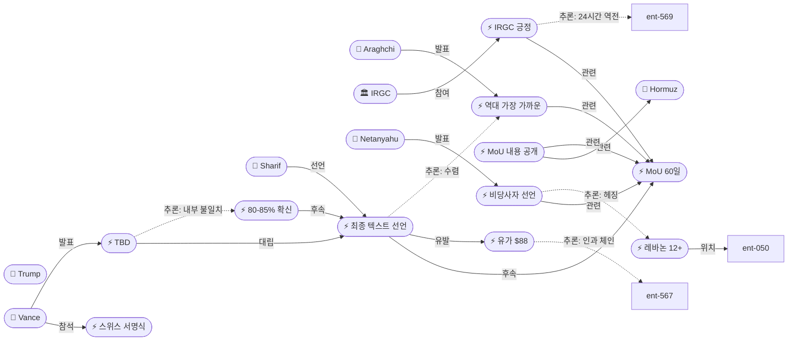
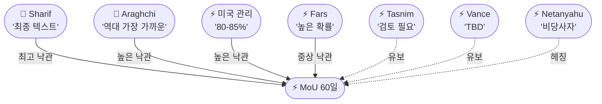
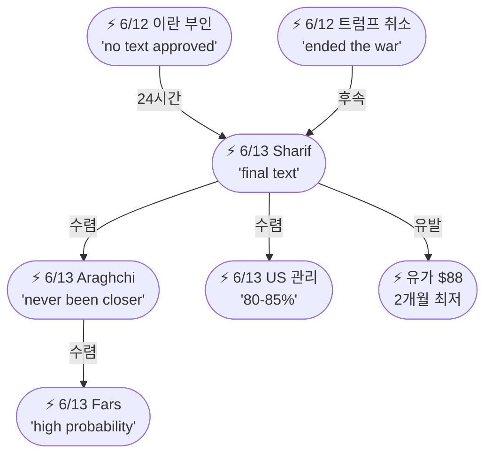

# 2026-06-13 2026 Iran War OSINT 일일 보고서

## 요약

Day 106. **MoU가 24시간 만에 '사망'에서 '역대 가장 가까운' 수준으로 극적 반전했다.** 파키스탄 총리 샤리프가 **"최종, 합의된 텍스트(final, agreed upon text)"**가 마련되었다고 선언하고, 이란 외무장관 아라그치도 MoU가 **"역대 가장 가까웠던 적이 없다(has never been closer)"**고 확인했다. 미국 고위 관리는 서명 확신을 **80-85%**로 상향 조정했다. 가장 주목할 변화는 **IRGC 계열 Fars News의 최초 긍정 시그널** — "높은 확률(high probability)"로 승인될 것이라는 보도다. 그러나 밴스 부통령의 **"아직 TBD"**와 Tasnim의 **"관련 기관 검토 필요"**가 불확실성을 유지한다. MoU 세부 조항이 공개되었다: 호르무즈 즉시 개방/무통행료, 30일 내 정상화, 60일 휴전, 핵 커미트먼트, 제재 해제. 유가는 Brent $88로 추가 급락하여 2개월 최저치를 기록했다. 한편 네타냐후는 **"이스라엘은 MoU의 당사자가 아니다"**라고 거리를 두면서도 트럼프의 핵 제한 약속을 칭찬하는 헤징 전략을 취했고, 이스라엘은 남부 레바논에서 12명 이상을 사살하며 군사 작전을 지속했다.

## 주요 뉴스

### 1. 파키스탄 총리, "최종 합의문 마련" 공식 선언
- **출처:** [Washington Post](https://www.washingtonpost.com/world/2026/06/12/pakistan-prime-minister-says-us-iran-deal-text-finalized/), [RFE/RL](https://www.rferl.org/a/iran-war-us-hormuz-oil-blockade-gulf-israel/33640284.html), [Al Jazeera](https://www.aljazeera.com/news/liveblog/2026/6/12/iran-war-live-trump-claims-tehran-deal-approved-cancels-new-strikes)
- **일시:** 2026-06-13
- **내용:** 파키스탄 총리 셰바즈 샤리프는 X(구 트위터)에 **"미국과 이란 간 최종 합의 문안이 도출되었다(a final, agreed upon text of the peace deal has been reached)"**라고 게시했다. "평화가 지금처럼 가까웠던 적이 없다(Peace has never been this close)"고 덧붙이며, 파키스탄이 **"양측과 긴밀히 협력하여 다음 단계를 마무리하고 있다"**고 밝혔다. 또한 "평화 협정을 방해하려는 끊임없는 허위정보 캠페인을 충분히 인식하고 있다"고 경고했다. 이는 6/12 이란의 공식 부인("어떤 텍스트도 승인되지 않았다")에서 **24시간 만의 역전**이다. 파키스탄은 전쟁 초기부터 미-이란 간 유일한 공식 중재 채널로 기능해왔으며, 이번 선언은 **중재자가 합의 완료를 직접 선언한 첫 사례**다.
- **상태:** 신규
- **관련 엔티티:** Shehbaz Sharif, Pakistan, Iran, United States, MoU

### 2. 미국 고위 관리, 서명 확신 80-85% — "100%는 아니다"
- **출처:** [CNBC](https://www.cnbc.com/2026/06/12/iran-deal-trump-pakistan-sharif.html), [ABC News](https://abcnews.com/Politics/us-potential-iran-war-agreement/story?id=133825956), [CBS News](https://www.cbsnews.com/live-updates/iran-war-us-trump-peace-deal-agreement/)
- **일시:** 2026-06-13
- **내용:** 미국 고위 행정부 관리는 기자들에게 이란과의 합의 서명 확신이 **"아침에 75%였다면 지금은 80-85%"**라고 밝혔다. **"100%는 아니다"**라고 단서를 달았으며, "며칠 내에 이 합의에 서명할 것으로 보지만 아직 최종적이지 않다"고 설명했다. 이란 최고지도자 모즈타바 하메네이가 협상 상태에 **"편안한(comfortable)"** 것으로 알려졌으며, 트럼프는 하메네이 승인 여부에 대해 **"답이 예스라고 이해한다(I understand the answer is yes)"**고 말했다. 최종 미싱 피스는 하메네이의 공식 서명 승인이며, 이는 하메네이가 **"지정 표적(designated target)"** 상태에서 비밀 연락망을 통해 전달해야 하는 구조적 한계가 있다.
- **상태:** 신규
- **관련 엔티티:** Donald Trump, Mojtaba Khamenei, Iran

### 3. 이란 외무장관, MoU "역대 가장 가까운" — 원격 서명 계획
- **출처:** [Axios](https://www.axios.com/2026/06/12/iran-deal-us-ceasefire-signing), [Times of Israel](https://www.timesofisrael.com/liveblog_entry/iran-fm-mou-with-us-has-never-been-closer-media-should-refrain-from-speculating-on-its-content/)
- **일시:** 2026-06-13
- **내용:** 이란 외무장관 아바스 아라그치는 국영 TV에서 미-이란 MoU가 **"그 어느 때보다 가까운 적이 없다(has never been closer)"**고 밝혔다. 합의가 이루어지면 **원격 서명(remote signing)** 방식으로 진행될 것이라고 설명하며, 언론에 내용 추측을 자제해달라고 요청했다. 이는 6/12 이란 외교부의 "단순한 추측" 일축에서 **24시간 만의 극적 톤 전환**이다. 아라그치는 전쟁 기간 중 이란 외교 트랙의 핵심 인물로, 4/18 IRGC에 의해 "바보"라고 공개 모욕당한 이후에도 협상을 주도해왔다.
- **상태:** 신규
- **관련 엔티티:** Abbas Araghchi, Iran, MoU

### 4. IRGC 계열 Fars News, "높은 확률" 승인 — 최초 긍정 시그널
- **출처:** [Iran International](https://www.iranintl.com/en/202606115428), [The Media Line](https://themedialine.org/headlines/netanyahu-says-israel-not-party-to-iran-deal-praises-nuclear-restrictions-as-iran-signals-high-probability-of-approval/)
- **일시:** 2026-06-13
- **내용:** IRGC 산하 반관영 통신 **Fars News**는 이란이 MoU 텍스트를 승인할 **"높은 확률(high probability)"**이 있다고 보도했다. 이는 **IRGC 계열 매체가 MoU에 긍정적 시그널을 보낸 최초의 사례**다. 그러나 동일 IRGC 계열인 **Tasnim**은 "관련 기관의 검토와 최종화가 아직 필요하다"며 유보적 입장을 유지했다. **Fars 긍정 vs Tasnim 유보**의 이중 메시지는 IRGC 내부에서도 의견이 갈리고 있거나, 의도적 역할 분담(긍정 시그널 + 협상 레버리지 유지)일 수 있다. 맥락: IRGC는 4/18 아라그치를 "바보"로 공개 모욕하고, 5/29 바게리카니가 합의를 부인하고, 6/12에는 트럼프 취소에도 미군기지를 2일째 공격하는 등 일관되게 반-MoU 입장을 취해왔다. 이번 Fars 보도는 그 패턴의 **첫 번째 이탈**이다.
- **상태:** 신규
- **관련 엔티티:** IRGC, Fars News, Tasnim, MoU

### 5. MoU 세부 조항 공개 — 호르무즈 즉시 개방, 핵 커미트먼트
- **출처:** [Axios](https://www.axios.com/2026/06/12/iran-deal-mou-strait-open-sanctions-relief), [NBC News](https://www.nbcnews.com/world/iran/live-blog/live-updates-us-iran-drones-trump-deal-war-hormuz-tehran-rcna349750), [ABC News](https://abcnews.com/Politics/us-potential-iran-war-agreement/story?id=133825956)
- **일시:** 2026-06-13
- **내용:** MoU의 주요 조항이 공개되었다: (1) **호르무즈 해협 즉시 개방**, 통행료 없이 30일 내 전쟁 전 수준으로 정상화; (2) **60일 휴전 연장**; (3) **핵 커미트먼트** — 핵무기를 절대 보유하지 않겠다는 약속, 농축 우라늄 문제 해결; (4) **제재 해제** — 이란의 이행에 연동. 트럼프는 이 합의가 핵 물질 문제를 **"개념적으로(conceptually)"** 다룬다고 표현했는데, 이는 구체적 이행이 아닌 원칙적 합의임을 시사한다. 이란 언론(Mehr News Agency)은 14개 항목 초안에 석유 제재 해제와 호르무즈 30일 내 재개방이 포함되어 있다고 보도했으나, 미사일 프로그램과 대리전 세력은 MoU에서 **제외**되었다고 전했다. 이 조항 구조는 이란의 최대 레버리지(호르무즈 봉쇄)를 즉시 포기하는 대가로 제재 해제를 받는 구조다.
- **상태:** 신규
- **관련 엔티티:** MoU, Strait of Hormuz, Iran, United States

### 6. 유가 추가 급락 — Brent $88, 2개월 최저; Fitch "$70 가능"
- **출처:** [Business Standard](https://www.business-standard.com/markets/news/can-crude-oil-prices-dip-to-70-if-us-iran-sign-peace-deal-analysts-said-this-126061200583_1.html), [Trading Economics](https://tradingeconomics.com/commodity/brent-crude-oil)
- **일시:** 2026-06-13
- **내용:** Brent유가 배럴당 **$88** 수준으로 추가 하락하여 **2개월 최저치**를 기록했다. 금요일 하루 약 **4% 하락**. 6/12 $90.38에서 2거래일 연속 하락. 딜 성사 기대감이 에너지 시장에 본격 반영되기 시작했다. Fitch는 호르무즈가 재개방되면 Brent가 **$70/배럴**까지 하락할 수 있다고 전망했다. 현재 $88에서 $70까지의 추가 **18% 하락 여지**가 있다는 의미다. 분석가들은 Brent의 현재 거래 범위를 **$88-$108**로 제시하며, 딜 성사 vs 결렬에 따라 $20의 편차가 예상된다고 밝혔다. 이전 37회 딜 실패 히스토리를 감안하면 실패 시 **급반등 리스크**가 상존한다.
- **상태:** 신규
- **관련 엔티티:** Strait of Hormuz, Oil Market

### 7. 네타냐후, "이스라엘은 MoU 당사자 아니다" — 핵 제한은 칭찬
- **출처:** [The Media Line](https://themedialine.org/headlines/netanyahu-says-israel-not-party-to-iran-deal-praises-nuclear-restrictions-as-iran-signals-high-probability-of-approval/), [Middle East Monitor](https://www.middleeastmonitor.com/20260612-netanyahu-israel-not-party-to-us-iran-memorandum-of-understanding/), [WION](https://www.wionews.com/world/israel-not-a-party-to-deal-netanyahu-hails-trump-assurances-on-iran-nuclear-curbs-missile-restrictions-1781217252664)
- **일시:** 2026-06-13
- **내용:** 네타냐후 총리실은 트럼프와의 통화 후 **"이스라엘은 양해각서의 당사자가 아니다(Israel is not a party to the memorandum of understanding)"**라고 밝혔다. 동시에 트럼프의 "최종 합의에 농축 물질 제거, 농축 인프라 해체, 미사일 생산 제한, 이란의 대리전 지원 종료가 포함될 것이라는 약속"에 감사를 표했다. Axios에 따르면 네타냐후는 트럼프의 공격 취소 결정을 **사전에 통보받지 못했다**. 이 전략은 전형적인 **헤징**: 딜 성공 시 핵 제한의 공로를 주장하고, 딜 실패 시 비당사자로서 책임을 회피한다. 한편 이스라엘은 같은 날 남부 레바논에서 12명 이상을 사살하며 MoU와 무관하게 군사 주도권을 유지했다.
- **상태:** 신규
- **관련 엔티티:** Benjamin Netanyahu, Israel, Donald Trump, MoU

### 8. 밴스, "아직 TBD" — 파키스탄 "최종" 선언과 대비
- **출처:** [HouseofSaud](https://houseofsaud.com/sharif-calls-iran-deal-text-final-vance-says-still-tbd/)
- **일시:** 2026-06-13
- **내용:** JD 밴스 부통령은 딜 상태에 대해 **"아직 TBD(still TBD)"**라고 답했다. 이는 파키스탄 총리의 "최종, 합의된 텍스트" 선언, 이란 FM의 "역대 가장 가까운" 발언, 미국 고위 관리의 80-85% 확신과 **의도적으로 대비되는 톤**이다. 밴스는 MoU 서명식 참석 예정자로, 서명 주체가 유보적 발언을 한 것은 두 가지로 해석 가능: (1) **Good cop/bad cop** — 기대치를 낮추어 협상 레버리지 유지; (2) **실질적 불확실성** — 하메네이 최종 승인이 아직 확보되지 않은 상태.
- **상태:** 업데이트 (← 2026-06-12 트럼프 딜 종결 주장)
- **관련 엔티티:** JD Vance, MoU, Shehbaz Sharif

### 9. 스위스 서명식 계획 추진 — 이란 최종 승인 대기
- **출처:** [ABC News](https://abc7news.com/post/us-moving-forward-signing-ceremony-plans-deal-needs-final-approval-iran-sources-say/19282299/)
- **일시:** 2026-06-13
- **내용:** 미국은 MoU 서명식 계획을 **적극 추진**하고 있으며, **스위스**가 유력 개최지로 거론된다. 밴스 부통령이 참석할 예정이다. 다만 소식통은 이란의 **최종 승인이 여전히 필요**하다고 전했다. 트럼프는 "토요일 정도면 상당한 진전이 있을 것"이라 말했으나 정확한 시점은 밝히지 않았다. 아라그치는 원격 서명 가능성을 언급하여, 미국(스위스 대면)과 이란(원격)의 서명 방식이 다를 수 있음을 시사했다. 이는 이란 최고지도자가 "지정 표적" 상태여서 대면 서명이 사실상 불가능하기 때문이다.
- **상태:** 신규
- **관련 엔티티:** JD Vance, Switzerland, MoU

### 10. 이스라엘, 남부 레바논 공습 지속 — 12명 이상 사망, LAF 경고
- **출처:** [Daily Sabah](https://www.dailysabah.com/world/mid-east/at-least-12-people-killed-in-continued-israeli-strikes-on-s-lebanon/amp), [PBS](https://www.pbs.org/newshour/amp/world/lebanese-army-warns-israeli-airstrikes-might-force-it-to-freeze-cooperation-with-ceasefire-committee)
- **일시:** 2026-06-13
- **내용:** 이스라엘은 미-이란 딜 낙관론과 무관하게 남부 레바논에 대한 공습을 지속하여 시돈을 포함한 지역에서 **12명 이상**이 사망했다. 레바논군(LAF)은 이스라엘 공습이 계속되면 **휴전위원회와의 협력을 동결**할 수 있다고 경고했다. 이는 6/4 워싱턴 회담에서 합의된 '파일럿 존'(LAF 독점 통제 구역) 이행 가능성에 중대한 의문을 제기한다. 네타냐후의 "MoU 비당사자" 발언과 동시에 레바논 공습을 지속한 것은, MoU 성패와 무관하게 이스라엘의 **독자적 군사 주도권을 유지하겠다는 의지**를 보여준다.
- **상태:** 업데이트 (← 이전 레바논 공습)
- **관련 엔티티:** Israel, Lebanon, LAF, Hezbollah

## 지식그래프

### 오늘의 주요 관계

1. **MoU 수렴 시퀀스:** 6/12 이란 부인 → 6/13 파키스탄 "최종 텍스트" → 미국 80-85% → 이란 FM "역대 가장 가까운" → Fars "높은 확률". 5자 동시 긍정, 그러나 수위 차이.
2. **MoU 발산 시퀀스:** 밴스 "TBD" ↔ 파키스탄 "최종" ↔ Tasnim "검토 필요". 같은 딜에 대해 관여 수준별 해석 격차.
3. **IRGC 24시간 역전:** 6/12 미군기지 2일째 공격 → 6/13 Fars "높은 확률". 군사 에스컬레이션과 외교 수용이 24시간 내 공존.
4. **네타냐후 헤징-레바논 병행:** "당사자 아니다" + 핵 칭찬 + 12명 사살 = 딜과 무관한 군사 주도권 유지.
5. **유가 인과 체인:** 트럼프 딜 주장(6/12) → 파키스탄 확인(6/13) → Brent $90.38→$88. 2일 연속 하락, Fitch $70 시나리오.

### 전체 지식그래프 시각화

### 주제별 세부 그래프: 5자 메시지 불일치 매트릭스

### 주제별 세부 그래프: MoU 24시간 역전 타임라인

## 온톨로지 변경

| 변경 유형 | 대상 | 근거 |
|----------|------|------|
| 새 엔티티 | ent-575 Pakistan Final Text Declaration (Event) | Sharif "최종 합의문" 선언; 중재자 첫 공식 합의 완료 선언 |
| 새 엔티티 | ent-576 US 80-85% Confidence (Event) | 미 고위관리 서명 확신 상향; 75%→80-85% |
| 새 엔티티 | ent-577 Iran Never Been Closer (Event) | Araghchi MoU 역대 최근접 발언; 원격 서명 계획 |
| 새 엔티티 | ent-578 IRGC First Positive Signal (Event) | Fars "높은 확률"; IRGC 계열 최초 긍정 |
| 새 엔티티 | ent-579 MoU Contents Revealed (Event) | 호르무즈 즉시 개방/무통행료/30일/60일 휴전/핵/제재 |
| 새 엔티티 | ent-580 Oil Price Crash to $88 (Event) | Brent 2개월 최저; Fitch $70 시나리오 |
| 새 엔티티 | ent-581 Switzerland Signing Plan (Event) | 서명식 장소·참석자 계획; Vance 참석 |
| 새 엔티티 | ent-582 Netanyahu Not Party (Event) | "MoU 비당사자" + 핵 칭찬 = 헤징 |
| 새 엔티티 | ent-583 Vance Still TBD (Event) | 밴스 유보; 파키스탄 "최종"과 대비 |
| 새 엔티티 | ent-584 Lebanon 12+ Killed Jun 13 (Event) | S. Lebanon 공습 지속; LAF 경고 |
| 업데이트 | ent-456 MoU 60-day | '사실상 사망'→'역대 가장 가까운' 극적 반전 |
| 업데이트 | ent-031 Sharif | 핵심 중재자→최종 텍스트 선언자 역할 격상 |
| 업데이트 | ent-036 Araghchi | '부인'(6/12)→'역대 가장 가까운'(6/13) |
| 업데이트 | ent-005 IRGC | 미군기지 공격(6/12)→Fars 긍정(6/13) 24시간 역전 |
| 업데이트 | ent-008 Hormuz | MoU 즉시 개방/무통행료 조항 공개 |
| 업데이트 | ent-051 Netanyahu | 비당사자 선언 + 핵 칭찬 = 헤징 |
| 스키마 변경 | 없음 | 기존 클래스/관계로 표현 가능 |

## 추론 결과

| 추론 | 신뢰도 | 근거 |
|------|--------|------|
| IRGC 24시간 역전: 미군기지 공격(6/12) → Fars 긍정(6/13) = 이중 트랙 | 0.80 | 군사 압박과 정치적 수용 병존; 내부 심의 완료 가능성 |
| 파키스탄-이란 FM 수렴 = 다자 교차 검증 | 0.85 | 독립 2자의 긍정 수렴; 단, Tasnim/밴스 유보가 완전 합의 부정 |
| 유가 2일 연속 하락 인과 체인 | 0.78 | 트럼프 딜(6/12) → 파키스탄 확인(6/13) → Brent $93→$90.38→$88 |
| 네타냐후 헤징 + 레바논 병행 = 군사 주도권 유지 | 0.75 | "비당사자" + 12명 사살 = 딜 성패 무관 행동 |
| 밴스-미국 관리 내부 불일치 = 의도적 역할 분담 또는 실질 불확실성 | 0.80 | 'TBD' vs 80-85% = good-cop/bad-cop 또는 하메네이 승인 미확보 |

## 분석 및 평가

**Day 106는 '메시지 수렴의 날'이자 '불완전한 수렴의 날'이다.** 6/12 이란의 공식 부인에서 불과 24시간 만에, 파키스탄 중재자(최종 텍스트), 이란 FM(역대 가장 가까운), 미국 관리(80-85%), IRGC 계열 매체(높은 확률)까지 4자가 동시에 긍정 시그널을 발신했다. 이는 전쟁 106일 만에 가장 높은 수준의 **다자 긍정 수렴**이다.

**그러나 이 수렴은 '불완전'하다.** 밴스의 "TBD", Tasnim의 "검토 필요", 네타냐후의 "비당사자"가 동시에 존재한다. 5개 이상의 당사자가 같은 딜에 대해 서로 다른 수위의 메시지를 발신하는 **다성적(polyphonic) 외교**가 진행 중이다. 핵심 변수는 모즈타바 하메네이의 최종 승인이며, 미국 관리의 "comfortable" 전언과 트럼프의 자기확인("I understand the answer is yes")은 간접적이고 미확인 상태다.

**IRGC 계열 Fars의 최초 긍정은 구조적 의미가 크다.** IRGC는 4/18 아라그치 모욕, 5/29 바게리카니 부인, 6/12 미군기지 공격 등 일관되게 반-MoU 입장을 취해왔다. Fars의 "높은 확률" 보도는 이 패턴의 첫 번째 이탈이며, IRGC 내부에서 MoU 수용 방향으로 심의가 진행되고 있을 가능성을 시사한다. 다만 Tasnim의 "검토 필요"는 IRGC가 아직 최종 결정에 이르지 않았거나, 의도적으로 협상 레버리지를 유지하는 것일 수 있다.

**MoU 세부 조항의 의미:** 호르무즈 즉시 개방/무통행료는 이란의 최대 레버리지를 MoU 서명 즉시 포기한다는 것이다. 이란이 이를 수용한다면, 제재 해제와 동결자산 반환이 이란에게 호르무즈 봉쇄보다 더 큰 가치를 갖고 있음을 의미한다. 핵 커미트먼트가 "개념적(conceptually)" 수준이라는 트럼프의 표현은, 구체적 이행 메커니즘은 60일 후속 협상으로 미뤄졌음을 시사한다.

**시장은 이미 딜 성사를 가격에 반영하기 시작했다.** Brent $88은 상호 중단(6/9) 이후 최저이며, Fitch의 $70 시나리오는 완전 딜 시 추가 18% 하락 가능성을 제시한다. 그러나 이전 37회 딜 실패 히스토리를 감안하면, 이번에도 실패할 경우 **급반등 리스크($88→$100+)**가 상존한다.

**레바논 트랙은 MoU 낙관과 완전히 분리되어 있다.** 12명 이상 사망, LAF 휴전 협력 동결 경고, 네타냐후 비당사자 발언은 MoU의 레바논 조항(있다면) 이행 가능성에 대한 구조적 의문을 제기한다. 이란이 레바논 휴전을 호르무즈/핵 협상의 전제조건으로 내세워왔다는 점에서, 레바논 전선의 지속적 악화는 MoU 이행 단계에서 핵심 걸림돌이 될 수 있다.

## 추적 항목

| 항목 | 최초 보고 | 상태 | 최신 업데이트 |
|------|----------|------|-------------|
| MoU 서명 | 2026-05-25 | 역대 가장 가까운 | 파키스탄 "최종 텍스트"; 이란 FM "역대 가장 가까운"; 미국 80-85%; 스위스 서명식 계획 |
| 하메네이 최종 승인 | 2026-06-13 | 미확인 | 미국 관리: "comfortable"; 트럼프: "yes로 이해"; 직접 확인 없음 |
| IRGC 계열 최초 긍정 | 2026-06-13 | 신규 | Fars "높은 확률" vs Tasnim "검토 필요"; IRGC 이중 메시지 |
| 밴스 "TBD" | 2026-06-13 | 유보 | 서명 주체가 유보; 파키스탄 "최종"과 대비 |
| 호르무즈 해협 | 2026-04-07 | MoU 조항 공개 | 즉시 개방/무통행료/30일 정상화; 이란 최대 레버리지 포기 |
| 유가 | 2026-04-07 | 2일 연속 급락 | Brent $88, 2개월 최저; Fitch $70; 실패 시 급반등 리스크 |
| 이스라엘 레바논 작전 | 2026-04-10 | 지속 | 12+ 사망; LAF 협력 동결 경고; 네타냐후 비당사자 = 무관 작전 |
| 네타냐후 헤징 | 2026-06-13 | 신규 | "비당사자" + 핵 칭찬 + 레바논 공습 = 딜 무관 주도권 유지 |
| 트럼프 딜 주장 | 2026-04-15 | 38~39번째 | 이번은 다자 수렴 동반; 이전과 질적 차이 존재 |
| MoU 세부 내용 | 2026-06-13 | 공개 | 호르무즈/핵/제재/휴전 4대 축; 미사일·대리전 제외 |

## 동향 요약

| 분류 | 상태 | 비고 |
|------|------|------|
| 미-이란 외교 | 역대 가장 가까운 | 5자 긍정 수렴; 단, 밴스 TBD/Tasnim 유보/하메네이 미확인 |
| IRGC 입장 | 최초 긍정 (Fars) | 4/18 '바보' 이후 첫 이탈; Tasnim 유보 = 이중 메시지 |
| MoU 내용 | 공개 | 호르무즈 즉시 개방/핵 개념적/제재 해제/60일 |
| 호르무즈 해협 | MoU 조항 공개 | 즉시 개방/무통행료 = 이란 최대 레버리지 포기 |
| 이스라엘 입장 | 비당사자 헤징 | "당사자 아니다" + 핵 칭찬 + 레바논 공습 지속 |
| 유가 | 2일 연속 급락 | Brent $88 = 2개월 최저; Fitch $70; 불확실 시 반등 |
| 레바논 | 계속 악화 | 12+ 사망; LAF 경고; MoU 이행 걸림돌 가능성 |
| 서명 일정 | 주말 유럽(스위스?) | 밴스 참석; 이란 원격; 하메네이 승인 대기 |

## 출처 목록

1. [Pakistan prime minister says U.S.-Iran deal text finalized](https://www.washingtonpost.com/world/2026/06/12/pakistan-prime-minister-says-us-iran-deal-text-finalized/) - Washington Post, 2026-06-13
2. [Pakistani PM Says Final Text of US-Iran Peace Deal Has Been Reached](https://www.rferl.org/a/iran-war-us-hormuz-oil-blockade-gulf-israel/33640284.html) - RFE/RL, 2026-06-13
3. [Iran war live: Pakistan's PM says 'final text' of US-Iran deal agreed](https://www.aljazeera.com/news/liveblog/2026/6/12/iran-war-live-trump-claims-tehran-deal-approved-cancels-new-strikes) - Al Jazeera, 2026-06-13
4. [Trump administration: Iran deal signing likely in coming days, but not '100%' certain](https://www.cnbc.com/2026/06/12/iran-deal-trump-pakistan-sharif.html) - CNBC, 2026-06-13
5. [What the US says is in the potential Iran war agreement](https://abcnews.com/Politics/us-potential-iran-war-agreement/story?id=133825956) - ABC News, 2026-06-13
6. ["Final, agreed upon text" of U.S.-Iran peace deal has been reached, Pakistan says](https://www.cbsnews.com/live-updates/iran-war-us-trump-peace-deal-agreement/) - CBS News, 2026-06-13
7. [Iranian foreign minister says deal with U.S. "never been closer"](https://www.axios.com/2026/06/12/iran-deal-us-ceasefire-signing) - Axios, 2026-06-13
8. [Iran FM: MOU with US 'has never been closer'](https://www.timesofisrael.com/liveblog_entry/iran-fm-mou-with-us-has-never-been-closer-media-should-refrain-from-speculating-on-its-content/) - Times of Israel, 2026-06-13
9. [Iran likely to approve US MoU text, no final response yet - IRGC outlet](https://www.iranintl.com/en/202606115428) - Iran International, 2026-06-13
10. [Netanyahu Says Israel Not Party to Iran Deal, Praises Nuclear Restrictions](https://themedialine.org/headlines/netanyahu-says-israel-not-party-to-iran-deal-praises-nuclear-restrictions-as-iran-signals-high-probability-of-approval/) - The Media Line, 2026-06-13
11. [Netanyahu: Israel not party to US-Iran memorandum of understanding](https://www.middleeastmonitor.com/20260612-netanyahu-israel-not-party-to-us-iran-memorandum-of-understanding/) - Middle East Monitor, 2026-06-13
12. ['Israel not a party to deal' Netanyahu hails Trump assurances](https://www.wionews.com/world/israel-not-a-party-to-deal-netanyahu-hails-trump-assurances-on-iran-nuclear-curbs-missile-restrictions-1781217252664) - WION, 2026-06-13
13. [What's in the Iran deal Trump says he's ready to sign](https://www.axios.com/2026/06/12/iran-deal-mou-strait-open-sanctions-relief) - Axios, 2026-06-13
14. [Live updates: Pakistan says U.S.-Iran deal text has been reached](https://www.nbcnews.com/world/iran/live-blog/live-updates-us-iran-drones-trump-deal-war-hormuz-tehran-rcna349750) - NBC News, 2026-06-13
15. [Can crude oil prices dip to $70 if US, Iran sign peace deal?](https://www.business-standard.com/markets/news/can-crude-oil-prices-dip-to-70-if-us-iran-sign-peace-deal-analysts-said-this-126061200583_1.html) - Business Standard, 2026-06-13
16. [US moving forward with signing ceremony plans, but deal still needs final approval from Iran](https://abc7news.com/post/us-moving-forward-signing-ceremony-plans-deal-needs-final-approval-iran-sources-say/19282299/) - ABC News, 2026-06-13
17. [Sharif Calls the Iran Deal Text Final. Vance Says 'Still TBD.'](https://houseofsaud.com/sharif-calls-iran-deal-text-final-vance-says-still-tbd/) - HouseofSaud, 2026-06-13
18. [At least 12 people killed in continued Israeli strikes on S. Lebanon](https://www.dailysabah.com/world/mid-east/at-least-12-people-killed-in-continued-israeli-strikes-on-s-lebanon/amp) - Daily Sabah, 2026-06-13
19. [파키스탄 총리 "美·이란 최종 합의문 마련"](https://www.fnnews.com/news/202606130159538449) - 파이낸셜뉴스, 2026-06-13
20. [동결자산·원유 제재 완화 담기나…美·이란 최종 협상](https://www.fnnews.com/news/202606130359485603) - 파이낸셜뉴스, 2026-06-13
