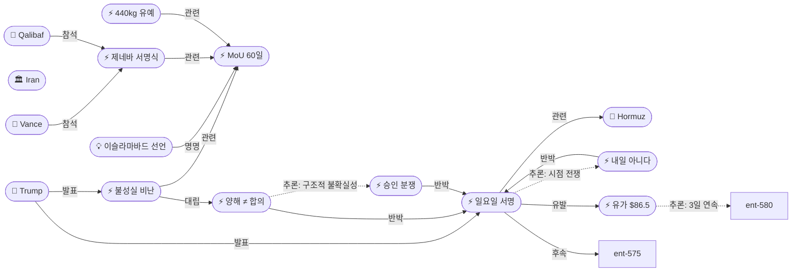
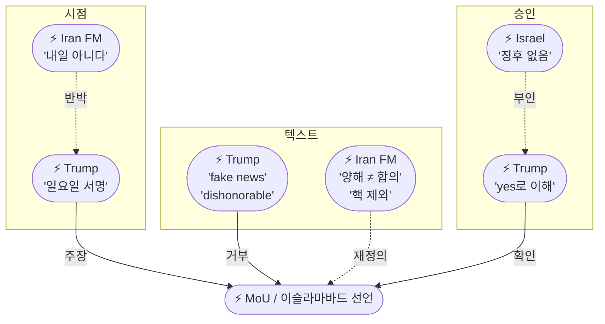
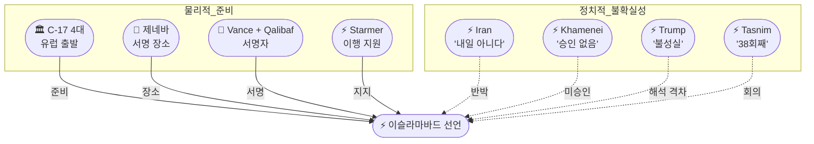

# 2026-06-14 2026 Iran War OSINT 일일 보고서

## 요약

Day 107. **서명 전야에 3중 불일치가 드러났다.** 트럼프는 자신의 생일인 6월 14일(일요일) 이란과의 합의에 서명할 것이라고 발표하며 **"호르무즈가 즉시 모두에게 개방될 것"**이라고 선언했다. 그러나 이란 외무부 대변인 바가에이는 **"내일은 아닐 것(not tomorrow)"**이라며 직접 반박했고, 이스라엘 정보 소스는 하메네이가 MoU 조항을 승인했다는 **"어떤 징후도 없다(no indication)"**고 보고했다. 가장 주목할 신규 정보는 **3중 불일치**다: (1) **시점** — 트럼프 일요일 vs 이란 아니다, (2) **텍스트** — 트럼프 이란 유출 조항을 "fake news"로 거부하며 협상자를 **"very dishonorable people"**이라 비난 vs 이란 FM "합의가 아닌 양해(understanding)", (3) **승인** — 트럼프 "yes로 이해" vs 이스라엘 "승인 없음". 동시에 딜은 공식적으로 **'이슬라마바드 선언(Islamabad Declaration)'**이라 명명되었고, 제네바가 유력 서명 장소로 부상했으며, **C-17 수송기 4대**가 유럽으로 출발하는 등 물리적 준비는 진행 중이다. **440kg 농축 우라늄(60%)이 이란 산악시설에 현상 유지**되는 핵 유예 조항이 확인되었다. 유가는 Brent **$86.5**로 3개월 최저치를 기록하며 3거래일 연속 하락했다.

## 주요 뉴스

### 1. 트럼프, "일요일(6/14) 서명" 공식 발표 — 생일에 맞춘 딜
- **출처:** [CBS News](https://www.cbsnews.com/live-updates/iran-war-us-trump-peace-deal-agreement/), [ABC News](https://abcnews.com/International/live-updates/iran-live-updates-israel-iran-trade-strikes-trump/?id=133674243), [파이낸셜뉴스](https://www.fnnews.com/news/202606140302475002), [뉴스핌](https://www.newspim.com/news/view/20260614000002)
- **일시:** 2026-06-14
- **내용:** 트럼프 대통령은 이란과의 종전 합의가 일요일에 서명될 예정이며, 서명 직후 호르무즈 해협이 **"즉시 모두에게 개방(immediately to everybody)"**될 것이라고 발표했다. 밴스 부통령이 유럽(제네바)에서 미국 대표로 서명할 예정이다. 6월 14일은 트럼프의 생일이며, 일부 분석에서는 서명을 생일에 맞추려는 정치적 동기를 지적했다. 하메네이 승인 여부에 대해 트럼프는 여전히 **"답이 예스라고 이해한다(I understand the answer is yes)"**고 반복했으나, 이는 간접적 확인에 불과하다.
- **상태:** 신규
- **관련 엔티티:** Donald Trump, JD Vance, MoU, Strait of Hormuz

### 2. 이란, "내일은 아닐 것" — 서명 시점 직접 반박
- **출처:** [Athens Times](https://athens-times.com/iranian-foreign-ministry-spokesperson-us-iran-islamabad-memorandum-not-to-be-signed-tomorrow/), [NewsX](https://www.newsx.com/world/tehran-dismisses-pak-pms-us-iran-deal-timeline-says-signing-near-but-not-tomorrow-233983/)
- **일시:** 2026-06-14
- **내용:** 이란 외무부 대변인 이스마일 바가에이는 이슬라마바드 양해각서가 일요일에 서명되지 않을 것이라고 밝혔다. **"내일은 아니더라도 며칠 내에 이루어질 수 있다(even if it's not tomorrow, it could happen in the coming days)"**라고 말하며, **미국 측의 지연(delays on the US side)**을 원인으로 지목했다. 이는 파키스탄 총리의 "24시간 내" 예측과 트럼프의 일요일 서명 발표를 직접 부인하는 것이다. 바가에이는 또한 MoU의 성격을 **"최종 합의가 아닌 양해(not a final agreement but an understanding)"**로 규정하며, **"분쟁 쟁점의 일반적 윤곽을 규정하고 전쟁이 끝남을 명시한다"**고 설명했다.
- **상태:** 신규
- **관련 엔티티:** Ismail Baghaei, Iran, Islamabad Declaration, MoU

### 3. 트럼프, 이란 협상자 "very dishonorable" — 유출 조항 "fake"
- **출처:** [Al Jazeera](https://www.aljazeera.com/news/2026/6/12/dishonorable-trump-says-leaked-iran-ceasefire-terms-fake), [Fox News](https://www.foxnews.com/live-news/us-iran-war-israel-lebanon-trump-deal-june-12), [The Hill](https://thehill.com/homenews/administration/5921744-donald-trump-leaked-iran-deal-middle-east-conflict/)
- **일시:** 2026-06-14
- **내용:** 트럼프는 이란 국영 매체가 유출한 딜 조항에 대해 **"fake news"**라며 **"합의된 조항과 전혀 관계없다(NOTHING to do with the terms that were agreed to, in writing)"**고 반박했다. 이란 협상자들을 **"Very dishonorable people to deal with"**이라 비난하며 **"선의로 거래하는 것이 불가능하다(no such thing as dealing in good faith)"**고 말했다. 핵심 해석 격차: 이란 유출 버전은 **즉시 동결자산 해제 + 이스라엘의 레바논 작전 전면 중단**을 포함하는 반면, 미국 버전은 **국제 검사관의 핵 프로그램 해체 검증 후에만 제재 해제**를 규정한다. 동일 "합의 텍스트"에 대한 이 양립 불가능한 해석은 서명 후 이행 단계에서 즉각 충돌할 구조적 위험을 시사한다.
- **상태:** 신규
- **관련 엔티티:** Donald Trump, Iran, MoU

### 4. '이슬라마바드 선언' — 제네바 서명, C-17 출발, 밴스·칼리바프 서명자
- **출처:** [Tribune India](https://www.tribuneindia.com/news/ceasefire-extension/iran-us-peace-deal-expected-in-geneva-to-include-hormuz-reopening-ceasefire-extension-reports), [Republic World](https://www.republicworld.com/world-news/iran-us-peace-deal-expected-in-geneva-to-include-hormuz-reopening-ceasefire-extension-reports-2026-06-12-127982), [India TV News](https://www.indiatvnews.com/news/world/geneva-or-elsewhere-in-europe-us-iran-near-deal-but-where-will-the-peace-treaty-be-signed-2026-06-13-1044677), [Times of Israel](https://www.timesofisrael.com/liveblog_entry/switzerland-offers-to-host-signing-of-us-iran-peace-deal/)
- **일시:** 2026-06-14
- **내용:** 딜은 공식적으로 **'이슬라마바드 선언(Islamabad Declaration)'**이라 명명되어 파키스탄의 중재 역할을 인정했다. **제네바**가 유력 서명 장소로, 트럼프의 다음 주 프랑스 G7 참석과 가까운 지리적 이점이 있다. 미 공군 **C-17 수송기 4대**가 유럽으로 출발하여 밴스 부통령의 이동을 위한 장비를 운송 중이다. 서명자는 **밴스 부통령(미국)**과 **칼리바프 국회의장(이란)**으로 예상된다. 스위스는 공식적으로 서명식 개최를 제안했다. 물리적 준비(C-17, 장소 선정, 서명자 확정)와 정치적 불확실성(하메네이 승인, 이란 시점 반박)이 공존하는 구조다.
- **상태:** 신규
- **관련 엔티티:** JD Vance, Mohammad Baqer Qalibaf, Islamabad Declaration, Geneva, Switzerland

### 5. 440kg 농축 우라늄, 이란 산악시설에 현상 유지 — 핵 60일 유예
- **출처:** [TechTimes](https://www.techtimes.com/articles/318319/20260613/iran-peace-deal-text-agreed-440kg-enriched-uranium-stays-tehran-during-60-day-talks.htm), [Al Jazeera](https://www.aljazeera.com/news/2026/5/22/irans-enriched-uranium-stockpile-can-it-be-safely-transferred)
- **일시:** 2026-06-14
- **내용:** MoU는 이란의 **440kg 농축 우라늄(60% 농축)**을 이란 산악시설에 현상 유지한 채 **60일 후속 협상**에서 처리하도록 규정했다. 60% 농축은 무기급(90%)에 미치지 못하나, 이 수준에서 90%까지의 도달 시간이 급격히 단축된다. 트럼프는 딜이 핵 물질을 **"개념적으로(conceptually)"** 다룬다고 표현했는데, **"산 깊숙이 묻힌 것을 아무도 접근하지 못했다(nobody has gotten close to)"**고 덧붙였다. 이란 FM 대변인은 **"양측이 핵 문제를 논의하지 않기로 결정했다"**고 확인했다. 이는 MoU의 최대 구조적 허점이다 — 이란의 핵 레버리지가 60일간 그대로 유지되며, 후속 협상이 실패하면 핵 문제는 미해결 상태로 남는다.
- **상태:** 신규
- **관련 엔티티:** Iran, MoU, 440kg Uranium

### 6. 유가 3일 연속 급락 — Brent $86.5, 3개월 최저
- **출처:** [Trading Economics](https://tradingeconomics.com/commodity/brent-crude-oil), [Trading Economics WTI](https://tradingeconomics.com/commodity/crude-oil)
- **일시:** 2026-06-14
- **내용:** Brent유가 배럴당 **$86.5 이하**로 하락하여 **3개월(3월 초 이후) 최저치**를 기록했다. 금요일 **-4%** 하락. WTI는 **$84.88(-3.23%)**. 3거래일 연속 하락: $93(6/12 장전) → $90.38(6/12 장마감) → $88(6/13) → $86.5(6/14 금요). 총 약 **10% 하락**. 시장은 더 이상 단일 딜 발표에 급반전하지 않고, 점진적으로 딜 성사 확률을 상향 조정하는 **구조적 패턴 전환**을 보이고 있다. 이전의 급등/급락/즉각 반전 패턴과 질적으로 다르다. 토요일은 시장 휴장.
- **상태:** 신규
- **관련 엔티티:** Strait of Hormuz, Oil Market

### 7. 스타머-트럼프 통화 — 영국 "이행 지원 준비"
- **출처:** [CBS News](https://www.cbsnews.com/live-updates/iran-war-us-trump-peace-deal-agreement/), [CNN](https://www.cnn.com/2026/06/13/world/live-news/iran-war-trump-israel)
- **일시:** 2026-06-14
- **내용:** 키어 스타머 영국 총리는 트럼프와의 전화에서 **"영국은 어떤 평화 협정의 이행이든 지원할 준비가 되어 있다(stands ready to support the implementation)"**고 밝혔으며, **"합의가 지속 가능하고 항구적인 평화를 보장해야 한다"**고 강조했다. 이는 미-이란 딜에 대한 국제적 지지 확대의 신호이며, 영국이 이행 단계에서 적극적 역할을 모색하고 있음을 시사한다.
- **상태:** 신규
- **관련 엔티티:** Keir Starmer, Donald Trump, MoU

### 8. 이스라엘, 하메네이 승인 "징후 없다" — 트럼프 주장 반박
- **출처:** [Times of Israel](https://www.timesofisrael.com/liveblog_entry/israeli-sources-claim-no-indication-mojtaba-khamenei-has-approved-terms-of-mou/), [CNBC](https://www.cnbc.com/2026/06/12/iran-us-peace-memo-strait-hormuz-oil-sanctions.html)
- **일시:** 2026-06-14
- **내용:** 이스라엘 정보 소스는 모즈타바 하메네이가 MoU 조항을 승인했다는 **"어떤 징후도 없다(no indication)"**고 보고했다. 이는 트럼프의 **"답이 예스라고 이해한다"**를 직접 반박한다. 중재국의 한 외교관은 합의가 이란 측 **"높은 수준(high levels)"**에서 승인되었으나 하메네이 본인에 의한 것은 **"아마 아닐 것(likely not)"**이라고 밝혔다. IRGC 계열 Tasnim은 트럼프의 발언을 2개월 내 **38번째** 동일한 딜 임박 주장으로 카운트했다.
- **상태:** 업데이트 (← 2026-06-13 미국 80-85% 확신)
- **관련 엔티티:** Mojtaba Khamenei, Israel, Donald Trump, MoU

### 9. 딜 조항 해석 격차 — 제재 해제 조건에서 근본적 불일치
- **출처:** [CNBC](https://www.cnbc.com/2026/06/12/iran-us-peace-memo-strait-hormuz-oil-sanctions.html), [CNN](https://www.cnn.com/2026/06/13/world/live-news/iran-war-trump-israel)
- **일시:** 2026-06-14
- **내용:** 미국과 이란이 '합의된 텍스트'에 대해 근본적으로 다른 설명을 제시하고 있다. **미국 버전:** 제재 해제는 국제 검사관이 핵무기 프로그램 해체와 농축 우라늄 인도를 검증한 **이후에만** 이루어진다. **이란 유출 버전:** 동결자산 **즉시 해제** + 이스라엘의 레바논 군사 작전 **전면 중단 의무화**. 이란 FM 대변인은 MoU가 **"최종 합의가 아닌 양해"**이며 **"핵 문제를 논의하지 않기로 결정했다"**고 확인. 이 격차는 "합의의 외관 아래 실질적 불합의"라는 구조적 위험을 제기한다.
- **상태:** 업데이트 (← 2026-06-13 MoU 세부 공개)
- **관련 엔티티:** Iran, United States, MoU

### 10. Tasnim, 트럼프 38번째 딜 임박 주장 카운트
- **출처:** [Iran International](https://www.iranintl.com/en/202606115428)
- **일시:** 2026-06-14
- **내용:** IRGC 계열 Tasnim 통신은 트럼프의 최신 서명 발표를 2개월 내 **38번째** 동일한 딜 임박 주장으로 카운트했다. 이는 IRGC 미디어가 트럼프의 딜 주장에 대해 체계적 회의를 유지하고 있음을 보여주는 정량적 지표다. 6/13 Fars의 "높은 확률" 긍정 시그널과 Tasnim의 38회 카운트가 공존하는 것은 IRGC 내부의 이중 메시지 구조가 여전히 유지되고 있음을 확인한다.
- **상태:** 업데이트 (← 2026-06-13 IRGC 이중 메시지)
- **관련 엔티티:** IRGC, Tasnim, Donald Trump

## 지식그래프

### 오늘의 주요 관계

1. **3중 불일치 구조:** 시점(트럼프 일요일 ↔ 이란 아니다), 텍스트(트럼프 fake ↔ 이란 양해), 승인(트럼프 yes ↔ 이스라엘 없음). 동일 딜에 대해 3개 차원의 불일치가 동시 존재.
2. **물리적 준비 vs 정치적 불확실성:** C-17 4대 출발 + 제네바 장소 + 서명자 확정 ≠ 하메네이 미승인 + 이란 시점 반박 + 텍스트 해석 격차.
3. **이슬라마바드 선언 명명:** MoU가 공식 명칭을 획득 → 파키스탄 중재의 역사적 인정.
4. **핵 유예의 구조적 허점:** 440kg 우라늄 현상 유지 + 핵 논의 명시적 제외 = 이란의 핵 레버리지 60일 보존.
5. **유가 인과 체인:** 3거래일 연속 10% 하락 → 시장의 구조적 패턴 전환(급반전 → 점진적 일방향).

### 전체 지식그래프 시각화

### 주제별 세부 그래프: 3중 불일치 구조

### 주제별 세부 그래프: 물리적 준비 vs 정치적 불확실성

## 온톨로지 변경

| 변경 유형 | 대상 | 근거 |
|----------|------|------|
| 새 엔티티 | ent-585 Trump Sunday Signing (Event) | 일요일(생일) 서명 공식 발표; 호르무즈 즉시 개방 선언 |
| 새 엔티티 | ent-586 Iran Not Tomorrow Pushback (Event) | 바가에이 "내일 아니다"; 미국 측 지연 지목; 파키스탄 타임라인 부인 |
| 새 엔티티 | ent-587 Trump Dishonorable Accusation (Event) | "very dishonorable"; 유출 조항 "fake news"; 해석 격차 공개 |
| 새 엔티티 | ent-588 Islamabad Declaration (Concept) | MoU 공식 명칭; 파키스탄 중재 역할 인정 |
| 새 엔티티 | ent-589 Geneva Signing Ceremony Plan (Event) | C-17 출발; 밴스/칼리바프; 스위스 제안; G7 근접 |
| 새 엔티티 | ent-590 440kg Uranium Deferral (Event) | 60% 농축 우라늄 산악시설 현상 유지; 핵 60일 유예 |
| 새 엔티티 | ent-591 Oil Crash to $86.5 (Event) | Brent 3개월 최저; 3일 연속 -10%; 패턴 전환 |
| 새 엔티티 | ent-592 Starmer-Trump Call (Event) | 영국 이행 지원 약속; 국제 지지 확대 |
| 새 엔티티 | ent-593 Iran Understanding Not Agreement (Event) | "합의 아닌 양해"; 핵 명시 제외; 전전선 종전 |
| 새 엔티티 | ent-594 Khamenei Approval Disputed (Event) | 이스라엘: "징후 없음"; 외교관: "아마 아닐 것"; Tasnim 38회 |
| 업데이트 | ent-001 Trump | 일요일 서명 + 불성실 비난 + fake 거부 + 생일 |
| 업데이트 | ent-041 Vance | 제네바 서명 참석 확정; C-17 출발 |
| 업데이트 | ent-046 Qalibaf | 이란 측 서명자로 확정 |
| 업데이트 | ent-456 MoU | '이슬라마바드 선언' 명명; 3중 불일치 구조 |
| 업데이트 | ent-008 Hormuz | 서명 직후 즉시 개방 선언 |
| 스키마 변경 | 없음 | 기존 클래스/관계로 표현 가능 |

## 추론 결과

| 추론 | 신뢰도 | 근거 |
|------|--------|------|
| 서명 시점 전쟁: 트럼프 일요일(생일) vs 이란 아니다 = 시점 주도권 경쟁 | 0.85 | 양측 서명 의지는 있으나 시점 합의 미완; 하메네이 미승인이 구조적 원인 가능 |
| 텍스트 해석 전쟁: 동일 합의, 양립 불가 해석 = 이행 단계 충돌 예고 | 0.80 | 제재(검증 후 vs 즉시), 레바논(미포함 vs 포함), 성격(합의 vs 양해) 3축 격차 |
| 유가 3일 연속 10% 하락 = 시장 심리 구조 전환 | 0.82 | 이전의 급등/급락/반전 → 점진적 일방향 하락; 딜 성사 확률 지속 상향 반영 |
| 이란 양해 격하 + 하메네이 미승인 = 구조적 연결 가능성 | 0.78 | 하메네이 승인 부재 → 문서 법적 지위 하향 또는 전술적 기대치 관리 |

## 분석 및 평가

**Day 107은 '서명 전야의 3중 불일치'가 드러난 날이다.** 6/13의 '5자 긍정 수렴'에서 불과 24시간 만에, 트럼프의 일요일 서명 발표는 이란의 "내일 아니다", 이스라엘의 "하메네이 승인 없음", 그리고 트럼프 자신의 "불성실" 비난이라는 3중 불일치 구조를 노출시켰다. 이는 "합의는 가까웠으나 '가까움'의 정의가 달랐다"는 이 전쟁의 반복 패턴을 재확인한다.

**텍스트 해석 격차는 가장 심각한 구조적 문제다.** 동일한 '합의 텍스트'에 대해 미국(검증 후 제재 해제 + 레바논 미포함)과 이란(즉시 해제 + 전전선 종전)이 근본적으로 다른 버전을 제시하고 있다. 이란 FM 대변인이 MoU를 "최종 합의가 아닌 양해"로 격하한 것은 세 가지 가능성을 제기한다: (1) 하메네이 최종 승인 부재 → 법적 지위 낮춤, (2) 서명 후 이행에서 해석 주도권 확보 전략, (3) 이란 내부 정치적 안전장치(실패해도 "합의는 아니었다"고 주장 가능).

**물리적 준비와 정치적 불확실성의 공존은 이 딜의 가장 독특한 특징이다.** C-17 4대가 유럽으로 출발하고, 제네바가 장소로 확정되고, 서명자(밴스/칼리바프)가 결정되었으며, 스위스가 공식 제안하고, 영국이 이행 지원을 약속했다. 그러나 동시에 하메네이 승인은 미확인이고, 이란은 일요일 서명을 부인하고, 텍스트 해석은 양립 불가하다. 이 병존은 "딜이 성사될 수는 있으나, 양측이 서로 다른 딜에 서명하고 있을 수 있다"는 위험을 내포한다.

**440kg 우라늄 유예는 MoU의 최대 구조적 허점이다.** 핵 문제를 명시적으로 제외하고 60일 후속 협상으로 미룬 것은, 이란의 핵 레버리지를 온전히 보존한다. 60일 후속 협상이 실패하면, 이란은 호르무즈 개방의 대가를 받으면서 핵 프로그램은 그대로 유지하게 된다. 트럼프의 "개념적으로 다룬다"는 표현은 이 허점의 정치적 포장이다.

**유가의 3일 연속 10% 하락은 시장 심리의 구조적 전환을 보여준다.** 이전에는 딜 발표 → 급락 → 실패 → 즉각 반등의 사이클이었으나, 이번은 점진적 일방향 하락이다. 이는 시장이 이번 딜에 이전과 질적으로 다른 신뢰를 부여하고 있거나, 단순히 딜 피로감(deal fatigue)이 변동성을 줄인 것일 수 있다. 그러나 3중 불일치가 서명 불발로 이어질 경우 급반등 리스크($86.5 → $100+)가 여전히 상존한다.

**Tasnim의 38회 카운트는 메타 분석 도구다.** IRGC 계열 매체가 트럼프의 딜 주장을 체계적으로 추적·카운트하는 것은, 이란 측이 트럼프의 외교적 수사를 신뢰하지 않는 구조적 이유를 정량화한 것이다. 6/13의 Fars 긍정(높은 확률) vs Tasnim 38회 카운트의 공존은 IRGC 내 이중 메시지 전략이 지속되고 있음을 확인한다.

## 추적 항목

| 항목 | 최초 보고 | 상태 | 최신 업데이트 |
|------|----------|------|-------------|
| MoU 서명 | 2026-05-25 | 3중 불일치 | 트럼프 일요일 서명 vs 이란 "아니다" vs 텍스트 격차 vs 승인 미확인 |
| 이슬라마바드 선언 | 2026-06-14 | 신규 | MoU 공식 명칭; 파키스탄 중재 인정; 제네바 서명식 |
| 하메네이 최종 승인 | 2026-06-13 | 미확인 강화 | 이스라엘: "징후 없음"; 외교관: "아마 아닐 것"; Tasnim 38회 |
| 텍스트 해석 격차 | 2026-06-14 | 신규 | 제재(검증 후 vs 즉시) + 레바논(미포함 vs 포함) + 성격(합의 vs 양해) |
| 440kg 핵 유예 | 2026-06-14 | 신규 | 60% 우라늄 산악시설 현상 유지; 핵 명시 제외; 60일 후속 |
| 서명식 물리적 준비 | 2026-06-14 | 진행 중 | C-17 4대 유럽 출발; 제네바; 밴스/칼리바프; 스위스 제안 |
| 호르무즈 해협 | 2026-04-07 | 서명 직후 개방 예정 | 트럼프: "즉시 모두에게"; 무통행료; 30일 정상화 |
| 유가 | 2026-04-07 | 3일 연속 급락 | Brent $86.5 3개월 최저; WTI $84.88; 10% 하락; 패턴 전환 |
| IRGC 이중 메시지 | 2026-06-13 | 지속 | Fars "높은 확률" + Tasnim 38회 카운트 = 이중 구조 유지 |
| 국제 지지 | 2026-06-14 | 확대 | 스타머-트럼프 통화; 영국 이행 지원 약속 |
| 이스라엘 레바논 작전 | 2026-04-10 | 미보도 | 금일 레바논 관련 신규 보도 없음; 추적 지속 |

## 동향 요약

| 분류 | 상태 | 비고 |
|------|------|------|
| 미-이란 외교 | 3중 불일치 | 시점/텍스트/승인 모두 불일치; 물리적 준비는 진행 |
| MoU 명칭 | 이슬라마바드 선언 | 파키스탄 중재 공식 인정; 공식 명칭 획득 |
| 서명 장소 | 제네바 유력 | C-17 출발; 스위스 제안; G7 근접 |
| 서명 시점 | 불일치 | 트럼프 일요일 vs 이란 "아니다" vs 밴스 TBD |
| 핵 쟁점 | 60일 유예 | 440kg 현상 유지; 핵 논의 명시 제외 |
| 텍스트 | 양립 불가 | 제재/레바논/성격 3축 격차 |
| 유가 | 3일 연속 급락 | $86.5 3개월 최저; 구조적 패턴 전환 |
| 국제 지지 | 확대 | 스타머 이행 지원 약속 |
| IRGC 입장 | 이중 메시지 지속 | Fars 긍정 + Tasnim 38회 = 유지 |
| 레바논 | 금일 미보도 | 직접 신규 보도 없으나 추적 지속 |

## 출처 목록

1. [Live Updates: U.S.-Iran peace deal to be signed Sunday, Trump says](https://www.cbsnews.com/live-updates/iran-war-us-trump-peace-deal-agreement/) - CBS News, 2026-06-14
2. [Tehran Dismisses Pak PM's US-Iran Deal Timeline, Says Signing Near But Not Tomorrow](https://www.newsx.com/world/tehran-dismisses-pak-pms-us-iran-deal-timeline-says-signing-near-but-not-tomorrow-233983/) - NewsX, 2026-06-14
3. [Iran Says US-Iran Deal Won't Be Signed Tomorrow](https://athens-times.com/iranian-foreign-ministry-spokesperson-us-iran-islamabad-memorandum-not-to-be-signed-tomorrow/) - Athens Times, 2026-06-14
4. ['Dishonorable': Trump says leaked Iran ceasefire terms fake](https://www.aljazeera.com/news/2026/6/12/dishonorable-trump-says-leaked-iran-ceasefire-terms-fake) - Al Jazeera, 2026-06-14
5. [Iranian negotiators 'very dishonorable people,' Trump says](https://www.foxnews.com/live-news/us-iran-war-israel-lebanon-trump-deal-june-12) - Fox News, 2026-06-14
6. [Trump dismisses 'fake' leaked Iran deal terms](https://thehill.com/homenews/administration/5921744-donald-trump-leaked-iran-deal-middle-east-conflict/) - The Hill, 2026-06-14
7. [Iran-US peace deal expected in Geneva](https://www.tribuneindia.com/news/ceasefire-extension/iran-us-peace-deal-expected-in-geneva-to-include-hormuz-reopening-ceasefire-extension-reports) - Tribune India, 2026-06-14
8. [Iran-US Peace Deal Expected in Geneva](https://www.republicworld.com/world-news/iran-us-peace-deal-expected-in-geneva-to-include-hormuz-reopening-ceasefire-extension-reports-2026-06-12-127982) - Republic World, 2026-06-14
9. [Geneva or elsewhere in Europe: where will the peace treaty be signed?](https://www.indiatvnews.com/news/world/geneva-or-elsewhere-in-europe-us-iran-near-deal-but-where-will-the-peace-treaty-be-signed-2026-06-13-1044677) - India TV News, 2026-06-14
10. [Switzerland offers to host signing](https://www.timesofisrael.com/liveblog_entry/switzerland-offers-to-host-signing-of-us-iran-peace-deal/) - Times of Israel, 2026-06-14
11. [Iran Peace Deal Text Agreed: 440kg Enriched Uranium Stays](https://www.techtimes.com/articles/318319/20260613/iran-peace-deal-text-agreed-440kg-enriched-uranium-stays-tehran-during-60-day-talks.htm) - TechTimes, 2026-06-14
12. [Brent crude oil - Price](https://tradingeconomics.com/commodity/brent-crude-oil) - Trading Economics, 2026-06-14
13. [WTI crude oil - Price](https://tradingeconomics.com/commodity/crude-oil) - Trading Economics, 2026-06-14
14. [Israeli sources: 'no indication' Khamenei approved](https://www.timesofisrael.com/liveblog_entry/israeli-sources-claim-no-indication-mojtaba-khamenei-has-approved-terms-of-mou/) - Times of Israel, 2026-06-14
15. [Trump denies Iran's account of deal terms](https://www.cnbc.com/2026/06/12/iran-us-peace-memo-strait-hormuz-oil-sanctions.html) - CNBC, 2026-06-14
16. [Iran live updates: Trump says agreement signed 'tomorrow'](https://abcnews.com/International/live-updates/iran-live-updates-israel-iran-trade-strikes-trump/?id=133674243) - ABC News, 2026-06-14
17. [Iran war news: Trump says signed Sunday, Tehran pushes back](https://www.cnn.com/2026/06/13/world/live-news/iran-war-trump-israel) - CNN, 2026-06-14
18. [트럼프 "이란과 14일 합의 서명…직후 호르무즈 개방"(종합)](https://www.fnnews.com/news/202606140302475002) - 파이낸셜뉴스, 2026-06-14
19. [트럼프 "이란 평화 합의 14일 서명 예정…호르무즈 모두에게 개방"](https://www.newspim.com/news/view/20260614000002) - 뉴스핌, 2026-06-14
20. [Iran likely to approve US MoU text — IRGC outlet](https://www.iranintl.com/en/202606115428) - Iran International, 2026-06-14
